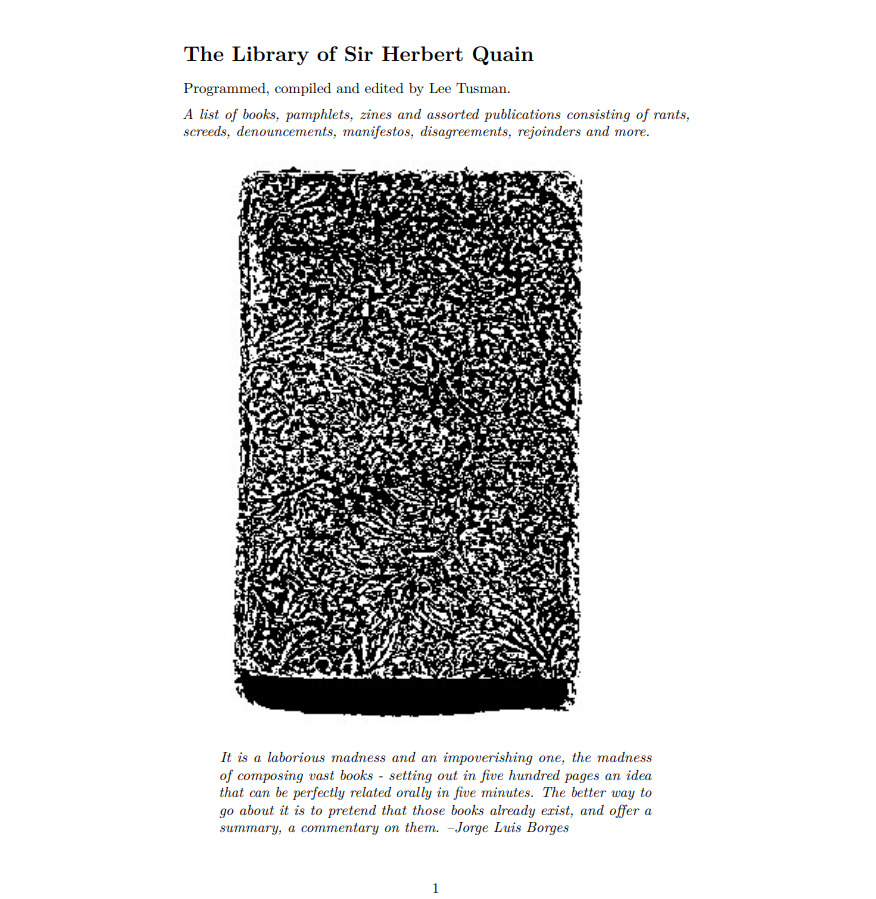

# The Library of Sir Herbert Quain

This is a repo for my [NaNoGenMo 2023](https://github.com/NaNoGenMo/2023) project.

NaNoGenMo is an annual event where programmer-artists generate a novel of at least 50,000 words.

[Initial idea](https://github.com/NaNoGenMo/2023/issues/28)

From the introduction:

Programmed, compiled and edited by Lee Tusman.

*A list of books, pamphlets, zines and assorted publications consisting of rants, screeds, denouncements, manifestos, disagreements, rejoinders and more.*

> *It is a laborious madness and an impoverishing one, the madness of composing vast books - setting out in five hundred pages an idea that can be perfectly related orally in five minutes. The better way to go about it is to pretend that those books already exist, and offer a summary, a commentary on them. --Jorge Luis Borges*

Lee Tusman 2023 

Content: CC BY 

Code: ACSL

## Example output

  
Cover

  
Example page output


### To produce a book

The program outputs markdown, which can then be rendered to lovely latex-rendered output via pandoc.

```
lua main.lua > book.md
pandoc -s book.md -o book.pdf
```
