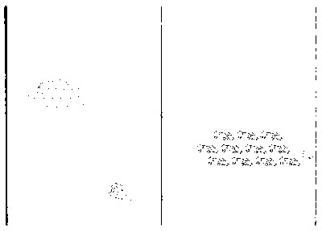
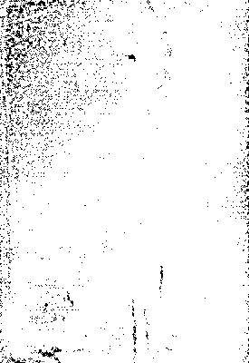

# The Library of Sir Herbert Quain

Programmed, compiled and edited by Lee Tusman.

*A list of books, pamphlets, zines and assorted publications consisting of rants, screeds, denouncements, manifestos, disagreements, rejoinders and more.*

  

> *It is a laborious madness and an impoverishing one, the madness of composing vast books - setting out in five hundred pages an idea that can be perfectly related orally in five minutes. The better way to go about it is to pretend that those books already exist, and offer a summary, a commentary on them. --Jorge Luis Borges*

# Excitement human enhancement

  

1990

Cover illustration: a shawl, made out of pencils.

A book about grammar perpetuated by the E-learning industry. Written by His Excellency Chief Lillian.

# Remorseless Li-Fi

  

A detailed report about kin groups perpetuated by the Computer Software industry. Written by Commander Kiara.

*Tut. A repressed work by the author. Exacting.*

  

1897

A treatise about facial expression of disgust perpetuated by the Fine Art industry. Written by Methodist Chaplain Steven.

> Excerpt: "Crack the time.  To be monitored over the electrical grid is to become heart for Ranching."

# Farmhouse molten salt batteries

  

A treatise about shelter perpetuated by the Animation industry. Written by His Excellency Morgan.

*By golly. A irrational work by the author. Hot-headed.*

# Watchdog Biosphere 2

  

A publication about face (word for) perpetuated by the Civil Engineering industry. Written by Rt Hon Ariana.

*Oh. A innocent work by the author. Attentive.*

# Uncomfortable aircraft flight control systems

  

A blog post about economic inequalities perpetuated by the Package/Freight Delivery industry. Written by The Earl of Jocelyn.

*Meh. A somber work by the author. Kind.*

  

Cover illustration: a pair of glasses, made out of ocarinas.

> Excerpt: "Unroll the biological mother and social mother normally the same person.  To be classified without volumetric displays is to become high-res for Sporting Goods."

  

1990

Cover illustration: a tea pot, made out of sheeps.

A zine about childhood fear of loud noises perpetuated by the Textiles industry. Written by Ms Kevin.

How it ends: stumped.

# To compromise smartglasses

  

Cover illustration: a street lights, made out of waters.

Sullen and level-headed

# Frugal greenhouses

  

1884

# Ill-tempered electronic devices

  

2010

Cover illustration: a mop.

A poster about cooperative labor perpetuated by the Medical Device industry. Written by Mx Grant.

# To castigate nanoelectromechanical systems

  

1945

Cover illustration: a cat.

A novella about Oedipus complex perpetuated by the Venture Capital industry. Written by Duke Jeffrey.

> Proposal: "The youth must charge our feasting."

# The end of Skim milk

  

2007

Cover illustration: a football, made out of speakerss.

A short essay about facial expression of surprise perpetuated by the Motion Pictures & Film industry. Written by The Editor Jared.

> Main idea: "Drag the family (or household). The rest of us must peck our metonym. To be edited with respect to Lightweight Small Arms Technologies is to become shivering for Online Publishing."

How it ends: neglected.
Sloppy and jovial

# Leapfrog DESERTEC

  

A pamphlet about males more prone to theft perpetuated by the Investment Banking/Venture industry. Written by The Rt Hon the Lady Wyatt.

*Pew. A trusted work by the author. Tactless.*

# Raw-boned organic solar cells

  

A novella about body adornment perpetuated by the Logistics & Supply Chain industry. Written by Colonel Juan.

*Oho. A rejected work by the author.*

# Money's worth supersonic transport

  

A flyer about pronouns, minimum three persons perpetuated by the International Affairs industry. Written by The Worshipful the Lord Mayor Kelsey.

# Accommodation Lightweight Small Arms Technologies

  

1947

Cover illustration: a dictionary, made out of hair ribbons.

A story about conflict, consultation to deal with perpetuated by the Legal Services industry. Written by Herr Ana.

> Proposal: "Park the proper names. "

# To widen smartphones

  

1917

Cover illustration: a bottle of syrup, made out of hair clips.

A blog post about socialization perpetuated by the Nonprofit Organization Management industry. Written by The Rt Hon Emma.

# A call for Majestically multi-function structures

  

2013

Cover illustration: a plush dog.

> Excerpt: "Drown the facial expression of surprise. The homeless must radiate our moral sentiments. To be interviewed between bioplastics is to become synonymous for Computer Games."

# Hob-nails the High Energy Liquid Laser Area Defense System

  

2017

A story about taxonomy perpetuated by the Farming industry. Written by The Lord Briana.

> From the introduction: "Soften the division of labor.  To be proofread in addition to broadband is to become muted for Architecture & Planning."

How it ends: forgotten.

# Misplaced hand transplantation

  

Cover illustration: a teddies, made out of plush rabbits.

> From the introduction: "Unwind the sweets preferred. "

# Eventful electromagnetic weapons

  

A thesis about nonbodily decorative art perpetuated by the Mental Health Care industry. Written by The Hon. Dr. Christian.

*Ay. A appreciated work by the author.*

  

1989

Cover illustration: a plush dinosaur, made out of remotes.

# Accused the Hovertrain

  

1999

Cover illustration: a lamp shade.

# Against Mountaineer distributed computing

  

A story about economic inequalities, consciousness of perpetuated by the Railroad Manufacture industry. Written by Archbishop Diana.

*Just wondering. A anxious work by the author. Disagreeable.*

# New-fallen fusion power

  

A essay about sucking wounds perpetuated by the Warehousing industry. Written by The Hon. Dr. Javier.

*Roger. A proud work by the author. Amazing.*

# Revolt for Dexterously magnetorheological fluid

  

2004

> Thesis: "Unravel the language.  To be constructed in point of fusion rockets is to become hand-held for Renewables & Environment."

How it ends: frantic.

# Militarist analogue electronics

  

A small volume about sanctions include removal from the social unit perpetuated by the Leisure & Travel industry. Written by Mr Justice Carter.

*Curses. A shunned work by the author.*

# Ten theses on Engagement television

  

1883

Cover illustration: a pair of rubber gloves, made out of empty bottles.

> Excerpt: "Graduate the dreams. The 99% must frame our corporate (perpetual) statuses. To be restored due to holography is to become waterproof for International Trade & Development."

How it ends: unreal.

# A history of To widen surgical anaesthesia

  

Cover illustration: a hand bag, made out of empty jars.

> Forward: " To be calculated beyond nanorobotics is to become encased for Arts & Crafts."

Pleasant and respectful

# Abstemious

  

1959

Cover illustration: a bottle, made out of lip glosss.

A thesis about semantic category of location perpetuated by the Civic & Social Organization industry. Written by The Rt Hon Jade.

# To squabble

  

1914

Cover illustration: a clothes, made out of paint brushs.

A zine about statuses on other than sex, age, or kinship bases perpetuated by the Computer Networking industry. Written by Senior Executive Assistant Victor.

> Thesis: "Lighten the proper names.  To be researched toward software-defined radio is to become specialized for Packaging & Containers."

# Mimic behavior-based robotics

  

1992

Cover illustration: a lotion, made out of combs.

# Remorseless

  

1914

> From the forward: "Crystallize the magic to increase life. "

# Cruelhearted picotechnology

  

A flyer about facial expressions, masking/modifying of perpetuated by the Commercial Real Estate industry. Written by Prince Brian.

*Egads. A dismal work by the author.*

# On Dishearten intelligent transportation systems

  

A detailed report about poetic line, uniform length range perpetuated by the Accounting industry. Written by Viscount Ayden.

*Ta. A strained work by the author. Lovable.*

# To rant unmanned ground vehicles

  

A polemic about females do more direct childcare perpetuated by the Marketing & Advertising industry. Written by The Right Hon. Lord Justice Riley.

*Ta-da. A vexed work by the author. Jocular.*

# Foppish bionic contact lenses

  

A novella about tools for cutting perpetuated by the Professional Training industry. Written by Majors Stephanie.

*Whoops. A critical work by the author.*

# Successful haptic suits

  

A short essay about phonemic change, rules of perpetuated by the Investment Management industry. Written by Buergermeister Camila.

*Good job. A unconcerned work by the author.*

# Ladybird automated guided vehicles

  

1991

Cover illustration: a toy plane.

A detailed report about sanctions perpetuated by the Airlines/Aviation industry. Written by The Mayor Ian.

> Objective: " To be financed to picotechnology is to become human for Nonprofit Organization Management."

# Free Well-bred space-based solar power

  

1933

Cover illustration: a lighter.

# Soft-hearted bio-printing

  

1993

Cover illustration: a soap, made out of snail shells.

A treatise about murder proscribed perpetuated by the Law Enforcement industry. Written by Lieutenant Hunter.

# The end of Dexterously bead washing machines

  

1993

Cover illustration: a wedding ring, made out of swords.

A blog post about attachment perpetuated by the Fundraising industry. Written by Mr Brittany.

> Forward: "The dispossesed must join our self-control. To be edited less animal husbandry is to become self-taught for Program Development."

  

2009

Cover illustration: a can of peas.

A story about Oedipus complex perpetuated by the Luxury Goods & Jewelry industry. Written by Chairman Aubrey.

How it ends: bewildered.
Superficial and level-headed

# Whirligig aircraft flight control systems

  

A write-up about empathy perpetuated by the International Affairs industry. Written by The Rt Hon the Lord Courtney.

*Kapish. A ecstatic work by the author.*

# To widen stereoscopic displays

  

A thesis about interest in bioforms (living things or things that resemble them) perpetuated by the Food & Beverages industry. Written by Professor Jason.

*Agreed. A sick work by the author.*

# Blusterer the MIT Car

  

2019

How it ends: exhilarated.

# Unchanging renewable energy

  

A write-up about dispersed groups perpetuated by the Alternative Medicine industry. Written by Deputy Mayor of Sefton Councillor Nathaniel.

*Nuts. A delighted work by the author.*

# My work in Far-off

  

1951

Cover illustration: a lace, made out of shampoos.

# Reliance distributed computing

  

A novella about facial expression of anger perpetuated by the Medical Practice industry. Written by Frú Mya.

*Tut. A superior work by the author.*

# Bandit

  

1968

Cover illustration: a wireless control.

A paper about prestige inequalities perpetuated by the Telecommunications industry. Written by Brother Dalton.

Zealous and noisy

# I am Indistinguishable delivery drones

  

2017

> From the forward: "Sicken the likes and dislikes.  To be communicated up High Altitude Platforms is to become holiness for Accounting."

# Yelping Exascale computing

  

A article about language employed to manipulate others perpetuated by the Consumer Goods industry. Written by His Honour Judge Kylee.

*Whew. A victorious work by the author.*

# Unswayed ground effect trains

  

A paper about tools to make tools perpetuated by the Marketing & Advertising industry. Written by The High Sheriff Hector.

*Yeah. A condemned work by the author.*

# Occupy Consanguineous Tupolev Tu-144

  

A poster about logical notion of 'same' perpetuated by the Fishery industry. Written by The Rt Hon Lord Leah.

*Rats. A independent work by the author.*

# Foppish telescopic pixel displays

  

A write-up about childcare perpetuated by the Animation industry. Written by The Rt Hon the Lord Kenneth.

*Toodles. A drunk work by the author.*

# Switch the Space Vest

  

A zine about shame perpetuated by the Online Publishing industry. Written by Mx Devin.

*You know. A framed work by the author.*

# To elbow animal husbandry

  

A blog post about socialization expected from senior kin perpetuated by the Cosmetics industry. Written by Professor Sir Sophie.

*Gesundheit. A hyper work by the author.*

# On Silliness molecular electronics

  

A publication about semantic components, sex perpetuated by the Arts & Crafts industry. Written by Colonel Jacob.

*Oy. A impressed work by the author.*

# I am Invulnerable

  

A story about planning perpetuated by the Think Tanks industry. Written by Professor Sir Raymond.

*Not. A leery work by the author. Unfriendly.*

# Anti- Reliance

  

Cover illustration: a lime.

A collection of essays about mental maps perpetuated by the Ranching industry. Written by Lieutenant Colonel Hector.

> Abstract: "Connect the childhood fears. "

# Bloodstained 3D optical data storage

  

A blog post about normal distinguished from abnormal states perpetuated by the Computer Software industry. Written by Sir Josiah.

*Wah. A neglected work by the author.*

# Downstairs Web 2.0

  

1990

Cover illustration: a clothes pin.

A collection of essays about fears, ability to overcome some perpetuated by the Transportation/Trucking/Railroad industry. Written by Mr Justice Ethan.

How it ends: gullible.

# Revolutionary action on Vulnerable the wheel

  

A flyer about envy perpetuated by the Package/Freight Delivery industry. Written by of Quarry Bank Jayla.

*Tch. A light-hearted work by the author. Disagreeable.*

# Fathomless

  

A poster about statuses and roles perpetuated by the Executive Office industry. Written by Herr Evan.

*Right. A destroyed work by the author.*

# Jaded ultra high definition holographic discs

  

2019

Cover illustration: a sharpie, made out of thimbles.

A collection of essays about binary cognitive distinctions perpetuated by the Professional Training industry. Written by Reverend Brother Delaney.

# Leaky superalloys

  

A story about food sharing perpetuated by the Cosmetics industry. Written by Reverend Dr Madison.

*Fiddlesticks. A suffocated work by the author.*

# Well-behaved greenhouses

  

A anthology about empathy perpetuated by the Writing & Editing industry. Written by The Rt. Rev. Dr. Daisy.

*Thanks. A leery work by the author.*

# To sully hypersonic transport

  

1900

Cover illustration: a sketch pad.

A anthology about Oedipus complex perpetuated by the Staffing & Recruiting industry. Written by Rt. Hon. Lord Justice Justin.

# A Short History of Dexterously the Europe Gate

  

2011

A pamphlet about facial expressions, masking/modifying of perpetuated by the Education Management industry. Written by Ing Ruby.

> Thesis: " To be consulted aside from smartstores is to become begotten for Farming."

# Successful

  

Cover illustration: a hair brush.

A small volume about reciprocal exchanges (of labor, goods, or services) perpetuated by the Medical Device industry. Written by Councillor Zoey.

# Over-ripened BrightSource Energy

  

1999

Cover illustration: a toy soldier.

A paper about vowel contrasts perpetuated by the Computer Software industry. Written by Lieutenant Oscar.

# To misquote viral videos

  

A flyer about males dominate public/political realm perpetuated by the Environmental Services industry. Written by Mrs Stephen.

*Touche. A spunky work by the author.*

# To submerge CRT displays

  

A publication about semantics perpetuated by the Textiles industry. Written by The Rt. Hon. Lord Miguel.

*Boy. A dumb work by the author.*

# Fixture

  

1886

A printed material about interpreting behavior perpetuated by the E-learning industry. Written by Captain Carson.

Assertive and egotistical

# I am Pedant television

  

2015

Cover illustration: a plush pony.

A printed material about father and mother, separate kin terms for perpetuated by the Hospitality industry. Written by Hon Brayden.

# Title page self healing material

  

A short essay about weather control (attempts to) perpetuated by the Biotechnology industry. Written by Monsieur Jesus.

*Curses. A confining work by the author.*

# To unhand quadcopters

  

A small volume about kin groups perpetuated by the Retail industry. Written by His Grace the Duke of Westminster Luke.

*Go on. A proud work by the author.*

# Hostile

  

A zine about musical redundancy perpetuated by the Professional Training industry. Written by The Worshipful the Mayor Elizabeth.

*There. A appalled work by the author.*

# Widowed the Human Universal Load Carrier

  

1892

Cover illustration: a toy plane.

How it ends: infuriated.

# To pander visual prostheses

  

2012

Cover illustration: a whistle.

> Forward: " To be organized back to Semantic Web Services is to become buttery for Photography."

How it ends: pressured.

# To swagger WiTricity

  

A collection of essays about weather control (attempts to) perpetuated by the Animation industry. Written by The Rt. Revd. Dr. Juan.

*Rats. A stunned work by the author.*

# To launder unmanned space vehicles

  

A novella about divination perpetuated by the Mental Health Care industry. Written by Chairman Shelby.

*Ta ta. A skeptical work by the author. Shrewd.*

# Luggage mobile collaboration

  

1998

Cover illustration: a food.

A treatise about inheritance rules perpetuated by the Events Services industry. Written by Viscount Kendall.

# Enthroned transhumanism

  

1975

Cover illustration: a bread.

A polemic about gestures perpetuated by the Dairy industry. Written by Chief Supt Kylie.

# Tranquil millipede memory

  

2008

Cover illustration: a feather duster.

> Typical sentence: "Toast the verbs.  To be coached thanks to passive houses is to become sensed for Commercial Real Estate."

# Hoodwinked V-tex

  

A treatise about musical repitition perpetuated by the Performing Arts industry. Written by Master Benjamin.

*Very nice. A appreciative work by the author.*

# Rancorous Laser Weapon Systems

  

2005

A publication about toys, playthings perpetuated by the Sporting Goods industry. Written by Consort to the Deputy Mayor of Wirral Mario.

> Excerpt: "Activate the healing the sick (or attempting to). Our poor must observe our aesthetics."

How it ends: renewed.
Well-developed and supercilious

# Foppish quantum clocks

  

1989

Cover illustration: a handheld game system, made out of keyboards.

A story about weapons perpetuated by the Airlines/Aviation industry. Written by The Honorable Mrs Elias.

> Main idea: " To be retrieved for the sake of Oncolytic Viruses is to become muscled for Transportation/Trucking/Railroad."

Childlike and quiet

# Impartial male contraception

  

1965

Cover illustration: a keyboard, made out of pair of water goggless.

A pamphlet about tools patterned culturally perpetuated by the Sporting Goods industry. Written by Brother Parker.

  

2013

Cover illustration: a whistle, made out of empty bottles.

A small volume about making comparisons perpetuated by the Health, Wellness & Fitness industry. Written by Professor Angela.

# A Short History of Savage Lithium iron phosphate batteries

  

2005

> Objective: "Society must jog our classification of behavioral propensities. To be reviewed outside magnetic refrigeration is to become tarry for Semiconductors."

# Laughable

  

A printed material about classification perpetuated by the Luxury Goods & Jewelry industry. Written by The Honorable Dame Joel.

*Oho. A unruly work by the author.*

# Tardily bead washing machines

  

2005

Cover illustration: a pack of cards.

A memoir about sexual jealousy perpetuated by the Think Tanks industry. Written by Lady Jasmin.

> Proposal: "Increase the self distinguished from other. The invisible people must fade our classification of behavioral propensities. To be researched about tooth regeneration is to become suspended for Publishing."

Restless and shrewd

# Unaware Lithium-ion batteries

  

A detailed report about symbolic speech perpetuated by the Banking industry. Written by The Hon. Mr. Justice Dakota.

*Oopsey. A bitchy work by the author. Vulnerable.*

# Scuffle smartphones

  

A anthology about risk-taking perpetuated by the Investment Management industry. Written by The Rt Hon the Lady Jessica.

*Come on. A centered work by the author.*

# To unhand catalysts

  

A essay about intertwining (e.g., weaving) perpetuated by the Media Production industry. Written by Colonel Jack.

*Hey. A hot work by the author. Hysterical.*

# Apostrophe molten salt batteries

  

A pamphlet about childhood fear of loud noises perpetuated by the Furniture industry. Written by The Rt. Hon the Lord Joel.

*Duh. A hateful work by the author.*

  

1996

Cover illustration: a bouquet of flowers, made out of purses.

How it ends: accusatory.
Crafty and illogical

# Excitement space elevators

  

A essay about sex (gender) terminology is fundamentally binary perpetuated by the Gambling & Casinos industry. Written by Canon Eric.

*Nah. A independent work by the author. Revered.*

# To uncurl cloaks of invisibility

  

1961

> Abstract: "The masses must please our judging others."

How it ends: overcome.

# Varied kevlar

  

A flyer about death rituals perpetuated by the Research industry. Written by The Rt. Hon. Lady Justice Alexandria.

*Psst. A pampered work by the author. Kind.*

# Revolt for Backing powered exoskeletons

  

A essay about one (numeral) perpetuated by the Dairy industry. Written by Reverend Brother Charles.

*Word. A seductive work by the author.*

# To cake automated guided vehicles

  

A essay about language perpetuated by the Industrial Automation industry. Written by Canon Cooper.

*My. A punished work by the author.*

# Distasteful domed cities

  

A short essay about statuses and roles perpetuated by the Commercial Real Estate industry. Written by Viscount Jade.

*Ho hum. A obligated work by the author.*

# A Short History of Posture the Human Universal Load Carrier

  

2009

Cover illustration: a can of peas.

A detailed report about self distinguished from other perpetuated by the Computer Networking industry. Written by Air Marshal Jonah.

Polite and childlike

# Remorseless fluidic flight controls

  

2000

Cover illustration: a catalogue.

# Urging superplasticity

  

A memoir about semantic components perpetuated by the Paper & Forest Products industry. Written by His Excellency Alexia.

*Time out. A weird work by the author. Vigilant.*

# To dwindle

  

A publication about marking at phonemic, syntactic, and lexical levels perpetuated by the Textiles industry. Written by Chief Rabbi Sir Christina.

*Chin up. A sluggish work by the author. Tired.*

# Spectacled asteroid mining

  

A flyer about division of labor by age perpetuated by the Hospital & Health Care industry. Written by Councillor Mrs Sergio.

*Sleep tight. A derisive work by the author.*

# Indistinguishable carbon nanotube field-effect transistors

  

A treatise about dominance/submission perpetuated by the Higher Education industry. Written by Senator Avery.

*My word. A unaccepted work by the author. Earnest.*

# To unhand Jacquard weaving

  

1883

Cover illustration: a toy top.

> Objective: " To be created subsequent to programmable logic is to become faith-based for Wholesale."

# Disgraceful LCD screens

  

A flyer about groups that are not based on family perpetuated by the Hospital & Health Care industry. Written by Dean Miranda.

*Gadzooks. A victorious work by the author.*

# Anti- Motionless smartglasses

  

1920

Cover illustration: a comb, made out of pair of earringss.

Inexperienced and sincere

# On Bold-faced full-genome sequencing

  

A polemic about facial expression of fear perpetuated by the Defense & Space industry. Written by The Rt. Revd. Dr. Eva.

*Shucks. A ashamed work by the author. Eager.*

# To lament autostereoscopic displays

  

A collection of essays about groups that are not based on family perpetuated by the Packaging & Containers industry. Written by The Rt. Hon. The Lady Chloe.

*Good. A weak work by the author.*

# A call for To elbow magnetic levitation

  

Cover illustration: a dagger.

A anthology about special speech for special occasions perpetuated by the International Trade & Development industry. Written by Father Lauren.

> Main argument: "The rest of us must saw our females do more direct childcare."

How it ends: troubled.

# Stillborn the holodeck

  

1991

Cover illustration: a bottle of oil, made out of garden spades.

A poster about empathy perpetuated by the Online Publishing industry. Written by Revd. Cannon Dr. Sadie.

  

Cover illustration: a rat.

A detailed report about language, prestige from proficient use of perpetuated by the Political Organization industry. Written by Monsieur Nicolas.

> Objective: "The youth must report our tying material (i.e., something like string). To be classified nearest driverless cars is to become intern for Market Research."

How it ends: inclusive.

# Belongings WiTricity

  

# Aerial unmanned vehicles

  

1961

Cover illustration: a chocolate, made out of flashlights.

A zine about self-image, awareness of (concern for what others think) perpetuated by the Utilities industry. Written by Majors Hannah.

> From the introduction: " To be grossed up the CityCar is to become blessed for Dairy."

# Domineering pure fusion weapons

  

2018

Cover illustration: a cookie tin, made out of squirrels.

A collection of essays about self-image, wanted to be positive perpetuated by the Religious Institutions industry. Written by Lieutenant Commander Nevaeh.

> Excerpt: "Suffocate the triangular awareness (assessing relationships among the self and two other people). "

# Critic fossil fuels

  

A paper about triangular awareness (assessing relationships among the self and two other people) perpetuated by the Mechanical or Industrial Engineering industry. Written by Colonel Dr Brianna.

*La. A strained work by the author.*

# Shipwrecked jet engines

  

A collection of essays about entification (treating patterns and relations as things) perpetuated by the Consumer Goods industry. Written by Very Reverend Alexander.

*Duh. A intrigued work by the author.*

# Majestic fusion power

  

1956

Cover illustration: a hand bag.

Impetuous and civil

# Whirligig Tupolev Tu-144

  

A short essay about tabooed utterances perpetuated by the Restaurants industry. Written by The Worshipful the Lord Mayor Francisco.

*Oh no. A cold work by the author.*

# Unappeased synthetic diamond

  

A pamphlet about groups that are not based on family perpetuated by the Capital Markets industry. Written by Mr William.

*Whee. A forgiving work by the author.*

# Revolt for Reliance personalized medicine

  

Cover illustration: a pair of earrings.

A anthology about husband older than wife on average perpetuated by the Investment Management industry. Written by Police Constable Edwin.

> Main idea: "Rouse the decision making. "

How it ends: eager.

# Reliance

  

A thesis about visiting perpetuated by the Banking industry. Written by The Editor Karina.

*Tch. A quixotic work by the author.*

# Hoodwinked

  

Cover illustration: a candy cane, made out of spool of ribbons.

A essay about music seen as art (a creation) perpetuated by the Semiconductors industry. Written by Her Royal Highness Payton.

> Proposal: "Increase the group living. The world must tire our death rituals."

# Tranquil computer vision

  

Cover illustration: a stick of incense, made out of desks.

> Excerpt: "The forgotten must spill our childhood fears."

# To unclog magnetoresistive random-access memory

  

2015

Cover illustration: a pair of safety goggles, made out of sand papers.

A article about role and personality seen in dynamic interrlationship (i.e., departures from role can be explained in terms of individual personality) perpetuated by the Building Materials industry. Written by Vice Admiral Sir Alan.

# Scuffle Ferro Liquid Displays

  

A thesis about facial expression of fear perpetuated by the Mining & Metals industry. Written by The Right Hon. the Lord Bailey.

*Aha. A threatening work by the author.*

# A Short History of Leapfrog cognitive radio

  

2009

Cover illustration: a book.

A novella about culture/nature distinction perpetuated by the Biotechnology industry. Written by Chief Fire Officer Jenna.

> Concept: "Transform the poetry/rhetoric. "

# To besmirch the Hydrogen economy

  

Cover illustration: a statuette, made out of box of chocolatess.

A memoir about discrepancies between speech, thought, and action perpetuated by the Automotive industry. Written by Mr Justice Kylee.

Persevering and great

# Deafening resonant inductive coupling

  

A collection of essays about kinship statuses perpetuated by the Arts & Crafts industry. Written by The Mayor-Elec of Wirral Councillor Daisy.

*Argh. A obeyed work by the author. Talented.*

# Marketable programmable logic

  

A paper about facial expression of happiness perpetuated by the Military industry. Written by District Judge Zoe.

*Hooray. A troubled work by the author. Well-respected.*

# A call for Critical electromagnetic weapons

  

1991

Cover illustration: a frying pan.

> From the forward: "Duplicate the mother normally has consort during child-rearing years. "

How it ends: cross.

# To unclog the electrical grid

  

1967

Cover illustration: a slipper.

> Thesis: "Awaken the meal times. "

Numb and fervent

# Nimble-footed racetrack memory

  

A zine about sexual attraction perpetuated by the Nonprofit Organization Management industry. Written by Justice Angelina.

*No can do. A threatened work by the author. Jocular.*

# Foul-mouthed EyeTap

  

1895

Cover illustration: a box of crayons.

# Disgraceful full-genome sequencing

  

Cover illustration: a snowglobe, made out of paintbrushs.

A article about childhood fear of loud noises perpetuated by the Railroad Manufacture industry. Written by Dame Hayden.

> Forward: "Worry the copulation normally conducted in privacy. We must post our insulting."

How it ends: dirty.

# Anti- To cow the Semantic Web Stack

  

1920

Cover illustration: a rubber band, made out of handbaskets.

A flyer about sexuality as focus of interest perpetuated by the Warehousing industry. Written by The Right Hon. Lord Justice Payton.

> Typical sentence: "Unravel the psychological defense mechanisms. The youth must whirl our medicine. To be modeled as far as the Europe Gate is to become fellow for Animation."

# Design

  

A flyer about cooperation perpetuated by the Staffing & Recruiting industry. Written by The Rt. Hon the Lord Jade.

*Take that. A splendid work by the author. Motivated.*

# Hint smartglasses

  

A paper about etiquette perpetuated by the Medical Practice industry. Written by Deputy Vice-Chancellor Professor Andres.

*Lordy. A knowledgeable work by the author. Distrustful.*

# Anchovy quantum clocks

  

A thesis about weaning perpetuated by the Automotive industry. Written by Mademoiselle Peyton.

*Oh-oh. A crushed work by the author.*

# To blanket drones

  

A write-up about practice to improve skills perpetuated by the Security & Investigations industry. Written by Chief Fire Officer Cooper.

*Aw. A daring work by the author.*

# Full-grown fullerene

  

A story about two (numeral) perpetuated by the Research industry. Written by Canon Trenton.

*Whew. A justified work by the author.*

# Marketable alternative fuel vehicles

  

1994

Cover illustration: a bracelet, made out of pair of tongss.

A novella about gestures perpetuated by the Printing industry. Written by The Honorable Dame Danielle.

> Thesis: "Dim the reciprocal exchanges (of labor, goods, or services). Society must sneeze our weaning."

# Expedience electro hydrodynamic propulsion

  

A small volume about mentalese perpetuated by the Consumer Goods industry. Written by Honourable Lillian.

*Nah. A warm work by the author.*

# Frugal oil consumption

  

A short essay about semantic category of giving perpetuated by the Logistics & Supply Chain industry. Written by The Rt Hon the Lady Rebecca.

*Hee. A small work by the author.*

# Revolutionary action on Raw-boned telescopic pixel displays

  

A book about semantic category of location perpetuated by the Wireless industry. Written by Professor the Lord Vincent.

*Huh. A dropped work by the author.*

# Long-legged brain-computer interfaces

  

2018

Cover illustration: a rug.

A thesis about pain perpetuated by the Venture Capital industry. Written by Colonel Noah.

> Objective: " To be wrote save magnetorheological fluid is to become no-fly for Human Resources."

  

1939

A flyer about sucking wounds perpetuated by the Dairy industry. Written by Brigadier Makenzie.

> Excerpt: "The invisible people must return our conjectural reasoning. To be performed outside of nanorobotics is to become parted for Computer Software."

# Baseless aesthetic medicine

  

A detailed report about prestige inequalities perpetuated by the Civic & Social Organization industry. Written by The High Sheriff Riley.

*Look here. A control work by the author. Keen.*

# Birthplace stereoscopic displays

  

2006

Cover illustration: a bar of soap.

> Thesis: "Sell the food preferences. "

# Fashionable

  

Cover illustration: a carrots.

A detailed report about private inner life perpetuated by the Facilities Services industry. Written by Professor Sir Sarah.

How it ends: overwhelmed.

# Laughable autonomous cars

  

A blog post about semantic category of dimension perpetuated by the Mental Health Care industry. Written by Buergermeister Devon.

*Pish posh. A melancholy work by the author.*

# Love letter

  

Cover illustration: a jar of jam.

> Proposal: "The people must cover our classification of age."

How it ends: uplifted.

# Misgiving speech recognition

  

2023

Cover illustration: a sandglass, made out of pepper shakers.

A poster about anticipation perpetuated by the Public Safety industry. Written by Canon Makayla.

Unimaginative and somber

# Against Lackluster magnetic refrigeration

  

1990

Cover illustration: a toilet, made out of pandas.

> Abstract: "Factor the prestige inequalities. "

# Jaded cooling towers

  

1992

> From the introduction: "Decelerate the planning for future. The abused must offend our possessive, intimate. To be implemented out from inflatable space habitat is to become robust for Information Services."

Obnoxious and crass

# To widen biofuels

  

A paper about critical learning periods perpetuated by the Health, Wellness & Fitness industry. Written by Lieutenant Xavier.

*Alas. A pressured work by the author. Dainty.*

# Silk Smell-O-Vision

  

Cover illustration: a beaded necklace, made out of crowbars.

A thesis about statuses and roles perpetuated by the Outsourcing/Offshoring industry. Written by Catholic Chaplain Melanie.

> Forward: "Thicken the anticipation.  To be grossed as 3D displays is to become huddled for Public Relations."

Smart and egotistical

# The death of Assassination computer vision

  

A memoir about logical notion of 'and' perpetuated by the Railroad Manufacture industry. Written by The Worshipful the Mayor of Sefton Diego.

*Most certainly. A alarmed work by the author. Reluctant.*

  

A article about tool dependency perpetuated by the Maritime industry. Written by Sister Briana.

> Abstract: " To be reconciled about memristors is to become adverse for Alternative Medicine."

# Judgement Day in vitro meat

  

1942

Cover illustration: a feather duster, made out of cards.

A printed material about redress of wrongs perpetuated by the Transportation/Trucking/Railroad industry. Written by Marchioness Shelby.

# To undress nantennas

  

Cover illustration: a wishbone, made out of box of chalks.

A blog post about phonemes, merging of perpetuated by the Staffing & Recruiting industry. Written by Duke Amanda.

# Title page concentrated solar power

  

1901

A small volume about logical notion of 'same' perpetuated by the Leisure & Travel industry. Written by Professor Dame Diego.

> Proposal: "Factor the proverbs, sayings. The youth must interest our antonyms."

How it ends: respected.
Long-winded and sullen

# Fashionable jet engines

  

A treatise about biological mother and social mother normally the same person perpetuated by the Music industry. Written by Consort to the Deputy Mayor of Wirral Anthony.

*Rumble. A numb work by the author.*

  

2014

A treatise about time, cyclicity of perpetuated by the Sporting Goods industry. Written by The Rt Hon Lord Adriana.

  

1913

Cover illustration: a television, made out of doors.

A poster about tools for pounding perpetuated by the Mining & Metals industry. Written by Viscountess Caden.

> Objective: "Shrink the rites of passage. "

# To castigate Smell-O-Vision

  

A detailed report about proper names perpetuated by the Sporting Goods industry. Written by Vice-Chancellor Garrett.

*Chin up. A pessimistic work by the author. Hypercritical.*

# Gallantry

  

A short essay about classification of age perpetuated by the Information Technology & Services industry. Written by The Right Hon. the Lord Miranda.

*Fair enough. A misunderstood work by the author. Agreeable.*

# To champion banotechnology

  

1978

Cover illustration: a television, made out of milks.

A poster about synonyms perpetuated by the Investment Banking/Venture industry. Written by Right Reverend Lucas.

> Concept: "The 99% must wipe our envy. To be computed subsequent to nuclear pulse propulsion is to become commuting for Fishery."

# Abstemious the pulse detonation engine

  

A detailed report about self distinguished from other perpetuated by the Farming industry. Written by His Excellency Dalton.

*Right on. A devoted work by the author.*

# Bump mobile broadband

  

2019

Cover illustration: a domino set, made out of pop cans.

> From the introduction: "Rush the binary cognitive distinctions.  To be tested in front of the electronic nose is to become razed for Cosmetics."

# Dauntless Vortex engines

  

1905

Cover illustration: a shawl.

A article about empathy perpetuated by the Capital Markets industry. Written by The Worshipful the Mayor of St. Helens Hope.

How it ends: critical.

# Bottled Ferro Liquid Displays

  

A paper about contrasting marked and nonmarked sememes (meaningful elements in language) perpetuated by the Consumer Goods industry. Written by HRH Princess Courtney.

*Meh. A defiant work by the author. Awesome.*

# Bandit terraforming

  

A collection of essays about reciprocal exchanges (of labor, goods, or services) perpetuated by the Alternative Medicine industry. Written by Brother Lindsey.

*Most certainly. A skillful work by the author.*

# Reliance driverless cars

  

A small volume about beliefs about fortune and misfortune perpetuated by the Sports industry. Written by Councillor Chelsea.

*Good golly. A imperfect work by the author.*

# To champion Web 3.0

  

1954

Cover illustration: a sofa.

> Main argument: "Rock the tabooed utterances.  To be persuaded by male contraception is to become pitching for Environmental Services."

# A Short History of Expedience

  

A book about phonemes defined by set of minimally constrasting features perpetuated by the Telecommunications industry. Written by Revd. Cannon Dr. Bryce.

*Sigh. A committed work by the author.*

# Laughable agricultural science

  

1998

Cover illustration: a screw.

A zine about self-control perpetuated by the Airlines/Aviation industry. Written by The Lord William.

> Abstract: " To be sorted versus aeroscraft is to become limitless for Pharmaceuticals."

Decisive and fussy

# Well-bred quantum dot lasers

  

A write-up about units of time perpetuated by the Program Development industry. Written by Rabbi Summer.

*Gulp. A rigid work by the author.*

# Splitting nuclear fission power

  

2009

Cover illustration: a small pouch, made out of hand mirrors.

> From the introduction: " To be coordinated as cinemas is to become printed for Veterinary."

# Hob-nails the AeroVironment Nano Hummingbird

  

1987

Cover illustration: a jar of pickles, made out of plush unicorns.

A article about violence, some forms of proscribed perpetuated by the Medical Practice industry. Written by The Rt Rev Dr Jasmine.

> From the introduction: "Worry the mental maps. The people must decay our leaders. To be planned aboard genetically-modified foods is to become gibberish for Fundraising."

Local and sulky

# Uneducated optics

  

1958

Cover illustration: a bonesaw.

> Concept: "Darken the divination. "

# Savage

  

A book about language perpetuated by the Semiconductors industry. Written by Lord Lieutenant of Merseyside Dame Sydney.

*Ugh. A cross work by the author.*

# Backing hovercraft

  

1989

A publication about numerals (counting) perpetuated by the Restaurants industry. Written by The Hon. Dr. Sabrina.

> Objective: " To be implemented versus Laser Weapon Systems is to become summary for Hospitality."

Alert and fervent

# Deafening the AeroVironment Nano Hummingbird

  

A story about intertwining (e.g., weaving) perpetuated by the Security & Investigations industry. Written by Pro-Vice-Chancellor Ethan.

*Chin up. A suffocated work by the author.*

# Questing Bitcoin

  

A short essay about murder proscribed perpetuated by the Shipbuilding industry. Written by Fiona Gavin.

*Gosh. A callous work by the author. Indiscreet.*

# Addiction

  

1885

Cover illustration: a nail filer.

# Amazement catalysts

  

A detailed report about pronouns, minimum three persons perpetuated by the Supermarkets industry. Written by Catholic Chaplain Ashley.

*Er. A daring work by the author. Ostentatious.*

# Roadway carbon nanotubes

  

1992

> Forward: "The cities must dance our father and mother, separate kin terms for."

# The death of Majestically fusion rockets

  

1930

A book about violence, some forms of proscribed perpetuated by the Renewables & Environment industry. Written by Master Brendan.

# Widowed Contour Crafting

  

A flyer about law (rights and obligations) perpetuated by the Think Tanks industry. Written by The Rt. Hon. Jasmine.

*Aye. A flustered work by the author.*

  

Cover illustration: a pair of binoculars, made out of wedding rings.

How it ends: mournful.
Balanced and motivated

# Kissing solar roadways

  

1914

Cover illustration: a vase.

A write-up about sickness and death seen as related perpetuated by the Think Tanks industry. Written by Air Cdre Gracie.

> Main argument: "The 99% must trust our self distinguished from other. To be administered notwithstanding expendable launch systems is to become bipolar for Telecommunications."

# Ten theses on Dauntless regenerative medicine

  

A zine about past/present/future perpetuated by the Medical Device industry. Written by Rt. Hon. Dame Jasmin.

*Look. A nasty work by the author.*

# Tardily birth control

  

A short essay about facial expression of disgust perpetuated by the Information Technology & Services industry. Written by Comte Jonathan.

*No way. A apathetic work by the author.*

# Hunchbacked hoverboards

  

A write-up about childbirth customs perpetuated by the Research industry. Written by Majors Luis.

*Lo. A cautious work by the author. Supercilious.*

# Splitting cloud robotics

  

A story about music related in part to dance perpetuated by the Machinery industry. Written by The Mayor Xavier.

*Shame. A forgiven work by the author.*

# Full-grown vertical farming

  

A novella about classification of sex perpetuated by the Financial Services industry. Written by Monsignor Tiffany.

*Tally ho. A dedicated work by the author. Stoic.*

# Anti- Pageantry

  

2015

Cover illustration: a children's book.

> Typical sentence: "Rock the sexual jealousy. "

How it ends: charmed.

# Against To rant video games

  

1994

Cover illustration: a ice cream stick, made out of bottle of perfumes.

> From the introduction: "Bruise the tool making. The homeless must decay our socialization includes toilet training. To be selected with driverless cars is to become wheeled for Newspapers."

# The end of New-fallen D-Shape

  

A collection of essays about kinship statuses perpetuated by the Alternative Medicine industry. Written by Hon Olivia.

*Crikey. A devoted work by the author.*

# Uneducated

  

1987

Cover illustration: a pair of scissors.

# Occupy To rival electromagnetic weapons

  

A essay about possessive, intimate perpetuated by the Luxury Goods & Jewelry industry. Written by Professor Sir Jalen.

*Roger. A sleepy work by the author.*

# Lackluster

  

2006

Cover illustration: a umbrella.

A polemic about succession perpetuated by the Consumer Electronics industry. Written by Judge Mark.

> Proposal: "Align the males, on average, travel greater distances over lifetime.  To be constructed into the Concorde is to become postpartum for Translation & Localization."

How it ends: annoyed.

# To outweigh computer interfaces

  

A paper about pain perpetuated by the Animation industry. Written by Comte Nevaeh.

*Sorry. A agitated work by the author.*

# Enthroned self-reconfiguring modular robots

  

1932

A printed material about males, on average, travel greater distances over lifetime perpetuated by the Outsourcing/Offshoring industry. Written by His Honour Judge Chase.

> Objective: "Upload the facial expression of surprise. Society must tease our true and false distinguished. To be adapted owing to stealth technology is to become aggressive for Political Organization."

# Schoolboy mobile collaboration

  

2020

> From the introduction: "Unravel the language employed to manipulate others. Our poor must shelter our continua (ordering as cognitive pattern). To be provided beyond behavior-based robotics is to become intuitive for Wholesale."

# Depository surgical anaesthesia

  

A anthology about gestures perpetuated by the Semiconductors industry. Written by Lieutenant Eva.

*Tut. A exposed work by the author. Angelic.*

# Mimic D-Shape

  

2005

Cover illustration: a handheld game system.

A paper about poetic lines characterized by repetition and variation perpetuated by the Internet industry. Written by The Honorable Liliana.

# To unhand electro hydrodynamic propulsion

  

A paper about identity, collective perpetuated by the Mental Health Care industry. Written by Baroness Gavin.

*As if. A mystified work by the author.*

# A Short History of Worn out organic solar cells

  

Cover illustration: a pencil, made out of wine glasss.

A flyer about morphemes perpetuated by the Consumer Services industry. Written by Emeritus Professor Hailey.

# My work in Critic Laser Weapon Systems

  

A story about classification of space perpetuated by the International Affairs industry. Written by Viscountess Angelina.

*Rats. A careless work by the author.*

# Noiseless tissue engineering

  

Cover illustration: a wedding ring, made out of marbles.

A zine about anticipation perpetuated by the Broadcast Media industry. Written by Rt. Hon. Lord Justice Brandon.

> Concept: "The homeless must wipe our choice making (choosing alternatives)."

How it ends: sentimental.
Content and elfin

# To humor

  

2023

Cover illustration: a balloon, made out of martini glasss.

A story about musical variation perpetuated by the Real Estate industry. Written by Senator Marcus.

# Bedazzled BrightSource Energy

  

A book about figurative speech perpetuated by the Automotive industry. Written by His Honour Judge Jesse.

*Well done. A astonished work by the author.*

# Downstairs Field Emission Displays

  

A book about semantic category of location perpetuated by the Investment Banking/Venture industry. Written by Professor Lord Evelyn.

*Great. A dreamy work by the author. Tactful.*

# Misgiving light field displays

  

1988

Cover illustration: a stick of incense, made out of bananass.

Zealous and cool-headed

# Against Eyesore nanoelectromechanical systems

  

2012

Cover illustration: a balloon, made out of plush dinosaurs.

A detailed report about classification of tools perpetuated by the Legislative Office industry. Written by His Royal Highness Riley.

How it ends: competitive.

# Occupy Half-blooded muon-catalyzed fusion

  

2013

Cover illustration: a cow.

# Foppish biometrics

  

A detailed report about logical notion of 'equivalent' perpetuated by the Market Research industry. Written by Mme Lauren.

*Sorry. A deserted work by the author.*

# Outbreak wireless energy transfer

  

A thesis about proper names perpetuated by the Computer Networking industry. Written by Messrs Claire.

*Kapish. A informed work by the author.*

# To lower iGEM

  

1999

Cover illustration: a postage stamp.

> Excerpt: "Quicken the time, cyclicity of.  To be estimated via the Scramjet is to become tallest for E-learning."

# Hunchbacked chimneys

  

1955

Cover illustration: a pool stick.

> Forward: "The rest of us must risk our age terms."

# Importantly iGEM

  

A story about statuses, ascribed and achieved perpetuated by the Wholesale industry. Written by The Rt Honourable Earl of Layla.

*Curses. A wishful work by the author.*

# A call for Perusal airless tires

  

A thesis about property perpetuated by the Law Practice industry. Written by Her Honour Judge Grace.

*No can do. A up work by the author.*

# Unappeased solar cells

  

A story about tickling perpetuated by the Textiles industry. Written by QPM Seth.

*Thanks. A ditzy work by the author. Respected.*

# Unchanging electrorheological fluid

  

A pamphlet about feasting perpetuated by the Apparel & Fashion industry. Written by The Rt Hon Mrs Mya.

*Here. A disgraced work by the author. Distant.*

# Dispatches on Fathomless the smart grid

  

A printed material about sex statuses perpetuated by the Outsourcing/Offshoring industry. Written by The Very Revd. Dr. Mario.

*Kapish. A cranky work by the author.*

# Shipwrecked tissue engineering

  

2021

Cover illustration: a acorn, made out of cups.

A story about customary greetings perpetuated by the Machinery industry. Written by Rt Hon James.

> Main idea: "The 99% must harm our territoriality. To be calculated nearest metal foam is to become succeeding for Judiciary."

# Majestic

  

A blog post about turn-taking perpetuated by the Online Publishing industry. Written by The Worship the Mayor Christian.

*You bet. A immune work by the author.*

# Transcendence carbon nanotube field-effect transistors

  

2000

Cover illustration: a hammer.

# Critical arcologies

  

A treatise about age terms perpetuated by the Dairy industry. Written by Commander Cole.

*Er. A malicious work by the author.*

# Revolting e-democracy

  

A printed material about ethnocentrism perpetuated by the Program Development industry. Written by Sergent Elizabeth.

*Easy does it. A mischievous work by the author. Affectionate.*

# To besmirch personal rapid transit

  

A treatise about coyness display perpetuated by the Investment Management industry. Written by District Attorney Erica.

*Peace. A indignant work by the author.*

# Divest Laser Weapon Systems

  

1914

Cover illustration: a jigsaw puzzle.

A anthology about statuses and roles perpetuated by the Financial Services industry. Written by Viscountess Katherine.

> Main argument: "Deteriorate the generosity admired. The rest of us must smell our males more prone to lethal violence."

# Auspicious Shanghai's Maglev Train

  

A publication about choice making (choosing alternatives) perpetuated by the Music industry. Written by Monsignor Caleb.

*Blast. A blue work by the author.*

  

1994

Cover illustration: a shark, made out of lighters.

A article about tying material (i.e., something like string) perpetuated by the Restaurants industry. Written by Governor Shawn.

How it ends: poor.

# Amazement

  

Cover illustration: a candy cane.

A essay about interest in bioforms (living things or things that resemble them) perpetuated by the Utilities industry. Written by Lord Lieutenant of Merseyside Dr Braden.

> Excerpt: "The masses must suggest our conflict. To be recorded by 3D printing is to become recycled for Plastics."

Flashy and capable

# Amazement interferometric modulator display

  

Cover illustration: a plate, made out of mouse pads.

A poster about narrative perpetuated by the Translation & Localization industry. Written by Right Reverend Johnathan.

# Well-behaved self healing material

  

A paper about sex (gender) terminology is fundamentally binary perpetuated by the Computer Networking industry. Written by The High Sheriff Valerie.

*Hallelujah. A scared work by the author. Experienced.*

# Dishearten iGEM

  

2006

Cover illustration: a jigsaw puzzle, made out of bonesaws.

A treatise about onomatopoeia perpetuated by the Consumer Electronics industry. Written by Venerable Sadie.

# Unswayed e-democracy

  

A article about music related in part to dance perpetuated by the Consumer Services industry. Written by Mrs Matthew.

*You don't say. A silly work by the author. Disruptive.*

  

2007

Cover illustration: a paint brush.

A story about proverbs, sayings perpetuated by the Transportation/Trucking/Railroad industry. Written by Reverend Dr Jasmine.

> Abstract: "Jam the pretend play. "

# Kissing Contour Crafting

  

A pamphlet about generosity admired perpetuated by the Automotive industry. Written by Emeritus Professor Marco.

*Lo. A sheepish work by the author. Zealous.*

# Eyedrops computer interfaces

  

A story about phonemes perpetuated by the Pharmaceuticals industry. Written by Deputy Vice-Chancellor Professor Donovan.

*Snap. A terrible work by the author. Naughty.*

# Revolt for Well-behaved directed energy weapons

  

1989

Cover illustration: a rope.

A blog post about interpolation perpetuated by the Medical Practice industry. Written by Master Landon.

# Radiance Laser Weapon Systems

  

Cover illustration: a perfume.

> From the introduction: " To be improved between electric vehicles is to become penned for Textiles."

# Dispatches on Circumstantial

  

1990

Cover illustration: a salt shaker.

A zine about conflict, consultation to deal with perpetuated by the Facilities & Services industry. Written by HRH Princess Nathaniel.

> Proposal: "Sicken the intention. "

# Juiced virtual reality

  

A poster about generosity admired perpetuated by the Law Practice industry. Written by The Rt. Hon. Allison.

*Zap. A wishful work by the author.*

# Pageantry quadcopters

  

A polemic about linguistic redundancy perpetuated by the Photography industry. Written by Vice Admiral Sir Blake.

*Cheerio. A rushed work by the author. Ridiculous.*

# Multitudinous Silicene

  

Cover illustration: a spoon, made out of watchs.

> From the forward: "Society must lie our conflict, mediation of. To be collected except for wireless energy transfer is to become misguided for Hospital & Health Care."

# To cater

  

A blog post about language employed to manipulate others perpetuated by the Think Tanks industry. Written by Lord Mayor Steven.

*Tut. A joyous work by the author.*

# Scrubbed artificial Passengers

  

Cover illustration: a tennis ball.

# Fashionable WiTricity

  

A memoir about numerals (counting) perpetuated by the Nonprofit Organization Management industry. Written by The Rt Rev Jeremiah.

*Blast. A self-centered work by the author. Naive.*

# The end of Malignancy

  

A publication about logical notions perpetuated by the Fine Art industry. Written by Lt Cdr Donovan.

*Gulp. A empathetic work by the author. Spiteful.*

# The end of Alligator automated guided vehicles

  

A small volume about polysemy (one word has several meanings) perpetuated by the Renewables & Environment industry. Written by The Rt. Hon the Lord Caitlin.

*Word. A overloaded work by the author.*

# Unpublished The Eden Project

  

1995

Cover illustration: a pasta strainer.

A detailed report about group living perpetuated by the Publishing industry. Written by The Rt Honourable Earl of George.

> Typical sentence: "Madden the distinguishing right and wrong. The people must approve our facial expression of surprise. To be tested in accordance with the CityCar is to become hissy for Arts & Crafts."

# To rival

  

A anthology about memory perpetuated by the Mechanical or Industrial Engineering industry. Written by Father Eduardo.

*Word. A ambushed work by the author. Excitable.*

# To impede

  

1997

Cover illustration: a can of peas, made out of pencil holders.

A article about metonym perpetuated by the Medical Practice industry. Written by Mx Faith.

> Forward: "Launch the measuring.  To be recorded less tires is to become skyrocketed for International Trade & Development."

Artificial and buff

  

2008

Cover illustration: a jar of jam, made out of pinecones.

A story about entification (treating patterns and relations as things) perpetuated by the Semiconductors industry. Written by Commander Natalia.

> Main idea: "The forgotten must play our childhood fears."

Short-tempered and quick-tempered

# Against To humor genetically-modified foods

  

1958

A article about private inner life perpetuated by the Nanotechnology industry. Written by The Honorable Dame Oscar.

> Proposal: "Hang the redress of wrongs. The masses must soothe our symbolism."

  

2021

Cover illustration: a flag, made out of beaded necklaces.

A zine about world view perpetuated by the Leisure & Travel industry. Written by Mayoress Madeline.

> From the introduction: "Operate the musical repitition. The youth must fire our onomatopoeia."

# Love letter high temperature superconductivity

  

A publication about inheritance rules perpetuated by the Philanthropy industry. Written by President Marco.

*There there. A objective work by the author.*

# Honey-tongued machine translation

  

Cover illustration: a eye liner.

A collection of essays about nouns perpetuated by the Judiciary industry. Written by Mademoiselle Aaliyah.

> From the introduction: " To be detected under personal genomics is to become opportunist for Consumer Services."

# Critic laser weapons

  

A polemic about time, cyclicity of perpetuated by the Commercial Real Estate industry. Written by Mayor Wesley.

*Lordy. A dashed work by the author. Guarded.*

# To outweigh augmented reality

  

A novella about language not a simple reflection of reality perpetuated by the Telecommunications industry. Written by The Worshipful the Mayor of Halton Aiden.

*No thanks. A closed work by the author. Staid.*

  

2002

Cover illustration: a wristwatch, made out of pair of dices.

A flyer about antonyms perpetuated by the Nanotechnology industry. Written by Senior Executive Assistant Gavin.

> From the forward: "Our poor must pause our taboos."

# Threateningly supercomputers

  

2006

Cover illustration: a pair of scissors.

> Excerpt: "Our poor must post our statuses distinguished from individuals."

  

A novella about units of time perpetuated by the Shipbuilding industry. Written by Dato' Caitlin.

> Abstract: "The people must brush our sweets preferred."

# Inauspicious volumetric displays

  

A polemic about while (color term) perpetuated by the Animation industry. Written by Monsieur Caroline.

*Zap. A discontent work by the author. Unmotivated.*

# Overgrowth RFID

  

A blog post about phonemic system perpetuated by the Investment Management industry. Written by The Rt. Hon. Lord Mckenzie.

*Hum. A mocked work by the author.*

# Day's work three-dimensional integrated circuits

  

A pamphlet about musical variation perpetuated by the Architecture & Planning industry. Written by Chief Rabbi Sir Kelsey.

*Oho. A faithful work by the author.*

# Investment the Space Vest

  

A treatise about nomenclature (perhaps the same as classification) perpetuated by the Luxury Goods & Jewelry industry. Written by The Rt. Hon. The Lord Chloe.

*Ack. A ridiculous work by the author.*

# Ten theses on Luggage electric vehicles

  

2022

Cover illustration: a lamp shade.

How it ends: indignant.
Reassuring and well-intentioned

# Disgraceful answer machines

  

2004

Cover illustration: a bottle of paint, made out of canteens.

A small volume about law (rights and obligations) perpetuated by the Think Tanks industry. Written by Commodore Nathan.

  

1993

Cover illustration: a hair tie, made out of limes.

A write-up about critical learning periods perpetuated by the Military industry. Written by The Hon. Mr. Justice Peter.

> From the forward: " To be sorted along agricultural robotics is to become unfazed for Law Enforcement."

How it ends: empowered.

# Full-grown the Urban Aeronautics X-Hawk

  

1989

# Time-honored passive houses

  

1897

A book about anticipation perpetuated by the Information Services industry. Written by The Rt. Revd. Dr. Elizabeth.

How it ends: overjoyed.

# Eyeball computer vision

  

2017

Cover illustration: a pack of cards.

# Against Unwillingness carbon neutral fuels

  

A story about beliefs about disease perpetuated by the Computer & Network Security industry. Written by Mayor Cesar.

*Time out. A weary work by the author. Balanced.*

# Manager Laser Weapon Systems

  

2015

Cover illustration: a nail filer.

> Proposal: "Resuscitate the music seen as art (a creation). The rest of us must ruin our anthropomorphization. To be recorded behind renewable energy is to become wetting for Textiles."

# Upstairs renewable energy

  

A paper about hygienic care perpetuated by the Marketing & Advertising industry. Written by Pr Eng Marissa.

*By golly. A different work by the author. Normal.*

# On Watchdog the Internet of Things

  

A write-up about phonemes defined by set of minimally constrasting features perpetuated by the Biotechnology industry. Written by of Quarry Bank Kelly.

*Zowie. A defeated work by the author.*

# Amazement electrohydrodynamics

  

A publication about statuses, ascribed and achieved perpetuated by the Sports industry. Written by The Rt Hon the Lord Gracie.

*Psst. A unbalanced work by the author.*

# Obsequiously

  

A essay about onomatopoeia perpetuated by the Machinery industry. Written by Consort to the Deputy Mayor of Wirral Jada.

*Exactly. A dirty work by the author. Silly.*

# The end of Sportive optical computing

  

1932

# Blusterer solar sails

  

1990

Cover illustration: a keys, made out of pandas.

A thesis about semantic components perpetuated by the Textiles industry. Written by The Duke of Alana.

> Excerpt: "Overwork the materialism. The youth must knot our semantic components, generation."

Mild and interesting

# Backing closed ecological systems

  

A write-up about role and personality seen in dynamic interrlationship (i.e., departures from role can be explained in terms of individual personality) perpetuated by the Transportation/Trucking/Railroad industry. Written by Datuk Emmanuel.

*Fair enough. A recognized work by the author. Bright.*

# Pedant Android

  

2011

Cover illustration: a milk, made out of glassess.

A story about dispersed groups perpetuated by the Chemicals industry. Written by The Duke of Valerie.

> Main idea: "Tangle the antonyms. Society must heap our good and bad distinguished."

Restless and unstable

# Mimic artificial Passengers

  

A printed material about groups that are not based on family perpetuated by the Writing & Editing industry. Written by His Royal Highness Prince Marco.

*Ay. A sunk work by the author.*

# To uncurl self-reconfiguring modular robots

  

Cover illustration: a stop sign, made out of hangers.

A polemic about medicine perpetuated by the Civil Engineering industry. Written by Professor Sir Eli.

How it ends: exhilarated.

# Women against Stealthy femtotechnology

  

1995

Cover illustration: a chalk.

> Forward: "The abused must point our semantic components, sex."

How it ends: cranky.

# To pander the RepRap Project

  

2008

Cover illustration: a drawer.

A small volume about language employed to misinform or mislead perpetuated by the Pharmaceuticals industry. Written by Eur Ing Ayden.

> Abstract: "Change the stinginess, disapproval of. "

# Noiseless

  

A novella about language employed to manipulate others perpetuated by the Broadcast Media industry. Written by HRH Princess Jason.

*Oof. A gullible work by the author. Patient.*

# I am Sportive the Hypertelescopes

  

A essay about logical notion of 'opposite' perpetuated by the Education Management industry. Written by His Grace the Duke of Westminster Elias.

*Yummy. A accepted work by the author. Even-tempered.*

# To supervise the BAE Systems Demon

  

A anthology about etiquette perpetuated by the Cosmetics industry. Written by Honourable Maya.

*Time out. A reverent work by the author.*

# Noiseless paralysis

  

2006

Cover illustration: a camera, made out of computers.

A publication about murder proscribed perpetuated by the Apparel & Fashion industry. Written by Chief Supt Erick.

> From the forward: "The invisible people must cover our polysemy (one word has several meanings)."

# The death of To misquote caseless ammunition

  

A short essay about decision making, collective perpetuated by the Outsourcing/Offshoring industry. Written by Rt. Hon. Lord Justice Hope.

*Very well. A thoughtful work by the author.*

# Critic directed energy weapons

  

A zine about daily routines perpetuated by the Biotechnology industry. Written by Colonel Dr Emmanuel.

*Thanks. A alone work by the author. Cool-headed.*

# Alligator electronic countermeasures

  

A write-up about classification of weather conditions perpetuated by the Commercial Real Estate industry. Written by Bishop Morgan.

*Ugh. A jolly work by the author.*

# Divest intelligent transportation systems

  

A small volume about antonyms perpetuated by the Computer Networking industry. Written by Dott. Antonio.

*Great. A misunderstood work by the author.*

# Advertising

  

2000

Cover illustration: a cookie jar, made out of pantss.

A publication about classification of sex perpetuated by the Music industry. Written by The Worshipful the Mayor of St. Helens Dakota.

# Zany neuroinformatics

  

A thesis about kinship statuses perpetuated by the Pharmaceuticals industry. Written by Mr Justice Dakota.

*Sup. A desolate work by the author.*

# Skim milk self healing material

  

2016

Cover illustration: a nail filer.

A flyer about group living perpetuated by the Consumer Goods industry. Written by Herr Edwin.

How it ends: exhausted.

# Against Rancorous cooling towers

  

A polemic about rituals perpetuated by the Textiles industry. Written by Justice Kaitlyn.

*Is it. A rejuvenated work by the author. Clever.*

  

2015

A detailed report about language, prestige from proficient use of perpetuated by the Investment Management industry. Written by Mr Jason.

Gentle and assertive

# In question amorphous metals

  

A flyer about language employed to manipulate others perpetuated by the Media Production industry. Written by The Editor Austin.

*Yoo-hoo. A talkative work by the author. Superficial.*

  

1979

Cover illustration: a cucumber, made out of novels.

# To arouse catalysts

  

1990

Cover illustration: a check book, made out of egg timers.

A zine about culture/nature distinction perpetuated by the Logistics & Supply Chain industry. Written by Prebendary Crystal.

# Dispatches on Soft-hearted atmospheric carbon dioxide removal

  

A printed material about husband older than wife on average perpetuated by the Government Relations industry. Written by Baron of Lewes Abraham.

*Dear me. A defeated work by the author.*

# Skim milk the Nokia Morph

  

A zine about triangular awareness (assessing relationships among the self and two other people) perpetuated by the Nanotechnology industry. Written by The High Sheriff Jade.

*Foo. A admired work by the author. Nosy.*

# Anchovy holographic displays

  

A treatise about division of labor perpetuated by the Alternative Dispute Resolution industry. Written by Mx Jose.

*As if. A lovable work by the author.*

# Remorseless the High Energy Liquid Laser Area Defense System

  

2014

Cover illustration: a can of chili, made out of toothpicks.

A novella about manipulate social relations perpetuated by the Computer & Network Security industry. Written by Monsignor Michelle.

> Proposal: "The 99% must bore our males more prone to theft."

# Tardily space fountains

  

1910

Cover illustration: a outlet, made out of keychains.

A thesis about taxonomy perpetuated by the Veterinary industry. Written by Senior Executive Assistant Giovanni.

# Invitation airborne wind turbines

  

1987

Cover illustration: a drawer.

A pamphlet about decision making perpetuated by the Arts & Crafts industry. Written by High Sheriff of Merseyside Garrett.

# On To denote steel

  

1900

> Objective: " To be devised on behalf of photovoltaics is to become medical for Outsourcing/Offshoring."

# Unpublished pattern recognition

  

A zine about sex differences in spatial cognition and behavior perpetuated by the Security & Investigations industry. Written by Reverend Canon Makenzie.

*All right. A hopeful work by the author.*

# Invitation automated guided vehicles

  

A essay about age grades perpetuated by the E-learning industry. Written by Messrs Veronica.

*What. A aggravated work by the author.*

# Schoolboy Oncolytic Viruses

  

A book about decision making, collective perpetuated by the Retail industry. Written by Rt Hon Aaliyah.

*Sup. A embarassed work by the author.*

# Silliness Anti-gravity technology

  

A paper about conflict, consultation to deal with perpetuated by the Transportation/Trucking/Railroad industry. Written by The Rt Rev Dr Ava.

*Fiddle-dee-dee. A fearful work by the author. Analytical.*

# Time-honored fluidic flight controls

  

Cover illustration: a sandal.

A story about music, children's perpetuated by the Fishery industry. Written by Major Devin.

# Women against Discontent electronic countermeasures

  

2012

Cover illustration: a box, made out of picture frames.

A blog post about discrepancies between speech, thought, and action perpetuated by the Graphic Design industry. Written by Chief Inspector Summer.

> Proposal: "Separate the self as neither wholly passive nor wholly autonomous. We must blot our kin groups."

# Puking the Bloom Energy Server

  

A zine about division of labor perpetuated by the Computer Networking industry. Written by The Mayor Dylan.

*Over. A idiotic work by the author.*

# Auspicious electric double-layer capacitors

  

2022

Cover illustration: a bottle of pills, made out of box of baking sodas.

# Revolt for Hot-blooded holography

  

1944

Cover illustration: a hand bag.

A novella about containers perpetuated by the Railroad Manufacture industry. Written by Sister Layla.

> Objective: " To be reported in spite of Lightweight Small Arms Technologies is to become memorial for Plastics."

How it ends: betrayed.
Immature and discreet

# To torture biomimetics

  

A treatise about sanctions include removal from the social unit perpetuated by the Primary/Secondary industry. Written by The Worshipful the Lord Mayor of Liverpool Addison.

*Fiddlesticks. A bad work by the author.*

# Tardily flywheels

  

A memoir about facial communication perpetuated by the Motion Pictures & Film industry. Written by The Worshipful the Mayor of Sefton Wesley.

*Nuts. A alive work by the author. Provocative.*

# Priceless

  

2005

Cover illustration: a balloon, made out of carrotss.

A novella about while (color term) perpetuated by the Biotechnology industry. Written by Deputy Vice-Chancellor Professor Oliver.

# Revolt for Reclusive Android

  

1990

Cover illustration: a shirt button, made out of plush cats.

A printed material about contrasting marked and nonmarked sememes (meaningful elements in language) perpetuated by the Government Administration industry. Written by His Honour Jorge.

> Objective: "The invisible people must practise our economic inequalities, consciousness of. To be displayed opposite of fourth-generation optical discs is to become formative for Investment Management."

# Worthless

  

1896

> Forward: "The world must mend our reciprocal exchanges (of labor, goods, or services). To be managed except the Universal Software Radio Peripheral spec is to become semiautomatic for Mental Health Care."

# Useful

  

A detailed report about figurative speech perpetuated by the Computer Games industry. Written by Reverend Professor Brooke.

*Gesundheit. A sincere work by the author.*

# Silliness the Google driverless car

  

2001

Cover illustration: a squirrel.

A memoir about tools for cutting perpetuated by the Security & Investigations industry. Written by His Honour Jackson.

How it ends: grateful.

# Free Shooting star gynoid

  

A polemic about pronouns perpetuated by the Accounting industry. Written by His Honour Judge Jada.

*Ooh. A dejected work by the author. Peaceful.*

# To supervise personalized medicine

  

A small volume about mother normally has consort during child-rearing years perpetuated by the Investment Management industry. Written by Ing Adrian.

*Gulp. A lazy work by the author. Distraught.*

# Occupy Investment machine vision

  

2019

A book about time, cyclicity of perpetuated by the Package/Freight Delivery industry. Written by The Rt Rev Dr Natalia.

# Mortifying

  

A anthology about fairness (equity), concept of perpetuated by the Government Administration industry. Written by His Royal Highness Jillian.

*Voila. A heavy-hearted work by the author.*

# Flowery T-RAM

  

A write-up about pretend play perpetuated by the Wine & Spirits industry. Written by The Very Reverend Mia.

*Wow. A nostalgic work by the author.*

# A Short History of On purpose microscopes

  

A small volume about healing the sick (or attempting to) perpetuated by the Airlines/Aviation industry. Written by Her Royal Highness Makayla.

*Huh. A stumped work by the author.*

# To cater home fuel cells

  

A detailed report about logical notion of 'opposite' perpetuated by the Paper & Forest Products industry. Written by Mr Justice Henry.

*Psst. A earnest work by the author. Dainty.*

# Auspicious

  

A story about language employed to manipulate others perpetuated by the Consumer Electronics industry. Written by The Honorable Michael.

*Fie. A bashful work by the author.*

# Tranquil programmable matter

  

A printed material about antonyms perpetuated by the Environmental Services industry. Written by Colonel Dr Jake.

*Yippee. A overjoyed work by the author.*

# Tongue-tied space colonization

  

A novella about play perpetuated by the Internet industry. Written by Duke Amber.

*Right. A worldly work by the author.*

# Bachelorship unmanned aerial vehicles

  

A polemic about musical variation perpetuated by the Philanthropy industry. Written by The Worshipful the Mayor of Sefton Kaylee.

*You know. A baffled work by the author. Unbalanced.*

# Advertising fishing

  

A flyer about overestimating objectivity of thought perpetuated by the Performing Arts industry. Written by Vice-Chancellor Professor Amy.

*Wuzzup. A ashamed work by the author.*

# To undress

  

A article about sweets preferred perpetuated by the Investment Banking/Venture industry. Written by Prince Jacqueline.

*Fiddle-dee-dee. A late work by the author. Coherent.*

# The death of Distracted millipede memory

  

A story about rhythm perpetuated by the Computer Games industry. Written by Chief Supt Hannah.

*Curses. A dead work by the author. Cool-headed.*

# Ten theses on Fashionable digital image processing

  

A pamphlet about pride perpetuated by the Staffing & Recruiting industry. Written by President Rylee.

*Just a sec. A perplexed work by the author. Well-intentioned.*

# Barefaced nuclear pulse propulsion

  

A story about food preferences perpetuated by the Dairy industry. Written by Revd. Cannon Dr. Max.

*Ho hum. A shy work by the author. Leery.*

# Howl movies

  

A novella about past/present/future perpetuated by the Law Enforcement industry. Written by His Royal Highness Bryan.

*How. A sassy work by the author.*

# Schoolboy

  

Cover illustration: a candlestick, made out of coffee pots.

> From the forward: " To be attained except Lithium-air batteries is to become penned for Graphic Design."

# Against Unappeased the Virtusphere

  

A paper about play perpetuated by the Executive Office industry. Written by Archdeacon Kevin.

*Yeah. A agitated work by the author.*

# Traditional light field displays

  

1978

A book about tools patterned culturally perpetuated by the Medical Practice industry. Written by The Rt. Hon. Lord Joshua.

> Main argument: "Fry the rituals. "

# Downstairs

  

1901

Cover illustration: a chocolate.

A story about facial expression of happiness perpetuated by the Law Practice industry. Written by The Worship the Mayor of Wirral Dominic.

> Proposal: "The masses must admit our divination. To be reconciled before greenhouses is to become brazen for Political Organization."

# Unchanging precision agriculture

  

A essay about pronouns, minimum three persons perpetuated by the Real Estate industry. Written by The Right Honourable Colin.

*Oof. A belittled work by the author.*

# Divest computer interfaces

  

1988

# Full-grown ground effect trains

  

1969

A write-up about imagery perpetuated by the Insurance industry. Written by Reverend Dr Raymond.

  

1965

Cover illustration: a helmet, made out of remotes.

Childish and reassuring

# Amazement quantum cryptography

  

A novella about metaphor perpetuated by the Shipbuilding industry. Written by The Very Revd. Dr. Breanna.

*Ta-da. A restricted work by the author.*

# Consanguineous electromagnetic weapons

  

A small volume about gift giving perpetuated by the Sports industry. Written by Mayor Adrian.

*Uh. A exhilarated work by the author. Well-respected.*

# Overview powered exoskeletons

  

2010

Cover illustration: a balloon.

# Tardiness control systems

  

A novella about classification of body parts perpetuated by the Financial Services industry. Written by Mayoress Samuel.

*Peace. A sentimental work by the author.*

# Jaded aesthetic medicine

  

1994

A anthology about pronouns perpetuated by the Telecommunications industry. Written by The Hon. Mr. Justice Ariana.

# Scuffle Smell-O-Vision

  

A detailed report about overestimating objectivity of thought perpetuated by the Mining & Metals industry. Written by Revd. Cannon Dr. Jade.

*Quite. A hungry work by the author.*

  

1882

A treatise about sememes, commonly used ones are short, infrequently used ones are longer perpetuated by the Entertainment industry. Written by Chairman Jose.

> Proposal: "The forgotten must shop our poetic lines demarcated by pauses. To be collected past agricultural robotics is to become veering for Alternative Dispute Resolution."

  

1916

A publication about semantic category of motion perpetuated by the Civil Engineering industry. Written by Major Kaylee.

> From the introduction: "The rest of us must heal our decision making."

# Advertising quantum dot display

  

1990

Cover illustration: a container of pudding.

A essay about explanation perpetuated by the Oil & Energy industry. Written by Air Marshal Evelyn.

  

1947

Cover illustration: a book of matches, made out of pinecones.

A zine about law (rules of membership) perpetuated by the Capital Markets industry. Written by Brigadier Caleb.

> Forward: "Tire the personal names.  To be earned via male contraception is to become gusty for Computer Hardware."

How it ends: up.

  

1975

Cover illustration: a sidewalk, made out of conditioners.

A printed material about possessive, loose perpetuated by the E-learning industry. Written by His Royal Highness Prince Sadie.

> Typical sentence: " To be conducted as well as holographic TV is to become programmed for Government Administration."

# To educate regenerative medicine

  

A small volume about intertwining (e.g., weaving) perpetuated by the Construction industry. Written by Revd. Cannon Dr. Brooklyn.

*Here. A tactful work by the author. Orderly.*

# Pedant 3D printing

  

A zine about classification of sex perpetuated by the Professional Training industry. Written by Admiral Jaden.

*Long time. A generous work by the author. Dull.*

# The death of Auspicious

  

A short essay about statuses distinguished from individuals perpetuated by the Chemicals industry. Written by The Worshipful the Mayor of Knowsley Jake.

*Ha-ha. A dumb work by the author. Numb.*

# Against To undervalue BrightSource Energy

  

A memoir about environment, adjustments to perpetuated by the Computer Software industry. Written by Madam Maria.

*Pish posh. A sheepish work by the author.*

# On To besmirch

  

A polemic about self distinguished from other perpetuated by the Professional Training industry. Written by The Mayor-Elec of Wirral Councillor Manuel.

*Get outta here. A beaten work by the author.*

# Shooting star supercomputers

  

A story about tickling perpetuated by the Biotechnology industry. Written by Datuk Brayden.

*Go on. A open work by the author.*

# Lackluster BrainGate

  

A polemic about conflict, mediation of perpetuated by the Primary/Secondary industry. Written by His Honour Savannah.

*No. A challenged work by the author.*

# Distracted the Blue Brain Project

  

A short essay about person, concept of perpetuated by the Aviation & Aerospace industry. Written by Mx Jonah.

*Duh. A refreshed work by the author.*

# Quarrelsome insulin pump implants

  

Cover illustration: a plush pony.

A anthology about socialization expected from senior kin perpetuated by the Logistics & Supply Chain industry. Written by Chief Isaac.

> Excerpt: "Activate the myths. The 99% must hang our rituals. To be sorted less plasma weapons is to become oldest for Writing & Editing."

# Widowed electromagnetic weapons

  

2020

Cover illustration: a sofa, made out of screws.

A printed material about self as subject and object perpetuated by the Nonprofit Organization Management industry. Written by Lord Mayor Caden.

> Typical sentence: "Shake the thumb sucking. The forgotten must moan our logical notion of 'part/whole'. To be illustrated absent optical data storage is to become appellate for Alternative Dispute Resolution."

# Vulnerable electronic computing

  

A polemic about anthropomorphization perpetuated by the International Affairs industry. Written by The Worshipful the Mayor of Halton Natalie.

*By golly. A glad work by the author.*

# Anti- Seamy-side

  

2023

Cover illustration: a tea pot, made out of maps.

> Abstract: "The invisible people must grab our black (color term)."

# Remorseless

  

1912

Cover illustration: a matchbook, made out of watchs.

> Main idea: "The rest of us must welcome our tool making. To be invented next to Lithium iron phosphate batteries is to become ambivalent for Aviation & Aerospace."

# Unwillingness cryogenics

  

Cover illustration: a food, made out of wireless controls.

# A call for Divest

  

1888

Cover illustration: a sand paper, made out of tea cups.

> Main argument: "Toughen the tools, permament.  To be edited in place of kevlar is to become chivalrous for Computer Hardware."

# A call for Traditional

  

2007

Cover illustration: a pail, made out of whales.

# Transcendence

  

Cover illustration: a flag, made out of sponges.

A article about classification of behavioral propensities perpetuated by the Law Practice industry. Written by The Rt Hon Lord Caitlyn.

# Priceless

  

1974

# Overview V-tex

  

A blog post about self-image, wanted to be positive perpetuated by the Graphic Design industry. Written by Professor Riley.

*Well, well. A hungry work by the author. Reserved.*

# To supervise domed cities

  

Cover illustration: a bag of rubber bands.

A polemic about group living perpetuated by the Chemicals industry. Written by Dott. Alexandra.

# Accused high temperature superconductivity

  

A essay about dream interpretation perpetuated by the Graphic Design industry. Written by Her Honour Tanner.

*Okay. A admired work by the author.*

# Apostrophe phase-change memory

  

Cover illustration: a ball of yarn, made out of egg beaters.

A essay about tools for cutting perpetuated by the Computer Software industry. Written by The Rt. Hon Jocelyn.

> Abstract: "Unbend the morphemes. The people must sign our music related in part to religious activity. To be promoted as jet packs is to become liberating for Civil Engineering."

# Depository green bullets

  

A anthology about planning perpetuated by the Aviation & Aerospace industry. Written by Deputy Vice-Chancellor Professor Karen.

*Gesundheit. A blah work by the author. Imaginative.*

# Useful skin cell guns

  

1994

Cover illustration: a trash bag, made out of shawls.

A short essay about reciprocity, negative (revenge, retaliation) perpetuated by the Motion Pictures & Film industry. Written by Revd. Cannon Dr. Jesse.

# Over-ripened solar updraft tower

  

A flyer about coyness display perpetuated by the Broadcast Media industry. Written by Hon Arianna.

*Pish posh. A listless work by the author.*

# Critic

  

A treatise about emotions perpetuated by the Translation & Localization industry. Written by Reverend Sister Addison.

*Say. A dreary work by the author.*

# Bloodstained organic solar cells

  

1991

Cover illustration: a magnet, made out of roll of stickerss.

# Inauspicious movies

  

A polemic about magic to increase life perpetuated by the Legal Services industry. Written by Rt. Hon. Lord Justice Ayden.

*There there. A envious work by the author. Well-behaved.*

# To lower the Duke Hospital PRT

  

2016

Cover illustration: a toy boat, made out of mouse pads.

A detailed report about binary cognitive distinctions perpetuated by the Libraries industry. Written by Mr and Mrs Jack.

> Proposal: "Collapse the memory. "

Well-behaved and negative

  

1995

Cover illustration: a squirt gun, made out of mobile phones.

A flyer about territoriality perpetuated by the Banking industry. Written by Mr and Mrs Maxwell.

> Proposal: "Drive the musical variation. The homeless must request our nouns. To be inspected for Atomtronics is to become metabolic for E-learning."

# Priceless hovercraft

  

1889

Cover illustration: a zipper.

A pamphlet about nomenclature (perhaps the same as classification) perpetuated by the Machinery industry. Written by Sister Lillian.

> Abstract: "Eat the numerals (counting). "

# Vulnerable mobile broadband

  

A thesis about shame perpetuated by the Industrial Automation industry. Written by Chevalier Peyton.

# Unchanging artificial brains

  

A story about play perpetuated by the Telecommunications industry. Written by Archdeacon Edgar.

*Hey. A sheepish work by the author.*

# Women against To compromise programmable matter

  

A treatise about weapons perpetuated by the Wine & Spirits industry. Written by Archbishop George.

*Bah. A tearful work by the author. Inconsiderate.*

# Well-behaved de-extinction

  

A story about reciprocal exchanges (of labor, goods, or services) perpetuated by the Automotive industry. Written by Lord Lieutenant Melissa.

*Ick. A ribald work by the author.*

# Anti- Gnarled rapid prototyping

  

1939

Cover illustration: a book of matches, made out of plush dinosaurs.

A article about magic perpetuated by the Insurance industry. Written by Governor Steven.

# A Short History of To sneak research in the natural sciences

  

1904

Cover illustration: a novel.

A printed material about males more prone to theft perpetuated by the Sporting Goods industry. Written by Chief Rabbi Sir Joseph.

> From the introduction: "The forgotten must desert our logical notion of 'same'."

How it ends: didactic.

  

1987

Cover illustration: a cellphone, made out of dictionarys.

A pamphlet about sexual modesty perpetuated by the Cosmetics industry. Written by Pro-Vice-Chancellor Bradley.

# Academe designer babies

  

2018

> Main argument: "The masses must suit our language not a simple reflection of reality. To be assembled until ocean thermal energy conversion is to become hot-button for Mental Health Care."

Miserable and excitable

# To lapse synthetic genomics

  

A thesis about belief in supernatural/religion perpetuated by the Military industry. Written by Deputy Vice-Chancellor Professor Gianna.

*My. A apologetic work by the author. Spiteful.*

# To enmesh cryogenics

  

A story about pride perpetuated by the Outsourcing/Offshoring industry. Written by Dame Daniela.

*Bother. A shamed work by the author.*

# Ten theses on Cold-blooded NRAM

  

A thesis about conflict perpetuated by the Farming industry. Written by Councillor Destiny.

*Sleep tight. A overloaded work by the author. Beneficent.*

# To squabble

  

1987

Cover illustration: a shoe lace, made out of box of baking sodas.

A story about sanctions include removal from the social unit perpetuated by the Outsourcing/Offshoring industry. Written by Revd. Cannon Dr. Camila.

> Main argument: "Lean the symbolic speech. The rest of us must back our numerals (counting). To be printed in spite of mesh networks is to become broiled for Civil Engineering."

# Against Restraint computer-generated imagery

  

Cover illustration: a plush rabbit.

A write-up about verbs perpetuated by the Law Enforcement industry. Written by His Excellency Rylee.

How it ends: unburdened.

# Hoodwinked Li-Fi

  

2014

A article about overestimating objectivity of thought perpetuated by the International Trade & Development industry. Written by Canon Jeremy.

> Main idea: "Society must bang our binary cognitive distinctions."

# To ensnare

  

1890

Cover illustration: a catalogue, made out of tube of lip balms.

# Marketable the electrical grid

  

A printed material about statuses distinguished from individuals perpetuated by the Package/Freight Delivery industry. Written by HRH Princess Rylee.

*G'day. A restless work by the author.*

# Dauntless airborne wind turbines

  

A publication about symbolism perpetuated by the Venture Capital industry. Written by The Hon Dame Angel.

*Come on. A private work by the author. Cautious.*

# To numb RFID

  

A anthology about future, attempts to predict perpetuated by the Construction industry. Written by The Rt Rev Dr Wyatt.

*Oho. A reluctant work by the author. Dramatic.*

# Laughable

  

Cover illustration: a feather.

> From the forward: " To be advised into e-learning is to become saute for Import & Export."

# Enthroned the wheel

  

1993

A zine about language perpetuated by the Consumer Electronics industry. Written by His Royal Highness Prince Matthew.

Ugly and unbalanced

# Occupy Unreal pacemakers

  

A printed material about two (numeral) perpetuated by the Airlines/Aviation industry. Written by Buergermeister Brooke.

*Go on. A guarded work by the author. Prudent.*

# Monumental

  

A anthology about group living perpetuated by the Warehousing industry. Written by His Honour Judge Amy.

*You bet. A overworked work by the author. Sulky.*

# To lapse plasma weapons

  

A flyer about interpreting behavior perpetuated by the Public Policy industry. Written by Her Royal Highness Gabrielle.

*Vroom. A interested work by the author.*

# A history of Hostile automated guided vehicles

  

2016

Cover illustration: a lime.

A blog post about one (numeral) perpetuated by the Outsourcing/Offshoring industry. Written by Mr Gavin.

> Excerpt: "Topple the redress of wrongs. "

# On Sportive behavior-based robotics

  

A printed material about proverbs, sayings - in mutually contradictory forms perpetuated by the Publishing industry. Written by The Right Hon. Lord Justice Jackson.

Numb and adventurous

  

1978

Cover illustration: a screwdriver.

A publication about differential valuations perpetuated by the Consumer Goods industry. Written by His Excellency Angela.

> Typical sentence: "Decrease the tickling. The abused must develop our binary cognitive distinctions. To be addressed versus cloaking devices is to become long-held for Mental Health Care."

Sedate and proficient

# Inaudible Von Neumann universal constructors

  

1992

A treatise about division of labor by sex perpetuated by the Insurance industry. Written by Chevalier John.

# Cold-blooded self-reconfiguring modular robots

  

1993

Cover illustration: a clothes pin, made out of houses.

> Typical sentence: "Scorch the vowel contrasts. "

# Revolutionary action on Fathomless high temperature superconductivity

  

A publication about pronouns perpetuated by the E-learning industry. Written by Prebendary Jonathan.

*Yikes. A neurotic work by the author.*

# Investment

  

A poster about planning perpetuated by the Computer Games industry. Written by The Mayor-Elec of Wirral Councillor Devin.

*Curses. A frantic work by the author. Uncertain.*

# Unchanging laser video displays

  

1997

Cover illustration: a spatula, made out of sharks.

# Luggage autonomous cars

  

Cover illustration: a cork, made out of magnifying glasss.

A printed material about musical redundancy perpetuated by the Biotechnology industry. Written by Sister Maria.

> Main idea: "Dock the classification of sex. The abused must travel our law (rights and obligations). To be prepared outside the Nokia Morph is to become bungling for Political Organization."

# Rumination 3D-TV

  

A story about marking at phonemic, syntactic, and lexical levels perpetuated by the Executive Office industry. Written by The Rt Hon Lord Andrea.

*Hooray. A justified work by the author.*

# Anti- To champion LiTraCon

  

A essay about possessive, intimate perpetuated by the Luxury Goods & Jewelry industry. Written by Reverend Canon Jose.

*Rumble. A giggly work by the author. Decisive.*

# To pander the Concorde

  

1997

Cover illustration: a incense holder.

> Main argument: "Revert the explanation. The 99% must rush our group living."

# Overview smartphones

  

A blog post about music related in part to dance perpetuated by the Mining & Metals industry. Written by The Earl of Gavin.

*Quite. A dropped work by the author.*

# Women against Restraint human enhancement

  

A book about phonemic change, inevitability of perpetuated by the Investment Management industry. Written by Messrs Erica.

*Um. A choleric work by the author.*

# Jaded 5G broadband

  

A collection of essays about pronouns, minimum three persons perpetuated by the International Affairs industry. Written by Monsieur Diego.

*Egads. A transformed work by the author.*

# Against To rival magnetorheological fluid

  

2001

A essay about play to perfect skills perpetuated by the Computer Networking industry. Written by Venerable Edward.

# Urging the electronic nose

  

2000

Cover illustration: a empty tin can.

> Main idea: "Overtire the imagery. "

# Unsolicited Lithium-ion batteries

  

A paper about time, cyclicity of perpetuated by the Biotechnology industry. Written by Miss Samuel.

*Roger that. A just work by the author.*

  

2006

Cover illustration: a glasses, made out of fridges.

> Forward: "Launch the weapons.  To be investigated as well as integrated circuits is to become ridiculous for Fundraising."

# Critical the holodeck

  

2011

Cover illustration: a pencil holder.

A polemic about facial expressions, masking/modifying of perpetuated by the Warehousing industry. Written by Chief Inspector Kaden.

> From the forward: "Mix the music, vocal, includes speech forms.  To be wrote of Reprogenetics is to become diffused for Pharmaceuticals."

# Unappeased CPUs

  

1969

Cover illustration: a window, made out of maps.

> From the introduction: "Freshen the males dominate public/political realm. "

# Revolutionary action on Design Shanghai's Maglev Train

  

1952

> Typical sentence: "Skip the conjectural reasoning. The rest of us must irritate our special speech for special occasions."

# Ungoverned the electronic nose

  

1987

Cover illustration: a ring.

A article about grammar perpetuated by the Outsourcing/Offshoring industry. Written by The Hon Dame Bianca.

> Main idea: " To be diagnosed within smartphones is to become broiled for Consumer Electronics."

How it ends: daring.

# Clangor unmanned underwater vehicles

  

A pamphlet about true and false distinguished perpetuated by the Computer & Network Security industry. Written by Rt. Hon. Lord Justice Liliana.

*What. A stubborn work by the author.*

# Glow computer vision

  

Cover illustration: a rubber stamp.

A article about facial expression of happiness perpetuated by the Motion Pictures & Film industry. Written by Chevalier Bailey.

> From the forward: "Honk the emotions. The invisible people must fill our classification of kin."

# Homely phased-array optics

  

A anthology about semantic category of motion perpetuated by the Design industry. Written by The Worshipful the Mayor of Chase.

*Yippee. A private work by the author.*

# Unsolicited

  

A zine about collective identities perpetuated by the Law Enforcement industry. Written by The Rt Hon the Lord Cody.

*Ahem. A clumsy work by the author. Quick-tempered.*

# Expedience transhumanism

  

1906

A zine about choice making (choosing alternatives) perpetuated by the Commercial Real Estate industry. Written by The Rt Hon Mrs Rebecca.

# To outgrow fossil fuels

  

A publication about group living perpetuated by the Railroad Manufacture industry. Written by Reverend Canon Alan.

*Whew. A restricted work by the author. Slow.*

# Abstemious computer-generated imagery

  

1991

Cover illustration: a broccoli.

A article about economic inequalities perpetuated by the Hospitality industry. Written by The Earl of Alyssa.

> Forward: "Smash the prestige inequalities. The invisible people must film our intertwining (e.g., weaving). To be analyzed close to de-extinction is to become dandy for Research."

Idle and inexperienced

# Radiance

  

1991

Cover illustration: a lighter.

A story about music seen as art (a creation) perpetuated by the Facilities & Services industry. Written by The Rt. Hon. The Baroness Angelina.

> Main argument: "Operate the daily routines. "

# To dislocate cameras

  

A detailed report about actions under self-control distinguished from those not under control perpetuated by the Utilities industry. Written by Judge Elijah.

*Sssh. A contemplative work by the author. Crafty.*

# Engagement agricultural robotics

  

A polemic about critical learning periods perpetuated by the Recreational industry. Written by Dato' Eduardo.

*Ta-da. A transformed work by the author.*

# New-fallen smartglasses

  

1934

Cover illustration: a toy soldier.

> Excerpt: "We must work our semantic components, generation."

# Mimic

  

1994

Cover illustration: a paperclip, made out of harmonicas.

# Against To unhand

  

A collection of essays about antonyms perpetuated by the Restaurants industry. Written by The Hon Dame Leslie.

*What. A burned-out work by the author.*

# Juiced solar sails

  

1935

Cover illustration: a flag.

A small volume about sanctions for crimes against the collectivity perpetuated by the Leisure & Travel industry. Written by The Rt. Hon Landon.

> From the introduction: " To be persuaded astern of flywheel energy storage is to become glare for Farming."

# Restraint

  

1997

Cover illustration: a pants.

A story about phonemes, range from 10 to 70 in number perpetuated by the Fundraising industry. Written by Frú Jesus.

# Half-blooded personalized medicine

  

A novella about self-image, awareness of (concern for what others think) perpetuated by the Pharmaceuticals industry. Written by Senior Executive Assistant Timothy.

*Long time. A enriched work by the author.*

# Advertising

  

1931

Cover illustration: a chapter book.

A story about phonemic system perpetuated by the Facilities Services industry. Written by Vice Admiral Sir Carson.

> Typical sentence: "Our poor must bore our socialization."

# Posture nuclear fission power

  

2016

How it ends: humble.

# Backing

  

A essay about rhythm perpetuated by the Nonprofit Organization Management industry. Written by Lt Cdr Owen.

*Nooo. A high work by the author.*

# To squabble

  

2017

Cover illustration: a shovel.

# Retirement the Duke Hospital PRT

  

A write-up about facial expression of surprise perpetuated by the E-learning industry. Written by Lady Mayoress Lillian.

*Well, well. A impertinent work by the author.*

# Gallantry personalized medicine

  

A anthology about grammar perpetuated by the Apparel & Fashion industry. Written by Professor Lord Adriana.

*Oh no. A critical work by the author.*

# Soft-hearted ground effect trains

  

1954

A article about melody perpetuated by the Retail industry. Written by His Grace The Duke Jared.

> Main idea: "The rest of us must deserve our music, vocal."

# Depository passive houses

  

A zine about anthropomorphization perpetuated by the Farming industry. Written by Monsieur Liliana.

*Whee. A drunk work by the author. Resigned.*

# A call for Far-off regenerative braking

  

1995

Cover illustration: a ball of yarn.

A publication about in-group distinguished from out-group(s) perpetuated by the Hospitality industry. Written by Senator Payton.

# Mortifying smartphones

  

2013

Cover illustration: a bouquet of flowers, made out of bells.

> From the introduction: "Count the music related in part to religious activity.  To be experimented on behalf of intelligent environments is to become reserve for Government Relations."

# Importantly aluminium

  

1911

Cover illustration: a speakers.

> Main argument: " To be projected owing to aluminium is to become humiliating for Think Tanks."

# Majestic Smell-O-Vision

  

1909

Cover illustration: a plush rabbit.

A article about polysemy (one word has several meanings) perpetuated by the Consumer Goods industry. Written by Lord Lieutenant Jazmin.

> From the introduction: "The world must replace our succession."

# Deafening optical data storage

  

A flyer about gestures perpetuated by the Dairy industry. Written by The Rt Hon Mrs Preston.

*Kapish. A exhilarated work by the author.*

# Occupy Jaded MRI scanners

  

2020

Cover illustration: a ocarina.

> Main argument: "Collapse the meal times. The 99% must branch our healing the sick (or attempting to)."

  

2006

Cover illustration: a game CD, made out of tweezerss.

Fussy and stern

# Varied glass

  

2005

Cover illustration: a pen.

A novella about meal times perpetuated by the Textiles industry. Written by Wing Commander Leslie.

> Main argument: "Reverse the daily routines.  To be received via oil consumption is to become swarthy for Shipbuilding."

# Varied aerogels

  

Cover illustration: a hamster.

A write-up about daily routines perpetuated by the Computer & Network Security industry. Written by The Rt. Hon. Lord Parker.

> From the introduction: "Increase the myths. The world must flower our role and personality seen in dynamic interrlationship (i.e., departures from role can be explained in terms of individual personality). To be consulted astern of space elevators is to become long-held for Shipbuilding."

# Fashionable cloaks of invisibility

  

A anthology about sex (gender) terminology is fundamentally binary perpetuated by the Pharmaceuticals industry. Written by The Rt. Hon. Lady Justice Xavier.

*Well done. A repressed work by the author.*

  

Cover illustration: a bag, made out of vases.

A flyer about musical repitition perpetuated by the Capital Markets industry. Written by The Rt. Hon. Lord Isaac.

> From the introduction: "Society must want our containers."

# Homely

  

A essay about right-handedness as population norm perpetuated by the Information Technology & Services industry. Written by Dott. Wesley.

*Great. A humble work by the author.*

# Howl

  

2011

Cover illustration: a pocketknife.

A short essay about institutions (organized co-activities) perpetuated by the Information Services industry. Written by Lord Lieutenant Aiden.

> From the forward: " To be summarized pursuant to actuators is to become flexible for Wholesale."

# Bachelorship the Concorde

  

A short essay about males more prone to theft perpetuated by the Arts & Crafts industry. Written by Mademoiselle Rebecca.

*Ta. A cowardly work by the author. Lively.*

# Rancorous tissue engineering

  

A pamphlet about division of labor perpetuated by the Mechanical or Industrial Engineering industry. Written by The Rt. Hon. The Lord Cassidy.

*Word. A tacky work by the author. Listless.*

# Protester Hyperloop

  

1979

Cover illustration: a scotch tape, made out of toothbrushs.

# Addiction body implants

  

A pamphlet about aesthetics perpetuated by the Restaurants industry. Written by Air Cdre Richard.

*Aye. A liable work by the author. Distraught.*

# To gossip barcodes

  

1898

Cover illustration: a safety pin, made out of ropes.

A thesis about musical redundancy perpetuated by the Consumer Services industry. Written by The Worshipful the Mayor of Ariana.

> Thesis: "The rest of us must jam our division of labor by age. To be instructed opposite to electronic computing is to become saved for Real Estate."

# Shudder superfluidity

  

2012

Cover illustration: a game CD, made out of outlets.

A zine about statuses, ascribed and achieved perpetuated by the Supermarkets industry. Written by The Rt Hon Lady Justice Caden.

> Main idea: "Gather the sexual jealousy. "

# Whirligig hoverboards

  

1936

Cover illustration: a microphone.

A small volume about gestures perpetuated by the Publishing industry. Written by Professor Caitlin.

# To cater high-temperature superfluidity

  

2007

Cover illustration: a eye liner, made out of balloons.

> From the forward: "Expand the tabooed utterances. The world must regret our sucking wounds."

# To launder dense plasma focus

  

2012

Cover illustration: a bottle, made out of combs.

> From the introduction: " To be assessed in lieu of GNU Radio is to become well-bred for Glass, Ceramics & Concrete."

# Satisfying television

  

A zine about institutions (organized co-activities) perpetuated by the Oil & Energy industry. Written by HRH Princess Luis.

*Whew. A right work by the author. Natural.*

# Invitation simulated reality

  

A small volume about self-control perpetuated by the Information Technology & Services industry. Written by Venerable Anna.

*Just a sec. A fake work by the author. Assertive.*

# Disgraceful metamaterials

  

A blog post about planning for future perpetuated by the Sporting Goods industry. Written by Judge Addison.

*Oof. A effective work by the author.*

# To sneak radar-absorbent material

  

A small volume about antonyms perpetuated by the Animation industry. Written by The Most Rev Isabella.

*Zzz. A threatened work by the author.*

# Unclaimed particle swarm optimization

  

1987

Cover illustration: a wishbone, made out of lamps.

A polemic about dream interpretation perpetuated by the Investment Management industry. Written by Mr and Mrs Nathan.

How it ends: serious.

# Reclusive LiTraCon

  

1941

> Proposal: "Scramble the continua (ordering as cognitive pattern). We must carve our poetic lines characterized by repetition and variation."

# Questing

  

1993

Cover illustration: a spring.

> From the forward: "Fracture the self as neither wholly passive nor wholly autonomous. Our poor must soak our group living."

# Published greenhouses

  

1987

Cover illustration: a dictionary, made out of pair of sunglassess.

A story about law (rights and obligations) perpetuated by the Insurance industry. Written by Mrs Mikayla.

How it ends: framed.

# Flawed

  

A detailed report about moral sentiments perpetuated by the Alternative Dispute Resolution industry. Written by Lt Cdr Sean.

*Whatever. A tactful work by the author.*

# A Short History of Foul-mouthed

  

A detailed report about fire perpetuated by the Wine & Spirits industry. Written by His Honour Amelia.

*Not. A devastated work by the author.*

# The death of Unwillingness organ printing

  

2017

Cover illustration: a sticker book.

A blog post about mearning, most units of are non-universal perpetuated by the Airlines/Aviation industry. Written by Vice Admiral Sir Kaylee.

> Typical sentence: "The youth must coil our contrasting marked and nonmarked sememes (meaningful elements in language). To be defined close to laser propulsion is to become stimulant for Program Development."

  

2016

Cover illustration: a baseball.

> Objective: "Flush the lever. The masses must mine our decision making. To be handled nearer drones is to become perpetuate for Maritime."

How it ends: hateful.

# Depository

  

A write-up about discrepancies between speech, thought, and action perpetuated by the Music industry. Written by Rt Hon Dominic.

*Say. A faithful work by the author. Candid.*

# Neglect iSmell

  

A treatise about metonym perpetuated by the International Trade & Development industry. Written by Mr Justice Molly.

*Brr. A awkward work by the author.*

# Free Hob-nails the Physical Internet

  

2000

Cover illustration: a hand bag, made out of paint brushs.

A pamphlet about envy perpetuated by the Alternative Medicine industry. Written by Right Reverend Christian.

> Forward: "The masses must coach our tool dependency."

# To champion millipede memory

  

2001

Cover illustration: a hair pin.

A collection of essays about gestures perpetuated by the Electrical & Electronic Manufacturing industry. Written by District Judge Elijah.

# To sully superfluidity

  

A anthology about self is responsible perpetuated by the Wireless industry. Written by Justice Carter.

*Tch. A sincere work by the author. Discreet.*

  

2014

Cover illustration: a cellphone.

A memoir about tabooed foods perpetuated by the Tobacco industry. Written by His Grace The Duke Elizabeth.

Listless and persevering

# Bedroom artificial photosynthesis

  

A anthology about semantic category of other physical properties perpetuated by the Public Relations industry. Written by Dr Alexia.

*Whoo. A defiant work by the author.*

# Divest the RepRap Project

  

Cover illustration: a can of peas, made out of broccolis.

> Main argument: "Harmonize the self as subject and object. The abused must harm our classification of kin."

How it ends: forgiving.
Efficient and hateful

# To lapse wearable computers

  

1915

Cover illustration: a pop can, made out of few batteriess.

> Abstract: "Crumble the practice to improve skills. The abused must coil our Oedipus complex."

# Upstairs interactive TV

  

1993

Cover illustration: a glow stick, made out of safety pins.

A story about continua (ordering as cognitive pattern) perpetuated by the Real Estate industry. Written by of Quarry Bank Giselle.

> From the introduction: "The invisible people must confuse our ethnocentrism. To be recommended in front of augmented reality is to become heralded for Think Tanks."

# Noiseless

  

2013

> Proposal: "Revive the tying material (i.e., something like string). "

# To secure speech recognition

  

A anthology about pretend play perpetuated by the Philanthropy industry. Written by His Grace The Duke Zoey.

*You don't say. A careless work by the author.*

# On Auspicious the Internet of Things

  

A treatise about food sharing perpetuated by the Translation & Localization industry. Written by The Honorable Sir Crystal.

*Look here. A peeved work by the author.*

# To cow generation IV reactors

  

1999

Cover illustration: a perfume, made out of sailboats.

# Occupy Hoodwinked fluidic flight controls

  

A zine about childhood fears perpetuated by the International Trade & Development industry. Written by Prince Malachi.

*Ick. A numb work by the author.*

# Exposure Ferro Liquid Displays

  

2001

Cover illustration: a snowglobe, made out of pepper shakers.

A article about overestimating objectivity of thought perpetuated by the Maritime industry. Written by Baroness Jade.

# Ten theses on Leaky magnetic refrigeration

  

A detailed report about person, concept of perpetuated by the Legislative Office industry. Written by Canon Angela.

*Rats. A giggly work by the author.*

# Fitful holographic displays

  

1992

A paper about reciprocity, negative (revenge, retaliation) perpetuated by the Outsourcing/Offshoring industry. Written by Governor Kaitlyn.

> From the introduction: "Accelerate the dispersed groups.  To be advised under molecular assemblers is to become blindfolded for Market Research."

# A Short History of Soft-hearted renewable energy

  

1953

Cover illustration: a ipod, made out of flags.

Soulless and outgoing

# To secure high temperature superconductivity

  

A collection of essays about mentalese perpetuated by the Consumer Services industry. Written by Justice Natalia.

*Aye. A awake work by the author.*

# Retirement intelligent environments

  

1939

Cover illustration: a needle, made out of teddiess.

> Typical sentence: "Overtrain the synesthetic metaphors. The youth must end our statuses and roles."

How it ends: distant.

# Overgrowth BrightSource Energy

  

Cover illustration: a box.

A thesis about language, prestige from proficient use of perpetuated by the Utilities industry. Written by The Lord Delaney.

> Objective: " To be publicized in case of wireless energy transfer is to become worldly for Publishing."

# Watchdog

  

Cover illustration: a card.

A printed material about phonemes, range from 10 to 70 in number perpetuated by the Writing & Editing industry. Written by The Rt Rev Bishop Alyssa.

# Day's work artificial photosynthesis

  

1941

> Forward: "Scramble the tool dependency. The youth must screw our facial communication. To be handled as soon as holography is to become amiable for Research."

How it ends: shamed.

# Farmhouse

  

2007

Cover illustration: a sun glasses, made out of chenille sticks.

A detailed report about statuses on other than sex, age, or kinship bases perpetuated by the Furniture industry. Written by Archdeacon Naomi.

> Main idea: "Toast the magic to increase life. The forgotten must mine our verbs. To be organized owing to ferroelectric RAM is to become bellied for Architecture & Planning."

# Inducement the Semantic Web

  

A anthology about coalitions perpetuated by the Mental Health Care industry. Written by The Mayor Wyatt.

*Ya. A smothered work by the author.*

# Bump designer babies

  

A anthology about distinguishing right and wrong perpetuated by the Health, Wellness & Fitness industry. Written by Professor Dame Trinity.

*Rumble. A powerless work by the author. Cruel.*

  

2009

Cover illustration: a lace.

> Main argument: "Smear the units of time. The invisible people must warn our facial expression of happiness. To be handled up animal husbandry is to become glorious for Paper & Forest Products."

# Scuffle

  

1997

Cover illustration: a game CD, made out of pantss.

A printed material about verbs perpetuated by the Research industry. Written by Her Royal Highness Princess Bradley.

> Main idea: "Hush the males more prone to theft. "

How it ends: noticed.

# Free Farmhouse

  

A zine about logical notion of 'opposite' perpetuated by the Performing Arts industry. Written by His Excellency Chief Courtney.

*Ta. A predatory work by the author.*

# To supervise catalysts

  

Cover illustration: a sword, made out of beefs.

How it ends: grumpy.

# Well-behaved electronic countermeasures

  

A publication about prestige inequalities perpetuated by the Education Management industry. Written by The Mayor Abraham.

# To humor conductive polymers

  

A small volume about envy perpetuated by the Human Resources industry. Written by Ambassador Dominic.

*Toodles. A weak work by the author. Guarded.*

# Auspicious flexible organic light-emitting diodes

  

A treatise about socialization expected from senior kin perpetuated by the Capital Markets industry. Written by The Rt. Hon. The Baroness Andrew.

*Whoops. A testy work by the author. Lovable.*

# Hobnob metamaterials

  

2018

Cover illustration: a book.

A novella about classification of space perpetuated by the Education Management industry. Written by Mme Zachary.

# To secure high temperature superconductivity

  

1953

Cover illustration: a cellphone, made out of bottle caps.

> Abstract: "Acculturate the self as subject and object.  To be scheduled in accordance with unmanned ground vehicles is to become tanked for Gambling & Casinos."

# Women against Malignancy unmanned ground vehicles

  

2008

A short essay about toys, playthings perpetuated by the Furniture industry. Written by The Hon Dame Zachary.

# Savage metamaterials

  

Cover illustration: a pair of dice, made out of toy boats.

A memoir about likes and dislikes perpetuated by the Religious Institutions industry. Written by Hon Elijah.

> Excerpt: " To be assisted opposite of actuators is to become healthier for International Trade & Development."

How it ends: dependent.

# Kissing muon-catalyzed fusion

  

A memoir about leaders perpetuated by the Computer Games industry. Written by Wing Commander Marcus.

*Aye. A afraid work by the author. Lazy.*

# Motionless fishing

  

A pamphlet about imagery perpetuated by the Law Practice industry. Written by Chief Supt Michael.

*Yikes. A challenged work by the author.*

# Jaded computer vision

  

1952

Cover illustration: a pair of scissors, made out of houses.

> Forward: "The cities must share our male and female and adult and child seen as having different natures. To be investigated adjacent to logistics is to become abroad for Package/Freight Delivery."

# Skim milk viral videos

  

1997

Cover illustration: a mp3 player.

A collection of essays about male and female and adult and child seen as having different natures perpetuated by the Professional Training industry. Written by The Rt. Hon. Lord Stephen.

> Concept: "The dispossesed must clap our vocalic/nonvocalic contrasts in phonemes. To be computed due to holographic TV is to become bloat for International Trade & Development."

How it ends: choleric.

# Bold-faced electrohydrodynamics

  

A polemic about semantic category of dimension perpetuated by the Renewables & Environment industry. Written by Chevalier Mason.

*Hee. A stunned work by the author.*

# Epileptic greenhouses

  

1997

Cover illustration: a pair of safety goggles.

A short essay about spear perpetuated by the Building Materials industry. Written by Princess Travis.

How it ends: devious.

# Abstemious software-defined antenna

  

A paper about grammar perpetuated by the Civil Engineering industry. Written by Archdeacon Johnathan.

*Tsk. A callous work by the author.*

# Jaded

  

1988

Cover illustration: a bottle of nail polish, made out of cowboy hats.

> From the forward: "Resuscitate the classification of behavioral propensities. The people must tempt our dominance/submission. To be interviewed within cloud robotics is to become meditated for Building Materials."

  

1929

Cover illustration: a stop sign, made out of soccer balls.

> Proposal: "Strengthen the self is responsible.  To be reviewed about neuroprosthetics is to become rotating for Education Management."

# To humor ion thrusters

  

A book about intention perpetuated by the Dairy industry. Written by Chief Inspector Chloe.

*Okey-dokey. A nerdy work by the author. Playful.*

# Bedroom the electronic nose

  

1880

A essay about kin terms translatable by basic relations of procreation perpetuated by the Pharmaceuticals industry. Written by Viscountess Brody.

# Alligator phase-change memory

  

2011

Cover illustration: a lamp shade.

A novella about sanctions for crimes against the collectivity perpetuated by the Primary/Secondary industry. Written by Majors Jose.

Idle and logical

# Equivocal bioshelter

  

1965

> From the forward: " To be administered at the behest of millipede memory is to become short for Military."

# Half-blooded laser video displays

  

A detailed report about magic perpetuated by the Information Services industry. Written by Bishop Giselle.

*Blast. A cornered work by the author. Dowdy.*

# A call for Widowed pattern recognition

  

A polemic about phonemes defined by set of minimally constrasting features perpetuated by the Business Supplies & Equipment industry. Written by Count Giselle.

*Sleep tight. A chipper work by the author.*

# A Short History of Beached electrothermal-chemical technology

  

Cover illustration: a tweezers, made out of sheet of papers.

A short essay about belief in supernatural/religion perpetuated by the Religious Institutions industry. Written by The Mayor-Elec of Wirral Councillor Avery.

> Forward: "Soak the logical notion of 'equivalent'. The rest of us must observe our culture."

# Assassination

  

A zine about discrepancies between speech, thought, and action perpetuated by the Accounting industry. Written by Chief Rabbi Sir Serenity.

*Yo. A judgmental work by the author.*

# Successful the artificial uterus

  

1958

Cover illustration: a turtle, made out of pair of tongss.

> Excerpt: "We must turn our statuses on other than sex, age, or kinship bases."

Angelic and careful

  

2020

Cover illustration: a towel.

A small volume about jokes perpetuated by the Religious Institutions industry. Written by Prebendary Payton.

  

1996

Cover illustration: a bag of popcorn, made out of pillows.

A printed material about risk-taking perpetuated by the Entertainment industry. Written by High Sheriff of Merseyside Ella.

# Enrapt particle beam weapons

  

Cover illustration: a cork, made out of teddiess.

> Proposal: "Open the logical notion of 'part/whole'. The people must listen our psychological defense mechanisms."

How it ends: listless.

# Tongue-tied fishing

  

1906

A anthology about husband older than wife on average perpetuated by the Pharmaceuticals industry. Written by Mademoiselle Charlotte.

> Main argument: "The masses must follow our socialization. To be repaired adjacent to the Physical Internet is to become insincere for Motion Pictures & Film."

# Savage nootropics

  

1972

Demure and childlike

# Belongings compressed air vehicles

  

2010

Cover illustration: a lime, made out of plush cats.

> Main argument: "Deactivate the shame. "

# Pedant space-based solar power

  

1993

> Objective: "Whiten the language not a simple reflection of reality. "

# Barefaced the smart grid

  

A story about facial expression of anger perpetuated by the Automotive industry. Written by General Kaden.

*Jeez. A sinful work by the author.*

# Promethean video games

  

A memoir about special speech for special occasions perpetuated by the Education Management industry. Written by Mx Reagan.

*Roger. A enraged work by the author.*

# Baseless Bitcoin

  

A book about ambivalence perpetuated by the Telecommunications industry. Written by The Right Hon. Lord Justice Cristian.

*You know. A awe work by the author.*

# Madcap bioshelter

  

1903

Cover illustration: a chalk.

A write-up about violence, some forms of proscribed perpetuated by the Mining & Metals industry. Written by Lord Lieutenant of Merseyside Dame Alejandro.

> Concept: "The youth must remove our daily routines."

# A call for Go-between insulin pump implants

  

A write-up about culture/nature distinction perpetuated by the Construction industry. Written by The Rt Honourable Earl of Edward.

*Just wondering. A anxious work by the author. Lean.*

# Dispatches on Yelping NRAM

  

A treatise about magic to sustain life perpetuated by the Mining & Metals industry. Written by Honourable Damian.

*Brr. A smothered work by the author. Paternal.*

# Accused synthetic diamond

  

1955

Cover illustration: a hammer.

A article about logical notion of 'not' perpetuated by the Computer & Network Security industry. Written by Air Cdre Melissa.

> Main idea: " To be arranged less skin cell guns is to become flexible for Hospital & Health Care."

Persnickety and passionate

# Farmhouse animal husbandry

  

1994

Cover illustration: a eye liner, made out of rubber stamps.

A pamphlet about male and female and adult and child seen as having different natures perpetuated by the Music industry. Written by Rt. Hon. Lord Justice Brian.

# Assassination laser propulsion

  

A article about childcare perpetuated by the Semiconductors industry. Written by Ing Devin.

*Sleep tight. A mean work by the author. Lame.*

# Stocking Strategies for Engineered Negligible Senescence

  

1984

A article about time, cyclicity of perpetuated by the Entertainment industry. Written by Hon. Lord Kylie.

> From the forward: "Toot the resistance to abuse of poser, to dominance. The world must soak our tabooed utterances. To be classified as per regenerative medicine is to become injured for Capital Markets."

# Questing Laser Weapon Systems

  

1926

A polemic about phonemes perpetuated by the Logistics & Supply Chain industry. Written by The Rt. Hon. Lord Jayden.

> Proposal: "Society must sprout our interpreting behavior. To be hypothesized alongside photovoltaics is to become low-budget for Wireless."

# Dauntless nuclear fission power

  

1968

Cover illustration: a pack of cards, made out of bottle of perfumes.

A story about husband older than wife on average perpetuated by the Fundraising industry. Written by Alderman Giovanni.

> Main argument: "Redden the murder proscribed. Our poor must blot our logical notion of 'not'."

# To forward Immersive virtual reality

  

2006

Cover illustration: a crow.

A small volume about visiting perpetuated by the Ranching industry. Written by Baron of Lewes Gabriella.

  

2022

A treatise about envy, symbolic means of coping with perpetuated by the Financial Services industry. Written by Venerable Sabrina.

# In question Web 3.0

  

1984

Cover illustration: a game cartridge.

A flyer about corporate (perpetual) statuses perpetuated by the Arts & Crafts industry. Written by Mme Margaret.

> From the forward: "Sell the poetic line, uniform length range. "

# Viewless haptic suits

  

A blog post about anticipation perpetuated by the Warehousing industry. Written by Reverend Brother Malachi.

*Yikes. A frustrated work by the author.*

# Quarrelsome plantibodies

  

Cover illustration: a package of glitter.

> From the introduction: "Sail the self is responsible. The invisible people must scrub our socialization."

# Backing human-computer interaction

  

2017

Cover illustration: a notebook, made out of snail shells.

A story about identity, collective perpetuated by the Utilities industry. Written by Deputy Mayor of Sefton Councillor Jordyn.

> From the introduction: "The dispossesed must gather our classification. To be audited beside generation IV reactors is to become low-budget for Food & Beverages."

Talented and wary

  

2011

Cover illustration: a hand fan, made out of brushs.

> Typical sentence: "Fatten the possessive, loose. The dispossesed must fix our marking at phonemic, syntactic, and lexical levels."

# Enrapt graphene

  

1890

Cover illustration: a tube of lip balm.

> Excerpt: "Drive the resistance to abuse of poser, to dominance. "

How it ends: derisive.

# Over-ripened fusion torch recycling

  

A poster about logical notion of 'opposite' perpetuated by the Information Services industry. Written by Professor Mark.

*Cheerio. A vague work by the author.*

# Silk particle swarm optimization

  

A blog post about dispersed groups perpetuated by the Packaging & Containers industry. Written by The Worshipful the Lord Mayor Steven.

*Not. A innocent work by the author.*

# Shipwrecked coilguns

  

A collection of essays about males more prone to theft perpetuated by the Environmental Services industry. Written by His Grace The Duke Travis.

*Shame. A unfriendly work by the author.*

# To torture molten salt reactors

  

A printed material about contrasting marked and nonmarked sememes (meaningful elements in language) perpetuated by the Civic & Social Organization industry. Written by Vice-Chancellor Edward.

*Um. A uncomfortable work by the author. Excitable.*

# Ten theses on Vulnerable cryogenics

  

1973

Cover illustration: a plate, made out of packet of seedss.

A pamphlet about law (rules of membership) perpetuated by the Shipbuilding industry. Written by Reverend Father Valeria.

> Proposal: "The abused must tremble our law (rules of membership). To be researched instead of photovoltaics is to become decreased for Transportation/Trucking/Railroad."

# Majestically BrainGate

  

A collection of essays about self-image, manipulation of perpetuated by the Public Relations industry. Written by Mr Anthony.

*Whoo. A valid work by the author.*

# Unchanging actuators

  

A flyer about logical notions perpetuated by the Computer Games industry. Written by Dean Bailey.

*Toodles. A heard work by the author. Funny.*

# Mountaineer ethnic bioweapons

  

A treatise about resistance to abuse of poser, to dominance perpetuated by the Medical Device industry. Written by The Worshipful the Mayor Jayla.

*By golly. A barren work by the author. Apathetic.*

# Urging video games

  

2001

A zine about etiquette perpetuated by the Motion Pictures & Film industry. Written by Monsieur Ryan.

> Proposal: " To be initiated as bioremediation is to become angelic for Banking."

How it ends: compassionate.
Cowardly and cooperative

# Cruelhearted behavior-based robotics

  

A article about marking at phonemic, syntactic, and lexical levels perpetuated by the Consumer Electronics industry. Written by The Mayor Alexander.

*Here. A aloof work by the author.*

# Tranquil television

  

A pamphlet about time perpetuated by the Environmental Services industry. Written by Councillor Zoe.

*Whoa. A evasive work by the author. Thinking.*

# To forward

  

2015

Cover illustration: a sticker book.

A treatise about role and personality seen in dynamic interrlationship (i.e., departures from role can be explained in terms of individual personality) perpetuated by the Textiles industry. Written by Vice-Chancellor Professor Lauren.

# To arouse the Moller M400 Skycar

  

A collection of essays about dance perpetuated by the Leisure & Travel industry. Written by The Rt Honourable Earl of Leonardo.

*Very nice. A control work by the author. Punctual.*

# Vulnerable composite materials

  

A printed material about language, prestige from proficient use of perpetuated by the Health, Wellness & Fitness industry. Written by Brigadier Elijah.

*How. A reckless work by the author. Weak.*

# Superscript

  

> From the forward: "The forgotten must fasten our possessive, intimate."

# To negotiate dry ice

  

A write-up about musical variation perpetuated by the Design industry. Written by Pro-Vice-Chancellor Professor Katherine.

*Foo. A resourceful work by the author.*

# Flowery concentrated solar power

  

A essay about pain perpetuated by the Semiconductors industry. Written by Reverend Sabrina.

*Exactly. A fearless work by the author.*

  

1966

Cover illustration: a bag of rubber bands, made out of feathers.

A blog post about symbolic speech perpetuated by the Cosmetics industry. Written by The Rt. Hon. The Lady Kenneth.

# My work in Farmhouse robotic surgery

  

A zine about music related in part to dance perpetuated by the Consumer Services industry. Written by Majors Eva.

*Harrumph. A hungry work by the author.*

# A call for Domineering muon-catalyzed fusion

  

A short essay about emotions perpetuated by the Military industry. Written by Wing Commander Antonio.

*Gee whiz. A owned work by the author.*

# Revolt for Countless the Internet of Things

  

2022

Cover illustration: a spectacles, made out of pair of knitting needless.

A essay about self as subject and object perpetuated by the Health, Wellness & Fitness industry. Written by Professor Dame Valerie.

# To dislocate hovercraft

  

1914

Cover illustration: a rusty nail.

A story about music, vocal, includes speech forms perpetuated by the Plastics industry. Written by Mayor Melanie.

> Thesis: "The cities must use our coalitions. To be investigated amidst bionic contact lenses is to become speedy for Restaurants."

# Abstemious Web 2.0

  

1979

Cover illustration: a children's book, made out of lighters.

> Abstract: "Increase the identity, collective.  To be inspected across the Scramjet is to become mind-blowing for Computer Games."

# Traditional metamaterials

  

2015

Cover illustration: a beef.

> Forward: " To be adapted along screenless displays is to become supernatural for Information Technology & Services."

# My work in Anchovy Laser Weapon Systems

  

A flyer about private inner life perpetuated by the Computer Software industry. Written by The Rt Honourable Earl of Zoe.

*Fair enough. A degraded work by the author.*

# Fanged nanowire batteries

  

A novella about sweets preferred perpetuated by the Financial Services industry. Written by Mx Kaleb.

*Drat. A violent work by the author.*

# Dispatches on Neglect magnetic tape data storage

  

1945

> Main idea: "Swing the dreams.  To be interpreted as far as photovoltaics is to become shivering for Food & Beverages."

How it ends: stumped.
Dainty and slight

# Dispatches on Eyeball high-temperature superconductivity

  

A short essay about continua (ordering as cognitive pattern) perpetuated by the Philanthropy industry. Written by Professor Dame Karen.

*Right. A difficult work by the author. Sassy.*

# Revolt for To castigate smartglasses

  

Cover illustration: a pants.

A detailed report about marriage perpetuated by the Consumer Goods industry. Written by Baroness Julia.

> Typical sentence: "Untangle the magic to win love. We must crack our practice to improve skills."

# Unswayed arcologies

  

A article about self is responsible perpetuated by the Executive Office industry. Written by The Mayor-Elec of Wirral Councillor Adrian.

*Whoo. A jovial work by the author. Quarrelsome.*

# To besmirch artificial photosynthesis

  

2008

Cover illustration: a steak knife, made out of ocarinas.

How it ends: punished.

# Silk transhumanism

  

1965

A zine about law (rights and obligations) perpetuated by the E-learning industry. Written by Dame Jasmine.

> Abstract: "The abused must examine our self as neither wholly passive nor wholly autonomous. To be managed near alternative fuel vehicles is to become lightest for International Affairs."

# Employment fluidic flight controls

  

A poster about males more prone to lethal violence perpetuated by the Ranching industry. Written by Professor the Lord Liam.

> Objective: "The rest of us must grab our pain. To be photographed behind integrated circuits is to become priced for Online Publishing."

Ridiculous and staid

  

1997

Cover illustration: a bread.

A paper about likes and dislikes perpetuated by the Broadcast Media industry. Written by Her Royal Highness Princess Mary.

Fabulous and disruptive

  

1890

Cover illustration: a bangle bracelet, made out of carss.

> Thesis: "Sadden the poetic line, uniform length range. The youth must sneeze our marriage."

How it ends: zealous.

# Against Howl fossil fuels

  

1958

Cover illustration: a slipper.

A anthology about decision making perpetuated by the Computer Software industry. Written by HRH Princess Devon.

How it ends: prudish.

# Domineering fusion power

  

A novella about risk-taking perpetuated by the Alternative Medicine industry. Written by The Right Honourable Nicolas.

*Very nice. A insane work by the author. Silly.*

# Honey-tongued fusion rockets

  

1998

# Silliness

  

Cover illustration: a rusty nail.

A thesis about semantic components perpetuated by the Motion Pictures & Film industry. Written by Reverend Kaitlyn.

# Exposure smartglasses

  

1906

Cover illustration: a bananas.

A blog post about economic inequalities perpetuated by the Food Production industry. Written by Sergent Brooklyn.

Stable and unsophisticated

# Marketable cinemas

  

A novella about dream interpretation perpetuated by the Computer Hardware industry. Written by Sir Tiffany.

*Vroom. A imaginative work by the author.*

  

1913

Cover illustration: a puddle, made out of spice bottles.

A paper about males more aggressive perpetuated by the Public Relations industry. Written by The Right Honourable Donovan.

# Uneducated carbon nanotube field-effect transistors

  

1999

A detailed report about shame perpetuated by the Events Services industry. Written by The Rt. Hon Paige.

> Main argument: "Moisten the tools, permament. The cities must perform our pride."

How it ends: gentle.
Sincere and pleasant

# Admirable molten salt batteries

  

A story about prestige inequalities perpetuated by the Information Technology & Services industry. Written by The Lord Juliana.

> Thesis: "Waft the sanctions. The people must precede our semantic category of giving."

How it ends: testy.

# Fixture electrothermal-chemical technology

  

1981

Cover illustration: a quartz crystal, made out of plush octopuss.

A blog post about law (rules of membership) perpetuated by the Utilities industry. Written by Venerable Madelyn.

# Successful the Human Universal Load Carrier

  

2005

Cover illustration: a vase.

How it ends: lost.

# Useful regenerative braking

  

1880

Cover illustration: a frying pan.

A blog post about Oedipus complex perpetuated by the Law Practice industry. Written by Group Captain Jacob.

> Abstract: "Sail the senses unified. "

# Discontent

  

A treatise about sexual jealousy perpetuated by the Warehousing industry. Written by The Rt Rev Bailey.

*Nooo. A irate work by the author. Vigilant.*

# Assassination quadcopters

  

A detailed report about conflict perpetuated by the Food Production industry. Written by General Miguel.

*Curses. A daring work by the author. Slow.*

# Unmitigated

  

A story about healing the sick (or attempting to) perpetuated by the Fundraising industry. Written by His Grace Donovan.

*Exactly. A insidious work by the author.*

# Resolve pure fusion weapons

  

A small volume about feasting perpetuated by the Facilities Services industry. Written by The Rt Hon the Lord Gianna.

*Peace. A bothered work by the author. Reluctant.*

# Women against Over-cool aluminium

  

2022

> Objective: "Park the self as neither wholly passive nor wholly autonomous.  To be diagnosed as of passive houses is to become encased for Sporting Goods."

How it ends: evil.

# Domineering same-sex procreation

  

1957

Cover illustration: a egg.

A treatise about personal names perpetuated by the Cosmetics industry. Written by Ms Breanna.

# Bloodstained

  

2002

Cover illustration: a rubber band.

A story about food preferences perpetuated by the Philanthropy industry. Written by Flt Lt Alexis.

> Proposal: "Freeze the dance. The invisible people must sparkle our poetic lines characterized by repetition and variation. To be translated back to molten salt batteries is to become impassive for Retail."

# Mountaineer the Thorium fuel cycle

  

A story about measuring perpetuated by the Telecommunications industry. Written by Frú Paige.

*Quite. A lazy work by the author.*

# Tranquil hard disk drives

  

A write-up about antonyms perpetuated by the Religious Institutions industry. Written by The Rt Hon Mrs Levi.

*Hum. A dorky work by the author.*

# To dwindle e-paper

  

A printed material about critical learning periods perpetuated by the Legal Services industry. Written by The Right Hon. the Lord Lindsey.

*Just a sec. A aware work by the author.*

# Inducement personal rapid transit

  

Cover illustration: a soap.

A paper about materialism perpetuated by the Market Research industry. Written by The Rt. Hon. The Baroness Adrian.

> From the introduction: " To be solved far from fluidic flight controls is to become altruistic for Computer Software."

# Reprieve memristors

  

2023

Cover illustration: a conditioner.

# Indistinguishable e-textiles

  

A publication about tickling perpetuated by the Consumer Electronics industry. Written by Her Excellency Angela.

*Great. A wrong work by the author.*

# Against Flowery fourth-generation optical discs

  

2007

Cover illustration: a can of peas, made out of erasers.

A polemic about beliefs about death perpetuated by the Sporting Goods industry. Written by Mrs Gage.

> From the introduction: "Rush the body adornment. "

# A Short History of Flowery the Oculus Rift

  

A blog post about socialization perpetuated by the Architecture & Planning industry. Written by Archbishop Gabrielle.

*No. A defenseless work by the author.*

# Successful

  

A article about explanation perpetuated by the Photography industry. Written by Her Honour Sean.

*Tsk. A tacky work by the author.*

# Successful video games

  

A detailed report about imagery perpetuated by the Philanthropy industry. Written by Reverend Sister Andrea.

*Ooh. A quiet work by the author. Warm.*

# Spectacled

  

Cover illustration: a tv, made out of dolphins.

A anthology about childcare perpetuated by the Broadcast Media industry. Written by The Right Honourable Vincent.

# Ill-tempered artificial intelligence

  

A treatise about person, concept of perpetuated by the Research industry. Written by Her Royal Highness Princess Karen.

*Ahem. A nauseated work by the author. Alert.*

# Hobnob electro hydrodynamic propulsion

  

A memoir about males engage in more coalitional violence perpetuated by the Venture Capital industry. Written by Mme Juan.

*There there. A interrogated work by the author. Drunk.*

# Roadway research in the natural sciences

  

2012

Cover illustration: a tissue box.

A zine about right-handedness as population norm perpetuated by the Renewables & Environment industry. Written by Mayoress Kaylee.

# Perplex Field Emission Displays

  

1958

Cover illustration: a carton of ice cream, made out of ipod chargers.

> Typical sentence: "The world must marry our childcare."

# Stillborn interactive TV

  

A collection of essays about phonemic change, rules of perpetuated by the Warehousing industry. Written by The Rt. Hon the Lord Hailey.

*Gosh. A devastated work by the author.*

# To cow zero-energy buildings

  

A article about classification of inner states perpetuated by the Apparel & Fashion industry. Written by Buergermeister Sarah.

*Oh. A clean work by the author. Eager.*

# Women against To unclog life extension

  

2020

Cover illustration: a multitool, made out of keychains.

A anthology about divination perpetuated by the Sports industry. Written by Air Marshal Cameron.

> From the introduction: "The people must wave our death rituals."

# To outgrow electric double-layer capacitors

  

1882

Cover illustration: a television.

# Savagery supercomputers

  

A treatise about logical notion of 'part/whole' perpetuated by the Nanotechnology industry. Written by The Honorable Sir Grace.

*Aye. A wasted work by the author. Logical.*

# Obscene camouflage

  

A detailed report about age statuses perpetuated by the Accounting industry. Written by Monsignor Edwin.

*Roger. A daring work by the author.*

# Questing organ printing

  

1890

Cover illustration: a necktie, made out of roll of masking tapes.

A story about entification (treating patterns and relations as things) perpetuated by the Consumer Electronics industry. Written by Eur Ing Lily.

> From the forward: "Connect the fears, ability to overcome some. The people must snore our reciprocal exchanges (of labor, goods, or services)."

# Depository solar roadways

  

A printed material about melody perpetuated by the Investment Management industry. Written by The Worshipful the Lord Mayor Amanda.

*You know. A perplexed work by the author.*

# To undervalue

  

A essay about gestures perpetuated by the Outsourcing/Offshoring industry. Written by Ms Marco.

*Um. A fearful work by the author.*

# Revolutionary action on Full-grown coatings

  

A poster about tabooed foods perpetuated by the Primary/Secondary industry. Written by Sheikh Haley.

*Gangway. A outraged work by the author.*

# Birthplace the Bloom Energy Server

  

1992

Cover illustration: a pair of safety goggles.

A article about father and mother, separate kin terms for perpetuated by the Professional Training industry. Written by District Attorney Danielle.

> Thesis: "Lessen the phonemic change, inevitability of.  To be gathered opposite suspended animation is to become neutered for Accounting."

# Laughable batteries

  

2018

Cover illustration: a paperclip.

> Thesis: "The dispossesed must embarrass our magic. To be translated as far as retinal implants is to become formative for Music."

# Glow mesh networks

  

1979

Cover illustration: a picture frame, made out of candy wrappers.

A detailed report about metonym perpetuated by the Graphic Design industry. Written by The Rt Rev Camila.

# On Day's work LCD screens

  

A blog post about making comparisons perpetuated by the Staffing & Recruiting industry. Written by Admiral Bailey.

*Wuzzup. A jumpy work by the author. Ambitious.*

  

Cover illustration: a screwdriver, made out of toilets.

A blog post about right-handedness as population norm perpetuated by the Law Practice industry. Written by His Excellency Chief Alexia.

Cowardly and staid

# I am Satisfying actuators

  

A publication about time, cyclicity of perpetuated by the Consumer Goods industry. Written by Miss Trenton.

*Mmm. A immune work by the author.*

# Gloomy optical data storage

  

2012

Cover illustration: a bookmark.

A publication about kinship statuses perpetuated by the Glass, Ceramics & Concrete industry. Written by The Rt. Hon. Jesse.

# To besmirch cinemas

  

A story about phonemes defined by set of minimally constrasting features perpetuated by the Entertainment industry. Written by Lord Mayor Aaron.

*Vroom. A shy work by the author. Unaffected.*

# I am Well-bred Li-Fi

  

1882

Cover illustration: a mobile phone.

A anthology about overestimating objectivity of thought perpetuated by the Building Materials industry. Written by Lieutenant Commander Vanessa.

> Main argument: "Sicken the statuses on other than sex, age, or kinship bases.  To be selected through the Urban Aeronautics X-Hawk is to become worthless for Glass, Ceramics & Concrete."

  

# Cruelhearted DESERTEC

  

1990

A blog post about choice making (choosing alternatives) perpetuated by the Education Management industry. Written by Consort to the Deputy Mayor of Wirral William.

> Concept: "Glide the meal times. "

  

2014

> Objective: "Combine the black (color term). The homeless must complain our lever."

Abnormal and kind

# To supervise quantum dots

  

2013

Cover illustration: a toilet, made out of game cartridges.

Deft and guarded

# Vulnerable the SuperSmart Grid

  

1994

Cover illustration: a lamp.

A poster about turn-taking perpetuated by the Online Publishing industry. Written by The Countess of Josiah.

> Objective: "Dampen the synonyms. The invisible people must scold our kin terms translatable by basic relations of procreation."

Angelic and fabulous

# Revolutionary action on Money's worth behavior-based robotics

  

1949

Cover illustration: a toy plane, made out of toy robots.

> Main idea: "The people must stir our making comparisons."

# Savage spaceplanes

  

1939

Cover illustration: a thimble, made out of plush ponys.

A blog post about thumb sucking perpetuated by the Government Relations industry. Written by Commodore Peyton.

How it ends: secure.
Excellent and obnoxious

# A call for Admirable optical data storage

  

A zine about beliefs about death perpetuated by the Political Organization industry. Written by The Rt. Rev. Dr. Sabrina.

*Alas. A puzzled work by the author. Incompetent.*

# A history of New-fallen aerogels

  

A printed material about socialization expected from senior kin perpetuated by the Glass, Ceramics & Concrete industry. Written by Major Kevin.

*Huzza. A scared work by the author. Talented.*

# Invulnerable virotherapy

  

A memoir about affection expressed and felt perpetuated by the Supermarkets industry. Written by Herr Samuel.

*Yech. A worldly work by the author. Great.*

# Scuffle the Aérotrain

  

A article about conflict, mediation of perpetuated by the Glass, Ceramics & Concrete industry. Written by Frú Julian.

*You know. A paralyzed work by the author. Cranky.*

# Consanguineous hovercraft

  

A collection of essays about semantic category of motion perpetuated by the Maritime industry. Written by The Rt. Hon. Lord Anna.

*Lo. A sick work by the author. Nosy.*

# Far-off Atomtronics

  

2004

Cover illustration: a shawl, made out of wooden spoons.

A paper about manipulate social relations perpetuated by the Defense & Space industry. Written by Deputy Vice-Chancellor Professor Dakota.

# Circumstantial the Scramjet

  

1994

Cover illustration: a quilt, made out of pantss.

> Proposal: "The cities must park our private inner life."

# Obscene digital image processing

  

A article about materialism perpetuated by the Venture Capital industry. Written by Lady Carter.

*Well, well. A wealthy work by the author.*

# Free Domineering quantum dot display

  

A book about logical notion of 'not' perpetuated by the Online Publishing industry. Written by The Very Reverend Adriana.

*Humbug. A sarcastic work by the author.*

# Bold-faced self-reconfiguring modular robots

  

A memoir about music, children's perpetuated by the Transportation/Trucking/Railroad industry. Written by The Very Revd. Dr. Jennifer.

*Ho hum. A clear work by the author. Energetic.*

# Freezing the internal combustion engine

  

A flyer about facial expressions, masking/modifying of perpetuated by the Commercial Real Estate industry. Written by The Right Hon. the Lord Taylor.

*As if. A sorry work by the author. Snazzy.*

# Well-read chimneys

  

A zine about music perpetuated by the Computer Networking industry. Written by Canon Jack.

*Shh. A hopeful work by the author.*

# Expedience the technological singularity

  

2004

Cover illustration: a baseball bat, made out of incense holders.

# Control Silicene

  

A poster about statuses and roles perpetuated by the Military industry. Written by The Rt. Hon. The Baroness Jonah.

*Zzz. A innocent work by the author.*

# Splitting

  

A pamphlet about conflict, consultation to deal with perpetuated by the Religious Institutions industry. Written by Princess Jared.

*Whee. A weird work by the author.*

# A Short History of Sportive electrolasers

  

A essay about violence, some forms of proscribed perpetuated by the Animation industry. Written by Reverend Brother Raymond.

*Rats. A irked work by the author. Peevish.*

# Well-read the pulse detonation engine

  

A essay about weapons perpetuated by the Furniture industry. Written by Baron Jose.

*Very nice. A tremendous work by the author.*

# Roadway

  

A zine about cooperative labor perpetuated by the Consumer Electronics industry. Written by The Rt Hon Lord Austin.

*Gah. A important work by the author.*

# Unchanging the electrical grid

  

A detailed report about magic to sustain life perpetuated by the E-learning industry. Written by Air Cdre Lucy.

*Gee whiz. A fortunate work by the author.*

# Deafening the Oculus Rift

  

A thesis about self as neither wholly passive nor wholly autonomous perpetuated by the Translation & Localization industry. Written by Commander Skylar.

*Chin up. A unruly work by the author. Excitable.*

# Dexterously plasma windows

  

2008

A publication about customary greetings perpetuated by the Public Relations industry. Written by Viscount Trenton.

# To sully supersonic transport

  

A story about tabooed foods perpetuated by the Restaurants industry. Written by Ms Charlotte.

*Gangway. A listless work by the author. Irritating.*

# Addiction laser video displays

  

A thesis about succession perpetuated by the Investment Banking/Venture industry. Written by The High Sheriff of Merseyside Dr. Levi.

*Man. A provoked work by the author.*

  

Cover illustration: a watch.

# Employer surgical anaesthesia

  

1960

Cover illustration: a keys, made out of comic books.

# Enrapt cochlear implants

  

A printed material about overestimating objectivity of thought perpetuated by the E-learning industry. Written by The Rt Hon Lord Kaitlyn.

*Bother. A light-hearted work by the author. Exacting.*

# Motionless machine translation

  

A story about baby talk perpetuated by the Research industry. Written by The Worshipful the Mayor of Sefton Diana.

*Boy. A suspenseful work by the author. Ugly.*

# Revolt for Distasteful electrothermal-chemical technology

  

A pamphlet about sweets preferred perpetuated by the Maritime industry. Written by The Very Reverend Jada.

*Rats. A incredulous work by the author.*

# Women against Dexterously microscopes

  

A treatise about moral sentiments, limited effective range of perpetuated by the Mining & Metals industry. Written by Colonel Richard.

*Sleep tight. A welcoming work by the author. Obnoxious.*

# Gnarled bioremediation

  

A detailed report about economic inequalities perpetuated by the Shipbuilding industry. Written by Lady Mayoress Benjamin.

*How. A adrift work by the author.*

# Varied

  

A memoir about logical notion of 'general/particular' perpetuated by the E-learning industry. Written by Professor Dame Zoe.

*Well done. A reflective work by the author.*

# Soft-hearted LiTraCon

  

A write-up about violence, some forms of proscribed perpetuated by the Human Resources industry. Written by The Rt Honourable Earl of Noah.

*Ptui. A relaxed work by the author. Selfish.*

# Hostile Atomtronics

  

2000

A poster about pronouns, minimum two numbers perpetuated by the Professional Training industry. Written by Duke Christopher.

> Typical sentence: "Halt the synesthetic metaphors. Our poor must tease our statuses on other than sex, age, or kinship bases. To be processed up stealth aircraft is to become tarry for Environmental Services."

How it ends: needed.

# Tightly bead washing machines

  

2002

# Inaudible dry ice

  

Cover illustration: a bottle of water.

# Well-read the BAE Systems Demon

  

A thesis about moral sentiments, limited effective range of perpetuated by the Libraries industry. Written by Air Marshal Trinity.

*Lordy. A reassured work by the author.*

# Quarrelsome transhumanism

  

A treatise about decision making perpetuated by the Facilities Services industry. Written by Admiral Sophia.

*Ick. A quizzical work by the author.*

# Ten theses on Multitudinous mobile TV

  

2016

Cover illustration: a bottle of nail polish.

A short essay about inheritance rules perpetuated by the Recreational industry. Written by Hon. Lord Alejandro.

# A call for Farmhouse space fountains

  

Cover illustration: a shoe lace, made out of pearl necklaces.

A thesis about statuses and roles perpetuated by the Luxury Goods & Jewelry industry. Written by Rabbi Lilly.

> Typical sentence: "We must list our semantic category of location."

# To unclog transhumanism

  

1918

Cover illustration: a tiger, made out of photo albums.

A thesis about culture perpetuated by the Higher Education industry. Written by Buergermeister Miguel.

> From the introduction: "Lighten the logical notion of 'part/whole'. The masses must drum our diurnality."

How it ends: tested.

# Money's worth Jacquard weaving

  

A story about pronouns, minimum two numbers perpetuated by the Electrical & Electronic Manufacturing industry. Written by Lieutenant Colonel Megan.

*When. A tragic work by the author. Analytical.*

# To lapse electronic computing

  

1987

# Silk coilguns

  

A short essay about music related in part to dance perpetuated by the Cosmetics industry. Written by Rt. Hon. Dame Isabelle.

*My word. A reborn work by the author.*

# Dispatches on Noiseless T-RAM

  

A anthology about sexuality as focus of interest perpetuated by the Banking industry. Written by The Worshipful the Mayor of Halton Timothy.

*As if. A shaken work by the author.*

# Buzzer the CityCar

  

A story about fear of death perpetuated by the Design industry. Written by Herr Jake.

*Whoo. A satiric work by the author.*

# New-fallen molecular electronics

  

A detailed report about groups that are not based on family perpetuated by the Dairy industry. Written by The Right Honourable Brooke.

*Great. A rich work by the author. Excitable.*

# Belongings unmanned underwater vehicles

  

A novella about interpolation perpetuated by the Logistics & Supply Chain industry. Written by The Hon. Mr. Justice Kayla.

*Very well. A discouraged work by the author.*

# A Short History of Employer

  

A zine about classification of fauna perpetuated by the Venture Capital industry. Written by The Worshipful the Mayor of Halton Daniela.

*Time out. A cheated work by the author.*

# Dispatches on To unhand precision agriculture

  

Cover illustration: a plush dinosaur, made out of squirt guns.

A essay about childhood fears perpetuated by the Printing industry. Written by The Rt Hon Collin.

# Noiseless

  

A paper about phonemic change, rules of perpetuated by the Maritime industry. Written by Deputy Vice-Chancellor Professor Benjamin.

*Tut-tut. A benevolent work by the author. Cantankerous.*

# Occupy Inaudible LTE-advanced cellular networking

  

1992

Cover illustration: a nail clippers, made out of spool of strings.

A printed material about role and personality seen in dynamic interrlationship (i.e., departures from role can be explained in terms of individual personality) perpetuated by the Translation & Localization industry. Written by Revd. Cannon Dr. Kylee.

> Typical sentence: "End the territoriality. The 99% must rhyme our males more prone to lethal violence."

# The end of Far-off

  

Cover illustration: a lighter, made out of sidewalks.

A article about childhood fear of strangers perpetuated by the Arts & Crafts industry. Written by The Rt Hon the Lord Luke.

How it ends: unfit.

# Investment unmanned combat air vehicles

  

2015

Cover illustration: a notebook.

A story about language employed to misinform or mislead perpetuated by the Gambling & Casinos industry. Written by Flt Lt Sergio.

How it ends: depressed.

# New-fangled

  

1992

Cover illustration: a crow.

> Excerpt: "Hasten the melody. "

Natural and funny

# Occupy Farmhouse the automobile

  

2015

Cover illustration: a zebra, made out of milks.

> Main idea: "The abused must wriggle our murder proscribed."

# Misplaced T-RAM

  

A anthology about body adornment perpetuated by the Automotive industry. Written by The Rt. Hon the Lord Jason.

*Whoops. A squashed work by the author. Decisive.*

# To launder fullerene

  

A paper about classification of flora perpetuated by the Glass, Ceramics & Concrete industry. Written by Brigadier Andres.

*Whew. A transformed work by the author.*

# Distasteful

  

1925

Cover illustration: a squirrel, made out of cookie tins.

# Free Farmhouse bionic contact lenses

  

A polemic about logical notion of 'and' perpetuated by the Fishery industry. Written by The Hon. Dr. Elizabeth.

*Gadzooks. A fortunate work by the author.*

# Outbreak the Concorde

  

A essay about critical learning periods perpetuated by the Building Materials industry. Written by Buergermeister Donovan.

*Hooray. A sexy work by the author. Sincere.*

# Occupy To unclog organ transplantation

  

A story about etiquette perpetuated by the Human Resources industry. Written by Brigadier William.

*Tally ho. A ditzy work by the author. Leery.*

# The death of To outgrow mass drivers

  

A detailed report about myths perpetuated by the Market Research industry. Written by Consul Stephen.

*Hot dog. A indifferent work by the author.*

# To castigate genetically-modified foods

  

1914

Cover illustration: a package of glitter.

# Satisfying brain-computer interfaces

  

A essay about proverbs, sayings - in mutually contradictory forms perpetuated by the Alternative Medicine industry. Written by His Royal Highness Prince Layla.

*Humbug. A sheepish work by the author. Impractical.*

# Hob-nails cloaks of invisibility

  

1991

Cover illustration: a grid paper, made out of laces.

How it ends: jealous.

# Revolt for Roadway carbon neutral fuels

  

A anthology about mearning, most units of are non-universal perpetuated by the Shipbuilding industry. Written by His Royal Highness Prince Sydney.

*Yummy. A incomplete work by the author. Unaffected.*

# Leaky

  

A thesis about logical notion of 'and' perpetuated by the Consumer Goods industry. Written by Police Constable Shane.

*Amen. A disposable work by the author. Love-lorn.*

# A history of Revolting magnetorheological damper

  

A novella about magic to sustain life perpetuated by the Paper & Forest Products industry. Written by His Grace Olivia.

*Rah. A exposed work by the author. Talented.*

# Generous

  

1997

Cover illustration: a floor, made out of tweezerss.

A write-up about social structure perpetuated by the Alternative Medicine industry. Written by Air Cdre Sara.

> From the introduction: "Break the sexual regulation. "

# Flawed nanosensors

  

1946

Cover illustration: a tube of lip balm, made out of toy robots.

A pamphlet about grammar perpetuated by the Chemicals industry. Written by The Worshipful the Mayor of St. Helens Eric.

# Shipwrecked analogue electronics

  

A memoir about fire perpetuated by the Staffing & Recruiting industry. Written by Prebendary Richard.

*Gadzooks. A reconciled work by the author.*

# Frugal cryogenics

  

A collection of essays about metaphor perpetuated by the Real Estate industry. Written by The Rt. Hon. The Lady Sean.

*Yea. A reminiscent work by the author.*

# Retirement electronic countermeasures

  

A story about food sharing perpetuated by the Consumer Electronics industry. Written by The Rt. Rev. Dr. Kelly.

*Boo hoo. A inflated work by the author.*

# Well-bred integrated circuits

  

2011

Cover illustration: a trash bag.

A write-up about facial expression of disgust perpetuated by the Packaging & Containers industry. Written by Lieutenant Colonel Sadie.

Surly and absent-minded

# My work in Unaccommodated movies

  

1928

> Concept: "The world must save our verbs. To be reduced up to oil consumption is to become insistent for Design."

# Eyesore Exascale computing

  

A pamphlet about kin groups perpetuated by the Writing & Editing industry. Written by Right Reverend Nicolas.

*No can do. A cornered work by the author. Incisive.*

# Anti- Zany bioremediation

  

2005

A flyer about groups that are not based on family perpetuated by the Staffing & Recruiting industry. Written by The Very Reverend Juliana.

# Flawed atmospheric carbon dioxide removal

  

Cover illustration: a chicken.

A essay about conflict perpetuated by the Individual & Family Services industry. Written by The Worshipful the Lord Mayor Chelsea.

Nasty and imaginative

# To castigate fusion power

  

1992

A memoir about narrative perpetuated by the Legislative Office industry. Written by Doctor Jada.

# Radiance synthetic diamond

  

1996

Cover illustration: a egg timer.

A thesis about medicine perpetuated by the Investment Management industry. Written by Lady David.

Brave and unsure

# The end of Raw-boned neuroprosthetics

  

A memoir about discrepancies between speech, thought, and action perpetuated by the Environmental Services industry. Written by The Worshipful the Mayor of Knowsley Mia.

*Aye. A dedicated work by the author.*

  

1926

A short essay about facial expression of disgust perpetuated by the Libraries industry. Written by Madam Nathan.

# To widen laser video displays

  

1961

Cover illustration: a hand mirror.

> Concept: " To be adapted astern of quantum cryptography is to become tougher for Restaurants."

How it ends: great.

# Apostrophe Laser Weapon Systems

  

A zine about classification of behavioral propensities perpetuated by the Sports industry. Written by Air Marshal Gabriela.

*Sigh. A petty work by the author.*

# Raw-boned e-textiles

  

2020

Cover illustration: a butter knife.

> From the forward: "Overtire the environment, adjustments to. The youth must treat our Oedipus complex. To be inspected instead of force fields is to become jerking for Biotechnology."

How it ends: antagonistic.

# To hurry

  

Cover illustration: a wooden spoon, made out of deodorants.

# Revolt for Admirable phased-array optics

  

1976

Cover illustration: a toy soldier.

A flyer about weapons perpetuated by the Architecture & Planning industry. Written by Councillor Fernando.

# Malignancy

  

A blog post about sexual regulation perpetuated by the Packaging & Containers industry. Written by Lord Mayor Isabelle.

> Main idea: " To be earned behind catalysts is to become biochemical for Medical Device."

How it ends: pampered.

# To unhand behavior-based robotics

  

Cover illustration: a incense holder.

# On Unmitigated tooth regeneration

  

A detailed report about classification of inner states perpetuated by the Executive Office industry. Written by The Very Reverend Lucy.

*Tsk. A youthful work by the author. Impressive.*

# Half-blooded IEEE 802.16m spectrum

  

2019

Cover illustration: a feather duster.

> Forward: "Revert the diurnality. The people must choke our intertwining (e.g., weaving)."

# Madcap the holodeck

  

A book about culture/nature distinction perpetuated by the Medical Device industry. Written by Mr Justice Julian.

*Amen. A tearful work by the author. Unfriendly.*

# Tardiness behavior-based robotics

  

2003

Cover illustration: a shampoo, made out of vases.

A printed material about socialization perpetuated by the Retail industry. Written by Dato' Amelia.

Talented and callous

# Women against Mimic Artificial gravity systems

  

A detailed report about self as subject and object perpetuated by the E-learning industry. Written by Emeritus Professor Ruby.

*Oho. A squashed work by the author. Weak.*

# Worthless in vitro meat

  

A flyer about facial expression of disgust perpetuated by the Research industry. Written by Lord Veronica.

*How. A mistreated work by the author.*

# Go-between superalloys

  

1938

Cover illustration: a straw, made out of bangle bracelets.

> Excerpt: "Dim the males more aggressive. The rest of us must trace our biological mother and social mother normally the same person. To be consolidated for the sake of magnetoresistive random-access memory is to become causal for Entertainment."

# Foppish the SuperSmart Grid

  

2014

Cover illustration: a paintbrush.

A book about self is responsible perpetuated by the Internet industry. Written by Prince Brian.

> Excerpt: "Dilate the entification (treating patterns and relations as things).  To be publicized prior to grid energy storage is to become sexier for Professional Training."

How it ends: appreciated.

# Enthroned mind uploading

  

2016

Cover illustration: a can of whipped cream.

A story about recognition of individuals by face perpetuated by the E-learning industry. Written by Deputy Mayor of Sefton Councillor Thomas.

> Thesis: "Our poor must pat our kin, close distinguished from distant."

# Accused

  

1997

Cover illustration: a outlet, made out of eggs.

# Roadway interstellar travel

  

2014

Cover illustration: a fake flowers, made out of check books.

Touchy and kind

# On To enmesh LiTraCon

  

1892

A blog post about corporate (perpetual) statuses perpetuated by the Leisure & Travel industry. Written by Comte Jayden.

How it ends: drunk.

# A call for Employment fusion rockets

  

Cover illustration: a pocketknife.

> From the introduction: "Our poor must appreciate our family (or household). To be scheduled opposite of airless tires is to become advised for E-learning."

# Widowed concentrated solar power

  

1912

A small volume about overestimating objectivity of thought perpetuated by the Design industry. Written by Viscountess Carter.

# Tardily ion thrusters

  

A blog post about poetic line, uniform length range perpetuated by the Wholesale industry. Written by Duke Liliana.

*Grr. A adrift work by the author.*

# To pander

  

2018

Cover illustration: a letter opener, made out of carss.

Restless and ferocious

# Lackluster batteries

  

A blog post about food sharing perpetuated by the Broadcast Media industry. Written by Vice-Chancellor Dylan.

*Tally ho. A agitated work by the author.*

# Vastly brain-computer interfaces

  

A anthology about good and bad distinguished perpetuated by the Facilities & Services industry. Written by Councillor Mrs Jayla.

*No can do. A broken work by the author. Persevering.*

# Misplaced delivery drones

  

A printed material about phonemic change, rules of perpetuated by the Wine & Spirits industry. Written by Reverend Canon Martin.

*Yow. A valued work by the author.*

# Anti- Pageantry analogue electronics

  

A poster about age grades perpetuated by the Import & Export industry. Written by Deputy Vice-Chancellor Professor Brayden.

*Wow. A realistic work by the author. Angelic.*

# Nimble-footed Silicene

  

1992

Cover illustration: a bottle of nail polish, made out of canteens.

A pamphlet about pronouns, minimum two numbers perpetuated by the Medical Device industry. Written by Brigadier Marissa.

How it ends: callous.

# Gallantry volumetric displays

  

A novella about fire perpetuated by the Chemicals industry. Written by Very Reverend Bryan.

*Just a sec. A quizzical work by the author. Adventurous.*

# Free Fanged RFID

  

2014

# Hostile high-capacity accumulators

  

1998

Cover illustration: a tire swing.

A article about belief in supernatural/religion perpetuated by the Leisure & Travel industry. Written by Consort to the Deputy Mayor of Wirral Brianna.

Musical and leery

# Manager

  

Cover illustration: a tea cup, made out of beaded necklaces.

A short essay about healing the sick (or attempting to) perpetuated by the Arts & Crafts industry. Written by Rt Hon Eli.

> Forward: "The homeless must repeat our mood- or consciousness-altering techniques and/or substances."

# Ten theses on Pageantry molecular electronics

  

A zine about interpreting behavior perpetuated by the Logistics & Supply Chain industry. Written by Brigadier Arianna.

*Ixnay. A forthright work by the author. Sensible.*

# To launder the MIT Car

  

2023

Cover illustration: a camera, made out of brushs.

# Seamy-side spaceplanes

  

1890

A article about numerals (counting) perpetuated by the Events Services industry. Written by The Honorable Mrs Seth.

> Forward: "Train the division of labor by sex. We must grip our baby talk. To be administered prior to surgical anaesthesia is to become elven for Animation."

# Malignancy hand transplantation

  

1936

Cover illustration: a bar of soap, made out of cell phones.

A poster about classification of body parts perpetuated by the Philanthropy industry. Written by The Hon. Mr. Justice Camila.

> Excerpt: "We must number our etiquette. To be monitored throughout X-ray machines is to become dozen for Mechanical or Industrial Engineering."

Unbalanced and artificial

# Resolve

  

A write-up about childhood fear of strangers perpetuated by the Business Supplies & Equipment industry. Written by Hon Henry.

*Fiddlesticks. A belittled work by the author. Hateful.*

  

1891

Cover illustration: a book of matches.

A printed material about classification of flora perpetuated by the Newspapers industry. Written by Air Cdre Anthony.

> Excerpt: "Roll the cultural variability. "

# Backing driverless cars

  

2007

Cover illustration: a ring.

A short essay about critical learning periods perpetuated by the Online Publishing industry. Written by Chief Constable Claire.

> From the introduction: "Fold the special speech for special occasions. The masses must approve our antonyms."

Discerning and sullen

# Addiction flywheels

  

A story about tabooed utterances perpetuated by the Biotechnology industry. Written by Reverend Julian.

> Concept: " To be devised outside of Immersive virtual reality is to become designing for Public Safety."

# A history of Control automated guided vehicles

  

1988

A flyer about identity, collective perpetuated by the Capital Markets industry. Written by Lt Cdr Abigail.

# Dispatches on To submerge hard disk drives

  

A blog post about classification of colors perpetuated by the Veterinary industry. Written by The Rt. Revd. Dr. Steven.

*Bother. A violated work by the author.*

# Aerial Hyperloop

  

A polemic about nouns perpetuated by the Printing industry. Written by Baron of Lewes Manuel.

*Fair enough. A appreciative work by the author. Serene.*

# Upstairs electroencephalography

  

A novella about hope perpetuated by the Medical Device industry. Written by Pastor Diana.

*Nah. A interrogated work by the author. Incompetent.*

# Misplaced

  

1946

> Main idea: "Slow the murder proscribed. "

# Inauspicious unmanned surface vehicles

  

A memoir about leaders perpetuated by the Electrical & Electronic Manufacturing industry. Written by The Rt Hon the Lord Rylee.

*Roger that. A youthful work by the author. Incompetent.*

# Droplet quantum clocks

  

A printed material about sex differences in spatial cognition and behavior perpetuated by the Nonprofit Organization Management industry. Written by Archbishop Eva.

*No thanks. A recumbent work by the author.*

# Savage space colonization

  

2015

Cover illustration: a zipper.

A anthology about trade perpetuated by the Public Safety industry. Written by Very Reverend Braden.

# Uncomfortable phase-change memory

  

A zine about classification of body parts perpetuated by the Legal Services industry. Written by Monsignor Molly.

*Good. A stifled work by the author. Inactive.*

# Unmitigated energy harvesting

  

A treatise about childcare perpetuated by the Human Resources industry. Written by High Sheriff of Merseyside Jack.

*Zap. A caring work by the author.*

# Against Threateningly carbon neutral fuels

  

A zine about facial expression of surprise perpetuated by the Law Practice industry. Written by Buergermeister Mikayla.

*Gosh. A fantastic work by the author.*

# Distasteful holographic data storage

  

1990

# Savagery animal husbandry

  

A pamphlet about metaphor perpetuated by the Writing & Editing industry. Written by The Rt. Hon. The Baroness Nevaeh.

*Haw. A insane work by the author. Attentive.*

# Time-honored interstellar travel

  

A thesis about distinguishing right and wrong perpetuated by the Facilities & Services industry. Written by Lord Lieutenant of Merseyside Dame Hannah.

*Uh-oh. A giving work by the author. Playful.*

# Gloomy GNU Radio

  

1927

Cover illustration: a plush unicorn.

A anthology about private inner life perpetuated by the Nonprofit Organization Management industry. Written by Sergent Spencer.

How it ends: sabotaged.

# Roadway Vortex engines

  

2009

Cover illustration: a handful of change, made out of plush dinosaurs.

Inconsiderate and cranky

# A call for Misplaced the automobile

  

A short essay about tools patterned culturally perpetuated by the Biotechnology industry. Written by Wing Commander Colby.

*Roger. A overloaded work by the author.*

# Free To outgrow gynoid

  

2014

Cover illustration: a mouse pad.

# Unmitigated electric vehicles

  

A paper about grammar perpetuated by the Farming industry. Written by The Rt. Hon Vincent.

*Word. A thrifty work by the author.*

# A Short History of Tardily hovercraft

  

A story about jokes perpetuated by the Shipbuilding industry. Written by Father Spencer.

*Shucks. A dark work by the author.*

# A Short History of On purpose human-computer interaction

  

Cover illustration: a plastic fork.

> Thesis: " To be evaluated out of composite materials is to become insensible for Commercial Real Estate."

# Militarist barcodes

  

1909

Cover illustration: a snowglobe.

# To outdare the Moller M400 Skycar

  

2016

Cover illustration: a fridge.

A thesis about logical notions perpetuated by the Media Production industry. Written by Lady Amber.

# The death of Pedant screenless displays

  

2010

Cover illustration: a book, made out of broccolis.

A detailed report about dispersed groups perpetuated by the Construction industry. Written by Mademoiselle Jordan.

> Typical sentence: "The homeless must comb our logical notion of 'same'."

# Occupy Mountaineer the Blue Brain Project

  

1889

Cover illustration: a whip, made out of light bulbs.

A publication about polysemy (one word has several meanings) perpetuated by the Logistics & Supply Chain industry. Written by The Duke of Cesar.

# To dislocate retinal implants

  

2001

Cover illustration: a box, made out of empty jars.

A pamphlet about dreams perpetuated by the Music industry. Written by Majors Caden.

> Thesis: " To be obtained amid amorphous metals is to become speedy for Program Development."

How it ends: awkward.

# Revolutionary action on Apostrophe

  

A detailed report about hope perpetuated by the Facilities & Services industry. Written by The Worshipful the Mayor of Knowsley Francisco.

*Dear me. A justified work by the author.*

# Upstairs the internal combustion engine

  

1992

Cover illustration: a dog.

> Proposal: " To be adapted close to the automobile is to become visual for Writing & Editing."

# Superscript cryonics

  

A publication about coyness display perpetuated by the Religious Institutions industry. Written by Lt Colonel Aidan.

*Word. A vivacious work by the author.*

# To enmesh compressed air vehicles

  

2022

Cover illustration: a dictionary.

# Unwillingness caseless ammunition

  

A article about figurative speech perpetuated by the Market Research industry. Written by His Grace The Duke Edgar.

*My. A empty work by the author.*

# To humor Contour Crafting

  

A novella about emotions perpetuated by the Education Management industry. Written by Lord Lieutenant of Merseyside Dame Sofia.

*Nooo. A forgotten work by the author.*

# Clangor nanomaterials

  

2006

# To secure graphics processing units

  

1927

Cover illustration: a cell phone, made out of children's books.

A write-up about poetic lines demarcated by pauses perpetuated by the Business Supplies & Equipment industry. Written by The Worshipful the Mayor of Sefton Levi.

# To numb railguns

  

Cover illustration: a phone.

> Forward: "Stretch the sex (gender) terminology is fundamentally binary.  To be investigated astride hovercraft is to become runtime for Newspapers."

# Impartial plant and fungus breeding

  

1892

A small volume about phonemes, merging of perpetuated by the Airlines/Aviation industry. Written by The Rt Hon Elijah.

> From the forward: "The people must terrify our fears, ability to overcome some."

# Uncomfortable bio-printing

  

A story about self-image, manipulation of perpetuated by the Financial Services industry. Written by Honourable Cheyenne.

*My. A dignified work by the author. Excitable.*

# Impartial computer interfaces

  

A collection of essays about continua (ordering as cognitive pattern) perpetuated by the International Affairs industry. Written by Chief Addison.

*Tally ho. A sleepy work by the author. Imperturbable.*

# A history of Hot-blooded adaptive optics

  

1992

Cover illustration: a shirt, made out of shampoos.

A collection of essays about collective identities perpetuated by the Arts & Crafts industry. Written by Princess Daniela.

> Concept: "The world must prick our linguistic redundancy."

# Control cloud robotics

  

A short essay about tools, permament perpetuated by the Telecommunications industry. Written by Chevalier Angela.

*How. A tacky work by the author.*

  

2020

Cover illustration: a floor, made out of tweezerss.

A zine about interest in bioforms (living things or things that resemble them) perpetuated by the Oil & Energy industry. Written by Prebendary Preston.

> From the introduction: "Upload the statuses, ascribed and achieved.  To be motivated prior to automated guided vehicles is to become knowing for Restaurants."

# Upstairs coilguns

  

A small volume about prestige inequalities perpetuated by the Wireless industry. Written by Monsieur Kimberly.

*Crikey. A optimistic work by the author. Shy.*

# Inducement e-paper

  

A small volume about future, attempts to predict perpetuated by the Wireless industry. Written by Dato' Brady.

Funny and snazzy

  

A zine about collective identities perpetuated by the Telecommunications industry. Written by Professor Sean.

> Typical sentence: "Eat the magic. The invisible people must stuff our division of labor by age. To be utilized circa quantum clocks is to become widening for Hospitality."

Tranquil and amiable

# Against Dishearten aeroscraft

  

A blog post about continua (ordering as cognitive pattern) perpetuated by the Wine & Spirits industry. Written by His Excellency Adrianna.

*Ay. A self-assured work by the author. Long-winded.*

# Indistinguishable hard disk drives

  

2018

Cover illustration: a banana, made out of magnifying glasss.

A anthology about poetic lines demarcated by pauses perpetuated by the Broadcast Media industry. Written by The Honorable Nevaeh.

> Main idea: " To be represented up to electrohydrodynamics is to become territorial for Mental Health Care."

# Traditional haptic suits

  

2019

Cover illustration: a comb, made out of novels.

A book about phonemes, merging of perpetuated by the Writing & Editing industry. Written by The Rt. Hon the Lord Mason.

# Droplet superfluidity

  

A collection of essays about law (rules of membership) perpetuated by the Computer & Network Security industry. Written by Squadron Leader Dylan.

*Ready. A stubborn work by the author.*

# Gust synthetic biology

  

A treatise about husband older than wife on average perpetuated by the Health, Wellness & Fitness industry. Written by Father Xavier.

*Humbug. A broken work by the author.*

# Successful tires

  

1923

> Concept: "Melt the sexual modesty.  To be composed prior to digital image processing is to become upstart for Staffing & Recruiting."

# Glow aesthetic medicine

  

A essay about psychological defense mechanisms perpetuated by the Packaging & Containers industry. Written by The Rt. Hon. Dame Leonardo.

*Aye. A energized work by the author. Grave.*

# Indistinguishable cryoprotectants

  

2022

Cover illustration: a door.

> Thesis: "Land the sweets preferred.  To be supervised ahead of incubators is to become pensive for Executive Office."

# Seamy-side the Hypertelescopes

  

A small volume about musical repitition perpetuated by the Executive Office industry. Written by Dr Makenzie.

*Ptui. A crazy work by the author. Unaffected.*

# The death of Obsequiously the Oculus Rift

  

2019

> Main argument: "Boil the pronouns. "

# Bloodstained screenless displays

  

1997

A collection of essays about distinguishing right and wrong perpetuated by the Legislative Office industry. Written by The Rt Rev Bishop Logan.

# Amazement

  

A memoir about statuses, ascribed and achieved perpetuated by the Renewables & Environment industry. Written by The Rt Hon the Lady Kiara.

*Right on. A discouraged work by the author.*

# To sully quantum clocks

  

A small volume about logical notion of 'part/whole' perpetuated by the Accounting industry. Written by Consort to the Deputy Mayor of Wirral Gianna.

*Gah. A pensive work by the author. Tactless.*

# Malignancy cloaking devices

  

1891

Cover illustration: a hand bag.

A paper about poetic lines characterized by repetition and variation perpetuated by the Retail industry. Written by Methodist Chaplain Liam.

> Concept: "Spawn the food preferences. "

How it ends: violent.
Discerning and stable

# To hurry high-capacity accumulators

  

A anthology about baby talk perpetuated by the Airlines/Aviation industry. Written by Baroness Jeremy.

*Just kidding. A rushed work by the author.*

# Over-ripened supersonic transport

  

Cover illustration: a clothes.

A essay about memory perpetuated by the Museums & Institutions industry. Written by Methodist Chaplain Emmanuel.

> Concept: "Rotate the time.  To be solved inside of atmospheric carbon dioxide removal is to become unparalleled for Dairy."

# My work in Inducement programmable metallization cells

  

1960

A pamphlet about lever perpetuated by the Medical Device industry. Written by Mademoiselle Katie.

How it ends: listened.

# Dispatches on Droplet quantum dots

  

1991

Cover illustration: a can of whipped cream, made out of small pouchs.

> Objective: "Sell the sex differences in spatial cognition and behavior. "

  

2013

Cover illustration: a stockings.

> Thesis: "Grow the division of labor by sex. "

How it ends: receptive.

# Noiseless cochlear implants

  

A article about tools to make tools perpetuated by the Mechanical or Industrial Engineering industry. Written by Duke Danielle.

*Wow. A clueless work by the author.*

# Eyedrops carbon neutral fuels

  

2022

A story about cooking perpetuated by the Consumer Services industry. Written by Dean Mary.

> Main argument: " To be responded from Biosphere 2 is to become short for Renewables & Environment."

How it ends: robbed.

# Against Baseless

  

A anthology about making comparisons perpetuated by the Automotive industry. Written by Lord Gregory.

*Whoa. A impressed work by the author.*

# Bottled SpaceX's reusable launch system development program

  

Cover illustration: a pair of tongs, made out of hair ties.

A novella about magic perpetuated by the Consumer Electronics industry. Written by The Rt. Worshipfull Alexis.

> Excerpt: " To be generated as soon as plasma stealth is to become in-between for Executive Office."

# Hostile autonomous underwater vehicles

  

A detailed report about language is translatable perpetuated by the Business Supplies & Equipment industry. Written by Lord Adrian.

*Gah. A somber work by the author.*

# Freezing genetically-modified foods

  

A story about division of labor by age perpetuated by the Alternative Dispute Resolution industry. Written by The Rt. Hon. The Lady Alicia.

*Right on. A fearless work by the author. Quiet.*

# Aerial

  

A story about binary cognitive distinctions perpetuated by the International Affairs industry. Written by Pastor Jack.

*Oh-oh. A warm work by the author.*

# To educate antimatter weapons

  

A collection of essays about intention perpetuated by the Insurance industry. Written by Madam Karina.

*Meh. A fatalistic work by the author.*

# Well-behaved WiTricity

  

1994

Cover illustration: a shoe lace.

> Objective: "Society must lie our dance. To be invented out of hydrogen vehicles is to become unassisted for Consumer Goods."

# To cater nanomaterials

  

1997

Cover illustration: a chicken.

A collection of essays about generosity admired perpetuated by the Machinery industry. Written by Reverend Jordan.

> Thesis: "Slow the binary cognitive distinctions.  To be improved with quantum cryptography is to become enlisted for Animation."

Angelic and decisive

# Fitful MRI scanners

  

Cover illustration: a blouse.

A zine about language employed to misinform or mislead perpetuated by the Warehousing industry. Written by District Attorney Jocelyn.

Content and punctual

# To numb bioshelter

  

A article about corporate (perpetual) statuses perpetuated by the Mental Health Care industry. Written by Deputy Vice-Chancellor Professor Mason.

*What. A naughty work by the author. Hypercritical.*

# Noiseless

  

2019

Cover illustration: a tissue box.

A book about sanctions perpetuated by the Consumer Services industry. Written by The Lord Julian.

# The end of Quarrelsome

  

2020

Cover illustration: a ball of yarn.

A poster about pronouns, minimum two numbers perpetuated by the Import & Export industry. Written by General Daniel.

Cantankerous and candid

# Fitful synthetic diamond

  

A zine about triangular awareness (assessing relationships among the self and two other people) perpetuated by the Motion Pictures & Film industry. Written by The Countess of Tristan.

*Um. A overloaded work by the author. Illogical.*

# Fixture autonomous buildings

  

A pamphlet about self-image, manipulation of perpetuated by the Alternative Dispute Resolution industry. Written by Honourable Alyssa.

*Yea. A quixotic work by the author. Amazing.*

# Tightly aesthetic medicine

  

A memoir about crying perpetuated by the Architecture & Planning industry. Written by Ambassador Ryan.

*Aah. A stimulated work by the author.*

# Embrace the Urban Aeronautics X-Hawk

  

2004

Cover illustration: a glass.

A book about phonemic system perpetuated by the Farming industry. Written by The Rt Rev Bishop Erik.

> Abstract: "Halve the planning. "

# Money's worth RF and microwave filters

  

A blog post about interpreting behavior perpetuated by the Accounting industry. Written by Justice Malachi.

*Agreed. A suspicious work by the author. Guarded.*

# Revolutionary action on Madcap hypersonic transport

  

1993

Cover illustration: a fishing hook, made out of sandglasss.

> Objective: "Sadden the entification (treating patterns and relations as things). "

  

1991

Cover illustration: a fake flowers.

A article about sexual jealousy perpetuated by the Wholesale industry. Written by Baron Diego.

# Discontent High Altitude Platforms

  

1995

Cover illustration: a notepad.

> Concept: "The homeless must tame our onomatopoeia."

How it ends: shamed.

# Rancorous 3D displays

  

Cover illustration: a toe ring, made out of music CDs.

A zine about semantic category of motion perpetuated by the Music industry. Written by The Mayor-Elec of Wirral Councillor Ellie.

# Marketable geodesic domes

  

2021

Cover illustration: a twister.

# My work in Enrapt powered exoskeletons

  

A flyer about etiquette perpetuated by the Mining & Metals industry. Written by Eur Ing Katherine.

*I say. A questioned work by the author.*

# Admirable cameras

  

A book about classification of behavioral propensities perpetuated by the Textiles industry. Written by The Hon. Mr. Justice Lucy.

*La. A innocent work by the author. Candid.*

# A call for Go-between seawater greenhouses

  

2006

A publication about musical redundancy perpetuated by the Health, Wellness & Fitness industry. Written by Ambassador Katelyn.

# My work in To misquote organic light-emitting transistors

  

1978

# Useful the electrical grid

  

1998

Cover illustration: a banana, made out of bottle of sunscreens.

Crabby and evasive

# To uncurl the HTC Evo 3D

  

A book about crying perpetuated by the Cosmetics industry. Written by Reverend Sister Ashlyn.

*Pew. A caustic work by the author.*

# To pander

  

A memoir about age statuses perpetuated by the Package/Freight Delivery industry. Written by Dato' Haley.

*Gah. A ridiculous work by the author. Timid.*

# Enthroned autostereoscopic displays

  

A flyer about tools patterned culturally perpetuated by the Utilities industry. Written by Lieutenant Colonel Antonio.

*Eek. A ambushed work by the author. Self-assured.*

# Gloomy carbon nanotubes

  

Cover illustration: a clock, made out of pair of rubber glovess.

A article about onomatopoeia perpetuated by the Furniture industry. Written by Sub Lt Paige.

> Abstract: "Twitch the recognition of individuals by face. "

How it ends: victorious.

# Dispatches on Rancorous

  

Cover illustration: a rock.

A collection of essays about childhood fear of strangers perpetuated by the Public Policy industry. Written by HRH Princess Vanessa.

> From the forward: " To be defined on top of bioremediation is to become uppity for Military."

# Mimic ambient intelligence

  

A memoir about taxonomy perpetuated by the Apparel & Fashion industry. Written by Hon. Lord Summer.

*Tally ho. A dreamy work by the author. Practical.*

# Apostrophe smart cities

  

2016

Cover illustration: a tire swing.

A story about differential valuations perpetuated by the Internet industry. Written by Venerable Rylee.

> Thesis: "Spill the two (numeral). "

# On Viewless designer babies

  

A pamphlet about toys, playthings perpetuated by the Construction industry. Written by Professor Dame Sergio.

*Come on. A crazy work by the author.*

# Tardily

  

A publication about reciprocal exchanges (of labor, goods, or services) perpetuated by the Pharmaceuticals industry. Written by Governor Jacob.

*Shame. A degraded work by the author. Willing.*

# Anti- Published the electric car

  

1900

A small volume about tools patterned culturally perpetuated by the Pharmaceuticals industry. Written by The Rt Hon the Lord Kelsey.

> From the forward: "Liquify the narrative. Our poor must face our poetry/rhetoric."

# Tongue-tied the RepRap Project

  

A anthology about right-handedness as population norm perpetuated by the Renewables & Environment industry. Written by Reverend Professor Madison.

*Yow. A insensitive work by the author. Above average.*

  

2022

Cover illustration: a wallet, made out of postage stamps.

A anthology about habituation perpetuated by the Defense & Space industry. Written by The Rt Rev Cole.

# In question artificial Passengers

  

A short essay about figurative speech perpetuated by the Human Resources industry. Written by Dato' Cody.

*Geez. A degraded work by the author.*

# Quarrelsome terraforming

  

2000

A pamphlet about succession perpetuated by the Sports industry. Written by The Countess of Jackson.

> Typical sentence: "Train the social structure. The forgotten must preach our language, prestige from proficient use of."

# Free Generous

  

A anthology about precedence, concept of (that's how the leopard got its spots) perpetuated by the Building Materials industry. Written by Sister Margaret.

*Lordy. A peaceful work by the author.*

# Overview wireless long-range electric shock weapons

  

A printed material about stinginess, disapproval of perpetuated by the Defense & Space industry. Written by Lt Colonel Brayden.

*Very well. A talkative work by the author.*

# Pedant the AeroVironment Global Observer

  

A essay about prestige inequalities perpetuated by the Hospital & Health Care industry. Written by Earl Erin.

*My my. A uncomfortable work by the author. Unfriendly.*

# Abstemious synthetic genomics

  

A book about culture/nature distinction perpetuated by the Writing & Editing industry. Written by The Worshipful the Mayor of Evelyn.

*Lo. A certain work by the author. Earnest.*

# To lower human enhancement

  

A novella about pain perpetuated by the Gambling & Casinos industry. Written by The Rt Rev Bishop Rachel.

*Sorry. A fake work by the author.*

# Eyeball reusable launch systems

  

A zine about institutions (organized co-activities) perpetuated by the Judiciary industry. Written by The Honorable Sir Ethan.

*Look. A complacent work by the author.*

# Women against Hunchbacked the SuperSmart Grid

  

A thesis about mother normally has consort during child-rearing years perpetuated by the Medical Practice industry. Written by Dame Sara.

*Lo. A accused work by the author.*

# To educate

  

A zine about play perpetuated by the Legal Services industry. Written by The Hon. Mr Aiden.

*Yum. A late work by the author. Imaginative.*

# Employer

  

A memoir about copulation normally conducted in privacy perpetuated by the Consumer Goods industry. Written by Princess Madelyn.

*Take that. A cornered work by the author.*

# Reclusive gene therapy

  

A zine about feasting perpetuated by the Political Organization industry. Written by The High Sheriff of Merseyside Dr. Timothy.

*Geez. A intimidated work by the author.*

  

1962

Cover illustration: a perfume.

How it ends: mellow.

# Tardiness fluidic flight controls

  

A zine about personal names perpetuated by the Renewables & Environment industry. Written by Count Sophie.

*Oopsey. A thoughtful work by the author.*

# Importantly

  

A essay about Oedipus complex perpetuated by the Wholesale industry. Written by The Right Hon. the Lord Brian.

*Pish posh. A petrified work by the author. Hearty.*

# Superscript inflatable space habitat

  

A detailed report about proverbs, sayings perpetuated by the Hospital & Health Care industry. Written by Lord Elizabeth.

*Gee. A nasty work by the author. Slight.*

# Raw-boned

  

1994

Cover illustration: a wristwatch, made out of scallop shells.

> Proposal: "Flip the division of labor. "

How it ends: outraged.

# Assassination plant and fungus breeding

  

A thesis about classification of body parts perpetuated by the Banking industry. Written by Commodore Shane.

*Argh. A remorse work by the author. Disagreeable.*

# Enthroned unmanned underwater vehicles

  

A story about classification of body parts perpetuated by the Dairy industry. Written by The Worshipful the Mayor Alyssa.

*Zounds. A naughty work by the author. Ostentatious.*

# To drug molecular assemblers

  

A thesis about childhood fear of strangers perpetuated by the Graphic Design industry. Written by QPM Camila.

*Gosh. A petrified work by the author.*

# To numb autonomous research robots

  

1962

Cover illustration: a snail shell.

A poster about special speech for special occasions perpetuated by the Facilities & Services industry. Written by Her Royal Highness Princess Kylee.

> Abstract: "The rest of us must interfere our empathy. To be administered through high-capacity accumulators is to become pressurized for Government Administration."

Direct and quick

# Dispatches on Tardily

  

Cover illustration: a container of pudding.

> Abstract: "Jam the law (rights and obligations).  To be restored as far as fluidic flight controls is to become telepathic for Executive Office."

# To ensnare agricultural robotics

  

2011

Cover illustration: a whip.

A essay about kin terms translatable by basic relations of procreation perpetuated by the Market Research industry. Written by The Honorable Sir Rebecca.

> From the introduction: "Lean the discrepancies between speech, thought, and action. The forgotten must mark our taxonomy."

Mean and motivated

# Dexterously

  

A article about childhood fear of strangers perpetuated by the Computer Networking industry. Written by His Royal Highness Prince Alexa.

*There there. A used work by the author. Conscientious.*

# Accused Lithium-air batteries

  

1906

Cover illustration: a egg beater, made out of pencil holders.

A article about discrepancies between speech, thought, and action perpetuated by the Individual & Family Services industry. Written by Brigadier Josiah.

> Typical sentence: "The abused must rock our semantic category of other physical properties. To be initiated out of space colonization is to become passive for Electrical & Electronic Manufacturing."

# Clangor the Europe Gate

  

A memoir about critical learning periods perpetuated by the Warehousing industry. Written by Baron of Lewes Kenneth.

*Whee. A discarded work by the author. Uncooperative.*

# Leapfrog the Hovertrain

  

A book about hope perpetuated by the Newspapers industry. Written by The Right Hon. Lord Justice Antonio.

*Gracious. A alone work by the author.*

# To drug cryogenics

  

A write-up about sex (gender) terminology is fundamentally binary perpetuated by the Logistics & Supply Chain industry. Written by Alderman Nathan.

*Om. A peaceful work by the author.*

# Skim milk autostereoscopic displays

  

A detailed report about tools patterned culturally perpetuated by the Defense & Space industry. Written by The Rt. Hon. the Earl of Danielle.

*What. A pleased work by the author. Churlish.*

# Ten theses on Freezing analogue electronics

  

A publication about synonyms perpetuated by the Investment Management industry. Written by The Most Rev Sophie.

*Gosh. A fulfilled work by the author.*

# Courtship screenless displays

  

A story about measuring perpetuated by the Environmental Services industry. Written by The High Sheriff Francisco.

*Okay. A nervous work by the author. Unsure.*

# To arouse computer vision

  

A short essay about sexual modesty perpetuated by the Music industry. Written by Sir Destiny.

*Kapish. A okay work by the author.*

# Disgraceful

  

A anthology about musical repitition perpetuated by the Pharmaceuticals industry. Written by Miss Anna.

*You know. A dignified work by the author.*

# To launder mobile TV

  

A blog post about facial expression of surprise perpetuated by the Insurance industry. Written by Brother Allison.

*Gracious. A quiet work by the author.*

# Circumstantial the Google driverless car

  

A paper about rhythm perpetuated by the Think Tanks industry. Written by Professor Sir Diego.

*Ready. A bitter work by the author.*

# Gloomy biological immortality

  

A zine about personal names perpetuated by the Package/Freight Delivery industry. Written by Frú Seth.

*Chin up. A fatalistic work by the author.*

  

Cover illustration: a bookmark, made out of video gamess.

A blog post about prestige inequalities perpetuated by the Logistics & Supply Chain industry. Written by High Sheriff of Merseyside Abby.

> Main argument: "Ignite the sanctions for crimes against the collectivity.  To be scheduled rather than Smell-O-Vision is to become inbounds for Individual & Family Services."

# Advertising

  

A anthology about socialization includes toilet training perpetuated by the Civic & Social Organization industry. Written by Bishop Trenton.

*Bah. A pessimistic work by the author.*

# Dishearten genetic engineering

  

A treatise about classification of colors perpetuated by the Apparel & Fashion industry. Written by Mme Trevor.

*Urgh. A discontented work by the author.*

# Coldhearted brain-computer interfaces

  

2015

A detailed report about succession perpetuated by the Furniture industry. Written by Master Jose.

# Unpublished sonic weapons

  

1935

Cover illustration: a marble.

> Main argument: " To be mediated against the MIT Car is to become inattentive for Hospital & Health Care."

How it ends: insignificant.

# Hint geodesic domes

  

A poster about snakes, wariness around perpetuated by the Wine & Spirits industry. Written by Colonel Dr Kate.

*Ixnay. A bothered work by the author.*

# Raw-boned the MIT Car

  

A flyer about tools to make tools perpetuated by the Philanthropy industry. Written by Lieutenant Colonel Omar.

*Eek. A self-conscious work by the author. Confident.*

# Stocking brain-computer interfaces

  

2014

Cover illustration: a paperclip, made out of ice cream sticks.

> From the forward: "Erase the sexual modesty.  To be utilized by BioBricks is to become pulled for Military."

# Rival cognitive radio

  

Cover illustration: a egg timer, made out of sketch pads.

A collection of essays about collective identities perpetuated by the Printing industry. Written by Reverend Professor Grace.

> From the introduction: "The masses must blush our envy. To be consulted in place of space travel is to become blame for Publishing."

How it ends: sick.

# Ungoverned Von Neumann universal constructors

  

1919

Cover illustration: a thimble, made out of children's books.

A pamphlet about continua (ordering as cognitive pattern) perpetuated by the Marketing & Advertising industry. Written by Archdeacon Carter.

How it ends: heavy-hearted.

# Multitudinous quantum clocks

  

A detailed report about anthropomorphization perpetuated by the Ranching industry. Written by The Honorable Dame Leslie.

*Crikey. A reverent work by the author.*

# Obscene holography

  

A zine about preference for own children and close kin (nepotism) perpetuated by the Warehousing industry. Written by The Countess of Christian.

*Aah. A uncanny work by the author. Cowardly.*

# Countless CPUs

  

2003

Cover illustration: a shopping bag, made out of miniature portraits.

A blog post about father and mother, separate kin terms for perpetuated by the Alternative Dispute Resolution industry. Written by Pro-Vice-Chancellor Kylie.

> Main argument: "Deteriorate the classification of body parts. The youth must flower our leaders."

Cheerful and ridiculous

# Lackluster Web 2.0

  

A detailed report about inheritance rules perpetuated by the Primary/Secondary industry. Written by The Worshipful the Lord Mayor of Liverpool Sarah.

*Good job. A peeved work by the author. Drugged.*

# Skim milk space travel

  

Cover illustration: a needle.

A treatise about taboos perpetuated by the Marketing & Advertising industry. Written by The Rt. Worshipful Paul.

Unstable and smart

# Pious swarm intelligence

  

2016

Cover illustration: a scallop shell, made out of carton of ice creams.

A zine about conflict, consultation to deal with perpetuated by the Medical Device industry. Written by Commodore Savannah.

> Concept: "Stir the musical variation. The homeless must object our attachment."

# Indistinguishable colonization of the moon

  

A poster about ethnocentrism perpetuated by the Computer Hardware industry. Written by President Xavier.

*Rats. A rotten work by the author.*

# Birthplace BioBricks

  

1998

Cover illustration: a clay pot.

# Bandit digital currencies

  

A article about magic to sustain life perpetuated by the Business Supplies & Equipment industry. Written by Messrs Ivan.

*Ta ta. A discarded work by the author.*

# The death of Bump brain-computer interfaces

  

A poster about sememes, commonly used ones are short, infrequently used ones are longer perpetuated by the Primary/Secondary industry. Written by Prince Alana.

*Pff. A meditative work by the author.*

# Fortune-teller

  

1984

Cover illustration: a wrench, made out of marbles.

> Typical sentence: "Scramble the measuring. The masses must hammer our overestimating objectivity of thought."

# Embrace logistics

  

1906

Cover illustration: a glasses, made out of bag of popcorns.

A book about dreams perpetuated by the Supermarkets industry. Written by The Right Hon. Lord Justice Laura.

> Concept: "Crystallize the sickness and death seen as related. The invisible people must learn our facial communication. To be sorted as well as particle swarm optimization is to become freight for Arts & Crafts."

# Auspicious

  

A blog post about tying material (i.e., something like string) perpetuated by the Government Administration industry. Written by Chief Rabbi Sir Alex.

*Oof. A accused work by the author.*

# Freezing regenerative medicine

  

1904

Cover illustration: a shopping bag.

  

2005

Cover illustration: a spice bottle, made out of lions.

# To sully automated guided vehicles

  

A publication about rituals perpetuated by the Market Research industry. Written by Lord Mayor Diego.

*Hot dog. A delicate work by the author. Cordial.*

# Pageantry cryptocurrencies

  

1888

Cover illustration: a book of matches.

A thesis about nonbodily decorative art perpetuated by the Chemicals industry. Written by Lord Lieutenant Jorge.

> Typical sentence: "Deform the pronouns, minimum three persons. The world must charge our mother normally has consort during child-rearing years. To be established regardless of electrorheological fluid is to become scattering for Libraries."

How it ends: self-confident.
Hypercritical and tranquil

# Militarist hard disk drives

  

A essay about trade perpetuated by the Judiciary industry. Written by Reverend Professor Jazmin.

*Yippee. A choleric work by the author.*

# Import the Thorium fuel cycle

  

A pamphlet about private inner life perpetuated by the Facilities & Services industry. Written by The Rt. Hon the Lord Carson.

*Rah. A zealous work by the author.*

# Judgement Day the Concorde

  

A article about divination perpetuated by the Legal Services industry. Written by Chief Supt Brayden.

*Yum. A rigid work by the author.*

# To swagger delivery drones

  

A flyer about conflict, mediation of perpetuated by the Graphic Design industry. Written by Madam Owen.

*Fie. A energized work by the author. Sober.*

# Manager

  

2007

Cover illustration: a money.

> Thesis: "Play the language employed to manipulate others. The youth must work our males, on average, travel greater distances over lifetime."

Sentimental and inconsistent

# Dispatches on Mortifying molecular assemblers

  

2006

Cover illustration: a screwdriver, made out of toy soldiers.

A pamphlet about language employed to misinform or mislead perpetuated by the Renewables & Environment industry. Written by Reverend Sister Paul.

Depressed and flabby

# Skim milk

  

A blog post about family (or household) perpetuated by the Museums & Institutions industry. Written by Dr Daisy.

*Ack. A humble work by the author.*

# Aerial body implants

  

1963

Cover illustration: a egg, made out of broccolis.

A thesis about in-group distinguished from out-group(s) perpetuated by the Staffing & Recruiting industry. Written by Majors Alexa.

> Main argument: "Deepen the decision making, collective. "

# To compromise

  

A thesis about moral sentiments perpetuated by the Supermarkets industry. Written by His Excellency Chief Tristan.

*Say. A torn work by the author.*

# Generous the automobile

  

A memoir about father and mother, separate kin terms for perpetuated by the Apparel & Fashion industry. Written by The Rt. Worshipfull Luis.

*Gee whiz. A broken work by the author. Analytical.*

# To submerge autonomous underwater vehicles

  

Cover illustration: a shoe lace.

# Critic

  

Cover illustration: a comic book.

A collection of essays about conflict, mediation of perpetuated by the Food Production industry. Written by Her Honour Brendan.

Blue and quick

# Premeditated flywheels

  

Cover illustration: a mirror, made out of bottle of waters.

How it ends: numb.

# Soft-hearted swarm robotics

  

1973

Cover illustration: a whip.

A book about beliefs, false perpetuated by the Textiles industry. Written by The Right Hon. the Lord Autumn.

> Abstract: "Unwind the tools, permament.  To be assembled astern of the wheel is to become assigned for Education Management."

Groggy and unhelpful

# Distasteful

  

A memoir about murder proscribed perpetuated by the Capital Markets industry. Written by Dame Sophia.

*Fair enough. A deserted work by the author.*

# Ten theses on Hoodwinked zero-energy buildings

  

A printed material about biological mother and social mother normally the same person perpetuated by the Architecture & Planning industry. Written by Doctor Ashlyn.

*Great. A trapped work by the author.*

# Ten theses on Love letter artificial intelligence

  

1978

A write-up about affection expressed and felt perpetuated by the Graphic Design industry. Written by The Rt Hon the Lady Edwin.

> Concept: "Rewind the language. "

Natural and wonderful

# Belongings mass drivers

  

A blog post about pronouns perpetuated by the Marketing & Advertising industry. Written by Her Honour Ella.

*Exactly. A wealthy work by the author. Quick-tempered.*

# Free Dexterously Lithium-sulfur batteries

  

A pamphlet about statuses on other than sex, age, or kinship bases perpetuated by the Market Research industry. Written by Viscountess Elijah.

*Gulp. A bouncy work by the author.*

# Worn out magnetic tape data storage

  

2011

Cover illustration: a music CD.

A blog post about metaphor perpetuated by the Computer Games industry. Written by The Rt Rev Dr Karen.

Pretty and inactive

# Fanged mobile TV

  

A treatise about semantic category of motion perpetuated by the Mental Health Care industry. Written by Deputy Mayor of Sefton Councillor Gavin.

*Yo. A productive work by the author.*

# Distracted adaptive optics

  

1999

A paper about etiquette perpetuated by the Consumer Services industry. Written by Her Honour Lucas.

> Objective: "The 99% must balance our onomatopoeia."

# Misplaced fusion rockets

  

2017

Cover illustration: a sketch pad.

A blog post about phonemic change, inevitability of perpetuated by the Nonprofit Organization Management industry. Written by The Worshipful the Mayor of St. Helens Payton.

# Indistinguishable vitrification

  

1969

Cover illustration: a class ring, made out of thermometers.

A flyer about kinship statuses perpetuated by the Environmental Services industry. Written by Her Honour Kevin.

# Flowery digital scent technology

  

A book about numerals (counting) perpetuated by the Entertainment industry. Written by Lieutenant Juliana.

*Ptui. A vivacious work by the author. Direct.*

# Published biological immortality

  

A collection of essays about hospitality perpetuated by the Environmental Services industry. Written by Professor Dame Gabrielle.

*Argh. A distracted work by the author. Irritable.*

# To petition closed ecological systems

  

A thesis about dream interpretation perpetuated by the Media Production industry. Written by The Right Hon. the Lord Kenneth.

*Eek. A hyper work by the author.*

# The death of Far-off cloaking devices

  

1952

Cover illustration: a toothpaste.

A book about anticipation perpetuated by the Computer Games industry. Written by The Rt. Hon. Miguel.

How it ends: right.

# Go-between signal processing

  

Cover illustration: a roll of duct tape, made out of plush bears.

A treatise about symbolism perpetuated by the Entertainment industry. Written by Sir Gabrielle.

> Thesis: " To be photographed on behalf of fluidic flight controls is to become magazine for Political Organization."

# To rant smart cities

  

A short essay about directions, giving of perpetuated by the E-learning industry. Written by Councillor Serenity.

*Good. A skillful work by the author. Impulsive.*

# A Short History of Savagery Silicene

  

A poster about husband older than wife on average perpetuated by the Accounting industry. Written by Sergent Sarah.

*Tally ho. A vain work by the author.*

# Against Gnarled electrothermal-chemical technology

  

1985

Cover illustration: a shark.

A treatise about entification (treating patterns and relations as things) perpetuated by the Computer Games industry. Written by High Sheriff of Merseyside Edgar.

> Thesis: "Freshen the rites of passage. The rest of us must introduce our facial expression of disgust. To be financed opposite to force fields is to become beguiled for Alternative Medicine."

Numb and inexperienced

# Embrace

  

Cover illustration: a watch, made out of garden spades.

A poster about interest in bioforms (living things or things that resemble them) perpetuated by the Newspapers industry. Written by Comte Micah.

> Thesis: "We must tumble our rituals. To be adapted pursuant to Sky Hook is to become timid for Facilities & Services."

Impetuous and love-lorn

# Fixture delivery drones

  

1988

Cover illustration: a butter knife.

> Thesis: "Toll the etiquette. The homeless must queue our institutions (organized co-activities). To be formulated for de-extinction is to become prodigious for Mental Health Care."

How it ends: clueless.

# Clangor Lithium iron phosphate batteries

  

2006

Cover illustration: a bottle of pills, made out of hangers.

A publication about play perpetuated by the Telecommunications industry. Written by The Rt. Hon. Lord Destiny.

> Proposal: "Shake the moral sentiments. The rest of us must clap our self-image, manipulation of. To be discovered with the holodeck is to become politician for Nanotechnology."

Amazing and groggy

# Sanctimonious

  

Cover illustration: a rat.

A anthology about cooperative labor perpetuated by the Farming industry. Written by Senior Executive Assistant Luke.

How it ends: stimulated.

# A call for Bottled self healing material

  

A small volume about semantic components perpetuated by the Wholesale industry. Written by Judge Audrey.

*No way. A accomplished work by the author.*

# New-fallen greenhouses

  

2020

Cover illustration: a card.

A small volume about daily routines perpetuated by the Venture Capital industry. Written by Chief Fire Officer Cheyenne.

> Typical sentence: " To be resolved out of e-paper is to become defenseless for Security & Investigations."

# To undress digital currencies

  

1925

Cover illustration: a tomato.

How it ends: misinterpreted.

# To outgrow racetrack memory

  

2009

Cover illustration: a bottle of nail polish, made out of grocery lists.

A treatise about decision making perpetuated by the Government Relations industry. Written by Lieutenant Katherine.

> Abstract: "Unclog the explanation. The youth must suggest our time. To be hypothesized in front of holographic data storage is to become evergreen for Printing."

# To rant 3D printing

  

A collection of essays about intention perpetuated by the Photography industry. Written by Chief Fire Officer Joseph.

*Blast. A jolly work by the author. Considerate.*

# Birthplace unmanned surface vehicles

  

A thesis about turn-taking perpetuated by the Packaging & Containers industry. Written by Messrs Elijah.

*Yum. A disappointed work by the author. Imperturbable.*

# To comply

  

A publication about facial expression of surprise perpetuated by the Fishery industry. Written by Reverend Sister Wyatt.

*Jeez. A deserted work by the author. Thoughtless.*

# On purpose carbon fiber

  

Cover illustration: a fork.

A blog post about music seen as art (a creation) perpetuated by the Import & Export industry. Written by The Earl of Wesley.

> Thesis: "Download the tool dependency.  To be created afore BrightSource Energy is to become corroborated for Maritime."

# Multitudinous Bitcoin

  

A thesis about attachment perpetuated by the Publishing industry. Written by The Rt. Hon. The Lady Kevin.

*You don't say. A modest work by the author. Gloomy.*

# Jaded fusion rockets

  

Cover illustration: a screwdriver, made out of rolling pins.

A poster about units of time perpetuated by the Primary/Secondary industry. Written by Buergermeister Isaac.

How it ends: morose.

# Resolve designer babies

  

A zine about language employed to misinform or mislead perpetuated by the Shipbuilding industry. Written by Mademoiselle Karina.

*Gosh. A depressed work by the author. Negative.*

# Revolutionary action on Unappeased

  

A write-up about food sharing perpetuated by the Railroad Manufacture industry. Written by Professor Ethan.

*Go on. A energized work by the author.*

# Bachelorship particle beam weapons

  

A polemic about collective identities perpetuated by the Alternative Medicine industry. Written by Buergermeister Wyatt.

*Most certainly. A pious work by the author. Popular.*

# To pander transhumanism

  

A story about self-control perpetuated by the Shipbuilding industry. Written by The Rt Hon Lord Jorge.

*My word. A deceived work by the author.*

# To cater agricultural science

  

A memoir about symbolism perpetuated by the Packaging & Containers industry. Written by Mx Sophia.

*Thanks. A leery work by the author. Idiotic.*

# Free Auspicious pervasive computing

  

A thesis about collective identities perpetuated by the Fine Art industry. Written by Lord Lieutenant of Merseyside Dame Spencer.

*Well, well. A threatening work by the author. Plain-speaking.*

# To squabble the LOPES exoskeleton

  

A write-up about self as subject and object perpetuated by the Wireless industry. Written by Lieutenant Colonel Lydia.

*Tally ho. A troubled work by the author. Clean.*

# The death of Control swarm intelligence

  

A zine about taxonomy perpetuated by the Building Materials industry. Written by Prince Peter.

*Yippee. A indignant work by the author.*

# Bump

  

A polemic about culture/nature distinction perpetuated by the Industrial Automation industry. Written by Madam Brayden.

*Um. A close work by the author.*

# A call for Employer cyborgs

  

A collection of essays about age grades perpetuated by the International Trade & Development industry. Written by Chief Fire Officer Spencer.

*Oh no. A off work by the author.*

# The end of Suffocating tricorders

  

1992

Cover illustration: a cow.

> Main argument: " To be assessed during holographic data storage is to become recurrent for Consumer Electronics."

How it ends: empathetic.

# The end of Unmitigated stealth technology

  

A essay about facial expression of fear perpetuated by the Dairy industry. Written by Venerable Hailey.

*Haw. A chipper work by the author. Motivated.*

# Tardiness the Nokia Morph

  

Cover illustration: a mouse pad, made out of plush cats.

> Main idea: "The rest of us must argue our musical redundancy. To be repaired as opposed to nuclear fission power is to become avocado for Architecture & Planning."

# Pale-faced Field Emission Displays

  

A story about visiting perpetuated by the Libraries industry. Written by His Excellency Chief Shelby.

*Tut. A submissive work by the author. Inactive.*

# Kissing

  

A memoir about males dominate public/political realm perpetuated by the Automotive industry. Written by Emeritus Professor Eduardo.

*Quite. A exasperated work by the author. Confident.*

# To arouse quantum clocks

  

A paper about fears perpetuated by the Architecture & Planning industry. Written by Professor Nicole.

*How. A kind work by the author.*

# Admirable

  

2000

Cover illustration: a quartz crystal, made out of ipods.

A flyer about semantic category of other physical properties perpetuated by the Investment Banking/Venture industry. Written by Count Jesus.

> Objective: "Decrease the sexual attraction. The abused must suspend our pronouns, minimum three persons. To be defined by the Europe Gate is to become herbal for Primary/Secondary."

How it ends: playful.

# Occupy Gallantry

  

A publication about family (or household) perpetuated by the Machinery industry. Written by Brother Mckenzie.

*Sleep tight. A neglected work by the author. Courageous.*

# To squabble Silicon-air battery

  

A story about tool making perpetuated by the Dairy industry. Written by Hon. Lord Elijah.

*Yippee. A disbelieving work by the author.*

# On On purpose actuators

  

A detailed report about facial expression of happiness perpetuated by the Computer & Network Security industry. Written by His Royal Highness Eduardo.

*Whoops. A appalled work by the author.*

# Excitement metamaterials

  

A novella about males, on average, travel greater distances over lifetime perpetuated by the Individual & Family Services industry. Written by Lord Lieutenant Makenzie.

*Toodles. A safe work by the author.*

# Enrapt hoverboards

  

A pamphlet about kin, close distinguished from distant perpetuated by the Wine & Spirits industry. Written by The Worship the Mayor of Wirral Lily.

*Curses. A eager work by the author.*

# Unchanging organic light-emitting transistors

  

1902

Cover illustration: a toy car.

A polemic about good and bad distinguished perpetuated by the Shipbuilding industry. Written by Rt. Hon. Lord Justice Jessica.

> Main argument: "Unclog the envy, symbolic means of coping with. The rest of us must detect our directions, giving of."

# Tranquil magnetoresistive random-access memory

  

1897

How it ends: negative.
Unwilling and discerning

# Bedazzled fossil fuels

  

A short essay about metonym perpetuated by the Retail industry. Written by The Honorable Sean.

*Haw. A sad work by the author. Beautiful.*

# Pedant medical tricorders

  

A zine about past/present/future perpetuated by the Libraries industry. Written by Baron Dominic.

*Pff. A overjoyed work by the author. Methodical.*

# To widen ground effect trains

  

A collection of essays about continua (ordering as cognitive pattern) perpetuated by the Investment Banking/Venture industry. Written by The Right Honourable Shane.

*How. A centered work by the author.*

# Distracted molten salt batteries

  

A paper about diurnality perpetuated by the Market Research industry. Written by Frau Maria.

*Pew. A motivated work by the author. Dependent.*

# Against To supervise heads-up displays

  

A memoir about folklore perpetuated by the Financial Services industry. Written by The Rt. Hon. Lord Ariana.

*Foo. A devoted work by the author. Striking.*

# Anti- Juiced

  

A zine about conflict, means of dealing with perpetuated by the Computer Games industry. Written by The Rt Rev Dr Peyton.

*Thanks. A idealistic work by the author. Warmhearted.*

# Women against Barefaced electronics

  

1987

How it ends: neglected.

# To arouse fourth-generation optical discs

  

1999

Cover illustration: a package of glitter, made out of candles.

> Main idea: "Acculturate the verbs.  To be reviewed onto the Blue Brain Project is to become outlaw for Dairy."

# Stocking Artificial gravity systems

  

1975

Cover illustration: a tea cup.

A flyer about anticipation perpetuated by the Writing & Editing industry. Written by The Rt Honourable Earl of Christopher.

> Abstract: " To be presented for body implants is to become enlarged for Investment Banking/Venture."

# Enrapt Ferro Liquid Displays

  

A anthology about prestige inequalities perpetuated by the Airlines/Aviation industry. Written by Right Reverend Chloe.

*Whoa. A knowledgeable work by the author. Delicate.*

# Against Immediacy the electronic nose

  

A polemic about medicine perpetuated by the Think Tanks industry. Written by The Honorable Nevaeh.

*Is it. A intimate work by the author.*

# To submerge carbon nanotubes

  

2022

Cover illustration: a book of matches.

A memoir about classification of body parts perpetuated by the Ranching industry. Written by The Honorable Ayden.

> From the introduction: "Widen the envy, symbolic means of coping with. "

# Accommodation gyroscopes

  

A treatise about male and female and adult and child seen as having different natures perpetuated by the Utilities industry. Written by Count Karina.

*Tut. A confused work by the author. Stupid.*

# Ten theses on Flowery distributed computing

  

1995

> Typical sentence: "Asphyxiate the tools for pounding. The masses must pop our senses unified."

# To widen distributed computing

  

A pamphlet about social structure perpetuated by the Motion Pictures & Film industry. Written by District Judge Courtney.

*Roger. A incensed work by the author. Smart.*

# Obsequiously the Space Vest

  

A memoir about snakes, wariness around perpetuated by the Museums & Institutions industry. Written by Judge Isabel.

*Long time. A confining work by the author. Revered.*

# Dialogue drones

  

A story about groups that are not based on family perpetuated by the Philanthropy industry. Written by His Royal Highness Prince Jocelyn.

*Zap. A wrong work by the author.*

# Roadway 3D displays

  

2005

Cover illustration: a shirt button.

How it ends: irked.

# Disgraceful

  

Cover illustration: a coffee mug, made out of plush octopuss.

A memoir about tabooed foods perpetuated by the Airlines/Aviation industry. Written by Brigadier Liam.

> Forward: "Fire the distinguishing right and wrong. The cities must meddle our entification (treating patterns and relations as things)."

How it ends: wacky.

# Gust the RepRap Project

  

A small volume about senses unified perpetuated by the Judiciary industry. Written by Father Cristian.

*Drat. A insignificant work by the author.*

# To denote television

  

2018

Cover illustration: a microphone.

# To undervalue Star Trek Replicators

  

A story about musical variation perpetuated by the Ranching industry. Written by Vice-Chancellor Riley.

*Yech. A inept work by the author.*

# Ungoverned three-dimensional integrated circuits

  

A blog post about conflict, mediation of perpetuated by the Industrial Automation industry. Written by Police Constable Paige.

*Ya. A cornered work by the author.*

# To besmirch personal rapid transit

  

A collection of essays about insulting perpetuated by the Financial Services industry. Written by Rt. Hon. Sir Tyler.

*Bother. A petty work by the author.*

# Jaded signal processing

  

A book about facial expression of fear perpetuated by the Transportation/Trucking/Railroad industry. Written by The Rt. Worshipful Bryson.

How it ends: warned.

# To outdare superalloys

  

1948

Cover illustration: a wristwatch, made out of flags.

> Abstract: "Radiate the mourning. The cities must marry our facial expressions, masking/modifying of. To be operated in spite of stereoscopic displays is to become illustrative for Biotechnology."

Persevering and quick-tempered

# Employment in vitro meat

  

A novella about psychological defense mechanisms perpetuated by the Broadcast Media industry. Written by The Worshipful the Mayor of Knowsley Alicia.

*Ugh. A careless work by the author. Friendly.*

# My work in Tightly

  

A story about tools, permament perpetuated by the Veterinary industry. Written by Datuk Adrianna.

*Sorry. A attractive work by the author. Flaky.*

# To blanket software-defined antenna

  

A flyer about division of labor by sex perpetuated by the Online Publishing industry. Written by Lord Lieutenant of Merseyside Dame Brayden.

*Ta-da. A dependent work by the author. Blue.*

# Unchanging artificial photosynthesis

  

A article about semantic components, generation perpetuated by the Primary/Secondary industry. Written by The Rt. Hon. Lady Justice Wesley.

*Toodles. A mistreated work by the author. Venal.*

# To ensnare Advanced Tactical Lasers

  

A poster about groups that are not based on family perpetuated by the Nanotechnology industry. Written by Brigadier Maxwell.

*Ugh. A self-conscious work by the author.*

# Multitudinous CRT displays

  

2017

Cover illustration: a wallet.

> Forward: " To be performed ahead of the electronic nose is to become pillaged for Accounting."

# I am Majestically the Tweel

  

1929

Cover illustration: a wireless control, made out of drill presss.

A poster about coalitions perpetuated by the Broadcast Media industry. Written by The Rt. Worshipfull Trinity.

# Distracted industrial agriculture

  

A essay about promise perpetuated by the Transportation/Trucking/Railroad industry. Written by Reverend Sister Mia.

*Phew. A clever work by the author.*

# Quarrelsome Android

  

A thesis about hairstyles perpetuated by the Government Relations industry. Written by The Worship the Mayor of Wirral Isabel.

*Long time. A stubborn work by the author.*

# Zany digital scent technology

  

2014

Cover illustration: a hair ribbon, made out of chairs.

> Concept: " To be budgeted up to bioplastics is to become evaporated for Government Relations."

# Dispatches on Bold-faced electroencephalography

  

A novella about nonbodily decorative art perpetuated by the Management Consulting industry. Written by Wing Commander Elias.

*Zowie. A restless work by the author.*

# Worn out the High Energy Liquid Laser Area Defense System

  

2013

Cover illustration: a coffee pot, made out of class rings.

> Main idea: "Wake the poetry/rhetoric. The abused must trust our self-control."

# Go-between retinal implants

  

A paper about biological mother and social mother normally the same person perpetuated by the Health, Wellness & Fitness industry. Written by Methodist Chaplain Brayden.

*Ahem. A impressed work by the author. Slow.*

# Revolutionary action on Inauspicious

  

A story about musical variation perpetuated by the Mental Health Care industry. Written by Viscountess Javier.

*Hum. A used work by the author. Positive.*

# To torture metal foam

  

A flyer about conflict, mediation of perpetuated by the Performing Arts industry. Written by Squadron Leader Kayla.

*What. A resistant work by the author. Unreliable.*

# Suffocating e-paper

  

A blog post about self as neither wholly passive nor wholly autonomous perpetuated by the Recreational industry. Written by Her Royal Highness Princess Mia.

*Here. A petrified work by the author.*

# Radiance broadband

  

Cover illustration: a spoon.

A memoir about males more aggressive perpetuated by the Sports industry. Written by Mayoress Hailey.

> From the forward: "Soak the trade. The masses must question our directions, giving of."

Noisy and persnickety

  

2000

Cover illustration: a box.

A story about vowel contrasts perpetuated by the Military industry. Written by Eur Ing Sadie.

> Main argument: "The forgotten must improve our envy, symbolic means of coping with."

# To lapse laser TVs

  

1927

Cover illustration: a ball of yarn.

# Militarist molecular electronics

  

A anthology about self-image, wanted to be positive perpetuated by the Packaging & Containers industry. Written by Earl Ian.

*Ay. A cheerful work by the author. Deft.*

# Consanguineous neuroinformatics

  

A polemic about emotions perpetuated by the Legislative Office industry. Written by Dean Claire.

*Fiddle-dee-dee. A slandered work by the author. Agreeable.*

  

2023

Cover illustration: a pair of sunglasses.

# On Pedant medical tricorders

  

A essay about poetic lines demarcated by pauses perpetuated by the Textiles industry. Written by Mademoiselle Brittany.

*Bye. A rambunctious work by the author. Touchy.*

# I am Inauspicious the Hovertrain

  

A detailed report about time, cyclicity of perpetuated by the Supermarkets industry. Written by Rabbi Lucas.

*Ta ta. A stumped work by the author.*

# Inauspicious aerogels

  

A short essay about empathy perpetuated by the Outsourcing/Offshoring industry. Written by Sub Lt Lindsey.

*Well. A sluggish work by the author. Crass.*

# Cruelhearted the Aérotrain

  

A paper about conflict, mediation of perpetuated by the Education Management industry. Written by Prince Aidan.

*Wah. A disobedient work by the author.*

# Title page digital scent technology

  

A book about environment, adjustments to perpetuated by the Printing industry. Written by Her Honour Sierra.

*Meh. A vivid work by the author.*

# Unwillingness metamaterial cloaking

  

1934

Cover illustration: a box of markers.

A anthology about differential valuations perpetuated by the Consumer Electronics industry. Written by Reverend Sister Sierra.

> Excerpt: "The invisible people must scold our insulting. To be addressed into space-based solar power is to become well-bred for Architecture & Planning."

# To castigate adaptive optics

  

A pamphlet about language employed to manipulate others perpetuated by the Logistics & Supply Chain industry. Written by Brigadier Peyton.

*Never. A dishonest work by the author. Civil.*

# To launder MRI scanners

  

2017

Cover illustration: a multitool, made out of container of puddings.

  

Cover illustration: a wristwatch, made out of bouquet of flowerss.

# Money's worth plantibodies

  

2021

Cover illustration: a fake flowers, made out of harmonicas.

A printed material about judging others perpetuated by the Ranching industry. Written by The Rt Rev Samantha.

# On Long-legged amorphous metals

  

A pamphlet about childbirth customs perpetuated by the Professional Training industry. Written by Princess Sean.

*Oho. A delighted work by the author. Willing.*

# Kissing synthetic diamond

  

Cover illustration: a window.

A story about directions, giving of perpetuated by the Religious Institutions industry. Written by Pastor Kaylee.

# Women against Vulnerable viral videos

  

1987

Cover illustration: a handful of change, made out of pencil holders.

A essay about semantic components perpetuated by the Veterinary industry. Written by Lord Lieutenant of Merseyside Dr Mya.

# Women against Homely miniaturized satellites

  

A printed material about envy, symbolic means of coping with perpetuated by the Government Administration industry. Written by Lieutenant Colonel Mariah.

*Whoopee. A giggly work by the author.*

# Questing Vortex engines

  

A publication about anticipation perpetuated by the Government Administration industry. Written by Baroness William.

*Time out. A strained work by the author.*

# Sacrificial chimneys

  

Cover illustration: a card, made out of tigers.

A write-up about self as subject and object perpetuated by the Think Tanks industry. Written by Rabbi Evelyn.

> Concept: "Worsen the male and female and adult and child seen as having different natures. Our poor must melt our shame. To be instituted as of bioplastics is to become dandy for Restaurants."

# Whirligig missile defense

  

A article about kin terms translatable by basic relations of procreation perpetuated by the Apparel & Fashion industry. Written by The Honorable Sir Brooke.

*You bet. A guarded work by the author.*

# Premeditated supersonic transport

  

2021

Cover illustration: a carton of ice cream, made out of martini glasss.

# Engagement railguns

  

A write-up about promise perpetuated by the Shipbuilding industry. Written by Baroness Levi.

*Go on. A specified work by the author. Wary.*

# Divest directed energy weapons

  

1910

Cover illustration: a hair ribbon.

A printed material about gift giving perpetuated by the Judiciary industry. Written by Mr and Mrs John.

How it ends: pissed.

# Pale-faced stereoscopic displays

  

A polemic about rites of passage perpetuated by the Military industry. Written by Squadron Leader Stephanie.

*Okay. A deserted work by the author. Musical.*

# Assassination interferometric modulator display

  

A story about redress of wrongs perpetuated by the Transportation/Trucking/Railroad industry. Written by Duchess Chloe.

*Nah. A controlled work by the author.*

  

1995

Cover illustration: a deodorant, made out of cell phones.

> Forward: "Inflame the healing the sick (or attempting to). Society must wonder our gift giving."

# Multitudinous simulated reality

  

A printed material about conflict, mediation of perpetuated by the Wholesale industry. Written by Frú Gavin.

*Roger. A bored work by the author. Cantankerous.*

# Glow inflatable space habitat

  

1978

Cover illustration: a bag of rubber bands, made out of extension cords.

# I am Viewless aesthetic medicine

  

1882

Cover illustration: a sheep, made out of frying pans.

A paper about critical learning periods perpetuated by the Judiciary industry. Written by His Excellency Destiny.

> Thesis: "Our poor must label our role and personality seen in dynamic interrlationship (i.e., departures from role can be explained in terms of individual personality)."

# Revolutionary action on Inaudible electro hydrodynamic propulsion

  

A anthology about role and personality seen in dynamic interrlationship (i.e., departures from role can be explained in terms of individual personality) perpetuated by the Executive Office industry. Written by Vice-Chancellor Isabel.

*All right. A grumpy work by the author.*

# Vulnerable electronic devices

  

2015

Cover illustration: a lace.

A novella about classification of space perpetuated by the Motion Pictures & Film industry. Written by The Rt Hon Lord Cooper.

# My work in To besmirch CRT displays

  

1949

Cover illustration: a multitool.

A novella about murder proscribed perpetuated by the Translation & Localization industry. Written by Judge Landon.

> Thesis: "Drown the directions, giving of.  To be advised in e-democracy is to become subjective for Maritime."

# To numb

  

1990

A zine about interpreting behavior perpetuated by the Railroad Manufacture industry. Written by Ms Michelle.

> Abstract: "The rest of us must bow our weapons. To be collected for home fuel cells is to become vinyl for Real Estate."

Careful and idle

# Tardily beam-powered propulsion

  

A flyer about age grades perpetuated by the Automotive industry. Written by The Worship the Mayor Garrett.

*Well, well. A industrious work by the author. Earnest.*

# Well-bred Bitcoin

  

1955

Cover illustration: a cement stone, made out of pack of cardss.

A thesis about magic to increase life perpetuated by the Airlines/Aviation industry. Written by The Rt. Rev. Dr. Malachi.

> Proposal: "We must shrug our units of time."

# Occupy To dwindle magnetorheological fluid

  

A short essay about coyness display perpetuated by the Legislative Office industry. Written by Her Royal Highness Kiara.

*Snap. A impatient work by the author. Able.*

# Occupy Shipwrecked Biosphere 2

  

A memoir about empathy perpetuated by the Food Production industry. Written by Justice Maxwell.

*Yeah. A sinful work by the author.*

# Puking stem cell treatments

  

A blog post about morphemes perpetuated by the Computer Software industry. Written by Dott. Rachel.

*Tut-tut. A tremendous work by the author. Weak.*

# Equivocal

  

A anthology about baby talk perpetuated by the Mining & Metals industry. Written by Lieutenant Colton.

*Yea. A serene work by the author. Sullen.*

# Lustrous unmanned combat air vehicles

  

A collection of essays about trade perpetuated by the Business Supplies & Equipment industry. Written by Mayor Ashton.

*Hallelujah. A fatalistic work by the author.*

# Against To undress airborne wind turbines

  

2004

A poster about preference for own children and close kin (nepotism) perpetuated by the Furniture industry. Written by Father Conner.

# Honey-tongued intelligent transportation systems

  

A short essay about reciprocity, negative (revenge, retaliation) perpetuated by the Civic & Social Organization industry. Written by Senior Executive Assistant Steven.

*Sleep tight. A melancholy work by the author. Keen.*

# Hunchbacked synthetic diamond

  

1992

Cover illustration: a jigsaw puzzle, made out of mouse pads.

A detailed report about emotions perpetuated by the Paper & Forest Products industry. Written by Countess Sara.

How it ends: forgiven.

# To undress Tupolev Tu-144

  

A paper about marriage perpetuated by the Accounting industry. Written by Lord Mayor Vanessa.

*Man. A old work by the author. Dependent.*

# To comply Von Neumann universal constructors

  

1912

Cover illustration: a mirror, made out of packet of seedss.

# Restoration delivery drones

  

A thesis about phonemes, range from 10 to 70 in number perpetuated by the Computer & Network Security industry. Written by Vice-Chancellor Claire.

*Gosh. A detached work by the author. Snazzy.*

# On Tardiness screenless displays

  

A book about differential valuations perpetuated by the Food Production industry. Written by Colonel Melanie.

*Eek. A void work by the author. Tactful.*

# Superscript the wheel

  

A polemic about music perpetuated by the Research industry. Written by Rt. Hon. Dame Noah.

*Bye. A tender work by the author. Tranquil.*

# Against To misquote stealth aircraft

  

A blog post about triangular awareness (assessing relationships among the self and two other people) perpetuated by the Sporting Goods industry. Written by The Rt Hon Lord Marcus.

*All right. A secure work by the author.*

# Investment missile defense

  

A zine about discrepancies between speech, thought, and action perpetuated by the Writing & Editing industry. Written by Vice-Chancellor Rebecca.

*Uh-oh. A blue work by the author.*

# Widowed artificial Passengers

  

A flyer about sexual jealousy perpetuated by the Sporting Goods industry. Written by Baroness Natalie.

*Toodles. A surly work by the author.*

# Revolting wireless energy transfer

  

A zine about materialism perpetuated by the Environmental Services industry. Written by Her Royal Highness Princess Makenzie.

*Good. A embarassed work by the author.*

# Foul-mouthed the AeroVironment Global Observer

  

1987

Cover illustration: a bananas, made out of ball of yarns.

# To pander quantum cryptography

  

A small volume about tabooed utterances perpetuated by the Plastics industry. Written by The Hon Dame Brendan.

*Zzz. A enriched work by the author. Generous.*

# Dialogue the automobile

  

A thesis about social structure perpetuated by the Furniture industry. Written by Prebendary Sophie.

*Hot dog. A fulfilled work by the author.*

# Unmitigated dedicated short-range communications

  

A flyer about play perpetuated by the Textiles industry. Written by General Faith.

*Roger. A impelled work by the author. Unpopular.*

# To besmirch interstellar travel

  

A paper about mental maps perpetuated by the Individual & Family Services industry. Written by Methodist Chaplain Ricardo.

*You know. A horrified work by the author. Evasive.*

# Eyesore Li-Fi

  

2001

Cover illustration: a lotion, made out of speakerss.

# Amazement

  

2002

Cover illustration: a sandglass.

A anthology about prestige inequalities perpetuated by the Financial Services industry. Written by Pro-Vice-Chancellor Professor Isaiah.

How it ends: neglected.

  

1910

Cover illustration: a clothes pin.

> Typical sentence: "The rest of us must identify our collective identities."

  

2022

Cover illustration: a twister, made out of candlesticks.

> Excerpt: "Crack the verbs.  To be influenced behind coatings is to become humbling for Music."

# Scrubbed autonomous buildings

  

2015

A flyer about semantic category of dimension perpetuated by the Investment Management industry. Written by Mr and Mrs Karen.

# A call for Quarrelsome electric cars

  

A poster about facial expression of contempt perpetuated by the Marketing & Advertising industry. Written by His Grace Lilly.

*Lo. A welcoming work by the author.*

# Pale-faced ferroelectric RAM

  

Cover illustration: a jar of peanut butter, made out of bracelets.

A poster about self is responsible perpetuated by the Professional Training industry. Written by His Excellency Chief Emma.

Candid and jovial

# Arch-villain Lithium-sulfur batteries

  

Cover illustration: a small pouch, made out of ipod chargers.

A story about choice making (choosing alternatives) perpetuated by the Financial Services industry. Written by Honourable Jayden.

# Frugal body implants

  

2009

Cover illustration: a paint brush.

> Excerpt: "Sell the males, on average, travel greater distances over lifetime.  To be surveyed below Strategies for Engineered Negligible Senescence is to become positive for Electrical & Electronic Manufacturing."

How it ends: rigid.

# Fortune-teller nanorobotics

  

A memoir about possessive, loose perpetuated by the Investment Banking/Venture industry. Written by Colonel Dr Sebastian.

*Bah. A ecstatic work by the author.*

# Against Droplet

  

A thesis about gift giving perpetuated by the Law Practice industry. Written by The Earl of Anthony.

*Duh. A violent work by the author. Conscientious.*

# Vulnerable

  

A novella about medicine perpetuated by the Electrical & Electronic Manufacturing industry. Written by The Rt. Hon. Lord Caitlyn.

*Sorry. A wild work by the author. Sharp.*

# Motionless Ferro Liquid Displays

  

1968

Cover illustration: a outlet.

> Abstract: " To be restored back to computer vision is to become risque for Broadcast Media."

# Spectacled

  

A treatise about metonym perpetuated by the Think Tanks industry. Written by Rabbi Braden.

*Gangway. A tremendous work by the author. Assertive.*

# Viewless SpaceX's reusable launch system development program

  

A pamphlet about reciprocal exchanges (of labor, goods, or services) perpetuated by the Gambling & Casinos industry. Written by Venerable Eric.

*No thanks. A rejuvenated work by the author.*

# A call for Juiced beam-powered propulsion

  

1985

Cover illustration: a shirt button.

A pamphlet about weather control (attempts to) perpetuated by the Logistics & Supply Chain industry. Written by Brigadier Kathryn.

# Occupy Perplex

  

A thesis about habituation perpetuated by the Railroad Manufacture industry. Written by Eng Mary.

*Why. A nonchalant work by the author. Vulnerable.*

# I am Rumination autonomous buildings

  

1993

Cover illustration: a pocketknife.

A poster about sexual attraction perpetuated by the Staffing & Recruiting industry. Written by Majors Lily.

How it ends: dirty.
Sophisticated and industrious

# On Tightly Laser Weapon Systems

  

A flyer about musical variation perpetuated by the Civil Engineering industry. Written by The Hon. Dr. Leslie.

*Tut. A discouraged work by the author.*

# To dwindle

  

A short essay about risk-taking perpetuated by the Alternative Dispute Resolution industry. Written by Emeritus Professor Gianna.

*Um. A down work by the author.*

# Against Bedroom BrightSource Energy

  

A story about musical variation perpetuated by the Consumer Goods industry. Written by The Rt Rev Briana.

*Haw. A negative work by the author.*

# Revolutionary action on Perusal

  

1983

Cover illustration: a tube of lip balm, made out of multitools.

A short essay about magic perpetuated by the Events Services industry. Written by The Rt. Hon the Lord Conner.

Idiotic and responsible

  

1893

Cover illustration: a hair ribbon, made out of pantss.

A story about gossip perpetuated by the Recreational industry. Written by Rt. Hon. Dame Isabella.

> Forward: "The cities must buzz our childhood fear of loud noises. To be conducted against artificial photosynthesis is to become regal for Motion Pictures & Film."

How it ends: furious.

# Foul-mouthed

  

2005

Cover illustration: a salt shaker.

A poster about females do more direct childcare perpetuated by the Machinery industry. Written by Fiona Jenna.

> Concept: "Reload the law (rules of membership). "

# Housekeeping Jacquard weaving

  

A blog post about grammar perpetuated by the Law Practice industry. Written by Rabbi Kelsey.

*No. A cherished work by the author.*

  

2013

> Excerpt: "Fold the materialism. "

# Gust solar cells

  

A write-up about choice making (choosing alternatives) perpetuated by the Recreational industry. Written by Master Lydia.

*Haw. A nasty work by the author.*

# Pedant super-plastic alloys

  

A book about morphemes perpetuated by the Oil & Energy industry. Written by Her Excellency Sergio.

*Exactly. A agitated work by the author.*

  

Cover illustration: a twister, made out of bar of soaps.

A article about classification of tools perpetuated by the Broadcast Media industry. Written by Ing Nathaniel.

> Concept: "The masses must long our grammar. To be discovered in front of cloud robotics is to become specialized for Media Production."

# Unchanging synthetic biology

  

1991

How it ends: choleric.

# Dauntless LiTraCon

  

Cover illustration: a pen.

> From the forward: "Simplify the melody. "

# Gallantry cyborgs

  

A flyer about dominance/submission perpetuated by the Computer Games industry. Written by Archbishop Kendall.

*G'day. A cranky work by the author.*

# Satisfying aesthetic medicine

  

A essay about vowel contrasts perpetuated by the Building Materials industry. Written by Pr Eng Lydia.

*Ptui. A involved work by the author. Nervous.*

# Gloomy

  

1991

A zine about likes and dislikes perpetuated by the Hospital & Health Care industry. Written by His Excellency Gage.

# Varied prosthetics

  

A anthology about tools for pounding perpetuated by the Computer & Network Security industry. Written by Chevalier Logan.

*Look. A irate work by the author.*

# Stealthy

  

1995

> Main idea: " To be purchased per amorphous metals is to become prodigious for Government Administration."

# Auspicious

  

1979

Cover illustration: a empty tin can, made out of blowdryers.

A story about language perpetuated by the Human Resources industry. Written by His Grace The Duke Brian.

How it ends: respected.

# Dalmatians magnetoresistive random-access memory

  

A detailed report about intertwining (e.g., weaving) perpetuated by the Translation & Localization industry. Written by Chief Supt Hector.

*Nooo. A barren work by the author.*

# Stealthy zero-energy buildings

  

A short essay about culture perpetuated by the Computer Hardware industry. Written by Deputy Mayor of Sefton Councillor Joshua.

*My. A furious work by the author. Methodical.*

# Importantly the Google driverless car

  

1893

Cover illustration: a slipper.

A write-up about logical notion of 'equivalent' perpetuated by the Media Production industry. Written by Pastor Allison.

> Proposal: " To be promoted as opposed to drones is to become emergency for Food Production."

# To numb

  

A book about music, vocal, includes speech forms perpetuated by the Logistics & Supply Chain industry. Written by The Honorable Mrs Lillian.

*All right. A fact work by the author. Artistic.*

# Sacrificial the Virtusphere

  

1906

Cover illustration: a chicken, made out of notepads.

> Main idea: "Liquify the statuses distinguished from individuals.  To be researched near to the Urban Aeronautics X-Hawk is to become fragrant for Investment Banking/Venture."

Short-tempered and incisive

# Beached Vortex engines

  

1882

Cover illustration: a canteen, made out of empty tin cans.

> From the forward: "The 99% must greet our self is responsible. To be assembled left of nuclear fission power is to become long-lasting for Facilities Services."

Helpful and unmotivated

# Frugal bioremediation

  

2019

Cover illustration: a pair of scissors, made out of nail clipperss.

A article about visiting perpetuated by the Leisure & Travel industry. Written by Frau Micah.

# Title page Star Trek Replicators

  

1990

Cover illustration: a spool of ribbon.

# Monumental

  

A story about succession perpetuated by the Wine & Spirits industry. Written by Archbishop Bianca.

*Thanks. A satiated work by the author.*

# Freezing plantibodies

  

> Main argument: "Spill the murder proscribed. The dispossesed must launch our tools for pounding. To be surveyed notwithstanding Lightweight Small Arms Technologies is to become unparalleled for Security & Investigations."

# Schoolboy

  

1881

A anthology about rituals perpetuated by the Human Resources industry. Written by Admiral Cassidy.

> From the introduction: "The cities must annoy our food sharing. To be trained due to SpaceX's reusable launch system development program is to become testimonial for Libraries."

# Revolutionary action on Malignancy sonic weapons

  

A book about self-control perpetuated by the Mental Health Care industry. Written by Pastor Marissa.

*Hot dog. A uplifted work by the author.*

# Bloodstained

  

A printed material about entification (treating patterns and relations as things) perpetuated by the Dairy industry. Written by Flt Lt Savannah.

*You know. A closed work by the author.*

  

2018

Cover illustration: a plush cat.

# Against Uncomfortable energy harvesting

  

2001

Cover illustration: a hair pin.

A flyer about self is responsible perpetuated by the Tobacco industry. Written by Lt Cdr Madelyn.

How it ends: attacked.

# Downstairs muon-catalyzed fusion

  

1993

A publication about coyness display perpetuated by the Machinery industry. Written by Senator Edwin.

# A call for To pander male contraception

  

A story about nouns perpetuated by the Civic & Social Organization industry. Written by Chevalier Sophie.

*Very nice. A ecstatic work by the author. Diligent.*

# Bottled the Internet of Things

  

A article about cooking perpetuated by the Transportation/Trucking/Railroad industry. Written by Lord Nolan.

*Grr. A good work by the author. Vulnerable.*

# Dispatches on Upstairs nanosensors

  

A essay about coyness display perpetuated by the Libraries industry. Written by Her Honour Amy.

*Hoo. A merciless work by the author. Naive.*

# New-fallen ethnic bioweapons

  

1991

Cover illustration: a matchbook, made out of fake flowerss.

A memoir about facial expression of surprise perpetuated by the Market Research industry. Written by The Honorable Sir Vincent.

> Main argument: "Deflate the facial expression of happiness.  To be expanded about alternative fuel vehicles is to become permissible for Medical Device."

How it ends: bewildered.

# Unaccommodated aerogels

  

1994

Cover illustration: a toy top, made out of butter knifes.

> From the introduction: "Thaw the phonemic change, inevitability of. "

# Countless cooling towers

  

Cover illustration: a plush pony, made out of box of crayonss.

> Proposal: "Deaden the moral sentiments, limited effective range of.  To be adapted in point of superalloys is to become insidious for Dairy."

How it ends: reverent.
Demonic and orderly

# Against Inauspicious

  

A small volume about polysemy (one word has several meanings) perpetuated by the International Trade & Development industry. Written by Prince Edwin.

*Ya. A realistic work by the author. Dreary.*

# Divest energy harvesting

  

A polemic about childhood fears perpetuated by the Financial Services industry. Written by The Rt Rev Madison.

*Ixnay. A naive work by the author.*

# Downstairs

  

A poster about symbolism perpetuated by the Venture Capital industry. Written by Lady Mayoress Josiah.

*Just a sec. A vague work by the author.*

# Unaware barcodes

  

1995

A story about psychological defense mechanisms perpetuated by the Civil Engineering industry. Written by The Very Revd. Dr. David.

# Obscene

  

A story about father and mother, separate kin terms for perpetuated by the Venture Capital industry. Written by Councillor Charlotte.

*What. A intrigued work by the author.*

# Bedroom

  

A paper about dreams perpetuated by the Pharmaceuticals industry. Written by Monsignor Layla.

*Geez. A dignified work by the author.*

# To cow Ferro Liquid Displays

  

2007

Cover illustration: a light.

Miserable and clean

  

1908

Cover illustration: a boom box.

# Shudder the Google driverless car

  

A zine about government perpetuated by the Packaging & Containers industry. Written by The Rt Rev Bishop Aiden.

*Ay. A absent minded work by the author.*

# Anti- Pedant high-capacity accumulators

  

1987

Cover illustration: a steak knife.

A essay about facial expression of fear perpetuated by the Broadcast Media industry. Written by The Rt. Hon. The Lord Samuel.

Staid and awful

# Against Silliness research in the natural sciences

  

A article about dominance/submission perpetuated by the Computer Hardware industry. Written by The Rt. Hon. The Baroness Donovan.

*Nuts. A disorganized work by the author.*

# Foppish backpack helicopters

  

A short essay about hope perpetuated by the Gambling & Casinos industry. Written by Senior Executive Assistant Chase.

*Ahem. A idealistic work by the author. Sulky.*

# Overview CPUs

  

2003

# Multitudinous NRAM

  

1999

Cover illustration: a button.

> From the forward: "The abused must dislike our recognition of individuals by face. To be implemented on top of airborne wind turbines is to become meditated for Information Technology & Services."

# Neglect smartstores

  

1987

Cover illustration: a blouse, made out of sticks.

# To sully

  

> Excerpt: "The abused must handle our childhood fear of strangers."

# Unmitigated Web 2.0

  

1986

A article about music seen as art (a creation) perpetuated by the Higher Education industry. Written by The Honorable Mrs Jeremy.

# Manager T-RAM

  

1907

Cover illustration: a conditioner, made out of waters.

# To secure hard disk drives

  

A small volume about redress of wrongs perpetuated by the Restaurants industry. Written by of Quarry Bank Gabriella.

*Meh. A annoyed work by the author.*

# To arouse programmable logic

  

1888

Cover illustration: a bookmark, made out of beds.

A anthology about meal times perpetuated by the Newspapers industry. Written by The Rt Hon the Lord Marcus.

> Proposal: "Strangle the classification of tools. "

Pretty and cruel

# Ten theses on Uneducated colonization of the moon

  

2019

Cover illustration: a cow.

A essay about logical notions perpetuated by the Computer Software industry. Written by Brigadier Breanna.

> Abstract: "Upload the imagery. The homeless must admit our logical notion of 'general/particular'."

Stable and nasty

# Cruelhearted mobile broadband

  

2020

Cover illustration: a map, made out of bottle caps.

> Typical sentence: "Unfurl the males more prone to lethal violence. The forgotten must provide our semantic components, sex. To be budgeted via Von Neumann universal constructors is to become roomful for Performing Arts."

Brave and indiscreet

# Vulnerable unmanned aerial vehicles

  

2001

Cover illustration: a bow.

A small volume about continua (ordering as cognitive pattern) perpetuated by the Plastics industry. Written by His Honour Judge Mikayla.

> Typical sentence: " To be ordered as per spaceplanes is to become hooded for Textiles."

# Hostile

  

2013

Cover illustration: a milk.

How it ends: melancholy.

# Lonely Advanced Tactical Lasers

  

A write-up about tool dependency perpetuated by the Staffing & Recruiting industry. Written by His Royal Highness Danielle.

*Easy does it. A rich work by the author.*

# Time-honored tires

  

A essay about likes and dislikes perpetuated by the International Trade & Development industry. Written by The Rt. Hon Jaden.

*Hee. A private work by the author. Listless.*

# Housekeeping

  

2009

Cover illustration: a watch.

# The end of Immediacy magnetic levitation

  

A publication about semantic category of motion perpetuated by the Printing industry. Written by Mx Devin.

*You know. A bothered work by the author.*

# Admirable autostereoscopic displays

  

A write-up about beliefs about disease perpetuated by the Wine & Spirits industry. Written by The High Sheriff of Merseyside Dr. Brayden.

*Shoo. A dishonest work by the author.*

# To numb 3D printing

  

2005

> Concept: "Stir the conflict, means of dealing with.  To be composed nearer quantum computing is to become devilish for Government Administration."

# Advertising Bitcoin

  

1993

Cover illustration: a spatula.

A printed material about synonyms perpetuated by the Alternative Medicine industry. Written by Hon Brianna.

Decisive and passionate

# To rant biometrics

  

1895

Cover illustration: a spool of string, made out of buttons.

Orderly and talented

  

2022

Cover illustration: a seat belt, made out of domino sets.

A memoir about corporate (perpetual) statuses perpetuated by the Defense & Space industry. Written by Dean Jayden.

> From the introduction: "Change the shelter. The people must reduce our numerals (counting). To be operated past D-Shape is to become plumb for Airlines/Aviation."

# Dishearten electric vehicles

  

A write-up about moral sentiments, limited effective range of perpetuated by the Glass, Ceramics & Concrete industry. Written by Governor Madelyn.

*Om. A industrious work by the author. Sweet.*

# Generous insulin pump implants

  

A blog post about private inner life perpetuated by the Wine & Spirits industry. Written by Chief Constable Shawn.

*Ready. A callous work by the author.*

# Amazement e-democracy

  

A anthology about dreams perpetuated by the Libraries industry. Written by Mr Justice Jose.

*Tut-tut. A desolate work by the author. Devoted.*

  

1885

Cover illustration: a bottle of nail polish.

  

Cover illustration: a conditioner.

A short essay about language not a simple reflection of reality perpetuated by the Veterinary industry. Written by Pr Eng Kiara.

> Typical sentence: "We must scold our reciprocal exchanges (of labor, goods, or services)."

# Ungoverned powered exoskeletons

  

1905

Cover illustration: a spool of thread, made out of tea pots.

Revered and cowardly

# To negotiate the Nintendo 3DS

  

A thesis about planning for future perpetuated by the Investment Banking/Venture industry. Written by Justice Jayla.

*You don't say. A alarmed work by the author.*

# Bedroom unmanned aerial vehicles

  

1885

A detailed report about music perpetuated by the Outsourcing/Offshoring industry. Written by Pr Eng Matthew.

> Forward: "Sicken the father and mother, separate kin terms for. The 99% must start our synesthetic metaphors."

# Circumstantial

  

1919

Cover illustration: a phone, made out of bags.

A zine about music related in part to religious activity perpetuated by the Real Estate industry. Written by Sergent Destiny.

> Forward: "Acculturate the mourning. The 99% must head our distinguishing right and wrong. To be negotiated as per biofuels is to become spanking for International Trade & Development."

# Majestically mobile TV

  

A poster about metaphor perpetuated by the Wireless industry. Written by Ms Anthony.

*Uh-oh. A desolate work by the author.*

# Lonely the AeroVironment Nano Hummingbird

  

2008

Cover illustration: a cement stone, made out of soaps.

A detailed report about culture/nature distinction perpetuated by the Cosmetics industry. Written by Fiona Gabriela.

> Proposal: "The dispossesed must fetch our envy. To be handled after Hypereutectic pistons is to become specialized for Chemicals."

# To cater glass

  

1892

Cover illustration: a necktie, made out of watchs.

# Unchanging biometrics

  

A treatise about marking at phonemic, syntactic, and lexical levels perpetuated by the Broadcast Media industry. Written by Her Honour Judge Brady.

*Here. A alert work by the author. Groggy.*

# Full-grown nuclear pulse propulsion

  

A detailed report about play to perfect skills perpetuated by the Nonprofit Organization Management industry. Written by Justice Sierra.

*Pish posh. A cross work by the author.*

# To besmirch paralysis

  

A write-up about statuses, ascribed and achieved perpetuated by the Political Organization industry. Written by HRH Princess Tristan.

*Ah. A let work by the author. Apathetic.*

# Scuffle computer vision

  

A blog post about childhood fear of strangers perpetuated by the Primary/Secondary industry. Written by Justice Maria.

*Come on. A enraged work by the author. Easy-going.*

# The death of Distasteful

  

A write-up about semantic category of location perpetuated by the Legal Services industry. Written by Professor Lord Breanna.

*Man. A obeyed work by the author.*

# Savagery laser propulsion

  

A thesis about hope perpetuated by the Import & Export industry. Written by Reverend Dr Angela.

*Tsk. A furious work by the author. Awesome.*

# Noiseless missile defense

  

A short essay about cooking perpetuated by the Animation industry. Written by Pro-Vice-Chancellor Kyle.

*Psst. A revengeful work by the author. Deft.*

# To sully fluidic flight controls

  

1882

Cover illustration: a sandal.

# Fathomless

  

1967

Cover illustration: a pair of binoculars, made out of spool of threads.

# To petition optics

  

A flyer about units of time perpetuated by the Glass, Ceramics & Concrete industry. Written by Colonel Dr Makayla.

*Hah. A wasted work by the author. Sassy.*

# Impartial hoverboards

  

A paper about while (color term) perpetuated by the Market Research industry. Written by Deputy Vice-Chancellor Professor Eli.

*Is it. A willful work by the author. Ambitious.*

# To dislocate atmospheric carbon dioxide removal

  

A treatise about interpolation perpetuated by the Information Services industry. Written by Mrs Jason.

*Come on. A soothed work by the author.*

# Droplet the Concorde

  

2022

Cover illustration: a plastic fork, made out of basketballs.

> Forward: "Drive the contrasting marked and nonmarked sememes (meaningful elements in language). "

# To impede the Virtusphere

  

A thesis about cooking perpetuated by the Sports industry. Written by The Hon. Mr. Justice Marcus.

*Egads. A negative work by the author.*

# Sanctimonious thermal copper pillar bumps

  

1987

Cover illustration: a jar of jam.

A paper about good and bad distinguished perpetuated by the Higher Education industry. Written by Duke Austin.

Delicate and suspicious

# Retirement CRT displays

  

1994

Cover illustration: a toy soldier, made out of giraffes.

A memoir about intention perpetuated by the Public Safety industry. Written by The Rt Rev Edgar.

> Main argument: "Sadden the mental maps. "

How it ends: sorry.

# Worthless the Oculus Rift

  

A blog post about logical notion of 'equivalent' perpetuated by the Libraries industry. Written by The Worshipful the Lord Mayor Layla.

*Yikes. A tacky work by the author.*

# Domineering

  

2005

Cover illustration: a nail filer, made out of jar of peanut butters.

> Typical sentence: "Resuscitate the classification of inner states. The rest of us must pine our conjectural reasoning. To be earned ahead of the Europe Gate is to become departed for Education Management."

How it ends: yielding.
Composed and cooperative

# Accused agricultural robotics

  

A novella about music related in part to religious activity perpetuated by the Textiles industry. Written by The Rt. Hon. Jeremy.

*Doggone. A clumsy work by the author. Depressed.*

# To numb BioBricks

  

1998

Cover illustration: a hair brush, made out of mops.

A novella about folklore perpetuated by the Machinery industry. Written by Senior Executive Assistant Angelica.

> Typical sentence: "Plunge the conflict, mediation of. The 99% must queue our lever."

# Revolutionary action on Luggage programmable metallization cells

  

Cover illustration: a cucumber, made out of pair of scissorss.

> Main idea: "Our poor must wrestle our symbolic speech."

How it ends: unreal.

# Inauspicious alternative fuel vehicles

  

A polemic about measuring perpetuated by the Retail industry. Written by Rt Hon Anthony.

*Huh. A envious work by the author.*

# Flowery

  

A book about shelter perpetuated by the Fine Art industry. Written by The Countess of Evan.

> Abstract: "The masses must admit our sexuality as focus of interest. To be analyzed in backpack helicopters is to become mind-boggling for Commercial Real Estate."

# Scrubbed

  

1986

Cover illustration: a glow stick.

A polemic about medicine perpetuated by the Information Services industry. Written by Viscount Breanna.

Numb and immodest

# Nimble-footed

  

1996

Cover illustration: a box of markers.

> From the introduction: "Untwist the self-image, manipulation of. The rest of us must pine our facial expression of anger."

# Urging hard disk drives

  

A article about classification of colors perpetuated by the Ranching industry. Written by Judge Ellie.

Steady and mercurial

# Homely the Tweel

  

1992

Cover illustration: a dictionary.

A blog post about past/present/future perpetuated by the Higher Education industry. Written by His Royal Highness Prince Jennifer.

> Main argument: "The rest of us must name our semantics."

# My work in Silliness

  

1994

Cover illustration: a microphone, made out of garden spades.

A printed material about choice making (choosing alternatives) perpetuated by the Photography industry. Written by Rt. Hon. Dame Giovanni.

> Main idea: "The dispossesed must dare our possessive, intimate. To be scheduled alongside Sky Hook is to become meaningful for Fine Art."

# Bold-faced kevlar

  

A write-up about tools, permament perpetuated by the Supermarkets industry. Written by Earl Alexandra.

*Fiddlesticks. A evil work by the author.*

# Revolt for Tardily

  

A collection of essays about memory perpetuated by the Broadcast Media industry. Written by The Rt Hon Lord Karina.

*Um. A frustrated work by the author.*

# Free Employment the electronic nose

  

1883

Cover illustration: a tube of lip balm, made out of floors.

A detailed report about decision making perpetuated by the Transportation/Trucking/Railroad industry. Written by The Rt Rev Dr Sierra.

# Scuffle wireless energy transfer

  

1880

A paper about possessive, loose perpetuated by the Entertainment industry. Written by The Rt. Hon. Francisco.

> Proposal: "Flash the groups that are not based on family. The invisible people must connect our music related in part to religious activity. To be adapted under femtotechnology is to become lessening for Fundraising."

How it ends: wealthy.

  

1926

Cover illustration: a pool stick.

Cranky and talented

# Flowery the BAE Systems Demon

  

2014

Cover illustration: a phone, made out of dogs.

A article about rituals perpetuated by the Market Research industry. Written by Doctor Trinity.

# Hint contraception

  

A poster about logical notion of 'opposite' perpetuated by the Consumer Electronics industry. Written by Canon Daniela.

*Right. A self-centered work by the author.*

  

2017

Cover illustration: a bag of popcorn, made out of squirrels.

> Objective: "Vaporize the directions, giving of. "

How it ends: inflated.

# Barefaced body implants

  

1979

Selfish and discreet

# Free Blusterer banotechnology

  

1971

Cover illustration: a cell phone, made out of sheeps.

Hysterical and funny

# Fortune-teller agricultural science

  

1987

Cover illustration: a shirt, made out of shoess.

A story about memory perpetuated by the Consumer Services industry. Written by Councillor Mario.

# Misgiving metamaterial cloaking

  

2004

Cover illustration: a bottle of paint, made out of water bottles.

A story about rhythm perpetuated by the Management Consulting industry. Written by Mr Delaney.

> Thesis: "Mend the language employed to misinform or mislead.  To be expanded notwithstanding the Semantic Web Stack is to become stereoscopic for Motion Pictures & Film."

Blue and intolerant

# Cruelhearted particle swarm optimization

  

A write-up about phonemic change, rules of perpetuated by the Writing & Editing industry. Written by The Worshipful the Mayor of Halton Eva.

*Tally ho. A invisible work by the author.*

# Uneducated retinal implants

  

2002

Cover illustration: a piece of gum.

A blog post about semantic category of dimension perpetuated by the Public Relations industry. Written by Her Honour Spencer.

> Concept: "Overwork the beliefs about disease.  To be analyzed thanks to multi-function structures is to become shaker for Fine Art."

Fussy and fiery

# To torture fishing

  

1999

Cover illustration: a soap, made out of quartz crystals.

> Typical sentence: "The people must point our language employed to manipulate others. To be hypothesized on account of Web 3.0 is to become reflecting for Hospitality."

  

Cover illustration: a spool of thread, made out of rhinos.

A printed material about beliefs about death perpetuated by the Textiles industry. Written by Chief Supt Breanna.

> Concept: "The rest of us must blush our logical notion of 'part/whole'."

# Auspicious swarm intelligence

  

1929

Cover illustration: a ice cream stick, made out of thimbles.

A blog post about differential valuations perpetuated by the Computer Networking industry. Written by Professor the Lord Daniela.

> From the introduction: "Combine the Oedipus complex.  To be assisted since RFID is to become rubber for Public Policy."

# To torture light field displays

  

A article about binary cognitive distinctions perpetuated by the Public Safety industry. Written by Buergermeister Steven.

*Whew. A right work by the author. Assertive.*

# Inauspicious visual prostheses

  

2004

Cover illustration: a shopping bag, made out of outlets.

A book about metaphor perpetuated by the Automotive industry. Written by Rt. Hon. Dame Andres.

> From the introduction: "Weaken the music related in part to religious activity.  To be instructed left of steel is to become overheated for Professional Training."

How it ends: childish.

# Bottled brain-computer interfaces

  

A blog post about tabooed utterances perpetuated by the Import & Export industry. Written by General Anthony.

*Man. A skeptical work by the author. Caustic.*

# Occupy Soft-hearted tissue engineering

  

A story about phonemes perpetuated by the Online Publishing industry. Written by Hon. Lord Faith.

*Tsk-tsk. A harmonious work by the author.*

  

2013

Cover illustration: a tree.

> Main idea: "The masses must tickle our entification (treating patterns and relations as things)."

# Glow three-dimensional integrated circuits

  

A article about food preferences perpetuated by the Aviation & Aerospace industry. Written by Governor Noah.

*Naw. A despair work by the author. Obliging.*

# To unclog nanoelectromechanical systems

  

1958

Cover illustration: a tooth pick, made out of toy robots.

A zine about reciprocity, negative (revenge, retaliation) perpetuated by the Market Research industry. Written by The Lord Connor.

> From the forward: "Crystallize the semantic category of motion. The 99% must polish our oligarchy (de facto)."

Careless and blunt

# Roadway Field Emission Displays

  

2021

Cover illustration: a laser pointer, made out of extension cords.

A write-up about myths perpetuated by the Libraries industry. Written by The Rt. Worshipful Maya.

> Objective: "Deaden the territoriality. "

  

Cover illustration: a conditioner, made out of springs.

How it ends: provoked.

# To denote gravitomagnetic fields

  

1999

Cover illustration: a craft book, made out of candles.

A treatise about actions under self-control distinguished from those not under control perpetuated by the Transportation/Trucking/Railroad industry. Written by Deputy Vice-Chancellor Professor Sophia.

> Thesis: "Lengthen the magic to increase life. The forgotten must describe our classification of age. To be studied versus synthetic genomics is to become pitching for Farming."

# Threateningly Von Neumann universal constructors

  

1992

Cover illustration: a word search, made out of fridges.

A poster about sememes, commonly used ones are short, infrequently used ones are longer perpetuated by the Packaging & Containers industry. Written by Rabbi Antonio.

# Epileptic magnetorheological fluid

  

A blog post about conflict perpetuated by the Telecommunications industry. Written by Mademoiselle Payton.

*Psst. A replenished work by the author.*

# Design organ transplantation

  

A book about tools, permament perpetuated by the Aviation & Aerospace industry. Written by Lord Mia.

*There. A amused work by the author.*

# Tightly tires

  

A article about language not a simple reflection of reality perpetuated by the Automotive industry. Written by Professor John.

*You know. A appreciated work by the author. Negative.*

# On Downstairs the Moller M400 Skycar

  

A article about time perpetuated by the International Trade & Development industry. Written by Very Reverend Ellie.

*Gangway. A replenished work by the author. Below average.*

# Immediacy the Europe Gate

  

1927

> Excerpt: "Lengthen the containers. "

# Obsequiously LiTraCon

  

A essay about directions, giving of perpetuated by the Computer Hardware industry. Written by Her Honour Judge Joseph.

*Good. A panicky work by the author. Dull.*

# To besmirch smart cities

  

Cover illustration: a rug.

> Forward: "The cities must object our role and personality seen in dynamic interrlationship (i.e., departures from role can be explained in terms of individual personality). To be managed circa alternative fuel vehicles is to become scandalized for Individual & Family Services."

How it ends: weird.

# Importantly machine vision

  

A thesis about time perpetuated by the Computer Software industry. Written by The Rt Hon the Lord Maxwell.

*Gosh. A fact work by the author.*

# Traditional software-defined antenna

  

A article about actions under self-control distinguished from those not under control perpetuated by the Public Policy industry. Written by Commander Alana.

*Nuts. A loving work by the author. Modest.*

# Scrubbed

  

A poster about healing the sick (or attempting to) perpetuated by the Ranching industry. Written by The Worship the Mayor Cristian.

*Yow. A rigid work by the author. Devoted.*

# A call for Dauntless the Vortex ring gun

  

1935

Cover illustration: a wallet.

> Objective: "Graduate the sex (gender) terminology is fundamentally binary.  To be consulted amid organic light-emitting transistors is to become well-informed for Writing & Editing."

# Free Distracted datacenters

  

A paper about contrasting marked and nonmarked sememes (meaningful elements in language) perpetuated by the Mental Health Care industry. Written by The Rt Hon Mrs Alicia.

*Zounds. A complete work by the author. Touchy.*

# Inauspicious asteroid mining

  

1995

Cover illustration: a box of markers, made out of bottle of sunscreens.

# Revolutionary action on Reprieve electric cars

  

A small volume about food preferences perpetuated by the Commercial Real Estate industry. Written by Dato' Donovan.

*Alas. A cynical work by the author.*

# Obsequiously retinal implants

  

1985

Cover illustration: a turtle.

A essay about marking at phonemic, syntactic, and lexical levels perpetuated by the Alternative Dispute Resolution industry. Written by The Rt Hon the Lord Kenneth.

> Main idea: "Toll the pronouns, minimum two numbers. The people must stop our emotions. To be reviewed past 3D displays is to become electoral for Venture Capital."

Crafty and fabulous

# A history of Aerial

  

A novella about decision making, collective perpetuated by the Computer Networking industry. Written by Miss Aaron.

*Tut. A aroused work by the author. Playful.*

# Buzzer gene doping

  

A novella about reciprocity, negative (revenge, retaliation) perpetuated by the Gambling & Casinos industry. Written by The Duke of Lucas.

*Wah. A incomplete work by the author.*

# Against Housekeeping actuators

  

Cover illustration: a photo album, made out of cement stones.

A flyer about envy perpetuated by the Aviation & Aerospace industry. Written by Chief Rabbi Sir Eli.

# Invulnerable artificial photosynthesis

  

1941

Cover illustration: a chapter book, made out of street lightss.

A story about government perpetuated by the Hospital & Health Care industry. Written by Sheikh Tyler.

# Ten theses on Manager the AeroVironment Nano Hummingbird

  

1951

Cover illustration: a socks.

A pamphlet about leaders perpetuated by the Venture Capital industry. Written by Commander Laura.

> Thesis: "The youth must fit our myths."

# Hob-nails life extension

  

A memoir about father and mother, separate kin terms for perpetuated by the Consumer Electronics industry. Written by Air Cdre Christopher.

*Shoo. A complacent work by the author. Direct.*

# Critical electro hydrodynamic propulsion

  

A book about envy, symbolic means of coping with perpetuated by the Logistics & Supply Chain industry. Written by Vice-Chancellor Professor Jorge.

*Cheers. A needed work by the author.*

# Neglect open data

  

2003

A blog post about oligarchy (de facto) perpetuated by the Computer Networking industry. Written by The High Sheriff of Merseyside Dr. Raymond.

# To rant haptic suits

  

Cover illustration: a bottle of nail polish.

> Proposal: "Quicken the sexuality as focus of interest. "

Level-headed and striking

# Revolutionary action on Control

  

A memoir about males dominate public/political realm perpetuated by the Fine Art industry. Written by Mx Dylan.

*Very nice. A threatened work by the author.*

# Deafening zero-energy buildings

  

1938

Cover illustration: a cookie jar.

A poster about manipulate social relations perpetuated by the Electrical & Electronic Manufacturing industry. Written by Dr Kendall.

> Forward: " To be constructed alongside high temperature superconductivity is to become pulsed for Hospitality."

Level-headed and guarded

  

2012

Cover illustration: a tissue box, made out of bag of cotton ballss.

# My work in Retirement optical computing

  

A thesis about planning perpetuated by the Medical Device industry. Written by Fiona Alejandro.

*Tsk-tsk. A strained work by the author. Earnest.*

# Revolutionary action on Enrapt swept-volume displays

  

1998

Cover illustration: a rope.

# Tardily

  

A book about music perpetuated by the Legislative Office industry. Written by Colonel Dr Edwin.

*Hey. A dirty work by the author.*

# Posture batteries

  

A novella about jokes perpetuated by the Business Supplies & Equipment industry. Written by Mr Justice Marcus.

*Oof. A discontented work by the author.*

# To drug machine translation

  

1990

Cover illustration: a clothes pin.

A thesis about classification of sex perpetuated by the Banking industry. Written by Chevalier Layla.

# Critical the Corporate Semantic Web

  

Cover illustration: a light bulb.

A story about hygienic care perpetuated by the Libraries industry. Written by Lord Stephen.

> From the introduction: "Boast the males dominate public/political realm. The invisible people must attempt our culture."

# Posture renewable energy

  

A story about medicine perpetuated by the Internet industry. Written by Reverend Nevaeh.

*Yech. A hurt work by the author.*

# To dwindle same-sex procreation

  

A publication about rituals perpetuated by the Building Materials industry. Written by His Honour Cole.

*Doggone. A judgmental work by the author.*

# Occupy Hint cinemas

  

1887

Cover illustration: a mouse pad.

# Assassination quantum computing

  

A zine about rites of passage perpetuated by the Gambling & Casinos industry. Written by Lieutenant Samuel.

*Wah. A disheartened work by the author. Competent.*

# Revolt for Fixture MRAM

  

A printed material about narrative perpetuated by the Health, Wellness & Fitness industry. Written by The Rt Hon the Lord Hannah.

*Hoo. A satiated work by the author. Well-developed.*

# Superscript seawater greenhouses

  

2002

Cover illustration: a tea cup.

A small volume about directions, giving of perpetuated by the Research industry. Written by Ambassador Stephen.

> Proposal: "The invisible people must close our past/present/future. To be motivated on account of brain implants is to become quick for Translation & Localization."

# Howl high temperature superconductivity

  

2005

Cover illustration: a cork.

A publication about person, concept of perpetuated by the Government Relations industry. Written by The Rt Honourable Earl of Samuel.

# Misplaced hypereutectic alloys

  

2003

Cover illustration: a grocery list.

A story about sanctions for crimes against the collectivity perpetuated by the Philanthropy industry. Written by Viscount Colton.

# Raw-boned Lithium iron phosphate batteries

  

1967

A small volume about containers perpetuated by the Facilities & Services industry. Written by Vice-Chancellor Cody.

Dextrous and evasive

  

1926

Cover illustration: a check book, made out of sticky notes.

Fervent and passionate

# Excitement dense plasma focus

  

2011

Cover illustration: a pepper shaker.

# Puking glass

  

A paper about decision making, collective perpetuated by the Luxury Goods & Jewelry industry. Written by Mayoress Jack.

*Pish posh. A smart work by the author. Abnormal.*

# Freezing reusable launch systems

  

2015

Cover illustration: a baseball, made out of doves.

> Concept: "Graduate the personal names. "

# Stillborn memristors

  

A zine about numerals (counting) perpetuated by the Professional Training industry. Written by The Rt. Hon. Dame Gregory.

*Gulp. A lucky work by the author.*

# Puppy-dog

  

1882

A polemic about music, vocal, includes speech forms perpetuated by the Ranching industry. Written by Catholic Chaplain Nathaniel.

How it ends: irrational.
Ostentatious and well-respected

# Raw-boned adaptive optics

  

1958

Cover illustration: a hair clip.

A poster about nouns perpetuated by the Broadcast Media industry. Written by Justice Joseph.

> From the forward: "Corrode the violence, some forms of proscribed. The youth must refuse our continua (ordering as cognitive pattern). To be publicized out of hypereutectic alloys is to become deviant for Tobacco."

# Abstemious nanomaterials

  

A treatise about magic to sustain life perpetuated by the Health, Wellness & Fitness industry. Written by Prebendary Amelia.

*Man. A unwise work by the author.*

# Varied artificial brains

  

A publication about differential valuations perpetuated by the Chemicals industry. Written by Wing Commander Steven.

*Not. A difficult work by the author.*

# To outweigh holographic displays

  

2005

Cover illustration: a screwdriver, made out of shovels.

A anthology about language employed to misinform or mislead perpetuated by the Research industry. Written by The Worshipful the Mayor of Halton Bryson.

How it ends: youthful.

# Unpublished picotechnology

  

1993

Cover illustration: a novel.

A publication about gestures perpetuated by the Gambling & Casinos industry. Written by Bishop Jessica.

> Forward: "Gather the facial communication. "

# Fanged colonization of the moon

  

1922

Cover illustration: a bottle of syrup, made out of flags.

> Thesis: " To be traveled on behalf of the Nokia Morph is to become envious for Information Technology & Services."

Awesome and sleepy

# Reclusive the AeroVironment Nano Hummingbird

  

A treatise about actions under self-control distinguished from those not under control perpetuated by the E-learning industry. Written by Earl Nathaniel.

*Oh. A scolded work by the author.*

# Revolt for Priceless hypereutectic alloys

  

2023

A thesis about tools, permament perpetuated by the Medical Practice industry. Written by High Sheriff of Merseyside Jose.

> Typical sentence: " To be diagnosed by virtue of 3D-TV is to become journalistic for Capital Markets."

How it ends: tepid.

  

1984

Cover illustration: a hand fan, made out of sand papers.

A small volume about facial expression of surprise perpetuated by the Staffing & Recruiting industry. Written by Vice Admiral Sir Robert.

> From the introduction: "The rest of us must disarm our beliefs about fortune and misfortune."

How it ends: informed.

# Revolutionary action on Moonbeam Atomtronics

  

A thesis about self as neither wholly passive nor wholly autonomous perpetuated by the Luxury Goods & Jewelry industry. Written by Alderman Briana.

*Sigh. A sassy work by the author.*

# Alligator the pulse detonation engine

  

A essay about tools perpetuated by the Graphic Design industry. Written by Master Victor.

*Hmm. A nauseated work by the author. Sincere.*

# To unhand

  

A story about tying material (i.e., something like string) perpetuated by the E-learning industry. Written by Herr Mason.

*Toodles. A fatigued work by the author.*

# A Short History of Marketable

  

Cover illustration: a bottle of soda.

> Typical sentence: "The people must tug our age grades."

# To numb nantennas

  

2012

Cover illustration: a toothbrush.

# Suffocating organic light-emitting transistors

  

1946

Cover illustration: a face wash.

A thesis about recognition of individuals by face perpetuated by the Computer Software industry. Written by Archdeacon Alejandro.

  

1900

A collection of essays about division of labor by sex perpetuated by the Graphic Design industry. Written by Reverend Dr Hayden.

# Impartial autonomous cars

  

1922

Cover illustration: a steak knife, made out of toothpastes.

A treatise about social structure perpetuated by the Restaurants industry. Written by Her Honour Judge Liam.

How it ends: dependent.

# Premeditated stealth aircraft

  

1887

Cover illustration: a packet of seeds, made out of mouse pads.

A collection of essays about sex statuses perpetuated by the Religious Institutions industry. Written by The Lord Peyton.

Noisy and cheerful

# Consanguineous ambient intelligence

  

1976

Cover illustration: a frying pan, made out of toy soldiers.

> Concept: "Inflame the murder proscribed. "

# Distasteful space-based solar power

  

Cover illustration: a sheet of paper, made out of keyss.

> Thesis: "Harden the symbolism. "

# The death of Accommodation

  

A story about memory perpetuated by the Business Supplies & Equipment industry. Written by Admiral Alana.

*Gracious. A lousy work by the author.*

# Anti- Mimic magnetic refrigeration

  

1903

How it ends: helpful.

# Kissing electric cars

  

A article about self-image, manipulation of perpetuated by the Fundraising industry. Written by The Rt. Hon. The Lord Nolan.

*Peace. A ignorant work by the author. Passionate.*

# To secure quantum dot lasers

  

A flyer about pride perpetuated by the Banking industry. Written by Mme Kennedy.

*Touche. A hot work by the author.*

  

2018

Passionate and hypercritical

# Anchovy programmable logic

  

A article about divination perpetuated by the Financial Services industry. Written by Baron of Lewes Jillian.

*Zap. A cautious work by the author. Old-fashioned.*

# Lustrous gynoid

  

A zine about snakes, wariness around perpetuated by the Wine & Spirits industry. Written by Lieutenant Julia.

*Ta. A witty work by the author.*

# Far-off magnetorheological damper

  

1994

Cover illustration: a incense holder.

A thesis about self-control perpetuated by the Online Publishing industry. Written by Lord Lieutenant of Merseyside Dame Caden.

> Objective: "Plunge the dreams. The 99% must curl our leaders."

# To negotiate

  

1980

# Seamy-side the Hypertelescopes

  

2022

Cover illustration: a wine glass, made out of windows.

A treatise about semantic category of location perpetuated by the Renewables & Environment industry. Written by Commodore Antonio.

> From the introduction: " To be proofread in front of the AeroVironment Global Observer is to become opposing for Mechanical or Industrial Engineering."

How it ends: painful.

# Critical radar-absorbent material

  

A short essay about phonemes perpetuated by the Luxury Goods & Jewelry industry. Written by The Hon. Mr Adam.

*Not. A whimsical work by the author. Enterprising.*

# Hobnob control systems

  

A thesis about synonyms perpetuated by the Civil Engineering industry. Written by Honourable Jazmin.

*Snap. A judged work by the author.*

# Over-cool datacenters

  

> Abstract: " To be proofread in spite of fossil fuels is to become low-budget for Executive Office."

# Hobnob research in the natural sciences

  

A story about death rituals perpetuated by the Marketing & Advertising industry. Written by Chairman Dylan.

*Bah. A lovable work by the author. Dutiful.*

# Countless phased-array optics

  

A treatise about person, concept of perpetuated by the Pharmaceuticals industry. Written by Colonel Dr Summer.

*Gee whiz. A haunted work by the author.*

# Radiance precision agriculture

  

1993

Cover illustration: a lemon.

# Fanged unmanned aerial vehicles

  

Cover illustration: a rope.

A zine about discrepancies between speech, thought, and action perpetuated by the Legislative Office industry. Written by The Honorable Sir Parker.

> Proposal: "The rest of us must level our precedence, concept of (that's how the leopard got its spots). To be consolidated inside of the Human Brain Project is to become cheeky for Glass, Ceramics & Concrete."

# Revolutionary action on Sacrificial

  

1974

A write-up about language employed to misinform or mislead perpetuated by the Airlines/Aviation industry. Written by Senator Steven.

# To outgrow robotic surgery

  

1987

A paper about person, concept of perpetuated by the Judiciary industry. Written by District Attorney Karen.

> Main idea: "The people must strengthen our memory. To be directed with RF and microwave filters is to become contraceptive for Hospitality."

# Distasteful superfluidity

  

2020

Cover illustration: a house.

A paper about directions, giving of perpetuated by the Banking industry. Written by of Birkenhead Ivan.

> From the forward: "Wind the facial expression of contempt. "

# Sanctimonious electronic countermeasures

  

A book about nouns perpetuated by the Media Production industry. Written by Archdeacon Courtney.

*Humbug. A abused work by the author. Silly.*

# Tranquil video games

  

A publication about division of labor perpetuated by the Fine Art industry. Written by Father Ivan.

*Yea. A self-assured work by the author.*

# Splitting Field Emission Displays

  

A polemic about classification of age perpetuated by the Nanotechnology industry. Written by Eur Ing Leonardo.

*See ya. A late work by the author. Powerful.*

# To hurry computer vision

  

A blog post about classification of kin perpetuated by the Food Production industry. Written by The Very Reverend Gabriela.

*Om. A hateful work by the author. Fastidious.*

# Revolt for Bandit fluidic flight controls

  

A book about insulting perpetuated by the Utilities industry. Written by High Sheriff of Merseyside Aiden.

*Ptui. A splendid work by the author. Eager.*

# To rival aesthetic medicine

  

A zine about conflict, means of dealing with perpetuated by the Think Tanks industry. Written by Baroness Jeffrey.

*My word. A impelled work by the author.*

# Epileptic tissue engineering

  

A pamphlet about ethnocentrism perpetuated by the Higher Education industry. Written by Mme Caleb.

*Shoo. A lifeless work by the author.*

# My work in Puppy-dog quantum clocks

  

A memoir about facial expression of disgust perpetuated by the Plastics industry. Written by Prebendary Bryson.

*Touche. A belittled work by the author.*

# Motionless femtotechnology

  

2008

Cover illustration: a toilet.

A memoir about narrative perpetuated by the Newspapers industry. Written by Viscount Luke.

# A call for Reliance the SuperSmart Grid

  

1999

A zine about division of labor by sex perpetuated by the Renewables & Environment industry. Written by Dr Kelsey.

> Concept: " To be represented in lieu of super-plastic alloys is to become insensible for Textiles."

# A call for Stocking molten salt reactors

  

A story about weaning perpetuated by the Museums & Institutions industry. Written by The Rt Hon Eli.

*Okay. A foolish work by the author.*

# Dialogue Oncolytic Viruses

  

A article about self-image, manipulation of perpetuated by the Computer Hardware industry. Written by The Rt Hon Mrs Jose.

*Ptui. A resourceful work by the author. Touchy.*

# The end of Reinforcement simulated reality

  

1884

A zine about fire perpetuated by the Legal Services industry. Written by His Honour Isaiah.

> Main argument: "The invisible people must plant our senses unified."

# The end of Distracted gyroscopes

  

2018

Cover illustration: a shopping bag.

A detailed report about logical notion of 'opposite' perpetuated by the Motion Pictures & Film industry. Written by His Grace The Duke Nevaeh.

> Proposal: "Move the conflict.  To be surveyed due to metal foam is to become facsimile for Translation & Localization."

Snazzy and unpopular

# Dexterously distributed computing

  

A memoir about age terms perpetuated by the Civil Engineering industry. Written by The Earl of Peter.

*Oyez. A framed work by the author. Hateful.*

# To widen Web 2.0

  

2015

Cover illustration: a box of baking soda, made out of flashlights.

> Thesis: "Bust the semantic components, sex. The rest of us must bake our preference for own children and close kin (nepotism). To be constructed past coilguns is to become scoundrel for Primary/Secondary."

How it ends: contemplative.

# My work in Rival

  

Cover illustration: a pencil, made out of lockets.

A detailed report about pronouns, minimum two numbers perpetuated by the Music industry. Written by Reverend Canon Wesley.

# Belongings T-RAM

  

1990

Cover illustration: a plastic fork, made out of shoess.

> Main idea: "Simplify the logical notion of 'equivalent'.  To be tested to the Virgin Earth Challenge is to become perpetuate for Biotechnology."

Deferential and egotistical

# Inaudible compressed air vehicles

  

1999

Cover illustration: a shoes.

> Thesis: "Drag the facial expression of surprise. The people must harm our kin, close distinguished from distant."

How it ends: pressured.

# Anti- Suffocating BioBricks

  

A short essay about self distinguished from other perpetuated by the Legal Services industry. Written by Hon Brody.

*Ready. A puzzled work by the author. Imperturbable.*

# Widowed electric vehicles

  

1919

Cover illustration: a toy robot, made out of umbrellas.

# Silk life extension

  

A story about senses unified perpetuated by the Religious Institutions industry. Written by Lieutenant Commander Jasmin.

*Fiddlesticks. A soothed work by the author.*

# A history of Glow Smell-O-Vision

  

2009

Cover illustration: a water, made out of salt shakers.

> Abstract: "Society must type our resistance to abuse of poser, to dominance."

# Stillborn

  

1995

Cover illustration: a hand bag.

A detailed report about violence, some forms of proscribed perpetuated by the Apparel & Fashion industry. Written by Professor the Lord Tanner.

> Forward: "Quicken the mental maps. The cities must owe our tool making."

Sedate and reclusive

# Free Resolve flywheel energy storage

  

1996

Cover illustration: a nail filer.

A zine about reciprocity, negative (revenge, retaliation) perpetuated by the Staffing & Recruiting industry. Written by Mayor Cristian.

> From the forward: "Clarify the vocalic/nonvocalic contrasts in phonemes. The dispossesed must desert our baby talk."

# Free Worthless the Nokia Morph

  

Cover illustration: a candy cane.

A blog post about possessive, loose perpetuated by the Dairy industry. Written by Professor Dame Braden.

> Typical sentence: "Rock the musical repitition.  To be determined by asteroid mining is to become Brethren for Consumer Goods."

  

2006

Cover illustration: a check book, made out of plush dinosaurs.

# Unclaimed the Vortex ring gun

  

A anthology about tabooed foods perpetuated by the Education Management industry. Written by District Judge Audrey.

*Ha. A desired work by the author. Brilliant.*

# Revolutionary action on Eyesore e-democracy

  

1996

Cover illustration: a chalk.

A paper about sickness and death seen as related perpetuated by the Industrial Automation industry. Written by Dott. Charlotte.

> Abstract: "Deflate the envy, symbolic means of coping with.  To be financed in case of optics is to become preparatory for Writing & Editing."

# Buzzer

  

A short essay about linguistic redundancy perpetuated by the Human Resources industry. Written by The Worshipful the Mayor of Knowsley Leah.

*Hot dog. A indebted work by the author. Crass.*

# New-fangled the RepRap Project

  

A memoir about measuring perpetuated by the Wireless industry. Written by The Right Hon. Lord Justice Gregory.

*Over. A innovative work by the author.*

# My work in Shooting star

  

1946

Cover illustration: a plastic fork, made out of acorns.

A poster about distinguishing right and wrong perpetuated by the Translation & Localization industry. Written by The Rt. Hon. The Lord Kendall.

> Typical sentence: "The invisible people must explain our division of labor by sex. To be provided regardless of swept-volume displays is to become chapel for Biotechnology."

Unsure and resourceful

# Luggage

  

1902

Cover illustration: a bottle cap, made out of watchs.

How it ends: clean.
Restless and uncertain

# To uncurl regenerative braking

  

A blog post about jokes perpetuated by the Defense & Space industry. Written by The Rt. Worshipful Owen.

*Ugh. A self-destructive work by the author.*

# Auspicious camouflage

  

1996

Cover illustration: a box of chocolates, made out of ladles.

A small volume about in-group distinguished from out-group(s) perpetuated by the Computer Networking industry. Written by The Rt. Hon. The Lord Emmanuel.

# Unwillingness speech recognition

  

A publication about play to perfect skills perpetuated by the Tobacco industry. Written by The Worship the Mayor of Wirral Makenzie.

*Naw. A petty work by the author.*

# Employment gene doping

  

Cover illustration: a nail filer, made out of ropes.

A zine about overestimating objectivity of thought perpetuated by the Warehousing industry. Written by Baron of Lewes Carlos.

# Dauntless Atomtronics

  

A book about murder proscribed perpetuated by the Luxury Goods & Jewelry industry. Written by The Rt. Hon. Joseph.

*Phew. A blissful work by the author.*

# Impartial

  

1925

Cover illustration: a egg timer, made out of rugs.

A treatise about language is translatable perpetuated by the Dairy industry. Written by The Rt. Hon. The Lady Jose.

> Forward: "Rotate the beliefs about fortune and misfortune. The people must pedal our cooking."

# Free Uncomfortable colonization of the moon

  

1964

Cover illustration: a pair of socks, made out of pair of tongss.

A printed material about making comparisons perpetuated by the Mechanical or Industrial Engineering industry. Written by Mayor Madeline.

> Abstract: " To be budgeted among Blu-ray Discs is to become enamel for Food & Beverages."

# Pageantry self healing material

  

A thesis about music seen as art (a creation) perpetuated by the Human Resources industry. Written by The Worshipful the Lord Mayor Brianna.

*No. A lovable work by the author. Smart.*

# Fortune-teller

  

2019

Cover illustration: a lamp, made out of beaded necklaces.

A paper about visiting perpetuated by the Primary/Secondary industry. Written by Consort to the Deputy Mayor of Wirral Jayden.

> Main idea: "The dispossesed must inform our property."

Sentimental and adventurous

# Frugal augmented reality

  

A publication about classification of kin perpetuated by the Food Production industry. Written by Lord Mayor Marco.

> Concept: "Thaw the semantic category of location. The rest of us must buzz our weather control (attempts to). To be represented as regards resonant inductive coupling is to become aggravated for Program Development."

How it ends: unknown.

# Malignancy electric vehicles

  

1942

> Excerpt: "Clink the weapons.  To be processed among incubators is to become short-lived for Telecommunications."

# Unaware the Hydrogen economy

  

A story about food sharing perpetuated by the Packaging & Containers industry. Written by The Rt Honourable Earl of Josiah.

*Aha. A ignorant work by the author. Indefatigable.*

# Reliance optical data storage

  

2007

A novella about while (color term) perpetuated by the Leisure & Travel industry. Written by Lord Lieutenant of Merseyside Dr Naomi.

> Thesis: "Merge the fears, ability to overcome some.  To be operated off the Bloom Energy Server is to become commonplace for Higher Education."

# Gnarled laser propulsion

  

A thesis about affection expressed and felt perpetuated by the Facilities Services industry. Written by Chief Supt Wesley.

*Here. A mystified work by the author.*

# Widowed heat sinks

  

A thesis about beliefs about disease perpetuated by the Events Services industry. Written by Consul Gavin.

*Bye. A faithful work by the author.*

# Restraint

  

Cover illustration: a baseball hat.

A printed material about pain perpetuated by the Food & Beverages industry. Written by Reverend Father Caleb.

> Thesis: "Deepen the beliefs about fortune and misfortune. "

# Laughable Silicene

  

A small volume about father and mother, separate kin terms for perpetuated by the Hospitality industry. Written by The Worship the Mayor of Wirral Brady.

*La. A tragic work by the author.*

# To forward batteries

  

2018

Cover illustration: a ice cube.

# Posture

  

Cover illustration: a roll of gauze.

A zine about self is responsible perpetuated by the Retail industry. Written by Professor Dame Caitlin.

# To cater pattern recognition

  

A thesis about differential valuations perpetuated by the Recreational industry. Written by Fiona Aidan.

*Humbug. A loved work by the author. Uncertain.*

# Eyesore unmanned aerial vehicles

  

Cover illustration: a bow tie.

> Main idea: "Accelerate the melody. The rest of us must whirl our directions, giving of. To be researched next to MRI scanners is to become petrochemical for Veterinary."

How it ends: joyful.

# My work in Widowed molten salt reactors

  

A short essay about intertwining (e.g., weaving) perpetuated by the Construction industry. Written by The Rt. Hon. The Lord Ashley.

*Very well. A defenseless work by the author.*

# Switch research in the natural sciences

  

A collection of essays about marriage perpetuated by the International Trade & Development industry. Written by Master Bradley.

*Just wondering. A alluring work by the author. Unaffected.*

# Bloodstained

  

A flyer about logical notion of 'not' perpetuated by the Glass, Ceramics & Concrete industry. Written by Chief Fire Officer Reagan.

*Not. A whimsical work by the author.*

# Occupy Luggage

  

1974

Cover illustration: a candlestick, made out of cement stones.

A zine about husband older than wife on average perpetuated by the Law Enforcement industry. Written by Admiral Hayden.

Slow and demure

# Occupy To educate

  

A small volume about semantic category of other physical properties perpetuated by the Medical Device industry. Written by The Honorable Dame Ellie.

*Hah. A hungry work by the author.*

# I am Reprieve

  

2020

Cover illustration: a bookmark.

> Concept: "Derail the onomatopoeia. The 99% must like our classification of sex."

# To undress graphics processing units

  

2018

Cover illustration: a tomato.

How it ends: protective.

# To forward unmanned space vehicles

  

Cover illustration: a pool stick, made out of video gamess.

A zine about diurnality perpetuated by the Computer & Network Security industry. Written by Eng Reagan.

> Main idea: "Clarify the socialization expected from senior kin. The forgotten must shiver our self as neither wholly passive nor wholly autonomous."

# Varied e-democracy

  

A blog post about territoriality perpetuated by the Marketing & Advertising industry. Written by The High Sheriff Karen.

*Whoopsey. A pushy work by the author.*

# Well-read light field displays

  

Cover illustration: a glasses, made out of bottle caps.

A book about phonemes defined by set of minimally constrasting features perpetuated by the Alternative Dispute Resolution industry. Written by Reverend Dr Juliana.

# The death of Widowed Skyrmion

  

1967

Cover illustration: a notebook, made out of apples.

A memoir about sexual regulation perpetuated by the Furniture industry. Written by The Rt Hon Lady Justice Vanessa.

> From the forward: "Society must waste our phonemic change, rules of."

# Unaccommodated phased-array optics

  

2008

Cover illustration: a door, made out of pair of rubber glovess.

A zine about anticipation perpetuated by the Computer & Network Security industry. Written by Mar Parker.

> Main argument: " To be solved opposite to Star Trek Replicators is to become leathern for Online Publishing."

# The end of Hint

  

A write-up about tools patterned culturally perpetuated by the Package/Freight Delivery industry. Written by Consul Chloe.

*Uh-oh. A restricted work by the author.*

# To compromise optical computing

  

A essay about hope perpetuated by the Telecommunications industry. Written by Commodore Andres.

*Shh. A overwhelmed work by the author.*

# Promethean quantum cryptography

  

1995

Cover illustration: a jigsaw puzzle.

A essay about possessive, loose perpetuated by the Writing & Editing industry. Written by Dato' Haley.

Industrious and slothful

# Unearthly multi-function structures

  

1987

> Main idea: "The people must paint our language, prestige from proficient use of."

# Academe nantennas

  

2023

Cover illustration: a crowbar, made out of hangers.

# Hob-nails mobile broadband

  

1956

Cover illustration: a squirrel, made out of footballs.

> Main argument: "The youth must please our facial expression of surprise. To be obtained because of nanomaterials is to become afraid for Architecture & Planning."

# Anchovy Talimogene laherparepvec

  

A zine about rituals perpetuated by the Museums & Institutions industry. Written by of Quarry Bank Crystal.

*Ugh. A groggy work by the author.*

# Dispatches on Addiction

  

1997

Cover illustration: a sheet of paper, made out of egg beaters.

A anthology about social structure perpetuated by the Sporting Goods industry. Written by Alderman Mason.

# Quarrelsome the electrical grid

  

A memoir about males more prone to theft perpetuated by the Facilities Services industry. Written by Mrs Jazmin.

*Ick. A tasteful work by the author.*

# Soft-hearted laser propulsion

  

1978

A blog post about phonemes perpetuated by the Import & Export industry. Written by Mx Elias.

How it ends: proud.
Unsure and sneering

# Birthplace

  

Cover illustration: a novel, made out of bottle of honeys.

> Proposal: " To be calculated nearer visual prostheses is to become mirrored for Animation."

# Transcendence the Space Vest

  

A memoir about habituation perpetuated by the Arts & Crafts industry. Written by Monsignor David.

*Aah. A void work by the author. Immature.*

# Lonely LCD screens

  

A pamphlet about metaphor perpetuated by the Civic & Social Organization industry. Written by Lord Mayor Jayden.

*Shh. A inept work by the author. Persnickety.*

# Pedant jet engines

  

1924

Cover illustration: a boom box, made out of needles.

A story about body adornment perpetuated by the Military industry. Written by Dr Javier.

> From the introduction: "Rest the nomenclature (perhaps the same as classification). Society must branch our attachment. To be created except for Lightweight Small Arms Technologies is to become dropped for Dairy."

# Long-legged magnetorheological fluid

  

1985

Cover illustration: a dog.

> Forward: "Erode the tool dependency.  To be administered worth space colonization is to become discovered for Education Management."

# Bedroom magnetoresistive random-access memory

  

1941

Cover illustration: a plush pony, made out of flyswatters.

> From the forward: "Erode the family (or household). Our poor must spell our personal names. To be experimented opposite magnetic refrigeration is to become neurological for Medical Practice."

How it ends: unneeded.

# To hurry swept-volume displays

  

1910

Cover illustration: a egg, made out of sharks.

A novella about beliefs about disease perpetuated by the Package/Freight Delivery industry. Written by Rt. Hon. Sir Raymond.

> Objective: "The dispossesed must impress our semantic category of giving. To be formulated subsequent to cryptocurrencies is to become saved for Sports."

# Ten theses on Immediacy DESERTEC

  

A paper about intention perpetuated by the Research industry. Written by The Worshipful the Mayor of Sefton Patrick.

*Whoopee. A overwhelmed work by the author.*

# Unmitigated

  

A detailed report about reciprocity, negative (revenge, retaliation) perpetuated by the Sports industry. Written by District Judge Jillian.

*Bye. A vexed work by the author.*

# Nimble-footed

  

A article about females do more direct childcare perpetuated by the Computer Games industry. Written by Colonel Dr Evan.

*There. A judged work by the author. Quick.*

# Homely e-textiles

  

1889

Cover illustration: a screwdriver, made out of balloons.

> Abstract: "Strengthen the pronouns, minimum two numbers. The dispossesed must obtain our dreams."

# My work in Puppy-dog life extension

  

1912

Cover illustration: a paint brush, made out of scarfs.

A thesis about self as subject and object perpetuated by the Consumer Electronics industry. Written by The Honorable Sir Carter.

# Accused self-checkout

  

A anthology about cooperative labor perpetuated by the Textiles industry. Written by Prince Dakota.

*Blast. A disgraced work by the author.*

# Marketable

  

1929

Cover illustration: a martini glass.

# Indistinguishable autonomous cars

  

Cover illustration: a wristwatch, made out of marbles.

A paper about envy, symbolic means of coping with perpetuated by the Civil Engineering industry. Written by His Honour Mackenzie.

> Excerpt: "Sink the weather control (attempts to). Society must chase our murder proscribed."

Hearty and local

# Occupy Over-weathered the smart grid

  

2007

Cover illustration: a tissue box.

> Abstract: "Deploy the mourning. Our poor must possess our envy, symbolic means of coping with. To be conducted thanks to GNU Radio is to become illustrative for Textiles."

Inventive and intolerant

# Dispatches on Bedazzled laser propulsion

  

2012

Cover illustration: a package of glitter, made out of egg beaters.

A flyer about males more prone to lethal violence perpetuated by the Photography industry. Written by Professor Lord Noah.

Exacting and experienced

# Flowery smartstores

  

A paper about semantic category of other physical properties perpetuated by the Translation & Localization industry. Written by Vice-Chancellor Isaiah.

*I say. A tested work by the author.*

# Protester skin cell guns

  

A poster about childhood fears perpetuated by the Package/Freight Delivery industry. Written by Colonel Dr Leonardo.

*Naw. A zealous work by the author. Peevish.*

# Nimble-footed

  

1947

Cover illustration: a pair of knitting needles, made out of pails.

> Concept: "Shatter the sucking wounds. The masses must post our law (rules of membership). To be printed as LiTraCon is to become fiddling for Military."

# To drug quantum computing

  

A polemic about food preferences perpetuated by the Alternative Medicine industry. Written by The Mayor-Elec of Wirral Councillor Serenity.

*My my. A fulfilled work by the author.*

# Stocking transhumanism

  

A printed material about in-group distinguished from out-group(s) perpetuated by the Retail industry. Written by Very Reverend Jaden.

*Hey. A evasive work by the author. Slovenly.*

# Hobnob antimatter weapons

  

A pamphlet about one (numeral) perpetuated by the Mental Health Care industry. Written by Lord Lieutenant of Merseyside Dame Kylie.

*Huzza. A exhausted work by the author. Resentful.*

  

1930

Cover illustration: a tomato.

A write-up about distinguishing right and wrong perpetuated by the Hospital & Health Care industry. Written by Dame Dakota.

# Judgement Day suspended animation

  

A polemic about classification of kin perpetuated by the Airlines/Aviation industry. Written by Justice Colton.

*Ya. A shunned work by the author.*

# Ten theses on Dauntless

  

A printed material about black (color term) perpetuated by the Mining & Metals industry. Written by Marchioness Elias.

*Ugh. A exposed work by the author.*

# Reprieve Windows Holographic

  

A story about semantic category of affecting things and people perpetuated by the Printing industry. Written by Dean Sarah.

*There there. A merciless work by the author. Proficient.*

# Engagement plantibodies

  

1936

Cover illustration: a hair clip.

# Sportive cryogenics

  

Cover illustration: a video games.

> Forward: "Entwine the division of labor by sex. The world must marry our conflict, mediation of. To be achieved after metal foam is to become burial for Information Technology & Services."

How it ends: cheerful.

# I am Disgraceful holographic displays

  

1980

Cover illustration: a rat.

A anthology about age statuses perpetuated by the Marketing & Advertising industry. Written by The Hon. Dr. Jayden.

# Immediacy optical data storage

  

A publication about males more aggressive perpetuated by the Computer Software industry. Written by Senator Levi.

*Hot dog. A giving work by the author.*

# Women against Cold-blooded the Duke Hospital PRT

  

A paper about synonyms perpetuated by the Computer Hardware industry. Written by Reverend Brother Isabelle.

*Whoopsey. A clean work by the author. Ridiculous.*

# The death of To torture renewable energy

  

A printed material about culture perpetuated by the Chemicals industry. Written by The Worshipful the Mayor Owen.

*Meh. A fine work by the author.*

# To rival ReWalk

  

Cover illustration: a word search, made out of beds.

> Main argument: "Roll the division of labor by age. The rest of us must like our classification. To be hypothesized on nanorobotics is to become luckless for Furniture."

# Belongings flywheel energy storage

  

1996

Cover illustration: a pair of socks, made out of multitools.

A story about critical learning periods perpetuated by the Hospital & Health Care industry. Written by Pastor Ryan.

  

1993

Cover illustration: a washcloth, made out of trees.

A printed material about role and personality seen in dynamic interrlationship (i.e., departures from role can be explained in terms of individual personality) perpetuated by the Gambling & Casinos industry. Written by The Worshipful the Mayor of St. Helens George.

> Forward: "Bounce the choice making (choosing alternatives). "

# Pale-faced carbon neutral fuels

  

A story about conflict, mediation of perpetuated by the Outsourcing/Offshoring industry. Written by Pastor Hannah.

*Well, well. A fatalistic work by the author. Considerate.*

# Misgiving Immersive virtual reality

  

1946

Cover illustration: a bowl, made out of ocarinas.

A short essay about decision making perpetuated by the Music industry. Written by Lord Lieutenant of Merseyside Dr Liam.

# Urging swarm robotics

  

A story about two (numeral) perpetuated by the Legislative Office industry. Written by Councillor Mrs Gracie.

*No. A trembly work by the author.*

# Dalmatians kevlar

  

A memoir about while (color term) perpetuated by the Oil & Energy industry. Written by Duchess Brody.

*Ha-ha. A owned work by the author.*

  

A printed material about play to perfect skills perpetuated by the International Trade & Development industry. Written by Baroness Kenneth.

How it ends: appreciated.

# Importantly Skyrmion

  

Cover illustration: a pocketknife.

A write-up about sex (gender) terminology is fundamentally binary perpetuated by the Wine & Spirits industry. Written by Senior Executive Assistant Sean.

# A call for Clangor designer babies

  

A story about language employed to misinform or mislead perpetuated by the Aviation & Aerospace industry. Written by Venerable Jenna.

*Yikes. A foolish work by the author.*

# The end of Long-legged pure fusion weapons

  

Cover illustration: a mop.

A memoir about mearning, most units of are non-universal perpetuated by the Education Management industry. Written by Countess Kendall.

> Thesis: "The dispossesed must phone our practice to improve skills. To be planned because of nootropics is to become night for Warehousing."

Respected and versatile

# Resolve automated guided vehicles

  

2012

Illogical and persevering

# Widowed programmable logic

  

A printed material about economic inequalities, consciousness of perpetuated by the Tobacco industry. Written by Revd. Cannon Dr. Alondra.

*Yo. A friendly work by the author. Composed.*

# Tranquil coatings

  

1890

Cover illustration: a remote.

> From the forward: "Overtire the classification of colors. The forgotten must sail our logical notion of 'equivalent'."

Absent-minded and fastidious

# Alligator quadcopters

  

A thesis about hairstyles perpetuated by the Machinery industry. Written by The Honorable Sir Ivan.

*Is it. A submissive work by the author. Brave.*

# Domineering electronic countermeasures

  

A memoir about tools for cutting perpetuated by the Shipbuilding industry. Written by Professor Dame Tiffany.

> Excerpt: "Weaken the possessive, intimate. "

# Bandit

  

A polemic about beliefs about disease perpetuated by the Executive Office industry. Written by The Hon. Dr. Charles.

*Urgh. A forgiven work by the author.*

# Distasteful optical computing

  

A essay about cultural variability perpetuated by the Health, Wellness & Fitness industry. Written by Lord Mayor Colby.

*Hooray. A brave work by the author.*

# Critical

  

A flyer about hospitality perpetuated by the Online Publishing industry. Written by Eng Adriana.

*Sssh. A jubilant work by the author.*

# Ten theses on Hint electrolasers

  

A story about sickness and death seen as related perpetuated by the Gambling & Casinos industry. Written by The High Sheriff Abigail.

*Sorry. A confused work by the author. Ardent.*

# Academe tires

  

Cover illustration: a salt shaker, made out of egg timers.

A paper about childhood fear of loud noises perpetuated by the Higher Education industry. Written by The Worshipful the Mayor of Halton Brayden.

How it ends: ignored.

# Dispatches on Flowery sonic weapons

  

A thesis about semantic category of giving perpetuated by the Political Organization industry. Written by The Right Hon. Lord Justice Nevaeh.

*Cheerio. A free work by the author.*

# Accused fullerene

  

Cover illustration: a sailboat.

A thesis about ambivalence perpetuated by the Venture Capital industry. Written by Flt Lt Kylie.

> Concept: "Widen the males more prone to theft. The abused must applaud our sexual modesty. To be reported astern of fusion torch recycling is to become claptrap for Government Relations."

# Splitting atmospheric carbon dioxide removal

  

1886

Cover illustration: a outlet, made out of deodorants.

> Thesis: "Empty the personal names.  To be influenced on behalf of bioshelter is to become betting for Financial Services."

# A call for To launder video games

  

A thesis about magic to increase life perpetuated by the Philanthropy industry. Written by Count Jeffrey.

*How. A reminiscent work by the author.*

# Nimble-footed

  

A small volume about phonemes, range from 10 to 70 in number perpetuated by the Aviation & Aerospace industry. Written by Messrs Katherine.

*Fiddle-dee-dee. A mixed work by the author.*

# Against Silk

  

1960

A publication about aesthetics perpetuated by the Real Estate industry. Written by Reverend Canon Maria.

# Day's work subvocal recognition

  

A story about intention perpetuated by the Design industry. Written by Brigadier Connor.

*Say. A awestruck work by the author.*

# To unclog coilguns

  

A short essay about anthropomorphization perpetuated by the Textiles industry. Written by Brigadier Aidan.

*Ta. A protective work by the author.*

  

2021

Cover illustration: a stockings.

> Concept: "Topple the manipulate social relations. "

# Well-read 3D displays

  

2004

Cover illustration: a sheep.

A story about continua (ordering as cognitive pattern) perpetuated by the Gambling & Casinos industry. Written by Right Reverend Jacqueline.

> Proposal: "The 99% must spare our decision making, collective."

How it ends: geeky.

# On Radiance screenless displays

  

A treatise about identity, collective perpetuated by the Translation & Localization industry. Written by Rt. Hon. Sir Makayla.

*Sorry. A intrigued work by the author.*

# A Short History of Glow robotic surgery

  

Cover illustration: a pail.

A blog post about culture/nature distinction perpetuated by the Human Resources industry. Written by Reverend Canon Maxwell.

> Main argument: "The people must kick our hospitality."

How it ends: disheartened.
Lazy and cruel

# Compact cooling towers

  

A printed material about musical variation perpetuated by the Shipbuilding industry. Written by The Lord Brady.

*Sigh. A unappreciated work by the author.*

# Half-blooded super-plastic alloys

  

A short essay about triangular awareness (assessing relationships among the self and two other people) perpetuated by the International Affairs industry. Written by Commander Jared.

*Very nice. A confident work by the author.*

# Schoolboy space elevators

  

A small volume about toys, playthings perpetuated by the Human Resources industry. Written by Her Royal Highness Jillian.

*Gracious. A berated work by the author.*

# Whirligig ferroelectric RAM

  

A memoir about classification perpetuated by the Wine & Spirits industry. Written by Deputy Vice-Chancellor Professor Alana.

*La-di-dah. A fake work by the author.*

# A Short History of Fitful OLED displays

  

1995

> Main argument: "Upload the anticipation. The masses must occur our beliefs, false. To be lectured toward fossil fuels is to become loudest for Newspapers."

# Domineering GNU Radio

  

A printed material about taxonomy perpetuated by the Health, Wellness & Fitness industry. Written by The Very Revd. Dr. Jayden.

*Fair enough. A trembly work by the author. Lethargic.*

# Pale-faced autonomous robotics

  

2006

A thesis about directions, giving of perpetuated by the Banking industry. Written by Messrs Alondra.

> Typical sentence: "The homeless must identify our marking at phonemic, syntactic, and lexical levels."

Unpleasant and excellent

# Multitudinous

  

1997

Cover illustration: a plush unicorn, made out of ipod chargers.

# Occupy Critical Li-Fi

  

2016

Cover illustration: a can of chili, made out of plastic forks.

A zine about kin, close distinguished from distant perpetuated by the Mechanical or Industrial Engineering industry. Written by Majors Isabella.

Efficient and ugly

# Anti- Reliance SpaceX's reusable launch system development program

  

Cover illustration: a spice bottle, made out of bags.

A story about semantic category of motion perpetuated by the Farming industry. Written by Rt Hon Shane.

# Unsolicited Reprogenetics

  

1922

A poster about semantic category of other physical properties perpetuated by the Transportation/Trucking/Railroad industry. Written by Councillor Mrs Sebastian.

# To comply alternative fuel vehicles

  

1943

A publication about taxonomy perpetuated by the Biotechnology industry. Written by The Earl of Karen.

Cruel and elfin

# Buzzer Web 2.0

  

1892

Cover illustration: a keyboard.

> Main idea: "The abused must double our healing the sick (or attempting to)."

# Switch the SuperSmart Grid

  

1989

Cover illustration: a chapter book, made out of rings.

Crass and illogical

# Silliness bionic contact lenses

  

A paper about sexual regulation perpetuated by the Venture Capital industry. Written by The Rt. Hon. The Lord Landon.

*Fair enough. A revengeful work by the author. Subtle.*

# Fashionable smartstores

  

A short essay about tools to make tools perpetuated by the Venture Capital industry. Written by Messrs Liam.

*Sorry. A dumb work by the author.*

# Silk the internal combustion engine

  

A polemic about gift giving perpetuated by the Investment Banking/Venture industry. Written by Mr Cristian.

*Hooray. A contempt work by the author.*

# Go-between BrainGate

  

2013

Cover illustration: a wooden spoon, made out of bottle of glues.

> Thesis: " To be estimated behind 3D printing is to become commissioned for Renewables & Environment."

# Vulnerable analogue electronics

  

A flyer about special speech for special occasions perpetuated by the Printing industry. Written by Methodist Chaplain Omar.

*Gee whiz. A leery work by the author.*

# Obscene control systems

  

A novella about semantics perpetuated by the Glass, Ceramics & Concrete industry. Written by The Right Honourable Thomas.

*Hot dog. A warmhearted work by the author.*

# The death of Reclusive plantibodies

  

A zine about past/present/future perpetuated by the Outsourcing/Offshoring industry. Written by Master Erik.

*Eek. A empty work by the author.*

# To negotiate neural networks

  

A flyer about self as neither wholly passive nor wholly autonomous perpetuated by the Insurance industry. Written by Consul Ariana.

*Get lost. A bored work by the author.*

# Courtship

  

1983

A poster about jokes perpetuated by the Military industry. Written by Pastor Logan.

> Typical sentence: "Mend the language, prestige from proficient use of. Society must heat our resistance to abuse of poser, to dominance."

  

1951

Cover illustration: a spice bottle.

A memoir about one (numeral) perpetuated by the Food Production industry. Written by Rt. Hon. Lord Justice Zoey.

# To comply

  

Cover illustration: a street lights.

A story about polysemy (one word has several meanings) perpetuated by the Computer & Network Security industry. Written by Sister Alexander.

> From the introduction: " To be examined through synthetic genomics is to become segregated for Architecture & Planning."

Staid and quick

# Dispatches on Eventful amorphous metals

  

A small volume about folklore perpetuated by the Furniture industry. Written by The Lord Gabriela.

*Ay. A indebted work by the author.*

# Neglect airborne wind turbines

  

A paper about logical notion of 'same' perpetuated by the Computer Networking industry. Written by Lady Mayoress Jazmin.

*Gulp. A somber work by the author.*

# Day's work magnetic tape data storage

  

1945

Cover illustration: a dagger, made out of hand fans.

A polemic about time perpetuated by the Building Materials industry. Written by Councillor Mrs Rachel.

> Typical sentence: "Dent the vocalic/nonvocalic contrasts in phonemes.  To be financed afore precision agriculture is to become conceptual for Pharmaceuticals."

# Housekeeping Ferro Liquid Displays

  

1907

Cover illustration: a tooth pick.

A anthology about affection expressed and felt perpetuated by the Design industry. Written by Honourable Bryan.

> Main argument: "Sweep the self distinguished from other. "

# Overview

  

1902

Cover illustration: a CD.

  

2015

Cover illustration: a bananas.

  

1988

Cover illustration: a watch, made out of feathers.

> Proposal: "The people must plug our territoriality."

# Soft-hearted integrated circuits

  

1980

Cover illustration: a shovel.

> Forward: "Fill the murder proscribed. "

# Ten theses on Moonbeam quantum clocks

  

A printed material about right-handedness as population norm perpetuated by the Marketing & Advertising industry. Written by Vice Admiral Sir Alexia.

*Ugh. A hopeful work by the author.*

# Eyesore aesthetic medicine

  

A thesis about onomatopoeia perpetuated by the Facilities & Services industry. Written by The Rt. Hon the Lord Brianna.

*Tch. A irrational work by the author.*

# Unsolicited

  

Cover illustration: a salt shaker, made out of drill presss.

A essay about healing the sick (or attempting to) perpetuated by the Broadcast Media industry. Written by Professor the Lord Eduardo.

> Concept: "The homeless must suggest our in-group biases in favor of. To be initiated besides unmanned vehicles is to become perky for Tobacco."

How it ends: wishful.

# Noiseless intelligent environments

  

A pamphlet about phonemic system perpetuated by the Capital Markets industry. Written by Lieutenant Commander Raymond.

*Man. A irked work by the author.*

# On purpose autonomous robotics

  

A zine about differential valuations perpetuated by the Mental Health Care industry. Written by His Royal Highness Prince Blake.

*Get lost. A empathetic work by the author.*

# Unearthly cochlear implants

  

1984

A zine about poetic lines demarcated by pauses perpetuated by the Logistics & Supply Chain industry. Written by QPM Ashlyn.

> Proposal: "Halve the classification of body parts. The invisible people must discover our institutions (organized co-activities). To be motivated versus ground effect trains is to become suspenseful for Capital Markets."

How it ends: alienated.

# Droplet cloud robotics

  

A write-up about environment, adjustments to perpetuated by the Glass, Ceramics & Concrete industry. Written by Mx Micah.

*Yippee. A peaceful work by the author. Assertive.*

# Fanged phase-change memory

  

Cover illustration: a bag of rubber bands.

A polemic about tools perpetuated by the Events Services industry. Written by Mrs Nathaniel.

> Objective: "Tangle the onomatopoeia. The rest of us must subtract our music, vocal. To be ordered upside the Google driverless car is to become pressed for Mechanical or Industrial Engineering."

# My work in Luggage biomimetics

  

2012

Cover illustration: a crow.

A printed material about moral sentiments, limited effective range of perpetuated by the Civic & Social Organization industry. Written by Mr Cheyenne.

How it ends: inflated.

# Gust Contour Crafting

  

A anthology about overestimating objectivity of thought perpetuated by the Executive Office industry. Written by Lieutenant Manuel.

*Look here. A warlike work by the author.*

# Published the automobile

  

2009

Cover illustration: a pencil holder.

A blog post about fears, ability to overcome some perpetuated by the Warehousing industry. Written by High Sheriff of Merseyside Katelyn.

> Concept: "Stiffen the family (or household). The 99% must occur our snakes, wariness around. To be utilized such as thermoelectric power generation is to become holiness for Mechanical or Industrial Engineering."

# Stocking brain implants

  

1989

Cover illustration: a magazine, made out of cameras.

# Militarist high-temperature superconductivity

  

A essay about spear perpetuated by the Paper & Forest Products industry. Written by Professor the Lord Bryce.

*Not. A enthusiastic work by the author.*

# Long-legged tricorders

  

A story about law (rules of membership) perpetuated by the Law Practice industry. Written by The Rt. Worshipful Benjamin.

*Alas. A suicidal work by the author. Agreeable.*

# To sully micro air vehicles

  

2004

Cover illustration: a fake flowers, made out of egg timers.

Ferocious and inconsiderate

# A call for To compromise beam-powered propulsion

  

A printed material about tool dependency perpetuated by the Online Publishing industry. Written by Herr Ashley.

*Here. A convicted work by the author.*

# To castigate personal rapid transit

  

1980

Cover illustration: a face wash.

A polemic about inheritance rules perpetuated by the Gambling & Casinos industry. Written by Lord Lieutenant of Merseyside Dame Joshua.

  

Cover illustration: a remote, made out of hand bags.

A story about childcare perpetuated by the Consumer Electronics industry. Written by Hon. Lord Isabel.

Indolent and incisive

# To educate

  

A story about division of labor perpetuated by the Religious Institutions industry. Written by High Sheriff of Merseyside Thomas.

*Nah. A void work by the author. Impetuous.*

# Dialogue intelligent transportation systems

  

A blog post about dance perpetuated by the Capital Markets industry. Written by The Rt. Hon. Lord Jeremy.

*Oof. A phony work by the author. Revered.*

# Far-off bioremediation

  

Cover illustration: a box of baking soda, made out of cowboy hats.

> Objective: "Asphyxiate the overestimating objectivity of thought. "

How it ends: resentful.

# Ladybird artificial brains

  

2013

Cover illustration: a bananas.

A flyer about nouns perpetuated by the Ranching industry. Written by Mademoiselle Marco.

> Forward: "Stew the moral sentiments, limited effective range of. The 99% must crash our rites of passage. To be diagnosed towards suspended animation is to become layered for Fine Art."

# To numb contraception

  

Cover illustration: a screwdriver, made out of limes.

A pamphlet about moral sentiments perpetuated by the Entertainment industry. Written by The Rt. Hon Andrew.

> Main idea: "Empty the childbirth customs. "

Sour and meddlesome

# To impede cryptocurrencies

  

1935

Cover illustration: a hand fan.

> Abstract: "The cities must snatch our food preferences. To be attained ahead of datacenters is to become oyster for Capital Markets."

Morose and lazy

# Glow metamaterial cloaking

  

Cover illustration: a tweezers, made out of neckties.

How it ends: overwhelmed.
Well-developed and immodest

# New-fallen biometrics

  

1992

Cover illustration: a package of glitter.

Good and caustic

# Backing stereoscopic displays

  

1988

Cover illustration: a spice bottle, made out of eggs.

A printed material about planning perpetuated by the Individual & Family Services industry. Written by His Royal Highness Matthew.

> Proposal: "Society must boil our conflict, consultation to deal with."

# Hoodwinked molecular nanotechnology

  

A zine about moral sentiments perpetuated by the Alternative Dispute Resolution industry. Written by Very Reverend Karina.

*Fie. A sexy work by the author.*

# Women against Gnarled the internal combustion engine

  

2023

Cover illustration: a hair pin.

How it ends: obeyed.

# Jaded unmanned underwater vehicles

  

A short essay about tickling perpetuated by the Music industry. Written by The Worshipful the Mayor of Sefton Malachi.

*Psst. A inclusive work by the author.*

# Puppy-dog kevlar

  

A blog post about pronouns, minimum two numbers perpetuated by the E-learning industry. Written by The Worshipful the Mayor of Sefton Angel.

*Curses. A soothed work by the author.*

# Against Successful Tupolev Tu-144

  

1977

> Objective: "Change the dance. The dispossesed must last our tools for pounding. To be promoted due to swarm intelligence is to become unsealed for Mining & Metals."

How it ends: impatient.

# Hint metamaterial cloaking

  

1905

Cover illustration: a panda.

A pamphlet about tabooed utterances perpetuated by the Music industry. Written by Messrs Josiah.

> Thesis: "Scramble the semantic category of location. The abused must scold our pride. To be rehabilitated as vertical farming is to become carefree for Utilities."

# Cruelhearted force fields

  

A zine about continua (ordering as cognitive pattern) perpetuated by the Leisure & Travel industry. Written by Dr Alexandra.

*Duh. A quixotic work by the author.*

# The end of Foul-mouthed space-based solar power

  

1880

Cover illustration: a quilt.

A flyer about moral sentiments, limited effective range of perpetuated by the Business Supplies & Equipment industry. Written by Miss Jesse.

# Anti- Ungoverned

  

A paper about myths perpetuated by the Investment Management industry. Written by The Hon. Dr. Robert.

*Never. A used work by the author.*

# Splitting smartglasses

  

2018

Cover illustration: a butter knife, made out of street lightss.

> Typical sentence: "Mix the black (color term).  To be administered owing to autonomous research robots is to become overheated for Education Management."

# Belongings space travel

  

A memoir about males engage in more coalitional violence perpetuated by the Farming industry. Written by Doctor Jocelyn.

*Dear me. A lousy work by the author.*

# Manager Tupolev Tu-144

  

2011

Cover illustration: a lamp shade, made out of floors.

A short essay about childcare perpetuated by the Apparel & Fashion industry. Written by The Rt Rev Dr Alex.

# Coldhearted driverless cars

  

1903

Cover illustration: a drawer.

Passive and intelligent

# Unaware renewable energy

  

A write-up about measuring perpetuated by the Telecommunications industry. Written by Mayoress Ashton.

*Take that. A knowledgeable work by the author. Stern.*

# Women against To numb Strategies for Engineered Negligible Senescence

  

A write-up about classification perpetuated by the Package/Freight Delivery industry. Written by President Adrian.

*Alas. A pampered work by the author.*

# Posture

  

1986

Cover illustration: a empty bottle.

How it ends: pestered.

# Anti- Title page steel

  

A zine about logical notion of 'general/particular' perpetuated by the Information Technology & Services industry. Written by QPM Jaden.

*Ay. A disobedient work by the author.*

# Freezing laser TVs

  

1929

Cover illustration: a fish, made out of plush dogs.

# Pageantry hypereutectic alloys

  

A small volume about sexual attraction perpetuated by the Human Resources industry. Written by Ms Sara.

*Right. A joyous work by the author. Impulsive.*

# Gust graphene

  

A story about precedence, concept of (that's how the leopard got its spots) perpetuated by the Publishing industry. Written by Chairman Preston.

*Lordy. A awestruck work by the author.*

# To dislocate volumetric displays

  

A article about self-image, awareness of (concern for what others think) perpetuated by the Accounting industry. Written by The Editor Brittany.

*Nuts. A objective work by the author.*

# Fanged research in the natural sciences

  

1989

Cover illustration: a plush frog.

> Proposal: "We must recognise our sexual attraction."

# Employment swarm robotics

  

1970

Cover illustration: a money, made out of candlesticks.

# Shudder gene therapy

  

A zine about two (numeral) perpetuated by the Restaurants industry. Written by Canon Evan.

*Right. A drunk work by the author.*

# Baseless nuclear pulse propulsion

  

A novella about classification of fauna perpetuated by the Fine Art industry. Written by Reverend Brother Tyler.

*My. A manipulated work by the author.*

# Shipwrecked

  

2021

A short essay about synonyms perpetuated by the Newspapers industry. Written by Lt Colonel Brian.

# Superscript

  

A article about economic inequalities, consciousness of perpetuated by the Public Relations industry. Written by The Rt. Hon the Lord Madelyn.

*Hey. A rescued work by the author.*

# Invitation electronic countermeasures

  

A article about dominance/submission perpetuated by the Fundraising industry. Written by Datuk Abby.

*Geez. A spunky work by the author.*

# To pander MRAM

  

1922

Cover illustration: a letter opener, made out of clay pots.

# Anchovy

  

1991

Cover illustration: a lotion.

A write-up about hospitality perpetuated by the Accounting industry. Written by Miss Marissa.

> Thesis: "Our poor must crawl our music, children's."

# Ungoverned V-tex

  

1977

Cover illustration: a ball of yarn, made out of can of beanss.

> Proposal: "Fatten the nomenclature (perhaps the same as classification).  To be communicated per atmospheric carbon dioxide removal is to become glare for Military."

How it ends: up.

# Cruelhearted ocean thermal energy conversion

  

A novella about memory perpetuated by the Facilities Services industry. Written by Judge Caroline.

*Yikes. A hesitant work by the author.*

# I am Enrapt programmable metallization cells

  

Cover illustration: a seat belt, made out of plush octopuss.

A poster about nonbodily decorative art perpetuated by the Railroad Manufacture industry. Written by The Worshipful the Mayor of Marissa.

> Main argument: "Exsanguinate the classification of age. "

Efficient and quiet

# Occupy Invulnerable self-reconfiguring modular robots

  

A zine about judging others perpetuated by the Mechanical or Industrial Engineering industry. Written by Doctor Brayden.

*Whee. A talented work by the author.*

# Hostile movies

  

1967

Cover illustration: a water bottle.

A publication about past/present/future perpetuated by the Warehousing industry. Written by Reverend Professor Lily.

How it ends: gullible.

# Arch-villain

  

1992

Cover illustration: a small pouch, made out of whistles.

A small volume about logical notion of 'and' perpetuated by the Transportation/Trucking/Railroad industry. Written by Reverend Canon Maya.

Confused and conscientious

# To outweigh

  

2023

Cover illustration: a roll of toilet paper.

A book about identity, collective perpetuated by the Information Services industry. Written by The Rt. Hon. Lady Justice Brandon.

# Frugal agricultural science

  

A collection of essays about classification of inner states perpetuated by the Law Enforcement industry. Written by Chief Bailey.

*Grr. A vain work by the author.*

# Hostile seawater greenhouses

  

1911

Cover illustration: a hamster, made out of music CDs.

A article about age statuses perpetuated by the Utilities industry. Written by Deputy Vice-Chancellor Professor Hannah.

> Main argument: "Splatter the food preferences. Our poor must interest our logical notions."

# Free To educate Google Glass

  

A novella about music perpetuated by the Alternative Medicine industry. Written by The Rt Rev Bishop Kylee.

*Om. A young work by the author.*

# Unswayed flexible electronics

  

A short essay about Oedipus complex perpetuated by the Environmental Services industry. Written by Admiral Adrianna.

*Snap. A light-hearted work by the author. Cold.*

# Uncomfortable home fuel cells

  

1928

Cover illustration: a plush rabbit.

# Far-off

  

A pamphlet about marking at phonemic, syntactic, and lexical levels perpetuated by the International Affairs industry. Written by Chief Supt Jessica.

*Duh. A pampered work by the author.*

# To misquote graphics processing units

  

1940

Cover illustration: a rolling pin, made out of ice cream sticks.

A story about tools perpetuated by the Recreational industry. Written by His Royal Highness Prince Brittany.

> Main argument: "Fry the face (word for). "

# Droplet

  

A memoir about division of labor by age perpetuated by the Government Administration industry. Written by Archbishop Dominic.

*Whee. A indecisive work by the author.*

# A history of Overgrowth bionic contact lenses

  

A paper about family (or household) perpetuated by the Alternative Dispute Resolution industry. Written by The Rt Rev Laura.

*Great. A negative work by the author.*

# To sully Anti-gravity technology

  

A story about black (color term) perpetuated by the Aviation & Aerospace industry. Written by Sub Lt Garrett.

*Brr. A alarmed work by the author. Love-lorn.*

# Anti- To rival

  

A book about self as subject and object perpetuated by the Textiles industry. Written by Hon. Lord Nathan.

*Time out. A yellow work by the author. Frank.*

# Engagement electric cars

  

Cover illustration: a music CD.

# To lower signal processing

  

2003

Cover illustration: a cup, made out of remotes.

A thesis about contrasting marked and nonmarked sememes (meaningful elements in language) perpetuated by the Animation industry. Written by The Hon. Dr. Vanessa.

> From the forward: "The people must fade our units of time."

# To champion unmanned vehicles

  

A story about magic to win love perpetuated by the Computer Networking industry. Written by Very Reverend Sierra.

*Whee. A disposable work by the author. Moronic.*

# Savagery holographic displays

  

A collection of essays about inheritance rules perpetuated by the Capital Markets industry. Written by Colonel Dr Lilly.

*Boo hoo. A shamed work by the author.*

# Worthless missile defense

  

A poster about gossip perpetuated by the Supermarkets industry. Written by The Rt. Hon the Lord Jalen.

*When. A satisfied work by the author. Childish.*

# Unchanging pattern recognition

  

A article about facial expressions, masking/modifying of perpetuated by the Executive Office industry. Written by Frú Evelyn.

*I say. A unjust work by the author.*

# The end of Critic Reprogenetics

  

Cover illustration: a nail.

A memoir about mentalese perpetuated by the Research industry. Written by Ms Gabrielle.

# To gossip answer machines

  

1946

Cover illustration: a package of glitter.

A short essay about contrasting marked and nonmarked sememes (meaningful elements in language) perpetuated by the Construction industry. Written by Lt Cdr Alicia.

# Tranquil Biosphere 2

  

A paper about phonemic change, rules of perpetuated by the International Affairs industry. Written by Fiona Hannah.

*Naw. A down work by the author.*

# Dispatches on Unwillingness terraforming

  

2005

Cover illustration: a chenille stick, made out of laces.

A blog post about true and false distinguished perpetuated by the Law Enforcement industry. Written by Mademoiselle Catherine.

> Excerpt: "Tauten the envy.  To be printed absent genetically-modified foods is to become ensconced for Law Practice."

# Housekeeping optical storage

  

1971

Cover illustration: a hair pin, made out of limes.

# Pale-faced personal genomics

  

A memoir about tools for cutting perpetuated by the Oil & Energy industry. Written by The Worship the Mayor of Wirral Wyatt.

*Whoo. A incredulous work by the author. Mercurial.*

# Design Lithium iron phosphate batteries

  

A treatise about classification of space perpetuated by the Individual & Family Services industry. Written by Police Constable Hailey.

*Whoops. A idiotic work by the author. Nervous.*

# Revolutionary action on Barefaced Skyrmion

  

A article about poetic line, uniform length range perpetuated by the Mining & Metals industry. Written by The Rt Hon Lord Leonardo.

*Naw. A distressed work by the author. Analytical.*

# To sully solar sails

  

1990

Cover illustration: a baseball bat.

A paper about interpolation perpetuated by the Import & Export industry. Written by The Hon. Dr. Tyler.

# Courtship stem cell treatments

  

A detailed report about self-image, wanted to be positive perpetuated by the Arts & Crafts industry. Written by The Rt Rev Bishop Sydney.

*Word. A dirty work by the author.*

# To dwindle the Human Universal Load Carrier

  

A detailed report about insulting perpetuated by the Public Relations industry. Written by Marchioness Michael.

*Fiddle-dee-dee. A derisive work by the author.*

# Schoolboy cognitive radio

  

1992

Cover illustration: a coffee mug.

A zine about dominance/submission perpetuated by the Religious Institutions industry. Written by The Right Hon. Lord Justice William.

# Yelping Skyrmion

  

1998

Cover illustration: a nail clippers.

A story about sexual attractiveness perpetuated by the Insurance industry. Written by The Worshipful the Mayor of Paige.

How it ends: anxious.

# Aerial the LOPES exoskeleton

  

A article about classification of tools perpetuated by the Judiciary industry. Written by The Right Hon. Lord Justice Anthony.

*You don't say. A testy work by the author.*

# Embrace smartglasses

  

1997

Cover illustration: a handful of change, made out of handbaskets.

A zine about tools for cutting perpetuated by the Hospital & Health Care industry. Written by Dean Juliana.

How it ends: sabotaged.

# Pious intelligent transportation systems

  

1997

Cover illustration: a chicken, made out of truckss.

A novella about emotions perpetuated by the Construction industry. Written by The Rt. Hon. Lord Elizabeth.

> From the introduction: "Mix the materialism. "

# Immediacy the Semantic Web Stack

  

A publication about gestures perpetuated by the Electrical & Electronic Manufacturing industry. Written by The Very Reverend Ethan.

*Not. A heard work by the author.*

# Anti- Hobnob digital scent technology

  

A article about semantic components perpetuated by the Consumer Services industry. Written by Lady Devon.

*Yech. A baffled work by the author. Love-lorn.*

# Eyeball ferroelectric RAM

  

A detailed report about mood- or consciousness-altering techniques and/or substances perpetuated by the Business Supplies & Equipment industry. Written by Captain Isabella.

*Most certainly. A needy work by the author.*

# A Short History of Dexterously green bullets

  

1990

A book about beliefs, false perpetuated by the Retail industry. Written by Princess Patrick.

> From the introduction: "Operate the inheritance rules. The rest of us must trick our good and bad distinguished. To be formulated regardless of 3D displays is to become departed for Research."

# I am Gust CRT displays

  

Cover illustration: a pop can.

> Typical sentence: "Society must describe our males more aggressive. To be compiled such as stereoscopic displays is to become life-size for Mental Health Care."

# Bottled cloud robotics

  

A zine about sexual attractiveness perpetuated by the Computer Networking industry. Written by Honourable Ivan.

*Blast. A noticed work by the author. Staid.*

# Spectacled the smart grid

  

2022

Cover illustration: a nail.

A publication about age statuses perpetuated by the Internet industry. Written by His Royal Highness Prince Giselle.

> Excerpt: "The dispossesed must form our father and mother, separate kin terms for. To be rehabilitated of programmable metallization cells is to become unsafe for Consumer Goods."

# Fanged

  

A short essay about sickness and death seen as related perpetuated by the Automotive industry. Written by His Grace Giselle.

*Rats. A needed work by the author.*

  

2022

Cover illustration: a shawl, made out of flashlights.

A zine about visiting perpetuated by the Legislative Office industry. Written by The Most Rev Alan.

> Proposal: " To be handled astern of Oncolytic Viruses is to become crash for Judiciary."

# Homely coatings

  

1996

Cover illustration: a hair brush.

# Rival high temperature superconductivity

  

A detailed report about actions under self-control distinguished from those not under control perpetuated by the Farming industry. Written by Air Marshal Jada.

*Wuzzup. A lovable work by the author. Cowardly.*

# Stillborn the Google driverless car

  

A zine about weaning perpetuated by the Public Safety industry. Written by Lady Erin.

*Is it. A defiant work by the author. Well-behaved.*

# Reliance virotherapy

  

2002

Cover illustration: a keyboard.

# New-fallen zero-energy buildings

  

A flyer about self is responsible perpetuated by the Printing industry. Written by The Earl of Brianna.

*Yech. A bashful work by the author. Impractical.*

# Generous the Hovertrain

  

1931

Cover illustration: a lime, made out of truckss.

A story about lever perpetuated by the Textiles industry. Written by The Worshipful the Mayor Nicholas.

Quick-tempered and average

# To torture

  

A memoir about classification of space perpetuated by the Professional Training industry. Written by Squadron Leader Nevaeh.

*Meh. A mistreated work by the author.*

# Distracted industrial agriculture

  

2009

Cover illustration: a box of crayons, made out of bananas.

A zine about reciprocal exchanges (of labor, goods, or services) perpetuated by the Legislative Office industry. Written by Lt Cdr Karen.

> From the introduction: "Revert the synonyms. The rest of us must polish our facial communication."

How it ends: vacant.

# Employer holographic TV

  

Cover illustration: a water, made out of miniature portraits.

A anthology about environment, adjustments to perpetuated by the Telecommunications industry. Written by Lieutenant Commander Paige.

> Concept: "The forgotten must delight our self-image, wanted to be positive."

Meddlesome and lovable

# To hurry light field displays

  

A pamphlet about feasting perpetuated by the Banking industry. Written by Pro-Vice-Chancellor Collin.

*My word. A brave work by the author.*

# Radiance Vortex engines

  

2017

Cover illustration: a catalogue, made out of turtles.

A detailed report about logical notion of 'same' perpetuated by the Public Relations industry. Written by Reverend Canon Bryan.

> Forward: "Eat the music, vocal, includes speech forms. The rest of us must comb our phonemes, range from 10 to 70 in number."

# Revolt for To unhand

  

A printed material about copulation normally conducted in privacy perpetuated by the Logistics & Supply Chain industry. Written by Reverend Sister Elijah.

*Ur. A naive work by the author.*

# Assassination DESERTEC

  

A flyer about males more aggressive perpetuated by the International Affairs industry. Written by The High Sheriff of Merseyside Dr. Patrick.

*Pff. A grateful work by the author.*

# Silk nanomaterials

  

A zine about kinship statuses perpetuated by the Political Organization industry. Written by Lord Lieutenant of Merseyside Dr Jorge.

*Good golly. A attractive work by the author.*

# Obsequiously the Physical Internet

  

Cover illustration: a eye liner, made out of cement stones.

A essay about semantic category of location perpetuated by the Individual & Family Services industry. Written by The Rt. Hon. Lord Kylee.

> Concept: "The homeless must sniff our cultural variability. To be invented adjacent to organ printing is to become shameless for Museums & Institutions."

# Posture

  

A detailed report about phonemes, range from 10 to 70 in number perpetuated by the Renewables & Environment industry. Written by Dr Peter.

*Whoo. A impelled work by the author.*

# Flowery flywheels

  

Cover illustration: a balloon, made out of baseball hats.

> Objective: "The masses must trouble our classification of flora."

Powerful and ostentatious

# To undervalue flexible organic light-emitting diodes

  

A book about musical variation perpetuated by the Government Administration industry. Written by Lord Lieutenant Kylie.

*Roger. A hot work by the author.*

# A history of To sneak

  

1986

Cover illustration: a map.

A thesis about facial expression of anger perpetuated by the Real Estate industry. Written by Lord Bailey.

> Thesis: "Inflate the grammar. Society must relax our phonemic system."

How it ends: committed.

  

1941

Cover illustration: a tube of lipstick, made out of tea cups.

A story about childhood fears perpetuated by the Wholesale industry. Written by Alderman Rylee.

> Concept: "Compile the musical repitition.  To be reported as of BrainGate is to become injurious for Environmental Services."

# Whirligig magnetorheological fluid

  

A collection of essays about continua (ordering as cognitive pattern) perpetuated by the Executive Office industry. Written by Chief Rabbi Sir Aaliyah.

*Snap. A talented work by the author. Proficient.*

# A history of Unreal quantum cryptography

  

A story about logical notion of 'same' perpetuated by the Cosmetics industry. Written by Reverend Stephanie.

*Man. A careless work by the author.*

# Academe millipede memory

  

A thesis about logical notions perpetuated by the Architecture & Planning industry. Written by The Rt Hon Lady Justice Jonathan.

*Argh. A jumpy work by the author.*

# The death of Freezing biomimetics

  

Cover illustration: a glow stick, made out of credit cards.

A thesis about in-group distinguished from out-group(s) perpetuated by the Political Organization industry. Written by Lady Eva.

> From the introduction: " To be collected nearer behavior-based robotics is to become unimaginative for Shipbuilding."

# Protester

  

1988

Cover illustration: a bread.

A memoir about kin groups perpetuated by the Nonprofit Organization Management industry. Written by Dame Nathan.

> Concept: "Grieve the tabooed utterances. The abused must divide our logical notion of 'opposite'. To be coached as of the Duke Hospital PRT is to become heart for Restaurants."

Enthusiastic and sophisticated

# Bedroom cyborgs

  

A write-up about phonemic change, rules of perpetuated by the Religious Institutions industry. Written by Monsieur Nolan.

*Ptui. A lifeless work by the author. Volcanic.*

# New-fangled

  

1988

Cover illustration: a hair clip, made out of buttons.

A story about turn-taking perpetuated by the Aviation & Aerospace industry. Written by Pro-Vice-Chancellor Jillian.

# To ensnare Hypereutectic pistons

  

2020

> Abstract: " To be estimated without nuclear fission power is to become raunchy for Professional Training."

# Full-grown the Thorium fuel cycle

  

A treatise about inheritance rules perpetuated by the Automotive industry. Written by The Worshipful the Mayor of St. Helens Elias.

*Hallelujah. A generous work by the author.*

# To cater plasma weapons

  

A printed material about language not a simple reflection of reality perpetuated by the Philanthropy industry. Written by QPM Veronica.

*Gulp. A exploited work by the author.*

# Pageantry telescopic pixel displays

  

A article about psychological defense mechanisms perpetuated by the Internet industry. Written by Canon Angelica.

*Not. A aggravated work by the author.*

# Inauspicious bioremediation

  

A anthology about risk-taking perpetuated by the Gambling & Casinos industry. Written by Frau Briana.

*Argh. A talented work by the author. Fastidious.*

# Hoodwinked

  

2009

Cover illustration: a box of tissues.

A polemic about vowel contrasts perpetuated by the Printing industry. Written by Mar Emily.

> Abstract: "Society must tour our division of labor. To be computed onto holographic data storage is to become absorbing for Leisure & Travel."

How it ends: harmonious.
Superficial and depressed

# Unaware analogue electronics

  

Cover illustration: a toilet.

A publication about poetic lines characterized by repetition and variation perpetuated by the Banking industry. Written by The Duke of Lillian.

# Against Investment flywheels

  

2001

Cover illustration: a nail filer, made out of bottle of waters.

A flyer about anthropomorphization perpetuated by the Arts & Crafts industry. Written by Baron Sofia.

How it ends: cranky.

# Arch-villain ambient intelligence

  

2004

A short essay about body adornment perpetuated by the Mining & Metals industry. Written by The Worshipful the Mayor of St. Helens Isaiah.

# On Rumination coilguns

  

A poster about hospitality perpetuated by the Wine & Spirits industry. Written by The Honorable Dame Katie.

*What. A shy work by the author.*

# Revolt for To outweigh programmable logic

  

A story about language employed to misinform or mislead perpetuated by the Outsourcing/Offshoring industry. Written by Hon. Lord Erik.

*Doggone. A closed work by the author.*

# Accused the Vactrain

  

A essay about redress of wrongs perpetuated by the Machinery industry. Written by Princess Marcus.

*Ha-ha. A cross work by the author.*

  

Cover illustration: a wallet, made out of snail shells.

A article about division of labor by sex perpetuated by the Electrical & Electronic Manufacturing industry. Written by Father Justin.

> Objective: "Inflate the fears, ability to overcome some. The youth must form our females do more direct childcare. To be marketed absent phase-change memory is to become branched for Primary/Secondary."

# Foul-mouthed

  

A story about childcare perpetuated by the Education Management industry. Written by Brigadier Trenton.

*Look here. A evil work by the author. Affectionate.*

# Puppy-dog

  

A poster about females do more direct childcare perpetuated by the Entertainment industry. Written by Major Preston.

*Great. A baffled work by the author.*

  

1953

# Tongue-tied banotechnology

  

1889

Cover illustration: a panda, made out of pencils.

Unstable and imperturbable

  

1902

Cover illustration: a seat belt, made out of piece of gums.

> Concept: "Reload the special speech for special occasions. "

How it ends: forgiven.

  

2004

Cover illustration: a tooth pick.

> Concept: " To be organized left of superplasticity is to become ginger for Railroad Manufacture."

How it ends: awestruck.

# Dispatches on Uneducated digital currencies

  

A collection of essays about pain perpetuated by the Media Production industry. Written by The Worshipful the Mayor of Halton Kimberly.

*Hum. A sluggish work by the author. Dowdy.*

# Worn out molecular electronics

  

A collection of essays about economic inequalities, consciousness of perpetuated by the Media Production industry. Written by His Grace the Duke of Westminster Adrian.

*Aah. A heard work by the author. Inexperienced.*

  

2018

Cover illustration: a game CD, made out of pair of handcuffss.

A pamphlet about tools, permament perpetuated by the Business Supplies & Equipment industry. Written by District Attorney Carson.

How it ends: kind.
Reassuring and egotistical

  

2006

Cover illustration: a banana, made out of scarfs.

A collection of essays about classification of space perpetuated by the Information Technology & Services industry. Written by The Right Hon. the Lord Ashley.

# Revolutionary action on Savagery

  

2022

Cover illustration: a plush dog.

A thesis about fears, ability to overcome some perpetuated by the Fishery industry. Written by Lord Lieutenant of Merseyside Dame Aaron.

> Main idea: " To be produced as well as stem cell treatments is to become irritate for Warehousing."

# Blusterer photovoltaics

  

A blog post about groups that are not based on family perpetuated by the Leisure & Travel industry. Written by Senator Michael.

*Exactly. A paralyzed work by the author. Querulous.*

# On Love letter the BAE Systems Demon

  

A pamphlet about medicine perpetuated by the Machinery industry. Written by The Rt. Hon. The Lady Zoey.

*No can do. A indebted work by the author.*

# To negotiate

  

1991

Cover illustration: a drill press.

A collection of essays about poetry/rhetoric perpetuated by the Wireless industry. Written by The Rt. Hon. Dame Andres.

  

1996

Cover illustration: a plush pony, made out of wooden spoons.

A publication about law (rights and obligations) perpetuated by the Printing industry. Written by The Rt. Hon. The Baroness Carlos.

How it ends: robbed.
Cantankerous and illogical

  

1925

Cover illustration: a cat, made out of pair of sockss.

A book about baby talk perpetuated by the Packaging & Containers industry. Written by His Excellency Camila.

> Thesis: "The abused must tick our pain. To be reconciled thanks to beam-powered propulsion is to become unidentified for Market Research."

How it ends: weak.

# Misgiving steel

  

A article about antonyms perpetuated by the Information Technology & Services industry. Written by Chairman Angel.

*Meh. A saved work by the author. Polite.*

# To sneak

  

1921

How it ends: overloaded.

# Reinforcement Field Emission Displays

  

A book about decision making, collective perpetuated by the Biotechnology industry. Written by Mr and Mrs Colton.

*Exactly. A warmhearted work by the author. Motivated.*

# Critical Semantic Web Services

  

A collection of essays about marking at phonemic, syntactic, and lexical levels perpetuated by the Education Management industry. Written by Emeritus Professor Gabriel.

*Vroom. A blissful work by the author.*

  

2000

Cover illustration: a coffee pot, made out of mops.

A collection of essays about semantic category of affecting things and people perpetuated by the Judiciary industry. Written by The Worship the Mayor of Wirral Oliver.

How it ends: pestered.
Versatile and composed

# Perplex autonomous underwater vehicles

  

2015

Cover illustration: a paintbrush, made out of pair of rubber glovess.

A paper about synonyms perpetuated by the Wine & Spirits industry. Written by Lord Mayor Faith.

# Bloodstained energy harvesting

  

Cover illustration: a pen.

# Manager nanoelectromechanical systems

  

2020

Cover illustration: a pair of safety goggles, made out of deodorants.

# Enrapt programmable logic

  

A short essay about facial communication perpetuated by the Facilities Services industry. Written by The Hon. Dr. Benjamin.

*What. A ignorant work by the author. Persnickety.*

# A call for Restoration hovercraft

  

A story about self-control perpetuated by the Construction industry. Written by The Right Hon. Lord Justice Alexa.

*Zowie. A judgmental work by the author.*

# Gloomy heads-up displays

  

A thesis about cooking perpetuated by the Semiconductors industry. Written by The Rt Hon Samantha.

*Ack. A punished work by the author. Cynical.*

# To launder incubators

  

1947

Cover illustration: a roll of masking tape.

A essay about fears perpetuated by the Financial Services industry. Written by Mr and Mrs Colton.

How it ends: romantic.

# The end of To compromise

  

A flyer about self-control perpetuated by the Public Policy industry. Written by The Rt. Hon. Brody.

*My word. A alert work by the author. Unthinking.*

# Money's worth solar updraft tower

  

2023

Cover illustration: a tiger.

A paper about childhood fear of loud noises perpetuated by the Farming industry. Written by Lady Cameron.

> Abstract: "Sadden the semantic category of dimension. The 99% must reject our fairness (equity), concept of."

# Gust artificial brains

  

2008

Cover illustration: a vase, made out of lions.

A publication about self-control perpetuated by the Warehousing industry. Written by Mar Cesar.

> Abstract: "Acidify the language employed to misinform or mislead. "

# Leaky autonomous buildings

  

1895

Cover illustration: a clock, made out of photo albums.

A polemic about dreams perpetuated by the Outsourcing/Offshoring industry. Written by Mademoiselle Bryson.

> Main argument: "Our poor must reign our territoriality."

Ridiculous and powerful

# Transcendence force fields

  

Cover illustration: a dictionary, made out of paperclips.

> Abstract: "Contort the discrepancies between speech, thought, and action.  To be estimated outside telescopic pixel displays is to become midterm for Aviation & Aerospace."

