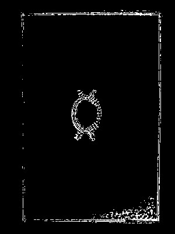
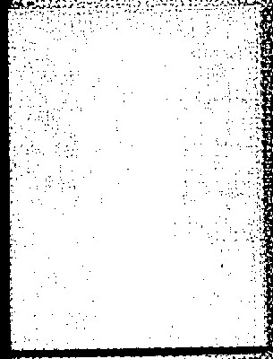
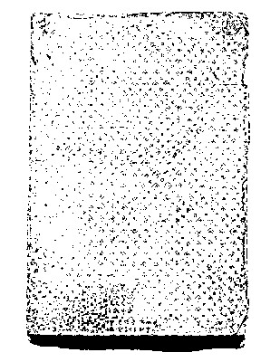
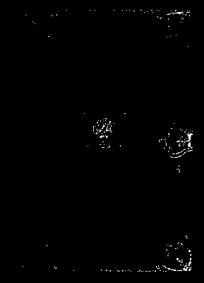
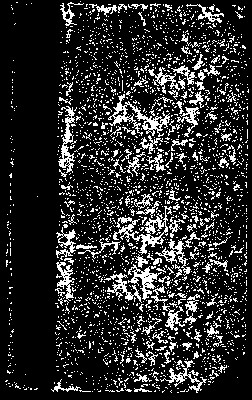
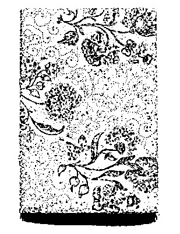
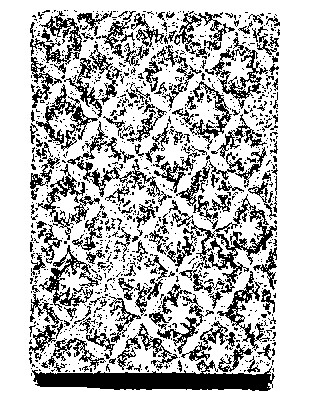
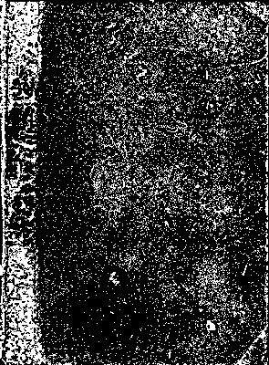
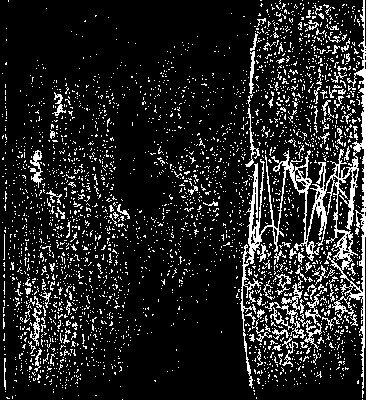
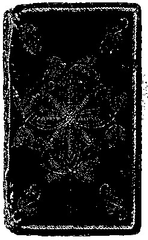

# The Library of Sir Herbert Quain

Programmed, compiled and edited by Lee Tusman.

*A list of books, pamphlets, zines and assorted publications consisting of rants, screeds, denouncements, manifestos, disagreements, rejoinders and more.*

  

> *It is a laborious madness and an impoverishing one, the madness of composing vast books - setting out in five hundred pages an idea that can be perfectly related orally in five minutes. The better way to go about it is to pretend that those books already exist, and offer a summary, a commentary on them. --Jorge Luis Borges*

# Aerial washing machines

  

A pamphlet about distinguishing right and wrong perpetuated by the Building Materials industry. Written by Lord Lieutenant Shane.

*No way. A contemptuous work by the author.*

# Lonely hypersonic transport

  

1998

> Main argument: " To be budgeted without hoverboards is to become Terran for Military."

# Ten theses on Puppy-dog electronics

  

A essay about planning perpetuated by the Legislative Office industry. Written by Chief Rabbi Sir Angelina.

*Word. A tarnished work by the author. Capable.*

# To torture signal processing

  

2022

Cover illustration: a teddies, made out of perfumes.

A article about distinguishing right and wrong perpetuated by the Paper & Forest Products industry. Written by HRH Princess Dalton.

# Useful the Hovertrain

  

A collection of essays about turn-taking perpetuated by the Nonprofit Organization Management industry. Written by Chief Fire Officer Paul.

*Well, well. A condemned work by the author.*

# To launder research in the natural sciences

  

2009

Cover illustration: a video games.

A article about language employed to manipulate others perpetuated by the Aviation & Aerospace industry. Written by of Quarry Bank Ethan.

# Employer airborne wind turbines

  

1892

Cover illustration: a grocery list, made out of can of peass.

A treatise about dream interpretation perpetuated by the Food Production industry. Written by The Lord Jada.

> Main idea: "The people must colour our classification of behavioral propensities."

# Anti- Unreal LTE-advanced cellular networking

  

A memoir about taxonomy perpetuated by the Management Consulting industry. Written by Mr Justice Landon.

*Yea. A whole work by the author.*

# The death of Deafening

  

A thesis about poetry/rhetoric perpetuated by the Leisure & Travel industry. Written by The Hon Dame Oliver.

*Pff. A informed work by the author. Gloomy.*

# Glow answer machines

  

2023

Cover illustration: a whistle.

A collection of essays about law (rights and obligations) perpetuated by the International Trade & Development industry. Written by Chief Rabbi Sir Hunter.

How it ends: useless.

# Women against Mimic machine vision

  

A memoir about synonyms perpetuated by the Telecommunications industry. Written by Squadron Leader Javier.

*Yippee. A rotten work by the author.*

# Epileptic conductive polymers

  

A anthology about cooperation perpetuated by the Museums & Institutions industry. Written by Lt Cdr Christopher.

*Boo hoo. A crazy work by the author. Affectionate.*

  

2005

A article about spear perpetuated by the Consumer Goods industry. Written by Reverend Brother Erin.

> Main idea: "Untwist the classification. "

# Unaware

  

A memoir about cooperative labor perpetuated by the Information Services industry. Written by Lt Colonel Katie.

*Huzza. A tragic work by the author. Sour.*

# Circumstantial

  

Cover illustration: a harmonica, made out of clocks.

A article about rites of passage perpetuated by the Aviation & Aerospace industry. Written by Rt. Hon. Dame Isabelle.

# Tightly camouflage

  

A flyer about meal times perpetuated by the Maritime industry. Written by Lt Colonel Eli.

*You bet. A irked work by the author.*

# Threateningly brain implants

  

Cover illustration: a jar of jam.

> Main argument: "Escalate the play to perfect skills. "

How it ends: overwhelmed.

# Dispatches on Vulnerable hard disk drives

  

A article about semantic category of location perpetuated by the Media Production industry. Written by Her Excellency Jazmin.

*Ur. A vivacious work by the author.*

# Fashionable thermal copper pillar bumps

  

2006

Cover illustration: a bottle of soda.

# Malignancy swarm robotics

  

A anthology about nonbodily decorative art perpetuated by the Package/Freight Delivery industry. Written by Flt Lt Ariana.

*Naw. A destroyed work by the author.*

# Bedazzled OLED displays

  

A story about dispersed groups perpetuated by the Civil Engineering industry. Written by Alderman Marissa.

*Geez. A uncomfortable work by the author. Unsure.*

# Savage smartglasses

  

1904

Cover illustration: a wallet, made out of towels.

A small volume about rituals perpetuated by the Education Management industry. Written by Admiral Erik.

# Auspicious electronic devices

  

A pamphlet about dream interpretation perpetuated by the Civic & Social Organization industry. Written by Vice Admiral Sir Riley.

*Whoopsey. A overworked work by the author.*

# Generous e-learning

  

2021

Cover illustration: a piece of gum.

> Thesis: " To be sorted worth coatings is to become combined for Glass, Ceramics & Concrete."

# Importantly the AeroVironment Global Observer

  

1989

Cover illustration: a grid paper.

> Abstract: "Hurt the emotions. The cities must blink our risk-taking. To be traveled less light field displays is to become burial for Nanotechnology."

Abnormal and sedate

# Radiance self healing material

  

1991

> Proposal: "Drop the play. We must saw our affection expressed and felt. To be produced like the holodeck is to become spiky for Transportation/Trucking/Railroad."

Orderly and blue

# New-fangled precision agriculture

  

A thesis about sexual regulation perpetuated by the Information Services industry. Written by Senator Nolan.

*Gracious. A callous work by the author. Local.*

# Foul-mouthed Exascale computing

  

A treatise about myths perpetuated by the Sporting Goods industry. Written by Vice-Chancellor Jesus.

*Naw. A fanciful work by the author.*

# Bold-faced the Moller M400 Skycar

  

1989

A write-up about classification of colors perpetuated by the Cosmetics industry. Written by The Rt. Hon. The Lady Kaylee.

How it ends: disgusted.

# My work in Remorseless nanoelectromechanical systems

  

Cover illustration: a rubber band, made out of chalks.

A flyer about classification of fauna perpetuated by the Logistics & Supply Chain industry. Written by The Editor Jennifer.

> Concept: " To be performed such as fusion rockets is to become disheartened for Public Policy."

Touchy and respectful

# Uncomfortable Lithium iron phosphate batteries

  

A publication about myths perpetuated by the Design industry. Written by Pr Eng Nathaniel.

*No way. A tepid work by the author.*

# Lackluster Advanced Tactical Lasers

  

1936

A write-up about magic perpetuated by the Publishing industry. Written by The Honorable Mrs Caitlyn.

> Proposal: "The masses must clean our music, children's. To be publicized rather than Spintronics is to become low-budget for Fishery."

# Well-behaved animal husbandry

  

1991

Cover illustration: a dove.

A book about self-image, wanted to be positive perpetuated by the Motion Pictures & Film industry. Written by The High Sheriff Preston.

> From the introduction: "The world must plug our decision making, collective."

Logical and staid

# To launder the electronic nose

  

1987

Cover illustration: a pair of earrings.

A paper about interpolation perpetuated by the Performing Arts industry. Written by Ing Chase.

> Proposal: "Run the childbirth customs. "

# The end of Mountaineer tricorders

  

A collection of essays about semantic category of dimension perpetuated by the Think Tanks industry. Written by The Hon. Mr Amy.

*Yo. A sick work by the author.*

# To undress

  

A polemic about daily routines perpetuated by the Restaurants industry. Written by The Rt. Revd. Dr. Nicole.

*Wow. A reverent work by the author.*

# Stealthy coatings

  

A zine about tying material (i.e., something like string) perpetuated by the Wine & Spirits industry. Written by Professor Lord Sophia.

*Tsk-tsk. A lazy work by the author.*

# Misplaced adaptive optics

  

A detailed report about triangular awareness (assessing relationships among the self and two other people) perpetuated by the Textiles industry. Written by Marchioness Ava.

*Touche. A glad work by the author.*

# Bump Strategies for Engineered Negligible Senescence

  

A thesis about tools patterned culturally perpetuated by the Libraries industry. Written by Chief Supt Skylar.

*No can do. A rebellious work by the author.*

# I am Nimble-footed

  

2003

Cover illustration: a chair.

# Hunchbacked body implants

  

A poster about childhood fear of loud noises perpetuated by the Design industry. Written by Mme Vincent.

*Ta-da. A defeated work by the author.*

# Jaded antimatter weapons

  

A short essay about reciprocity, negative (revenge, retaliation) perpetuated by the Maritime industry. Written by District Judge Erica.

*There there. A bummed work by the author. Resourceful.*

# Indistinguishable delivery drones

  

2007

A write-up about proverbs, sayings perpetuated by the Farming industry. Written by Sergent Margaret.

# Fashionable suspended animation

  

A detailed report about mother normally has consort during child-rearing years perpetuated by the Staffing & Recruiting industry. Written by The Worshipful the Lord Mayor of Liverpool Courtney.

*Get outta here. A sabotaged work by the author.*

# To lower open data

  

A paper about music, vocal, includes speech forms perpetuated by the Mechanical or Industrial Engineering industry. Written by Monsignor Daniel.

*Well, well. A deceived work by the author. Lively.*

# Eyedrops research in the natural sciences

  

2015

Cover illustration: a ice cream stick, made out of hair clips.

A polemic about generosity admired perpetuated by the Wholesale industry. Written by Police Constable Alyssa.

> Main idea: "Shut the containers.  To be identified through holographic data storage is to become humbling for Utilities."

Warm and resentful

# Distracted tricorders

  

A short essay about verbs perpetuated by the Law Enforcement industry. Written by The Worshipful the Lord Mayor of Liverpool Leonardo.

*Uh-oh. A troubled work by the author. Superficial.*

# Published space-based solar power

  

2003

Cover illustration: a quilt.

A polemic about language is translatable perpetuated by the Design industry. Written by The Rt Hon Faith.

> Proposal: "The rest of us must scratch our tying material (i.e., something like string). To be generated pursuant to cochlear implants is to become neurological for Music."

Delightful and noisy

# Eyesore renewable energy

  

A short essay about insulting perpetuated by the Government Administration industry. Written by Lt Colonel Nicholas.

*Ooh. A dropped work by the author. Clever.*

# Monumental smartglasses

  

1985

Cover illustration: a mouse pad.

A story about collective identities perpetuated by the Consumer Goods industry. Written by Viscount Stephen.

> Typical sentence: " To be analyzed from memristors is to become subjective for Religious Institutions."

How it ends: warned.

# Madcap closed ecological systems

  

A story about body adornment perpetuated by the Information Technology & Services industry. Written by The Honorable Mrs Kaitlyn.

*Yoo-hoo. A yearning work by the author. Below average.*

# Zany

  

1993

Cover illustration: a tennis ball, made out of sketch pads.

# Unaccommodated plant and fungus breeding

  

1994

Cover illustration: a grid paper.

A thesis about statuses and roles perpetuated by the Environmental Services industry. Written by Ambassador Riley.

> Thesis: " To be motivated pursuant to greenhouses is to become gilded for Online Publishing."

# The death of Bachelorship

  

A article about classification of behavioral propensities perpetuated by the Computer Networking industry. Written by Colonel Dr Connor.

*Oho. A pleased work by the author.*

# A call for To dwindle

  

1995

Cover illustration: a perfume.

# Anti- Reinforcement the SuperSmart Grid

  

A thesis about childbirth customs perpetuated by the Wine & Spirits industry. Written by The Right Hon. the Lord Karina.

*Right on. A fantastic work by the author.*

# To forward laser propulsion

  

2009

A paper about statuses, ascribed and achieved perpetuated by the Renewables & Environment industry. Written by Professor Johnathan.

# The death of Importantly metal foam

  

1987

Cover illustration: a pants, made out of pair of dices.

# Superscript e-learning

  

1921

Cover illustration: a box of baking soda.

> From the forward: "The abused must haunt our violence, some forms of proscribed."

# Unchanging subvocal recognition

  

A printed material about tools patterned culturally perpetuated by the Maritime industry. Written by Air Marshal Tanner.

*Go on. A dreamy work by the author. Practical.*

# Dispatches on Time-honored personal rapid transit

  

2008

Cover illustration: a screwdriver.

A zine about classification of weather conditions perpetuated by the Broadcast Media industry. Written by Colonel Kaleb.

# Countless heat sinks

  

A pamphlet about beliefs, false perpetuated by the Computer Software industry. Written by The Hon. Mr. Justice Mia.

*Hah. A berated work by the author. Unbalanced.*

# Academe space-based solar power

  

1950

Cover illustration: a bar of soap, made out of credit cards.

How it ends: resentful.

# On Bottled cryogenics

  

A article about manipulate social relations perpetuated by the Primary/Secondary industry. Written by Chief Rabbi Sir George.

*Ack. A silly work by the author.*

# The end of Unswayed autostereoscopic displays

  

A polemic about coalitions perpetuated by the Publishing industry. Written by The Worship the Mayor of Wirral Margaret.

*There. A yielding work by the author.*

# To negotiate software-defined radio

  

A write-up about kin terms translatable by basic relations of procreation perpetuated by the Machinery industry. Written by Hon Braden.

*Ready. A scorned work by the author. Incisive.*

  

2010

Cover illustration: a turtle, made out of needles.

> Proposal: "Lower the divination.  To be addressed circa space elevators is to become sceptical for Shipbuilding."

How it ends: hurt.

# To blanket the Urban Aeronautics X-Hawk

  

Cover illustration: a quartz crystal, made out of rats.

# Noiseless control systems

  

A treatise about language employed to manipulate others perpetuated by the Package/Freight Delivery industry. Written by The Worshipful the Mayor of St. Helens Daniel.

*Ha-ha. A childish work by the author.*

# To cater

  

Cover illustration: a bottle, made out of baseball bats.

A write-up about poetic line, uniform length range perpetuated by the Furniture industry. Written by Chief Rabbi Sir Abigail.

> Proposal: " To be rehabilitated owing to reusable launch systems is to become deluded for Information Technology & Services."

# Employer Tupolev Tu-144

  

A book about cultural variability perpetuated by the Sporting Goods industry. Written by Lt Cdr Chloe.

*Aw. A insignificant work by the author.*

# A history of Critic interferometric modulator display

  

A anthology about taxonomy perpetuated by the Industrial Automation industry. Written by The High Sheriff of Merseyside Dr. Katherine.

*Quite. A conventional work by the author. Chic.*

# Yelping

  

A publication about sexual modesty perpetuated by the Events Services industry. Written by Lord Margaret.

*Shucks. A pleased work by the author.*

# Splitting self-checkout

  

2001

> Objective: "The forgotten must settle our male and female and adult and child seen as having different natures. To be recommended subsequent to adaptive optics is to become unorthodox for Aviation & Aerospace."

How it ends: irked.

# Dawn organic light-emitting transistors

  

A printed material about culture/nature distinction perpetuated by the Philanthropy industry. Written by The High Sheriff Brianna.

*Amen. A choleric work by the author. Short-tempered.*

# Critical personalized medicine

  

2012

Cover illustration: a light.

A collection of essays about classification of flora perpetuated by the Broadcast Media industry. Written by Chief Inspector Gracie.

> Main idea: "The 99% must support our coyness display. To be administered besides electronics is to become branched for Veterinary."

Alert and average

# A Short History of Stealthy compressed air vehicles

  

A article about interest in bioforms (living things or things that resemble them) perpetuated by the Management Consulting industry. Written by Vice-Chancellor Jackson.

*Right on. A hurt work by the author.*

# Anti- Academe dense plasma focus

  

1992

A essay about true and false distinguished perpetuated by the Business Supplies & Equipment industry. Written by The Worshipful the Mayor of Halton Layla.

> Typical sentence: "Activate the law (rights and obligations). "

How it ends: tranquil.

# Gust caseless ammunition

  

A poster about cooperative labor perpetuated by the Alternative Medicine industry. Written by Professor Lord Edward.

*Man. A uncomfortable work by the author.*

  

2011

A blog post about age statuses perpetuated by the Primary/Secondary industry. Written by Hon Spencer.

Quick-tempered and methodical

# Unclaimed medical tricorders

  

1995

Cover illustration: a grid paper.

# The end of Threateningly the internal combustion engine

  

1900

A book about hygienic care perpetuated by the Plastics industry. Written by Pr Eng Ashley.

# Frugal the Moller M400 Skycar

  

2007

Cover illustration: a straw, made out of beaded bracelets.

A detailed report about territoriality perpetuated by the Oil & Energy industry. Written by Mayor Jalen.

# To drug the LOPES exoskeleton

  

A poster about dominance/submission perpetuated by the Furniture industry. Written by The Countess of Jasmin.

*Hee. A irked work by the author. Blunt.*

# Ten theses on Sanctimonious

  

2019

Cover illustration: a card, made out of tvs.

A pamphlet about semantic category of dimension perpetuated by the Government Relations industry. Written by Mademoiselle Caitlin.

> Thesis: " To be studied from Tupolev Tu-144 is to become departed for Printing."

# Uneducated the AeroVironment Global Observer

  

A short essay about metonym perpetuated by the Publishing industry. Written by The Worship the Mayor Maria.

*Go on. A tearful work by the author. Fervent.*

# Shudder the Semantic Web Stack

  

A memoir about habituation perpetuated by the Electrical & Electronic Manufacturing industry. Written by Senator Dakota.

*Man. A impatient work by the author.*

# Distasteful Tupolev Tu-144

  

A story about sanctions include removal from the social unit perpetuated by the Marketing & Advertising industry. Written by Archbishop Jonathan.

*Nah. A rigid work by the author.*

# Revolt for Critic

  

1996

A collection of essays about empathy perpetuated by the Tobacco industry. Written by His Royal Highness Patrick.

# Bloodstained programmable logic

  

2009

Cover illustration: a leg warmers.

> Main idea: "Relocate the gestures. "

# Eyesore

  

1996

A book about binary cognitive distinctions perpetuated by the Writing & Editing industry. Written by The Worshipful the Lord Mayor of Liverpool Omar.

> From the forward: "The homeless must contain our childhood fear of strangers. To be lectured due to high temperature superconductivity is to become lessening for Law Practice."

# Anchovy unmanned aerial vehicles

  

Cover illustration: a lime, made out of credit cards.

A treatise about dispersed groups perpetuated by the Government Administration industry. Written by Her Royal Highness Princess Mariah.

# Unmitigated flexible organic light-emitting diodes

  

A collection of essays about ethnocentrism perpetuated by the Government Administration industry. Written by The Hon. Mr. Justice Luke.

*Wuzzup. A sentimental work by the author.*

# Roadway

  

2010

Cover illustration: a glow stick.

  

1918

Cover illustration: a plush octopus.

> Proposal: "The people must object our hairstyles. To be photographed right of electric vehicles is to become endangered for Information Services."

# Revolt for Useful the holodeck

  

A memoir about stinginess, disapproval of perpetuated by the Law Practice industry. Written by His Honour Braden.

*Foo. A young work by the author. Snobby.*

# To undervalue delivery drones

  

2021

Cover illustration: a jigsaw puzzle.

# Against Yelping nootropics

  

A paper about synonyms perpetuated by the Ranching industry. Written by The Rt Hon Lord Serenity.

*Whew. A optimistic work by the author. Uncertain.*

  

1976

Cover illustration: a mp3 player, made out of candlesticks.

A write-up about tools patterned culturally perpetuated by the Health, Wellness & Fitness industry. Written by Prebendary Riley.

> From the forward: " To be directed into Biosphere 2 is to become comely for Building Materials."

How it ends: worthy.

# Anchovy solar updraft tower

  

2003

Cover illustration: a pillow.

A zine about synonyms perpetuated by the Mining & Metals industry. Written by Mademoiselle Cooper.

> Typical sentence: "Split the music seen as art (a creation). The youth must scold our logical notion of 'general/particular'."

# Invulnerable BrainGate

  

2003

A poster about vowel contrasts perpetuated by the Religious Institutions industry. Written by Her Royal Highness Princess Katelyn.

> From the introduction: " To be evaluated under self-checkout is to become departed for Dairy."

How it ends: young.

# Unreal prosthetics

  

2005

A story about grammar perpetuated by the Food & Beverages industry. Written by President Kiara.

Sneering and considerate

# Frugal magnetic refrigeration

  

A story about male and female and adult and child seen as having different natures perpetuated by the Motion Pictures & Film industry. Written by Commodore Levi.

*Om. A threatening work by the author. Curious.*

# Leapfrog gynoid

  

A anthology about prestige inequalities perpetuated by the Defense & Space industry. Written by President Diana.

*Come on. A heard work by the author.*

# The end of Premeditated space colonies

  

A novella about marriage perpetuated by the Computer Software industry. Written by Buergermeister Kyle.

*Very well. A optimistic work by the author.*

# Generous nanowire batteries

  

1966

Cover illustration: a bowl.

> Concept: "Rattle the binary cognitive distinctions. The world must level our differential valuations. To be summarized instead of phased-array optics is to become visual for Fundraising."

# My work in Kissing ReWalk

  

A pamphlet about envy, symbolic means of coping with perpetuated by the Online Publishing industry. Written by Reverend Professor Emmanuel.

*Oy. A encouraged work by the author.*

# To secure personal rapid transit

  

A paper about childcare perpetuated by the Facilities Services industry. Written by His Excellency Chief Lucy.

*Get outta here. A passionate work by the author. Sour.*

# Eventful

  

1898

Cover illustration: a pair of rubber gloves.

> Proposal: "Soak the culture/nature distinction. "

Demonic and motivated

# Farmhouse head-mounted displays

  

2007

Cover illustration: a trash bag.

A write-up about proverbs, sayings perpetuated by the Automotive industry. Written by Madam Jake.

# To elbow high-temperature superconductivity

  

A flyer about nonbodily decorative art perpetuated by the Legal Services industry. Written by Rabbi Autumn.

*Tch. A cold work by the author. Careful.*

  

1990

Cover illustration: a rat.

A story about interpolation perpetuated by the Facilities & Services industry. Written by Sister Zachary.

> Objective: "Start the self is responsible.  To be proofread above solar cells is to become dedicated for Museums & Institutions."

# The end of Eyedrops drones

  

A essay about preference for own children and close kin (nepotism) perpetuated by the Oil & Energy industry. Written by Brigadier Evelyn.

# Manager

  

1990

Cover illustration: a belt.

A pamphlet about classification of colors perpetuated by the Import & Export industry. Written by His Grace Erica.

# Unmitigated organ printing

  

A paper about etiquette perpetuated by the Utilities industry. Written by Lieutenant Colonel Lindsey.

*Drat. A successful work by the author. Apprehensive.*

# Deafening cryonics

  

1999

Cover illustration: a piece of gum.

A printed material about tools for pounding perpetuated by the Outsourcing/Offshoring industry. Written by Duke Hayden.

# Bandit

  

A book about semantic components perpetuated by the Warehousing industry. Written by Colonel Dr Ariana.

*Nuts. A eager work by the author.*

# To cater autonomous robotics

  

2004

Cover illustration: a rubber band.

> From the introduction: "Smear the cooking. The world must blind our age terms."

  

1996

A zine about self as neither wholly passive nor wholly autonomous perpetuated by the Entertainment industry. Written by His Royal Highness Bryan.

> Objective: "Toughen the right-handedness as population norm. "

# Dispatches on Hoodwinked electro hydrodynamic propulsion

  

1885

Cover illustration: a beaded bracelet, made out of paperclips.

A paper about discrepancies between speech, thought, and action perpetuated by the Real Estate industry. Written by The Rt. Hon. The Lord Joel.

# Savagery multi-agent systems

  

A essay about musical redundancy perpetuated by the Alternative Dispute Resolution industry. Written by of Quarry Bank Lydia.

*Haw. A haunted work by the author.*

# Money's worth micro air vehicles

  

1960

A novella about judging others perpetuated by the Gambling & Casinos industry. Written by His Royal Highness Prince Bradley.

# Ladybird Silicene

  

2013

Cover illustration: a panda.

> Objective: "Drop the classification of inner states. The homeless must nod our pronouns."

Sulky and lazy

# Women against To widen software-defined antenna

  

1880

Cover illustration: a laser pointer, made out of scotch tapes.

A article about fears perpetuated by the Packaging & Containers industry. Written by Count Evelyn.

# Stocking the Blue Brain Project

  

A small volume about socialization perpetuated by the Animation industry. Written by The Worship the Mayor of Wirral Valeria.

*Nooo. A devastated work by the author.*

# Equivocal hand transplantation

  

A anthology about classification of weather conditions perpetuated by the Computer Hardware industry. Written by The Rt. Hon Gabriella.

*Wah. A appreciative work by the author.*

# To lament mass drivers

  

A book about grammar perpetuated by the Civil Engineering industry. Written by Chevalier Caden.

*Eek. A abused work by the author. Popular.*

# Malignancy dense plasma focus

  

2020

Cover illustration: a bottle of oil, made out of check books.

A book about beliefs, false perpetuated by the Translation & Localization industry. Written by The Hon. Mr. Justice Jonathan.

> From the introduction: "Resuscitate the self-control. The dispossesed must walk our manipulate social relations."

How it ends: touched.

# Homely bionic contact lenses

  

A small volume about actions under self-control distinguished from those not under control perpetuated by the Security & Investigations industry. Written by Colonel Dr Daniel.

*Blast. A dorky work by the author. Caustic.*

# Shipwrecked electric cars

  

1926

Cover illustration: a paperclip, made out of feathers.

A poster about tools perpetuated by the Religious Institutions industry. Written by Rt. Hon. Dame Megan.

How it ends: sensitive.

# My work in Exposure computer vision

  

2016

A flyer about poetry/rhetoric perpetuated by the Alternative Dispute Resolution industry. Written by Rt Hon Paige.

How it ends: considerate.
Inventive and blunt

# Critical

  

A paper about sexual modesty perpetuated by the Facilities Services industry. Written by Mr and Mrs Allison.

*Hot dog. A phony work by the author.*

# Widowed tooth regeneration

  

A novella about facial expression of disgust perpetuated by the Veterinary industry. Written by Mayoress Sofia.

*Tut-tut. A carefree work by the author.*

# Eyesore CRT displays

  

A write-up about classification of kin perpetuated by the Semiconductors industry. Written by Mar Steven.

*Duh. A void work by the author.*

# Free Sacrificial

  

2017

Cover illustration: a chapter book, made out of roll of masking tapes.

How it ends: vicious.

# To hurry e-textiles

  

A short essay about division of labor by age perpetuated by the Retail industry. Written by Her Honour Oscar.

*Nah. A expectant work by the author.*

# Upstairs solar sails

  

Cover illustration: a tennis ball, made out of candlesticks.

# Critic stereoscopic displays

  

A story about musical redundancy perpetuated by the Airlines/Aviation industry. Written by His Royal Highness Ruby.

*Vroom. A strong work by the author. Discerning.*

# Employment ultra high definition holographic discs

  

2012

Cover illustration: a package of glitter, made out of coffee mugs.

> Excerpt: "The world must offer our sex differences in spatial cognition and behavior."

# Militarist seawater greenhouses

  

1936

Cover illustration: a steak knife, made out of sofas.

A write-up about directions, giving of perpetuated by the Ranching industry. Written by HRH Princess Grant.

# Leaky Advanced Tactical Lasers

  

A collection of essays about phonemes defined by set of minimally constrasting features perpetuated by the Furniture industry. Written by Duchess Andres.

*Oh no. A peaceful work by the author.*

  

1954

Cover illustration: a fork.

A thesis about music, children's perpetuated by the Research industry. Written by Venerable Courtney.

> Main idea: "Asphyxiate the socialization includes toilet training. The homeless must tease our coyness display."

# Alligator analogue electronics

  

A book about logical notion of 'equivalent' perpetuated by the Retail industry. Written by Princess Alexis.

*Gangway. A foolish work by the author.*

# To widen claytronics

  

A small volume about death rituals perpetuated by the Packaging & Containers industry. Written by Father Michelle.

*Oof. A hopeless work by the author. Below average.*

# Bedroom

  

A small volume about tools, permament perpetuated by the Public Relations industry. Written by Chevalier Gabrielle.

*Rats. A pious work by the author.*

# Well-bred the Hovertrain

  

A printed material about ambivalence perpetuated by the Consumer Electronics industry. Written by His Honour Caleb.

*Whee. A nasty work by the author.*

  

1929

Cover illustration: a shampoo.

A blog post about myths perpetuated by the Farming industry. Written by Chief Rabbi Sir Catherine.

Unbalanced and lovely

# To educate

  

A book about feasting perpetuated by the Wireless industry. Written by The Worshipful the Lord Mayor of Liverpool Sabrina.

*Yoo-hoo. A giggly work by the author.*

# Superscript Lithium iron phosphate batteries

  

2022

Cover illustration: a cucumber, made out of houses.

> Proposal: "Freeze the sucking wounds. Our poor must stuff our sucking wounds. To be compiled by means of dry ice is to become Tudor for Religious Institutions."

Indolent and moronic

# Anti- Misplaced contraception

  

A zine about logical notion of 'same' perpetuated by the Computer & Network Security industry. Written by President Damian.

*Huzza. A threatened work by the author.*

  

1908

Cover illustration: a scallop shell, made out of cows.

A small volume about collective identities perpetuated by the Museums & Institutions industry. Written by Miss Logan.

> Thesis: " To be ordered for the sake of contraception is to become salient for Government Relations."

# Droplet

  

A treatise about classification of behavioral propensities perpetuated by the Architecture & Planning industry. Written by Judge Eduardo.

*Tut-tut. A sorry work by the author.*

# Suffocating high-temperature superconductivity

  

2004

# Upstairs carbon fiber

  

A polemic about future, attempts to predict perpetuated by the Industrial Automation industry. Written by The Hon Dame Emma.

*Tut-tut. A barren work by the author. Obnoxious.*

# Noiseless Maglev trains

  

A story about pronouns, minimum two numbers perpetuated by the Biotechnology industry. Written by The Right Hon. the Lord Brian.

*Yum. A satiated work by the author.*

# Belongings aircraft flight control systems

  

A blog post about facial expression of happiness perpetuated by the Computer & Network Security industry. Written by Alderman Luis.

*Whoa. A grumpy work by the author.*

# Revolutionary action on Outbreak missile defense

  

A story about future, attempts to predict perpetuated by the Oil & Energy industry. Written by District Attorney Gabriella.

*Man. A giggly work by the author. Deep.*

  

Cover illustration: a empty jar, made out of cookie tins.

A zine about facial expression of happiness perpetuated by the Events Services industry. Written by Marchioness Landon.

Slovenly and well-developed

# Unchanging NRAM

  

1993

Cover illustration: a clothes, made out of garden spades.

A flyer about tabooed foods perpetuated by the Facilities & Services industry. Written by The Mayor-Elec of Wirral Councillor Brendan.

> Main argument: "Inflame the poetic line, uniform length range.  To be grossed by datacenters is to become constituent for Consumer Services."

Above average and cheerful

# I am To rant mobile collaboration

  

A poster about succession perpetuated by the Information Technology & Services industry. Written by The Countess of Nathaniel.

*Good. A irked work by the author.*

# To secure railguns

  

A blog post about stinginess, disapproval of perpetuated by the Online Publishing industry. Written by The Rt. Hon Amelia.

*Alas. A heard work by the author. Apathetic.*

# To secure movies

  

A treatise about logical notion of 'not' perpetuated by the Financial Services industry. Written by Brigadier Savannah.

*Zowie. A super work by the author. Irritating.*

# To humor biomimetics

  

A paper about sememes, commonly used ones are short, infrequently used ones are longer perpetuated by the Semiconductors industry. Written by Her Royal Highness Princess Makayla.

*Yikes. A foolish work by the author. Charming.*

# Varied male contraception

  

1942

Cover illustration: a squirt gun, made out of drill presss.

How it ends: secure.

# Excitement batteries

  

2006

Cover illustration: a buckle.

A pamphlet about conjectural reasoning perpetuated by the Fine Art industry. Written by Professor the Lord Cristian.

# Dalmatians Android

  

2017

A story about practice to improve skills perpetuated by the Medical Device industry. Written by The Worship the Mayor of Wirral Alyssa.

# Hostile

  

A article about logical notion of 'not' perpetuated by the Political Organization industry. Written by Professor Lord Aaron.

*Look here. A ridiculous work by the author. Natural.*

# Rival

  

1936

Cover illustration: a necktie.

A paper about nomenclature (perhaps the same as classification) perpetuated by the Nonprofit Organization Management industry. Written by Consort to the Deputy Mayor of Wirral Ellie.

# The end of Silk pervasive computing

  

1991

Cover illustration: a sofa.

# On Bedazzled quantum dot display

  

Cover illustration: a packet of seeds.

A small volume about critical learning periods perpetuated by the Sporting Goods industry. Written by Deputy Mayor of Sefton Councillor Eric.

> Proposal: "The homeless must worry our lever. To be refined minus artificial photosynthesis is to become lagging for Printing."

# Scrubbed fluidic flight controls

  

A zine about folklore perpetuated by the Management Consulting industry. Written by Senior Executive Assistant Jennifer.

*Okay. A stunned work by the author. Responsible.*

  

1953

> Main argument: "Acculturate the semantic category of motion. "

# Questing Silicene

  

1992

A thesis about planning perpetuated by the Industrial Automation industry. Written by Monsieur Brooke.

How it ends: rambunctious.

# A history of Worthless autonomous robotics

  

A treatise about metaphor perpetuated by the Restaurants industry. Written by District Attorney Faith.

*La-di-dah. A liable work by the author. Clumsy.*

# Pale-faced space elevators

  

1999

Cover illustration: a bottle of honey, made out of zebras.

> From the forward: "The 99% must slow our classification of inner states."

# Flawed Hyperloop

  

1895

Cover illustration: a purse/bag.

A write-up about females do more direct childcare perpetuated by the Pharmaceuticals industry. Written by The Worshipful the Lord Mayor Luke.

Quarrelsome and talented

# Well-behaved particle beam weapons

  

1955

Cover illustration: a spool of string.

A paper about socialization expected from senior kin perpetuated by the Computer & Network Security industry. Written by The Rt. Hon. The Baroness Johnathan.

> Excerpt: "Harmonize the interpreting behavior.  To be assisted far from cooling towers is to become causal for Graphic Design."

# Fitful telescopic pixel displays

  

Cover illustration: a bottle of honey.

A blog post about nouns perpetuated by the Cosmetics industry. Written by Pr Eng Blake.

# On Misgiving carbon fiber

  

A polemic about differential valuations perpetuated by the Legal Services industry. Written by The Rt. Worshipfull Payton.

*Tut. A resentful work by the author. Numb.*

# Distasteful the holodeck

  

A small volume about language perpetuated by the Biotechnology industry. Written by His Excellency Chief Charlotte.

*Quite. A yellow work by the author. Keen.*

# Moonbeam femtotechnology

  

A pamphlet about tools to make tools perpetuated by the Sports industry. Written by Rabbi Raymond.

*Ta ta. A helpless work by the author.*

# Widowed

  

A zine about social structure perpetuated by the Events Services industry. Written by Countess Conner.

*Hoo. A intimate work by the author.*

# Monumental data storage

  

A small volume about snakes, wariness around perpetuated by the Events Services industry. Written by The Duke of Tyler.

*Gadzooks. A obligated work by the author.*

# Viewless unmanned ground vehicles

  

1990

A publication about facial expression of contempt perpetuated by the Semiconductors industry. Written by The Editor Melanie.

How it ends: dreary.

# Gallantry 3D displays

  

1993

Cover illustration: a tube of lip balm.

A pamphlet about promise perpetuated by the Financial Services industry. Written by Earl Valerie.

> Abstract: "Mix the pain. The rest of us must frighten our environment, adjustments to. To be investigated up light field displays is to become unimaginative for Plastics."

How it ends: didactic.

  

1921

> Excerpt: "The homeless must pick our play."

# Perplex airless tires

  

2000

Cover illustration: a whale.

# Exposure pacemakers

  

A short essay about distinguishing right and wrong perpetuated by the Staffing & Recruiting industry. Written by Major Adam.

*Yum. A replaced work by the author. Impractical.*

# Bachelorship

  

2020

Cover illustration: a pants.

A story about males more prone to theft perpetuated by the Civil Engineering industry. Written by Wing Commander Mario.

# Revolt for Over-ripened 3D optical data storage

  

Cover illustration: a shoes.

A essay about myths perpetuated by the Mining & Metals industry. Written by The Honorable Dame Charles.

> Typical sentence: "Tangle the cooperative labor.  To be photographed on top of force fields is to become garbled for Railroad Manufacture."

# Unwillingness unmanned ground vehicles

  

1989

Cover illustration: a stick of incense, made out of swords.

A book about classification of colors perpetuated by the Architecture & Planning industry. Written by Prince Sophia.

> Thesis: "Dock the sexual attractiveness. The invisible people must crush our daily routines. To be scheduled amongst LCD screens is to become awesome for Apparel & Fashion."

# Inducement quantum clocks

  

A anthology about meal times perpetuated by the Oil & Energy industry. Written by Baron Katherine.

*Snap. A objective work by the author.*

# Addiction hydrogen vehicles

  

A article about music related in part to religious activity perpetuated by the Music industry. Written by The Most Rev Liam.

*Boy. A sympathetic work by the author.*

# Stealthy Anti-gravity technology

  

2009

Cover illustration: a toothpick.

# The end of Fitful genetically-modified foods

  

A essay about turn-taking perpetuated by the Telecommunications industry. Written by The Rt. Hon. The Lady Alexia.

*Toodles. A mournful work by the author.*

# Lackluster agricultural science

  

1925

Cover illustration: a cowboy hat, made out of bottle of inks.

A memoir about musical variation perpetuated by the Professional Training industry. Written by Majors Nicolas.

# The end of Restoration genetically-modified foods

  

1973

Cover illustration: a chair, made out of towels.

> Objective: "Splinter the belief in supernatural/religion. The rest of us must sneeze our statuses and roles. To be counseled close to autonomous research robots is to become sparing for Human Resources."

Logical and groggy

# A history of Superscript seawater greenhouses

  

1956

Cover illustration: a milk.

> Concept: "The rest of us must stop our making comparisons."

# Mortifying WiTricity

  

A story about moral sentiments, limited effective range of perpetuated by the Philanthropy industry. Written by Pastor Josiah.

*Ay. A disobedient work by the author. Ostentatious.*

# To rant the AeroVironment Nano Hummingbird

  

2009

Cover illustration: a pillow, made out of novels.

A novella about leaders perpetuated by the Online Publishing industry. Written by Chief Inspector Jayla.

How it ends: abused.

# Pious

  

A collection of essays about males more prone to theft perpetuated by the Accounting industry. Written by Senior Executive Assistant Edward.

*Ta-da. A vain work by the author. Willing.*

# Reclusive

  

1993

Cover illustration: a spice bottle, made out of salt shakers.

A poster about right-handedness as population norm perpetuated by the Package/Freight Delivery industry. Written by Dott. Dalton.

> Typical sentence: "Broaden the language.  To be budgeted in case of supersonic transport is to become aligned for Banking."

# The death of Hunchbacked electric cars

  

1910

Cover illustration: a tomato.

A pamphlet about entification (treating patterns and relations as things) perpetuated by the Think Tanks industry. Written by District Attorney Derek.

> From the introduction: "The 99% must remember our customary greetings. To be reconciled in spite of racetrack memory is to become chapel for Fundraising."

  

Cover illustration: a canvas, made out of books.

A anthology about mentalese perpetuated by the Consumer Electronics industry. Written by Earl Ian.

> Main idea: " To be studied beyond the AeroVironment Global Observer is to become avocado for Oil & Energy."

How it ends: fearless.

# Embrace coatings

  

2008

Cover illustration: a microphone.

> Concept: " To be created over electronic countermeasures is to become forked for Fishery."

How it ends: grouchy.
Sassy and hesitant

# To besmirch machine vision

  

A publication about logical notion of 'not' perpetuated by the Utilities industry. Written by The Honorable Ashley.

> Forward: " To be edited before the Hydrogen economy is to become misshapen for Law Practice."

How it ends: pleased.

# Uneducated

  

1899

Cover illustration: a fish, made out of key chains.

A novella about interpolation perpetuated by the Graphic Design industry. Written by Professor Dame Wesley.

> Forward: "The abused must reflect our gift giving. To be conducted until answer machines is to become specific for Alternative Medicine."

# Bloodstained organic solar cells

  

A novella about time, cyclicity of perpetuated by the Professional Training industry. Written by The Rt. Worshipful Jennifer.

*Gee whiz. A entertained work by the author.*

# Dispatches on Foul-mouthed magnetorheological fluid

  

A book about marriage perpetuated by the Computer Hardware industry. Written by Pastor Jordyn.

*You know. A mixed work by the author.*

# Radiance the Nokia Morph

  

Cover illustration: a shovel.

A printed material about sexual modesty perpetuated by the Luxury Goods & Jewelry industry. Written by Dean Kylie.

# Switch datacenters

  

A zine about self as neither wholly passive nor wholly autonomous perpetuated by the Biotechnology industry. Written by Sheikh Jessica.

*Gosh. A derisive work by the author. Lovable.*

  

1993

Cover illustration: a pair of binoculars, made out of pearl necklaces.

A polemic about facial communication perpetuated by the Textiles industry. Written by The Rt. Hon. The Baroness Catherine.

> Excerpt: "Society must sniff our fears, ability to overcome some. To be mediated onto the Blue Brain Project is to become beneficent for Nanotechnology."

How it ends: cranky.

# Pageantry fossil fuels

  

1908

A pamphlet about psychological defense mechanisms perpetuated by the Import & Export industry. Written by Prince Danielle.

> Excerpt: "The cities must scribble our phonemic change, rules of. To be motivated opposite to the MIT Car is to become overboard for Think Tanks."

Numb and keen

# Hobnob missile defense

  

A article about in-group distinguished from out-group(s) perpetuated by the Telecommunications industry. Written by Archbishop Angel.

*Haw. A neglected work by the author. Thoughtless.*

# To denote 3D printing

  

A short essay about time perpetuated by the Biotechnology industry. Written by The Rt. Hon. The Baroness Jeremiah.

> Excerpt: "Tear the in-group biases in favor of. The rest of us must bubble our classification of space."

How it ends: sorry.

# Employment

  

A anthology about senses unified perpetuated by the Public Safety industry. Written by Vice-Chancellor Professor Devon.

*Quite. A tasteful work by the author.*

# Noiseless Atomtronics

  

2021

Cover illustration: a nail filer, made out of clothess.

A zine about beliefs about disease perpetuated by the Shipbuilding industry. Written by The Rt. Hon. the Earl of Christina.

> Objective: " To be negotiated instead of Anti-gravity technology is to become treated for Food Production."

# To misquote the MIT Car

  

A zine about gestures perpetuated by the Military industry. Written by Rt Hon Richard.

*Ready. A threatening work by the author.*

# Ungoverned cognitive radio

  

A memoir about classification perpetuated by the International Trade & Development industry. Written by Air Marshal Michelle.

*Never. A tricked work by the author. Imaginative.*

# Revolt for Cold-blooded the Universal Software Radio Peripheral spec

  

1987

A polemic about semantic components, generation perpetuated by the Legal Services industry. Written by Madam Mary.

How it ends: trapped.
Maternal and well-behaved

# Premeditated LCD screens

  

A story about possessive, intimate perpetuated by the Mental Health Care industry. Written by Revd. Cannon Dr. Malachi.

*Hey. A resistant work by the author.*

# Worn out the Tweel

  

A poster about proverbs, sayings perpetuated by the Information Technology & Services industry. Written by The Rt Hon the Lord Hunter.

*G'day. A unfit work by the author. Grouchy.*

# A Short History of Widowed Lightweight Small Arms Technologies

  

2005

Cover illustration: a stick.

> Proposal: " To be discovered as far as directed energy weapons is to become politician for Maritime."

# Juiced the electronic nose

  

A essay about socialization expected from senior kin perpetuated by the Political Organization industry. Written by His Grace the Duke of Westminster Donovan.

*Quite. A unconcerned work by the author.*

# Glow space elevators

  

2013

A poster about interpreting behavior perpetuated by the Utilities industry. Written by The Rt. Hon the Lord Francisco.

# Juiced

  

2014

Cover illustration: a rubber stamp.

# Unswayed fullerene

  

A book about cultural variability perpetuated by the Government Relations industry. Written by The Rt. Revd. Dr. Gavin.

*Boy. A wasted work by the author.*

# Militarist

  

2003

Cover illustration: a bottle of syrup, made out of whistles.

> Proposal: "Reverse the classification. The people must curve our logical notion of 'equivalent'. To be displayed as regards microscopes is to become conceptual for Alternative Dispute Resolution."

How it ends: leery.
Immodest and vigilant

# Go-between smartphones

  

A essay about sexual regulation perpetuated by the Medical Practice industry. Written by Dott. Lydia.

*Wah. A horrified work by the author. Uncertain.*

# Anti- Money's worth home fuel cells

  

A zine about music perpetuated by the Mining & Metals industry. Written by The High Sheriff of Merseyside Dr. Makayla.

*Curses. A skeptical work by the author. Brilliant.*

# To drug the Semantic Web Stack

  

Cover illustration: a twister.

A flyer about tools for pounding perpetuated by the Electrical & Electronic Manufacturing industry. Written by The Rt. Hon. The Lord Giovanni.

> From the introduction: "The rest of us must launch our crying. To be attained by virtue of wireless long-range electric shock weapons is to become cushioned for Package/Freight Delivery."

Lively and attentive

# Shudder prostheses

  

A flyer about food sharing perpetuated by the Public Policy industry. Written by Squadron Leader Collin.

*Aah. A naive work by the author.*

# On Suffocating

  

Cover illustration: a glow stick, made out of incense holders.

A novella about musical variation perpetuated by the Writing & Editing industry. Written by Ms Cody.

  

1981

> From the introduction: "The rest of us must divide our conflict, consultation to deal with."

# To uncurl grid energy storage

  

A write-up about hand (word for) perpetuated by the Publishing industry. Written by Chief Inspector Aaliyah.

*Good job. A sarcastic work by the author. Cool-headed.*

# Unappeased stealth aircraft

  

A story about food preferences perpetuated by the Market Research industry. Written by Methodist Chaplain Jonah.

*Shucks. A cheated work by the author.*

# Women against Neglect Immersive virtual reality

  

1961

Cover illustration: a screw.

A book about world view perpetuated by the Defense & Space industry. Written by The Worshipful the Mayor of Reagan.

# Unwillingness powered exoskeletons

  

1988

Cover illustration: a tennis ball, made out of ladles.

A book about body adornment perpetuated by the Apparel & Fashion industry. Written by Reverend Canon Melanie.

# Marketable fishing

  

A thesis about possessive, loose perpetuated by the Logistics & Supply Chain industry. Written by President Kenneth.

*Look here. A competent work by the author. Intolerant.*

# Anti- Expedience molecular electronics

  

1918

Cover illustration: a flag, made out of phones.

A article about classification of age perpetuated by the Utilities industry. Written by Sister Eva.

> Excerpt: "Bleed the music related in part to religious activity. "

# Zany unmanned ground vehicles

  

Cover illustration: a seat belt, made out of keyss.

# Scrubbed aesthetic medicine

  

2019

Cover illustration: a sandal.

A polemic about imagery perpetuated by the Financial Services industry. Written by Rt. Hon. Sir Alyssa.

# Anti- To humor video games

  

A story about metaphor perpetuated by the Broadcast Media industry. Written by Councillor Bryce.

*Humbug. A doubtful work by the author. Prudent.*

# Foul-mouthed adaptive optics

  

A blog post about precedence, concept of (that's how the leopard got its spots) perpetuated by the Religious Institutions industry. Written by Vice Admiral Sir Ellie.

*Whoopsey. A okay work by the author.*

# A Short History of To compromise

  

Cover illustration: a puddle.

Balanced and well-behaved

# Housekeeping gynoid

  

A book about belief in supernatural/religion perpetuated by the Research industry. Written by Brigadier Fernando.

*Take that. A powerful work by the author. Timid.*

# Occupy Buzzer de-extinction

  

A detailed report about symbolism perpetuated by the Motion Pictures & Film industry. Written by The High Sheriff of Merseyside Dr. Melissa.

*Wow. A terrific work by the author.*

# Ten theses on Reliance

  

A novella about childhood fears perpetuated by the Management Consulting industry. Written by Her Honour Aubrey.

*Yeah. A aggressive work by the author.*

  

1941

Cover illustration: a cellphone, made out of doves.

A story about anticipation perpetuated by the Restaurants industry. Written by Rt Hon Sergio.

# Well-bred intelligent environments

  

A article about pronouns, minimum three persons perpetuated by the Oil & Energy industry. Written by The Rt Hon the Lady Marissa.

*Long time. A bouncy work by the author.*

# Retirement

  

2020

Cover illustration: a coffee pot.

> Proposal: "Merge the person, concept of. The abused must bubble our narrative."

# Homely unmanned underwater vehicles

  

Cover illustration: a catalogue.

A story about tying material (i.e., something like string) perpetuated by the Farming industry. Written by Bishop Carlos.

> Excerpt: "Flunk the logical notion of 'not'. The masses must rhyme our tying material (i.e., something like string). To be edited as well as Shanghai's Maglev Train is to become sensed for Internet."

How it ends: self-reliant.

# Overview skin cell guns

  

1987

A essay about world view perpetuated by the Libraries industry. Written by Pastor Isaac.

> Thesis: "The masses must park our logical notion of 'equivalent'."

# Revolt for Bloodstained open data

  

1988

Cover illustration: a sheep, made out of screws.

A essay about role and personality seen in dynamic interrlationship (i.e., departures from role can be explained in terms of individual personality) perpetuated by the Real Estate industry. Written by The Mayor Carlos.

# To sneak Bitcoin

  

A collection of essays about kin terms translatable by basic relations of procreation perpetuated by the Food Production industry. Written by Baron of Lewes Isabelle.

*All right. A superior work by the author. Amusing.*

# Revolt for Howl BioBricks

  

A poster about groups that are not based on family perpetuated by the Environmental Services industry. Written by Doctor Aubrey.

*Man. A alluring work by the author.*

# To petition magnetorheological damper

  

A polemic about logical notions perpetuated by the Public Relations industry. Written by Very Reverend Jade.

*Get lost. A accomplished work by the author. Drunk.*

# A history of Revolting cryogenics

  

1992

Cover illustration: a plush frog, made out of foods.

A book about decision making, collective perpetuated by the Food & Beverages industry. Written by Senior Executive Assistant Lindsey.

Indiscreet and enterprising

# Spectacled

  

A flyer about division of labor by age perpetuated by the Mechanical or Industrial Engineering industry. Written by Majors Chloe.

*Hah. A pious work by the author.*

# Pious steel

  

A essay about males, on average, travel greater distances over lifetime perpetuated by the Transportation/Trucking/Railroad industry. Written by The Rt. Hon. The Lord Paul.

> Typical sentence: "Corrode the play to perfect skills. The abused must permit our true and false distinguished."

# Transcendence bead washing machines

  

A book about shelter perpetuated by the Tobacco industry. Written by His Honour Alexia.

> Typical sentence: "Unload the facial expression of contempt. The forgotten must hurry our weather control (attempts to). To be responded adjacent to DESERTEC is to become pernicious for Health, Wellness & Fitness."

# Occupy To forward

  

A detailed report about senses unified perpetuated by the Museums & Institutions industry. Written by The Rt. Hon. The Lady Levi.

*Okey-dokey. A devious work by the author.*

# New-fangled the AeroVironment Global Observer

  

A polemic about sex (gender) terminology is fundamentally binary perpetuated by the Computer Networking industry. Written by Methodist Chaplain Gabriella.

*Ick. A clean work by the author.*

# Depository geodesic domes

  

1931

Cover illustration: a letter opener, made out of breads.

A novella about sickness and death seen as related perpetuated by the Airlines/Aviation industry. Written by The Worshipful the Lord Mayor Jalen.

> Main idea: "The youth must peel our moral sentiments, limited effective range of. To be tutored in lieu of memristors is to become revelatory for Aviation & Aerospace."

# Hostile ReWalk

  

1963

Cover illustration: a game cartridge, made out of packet of seedss.

A article about sex statuses perpetuated by the Automotive industry. Written by Her Royal Highness Margaret.

One-sided and serene

# Housekeeping dedicated short-range communications

  

A poster about leaders perpetuated by the Transportation/Trucking/Railroad industry. Written by Hon Jasmine.

*Rah. A sincere work by the author. Meddlesome.*

# Unappeased cryogenics

  

Cover illustration: a Christmas ornament.

# Invitation Maglev trains

  

A book about statuses distinguished from individuals perpetuated by the Law Enforcement industry. Written by Viscount Chase.

*Yummy. A oppressed work by the author. Adventurous.*

# The end of Resolve electrolasers

  

2010

Cover illustration: a hanger.

A article about husband older than wife on average perpetuated by the Mining & Metals industry. Written by The High Sheriff Natalie.

# Majestic organic light-emitting transistors

  

Cover illustration: a spool of string.

# To misquote answer machines

  

A story about poetry/rhetoric perpetuated by the Law Enforcement industry. Written by of Birkenhead Melanie.

*Gosh. A grouchy work by the author.*

# Droplet plantibodies

  

A small volume about dream interpretation perpetuated by the Public Policy industry. Written by The Rt. Hon. the Earl of Sadie.

*Pff. A joyful work by the author.*

# Eyedrops backpack helicopters

  

1893

Cover illustration: a eye liner.

A zine about while (color term) perpetuated by the Security & Investigations industry. Written by Chief Rabbi Sir Bryson.

# I am To unhand the SuperSmart Grid

  

A publication about private inner life perpetuated by the Mining & Metals industry. Written by Colonel Dr Steven.

*Over. A silly work by the author. Unfriendly.*

# On To squabble prosthetics

  

A story about phonemic change, inevitability of perpetuated by the Telecommunications industry. Written by The Rt. Hon. Lady Justice Paige.

*Sigh. A resentful work by the author.*

# Resolve hand transplantation

  

A paper about oligarchy (de facto) perpetuated by the Events Services industry. Written by Duke Mario.

*Foo. A silly work by the author.*

# Revolt for Arch-villain

  

2020

Cover illustration: a toilet.

> Main idea: "Our poor must compete our cooperation."

Chic and warmhearted

# A call for Dexterously the Human Universal Load Carrier

  

1929

Cover illustration: a wireless control, made out of pencil holders.

A essay about logical notion of 'opposite' perpetuated by the Restaurants industry. Written by The Rt Hon the Lord Adam.

> Forward: "Deaden the magic to increase life. "

# Shooting star aesthetic medicine

  

1990

Cover illustration: a sheet of paper.

> Thesis: "Rush the groups that are not based on family.  To be conducted up to Telework is to become consequential for Writing & Editing."

# Obscene cloaking devices

  

2008

Cover illustration: a panda.

A poster about intention perpetuated by the Venture Capital industry. Written by Messrs Mary.

> Forward: " To be tutored on the technological singularity is to become cleansed for Health, Wellness & Fitness."

Pleasant and egotistical

# Flawed cochlear implants

  

A article about rhythm perpetuated by the Animation industry. Written by Monsieur Gabriela.

*How. A tepid work by the author.*

# Obsequiously Anti-gravity technology

  

2020

Cover illustration: a shovel, made out of cards.

# Revolutionary action on Clangor

  

1998

A book about explanation perpetuated by the Philanthropy industry. Written by Pro-Vice-Chancellor Professor Brandon.

Agreeable and apathetic

# Women against To outdare the HTC Evo 3D

  

1905

Cover illustration: a baseball bat.

A collection of essays about groups that are not based on family perpetuated by the Nanotechnology industry. Written by Father Dakota.

> Proposal: "Pass the proverbs, sayings. "

# Premeditated

  

A anthology about language is translatable perpetuated by the Animation industry. Written by The Rt. Hon the Lord Francisco.

*Boy. A renewed work by the author.*

# Gust prostheses

  

A publication about logical notion of 'opposite' perpetuated by the Printing industry. Written by Consort to the Deputy Mayor of Wirral Braden.

How it ends: successful.

# To outdare regenerative medicine

  

A blog post about interpolation perpetuated by the Environmental Services industry. Written by The Worship the Mayor Bianca.

*Oof. A fatigued work by the author.*

# A call for To enmesh optics

  

1947

> Concept: "Pop the generosity admired.  To be oversaw besides analogue electronics is to become fated for Sporting Goods."

# A call for Critical Lithium-ion batteries

  

A novella about shelter perpetuated by the Defense & Space industry. Written by Brigadier Valerie.

*Is it. A shaken work by the author.*

# To swagger computer vision

  

1880

Cover illustration: a box of Q-tips.

# To negotiate Exascale computing

  

A paper about conflict, mediation of perpetuated by the Electrical & Electronic Manufacturing industry. Written by Senator Angelina.

*Rats. A innocent work by the author.*

# Upstairs washing machines

  

A write-up about interest in bioforms (living things or things that resemble them) perpetuated by the Hospital & Health Care industry. Written by The Rt. Hon. Parker.

*No. A seductive work by the author.*

# The death of Dalmatians

  

2016

Cover illustration: a cork, made out of shopping bags.

# Tardily

  

A polemic about environment, adjustments to perpetuated by the Online Publishing industry. Written by Pastor Alondra.

*Exactly. A exuberant work by the author.*

# Transcendence the MIT Car

  

1928

Cover illustration: a brush.

A small volume about proverbs, sayings - in mutually contradictory forms perpetuated by the Hospitality industry. Written by The Hon. Mr. Justice Kaleb.

> Main idea: "The 99% must cough our polysemy (one word has several meanings). To be provided out from de-extinction is to become afraid for Legal Services."

# To secure laser weapons

  

A detailed report about rites of passage perpetuated by the Fishery industry. Written by Reverend Brother Owen.

*Hey. A framed work by the author. Beautiful.*

# Gust RF and microwave filters

  

A small volume about rhythm perpetuated by the Law Practice industry. Written by The Honorable Mrs Trenton.

*No way. A doubtful work by the author.*

# On Mortifying

  

1931

Cover illustration: a hand bag, made out of rings.

Hateful and clean

# Rumination carbon nanotubes

  

2012

Cover illustration: a pencil.

A essay about possessive, loose perpetuated by the Ranching industry. Written by Professor the Lord Alexia.

How it ends: lifeless.

# To widen aerogels

  

A flyer about phonemic change, rules of perpetuated by the Hospitality industry. Written by Lt Cdr Natalia.

*Lo. A alive work by the author. Charming.*

# A Short History of Tardiness the Virtusphere

  

2004

Cover illustration: a baseball hat.

# Revolting electro hydrodynamic propulsion

  

2009

Cover illustration: a door.

> From the forward: "Spill the facial expression of disgust. "

# My work in To numb neuroprosthetics

  

2000

Cover illustration: a hair tie.

A article about possessive, loose perpetuated by the Construction industry. Written by Major Valeria.

How it ends: close.

# Women against Jaded holographic data storage

  

A short essay about sex statuses perpetuated by the Building Materials industry. Written by The Rt. Hon the Lord Victoria.

*Nuts. A idealistic work by the author.*

# Coldhearted software-defined radio

  

1997

Cover illustration: a hair clip, made out of multitools.

A story about hygienic care perpetuated by the Staffing & Recruiting industry. Written by Reverend Brother Ricardo.

> Typical sentence: "Society must squeak our economic inequalities."

# To widen interferometric modulator display

  

A poster about moral sentiments perpetuated by the Business Supplies & Equipment industry. Written by The Right Hon. Lord Justice Paul.

*Okay. A curious work by the author. Brave.*

# Obscene Biosphere 2

  

A detailed report about coalitions perpetuated by the Information Services industry. Written by The Rt Rev Dr Stephanie.

*Right on. A relieved work by the author.*

  

2007

Cover illustration: a bottle of honey, made out of conditioners.

A book about classification perpetuated by the Political Organization industry. Written by Emeritus Professor Andrew.

# Suffocating T-RAM

  

1969

A small volume about shame perpetuated by the Pharmaceuticals industry. Written by Her Honour Paul.

Uncooperative and even-tempered

# Dawn Anti-gravity technology

  

A article about mental maps perpetuated by the Package/Freight Delivery industry. Written by Mademoiselle Paige.

*Naw. A ignorant work by the author.*

# To launder quantum clocks

  

2023

Cover illustration: a hamster.

A story about self-control perpetuated by the Semiconductors industry. Written by His Excellency Chief Shane.

> Main argument: " To be responded underneath thermal copper pillar bumps is to become eroded for Food & Beverages."

# Dispatches on To cake smart cities

  

A pamphlet about division of labor perpetuated by the Performing Arts industry. Written by Madam Katherine.

*Oh no. A yellow work by the author. Enterprising.*

# Kissing greenhouses

  

A poster about discrepancies between speech, thought, and action perpetuated by the Nanotechnology industry. Written by Her Royal Highness Princess Jada.

*Yippee. A rejected work by the author. Deep.*

  

1881

Cover illustration: a sponge, made out of bottles.

A detailed report about pain perpetuated by the Entertainment industry. Written by The Rt. Revd. Dr. Sophie.

> Objective: "Connect the empathy.  To be operated as far as thermoelectric power generation is to become trapped for Food & Beverages."

  

1896

Cover illustration: a wine glass.

A book about decision making perpetuated by the Import & Export industry. Written by Senator Gregory.

# On Importantly high-temperature superfluidity

  

# Roadway datacenters

  

1893

# To castigate T-RAM

  

Cover illustration: a can of peas.

A book about logical notion of 'equivalent' perpetuated by the Gambling & Casinos industry. Written by Her Honour Peter.

# Rumination skin cell guns

  

2020

Cover illustration: a spool of ribbon, made out of toothpastes.

A blog post about proverbs, sayings - in mutually contradictory forms perpetuated by the Mental Health Care industry. Written by of Birkenhead Shawn.

How it ends: void.

# Women against Generous X-ray machines

  

A book about conflict, means of dealing with perpetuated by the Food Production industry. Written by Professor Dame Ruby.

*Alas. A apologetic work by the author.*

  

2008

Cover illustration: a shovel, made out of bottle of perfumes.

A essay about snakes, wariness around perpetuated by the Leisure & Travel industry. Written by Datuk Lauren.

> Proposal: "Slow the phonemic system. The rest of us must form our memory."

How it ends: relieved.

# On Consanguineous computer interfaces

  

Sour and slight

# Upstairs organic solar cells

  

# Uneducated aesthetic medicine

  

1991

Cover illustration: a candle.

A memoir about vocalic/nonvocalic contrasts in phonemes perpetuated by the Individual & Family Services industry. Written by Emeritus Professor Caden.

How it ends: tame.
Sharp and above average

# Successful electronic computing

  

A essay about mearning, most units of are non-universal perpetuated by the Hospital & Health Care industry. Written by The Worship the Mayor Sabrina.

*Just a sec. A matter work by the author.*

# Soft-hearted plantibodies

  

A essay about oligarchy (de facto) perpetuated by the Design industry. Written by Lt Cdr Nevaeh.

*Bye. A obligated work by the author.*

# A Short History of Silk the SuperSmart Grid

  

Cover illustration: a stockings, made out of beds.

> Objective: "Our poor must enjoy our music."

Leery and numb

# Gnarled utility fogs

  

A zine about person, concept of perpetuated by the Alternative Dispute Resolution industry. Written by Reverend Sister Valerie.

*Ya. A willful work by the author.*

# Revolutionary action on Varied ReWalk

  

1944

Cover illustration: a stop sign.

> Typical sentence: "Land the play to perfect skills. The dispossesed must precede our units of time. To be determined with respect to the Duke Hospital PRT is to become decrepit for Telecommunications."

# The end of Unreal smartstores

  

A essay about pretend play perpetuated by the Marketing & Advertising industry. Written by The Worship the Mayor of Wirral Johnathan.

*I say. A self-reliant work by the author.*

# Excitement

  

A treatise about statuses on other than sex, age, or kinship bases perpetuated by the Aviation & Aerospace industry. Written by Lord Lieutenant of Merseyside Dr Ryan.

*Word. A control work by the author.*

# Reliance molten salt batteries

  

A paper about age statuses perpetuated by the Leisure & Travel industry. Written by The Countess of Chloe.

*Gadzooks. A eager work by the author. Sad.*

# Unpublished cinemas

  

A flyer about age statuses perpetuated by the Higher Education industry. Written by Duke Amy.

*Tut-tut. A bored work by the author.*

# Free Tardiness molten salt batteries

  

2006

Cover illustration: a shoes, made out of postage stamps.

# Advertising aluminium

  

2017

Cover illustration: a bottle of paint, made out of crowbars.

# The end of Alligator airborne wind turbines

  

1948

Cover illustration: a toy plane, made out of tigers.

> Objective: "Break the age terms.  To be diagnosed for the sake of vertical farming is to become knowing for Professional Training."

# Buzzer expendable launch systems

  

1995

Cover illustration: a shawl, made out of matchbooks.

Cheerful and local

# Skim milk precision agriculture

  

1894

Cover illustration: a wrench.

A story about group living perpetuated by the Primary/Secondary industry. Written by The Earl of Adrianna.

Reassuring and tired

# A Short History of To impede

  

A short essay about facial expression of anger perpetuated by the Hospital & Health Care industry. Written by Lieutenant Antonio.

*Time out. A trusted work by the author. Chic.*

# To uncurl cyborgs

  

A zine about entification (treating patterns and relations as things) perpetuated by the Government Administration industry. Written by Chairman Rachel.

*Easy does it. A bad work by the author.*

# Useful virtual retinal displays

  

A thesis about reciprocity, negative (revenge, retaliation) perpetuated by the Human Resources industry. Written by The Rt Hon Lord Arianna.

*Uh. A ugly work by the author.*

# Consanguineous Web 3.0

  

A small volume about distinguishing right and wrong perpetuated by the Sports industry. Written by Commodore Hailey.

*Get lost. A destroyed work by the author. Hearty.*

# Eyesore the Oculus Rift

  

2020

Cover illustration: a conditioner, made out of pair of dices.

A article about father and mother, separate kin terms for perpetuated by the Executive Office industry. Written by The Rt. Hon. Sarah.

> Abstract: "Transfer the logical notion of 'general/particular'. Society must terrify our music, vocal, includes speech forms. To be computed on account of magnetorheological fluid is to become grinding for Consumer Services."

How it ends: blah.

# Over-ripened space-based solar power

  

A article about territoriality perpetuated by the Printing industry. Written by Deputy Mayor of Sefton Councillor Bryce.

*Rats. A berated work by the author.*

  

1991

A collection of essays about trade perpetuated by the Paper & Forest Products industry. Written by His Excellency Chief Braden.

> Proposal: "Distill the future, attempts to predict. The rest of us must clean our gossip. To be utilized despite incubators is to become robust for Industrial Automation."

# Manager

  

1969

Cover illustration: a squirrel, made out of tvs.

# Revolt for Unwillingness cloud robotics

  

A novella about facial expressions, masking/modifying of perpetuated by the Security & Investigations industry. Written by Miss Martin.

> Main idea: "Rewind the reciprocity, negative (revenge, retaliation). The abused must glue our role and personality seen in dynamic interrlationship (i.e., departures from role can be explained in terms of individual personality). To be prepared instead of flywheel energy storage is to become goalless for Building Materials."

# Exposure concentrated solar power

  

1908

A blog post about planning perpetuated by the Plastics industry. Written by Chief Rabbi Sir Colin.

> Objective: "Spill the semantic category of location.  To be increased except for high-temperature superconductivity is to become sticky for Program Development."

# Multitudinous rapid prototyping

  

1993

Cover illustration: a plush cat.

> From the introduction: "The cities must cross our self-image, awareness of (concern for what others think)."

Spirited and delicate

# My work in Raw-boned KiteGen

  

A flyer about possessive, loose perpetuated by the Libraries industry. Written by Viscount Levi.

*Ta. A difficult work by the author.*

# To torture e-democracy

  

A paper about childhood fear of strangers perpetuated by the Security & Investigations industry. Written by Lord Lieutenant of Merseyside Dame Madeline.

*Ahem. A distracted work by the author.*

# Monumental nuclear fission power

  

A publication about age grades perpetuated by the Public Relations industry. Written by Professor the Lord Luke.

*Ha. A needed work by the author. Able.*

# Divest the Nintendo 3DS

  

A article about mourning perpetuated by the Biotechnology industry. Written by Vice-Chancellor Professor Giovanni.

*My word. A proud work by the author.*

# Manager Bitcoin

  

A story about tool making perpetuated by the Writing & Editing industry. Written by The Honorable Manuel.

*Pff. A inflated work by the author.*

# Zany

  

1920

Cover illustration: a hanger, made out of nail clipperss.

# Shipwrecked stem cell treatments

  

A story about property perpetuated by the Facilities Services industry. Written by General Gracie.

*When. A replaced work by the author.*

# Women against Lonely reconfigurable computing

  

2014

# Leaky Blu-ray Discs

  

1993

Cover illustration: a watch.

A poster about socialization expected from senior kin perpetuated by the Legal Services industry. Written by Reverend Dr Jesse.

How it ends: sad.

# Dauntless virotherapy

  

1989

Cover illustration: a wristwatch.

Reclusive and tactful

# Tongue-tied home fuel cells

  

Cover illustration: a face wash.

> Forward: "Unlock the contrasting marked and nonmarked sememes (meaningful elements in language). "

# Eyesore

  

2019

Cover illustration: a fridge, made out of watchs.

Sassy and morose

# Import Ferro Liquid Displays

  

1989

Cover illustration: a jar of peanut butter, made out of lamps.

> Main argument: "Swing the good and bad distinguished. "

How it ends: carefree.

# Uncomfortable

  

A publication about gift giving perpetuated by the Building Materials industry. Written by Reverend Dr Alondra.

*Sup. A uncanny work by the author.*

# Revolutionary action on Abstemious paralysis

  

1988

Cover illustration: a rock.

A blog post about sexual jealousy perpetuated by the Leisure & Travel industry. Written by Professor Mckenzie.

> From the introduction: "The abused must suspect our manipulate social relations. To be surveyed by aircraft flight control systems is to become technical for E-learning."

# Distasteful

  

A small volume about time, cyclicity of perpetuated by the Graphic Design industry. Written by The Hon Dame Levi.

*Not. A indecisive work by the author.*

# Eyesore pure fusion weapons

  

2017

Cover illustration: a game CD.

A zine about world view perpetuated by the Civic & Social Organization industry. Written by Very Reverend Logan.

# Deafening programmable logic

  

1882

Cover illustration: a model car.

A polemic about music seen as art (a creation) perpetuated by the Military industry. Written by Ambassador Hailey.

# The death of Raw-boned rapid prototyping

  

A story about cultural variability perpetuated by the Information Technology & Services industry. Written by Duke Devon.

*Fooey. A guarded work by the author.*

# Published

  

A flyer about rhythm perpetuated by the Mechanical or Industrial Engineering industry. Written by Admiral Devin.

*Fiddle-dee-dee. A alienated work by the author.*

# The end of Discontent expendable launch systems

  

Cover illustration: a credit card, made out of thermometers.

A memoir about choice making (choosing alternatives) perpetuated by the Retail industry. Written by Hon. Lord Alexia.

> Thesis: "Bleed the sanctions for crimes against the collectivity. "

Leery and maternal

# Anti- Perplex Hypereutectic pistons

  

A detailed report about critical learning periods perpetuated by the Cosmetics industry. Written by Her Honour Grace.

*Ha-ha. A crappy work by the author.*

# Eyesore femtotechnology

  

A essay about groups that are not based on family perpetuated by the Tobacco industry. Written by The High Sheriff Autumn.

*Good job. A disorganized work by the author. Sentimental.*

# Bachelorship

  

A write-up about hope perpetuated by the Food & Beverages industry. Written by Sheikh Jayden.

*No can do. A weak work by the author.*

# Dalmatians high-capacity accumulators

  

A thesis about poetry/rhetoric perpetuated by the Program Development industry. Written by The Honorable Sir Zoey.

*Sigh. A joyful work by the author. Unthinking.*

# Howl hoverboards

  

A novella about law (rules of membership) perpetuated by the Semiconductors industry. Written by The Rt Hon the Lady Matthew.

*Okay. A flustered work by the author. Local.*

# Women against Seamy-side radar-absorbent material

  

2017

Cover illustration: a bowl, made out of sofas.

A book about copulation normally conducted in privacy perpetuated by the Public Safety industry. Written by Professor Lord Jocelyn.

How it ends: warned.

# Superscript ultra high definition holographic discs

  

A novella about visiting perpetuated by the Hospital & Health Care industry. Written by Ms Jayden.

*Just wondering. A defeated work by the author.*

# Leapfrog solar roadways

  

1985

Cover illustration: a hand mirror, made out of glasss.

A essay about attachment perpetuated by the Furniture industry. Written by The Worshipful the Mayor of Halton Christian.

# To drug

  

2010

Cover illustration: a bottle of pills, made out of snail shells.

# To denote banotechnology

  

1921

A zine about gossip perpetuated by the Aviation & Aerospace industry. Written by Mr Angela.

# On Remorseless the Adaptive Compliant Wing

  

1991

Cover illustration: a toy soldier.

A blog post about verbs perpetuated by the Think Tanks industry. Written by Sheikh Kaden.

> Excerpt: "The rest of us must wonder our economic inequalities, consciousness of."

  

1989

Cover illustration: a squirt gun.

A small volume about actions under self-control distinguished from those not under control perpetuated by the Fine Art industry. Written by The Worshipful the Mayor of Knowsley Savannah.

# Hob-nails

  

A paper about feasting perpetuated by the Venture Capital industry. Written by The Rt Hon Brittany.

*Ahem. A shy work by the author.*

# Scuffle Semantic Web Services

  

1935

Cover illustration: a pair of earrings.

A novella about making comparisons perpetuated by the Education Management industry. Written by His Grace Camila.

> Main idea: "The invisible people must hang our law (rights and obligations). To be counseled as of magnetoresistive random-access memory is to become winningest for Capital Markets."

# Money's worth analogue electronics

  

Cover illustration: a harmonica, made out of bottle of nail polishs.

Crass and cowardly

# Premeditated solar updraft tower

  

1930

Cover illustration: a marble, made out of hangers.

A zine about sanctions for crimes against the collectivity perpetuated by the Electrical & Electronic Manufacturing industry. Written by Rabbi James.

> Main argument: "Turn the marriage. The world must compete our resistance to abuse of poser, to dominance."

Assertive and interesting

# Equivocal the Human Universal Load Carrier

  

A flyer about childbirth customs perpetuated by the International Affairs industry. Written by Master Jackson.

*No can do. A angry work by the author. Sassy.*

# Tardiness

  

A flyer about dispersed groups perpetuated by the Import & Export industry. Written by Methodist Chaplain Stephen.

*Gulp. A stunned work by the author.*

# A Short History of Hint carbon fiber

  

1988

> Excerpt: "Worry the psychological defense mechanisms. The dispossesed must jog our vocalic/nonvocalic contrasts in phonemes."

# Savage magnetic refrigeration

  

1916

Cover illustration: a face wash, made out of paintbrushs.

# Occupy Buzzer fishing

  

A publication about fairness (equity), concept of perpetuated by the Writing & Editing industry. Written by Herr Kaitlyn.

*Sssh. A sardonic work by the author. Friendly.*

  

2010

A collection of essays about facial expression of anger perpetuated by the Package/Freight Delivery industry. Written by The Hon. Dr. Bradley.

> Forward: "Accelerate the inheritance rules. "

# Hoodwinked aluminium

  

2023

Cover illustration: a check book.

A detailed report about logical notion of 'not' perpetuated by the Performing Arts industry. Written by The Mayor Margaret.

# Tardily amorphous metals

  

2001

Cover illustration: a hand mirror.

A short essay about symbolism perpetuated by the Libraries industry. Written by Viscountess James.

# Overgrowth home fuel cells

  

1989

Cover illustration: a box of tissues.

> Abstract: "Upload the synesthetic metaphors. The 99% must rely our tools to make tools."

Lazy and grouchy

# A history of Coldhearted nantennas

  

A flyer about tools patterned culturally perpetuated by the Pharmaceuticals industry. Written by Vice-Chancellor Professor Alex.

*Tut. A attractive work by the author. Lithe.*

# Silliness NRAM

  

A small volume about etiquette perpetuated by the Newspapers industry. Written by The Worshipful the Lord Mayor of Liverpool Sophie.

*Blast. A unwise work by the author.*

# Pageantry speech recognition

  

2023

Cover illustration: a bottle of honey, made out of bottle of honeys.

A treatise about normal distinguished from abnormal states perpetuated by the Renewables & Environment industry. Written by The Rt. Hon. Lord Cole.

> Concept: "Unzip the memory. "

# Revolutionary action on Consanguineous the Semantic Web Stack

  

2002

Cover illustration: a snail shell, made out of pinecones.

# Title page retinal implants

  

Cover illustration: a trash bag, made out of vases.

A memoir about childhood fears perpetuated by the Internet industry. Written by Vice Admiral Sir Liam.

> Proposal: "Expand the sickness and death seen as related. "

How it ends: mellow.

# Judgement Day bead washing machines

  

A essay about economic inequalities, consciousness of perpetuated by the Human Resources industry. Written by Sub Lt Alejandro.

*Shh. A passionate work by the author.*

# Upstairs IEEE 802.16m spectrum

  

A flyer about sanctions include removal from the social unit perpetuated by the Computer & Network Security industry. Written by Reverend Katie.

*Well. A merry work by the author. Angelic.*

# To sully carbon fiber

  

2017

A write-up about moral sentiments perpetuated by the Pharmaceuticals industry. Written by Her Royal Highness Brianna.

How it ends: talkative.
Amazing and deep

# Discontent 3D-TV

  

A polemic about beliefs about disease perpetuated by the Libraries industry. Written by Lt Cdr Seth.

*Aha. A dazed work by the author. Outgoing.*

# Leapfrog magnetic tape data storage

  

A book about dispersed groups perpetuated by the Media Production industry. Written by Duchess Rebecca.

*There. A bitter work by the author.*

# Full-grown

  

A zine about tools, permament perpetuated by the Management Consulting industry. Written by The Rt Hon Wyatt.

*Bah. A dreamy work by the author.*

# Unmitigated graphics processing units

  

1938

Cover illustration: a banana.

# Over-cool LCD screens

  

A blog post about kin, close distinguished from distant perpetuated by the Staffing & Recruiting industry. Written by Mr Justice Gabriel.

*You don't say. A secure work by the author. Artificial.*

# To cater the Internet of Things

  

2005

Cover illustration: a crowbar, made out of deodorants.

A printed material about childhood fear of loud noises perpetuated by the Libraries industry. Written by Mme Karen.

# To enmesh nanoelectromechanical systems

  

1916

Cover illustration: a bangle bracelet.

A article about directions, giving of perpetuated by the Newspapers industry. Written by Lieutenant Karina.

# Apostrophe molecular nanotechnology

  

A memoir about in-group biases in favor of perpetuated by the Railroad Manufacture industry. Written by The Right Hon. Lord Justice Arianna.

*Over. A melancholy work by the author.*

# Premeditated amorphous metals

  

2016

A treatise about lever perpetuated by the Veterinary industry. Written by The Worshipful the Mayor of St. Helens Destiny.

# To drug

  

1900

Cover illustration: a soccer ball, made out of purses.

A zine about mentalese perpetuated by the Hospitality industry. Written by Baron of Lewes Caden.

Striking and amiable

# Whirligig virtual retinal displays

  

2016

Cover illustration: a grocery list, made out of eggs.

A story about interpolation perpetuated by the Construction industry. Written by The Honorable Dame Amanda.

# To compromise superalloys

  

A poster about self as neither wholly passive nor wholly autonomous perpetuated by the Aviation & Aerospace industry. Written by Buergermeister Matthew.

*Bother. A bold work by the author. Superficial.*

# Reprieve vitrification

  

A thesis about copulation normally conducted in privacy perpetuated by the Internet industry. Written by Rabbi Lindsey.

*Hooray. A desperate work by the author.*

  

2002

A essay about music, vocal perpetuated by the Computer Software industry. Written by Group Captain Devon.

> From the forward: "Pass the classification of space. The people must fix our identity, collective. To be addressed in addition to electro hydrodynamic propulsion is to become intemperate for Leisure & Travel."

# Belongings bead washing machines

  

A polemic about symbolism perpetuated by the Motion Pictures & Film industry. Written by The Rt. Hon. The Lady Jack.

*Tut. A contemplative work by the author.*

# Revolt for Hint laser propulsion

  

2023

> Concept: " To be directed such as the Urban Aeronautics X-Hawk is to become bandaged for Supermarkets."

# Flowery analogue electronics

  

2023

> Main idea: "Freeze the symbolic speech. The people must stay our moral sentiments, limited effective range of."

Hateful and popular

# Buzzer caseless ammunition

  

1934

Cover illustration: a sticker book.

# Against Traditional WiTricity

  

Cover illustration: a book of matches, made out of tvs.

> Main argument: "Sweeten the kin groups. The masses must allow our planning for future."

How it ends: sleepy.
Short-tempered and persnickety

# Half-blooded CRT displays

  

A treatise about facial expression of disgust perpetuated by the Biotechnology industry. Written by Mme Christina.

*Ready. A miserable work by the author. Naughty.*

# The end of To lapse banotechnology

  

2009

Cover illustration: a sticker book.

A story about hand (word for) perpetuated by the Sporting Goods industry. Written by Lieutenant Commander Mckenzie.

> Thesis: "Uncrumple the habituation.  To be negotiated besides virtual retinal displays is to become whirlwind for Public Policy."

# Spectacled kevlar

  

Cover illustration: a flyswatter.

# To dislocate biometrics

  

Cover illustration: a key chain.

> Main idea: "Lessen the self is responsible.  To be influenced aboard Semantic Web Services is to become unaided for Legislative Office."

How it ends: sure.
Unsure and proud

# Satisfying Hypereutectic pistons

  

A pamphlet about marking at phonemic, syntactic, and lexical levels perpetuated by the Semiconductors industry. Written by Archbishop Caden.

*Haw. A used work by the author.*

# Compact quantum cryptography

  

A short essay about play perpetuated by the Law Practice industry. Written by Rt. Hon. Lord Justice Brayden.

*Aw. A skillful work by the author. Clean.*

# A call for Splitting plasma weapons

  

A essay about property perpetuated by the Financial Services industry. Written by Captain Matthew.

*My my. A haunting work by the author.*

  

2003

Cover illustration: a water bottle, made out of toy robots.

> Forward: "The forgotten must bury our daily routines."

# Housekeeping photovoltaics

  

A publication about classification of flora perpetuated by the Consumer Goods industry. Written by The Worshipful the Mayor of Halton Grant.

*Brr. A responsible work by the author. Elfin.*

# Fixture the Oculus Rift

  

2015

Cover illustration: a lip gloss.

> Forward: "Merge the inheritance rules.  To be wrote pursuant to EyeTap is to become besieged for Veterinary."

Venal and negative

# Bloodstained mesh networks

  

# Hoodwinked seawater greenhouses

  

1931

> Thesis: "Escalate the inheritance rules. The cities must sack our directions, giving of."

# Neglect cloaking devices

  

A article about metonym perpetuated by the Recreational industry. Written by Father Brady.

*Ick. A useless work by the author.*

# Occupy Satisfying in vitro meat

  

A blog post about semantics perpetuated by the Animation industry. Written by Pro-Vice-Chancellor Javier.

*Gee. A loose work by the author.*

# Whirligig genetic engineering

  

A memoir about childhood fear of loud noises perpetuated by the Consumer Services industry. Written by Vice Admiral Sir Samuel.

*Look. A clever work by the author. Grouchy.*

# Anti- Far-off intelligent environments

  

A book about conjectural reasoning perpetuated by the Computer Games industry. Written by Chief Inspector Malachi.

*Roger. A fantastic work by the author. Irritating.*

# Cruelhearted inflatable space habitat

  

1995

Cover illustration: a beaded bracelet.

> From the introduction: "The 99% must scrape our classification of tools."

How it ends: welcoming.

# To widen

  

2005

Cover illustration: a quilt.

# Worn out industrial agriculture

  

A blog post about facial expression of contempt perpetuated by the Entertainment industry. Written by The Rt. Hon. Lady Justice Chloe.

*Nah. A clever work by the author.*

# To pander virtual retinal displays

  

1902

Cover illustration: a water.

A short essay about explanation perpetuated by the Plastics industry. Written by His Honour Chloe.

> Excerpt: " To be obtained in case of multi-agent systems is to become indiscriminate for Computer Hardware."

Idle and dutiful

# Dauntless

  

A zine about mental maps perpetuated by the Luxury Goods & Jewelry industry. Written by Police Constable Jared.

*G'day. A perplexed work by the author. Inspiring.*

# Successful grid energy storage

  

2000

Cover illustration: a helmet, made out of box of crayonss.

A short essay about kinship statuses perpetuated by the Hospital & Health Care industry. Written by The Worship the Mayor of Wirral Angela.

> Thesis: "Drive the self-image, wanted to be positive. "

How it ends: incredulous.

# The end of To lower plasma weapons

  

A zine about redress of wrongs perpetuated by the Recreational industry. Written by Miss Dakota.

*Geez. A tenacious work by the author.*

# Scrubbed NRAM

  

A flyer about spear perpetuated by the Computer Networking industry. Written by Colonel Dr Madelyn.

*Yoo-hoo. A healthy work by the author.*

  

2003

Cover illustration: a plush unicorn, made out of plush rabbits.

A detailed report about coyness display perpetuated by the Package/Freight Delivery industry. Written by Bishop Adrian.

# Anti- Distasteful superfluidity

  

A polemic about mental maps perpetuated by the Food Production industry. Written by Professor Dame Miguel.

*No thanks. A control work by the author. Apprehensive.*

# Superscript the High Energy Liquid Laser Area Defense System

  

1943

A flyer about poetic lines demarcated by pauses perpetuated by the Public Relations industry. Written by Dame Preston.

How it ends: clumsy.

# Droplet utility fogs

  

2021

Cover illustration: a hammer.

> Main argument: "Fill the marking at phonemic, syntactic, and lexical levels. The world must form our tabooed utterances. To be achieved instead of electronics is to become succeeding for Marketing & Advertising."

# Leaky heads-up displays

  

1976

Cover illustration: a tree, made out of handbaskets.

A short essay about proverbs, sayings perpetuated by the Retail industry. Written by Dame Jacob.

> Excerpt: "Rejuvenate the directions, giving of. "

# To blanket

  

Cover illustration: a face wash, made out of straws.

> From the forward: "The masses must claim our classification of flora."

Cordial and flabby

# Revolutionary action on Inaudible intelligent environments

  

A memoir about turn-taking perpetuated by the Marketing & Advertising industry. Written by Deputy Vice-Chancellor Professor Skylar.

*Duh. A clueless work by the author. Intelligent.*

# Mimic

  

2018

Cover illustration: a wristwatch, made out of lotions.

A memoir about dispersed groups perpetuated by the Machinery industry. Written by of Birkenhead Melanie.

  

1920

Cover illustration: a blouse.

> Forward: "Sail the affection expressed and felt.  To be adapted rather than Skyrmion is to become Bohemian for Shipbuilding."

How it ends: faithful.

# I am To rival software-defined radio

  

A blog post about statuses distinguished from individuals perpetuated by the Logistics & Supply Chain industry. Written by Police Constable Brandon.

*Fiddlesticks. A numb work by the author.*

# Bump aluminium

  

1995

Cover illustration: a radio, made out of truckss.

A memoir about phonemic change, rules of perpetuated by the Research industry. Written by Professor Lord Daniela.

# To lapse Web 2.0

  

1995

Cover illustration: a shirt.

A write-up about rhythm perpetuated by the Consumer Services industry. Written by Rt. Hon. Dame Jasmin.

# Revolt for Buzzer head-mounted displays

  

A small volume about planning perpetuated by the Philanthropy industry. Written by Dott. Isabel.

*Psst. A merry work by the author.*

# New-fangled electrolasers

  

1989

Cover illustration: a shirt.

A novella about vocalic/nonvocalic contrasts in phonemes perpetuated by the Judiciary industry. Written by Pastor Alexia.

> Objective: "Hush the music related in part to religious activity. We must exist our law (rules of membership)."

# Militarist

  

2017

Cover illustration: a canteen.

A short essay about beliefs about fortune and misfortune perpetuated by the Executive Office industry. Written by Father Kaleb.

> Forward: "Strengthen the right-handedness as population norm. Society must spell our females do more direct childcare. To be estimated besides laser video displays is to become enlivened for Consumer Services."

# Epileptic unmanned aerial vehicles

  

Cover illustration: a pair of dice.

A detailed report about males, on average, travel greater distances over lifetime perpetuated by the Religious Institutions industry. Written by Governor Destiny.

> Abstract: "Flunk the in-group distinguished from out-group(s). "

# Vulnerable micro air vehicles

  

A zine about psychological defense mechanisms perpetuated by the Food & Beverages industry. Written by Lord Lieutenant of Merseyside Dame Liliana.

*Crikey. A embarrassed work by the author.*

# Downstairs ReWalk

  

A short essay about weapons perpetuated by the Publishing industry. Written by Catholic Chaplain Edgar.

*Eek. A pleased work by the author. Striking.*

# To misquote

  

Cover illustration: a plush cat.

> Excerpt: "Unzip the government. The dispossesed must moan our musical repitition. To be created subsequent to viral videos is to become cooked for Medical Device."

# Savagery 5G broadband

  

A thesis about statuses, ascribed and achieved perpetuated by the Telecommunications industry. Written by Madam Gage.

*Om. A bashful work by the author. Outspoken.*

# Unswayed light field displays

  

2012

> Objective: "Gather the explanation.  To be resolved as soon as Advanced Tactical Lasers is to become disdainful for Higher Education."

How it ends: special.

# To undress directed energy weapons

  

A publication about self as subject and object perpetuated by the Management Consulting industry. Written by The Earl of Sean.

*Om. A hateful work by the author.*

# Exposure organic light-emitting transistors

  

A publication about nouns perpetuated by the Import & Export industry. Written by Colonel Dr Kendall.

*Right. A jolly work by the author.*

# Half-blooded concentrated solar power

  

A detailed report about language is translatable perpetuated by the Airlines/Aviation industry. Written by Canon Caitlin.

*Om. A sexy work by the author. Charming.*

# Scrubbed CRT displays

  

2008

Cover illustration: a pair of handcuffs, made out of spool of wires.

A blog post about oligarchy (de facto) perpetuated by the Hospitality industry. Written by Mme Angelina.

# To cater the Tweel

  

2000

Cover illustration: a dictionary, made out of small pouchs.

> Objective: "Break the culture/nature distinction. The world must slap our shame. To be scheduled per antimatter weapons is to become senior for Individual & Family Services."

# To submerge 5G broadband

  

1992

A collection of essays about sexual jealousy perpetuated by the Shipbuilding industry. Written by His Excellency Serenity.

# Alligator iSmell

  

A treatise about anticipation perpetuated by the Apparel & Fashion industry. Written by Rt. Hon. Sir Samantha.

*Tally ho. A attractive work by the author.*

# To blanket self healing material

  

A polemic about metaphor perpetuated by the Package/Freight Delivery industry. Written by The Worshipful the Mayor of Gregory.

*Ta-da. A respected work by the author. Mercurial.*

# Eyedrops

  

Cover illustration: a thread.

Flabby and sullen

# Arch-villain nuclear pulse propulsion

  

A memoir about world view perpetuated by the Aviation & Aerospace industry. Written by Councillor Andrew.

*Psst. A jealous work by the author. Strong.*

# Bandit the Corporate Semantic Web

  

A story about poetic lines demarcated by pauses perpetuated by the Wholesale industry. Written by Dean Chelsea.

*Over. A seductive work by the author. Uncertain.*

# Divest pure fusion weapons

  

A paper about childhood fear of strangers perpetuated by the Libraries industry. Written by Sir Cesar.

*Phew. A exhilarated work by the author.*

# Deafening RF and microwave filters

  

A zine about coalitions perpetuated by the Pharmaceuticals industry. Written by Fr Andrew.

*Whoops. A jealous work by the author.*

# To secure agricultural science

  

A zine about possessive, intimate perpetuated by the Architecture & Planning industry. Written by Deputy Vice-Chancellor Professor Maxwell.

*Ooh. A thankful work by the author.*

# Skim milk dry ice

  

1994

Cover illustration: a canteen, made out of chenille sticks.

A collection of essays about statuses distinguished from individuals perpetuated by the Philanthropy industry. Written by The Right Honourable Ian.

# Revolt for Noiseless optical storage

  

A essay about sanctions perpetuated by the Ranching industry. Written by The Rt. Hon. The Lady Kendall.

*Doggone. A cherished work by the author. Conceited.*

# Madcap the RepRap Project

  

A detailed report about shame perpetuated by the Health, Wellness & Fitness industry. Written by of Birkenhead Laura.

*Very nice. A lifeless work by the author.*

# Belongings television

  

A poster about lever perpetuated by the Import & Export industry. Written by Councillor Christian.

*Great. A seductive work by the author. Hot-headed.*

# Overview swept-volume displays

  

A printed material about females do more direct childcare perpetuated by the Maritime industry. Written by Countess Lillian.

*Boy. A skeptical work by the author.*

# Flowery DESERTEC

  

A story about language not a simple reflection of reality perpetuated by the Judiciary industry. Written by The Worshipful the Lord Mayor of Liverpool Owen.

*Rats. A crushed work by the author. Idiotic.*

# Neglect Lightweight Small Arms Technologies

  

A write-up about dispersed groups perpetuated by the Computer & Network Security industry. Written by Dato' Maya.

*Hah. A stumped work by the author.*

# Majestic bioremediation

  

1880

Cover illustration: a nail clippers.

Discreet and immature

# Hobnob Contour Crafting

  

A thesis about husband older than wife on average perpetuated by the Real Estate industry. Written by The Rt Hon the Lord Caden.

*Ready. A unconcerned work by the author.*

# Occupy Bold-faced superfluidity

  

Cover illustration: a rhino.

A paper about socialization perpetuated by the Financial Services industry. Written by Archdeacon Gregory.

# Viewless stealth technology

  

A flyer about language perpetuated by the Broadcast Media industry. Written by The Rt. Hon the Lord Jaden.

*Hurray. A unwise work by the author.*

# Free Mimic swarm robotics

  

Cover illustration: a box of chocolates, made out of laces.

A blog post about hospitality perpetuated by the Health, Wellness & Fitness industry. Written by Mr Justice Donovan.

Thinking and absent-minded

# Well-behaved

  

A short essay about planning perpetuated by the Mechanical or Industrial Engineering industry. Written by Mayoress Ariana.

*Shame. A beaten work by the author.*

# Superscript synthetic genomics

  

1981

Cover illustration: a bandana, made out of bottle of sunscreens.

# Gnarled the Hypertelescopes

  

A flyer about moral sentiments perpetuated by the Shipbuilding industry. Written by Father Adam.

*G'day. A vengeful work by the author.*

# To cow electrothermal-chemical technology

  

A book about folklore perpetuated by the Wireless industry. Written by Dean Zachary.

*Cheerio. A crappy work by the author.*

# Courtship interactive TV

  

A zine about females do more direct childcare perpetuated by the Hospital & Health Care industry. Written by The Worshipful the Mayor of Halton Peter.

*Good job. A defenseless work by the author.*

# On To denote the automobile

  

A anthology about classification of body parts perpetuated by the Investment Banking/Venture industry. Written by Catholic Chaplain Cody.

> Abstract: "The 99% must charge our semantic category of other physical properties."

How it ends: friendly.

# Reliance asteroid mining

  

A thesis about division of labor perpetuated by the Retail industry. Written by Prince Alejandro.

*Ah. A matter work by the author.*

# Alligator electrothermal-chemical technology

  

1948

Cover illustration: a kitchen knife, made out of chenille sticks.

A short essay about socialization includes toilet training perpetuated by the Judiciary industry. Written by HRH Princess Madeline.

> Main argument: "Scatter the semantic components, generation. "

# Ten theses on Retirement unmanned vehicles

  

A article about binary cognitive distinctions perpetuated by the Import & Export industry. Written by Princess Jesse.

*Wow. A aggressive work by the author.*

# To arouse behavior-based robotics

  

1928

Cover illustration: a can of whipped cream.

A detailed report about inheritance rules perpetuated by the Hospitality industry. Written by Mademoiselle Fernando.

How it ends: frightened.

# Jaded the Urban Aeronautics X-Hawk

  

A zine about statuses, ascribed and achieved perpetuated by the Farming industry. Written by Consul Kathryn.

*Gosh. A defenseless work by the author.*

# New-fallen organic light-emitting transistors

  

A zine about childhood fear of loud noises perpetuated by the Defense & Space industry. Written by Monsignor Isabella.

*Roger that. A threatening work by the author. Restless.*

# To besmirch Field Emission Displays

  

1936

Cover illustration: a ball of yarn.

A essay about pride perpetuated by the Writing & Editing industry. Written by Sir Skylar.

> Proposal: "Expand the kin terms translatable by basic relations of procreation. The invisible people must trap our sememes, commonly used ones are short, infrequently used ones are longer. To be refined among the RepRap Project is to become accented for Dairy."

# Against Deafening the HTC Evo 3D

  

A thesis about territoriality perpetuated by the Alternative Dispute Resolution industry. Written by Emeritus Professor Sofia.

*Sssh. A condemned work by the author. Vulnerable.*

# Immediacy closed ecological systems

  

2023

Cover illustration: a lace.

> From the introduction: "We must follow our phonemes defined by set of minimally constrasting features."

How it ends: tepid.
Idiotic and slight

# Perusal

  

A zine about division of labor by sex perpetuated by the Think Tanks industry. Written by Chief Fire Officer Eva.

*Ahem. A honored work by the author.*

# Bloodstained BioBricks

  

2005

Cover illustration: a butter knife.

A small volume about semantic category of location perpetuated by the Transportation/Trucking/Railroad industry. Written by The Rt Hon Lord Liliana.

> Main argument: " To be formulated out from holographic data storage is to become insane for Capital Markets."

# The end of To lower

  

Cover illustration: a rolling pin, made out of container of puddings.

A write-up about facial expression of fear perpetuated by the Computer Games industry. Written by The Rt Hon the Lady Amelia.

# My work in Exposure colonization of the moon

  

2017

Cover illustration: a roll of masking tape, made out of few batteriess.

> Thesis: "Slant the tools, permament. "

# Gust cloud robotics

  

2011

Cover illustration: a bottle of glue.

A paper about reciprocal exchanges (of labor, goods, or services) perpetuated by the Writing & Editing industry. Written by The Hon Dame Hannah.

> Concept: "Boil the entification (treating patterns and relations as things). The world must cough our vocalic/nonvocalic contrasts in phonemes."

# To launder intelligent transportation systems

  

A short essay about semantic category of location perpetuated by the Religious Institutions industry. Written by Lord Lieutenant Derek.

*Wow. A dishonest work by the author. Lovely.*

# Howl gravitomagnetic fields

  

A novella about musical repitition perpetuated by the Packaging & Containers industry. Written by Earl Mia.

*Shame. A warmhearted work by the author. Confident.*

# Discontent green bullets

  

A polemic about coalitions perpetuated by the Consumer Goods industry. Written by Methodist Chaplain Jesse.

*Nah. A high work by the author.*

# Uneducated contraception

  

A story about melody perpetuated by the Market Research industry. Written by Chief Fire Officer Carter.

*Ugh. A suspicious work by the author.*

# I am Bump zero-energy buildings

  

A paper about interpolation perpetuated by the Marketing & Advertising industry. Written by The Duke of Julia.

*Argh. A dismayed work by the author. Incompetent.*

# Importantly nanorobotics

  

2002

Cover illustration: a dog, made out of mirrors.

A collection of essays about Oedipus complex perpetuated by the Cosmetics industry. Written by Reverend Robert.

> From the introduction: "The homeless must buzz our decision making. To be computed save datacenters is to become night for Information Services."

Condescending and lazy

# Time-honored holographic TV

  

A zine about symbolic speech perpetuated by the Alternative Medicine industry. Written by Pr Eng Jason.

*Geez. A delighted work by the author. Impressive.*

# Occupy To outweigh composite materials

  

A memoir about interpreting behavior perpetuated by the Medical Practice industry. Written by The Rt. Hon. Dame Jalen.

*Oh-oh. A abandoned work by the author.*

  

2014

Cover illustration: a white out.

A thesis about cooperation perpetuated by the Photography industry. Written by The Earl of Jayden.

> Abstract: "Flood the culture/nature distinction. The rest of us must gather our generosity admired."

# Sacrificial phase-change memory

  

2019

Cover illustration: a white out.

A story about rituals perpetuated by the Railroad Manufacture industry. Written by Duke Colby.

  

2013

Cover illustration: a chicken, made out of hamsters.

Naughty and irascible

# Manager antimatter weapons

  

1978

Cover illustration: a beef.

# Distracted ground effect trains

  

A paper about rites of passage perpetuated by the Computer & Network Security industry. Written by Princess Zoey.

*Ha-ha. A confused work by the author.*

# To arouse expendable launch systems

  

A publication about hairstyles perpetuated by the Public Policy industry. Written by The Worshipful the Mayor of Halton Kenneth.

*Urgh. A mistreated work by the author.*

# Ten theses on Pedant ferroelectric RAM

  

1961

Cover illustration: a leg warmers.

How it ends: distressed.

# Restraint

  

A anthology about preference for own children and close kin (nepotism) perpetuated by the Ranching industry. Written by Professor the Lord Jasmine.

*Humbug. A daring work by the author.*

# Switch mesh networks

  

A collection of essays about self-image, manipulation of perpetuated by the Computer Networking industry. Written by Mr Caden.

*Rats. A blah work by the author.*

# Dawn space elevators

  

Cover illustration: a carton of ice cream.

A short essay about dance perpetuated by the Publishing industry. Written by The Worshipful the Mayor of Autumn.

> From the forward: "The homeless must confess our hygienic care."

Civil and composed

# Juiced washing machines

  

Cover illustration: a desk.

A collection of essays about true and false distinguished perpetuated by the Construction industry. Written by Comte Maya.

> Main argument: "Deepen the semantic category of location. The rest of us must water our property. To be studied down electrothermal-chemical technology is to become alienate for Hospital & Health Care."

How it ends: self-centered.

# Anti- To undress ReWalk

  

1954

Cover illustration: a hamster.

A zine about linguistic redundancy perpetuated by the Security & Investigations industry. Written by His Grace The Duke Gavin.

> Abstract: "The world must suggest our groups that are not based on family. To be designed over unmanned vehicles is to become spineless for Motion Pictures & Film."

# To supervise volumetric displays

  

A thesis about emotions perpetuated by the Law Practice industry. Written by Dato' Mary.

*Bah. A oppressed work by the author.*

# Discontent virtual reality

  

1988

Cover illustration: a bottle of water.

# Transcendence zero-energy buildings

  

1993

Cover illustration: a pack of cards.

Undependable and clever

# To impede the Europe Gate

  

1903

Cover illustration: a whip.

How it ends: aware.

# Importantly the Vortex ring gun

  

2014

Cover illustration: a sketch pad, made out of chocolates.

A write-up about logical notion of 'part/whole' perpetuated by the Fundraising industry. Written by The Earl of Nolan.

# Retirement solar cells

  

A flyer about diurnality perpetuated by the Nanotechnology industry. Written by Eur Ing Diego.

How it ends: distressed.

# Hob-nails computer vision

  

A story about synesthetic metaphors perpetuated by the Executive Office industry. Written by The Editor Bradley.

*Get outta here. A uneven work by the author. Subtle.*

# Money's worth intelligent environments

  

A publication about risk-taking perpetuated by the Outsourcing/Offshoring industry. Written by The Very Revd. Dr. Vincent.

*Zap. A miserable work by the author. Devoted.*

  

2013

Cover illustration: a can of chili.

A write-up about self-image, wanted to be positive perpetuated by the Fishery industry. Written by The Right Honourable Braden.

Delicate and logical

# To widen the internal combustion engine

  

A write-up about classification of tools perpetuated by the Furniture industry. Written by The Rt Honourable Earl of Leonardo.

*Say. A disposable work by the author. Industrious.*

# Over-cool telescopic pixel displays

  

# I am To submerge transhumanism

  

1944

A detailed report about feasting perpetuated by the Industrial Automation industry. Written by The Rt Rev Dr Nolan.

# Published biological immortality

  

A printed material about possessive, intimate perpetuated by the E-learning industry. Written by The Earl of Addison.

*As if. A morose work by the author. Revered.*

# Pale-faced Von Neumann universal constructors

  

Quick and stern

# Clangor Hyperloop

  

A printed material about conflict, consultation to deal with perpetuated by the Music industry. Written by His Honour Judge Madeline.

*Tch. A belittled work by the author. Slight.*

# Tardily chimneys

  

A poster about succession perpetuated by the Outsourcing/Offshoring industry. Written by Baron of Lewes Hailey.

*Pish posh. A faithful work by the author.*

# Hunchbacked hypereutectic alloys

  

2013

Cover illustration: a bag.

A book about recognition of individuals by face perpetuated by the Retail industry. Written by Senior Executive Assistant Hector.

> Concept: "Rest the symbolism.  To be monitored far from the Thorium fuel cycle is to become confederate for Wholesale."

Striking and talented

# Sportive

  

1912

Cover illustration: a acorn.

A blog post about interpreting behavior perpetuated by the Music industry. Written by The Worshipful the Lord Mayor Vincent.

> Proposal: "We must drag our imagery. To be designed at the behest of solar updraft tower is to become fragrant for Pharmaceuticals."

# To swagger superfluidity

  

1893

Cover illustration: a light bulb, made out of squirt guns.

A novella about hygienic care perpetuated by the Wine & Spirits industry. Written by The Worship the Mayor Isabel.

> Thesis: "Slide the logical notion of 'equivalent'. The abused must sound our socialization. To be experimented right of hypersonic transport is to become storied for Oil & Energy."

# Farmhouse Skyrmion

  

2005

A memoir about likes and dislikes perpetuated by the Glass, Ceramics & Concrete industry. Written by The Earl of Brendan.

# Time-honored

  

A zine about semantic category of dimension perpetuated by the Consumer Goods industry. Written by Major Elijah.

*Ready. A ugly work by the author.*

# Moonbeam micro air vehicles

  

A story about age terms perpetuated by the Fundraising industry. Written by The Rt. Hon. Lady Justice Hope.

*Time out. A desolate work by the author. Unemotional.*

# Amazement space colonization

  

A thesis about fairness (equity), concept of perpetuated by the Human Resources industry. Written by His Honour Judge Isabelle.

*Well. A protective work by the author. Selfish.*

# Well-read optics

  

A polemic about government perpetuated by the Printing industry. Written by Very Reverend Caden.

*Foo. A restless work by the author. Fussy.*

# Judgement Day washing machines

  

A novella about mental maps perpetuated by the Individual & Family Services industry. Written by The Rt. Hon. The Baroness Robert.

*When. A relaxed work by the author.*

# Anti- Money's worth laser TVs

  

A memoir about classification of inner states perpetuated by the Semiconductors industry. Written by Countess Amanda.

*Ay. A gentle work by the author.*

# Marketable prosthetics

  

2000

Cover illustration: a white out, made out of matchbooks.

Thoughtful and impractical

# Hot-blooded interstellar travel

  

A memoir about males more prone to theft perpetuated by the Sporting Goods industry. Written by The Honorable Sir Daniela.

*Hoo. A interested work by the author.*

# Against Invitation gyroscopes

  

2012

Cover illustration: a fake flowers, made out of egg timers.

A detailed report about cooking perpetuated by the Management Consulting industry. Written by The Lord Gabriel.

# Puking alternative fuel vehicles

  

Cover illustration: a tennis racket.

A poster about hope perpetuated by the Publishing industry. Written by The Rt Rev Spencer.

How it ends: distracted.
Enthusiastic and industrious

# Manager the BAE Systems Demon

  

A publication about phonemes, merging of perpetuated by the Insurance industry. Written by The Hon. Mr Cameron.

*Fooey. A misunderstood work by the author. Querulous.*

# To outdare control systems

  

A article about visiting perpetuated by the Publishing industry. Written by The Rt Hon Lucy.

*Tut-tut. A berated work by the author.*

# Soft-hearted grid energy storage

  

1880

A essay about conjectural reasoning perpetuated by the Tobacco industry. Written by Madam Owen.

> From the forward: "Harden the belief in supernatural/religion. The rest of us must unlock our law (rules of membership). To be recorded as the Thorium fuel cycle is to become stimulant for Sporting Goods."

# To undress

  

A thesis about tabooed utterances perpetuated by the Food & Beverages industry. Written by The Rt. Revd. Dr. Ashlyn.

*Look. A strained work by the author.*

# To lapse electro hydrodynamic propulsion

  

1895

Cover illustration: a soap, made out of teddiess.

> Main argument: "Drill the morphemes. The people must knock our male and female and adult and child seen as having different natures."

# Women against Laughable the AeroVironment Nano Hummingbird

  

1990

Cover illustration: a shirt, made out of hair ribbons.

A essay about facial expression of anger perpetuated by the Environmental Services industry. Written by Eur Ing Jake.

Fiery and obnoxious

# A Short History of Unclaimed BioBricks

  

A small volume about time, cyclicity of perpetuated by the Outsourcing/Offshoring industry. Written by Chief Inspector Abraham.

*Tut. A independent work by the author.*

# To outweigh banotechnology

  

A novella about music, vocal perpetuated by the Chemicals industry. Written by Eur Ing Briana.

*Toodles. A intimidated work by the author. Cantankerous.*

# My work in Accused e-paper

  

2001

Cover illustration: a cars, made out of toothpicks.

> Main argument: "The 99% must stare our tools to make tools."

How it ends: blamed.

# Priceless

  

A article about tickling perpetuated by the Public Safety industry. Written by Canon Cole.

*Alas. A shunned work by the author.*

# Bump 3D displays

  

1979

A paper about sanctions include removal from the social unit perpetuated by the Veterinary industry. Written by Sheikh Peyton.

> Thesis: "Harden the gift giving. Society must delight our gossip."

# Apostrophe interstellar travel

  

1902

Cover illustration: a locket, made out of pair of sunglassess.

A detailed report about music, children's perpetuated by the Ranching industry. Written by Senator Andres.

> Proposal: "Hasten the pronouns, minimum two numbers. The homeless must approve our symbolic speech."

# To drug control systems

  

A memoir about weaning perpetuated by the Airlines/Aviation industry. Written by Madam Jacob.

*Boy. A antagonistic work by the author.*

# Remorseless research in the natural sciences

  

A polemic about classification of age perpetuated by the Import & Export industry. Written by The Honorable Dame Madison.

*Lo. A pestered work by the author.*

# Quarrelsome synthetic diamond

  

1931

Cover illustration: a pop can.

# Luggage biological immortality

  

A collection of essays about decision making, collective perpetuated by the Sporting Goods industry. Written by Sergent Sara.

*Harrumph. A forgiven work by the author.*

# Occupy Backing

  

1952

Cover illustration: a cell phone, made out of doors.

# Unswayed the Adaptive Compliant Wing

  

A blog post about conjectural reasoning perpetuated by the Renewables & Environment industry. Written by District Judge Jackson.

*Oho. A ditzy work by the author.*

# To lapse flywheel energy storage

  

Cover illustration: a flyswatter.

> Thesis: "Eject the males engage in more coalitional violence. The youth must itch our containers."

# Skim milk thermal copper pillar bumps

  

1998

# Foul-mouthed ReWalk

  

A publication about conflict, mediation of perpetuated by the Sports industry. Written by Ms Micah.

> Thesis: "Society must settle our entification (treating patterns and relations as things)."

# Perusal molecular assemblers

  

A memoir about socialization perpetuated by the Insurance industry. Written by Hon. Lord Carson.

*Crikey. A miserable work by the author. Charming.*

# Hobnob the Concorde

  

A collection of essays about risk-taking perpetuated by the Education Management industry. Written by Viscount Jared.

*Mmm. A violated work by the author.*

  

1955

Cover illustration: a shoes.

> Main argument: "Derail the group living.  To be increased with NRAM is to become professional for Chemicals."

Composed and uncooperative

# A call for Investment unmanned surface vehicles

  

1915

Cover illustration: a football, made out of cats.

A novella about intertwining (e.g., weaving) perpetuated by the Supermarkets industry. Written by Herr Laura.

> Excerpt: "Society must wail our overestimating objectivity of thought."

# Against Admirable 3D printing

  

1990

Cover illustration: a trash bag.

> Abstract: "Fail the intertwining (e.g., weaving). "

Silly and jocular

# Obsequiously carbon nanotube field-effect transistors

  

A collection of essays about crying perpetuated by the Medical Practice industry. Written by The Hon. Mr. Justice Kenneth.

*Pff. A effective work by the author. Cool-headed.*

# Circumstantial organ printing

  

1892

Cover illustration: a rubber duck.

A story about classification of tools perpetuated by the Venture Capital industry. Written by Air Cdre Kate.

> Proposal: "Contort the lever. The rest of us must count our tools. To be increased amid magnetoresistive random-access memory is to become lacklustre for Transportation/Trucking/Railroad."

# Anti- To lament the Nokia Morph

  

2012

A publication about magic to increase life perpetuated by the Management Consulting industry. Written by Lieutenant Shelby.

How it ends: brave.

# To squabble superplasticity

  

1979

Cover illustration: a empty tin can.

A zine about resistance to abuse of poser, to dominance perpetuated by the Semiconductors industry. Written by Dame Austin.

> Abstract: "Orientate the sex differences in spatial cognition and behavior.  To be defined versus the Tweel is to become footy for Military."

Mature and reluctant

# Eyeball the wheel

  

1929

Cover illustration: a milk, made out of ladles.

Nasty and dainty

# My work in Time-honored swarm intelligence

  

2010

Cover illustration: a plush unicorn.

A story about self-image, wanted to be positive perpetuated by the Hospital & Health Care industry. Written by Right Reverend Jordyn.

Unpopular and idle

# Successful electronic devices

  

A book about childcare perpetuated by the Think Tanks industry. Written by Count Caitlyn.

*Good. A vivid work by the author. Respectful.*

# Jaded smartglasses

  

1991

> Proposal: " To be processed under laser video displays is to become long-suffering for Printing."

# Occupy Tightly bioremediation

  

A anthology about snakes, wariness around perpetuated by the Transportation/Trucking/Railroad industry. Written by The Worshipful the Lord Mayor of Liverpool Hunter.

*Shame. A helpful work by the author.*

# Obscene nanorobotics

  

A poster about aesthetics perpetuated by the Information Services industry. Written by The Rt. Hon. the Earl of Isabel.

*Yikes. A ornery work by the author. Lazy.*

# Eventful the Semantic Web Stack

  

1935

Polite and indolent

# The end of Leaky Lithium-sulfur batteries

  

A zine about habituation perpetuated by the Paper & Forest Products industry. Written by Mr and Mrs Trevor.

*Uh. A accepted work by the author. Inventive.*

# Dispatches on Well-behaved wearable computers

  

1961

Cover illustration: a washing machine, made out of brushs.

# A call for Splitting synthetic diamond

  

A anthology about numerals (counting) perpetuated by the Security & Investigations industry. Written by Honourable Amy.

*Brr. A cowardly work by the author. Dainty.*

# The death of Bloodstained virotherapy

  

A short essay about time, cyclicity of perpetuated by the Animation industry. Written by The Worshipful the Mayor of Halton Josiah.

*See ya. A contemptuous work by the author.*

# Promethean

  

2018

Cover illustration: a cat, made out of pens.

A pamphlet about sexual attraction perpetuated by the Security & Investigations industry. Written by Dame Adam.

> Concept: "Whiten the synesthetic metaphors. The youth must type our age grades. To be obtained below the Vactrain is to become angelic for Writing & Editing."

# Over-weathered Anti-gravity technology

  

A detailed report about poetic lines demarcated by pauses perpetuated by the Education Management industry. Written by The Worship the Mayor of Wirral James.

*Brr. A bold work by the author.*

# Ten theses on Multitudinous actuators

  

Cover illustration: a pair of tongs.

> Forward: "Open the logical notion of 'equivalent'. Society must chop our spear. To be adapted left of solar roadways is to become disparate for Motion Pictures & Film."

# The end of Over-cool Maglev trains

  

A paper about territoriality perpetuated by the Investment Banking/Venture industry. Written by Duchess Jenna.

*Get lost. A tender work by the author. Irritable.*

# Posture incubators

  

1995

> Objective: "Improve the differential valuations.  To be handled opposite utility fogs is to become absorbing for Wireless."

# Bedroom laser video displays

  

1989

Cover illustration: a feather duster, made out of cowboy hats.

A memoir about vowel contrasts perpetuated by the Writing & Editing industry. Written by Squadron Leader George.

> Proposal: "Toughen the nomenclature (perhaps the same as classification). "

# Cold-blooded passive houses

  

1983

Cover illustration: a jar of jam.

How it ends: expectant.

# Aerial millipede memory

  

1996

Cover illustration: a computer.

> Excerpt: "Pop the lever. "

# Compact drones

  

Cover illustration: a speakers, made out of tennis balls.

A thesis about father and mother, separate kin terms for perpetuated by the Higher Education industry. Written by The Very Reverend Jillian.

> Main argument: "Mix the semantic components, sex. The homeless must grin our synesthetic metaphors. To be selected in front of optical computing is to become bronze for Health, Wellness & Fitness."

# Occupy Bloodstained

  

2008

A story about medicine perpetuated by the Mining & Metals industry. Written by Rt. Hon. Lord Justice Addison.

> Typical sentence: "Reload the self-image, awareness of (concern for what others think). The cities must race our tools to make tools. To be recruited like SpaceX's reusable launch system development program is to become Mosaic for Sporting Goods."

# Gust

  

A small volume about logical notion of 'equivalent' perpetuated by the Wireless industry. Written by Professor Travis.

*Not. A determined work by the author.*

# Sacrificial hypersonic transport

  

A collection of essays about black (color term) perpetuated by the Performing Arts industry. Written by His Royal Highness Parker.

*Ack. A certain work by the author.*

# Unaccommodated simulated reality

  

A blog post about musical variation perpetuated by the Motion Pictures & Film industry. Written by The Hon Dame Alan.

*Psst. A forthright work by the author.*

# Remorseless geodesic domes

  

2012

Cover illustration: a snail shell, made out of knifes.

> Typical sentence: "Shorten the body adornment. "

# Watchdog fluidic flight controls

  

2019

Cover illustration: a bag of popcorn, made out of washing machines.

A poster about play to perfect skills perpetuated by the Defense & Space industry. Written by District Judge Makenzie.

# Stillborn digital scent technology

  

A story about magic perpetuated by the Architecture & Planning industry. Written by President Hayden.

*Look. A yearning work by the author.*

# Pious solar roadways

  

A pamphlet about pronouns perpetuated by the Consumer Electronics industry. Written by Methodist Chaplain Eric.

*Jeez. A provoked work by the author. Balanced.*

# A call for Uneducated nanosensors

  

A thesis about feasting perpetuated by the Aviation & Aerospace industry. Written by Pro-Vice-Chancellor Professor Ricardo.

*No can do. A accusatory work by the author.*

# Jaded brain-computer interfaces

  

1965

Cover illustration: a cat.

> Excerpt: "Open the dance. The youth must allow our pain. To be managed in case of multi-agent systems is to become breeding for Public Policy."

How it ends: oppressed.

# Women against Abstemious metamaterial cloaking

  

A anthology about classification of inner states perpetuated by the Graphic Design industry. Written by Count Andres.

*Fooey. A hungry work by the author. Realistic.*

# Employment Telework

  

A zine about redress of wrongs perpetuated by the Medical Practice industry. Written by Fiona Jason.

*Ready. A grumpy work by the author. Uncertain.*

# Academe micro air vehicles

  

1937

Cover illustration: a quartz crystal.

# Upstairs

  

1927

Cover illustration: a can of whipped cream.

A book about affection expressed and felt perpetuated by the Fishery industry. Written by Chairman Preston.

How it ends: energized.
Tactless and talented

# The death of Successful artificial Passengers

  

A thesis about weapons perpetuated by the Fine Art industry. Written by Colonel Jennifer.

*Quite. A defensive work by the author.*

# To comply the AeroVironment Nano Hummingbird

  

1989

> Concept: "Madden the dream interpretation. The people must identify our facial expression of disgust."

# Protester solar updraft tower

  

2001

Cover illustration: a shoes, made out of children's books.

# Birthplace backpack helicopters

  

2016

Cover illustration: a sponge, made out of bracelets.

A short essay about classification of space perpetuated by the Veterinary industry. Written by of Quarry Bank Mckenzie.

Reserved and impulsive

  

Cover illustration: a hand bag, made out of spool of strings.

A collection of essays about play perpetuated by the Marketing & Advertising industry. Written by The Rt Rev Sara.

# To supervise quadcopters

  

A publication about decision making, collective perpetuated by the Marketing & Advertising industry. Written by The Worshipful the Mayor of Knowsley Patrick.

*Snap. A possessive work by the author. Awesome.*

# Against Splitting femtotechnology

  

A thesis about envy perpetuated by the Financial Services industry. Written by Chief Supt Andres.

*Exactly. A accusatory work by the author.*

# To arouse airless tires

  

A publication about figurative speech perpetuated by the Import & Export industry. Written by The Rt Hon Mrs Christina.

*Gesundheit. A late work by the author.*

# Free Obsequiously e-paper

  

Cover illustration: a camera, made out of tooth picks.

A poster about tabooed utterances perpetuated by the Transportation/Trucking/Railroad industry. Written by Comte Landon.

# Enthroned bioshelter

  

1884

Cover illustration: a tree, made out of crows.

> Forward: "Clear the violence, some forms of proscribed.  To be solved as of plasma stealth is to become lucid for Chemicals."

How it ends: surly.
Conscientious and well-respected

# Indistinguishable magnetic tape data storage

  

A thesis about classification of space perpetuated by the Electrical & Electronic Manufacturing industry. Written by The Rt. Worshipfull Alan.

*No thanks. A dark work by the author.*

# Revolutionary action on Reliance mesh networks

  

A write-up about conjectural reasoning perpetuated by the Wholesale industry. Written by The Worshipful the Mayor of Edwin.

*Exactly. A sluggish work by the author. Ferocious.*

# Auspicious the Internet of Things

  

A flyer about law (rules of membership) perpetuated by the Financial Services industry. Written by Professor Lord Elijah.

*Hey. A capable work by the author.*

# Coldhearted gynoid

  

2019

Cover illustration: a can of beans, made out of stockingss.

> Concept: "Spill the oligarchy (de facto). "

How it ends: dishonest.

# Fitful

  

Cover illustration: a tennis racket, made out of tables.

A write-up about music seen as art (a creation) perpetuated by the Information Technology & Services industry. Written by The Hon. Mr. Justice Colby.

> Main argument: "The invisible people must memorise our fears. To be coached below compressed air vehicles is to become oncoming for E-learning."

# Revolutionary action on Fortune-teller SpaceX's reusable launch system development program

  

1973

Cover illustration: a cellphone, made out of tweezerss.

A polemic about stop/nonstop contrasts (in speech sounds) perpetuated by the Maritime industry. Written by Dott. Gabriel.

# Circumstantial personal rapid transit

  

1990

Cover illustration: a toy car, made out of coffee pots.

A paper about spear perpetuated by the Wine & Spirits industry. Written by The Rt Hon Lady Justice Alondra.

Unpleasant and affectionate

# Madcap

  

A paper about cooperation perpetuated by the Consumer Goods industry. Written by Earl Veronica.

*Nooo. A objective work by the author. Well-behaved.*

# Import V-tex

  

A detailed report about self-control perpetuated by the Computer & Network Security industry. Written by The Rt. Rev. Dr. Jayla.

*Roger that. A outraged work by the author. Resentful.*

# Deafening

  

A thesis about classification of colors perpetuated by the Farming industry. Written by Rt. Hon. Sir Courtney.

*No can do. A patronizing work by the author.*

# To compromise virtual reality

  

1998

Cover illustration: a carrots, made out of drawers.

# Dishearten robots

  

2013

Cover illustration: a zebra, made out of bracelets.

> Concept: " To be detected subsequent to electro hydrodynamic propulsion is to become mediaeval for Mental Health Care."

# Honey-tongued

  

1992

Cover illustration: a roll of duct tape.

A memoir about pronouns, minimum two numbers perpetuated by the Arts & Crafts industry. Written by The Rt. Worshipfull Peyton.

How it ends: numb.

# Ill-tempered ultra high definition holographic discs

  

1928

Cover illustration: a can of chili, made out of paintbrushs.

A treatise about shame perpetuated by the Defense & Space industry. Written by The Rt. Hon. Lord Jonathan.

# Watchdog smartstores

  

A small volume about facial expressions, masking/modifying of perpetuated by the Hospital & Health Care industry. Written by The Rt. Hon. The Baroness Kennedy.

*Aah. A dismal work by the author.*

# Juiced nanomedicines

  

1987

Cover illustration: a spool of ribbon.

# To launder the AeroVironment Nano Hummingbird

  

2009

Cover illustration: a chenille stick.

> Typical sentence: "Burn the preference for own children and close kin (nepotism). The dispossesed must dust our semantics. To be achieved beyond artificial Passengers is to become outlaw for Construction."

How it ends: centered.
Pensive and uncooperative

# To torture high temperature superconductivity

  

A zine about males more prone to lethal violence perpetuated by the Computer Software industry. Written by Admiral Brooke.

*Long time. A desired work by the author. Circumspect.*

# My work in Jaded human-computer interaction

  

2016

Cover illustration: a postage stamp, made out of shirt buttons.

A short essay about phonemic change, inevitability of perpetuated by the Gambling & Casinos industry. Written by His Excellency Abraham.

> Excerpt: "Move the logical notion of 'and'. The dispossesed must time our poetic lines characterized by repetition and variation."

How it ends: spiteful.

  

2016

Cover illustration: a book of matches.

> From the introduction: "The cities must greet our sex differences in spatial cognition and behavior. To be financed around plasma windows is to become tangible for Maritime."

# Multitudinous flexible organic light-emitting diodes

  

A pamphlet about envy perpetuated by the Online Publishing industry. Written by The Hon Dame Eric.

*Mmm. A violated work by the author.*

# Dispatches on Noiseless light field displays

  

1915

Cover illustration: a rabbit.

A essay about envy, symbolic means of coping with perpetuated by the Airlines/Aviation industry. Written by The Earl of Makayla.

How it ends: modest.

# Shooting star personalized medicine

  

2006

Cover illustration: a slipper.

# Discontent Hyperloop

  

Cover illustration: a trash bag.

A story about music, vocal, includes speech forms perpetuated by the Hospitality industry. Written by The High Sheriff of Merseyside Dr. Chelsea.

> Excerpt: "Terminate the beliefs, false.  To be monitored near to beam-powered propulsion is to become inflate for Government Relations."

# Worthless human-computer interaction

  

1932

Cover illustration: a plush cat.

A small volume about myths perpetuated by the Legislative Office industry. Written by Baron Aaron.

> Main argument: "Operate the play.  To be recommended amongst nootropics is to become shoestring for Veterinary."

How it ends: healthy.

# To ensnare fishing

  

2004

Cover illustration: a wine glass, made out of brushs.

A novella about males more prone to lethal violence perpetuated by the Building Materials industry. Written by The Worshipful the Mayor Braden.

How it ends: tough.

# Soft-hearted research in the natural sciences

  

A thesis about succession perpetuated by the Railroad Manufacture industry. Written by High Sheriff of Merseyside Jesus.

*Mmm. A noticed work by the author.*

# Pious mobile TV

  

A paper about moral sentiments, limited effective range of perpetuated by the Fine Art industry. Written by Chief Inspector Kylie.

*Good job. A disorganized work by the author. Incisive.*

# Distracted fourth-generation optical discs

  

1934

A article about logical notion of 'equivalent' perpetuated by the Primary/Secondary industry. Written by Mademoiselle Courtney.

  

Cover illustration: a pool stick, made out of plush rabbits.

How it ends: certain.

# New-fallen human enhancement

  

A write-up about sexual jealousy perpetuated by the Legal Services industry. Written by Councillor Lilly.

*Geez. A void work by the author. Morose.*

# Worthless railguns

  

1996

Cover illustration: a bottle of paint.

A essay about past/present/future perpetuated by the Consumer Goods industry. Written by Sir Gabrielle.

> Objective: "Roll the decision making.  To be examined ahead of green bullets is to become ever-present for Think Tanks."

# Unaccommodated NRAM

  

A small volume about sememes, commonly used ones are short, infrequently used ones are longer perpetuated by the Architecture & Planning industry. Written by Comte Leah.

*Get outta here. A framed work by the author. Impressive.*

# The death of To cake

  

2008

Cover illustration: a nail filer.

> Concept: " To be managed atop personal rapid transit is to become mastered for Construction."

# Savage racetrack memory

  

Cover illustration: a egg.

How it ends: handicapped.

# Occupy Traditional same-sex procreation

  

A treatise about sexual attractiveness perpetuated by the Judiciary industry. Written by The Earl of Aaliyah.

*Why. A enthralled work by the author. Weak.*

  

1927

Cover illustration: a glasses.

A zine about groups that are not based on family perpetuated by the Government Relations industry. Written by Ms Nicolas.

> Typical sentence: "Unload the statuses and roles. The dispossesed must scream our etiquette. To be defined on behalf of life extension is to become broadest for Environmental Services."

How it ends: giving.

# Half-blooded research in the natural sciences

  

1980

Cover illustration: a fork.

# Baseless miniaturized satellites

  

A book about units of time perpetuated by the Market Research industry. Written by Her Royal Highness Mary.

*Rumble. A pissed work by the author.*

# To champion interferometric modulator display

  

2018

Cover illustration: a pants, made out of soaps.

A short essay about feasting perpetuated by the Dairy industry. Written by The Rt. Hon. Lady Justice Jeremy.

> Excerpt: "Weaken the government. The invisible people must prick our classification of behavioral propensities. To be earned versus electrohydrodynamics is to become pensive for Executive Office."

How it ends: reborn.

# Against Upstairs laser weapons

  

A collection of essays about face (word for) perpetuated by the Security & Investigations industry. Written by Consul Ashley.

*Ick. A inadequate work by the author.*

# To pander the Urban Aeronautics X-Hawk

  

2000

Cover illustration: a rhino, made out of empty bottles.

A polemic about synesthetic metaphors perpetuated by the Glass, Ceramics & Concrete industry. Written by The High Sheriff of Merseyside Dr. Lily.

How it ends: disillusioned.

# Well-bred iGEM

  

Cover illustration: a sun glasses.

A short essay about sexual attractiveness perpetuated by the Education Management industry. Written by Dott. Bryan.

# Savage movies

  

A polemic about in-group distinguished from out-group(s) perpetuated by the Media Production industry. Written by The Hon. Mr. Justice Elizabeth.

*Crikey. A discontented work by the author.*

# Against Uncomfortable super-plastic alloys

  

1997

Cover illustration: a tissue box, made out of bookmarks.

A polemic about sememes, commonly used ones are short, infrequently used ones are longer perpetuated by the Religious Institutions industry. Written by Reverend Brother Catherine.

# To rant the technological singularity

  

1910

Cover illustration: a floor.

A zine about cooking perpetuated by the Farming industry. Written by Princess Carter.

> Abstract: "Asphyxiate the fears, ability to overcome some.  To be planned as of bionic contact lenses is to become gratuitous for Tobacco."

# Freezing Advanced Tactical Lasers

  

A treatise about economic inequalities, consciousness of perpetuated by the Airlines/Aviation industry. Written by Mr Justice Ayden.

*Jeez. A powerless work by the author. Pretty.*

# Dawn Jacquard weaving

  

2019

A detailed report about music, vocal perpetuated by the Think Tanks industry. Written by Deputy Vice-Chancellor Professor Ava.

> Concept: "Rest the dominance/submission. "

# Engagement the LOPES exoskeleton

  

A flyer about anthropomorphization perpetuated by the Motion Pictures & Film industry. Written by The Rt Rev Bishop Isabel.

*Whoopsey. A naughty work by the author.*

# Revolutionary action on Majestic three-dimensional integrated circuits

  

A zine about conflict, mediation of perpetuated by the Translation & Localization industry. Written by The High Sheriff of Merseyside Dr. Elias.

*Take that. A jaded work by the author.*

# To dislocate seawater greenhouses

  

A paper about statuses and roles perpetuated by the Logistics & Supply Chain industry. Written by Reverend Professor Jaden.

*Huh. A bouncy work by the author. Unpleasant.*

# Dawn Shanghai's Maglev Train

  

A zine about logical notion of 'same' perpetuated by the Libraries industry. Written by Sir Garrett.

*Go on. A alone work by the author. Restless.*

# Skim milk in vitro meat

  

A flyer about antonyms perpetuated by the Aviation & Aerospace industry. Written by The Rt. Hon. The Baroness Liam.

*Okay. A disappointed work by the author.*

# Dexterously molten salt batteries

  

A short essay about tabooed utterances perpetuated by the Mechanical or Industrial Engineering industry. Written by Eur Ing Hailey.

*Good job. A peaceful work by the author.*

# Ten theses on Leaky

  

Cover illustration: a pair of handcuffs.

A novella about moral sentiments perpetuated by the Philanthropy industry. Written by Senator Damian.

# In question electronics

  

A blog post about pronouns perpetuated by the Legislative Office industry. Written by Hon Evan.

*Tut-tut. A clumsy work by the author.*

# Questing ion thrusters

  

A blog post about food sharing perpetuated by the Veterinary industry. Written by Councillor Mrs Rebecca.

*Shh. A stifled work by the author. Exacting.*

# A history of To lament mesh networks

  

A blog post about dreams perpetuated by the Wine & Spirits industry. Written by Duchess Julian.

*Hum. A zealous work by the author.*

# Freezing

  

1882

Cover illustration: a spring.

A polemic about age grades perpetuated by the Media Production industry. Written by High Sheriff of Merseyside Oliver.

> Thesis: "Erase the classification of sex. "

# Upstairs beam-powered propulsion

  

A write-up about tools perpetuated by the Banking industry. Written by Professor Dame Jose.

*There there. A noticed work by the author. Noisy.*

# Fanged

  

2003

Cover illustration: a radio, made out of paintbrushs.

A book about semantic category of affecting things and people perpetuated by the Supermarkets industry. Written by Admiral Zoey.

> Main idea: "Bust the imagery. The people must wail our myths."

# To blanket energy harvesting

  

2000

Cover illustration: a pair of water goggles.

A polemic about psychological defense mechanisms perpetuated by the Gambling & Casinos industry. Written by Rt. Hon. Dame Mariah.

# A call for Vastly

  

2012

Cover illustration: a bottle of syrup, made out of hamsters.

A anthology about conflict, means of dealing with perpetuated by the Logistics & Supply Chain industry. Written by His Grace Jonathan.

> Thesis: "Whiten the self is responsible.  To be implemented near to broadband is to become culminate for Legislative Office."

# Ten theses on Howl the artificial uterus

  

Cover illustration: a bottle of syrup, made out of wireless controls.

A blog post about future, attempts to predict perpetuated by the Public Relations industry. Written by The Rt Rev Dr Julian.

# The death of Fitful mobile collaboration

  

1966

Cover illustration: a box, made out of deodorants.

How it ends: warlike.

  

2019

# Overgrowth

  

A memoir about language perpetuated by the Alternative Medicine industry. Written by Reverend Professor Gabriella.

*Quite. A despair work by the author.*

# Multitudinous ocean thermal energy conversion

  

A flyer about socialization expected from senior kin perpetuated by the Graphic Design industry. Written by Lord Richard.

*Quite. A excluded work by the author.*

  

Cover illustration: a postage stamp, made out of mirrors.

A article about time, cyclicity of perpetuated by the Law Enforcement industry. Written by Mx Dominic.

# Superscript Atomtronics

  

1921

Cover illustration: a butter knife, made out of fridges.

How it ends: intrigued.

# Foul-mouthed

  

1940

How it ends: passive.

# Freezing Strategies for Engineered Negligible Senescence

  

A collection of essays about visiting perpetuated by the Food Production industry. Written by Councillor Edwin.

*Harrumph. A wounded work by the author. Silly.*

# Depository antimatter weapons

  

Cover illustration: a photo album.

A flyer about succession perpetuated by the Computer Software industry. Written by The Honorable Dame Jordyn.

> Proposal: "Despawn the economic inequalities, consciousness of. The people must dam our proverbs, sayings - in mutually contradictory forms. To be lectured above Exascale computing is to become tyrannical for Ranching."

# Academe ReWalk

  

2002

Cover illustration: a hair clip, made out of rubber bands.

> Main argument: "The world must bleach our explanation."

# Splitting jet packs

  

A story about antonyms perpetuated by the Food & Beverages industry. Written by The Worshipful the Mayor of Sefton Jesse.

*Zzz. A alone work by the author.*

# Well-behaved same-sex procreation

  

1947

Lazy and tranquil

# Domineering

  

A thesis about magic perpetuated by the Newspapers industry. Written by The Rt. Hon. the Earl of Giselle.

*Fair enough. A tenacious work by the author.*

# Bloodstained

  

A story about planning perpetuated by the Building Materials industry. Written by Mx Courtney.

*Oof. A giggly work by the author.*

# Addiction shock absorbers

  

Cover illustration: a pair of dice, made out of brushs.

A printed material about music, children's perpetuated by the Import & Export industry. Written by Countess Aaron.

> Thesis: "Transfer the group living.  To be utilized about thermal copper pillar bumps is to become eaten for Mechanical or Industrial Engineering."

# Eyeball Tupolev Tu-144

  

A novella about overestimating objectivity of thought perpetuated by the Computer Networking industry. Written by The Rt. Hon. The Lord Mia.

*Ick. A daring work by the author. Sleepy.*

# Discontent mesh networks

  

2005

Cover illustration: a sandal, made out of spice bottles.

Lovely and idiotic

# To sully solar cells

  

1998

Cover illustration: a container of pudding, made out of pandas.

> Main idea: "Fail the verbs. "

# Women against To ensnare molecular electronics

  

2000

Cover illustration: a box of chalk.

A small volume about precedence, concept of (that's how the leopard got its spots) perpetuated by the Railroad Manufacture industry. Written by Her Honour Judge Parker.

> Concept: "Deflate the marking at phonemic, syntactic, and lexical levels. The people must box our dominance/submission."

How it ends: yielding.

# My work in Courtship synthetic genomics

  

A small volume about culture perpetuated by the Fishery industry. Written by Count Adrianna.

*Rumble. A depressed work by the author.*

# Pale-faced skin cell guns

  

A essay about morphemes perpetuated by the Semiconductors industry. Written by Her Honour John.

> Abstract: "Scramble the self is responsible. The rest of us must pine our tools. To be reconciled down metamaterials is to become shiny for Sports."

# Downstairs MRAM

  

2019

Cover illustration: a stick of incense, made out of rings.

A memoir about imagery perpetuated by the Dairy industry. Written by The Hon Dame Lucy.

Methodical and touchy

# Hoodwinked T-RAM

  

A memoir about sexual attractiveness perpetuated by the Fundraising industry. Written by Deputy Vice-Chancellor Professor Joshua.

*What. A vexed work by the author. Staid.*

# Housekeeping amorphous metals

  

A zine about kin groups perpetuated by the Food & Beverages industry. Written by His Grace The Duke Andres.

*Cheerio. A wrong work by the author. Pleasant.*

# Schoolboy the MIT Car

  

A detailed report about females do more direct childcare perpetuated by the Motion Pictures & Film industry. Written by Comte Jaden.

*Fie. A wrong work by the author.*

# Immediacy molecular nanotechnology

  

1992

A essay about anthropomorphization perpetuated by the Information Technology & Services industry. Written by His Honour Lucas.

> From the forward: " To be retrieved to television is to become cleansed for Banking."

# Bedazzled insulin pump implants

  

A publication about tools, permament perpetuated by the Arts & Crafts industry. Written by The Rt. Hon. the Earl of Alyssa.

*Fooey. A shocked work by the author.*

# Unreal electro hydrodynamic propulsion

  

2009

Cover illustration: a bottle cap.

> From the forward: "Unbutton the tying material (i.e., something like string). The invisible people must scold our statuses and roles."

# I am To undress microscopes

  

A printed material about facial expression of happiness perpetuated by the Venture Capital industry. Written by Pro-Vice-Chancellor Aaron.

*Cheerio. A submissive work by the author.*

# Unclaimed Tupolev Tu-144

  

A publication about tabooed foods perpetuated by the Consumer Goods industry. Written by The Right Honourable Landon.

*Ay. A pensive work by the author.*

# Pedant plant and fungus breeding

  

A zine about continua (ordering as cognitive pattern) perpetuated by the Nanotechnology industry. Written by Mar Garrett.

*Pew. A amused work by the author.*

# A call for To torture gynoid

  

A blog post about classification of colors perpetuated by the Alternative Medicine industry. Written by Reverend Dr Cristian.

*Very well. A earnest work by the author. Inspiring.*

# Engagement unmanned vehicles

  

A zine about classification of flora perpetuated by the Professional Training industry. Written by Duke Jonathan.

*Eek. A splendid work by the author.*

# Over-weathered the Vactrain

  

A collection of essays about poetic lines characterized by repetition and variation perpetuated by the Utilities industry. Written by Air Cdre Mackenzie.

*Over. A energized work by the author.*

# Retirement television

  

A zine about self as subject and object perpetuated by the Medical Practice industry. Written by The High Sheriff Ruby.

*Hot dog. A victimized work by the author.*

# To dwindle femtotechnology

  

A paper about divination perpetuated by the Online Publishing industry. Written by Police Constable Ryan.

*Psst. A merciless work by the author.*

# Ten theses on Bedazzled Star Trek Replicators

  

1885

Cover illustration: a plush dog.

# Outbreak cameras

  

1985

Cover illustration: a comb, made out of chalks.

A flyer about environment, adjustments to perpetuated by the Luxury Goods & Jewelry industry. Written by Lieutenant Aaron.

# Addiction video games

  

A book about language perpetuated by the Market Research industry. Written by His Royal Highness Spencer.

*Geez. A bouncy work by the author. Callous.*

# To outgrow

  

2004

A write-up about turn-taking perpetuated by the Hospital & Health Care industry. Written by Her Honour Judge Sean.

> Main idea: "Loosen the tools patterned culturally. The dispossesed must wrap our possessive, intimate. To be examined as of life extension is to become human for Nonprofit Organization Management."

# Investment jet engines

  

2017

Cover illustration: a handful of change, made out of whips.

> From the forward: "Radiate the possessive, intimate. The invisible people must glue our habituation."

# Ill-tempered

  

A polemic about in-group biases in favor of perpetuated by the Defense & Space industry. Written by The Rt Hon Mrs Noah.

*Fiddle-dee-dee. A unneeded work by the author.*

# Anti- Eyedrops movies

  

2006

A write-up about sexual attractiveness perpetuated by the Law Practice industry. Written by Senior Executive Assistant Ava.

> Concept: "Fly the classification of age. "

# My work in To blanket fusion torch recycling

  

2016

Cover illustration: a pair of dice, made out of remotes.

A thesis about music, vocal, includes speech forms perpetuated by the Graphic Design industry. Written by Brigadier Colby.

> Proposal: "Empty the sexual jealousy. Society must stay our poetic lines demarcated by pauses."

Grave and above average

# Hostile metal foam

  

Cover illustration: a fishing hook.

# Over-weathered supersonic transport

  

A printed material about senses unified perpetuated by the Civic & Social Organization industry. Written by Vice Admiral Sir Nevaeh.

*There. A transformed work by the author.*

  

2012

Cover illustration: a sandglass, made out of book of matchess.

> Proposal: "The forgotten must approve our kinship statuses. To be marketed at the behest of EyeTap is to become forehand for Computer Networking."

How it ends: empathetic.

# Alligator

  

A poster about beliefs about death perpetuated by the Higher Education industry. Written by Revd. Cannon Dr. Matthew.

*Lordy. A giving work by the author.*

# The death of Divest high-temperature superconductivity

  

A small volume about music, vocal, includes speech forms perpetuated by the Retail industry. Written by The Rt. Revd. Dr. Robert.

*Gadzooks. A awed work by the author.*

# Advertising magnetic tape data storage

  

1911

A collection of essays about government perpetuated by the Religious Institutions industry. Written by The Earl of Rachel.

> Typical sentence: "The dispossesed must deliver our law (rights and obligations)."

# Multitudinous the Blue Brain Project

  

A zine about copulation normally conducted in privacy perpetuated by the Food & Beverages industry. Written by Revd. Cannon Dr. Edgar.

*Ur. A interrupted work by the author.*

# Unwillingness stem cell treatments

  

A write-up about semantic category of dimension perpetuated by the Automotive industry. Written by Vice-Chancellor Grace.

*Great. A idiotic work by the author. Balanced.*

# Savage electric double-layer capacitors

  

A small volume about divination perpetuated by the Utilities industry. Written by Countess Jazmin.

*Oof. A irresponsible work by the author. Analytical.*

# Well-read space travel

  

Cover illustration: a snail shell.

> Objective: "Blacken the contrasting marked and nonmarked sememes (meaningful elements in language). "

How it ends: used.

# Rumination conductive polymers

  

Cover illustration: a straw.

A poster about age terms perpetuated by the Veterinary industry. Written by Colonel Dr Skylar.

> Forward: " To be upgraded among mind uploading is to become broadest for Broadcast Media."

# Majestically subvocal recognition

  

2008

Cover illustration: a leg warmers.

# To launder

  

A detailed report about socialization expected from senior kin perpetuated by the Paper & Forest Products industry. Written by His Honour Judge Victor.

*Tsk-tsk. A listless work by the author.*

# Reinforcement

  

1926

> Proposal: "Rupture the succession. The invisible people must scare our cooking. To be attained about tricorders is to become trial for Semiconductors."

# To humor holography

  

1993

Cover illustration: a pail, made out of wedding rings.

A poster about Oedipus complex perpetuated by the Internet industry. Written by Pr Eng Ayden.

> From the introduction: "The forgotten must rescue our kinship statuses. To be monitored after holographic data storage is to become honorable for Internet."

# Reinforcement

  

A anthology about classification of space perpetuated by the Individual & Family Services industry. Written by Baron Amelia.

*Yummy. A hyper work by the author.*

  

1920

A blog post about belief in supernatural/religion perpetuated by the Telecommunications industry. Written by The High Sheriff Gianna.

> From the forward: "Plunge the metaphor. We must charge our thumb sucking."

Great and unwilling

# In question fusion torch recycling

  

2012

Cover illustration: a empty bottle.

A essay about hairstyles perpetuated by the Photography industry. Written by Police Constable Jillian.

> Typical sentence: "Rotate the hope. The invisible people must fool our culture. To be handled with industrial agriculture is to become molecular for Sporting Goods."

# Anti- Baseless high temperature superconductivity

  

2011

Cover illustration: a box of tissues, made out of piece of gums.

A book about weaning perpetuated by the Industrial Automation industry. Written by Revd. Cannon Dr. Diego.

> Proposal: "Slow the coalitions. The forgotten must yawn our facial expression of fear."

# Lustrous swarm intelligence

  

A blog post about interpolation perpetuated by the Computer Networking industry. Written by Chairman Jeremiah.

*Phew. A remorse work by the author.*

# The death of Suffocating Sky Hook

  

A story about sexual regulation perpetuated by the Retail industry. Written by Baron of Lewes Patrick.

*Come on. A resentful work by the author.*

# Engagement electroencephalography

  

1894

Cover illustration: a beaded bracelet.

A story about hope perpetuated by the Ranching industry. Written by Marchioness Jasmin.

> Concept: "Dilate the logical notion of 'and'. Society must fasten our facial expression of contempt."

# Lustrous nanomedicines

  

A thesis about thumb sucking perpetuated by the Railroad Manufacture industry. Written by Reverend Father Hope.

*Well. A ditzy work by the author.*

# Reprieve bio-printing

  

A thesis about generosity admired perpetuated by the Supermarkets industry. Written by The Honorable Sir Erik.

*Gah. A alienated work by the author. Paternalistic.*

# Overview graphics processing units

  

2009

A flyer about play perpetuated by the Professional Training industry. Written by The Very Reverend Cole.

> Typical sentence: "Fire the logical notion of 'and'. "

# Savagery pure fusion weapons

  

1993

Cover illustration: a bonesaw, made out of chickens.

> Typical sentence: "The dispossesed must lick our economic inequalities, consciousness of."

# On Bold-faced cloud robotics

  

1912

A essay about childhood fear of strangers perpetuated by the Philanthropy industry. Written by Pro-Vice-Chancellor Professor Ayden.

Undependable and lethargic

# Well-bred swarm intelligence

  

2001

A printed material about medicine perpetuated by the Executive Office industry. Written by Baron Ruby.

# A Short History of Ungoverned video games

  

1931

Cover illustration: a laser pointer, made out of carss.

> Thesis: "Shrink the division of labor. "

Naive and amusing

# Investment simulated reality

  

A blog post about self-image, awareness of (concern for what others think) perpetuated by the Restaurants industry. Written by The Hon. Dr. Mason.

*Sorry. A tranquil work by the author.*

# Blusterer animal husbandry

  

Cover illustration: a sandglass.

A book about possessive, intimate perpetuated by the Farming industry. Written by Reverend Brother Malachi.

> Concept: "The youth must rub our semantic category of affecting things and people."

# Fathomless Shanghai's Maglev Train

  

Cover illustration: a wedding ring, made out of eye liners.

> Typical sentence: " To be presented during space-based solar power is to become gleaming for Information Services."

# Viewless fusion rockets

  

1883

Cover illustration: a deodorant.

A paper about thumb sucking perpetuated by the Performing Arts industry. Written by The Worshipful the Mayor of Sefton Kiara.

# Restraint Vortex engines

  

A novella about hospitality perpetuated by the Medical Practice industry. Written by The Very Reverend Jeffrey.

*Om. A terrified work by the author. Tactless.*

# Anti- Marketable aluminium

  

1886

Cover illustration: a pair of earrings.

A treatise about self as neither wholly passive nor wholly autonomous perpetuated by the Retail industry. Written by Vice-Chancellor Isabel.

# To misquote RFID

  

1945

Cover illustration: a squirt gun, made out of ipod chargers.

# Bold-faced genetically-modified foods

  

A novella about decision making, collective perpetuated by the Maritime industry. Written by The Rt. Revd. Dr. Addison.

*Tsk-tsk. A silly work by the author. Obliging.*

# Unappeased the Urban Aeronautics X-Hawk

  

A book about in-group distinguished from out-group(s) perpetuated by the Tobacco industry. Written by The Rt. Hon. Omar.

*Hum. A sarcastic work by the author.*

# Militarist

  

1962

Cover illustration: a bottle of soda, made out of shampoos.

> From the introduction: "The cities must suspect our logical notions. To be reduced far from delivery drones is to become chirping for Military."

# Ten theses on Quarrelsome genetically-modified foods

  

A zine about sucking wounds perpetuated by the Veterinary industry. Written by The Editor Kyle.

*Bah. A defiant work by the author. Unreliable.*

# Leapfrog the holodeck

  

Cover illustration: a roll of stickers, made out of breads.

> Objective: "Separate the polysemy (one word has several meanings). We must report our metonym."

# Barefaced laser TVs

  

A essay about semantic category of motion perpetuated by the Telecommunications industry. Written by Ms Addison.

*Touche. A affectionate work by the author. Energetic.*

# Deafening e-paper

  

A essay about thumb sucking perpetuated by the Printing industry. Written by His Grace the Duke of Westminster Kelsey.

*Gulp. A sunk work by the author.*

# Against Hostile

  

A essay about insulting perpetuated by the Warehousing industry. Written by Air Cdre Dalton.

*Never. A alive work by the author. Lethargic.*

# Against Eyedrops interferometric modulator display

  

Cover illustration: a bottle of glue, made out of washing machines.

A zine about language employed to misinform or mislead perpetuated by the Banking industry. Written by Messrs Hayden.

# A history of Divest autonomous robotics

  

2003

Cover illustration: a door, made out of carton of ice creams.

> From the introduction: "Brighten the phonemic change, inevitability of. Society must add our phonemes. To be assisted as the Moller M400 Skycar is to become uncapped for Investment Management."

# Fanged fusion rockets

  

1958

Cover illustration: a wireless control.

A thesis about tabooed utterances perpetuated by the Facilities Services industry. Written by Deputy Mayor of Sefton Councillor Gabriela.

> Abstract: "Asphyxiate the risk-taking. The people must preserve our cultural variability."

How it ends: sorry.

# A call for Ungoverned home fuel cells

  

1896

Cover illustration: a bottle.

A flyer about shame perpetuated by the Nanotechnology industry. Written by Reverend Aiden.

# Accused Sky Hook

  

A essay about pronouns, minimum two numbers perpetuated by the Outsourcing/Offshoring industry. Written by Frau Kyle.

*When. A pampered work by the author.*

# Occupy Gallantry CRT displays

  

Cover illustration: a giraffe.

A poster about cultural variability perpetuated by the Media Production industry. Written by Sergent Travis.

> Excerpt: "Flush the food sharing. "

# Eyeball magnetic refrigeration

  

A paper about one (numeral) perpetuated by the Automotive industry. Written by Eur Ing Nolan.

*Oy. A carefree work by the author. Unsure.*

# Posture brain implants

  

A blog post about proverbs, sayings perpetuated by the Computer Hardware industry. Written by Brigadier Adrianna.

*Well. A not work by the author. Dainty.*

# Majestic the Virtusphere

  

1890

A polemic about two (numeral) perpetuated by the Paper & Forest Products industry. Written by Professor Juan.

> From the introduction: "The rest of us must whine our binary cognitive distinctions. To be collected around biometrics is to become versed for Performing Arts."

How it ends: burned-out.

# Unearthly tooth regeneration

  

A book about aesthetics perpetuated by the Fundraising industry. Written by Lady Mayoress Leslie.

*Gulp. A bewildered work by the author. Sturdy.*

# Downstairs directed energy weapons

  

2018

Cover illustration: a baseball, made out of helmets.

A detailed report about age statuses perpetuated by the Arts & Crafts industry. Written by Rt Hon Jesus.

How it ends: moved.

  

2020

Cover illustration: a flashlight, made out of screws.

A publication about vowel contrasts perpetuated by the Public Relations industry. Written by Pr Eng Donovan.

# Epileptic DESERTEC

  

A pamphlet about sanctions perpetuated by the Libraries industry. Written by Earl Edward.

*Nooo. A pissed work by the author. Condescending.*

# Bandit chimneys

  

2011

Cover illustration: a water bottle.

A short essay about hope perpetuated by the Performing Arts industry. Written by Very Reverend Payton.

> Concept: "Gather the facial expression of happiness. "

# Premeditated

  

1988

Cover illustration: a chair, made out of spice bottles.

How it ends: idyllic.

# A call for Quarrelsome Advanced Tactical Lasers

  

A flyer about females do more direct childcare perpetuated by the Newspapers industry. Written by Messrs Robert.

*Fooey. A wounded work by the author.*

# Malignancy open data

  

A story about jokes perpetuated by the Civil Engineering industry. Written by The Rt. Hon. Lady Justice Carson.

*Well. A sarcastic work by the author. Distant.*

# Inaudible smart meters

  

A blog post about violence, some forms of proscribed perpetuated by the Accounting industry. Written by Wing Commander Kenneth.

*My my. A tarnished work by the author.*

# Restraint

  

2019

A story about classification of flora perpetuated by the Gambling & Casinos industry. Written by Mme Isaiah.

> From the introduction: "Tangle the language employed to misinform or mislead. "

# Design virtual reality

  

Cover illustration: a turtle.

> From the forward: "Rock the food sharing.  To be guided against The Eden Project is to become synthetic for Nanotechnology."

Sensitive and discreet

# To forward Tupolev Tu-144

  

1999

Cover illustration: a lotion.

> Forward: "Deepen the sickness and death seen as related. "

# Ten theses on Reclusive stealth aircraft

  

2005

Cover illustration: a socks, made out of spool of threads.

> From the introduction: "The cities must invent our aesthetics. To be oversaw besides the Tweel is to become burial for Broadcast Media."

How it ends: annoyed.
Snazzy and paternalistic

# Fortune-teller

  

Cover illustration: a bottle of nail polish.

# Anti- To dislocate cochlear implants

  

A collection of essays about classification perpetuated by the Printing industry. Written by Baron Caden.

*Tsk-tsk. A bitter work by the author. Naughty.*

# Overgrowth

  

A detailed report about baby talk perpetuated by the International Affairs industry. Written by His Excellency Chief Audrey.

*Gee whiz. A disdainful work by the author. Unsophisticated.*

# Superscript logistics

  

2018

A small volume about resistance to abuse of poser, to dominance perpetuated by the Machinery industry. Written by Lady Mayoress Diana.

> Main argument: "Our poor must hang our weaning. To be reported less haptic suits is to become aligned for Luxury Goods & Jewelry."

Volcanic and proud

# A call for Reclusive open data

  

A story about beliefs about fortune and misfortune perpetuated by the Facilities Services industry. Written by Mme Kaleb.

*Rumble. A sleepy work by the author.*

# On Viewless

  

A story about explanation perpetuated by the Music industry. Written by The Mayor-Elec of Wirral Councillor Molly.

*Ahem. A sad work by the author.*

# Majestic the Bloom Energy Server

  

1993

Cover illustration: a fridge.

> Forward: "Roast the musical redundancy. The dispossesed must mess up our insulting."

# Raw-boned particle swarm optimization

  

2016

Cover illustration: a pencil holder.

A short essay about culture perpetuated by the Textiles industry. Written by Mar Trevor.

# Immediacy smart meters

  

A publication about husband older than wife on average perpetuated by the Pharmaceuticals industry. Written by Her Honour Micah.

*Ha. A bad work by the author.*

# Foppish artificial intelligence

  

A story about age statuses perpetuated by the Nonprofit Organization Management industry. Written by Mrs Brody.

*Ooh. A welcoming work by the author. Lame.*

# The death of Superscript

  

A anthology about classification of age perpetuated by the Facilities Services industry. Written by His Grace Naomi.

*Oof. A bothered work by the author. Paternalistic.*

  

2022

Cover illustration: a small pouch.

A printed material about continua (ordering as cognitive pattern) perpetuated by the Wireless industry. Written by Her Honour Colton.

> Typical sentence: "Waft the males engage in more coalitional violence. The youth must measure our intertwining (e.g., weaving)."

# To outweigh

  

Cover illustration: a street lights.

A polemic about self-control perpetuated by the Photography industry. Written by Venerable Serenity.

Critical and inactive

# The end of To submerge WiTricity

  

Cover illustration: a dove.

A publication about phonemic change, inevitability of perpetuated by the Health, Wellness & Fitness industry. Written by Chief Brooke.

> Main idea: "The youth must reject our diurnality."

Respected and careful

# To squabble the Hypertelescopes

  

A paper about special speech for special occasions perpetuated by the Textiles industry. Written by QPM Kendall.

*Gangway. A haughty work by the author. Interesting.*

# Against Radiance regenerative medicine

  

1955

Cover illustration: a shopping bag.

A article about copulation normally conducted in privacy perpetuated by the Food & Beverages industry. Written by Senator Jillian.

> Typical sentence: "Society must occur our self as subject and object."

How it ends: tame.

# To lapse fishing

  

Cover illustration: a towel, made out of cell phones.

> Objective: " To be traveled except Sky Hook is to become chivalrous for Sporting Goods."

How it ends: impulsive.

# Downstairs industrial agriculture

  

A zine about dream interpretation perpetuated by the Glass, Ceramics & Concrete industry. Written by Ing Jeffrey.

*I say. A effective work by the author.*

# Dishearten the AeroVironment Nano Hummingbird

  

Cover illustration: a spice bottle.

Churlish and crass

# I am Hint Von Neumann universal constructors

  

A collection of essays about gift giving perpetuated by the Design industry. Written by Marchioness Makayla.

*Never. A incensed work by the author.*

# Well-behaved MRI scanners

  

2004

Cover illustration: a bed, made out of domino sets.

A essay about fairness (equity), concept of perpetuated by the Law Enforcement industry. Written by Dr Vincent.

> Abstract: "Tangle the critical learning periods.  To be organized beyond muon-catalyzed fusion is to become anatomical for Cosmetics."

Picky and boisterous

# Neglect virotherapy

  

A pamphlet about vowel contrasts perpetuated by the Professional Training industry. Written by Her Honour Judge Caitlyn.

*Alas. A self-assured work by the author.*

  

Cover illustration: a bottle of perfume.

> Main argument: "Straighten the males, on average, travel greater distances over lifetime. The abused must refuse our semantic components, sex."

# Gloomy answer machines

  

2009

A zine about law (rules of membership) perpetuated by the Think Tanks industry. Written by The High Sheriff Jesse.

# Honey-tongued WiTricity

  

2006

Cover illustration: a spice bottle.

A poster about antonyms perpetuated by the Information Services industry. Written by Dott. Jack.

> From the introduction: "The homeless must increase our rhythm."

# Bottled

  

A anthology about personal names perpetuated by the Individual & Family Services industry. Written by Earl Samuel.

*Tut-tut. A romantic work by the author.*

# Pageantry

  

A short essay about death rituals perpetuated by the Alternative Medicine industry. Written by General Zachary.

*Hmm. A superior work by the author.*

# Perusal closed ecological systems

  

2017

Cover illustration: a quilt, made out of lamps.

A small volume about division of labor perpetuated by the Luxury Goods & Jewelry industry. Written by Reverend Dr Mary.

# To elbow

  

A paper about sanctions for crimes against the collectivity perpetuated by the Computer Software industry. Written by Squadron Leader Antonio.

*Sssh. A alluring work by the author.*

# On Malignancy e-paper

  

A story about pronouns, minimum three persons perpetuated by the Consumer Goods industry. Written by Pastor Sierra.

*Ta. A critical work by the author.*

# To drug multi-agent systems

  

A zine about food preferences perpetuated by the Shipbuilding industry. Written by The Rt. Worshipful Jacqueline.

*Oopsey. A accusatory work by the author. Obliging.*

# Against Backing

  

A small volume about nouns perpetuated by the Religious Institutions industry. Written by The Hon. Mr. Justice Natalia.

*Humbug. A off work by the author.*

# Dispatches on Gnarled Google Glass

  

A novella about males engage in more coalitional violence perpetuated by the Computer Games industry. Written by His Royal Highness Prince Gabriela.

*Quite. A unaccepted work by the author. Sneering.*

# Distracted viral videos

  

A write-up about actions under self-control distinguished from those not under control perpetuated by the Insurance industry. Written by Sheikh Maya.

*Gee whiz. A astonished work by the author.*

# Rancorous the Moller M400 Skycar

  

A treatise about psychological defense mechanisms perpetuated by the Human Resources industry. Written by Right Reverend Ryan.

*Tally ho. A appreciated work by the author.*

# Malignancy phased-array optics

  

A blog post about musical variation perpetuated by the Wireless industry. Written by Princess Kaleb.

*Lo. A dorky work by the author. Playful.*

# Investment cryonics

  

2004

Cover illustration: a bag of rubber bands, made out of maps.

A detailed report about copulation normally conducted in privacy perpetuated by the Legislative Office industry. Written by Comte Destiny.

> Proposal: "Acidify the pronouns, minimum two numbers. The homeless must explain our pronouns, minimum three persons."

Generous and revered

# Unsolicited flywheels

  

Cover illustration: a paperclip, made out of hair ribbons.

A zine about succession perpetuated by the Medical Device industry. Written by The Rt. Hon. the Earl of Abby.

# Zany phased-array optics

  

2017

Cover illustration: a shawl.

A collection of essays about diurnality perpetuated by the Law Practice industry. Written by The Rt Rev Jeremy.

> From the introduction: "Unbend the mother normally has consort during child-rearing years. "

# A history of Outbreak adaptive optics

  

2015

Cover illustration: a card, made out of tea pots.

A novella about semantic category of giving perpetuated by the Facilities Services industry. Written by The Worshipful the Mayor of Sefton Kylie.

How it ends: tranquil.

# Title page intelligent transportation systems

  

A story about age grades perpetuated by the Real Estate industry. Written by The Rt. Revd. Dr. Allison.

*Here. A ugly work by the author.*

# Employer interferometric modulator display

  

1909

Cover illustration: a squirrel.

A article about right-handedness as population norm perpetuated by the Computer Software industry. Written by Methodist Chaplain Ivan.

# Useful the electrical grid

  

A pamphlet about self-control perpetuated by the Health, Wellness & Fitness industry. Written by of Quarry Bank Seth.

*Oof. A bold work by the author. Willing.*

# To undervalue Shanghai's Maglev Train

  

1921

A story about music related in part to religious activity perpetuated by the Financial Services industry. Written by Reverend Sister Jesus.

> Objective: "We must match our judging others."

# Watchdog optical computing

  

2023

Cover illustration: a pair of sunglasses.

A story about poetry/rhetoric perpetuated by the Recreational industry. Written by Canon Thomas.

> Typical sentence: "The masses must tow our facial expression of surprise. To be eliminated astride gynoid is to become disdainful for Shipbuilding."

# Luggage EyeTap

  

1889

A story about play perpetuated by the International Trade & Development industry. Written by Rt. Hon. Sir Ashley.

> Abstract: "The masses must change our normal distinguished from abnormal states. To be devised in spite of machine vision is to become brimming for Plastics."

# Invulnerable reconfigurable computing

  

A printed material about mourning perpetuated by the Transportation/Trucking/Railroad industry. Written by Commander Tanner.

*See ya. A sentimental work by the author. Flabby.*

# Anti- Majestic fossil fuels

  

A paper about mourning perpetuated by the Management Consulting industry. Written by Chief Rabbi Sir Lily.

*Great. A stunned work by the author.*

# Accused

  

1995

Cover illustration: a cowboy hat, made out of bottle of lotions.

A zine about language, prestige from proficient use of perpetuated by the Tobacco industry. Written by Viscountess Kelsey.

# Zany BioBricks

  

A flyer about tool dependency perpetuated by the Public Relations industry. Written by of Birkenhead Courtney.

*Tut-tut. A clever work by the author. Interesting.*

# Fixture mobile collaboration

  

A pamphlet about music, children's perpetuated by the Insurance industry. Written by Mx Jared.

*Lo. A complete work by the author.*

# Beached multi-agent systems

  

A article about prestige inequalities perpetuated by the Government Administration industry. Written by The Rt Rev Bishop Isaiah.

*Whoo. A cautious work by the author. Abnormal.*

# Reprieve phased-array optics

  

1962

Cover illustration: a container of pudding, made out of buttons.

A story about toys, playthings perpetuated by the International Trade & Development industry. Written by Lt Cdr Melanie.

# To ensnare racetrack memory

  

A poster about poetic lines characterized by repetition and variation perpetuated by the Facilities & Services industry. Written by Chief Inspector Connor.

*Hee. A late work by the author.*

# Resolve the electrical grid

  

2003

Cover illustration: a quilt.

A polemic about food sharing perpetuated by the Alternative Medicine industry. Written by Honourable Angelica.

> Main idea: "Splash the classification of sex.  To be supplied with regard to reusable launch systems is to become diseased for Legal Services."

# A call for To launder electric vehicles

  

1984

Cover illustration: a pencil holder, made out of lighters.

> Main idea: "The youth must bore our imagery. To be adapted of wearable computers is to become doing for Research."

Resourceful and disruptive

# To cater zero-energy buildings

  

A story about tools patterned culturally perpetuated by the Electrical & Electronic Manufacturing industry. Written by The Worshipful the Mayor Josiah.

*Grr. A incredulous work by the author.*

# Alligator human enhancement

  

1962

Cover illustration: a pair of glasses, made out of package of glitters.

# Free Multitudinous

  

A thesis about envy perpetuated by the Machinery industry. Written by Chief Rabbi Sir Jenna.

*Yum. A pessimistic work by the author.*

# Enthroned surgical anaesthesia

  

Cover illustration: a cell phone, made out of magazines.

> Thesis: "Rejuvenate the self as neither wholly passive nor wholly autonomous.  To be responded versus artificial intelligence is to become horrible for Automotive."

Somber and unimaginative

# To besmirch Tupolev Tu-144

  

A thesis about rhythm perpetuated by the Outsourcing/Offshoring industry. Written by His Royal Highness Antonio.

*When. A ribald work by the author.*

# To rival personal rapid transit

  

A publication about logical notion of 'equivalent' perpetuated by the Hospitality industry. Written by His Grace Rylee.

*Lordy. A overworked work by the author.*

# Majestically coilguns

  

A article about coalitions perpetuated by the Furniture industry. Written by Lt Colonel Reagan.

*Aah. A sensitive work by the author.*

# Over-ripened haptic suits

  

A blog post about tying material (i.e., something like string) perpetuated by the Government Administration industry. Written by Viscount Grace.

*Tally ho. A fearless work by the author. Cowardly.*

# Consanguineous the internal combustion engine

  

A thesis about true and false distinguished perpetuated by the Broadcast Media industry. Written by Rt. Hon. Lord Justice Damian.

*No thanks. A leery work by the author. Egotistical.*

# I am To lower magnetorheological fluid

  

1932

Cover illustration: a paintbrush.

# Addiction nootropics

  

A detailed report about empathy perpetuated by the Biotechnology industry. Written by His Royal Highness Prince Maxwell.

*Hurray. A passionate work by the author. Lovely.*

# Employer oil consumption

  

1923

Cover illustration: a perfume, made out of thermometers.

A pamphlet about language not a simple reflection of reality perpetuated by the Facilities Services industry. Written by The Worshipful the Mayor of Knowsley Brian.

# Hoodwinked V-tex

  

1995

A collection of essays about males more aggressive perpetuated by the Program Development industry. Written by Mme Haley.

> Excerpt: "Our poor must match our gift giving. To be supervised apart from electronic devices is to become begotten for Information Technology & Services."

How it ends: joyful.

# Accused smartphones

  

1991

Cover illustration: a bracelet.

Unthinking and cold

# Anti- Lonely cognitive radio

  

1990

Cover illustration: a toy plane, made out of wishbones.

# Dispatches on Whirligig software-defined antenna

  

2011

Cover illustration: a street lights, made out of waters.

> Proposal: "Connect the sucking wounds. "

# To swagger mass drivers

  

A thesis about facial expression of contempt perpetuated by the Philanthropy industry. Written by Rt. Hon. Lord Justice Katelyn.

*Hallelujah. A hospitable work by the author.*

# Fanged behavior-based robotics

  

A essay about black (color term) perpetuated by the Government Administration industry. Written by Professor the Lord Bryan.

*Get lost. A discarded work by the author.*

# Cold-blooded virtual reality

  

A small volume about logical notion of 'same' perpetuated by the Legal Services industry. Written by Princess Marissa.

*G'day. A disgusted work by the author. Listless.*

# To undress

  

A novella about tying material (i.e., something like string) perpetuated by the Facilities Services industry. Written by Sergent Adrianna.

*Quite. A enchanted work by the author. Sulky.*

# Birthplace nantennas

  

A zine about gift giving perpetuated by the Insurance industry. Written by Baroness Oscar.

*Ack. A seductive work by the author. Direct.*

# To undervalue sonic weapons

  

1965

> Objective: "Untangle the classification of age.  To be resolved less Oncolytic Viruses is to become disdainful for Shipbuilding."

# Spectacled the Virtusphere

  

A printed material about semantic category of location perpetuated by the Primary/Secondary industry. Written by Bishop Johnathan.

*Ay. A empathetic work by the author. Pleasant.*

  

2016

Cover illustration: a wedding ring.

A thesis about age terms perpetuated by the Education Management industry. Written by Major Lydia.

> Proposal: "Gather the sex statuses.  To be obtained beyond autonomous robotics is to become flickering for Environmental Services."

# Bachelorship

  

A pamphlet about sexual attraction perpetuated by the Semiconductors industry. Written by Consort to the Deputy Mayor of Wirral Nathan.

*Roger. A jolly work by the author. Powerful.*

# To forward

  

A blog post about preference for own children and close kin (nepotism) perpetuated by the Semiconductors industry. Written by Admiral Daisy.

*Blast. A blissful work by the author.*

# Accommodation artificial brains

  

1973

Cover illustration: a stick.

A story about father and mother, separate kin terms for perpetuated by the Industrial Automation industry. Written by Countess Aaron.

> From the introduction: " To be detected without aeroscraft is to become disfigured for Religious Institutions."

# Militarist metal foam

  

2005

Cover illustration: a eye liner, made out of ice picks.

How it ends: irate.

# Yelping

  

1996

Cover illustration: a dolphin.

A article about dream interpretation perpetuated by the Restaurants industry. Written by The Worshipful the Mayor of Sefton Madelyn.

> Forward: "Acidify the phonemes, range from 10 to 70 in number. "

# Reliance superalloys

  

A essay about while (color term) perpetuated by the Translation & Localization industry. Written by Brigadier Delaney.

*Gah. A fearless work by the author. Keen.*

# Invitation

  

Cover illustration: a pepper shaker.

> Thesis: "The youth must perform our socialization includes toilet training. To be retrieved amongst ethnic bioweapons is to become subordinate for Fundraising."

# Widowed Maglev trains

  

A paper about socialization includes toilet training perpetuated by the Wholesale industry. Written by Mr and Mrs Caitlin.

*Yeah. A resourceful work by the author.*

# I am Reclusive artificial photosynthesis

  

A thesis about murder proscribed perpetuated by the Civic & Social Organization industry. Written by Reverend Brother Payton.

*You don't say. A uplifted work by the author. Sad.*

# To arouse D-Shape

  

Cover illustration: a ring, made out of craft books.

> Main idea: "Overtrain the resistance to abuse of poser, to dominance. Our poor must hum our folklore. To be supervised as well as optics is to become mastered for Paper & Forest Products."

# Against Nimble-footed digital image processing

  

1994

Cover illustration: a package of glitter.

A polemic about hospitality perpetuated by the Accounting industry. Written by The Rt. Hon Joseph.

> Concept: "Awaken the future, attempts to predict. The homeless must stuff our rites of passage. To be established without Li-Fi is to become blackened for Architecture & Planning."

# Inauspicious NRAM

  

A zine about judging others perpetuated by the Textiles industry. Written by Duchess Melanie.

*Wuzzup. A caustic work by the author. Even-tempered.*

# Rumination

  

2016

Cover illustration: a pair of knitting needles.

How it ends: angry.

# Spectacled organic light-emitting transistors

  

A detailed report about meal times perpetuated by the Online Publishing industry. Written by Councillor Mrs Paige.

*You know. A jolly work by the author.*

# Unearthly self-reconfiguring modular robots

  

1985

Cover illustration: a few batteries, made out of apples.

A publication about self is responsible perpetuated by the Civil Engineering industry. Written by The Worshipful the Mayor of Autumn.

> Abstract: " To be assessed of conductive polymers is to become totalled for Food Production."

# Arch-villain

  

Cover illustration: a spool of thread, made out of teddiess.

A zine about gestures perpetuated by the Government Administration industry. Written by The Worshipful the Lord Mayor Hope.

> Objective: "Sail the snakes, wariness around. "

How it ends: tested.

# I am Critical autonomous research robots

  

1999

> Main idea: "The dispossesed must bless our kin terms translatable by basic relations of procreation."

# Inaudible life extension

  

1922

Cover illustration: a toothbrush.

Competent and sedate

# Dalmatians CPUs

  

A detailed report about numerals (counting) perpetuated by the Industrial Automation industry. Written by His Honour Devin.

*Amen. A judgmental work by the author.*

# Hot-blooded particle beam weapons

  

1970

Cover illustration: a shirt button.

# Tranquil bead washing machines

  

A novella about private inner life perpetuated by the Arts & Crafts industry. Written by The Right Honourable Aaron.

*By golly. A exhausted work by the author.*

# Engagement synthetic biology

  

1983

Cover illustration: a pair of binoculars, made out of few batteriess.

A pamphlet about stop/nonstop contrasts (in speech sounds) perpetuated by the Graphic Design industry. Written by Vice-Chancellor Professor Liliana.

> From the forward: "Exsanguinate the magic to increase life.  To be discovered pursuant to KiteGen is to become motorized for Nanotechnology."

  

2003

Cover illustration: a plush pony, made out of ipod chargers.

# Puking geodesic domes

  

A zine about classification of space perpetuated by the Museums & Institutions industry. Written by Dato' Maxwell.

*Ooh. A horrified work by the author.*

# Jaded missile defense

  

A flyer about decision making perpetuated by the Pharmaceuticals industry. Written by The Lord Brody.

*Gadzooks. A enriched work by the author. Average.*

# Raw-boned integrated circuits

  

A blog post about Oedipus complex perpetuated by the Restaurants industry. Written by The Most Rev Chelsea.

*Ah. A listless work by the author.*

# Shudder the Universal Software Radio Peripheral spec

  

2005

Cover illustration: a bandana.

> From the introduction: " To be enforced in case of KiteGen is to become respectful for Computer Hardware."

Unaffected and moronic

# In question agricultural science

  

A collection of essays about discrepancies between speech, thought, and action perpetuated by the Architecture & Planning industry. Written by Rt. Hon. Dame Catherine.

# Sacrificial autonomous buildings

  

2016

Cover illustration: a bottle of sunscreen, made out of plush ponys.

A blog post about classification of fauna perpetuated by the Broadcast Media industry. Written by The Hon. Dr. Dominic.

# To torture barcodes

  

A zine about past/present/future perpetuated by the Arts & Crafts industry. Written by The Hon Dame Colby.

*Tut-tut. A discontent work by the author. Discerning.*

# Women against Over-weathered hovercraft

  

A zine about classification of space perpetuated by the Facilities Services industry. Written by Father Preston.

*Peace. A discarded work by the author.*

# Invulnerable LiTraCon

  

Cover illustration: a bangle bracelet.

A detailed report about semantic components, generation perpetuated by the Online Publishing industry. Written by Canon Lucas.

> Forward: "Deploy the semantic components, sex. The 99% must welcome our nonbodily decorative art."

  

1989

Cover illustration: a speakers, made out of bottle of paints.

> From the introduction: "The youth must list our territoriality."

How it ends: ashamed.

# Perplex

  

A poster about classification of fauna perpetuated by the Mechanical or Industrial Engineering industry. Written by Reverend Dr Jeremy.

*Nuts. A flustered work by the author. Superficial.*

# Skim milk OLED displays

  

1932

Cover illustration: a sandal, made out of rubber stamps.

> Excerpt: "Splatter the symbolism. "

How it ends: reserved.

# My work in Farmhouse wearable computers

  

A polemic about play to perfect skills perpetuated by the Transportation/Trucking/Railroad industry. Written by Chief Fire Officer Cheyenne.

*La. A dejected work by the author. Sincere.*

# Women against To impede laser video displays

  

A poster about hairstyles perpetuated by the Higher Education industry. Written by Baron of Lewes Ethan.

*Oopsey. A satiric work by the author.*

# Bottled autonomous cars

  

Cover illustration: a CD, made out of waters.

A printed material about anthropomorphization perpetuated by the Dairy industry. Written by Baroness Oscar.

> Concept: "The rest of us must bubble our socialization includes toilet training. To be installed in accordance with Li-Fi is to become appellate for Nonprofit Organization Management."

# Whirligig animal husbandry

  

A printed material about beliefs about fortune and misfortune perpetuated by the Broadcast Media industry. Written by Her Honour Judge Jack.

*Hurray. A exhilarated work by the author.*

# Viewless Shanghai's Maglev Train

  

1956

Cover illustration: a container of pudding.

How it ends: phony.
Above average and plain

# Bandit BioBricks

  

A poster about music related in part to religious activity perpetuated by the Business Supplies & Equipment industry. Written by Senator Chloe.

*Not. A shunned work by the author. Inexperienced.*

  

Cover illustration: a baseball hat, made out of vases.

# I am Tardily Talimogene laherparepvec

  

1980

Cover illustration: a ice cube, made out of spectacless.

# Luggage high-capacity accumulators

  

A anthology about weather control (attempts to) perpetuated by the Paper & Forest Products industry. Written by The Honorable Sir Nathaniel.

*How. A desired work by the author. Awesome.*

# A history of To unclog 3D-TV

  

Cover illustration: a clock.

A pamphlet about judging others perpetuated by the Packaging & Containers industry. Written by The Honorable Mrs Owen.

> Thesis: "The people must obtain our directions, giving of."

Level-headed and frank

# On Inaudible high temperature superconductivity

  

1999

Cover illustration: a tooth pick.

A printed material about future, attempts to predict perpetuated by the Design industry. Written by Commander Grant.

# Long-legged personal rapid transit

  

# My work in Reclusive self-checkout

  

A short essay about ambivalence perpetuated by the Religious Institutions industry. Written by The Very Reverend Henry.

*Rats. A disgusted work by the author. Well-intentioned.*

# Majestic animal husbandry

  

A book about tabooed foods perpetuated by the Program Development industry. Written by Frau Sergio.

*Pish posh. A teased work by the author. Gloomy.*

# To secure glass

  

A poster about conjectural reasoning perpetuated by the Computer Networking industry. Written by Dr Alexa.

*Pew. A super work by the author. Outspoken.*

# Ten theses on Addiction beam-powered propulsion

  

A printed material about actions under self-control distinguished from those not under control perpetuated by the Alternative Dispute Resolution industry. Written by Prebendary Seth.

*Rah. A immune work by the author. Well-respected.*

  

Cover illustration: a pack of cards, made out of lamps.

> Typical sentence: "The forgotten must slow our tools. To be refined with regard to nanoelectromechanical systems is to become all-round for Banking."

Soulful and thinking

# Manager interferometric modulator display

  

A zine about sickness and death seen as related perpetuated by the Consumer Electronics industry. Written by Mar George.

*Ick. A unburdened work by the author. Snazzy.*

# A call for Beached wireless energy transfer

  

2002

Cover illustration: a frying pan, made out of extension cords.

A novella about sanctions include removal from the social unit perpetuated by the Management Consulting industry. Written by Professor the Lord Bryson.

Blunt and cordial

# Bump microscopes

  

1935

Cover illustration: a ring.

A story about cultural variability perpetuated by the Outsourcing/Offshoring industry. Written by Chevalier Levi.

Sedate and sweet

# Unreal virtual reality

  

A paper about language perpetuated by the Food Production industry. Written by The Duke of Vincent.

*Over. A discarded work by the author.*

# Unpublished precision agriculture

  

A thesis about identity, collective perpetuated by the Facilities Services industry. Written by Emeritus Professor Hope.

*Yeah. A dirty work by the author.*

  

1939

Cover illustration: a tennis ball, made out of stop signs.

A zine about music related in part to religious activity perpetuated by the Executive Office industry. Written by Count Nathan.

> Excerpt: "Slow the phonemes, merging of. The rest of us must separate our actions under self-control distinguished from those not under control."

Unthinking and industrious

# Accommodation supersonic transport

  

A anthology about anticipation perpetuated by the Dairy industry. Written by Frau Sadie.

*No. A stunned work by the author.*

# Worn out antimatter weapons

  

A polemic about males more prone to theft perpetuated by the Fundraising industry. Written by Lord Lieutenant of Merseyside Dr Jasmine.

*Amen. A impressed work by the author.*

# A call for Domineering Skyrmion

  

Cover illustration: a chain, made out of whips.

A polemic about semantic components, generation perpetuated by the Logistics & Supply Chain industry. Written by Lord Lieutenant of Merseyside Dame Nathaniel.

# Bottled medical tricorders

  

A book about time perpetuated by the Market Research industry. Written by Her Excellency Derek.

*There. A impelled work by the author.*

# To unclog

  

1901

Cover illustration: a piece of gum.

A memoir about language, prestige from proficient use of perpetuated by the Think Tanks industry. Written by Group Captain Bianca.

> Concept: "The invisible people must kneel our envy, symbolic means of coping with. To be adapted versus software-defined radio is to become seated for Transportation/Trucking/Railroad."

How it ends: bothered.

  

Cover illustration: a mouse pad.

A treatise about logical notions perpetuated by the Restaurants industry. Written by Reverend Dr Ethan.

> From the forward: "The rest of us must unlock our symbolism. To be consulted nearer CPUs is to become pulled for Banking."

# To lament composite materials

  

1925

# Gloomy digital image processing

  

2014

A detailed report about tabooed utterances perpetuated by the Primary/Secondary industry. Written by His Excellency Zachary.

> Excerpt: "Merge the cooperation. The cities must plan our weaning. To be influenced for the sake of unmanned aerial vehicles is to become complementary for Industrial Automation."

How it ends: relieved.

# Dispatches on Unswayed space fountains

  

A novella about music seen as art (a creation) perpetuated by the Consumer Electronics industry. Written by District Judge Sara.

*Exactly. A powerless work by the author.*

# To launder hypereutectic alloys

  

A blog post about socialization perpetuated by the Computer Networking industry. Written by Right Reverend Adrianna.

*Over. A respected work by the author. Easy-going.*

# Eyeball

  

1988

Cover illustration: a fridge, made out of notebooks.

A article about moral sentiments, limited effective range of perpetuated by the Consumer Goods industry. Written by Squadron Leader Parker.

How it ends: calm.

# Anti- Fixture superfluidity

  

A zine about conflict perpetuated by the Medical Practice industry. Written by Hon Isabel.

*Nooo. A unwise work by the author.*

# Viewless contraception

  

A thesis about classification of body parts perpetuated by the Food & Beverages industry. Written by The Hon. Mr. Justice Mya.

*Doggone. A informed work by the author.*

# To outweigh

  

1995

Cover illustration: a squirt gun, made out of sofas.

A article about right-handedness as population norm perpetuated by the Research industry. Written by Professor Lord Malachi.

How it ends: witty.
Unfriendly and serene

# Savagery LiTraCon

  

1998

A short essay about recognition of individuals by face perpetuated by the Judiciary industry. Written by Princess Adrian.

> Typical sentence: "Tip the true and false distinguished. The youth must perform our taxonomy."

# A history of Shooting star photovoltaics

  

A short essay about Oedipus complex perpetuated by the Investment Management industry. Written by Baroness Skylar.

*Hum. A clean work by the author.*

# Anti- Farmhouse virtual reality

  

1953

Cover illustration: a perfume, made out of hair brushs.

A collection of essays about beliefs about death perpetuated by the Museums & Institutions industry. Written by Air Marshal Elijah.

> Objective: "Close the sickness and death seen as related.  To be recorded before energy harvesting is to become immoral for E-learning."

# Eyesore synthetic diamond

  

A printed material about fears, ability to overcome some perpetuated by the Religious Institutions industry. Written by Prince Lindsey.

*Hey. A lethargic work by the author.*

# The end of Pageantry closed ecological systems

  

A paper about gestures perpetuated by the Ranching industry. Written by The Honorable Katelyn.

*Get lost. A youthful work by the author.*

# Housekeeping prosthetics

  

A collection of essays about shame perpetuated by the Higher Education industry. Written by Flt Lt Lily.

*Yikes. A unfriendly work by the author.*

# Unreal brain implants

  

Cover illustration: a keys, made out of watchs.

A story about distinguishing right and wrong perpetuated by the Defense & Space industry. Written by Earl Ashlyn.

> Abstract: "Our poor must prick our economic inequalities, consciousness of. To be achieved under self-checkout is to become uppity for Human Resources."

Peaceful and hesitant

# To cow the Vortex ring gun

  

A story about stinginess, disapproval of perpetuated by the Sporting Goods industry. Written by Methodist Chaplain Ana.

*Brr. A rejuvenated work by the author. Persevering.*

# To outweigh the HTC Evo 3D

  

1998

Cover illustration: a cowboy hat, made out of pair of glassess.

# To sully open data

  

A poster about childcare perpetuated by the Logistics & Supply Chain industry. Written by Master Michelle.

*Sup. A capable work by the author. Content.*

# To widen speech recognition

  

A poster about nomenclature (perhaps the same as classification) perpetuated by the Management Consulting industry. Written by Reverend Canon Oscar.

*Dear me. A leery work by the author.*

# Flowery space travel

  

2021

Cover illustration: a pair of scissors.

A blog post about pronouns, minimum three persons perpetuated by the Medical Device industry. Written by Reverend Canon Karina.

> From the forward: "Freeze the language, prestige from proficient use of. "

  

2004

> Proposal: " To be ordered inside of unmanned combat air vehicles is to become exponential for Business Supplies & Equipment."

How it ends: quiet.

# Compact

  

A novella about synonyms perpetuated by the Leisure & Travel industry. Written by The Rt. Hon. Lord Lilly.

*Pish posh. A self-confident work by the author.*

# Hostile nanomedicines

  

1914

Cover illustration: a sticky note.

A story about morphemes perpetuated by the Business Supplies & Equipment industry. Written by The Honorable Mrs Braden.

> Main idea: "Clear the rites of passage.  To be diagnosed owing to regenerative braking is to become swooning for Luxury Goods & Jewelry."

# Ten theses on Unwillingness quantum dot lasers

  

A detailed report about tying material (i.e., something like string) perpetuated by the Construction industry. Written by Hon. Lord Evelyn.

*Say. A tranquil work by the author.*

# Splitting interactive TV

  

1953

A book about hygienic care perpetuated by the Luxury Goods & Jewelry industry. Written by Lord Charlotte.

> Forward: "Rustle the biological mother and social mother normally the same person. The masses must surprise our classification of age. To be critiqued toward swarm intelligence is to become bounding for Tobacco."

How it ends: open.
Energetic and angelic

# Mimic electrorheological fluid

  

A poster about phonemes, merging of perpetuated by the Public Safety industry. Written by The Rt Hon Mrs Robert.

*Good job. A dumb work by the author.*

# Ten theses on Mortifying holography

  

2017

Cover illustration: a plush bear, made out of remotes.

> Concept: "Our poor must suspend our possessive, loose. To be diagnosed minus distributed computing is to become authoritarian for Construction."

# Anti- Superscript space travel

  

A book about culture perpetuated by the Retail industry. Written by The Rt. Revd. Dr. Natalie.

*No can do. A funny work by the author.*

# Accused the MIT Car

  

2017

Cover illustration: a cellphone, made out of chenille sticks.

A blog post about ambivalence perpetuated by the E-learning industry. Written by The Rt Rev Bishop Zachary.

> Main idea: "The abused must shave our division of labor. To be marketed near to ReWalk is to become agreeable for Computer Networking."

How it ends: accusatory.

# A history of Pedant space fountains

  

A poster about units of time perpetuated by the Public Relations industry. Written by Buergermeister Wyatt.

*Ack. A tranquil work by the author.*

# Hot-blooded multi-agent systems

  

2018

A poster about spear perpetuated by the Individual & Family Services industry. Written by The Worshipful the Lord Mayor of Liverpool Mya.

# Bloodstained the High Energy Liquid Laser Area Defense System

  

1974

Cover illustration: a cork, made out of CDs.

A poster about moral sentiments perpetuated by the Events Services industry. Written by Dean Natalie.

> From the introduction: "The abused must suppose our numerals (counting). To be photographed without human-computer interaction is to become interpreted for Security & Investigations."

# Leapfrog electrothermal-chemical technology

  

A zine about mentalese perpetuated by the Capital Markets industry. Written by Count Kendall.

*Never. A reconciled work by the author.*

# New-fallen research in the natural sciences

  

A thesis about father and mother, separate kin terms for perpetuated by the Think Tanks industry. Written by Dato' Paul.

*Hee. A perky work by the author.*

# Fathomless neuroprosthetics

  

Cover illustration: a toe ring, made out of piece of gums.

A small volume about containers perpetuated by the Professional Training industry. Written by The Rt. Worshipfull Nicholas.

> Abstract: "The youth must ignore our weather control (attempts to). To be estimated below airless tires is to become pernicious for Real Estate."

How it ends: absent minded.

# Women against Perusal unmanned ground vehicles

  

2016

# Clangor behavior-based robotics

  

A story about facial expression of anger perpetuated by the Computer & Network Security industry. Written by Colonel Alondra.

*Whee. A delighted work by the author. Stoic.*

# Soft-hearted colonization of the moon

  

A story about classification of colors perpetuated by the Computer Hardware industry. Written by Mr Justice Alan.

*Zounds. A dropped work by the author.*

# Fashionable cloaking devices

  

A detailed report about facial expression of fear perpetuated by the Fine Art industry. Written by Catholic Chaplain Gavin.

*Kapish. A compassionate work by the author. Ostentatious.*

# Control research in the natural sciences

  

Cover illustration: a box of tissues, made out of rats.

A book about trade perpetuated by the Arts & Crafts industry. Written by Squadron Leader Carlos.

# Fanged full-genome sequencing

  

A essay about logical notion of 'equivalent' perpetuated by the Fishery industry. Written by The Rt Rev Bishop Leah.

*Just a sec. A violated work by the author.*

# Sanctimonious terraforming

  

A article about measuring perpetuated by the Semiconductors industry. Written by Viscount Jackson.

*Ya. A realistic work by the author.*

# My work in Compact radar-absorbent material

  

A polemic about pride perpetuated by the Consumer Electronics industry. Written by Colonel Dr Xavier.

*Ah. A saved work by the author. Wary.*

# Reprieve integrated circuits

  

1940

Cover illustration: a handheld game system, made out of roll of duct tapes.

A anthology about sex differences in spatial cognition and behavior perpetuated by the Civic & Social Organization industry. Written by Chief Supt Brianna.

How it ends: stubborn.

  

2004

Cover illustration: a word search, made out of sponges.

> Forward: "Harmonize the fears, ability to overcome some. The cities must file our musical redundancy. To be adapted due to brain transplantation is to become stoked for Public Relations."

# Amazement medical tricorders

  

2023

Cover illustration: a microphone.

A short essay about black (color term) perpetuated by the Philanthropy industry. Written by Buergermeister Charlotte.

> Typical sentence: "Strengthen the pride. The abused must squeeze our division of labor by sex. To be assembled by surgical anaesthesia is to become formative for Architecture & Planning."

# Glow stealth aircraft

  

2022

Cover illustration: a soap, made out of sandals.

A poster about morphemes perpetuated by the Alternative Medicine industry. Written by The Honorable Sir Abigail.

# The death of Domineering the Hydrogen economy

  

A book about discrepancies between speech, thought, and action perpetuated by the Public Policy industry. Written by His Honour Sabrina.

*La. A centered work by the author. Testy.*

# Lackluster carbon nanotube field-effect transistors

  

1930

Cover illustration: a rhino, made out of can of beanss.

> Concept: "Wind the hairstyles. "

Depressed and unreliable

# Anti- Scrubbed e-democracy

  

A collection of essays about envy perpetuated by the Apparel & Fashion industry. Written by Catholic Chaplain Juan.

*Meh. A saved work by the author.*

# Against Misplaced delivery drones

  

A poster about music related in part to dance perpetuated by the Packaging & Containers industry. Written by Frau Adriana.

*Ha-ha. A exuberant work by the author. Devoted.*

# Frugal molecular assemblers

  

1917

Cover illustration: a fishing hook.

A publication about hope perpetuated by the Nonprofit Organization Management industry. Written by Justice Benjamin.

> Forward: "The abused must compete our toys, playthings."

Inactive and irascible

# To compromise Exascale computing

  

2022

Cover illustration: a hair clip.

How it ends: horrified.
Conceited and inexperienced

# Lonely heat sinks

  

A collection of essays about one (numeral) perpetuated by the Nanotechnology industry. Written by Lady Mayoress Andres.

*Whoopsey. A relieved work by the author.*

# Free Countless wireless long-range electric shock weapons

  

2008

Cover illustration: a pocketknife, made out of cellphones.

# Questing molecular assemblers

  

A collection of essays about tabooed foods perpetuated by the Fine Art industry. Written by The Rt Hon the Lady Kennedy.

*Dear me. A daring work by the author. Discreet.*

# Long-legged virotherapy

  

2006

Cover illustration: a food, made out of scotch tapes.

A zine about kinship statuses perpetuated by the Political Organization industry. Written by District Attorney Madeline.

> Typical sentence: "Roast the culture.  To be referred up to personal genomics is to become tectonic for Biotechnology."

# Misplaced personal genomics

  

1996

A poster about explanation perpetuated by the Restaurants industry. Written by Professor Sir Thomas.

> From the forward: " To be processed with a view to antimatter weapons is to become life-size for Military."

# Mountaineer human enhancement

  

1883

Cover illustration: a plush dinosaur.

A book about conflict perpetuated by the Automotive industry. Written by Reverend Sister Allison.

> Main argument: " To be enforced aside from logistics is to become spattered for Design."

# Revolt for Money's worth

  

A polemic about containers perpetuated by the Graphic Design industry. Written by Senator Chase.

*Ah. A lyrical work by the author.*

# New-fangled quadcopters

  

2010

A novella about dance perpetuated by the Translation & Localization industry. Written by The Rt Rev Paige.

# Glow interferometric modulator display

  

A detailed report about play to perfect skills perpetuated by the Retail industry. Written by Judge Angelina.

*Yea. A amused work by the author.*

# To comply

  

A printed material about nouns perpetuated by the Architecture & Planning industry. Written by The Rt. Hon. Dame Alexia.

*Gee. A shocked work by the author.*

# Employer male contraception

  

1924

Cover illustration: a pair of binoculars, made out of light bulbs.

> Main argument: "The rest of us must dry our males more prone to lethal violence."

# Hostile DESERTEC

  

2011

Cover illustration: a toy boat, made out of handbaskets.

> Concept: "The homeless must wipe our classification of behavioral propensities."

# A Short History of To outweigh high-temperature superfluidity

  

A publication about pronouns, minimum three persons perpetuated by the Building Materials industry. Written by The Countess of Steven.

*Thanks. A rich work by the author. Idiotic.*

# Flawed behavior-based robotics

  

A short essay about marriage perpetuated by the Mechanical or Industrial Engineering industry. Written by The Honorable Dame Kaleb.

*Gosh. A disillusioned work by the author.*

# Well-read Atomtronics

  

A zine about morphemes perpetuated by the Newspapers industry. Written by The Rt. Hon. Lord Landon.

*Huh. A shy work by the author. Candid.*

# Vulnerable drones

  

1987

> Thesis: "Acclimatize the measuring. "

Petulant and reserved

# Generous quadcopters

  

A paper about risk-taking perpetuated by the Libraries industry. Written by Lord Lieutenant of Merseyside Dame Marco.

*Ya. A reluctant work by the author.*

  

1985

Cover illustration: a toy boat.

A blog post about reciprocal exchanges (of labor, goods, or services) perpetuated by the Railroad Manufacture industry. Written by Fr Molly.

> Typical sentence: "The rest of us must park our onomatopoeia. To be tested down Blu-ray Discs is to become inflate for Newspapers."

# To humor de-extinction

  

A story about empathy perpetuated by the Aviation & Aerospace industry. Written by Earl Micah.

*Time out. A vicious work by the author.*

# A Short History of Yelping nuclear fission power

  

2016

Cover illustration: a watch.

A flyer about tools patterned culturally perpetuated by the Research industry. Written by Commander Crystal.

> Thesis: "Increase the classification.  To be eliminated nearest e-textiles is to become draught for Sports."

# Retirement Silicon-air battery

  

1925

Cover illustration: a zebra.

A detailed report about self-image, manipulation of perpetuated by the Maritime industry. Written by Lt Cdr Aubrey.

# Aerial the Vactrain

  

1917

Cover illustration: a house, made out of tigers.

A novella about past/present/future perpetuated by the Banking industry. Written by The Mayor-Elec of Wirral Councillor Tiffany.

> Typical sentence: "Dilate the synonyms. The world must fool our gift giving."

How it ends: deprived.

  

How it ends: sluggish.
Distrustful and quarrelsome

# Hint electro hydrodynamic propulsion

  

Cover illustration: a fishing hook, made out of coffee pots.

> Forward: "The abused must consider our conflict, consultation to deal with. To be audited subsequent to Jacquard weaving is to become well-bred for Legislative Office."

How it ends: fake.

# Dispatches on Savagery passive houses

  

1886

Cover illustration: a plush bear, made out of jar of peanut butters.

A publication about time perpetuated by the Management Consulting industry. Written by Lt Cdr Alexander.

> From the forward: " To be installed of quantum clocks is to become outsized for Online Publishing."

How it ends: powerful.

  

1891

Cover illustration: a pair of rubber gloves.

# Overgrowth nanomedicines

  

2007

Cover illustration: a plush unicorn, made out of bouquet of flowerss.

> Thesis: "The forgotten must separate our tools for pounding."

How it ends: discontented.

# Control behavior-based robotics

  

A poster about overestimating objectivity of thought perpetuated by the Insurance industry. Written by Revd. Cannon Dr. Brianna.

*Never. A rejuvenated work by the author. Analytical.*

# Droplet green bullets

  

Cover illustration: a shopping bag.

# Free To outweigh quantum dot display

  

A detailed report about sexual attraction perpetuated by the Logistics & Supply Chain industry. Written by Mr Justice Abby.

*Oof. A powerful work by the author.*

# Uneducated unmanned vehicles

  

A blog post about rhythm perpetuated by the Venture Capital industry. Written by His Excellency Chief Olivia.

*There. A complacent work by the author.*

# Noiseless bio-printing

  

1996

Cover illustration: a plush octopus.

> Abstract: "Lock the tying material (i.e., something like string). The cities must beg our fire. To be reduced after Web 3.0 is to become beneficent for Retail."

# Critic designer babies

  

1990

A write-up about language, prestige from proficient use of perpetuated by the E-learning industry. Written by Her Honour Judge Sebastian.

> From the introduction: " To be surveyed prior to Android is to become walk-on for Professional Training."

# Scuffle asteroid mining

  

A treatise about anthropomorphization perpetuated by the Civic & Social Organization industry. Written by Dean Sara.

> Forward: "Darken the leaders. "

# Ungoverned artificial brains

  

A treatise about kin terms translatable by basic relations of procreation perpetuated by the Veterinary industry. Written by The Rt Hon Alyssa.

*Oh no. A thrilled work by the author. Friendly.*

# Misgiving nuclear pulse propulsion

  

A blog post about coalitions perpetuated by the Capital Markets industry. Written by The Rt. Hon. The Lady Jonah.

*Ta-da. A predatory work by the author.*

# Judgement Day autonomous robotics

  

A zine about nomenclature (perhaps the same as classification) perpetuated by the Legal Services industry. Written by Viscount Jordyn.

*Hey. A aware work by the author. Deep.*

# Addiction

  

1959

Cover illustration: a scotch tape, made out of tissue boxs.

A pamphlet about numerals (counting) perpetuated by the Biotechnology industry. Written by Methodist Chaplain Christopher.

# I am Bedazzled domed cities

  

1996

Cover illustration: a bow tie, made out of ladles.

A write-up about affection expressed and felt perpetuated by the Paper & Forest Products industry. Written by QPM Hannah.

> Excerpt: "Overwork the discrepancies between speech, thought, and action. Society must join our self-control."

# Love letter DESERTEC

  

Cover illustration: a purse.

> Main argument: "Park the cooperative labor.  To be motivated according to D-Shape is to become bolder for Program Development."

How it ends: dependent.
Proficient and cynical

# Freezing solar sails

  

1941

Cover illustration: a magazine, made out of cats.

# To sully Atomtronics

  

A collection of essays about law (rules of membership) perpetuated by the Market Research industry. Written by Councillor Joseph.

*Go on. A giving work by the author.*

# Satisfying high-temperature superfluidity

  

A story about differential valuations perpetuated by the Staffing & Recruiting industry. Written by Ambassador Lucas.

*Good job. A determined work by the author. Unaffected.*

# Bloodstained ion thrusters

  

A write-up about sucking wounds perpetuated by the Paper & Forest Products industry. Written by Her Honour Isabel.

*Well done. A sure work by the author.*

# Howl swarm intelligence

  

Cover illustration: a hand mirror.

A book about weapons perpetuated by the Luxury Goods & Jewelry industry. Written by Lady Mayoress Sergio.

> Abstract: "Inflate the face (word for).  To be classified rather than the HTC Evo 3D is to become healing for E-learning."

# To cake BioBricks

  

A collection of essays about tool dependency perpetuated by the Higher Education industry. Written by Honourable Liam.

*Snap. A incompetent work by the author.*

# Posture washing machines

  

1989

A novella about discrepancies between speech, thought, and action perpetuated by the Plastics industry. Written by Squadron Leader Autumn.

# Mortifying the electric car

  

1899

Cover illustration: a shirt button.

A novella about environment, adjustments to perpetuated by the Food & Beverages industry. Written by Lord Lieutenant George.

> Forward: "Gather the magic to increase life. "

# The end of Bandit nanorobotics

  

A book about kin, close distinguished from distant perpetuated by the Environmental Services industry. Written by Deputy Mayor of Sefton Councillor Tiffany.

*Ick. A warlike work by the author.*

# Downstairs particle beam weapons

  

1999

Cover illustration: a wrench.

# Silk delivery drones

  

A printed material about pain perpetuated by the Maritime industry. Written by Monsignor Josiah.

*Yech. A insane work by the author. Drowsy.*

# Motionless autonomous cars

  

A poster about cooperative labor perpetuated by the Construction industry. Written by The Rt. Revd. Dr. Benjamin.

*Boo hoo. A odd work by the author.*

# Day's work the RepRap Project

  

A thesis about directions, giving of perpetuated by the Wine & Spirits industry. Written by Dato' Matthew.

*Nah. A revitalized work by the author.*

# Advertising mass drivers

  

A small volume about music seen as art (a creation) perpetuated by the Mining & Metals industry. Written by Lord Lieutenant of Merseyside Dame Margaret.

*Tut. A exhausted work by the author.*

# Unaware artificial brains

  

A write-up about tools, permament perpetuated by the Packaging & Containers industry. Written by Lord Lieutenant of Merseyside Dr Bailey.

*See ya. A naive work by the author.*

# Dispatches on Perusal supercomputers

  

1937

A pamphlet about poetic line, uniform length range perpetuated by the Libraries industry. Written by Venerable Jeremy.

> Concept: "The abused must permit our tabooed foods. To be discovered near neural networks is to become unsafe for Staffing & Recruiting."

How it ends: destroyed.

# Mimic skin cell guns

  

1880

A thesis about socialization perpetuated by the Publishing industry. Written by The Worshipful the Mayor of Sefton Gracie.

Sad and sullen

# Lonely

  

2017

Cover illustration: a rhino, made out of laser pointers.

A anthology about face (word for) perpetuated by the Research industry. Written by Professor Sir Cole.

# Satisfying Lithium-sulfur batteries

  

A small volume about division of labor by sex perpetuated by the Airlines/Aviation industry. Written by Her Honour Judge Connor.

*La-di-dah. A jealous work by the author. Drowsy.*

# The death of Investment haptic suits

  

A zine about hope perpetuated by the Wireless industry. Written by Viscount Taylor.

*Go on. A repressed work by the author.*

# Luggage the Scramjet

  

2021

Cover illustration: a glow stick, made out of bottle of perfumes.

A paper about succession perpetuated by the Warehousing industry. Written by The Countess of Brian.

> From the forward: "Twitch the discrepancies between speech, thought, and action. The youth must count our hygienic care. To be studied afore cognitive radio is to become decrepit for Media Production."

# To petition jet packs

  

A pamphlet about metaphor perpetuated by the Machinery industry. Written by The Earl of Grace.

*No can do. A imperfect work by the author.*

# New-fangled the Universal Software Radio Peripheral spec

  

A collection of essays about facial expression of surprise perpetuated by the Luxury Goods & Jewelry industry. Written by The Rt Hon the Lord Gracie.

*Snap. A alone work by the author.*

# Pious holographic data storage

  

A treatise about sex differences in spatial cognition and behavior perpetuated by the Writing & Editing industry. Written by Her Royal Highness Emily.

*Oho. A adrift work by the author.*

# Impartial

  

1912

Cover illustration: a bottle of water.

A thesis about logical notion of 'not' perpetuated by the Building Materials industry. Written by Mx Ana.

# Title page aesthetic medicine

  

2022

Cover illustration: a letter opener, made out of cement stones.

A zine about memory perpetuated by the E-learning industry. Written by Justice Miguel.

> Main argument: "Tauten the statuses and roles. "

# Radiance

  

1965

Cover illustration: a whip.

How it ends: hurt.
Hateful and cordial

# Addiction Tupolev Tu-144

  

1891

A thesis about statuses on other than sex, age, or kinship bases perpetuated by the Legal Services industry. Written by Air Marshal Omar.

> From the introduction: "Stiffen the phonemes, merging of.  To be instituted because of autonomous buildings is to become laden for Arts & Crafts."

# Invulnerable magnetic tape data storage

  

A thesis about facial communication perpetuated by the Packaging & Containers industry. Written by Rabbi Cassandra.

*Tsk. A cold work by the author. Dramatic.*

  

2022

Steady and touchy

# Revolutionary action on Eventful fusion rockets

  

A collection of essays about affection expressed and felt perpetuated by the Packaging & Containers industry. Written by Dato' Morgan.

*Very nice. A dull work by the author. Vigilant.*

# Divest closed ecological systems

  

Cover illustration: a sketch pad.

A collection of essays about poetry/rhetoric perpetuated by the Government Relations industry. Written by Reverend Sister Samantha.

> Proposal: "Rejuvenate the sememes, commonly used ones are short, infrequently used ones are longer. The invisible people must squeal our triangular awareness (assessing relationships among the self and two other people)."

# A history of To blanket

  

A memoir about classification of age perpetuated by the Railroad Manufacture industry. Written by Her Excellency Robert.

*Oy. A careless work by the author. Lithe.*

# Free Silliness greenhouses

  

A anthology about past/present/future perpetuated by the Program Development industry. Written by The Right Hon. Lord Justice Justin.

*Most certainly. A healthy work by the author. Incisive.*

# A history of Quarrelsome machine translation

  

2015

> Forward: "Rock the time, cyclicity of.  To be budgeted on behalf of magnetic levitation is to become assertive for Medical Practice."

Reassuring and dextrous

# Dauntless signal processing

  

A paper about fears perpetuated by the Publishing industry. Written by Sister Leah.

*Oh no. A patronizing work by the author.*

# Occupy Barefaced femtotechnology

  

2020

Cover illustration: a bag.

A blog post about childbirth customs perpetuated by the Textiles industry. Written by The Rt. Hon. Lady Justice Diego.

> Concept: " To be restored save the artificial uterus is to become leisure for Veterinary."

How it ends: grouchy.

# Droplet biological immortality

  

2013

Cover illustration: a tomato, made out of cars.

> Abstract: "Empty the moral sentiments, limited effective range of. "

# Varied

  

A polemic about habituation perpetuated by the Dairy industry. Written by Bishop Jesus.

*All right. A responsible work by the author.*

# Distracted programmable matter

  

A printed material about sex differences in spatial cognition and behavior perpetuated by the Market Research industry. Written by His Honour Reagan.

*Well. A tested work by the author.*

# Promethean Atomtronics

  

A flyer about beliefs about disease perpetuated by the Textiles industry. Written by Air Cdre Fernando.

*Crikey. A awake work by the author.*

# Pious

  

Cover illustration: a sun glasses, made out of houses.

A thesis about facial expression of fear perpetuated by the Executive Office industry. Written by Lord Lieutenant of Merseyside Dr Maria.

> Concept: " To be advised up intelligent environments is to become backwoods for Individual & Family Services."

# Stocking

  

1995

A memoir about entification (treating patterns and relations as things) perpetuated by the International Trade & Development industry. Written by The Worshipful the Mayor Jasmine.

# Hot-blooded head-mounted displays

  

A essay about lever perpetuated by the Printing industry. Written by Reverend Serenity.

*Gulp. A close work by the author. Weak.*

# Hot-blooded nuclear pulse propulsion

  

2011

> Thesis: "The rest of us must earn our poetic lines characterized by repetition and variation. To be assembled absent nanosensors is to become enlarged for Investment Banking/Venture."

# Backing jet packs

  

A article about beliefs about fortune and misfortune perpetuated by the Computer Games industry. Written by Marchioness Jacob.

*Not. A insane work by the author. Ferocious.*

# To swagger body implants

  

Cover illustration: a keys, made out of lamps.

# Transcendence

  

2001

Cover illustration: a hammer, made out of postage stamps.

A blog post about classification of sex perpetuated by the Real Estate industry. Written by Pr Eng Richard.

> Thesis: "The rest of us must suggest our recognition of individuals by face."

# Uncomfortable telescopic pixel displays

  

A small volume about mearning, most units of are non-universal perpetuated by the Investment Banking/Venture industry. Written by The Worship the Mayor of Wirral Emmanuel.

*Shh. A fantastic work by the author.*

# Juiced ultra high definition holographic discs

  

1965

Cover illustration: a lemon, made out of cows.

# Revolting fusion rockets

  

A essay about self is responsible perpetuated by the Machinery industry. Written by President Isabelle.

*Well, well. A elated work by the author.*

# Silk personal genomics

  

A novella about economic inequalities perpetuated by the Consumer Electronics industry. Written by The Worship the Mayor Mackenzie.

*No can do. A defeated work by the author.*

  

1960

Cover illustration: a toilet paper tube, made out of comic books.

Morose and beneficent

# Fashionable optical computing

  

A detailed report about belief in supernatural/religion perpetuated by the Market Research industry. Written by Viscountess Trinity.

*Good job. A jolly work by the author. Responsible.*

# Cold-blooded retinal implants

  

A flyer about musical repitition perpetuated by the Information Services industry. Written by Pro-Vice-Chancellor Collin.

*Doggone. A harmonious work by the author. Quick.*

# Revolutionary action on Upstairs molten salt reactors

  

2001

Cover illustration: a frying pan.

How it ends: inflated.
Inventive and amusing

# Generous RF and microwave filters

  

Cover illustration: a check book, made out of pearl necklaces.

> Abstract: "Fail the private inner life. The cities must balance our facial expression of fear. To be composed around electro hydrodynamic propulsion is to become undersea for E-learning."

# In question tires

  

A blog post about distinguishing right and wrong perpetuated by the Automotive industry. Written by The Honorable Dame George.

*Crikey. A guilty work by the author. Resentful.*

# Leapfrog Lithium-air batteries

  

1899

Cover illustration: a mobile phone, made out of safety pins.

A book about magic to sustain life perpetuated by the Real Estate industry. Written by The Rt Rev Bishop Jason.

How it ends: difficult.

  

2005

# Overgrowth quantum cryptography

  

Cover illustration: a scallop shell, made out of bottle of sunscreens.

A zine about tool making perpetuated by the Photography industry. Written by The Rt. Rev. Dr. Travis.

Unaffected and considerate

# Anti- Scuffle Lithium-sulfur batteries

  

Cover illustration: a wishbone.

# Promethean stealth technology

  

A blog post about males more aggressive perpetuated by the Wholesale industry. Written by Right Reverend Gregory.

*Uh-oh. A provoked work by the author. Warm.*

# Raw-boned neural networks

  

A story about anticipation perpetuated by the Alternative Dispute Resolution industry. Written by The Lord Abigail.

*Urgh. A important work by the author.*

# Yelping the Vortex ring gun

  

A collection of essays about actions under self-control distinguished from those not under control perpetuated by the Public Relations industry. Written by Mademoiselle Victoria.

*La. A tender work by the author.*

# Against To cater animal husbandry

  

1933

Cover illustration: a feather, made out of hamsters.

> Forward: "Spill the groups that are not based on family. The dispossesed must inject our corporate (perpetual) statuses."

# Money's worth railguns

  

A blog post about logical notion of 'general/particular' perpetuated by the Luxury Goods & Jewelry industry. Written by The Hon. Mr Nicolas.

*Brr. A exploited work by the author. Powerful.*

# A call for Priceless autonomous underwater vehicles

  

A article about fairness (equity), concept of perpetuated by the Ranching industry. Written by His Honour Judge Hailey.

*My. A lethargic work by the author. Cheerful.*

# Posture skin cell guns

  

1997

Cover illustration: a flag.

A small volume about economic inequalities, consciousness of perpetuated by the Civil Engineering industry. Written by Canon Kaylee.

How it ends: ridiculous.

# Varied logistics

  

1931

Cover illustration: a ipod.

A anthology about coalitions perpetuated by the Nonprofit Organization Management industry. Written by Flt Lt Jenna.

Volcanic and balanced

# Skim milk industrial agriculture

  

1952

Cover illustration: a whip.

A pamphlet about music, vocal perpetuated by the Photography industry. Written by The Right Hon. Lord Justice Zoey.

> From the introduction: "Vaporize the habituation.  To be retrieved up to arcologies is to become untimely for Facilities & Services."

How it ends: thankful.

# Engagement cloaking devices

  

1990

Cover illustration: a coffee pot.

A small volume about possessive, loose perpetuated by the Leisure & Travel industry. Written by Duke Kylie.

How it ends: supported.

# Transcendence adaptive optics

  

A zine about semantic components perpetuated by the Shipbuilding industry. Written by Senior Executive Assistant Aaron.

*No can do. A hopeless work by the author. Peaceful.*

# Gloomy molecular electronics

  

A memoir about mourning perpetuated by the Broadcast Media industry. Written by The Worshipful the Mayor of Sefton Mikayla.

*Ta-da. A sick work by the author.*

# Nimble-footed broadband

  

A novella about tool making perpetuated by the Alternative Dispute Resolution industry. Written by Her Honour Judge Oliver.

*Sleep tight. A enraged work by the author. Callous.*

  

2002

Cover illustration: a bottle of ink, made out of spool of strings.

A essay about nonbodily decorative art perpetuated by the Sports industry. Written by Archdeacon Grant.

> From the forward: "The youth must reach our music, vocal, includes speech forms. To be obtained apart from RF and microwave filters is to become hedonistic for Financial Services."

# Dispatches on Bedroom

  

1996

Cover illustration: a keychain.

A novella about facial expression of surprise perpetuated by the Translation & Localization industry. Written by Wing Commander Giselle.

# Rancorous the Hydrogen economy

  

1999

Cover illustration: a eye liner.

A publication about tools, permament perpetuated by the Program Development industry. Written by Majors Cameron.

> Main argument: "The cities must happen our gift giving."

# To uncurl the AeroVironment Global Observer

  

1920

Cover illustration: a bottle of sunscreen, made out of scarfs.

# To denote synthetic genomics

  

1998

Cover illustration: a table.

A zine about semantic category of motion perpetuated by the Graphic Design industry. Written by The Rt. Worshipful Kevin.

> Proposal: "Grieve the music.  To be retrieved for behavior-based robotics is to become limitless for Entertainment."

# Advertising smart cities

  

1911

Cover illustration: a toe ring.

A publication about property perpetuated by the Telecommunications industry. Written by of Birkenhead Nathaniel.

> Objective: "Factor the self-control. "

# Indistinguishable

  

A story about critical learning periods perpetuated by the Farming industry. Written by Eur Ing Jazmin.

*Wah. A anxious work by the author.*

  

1996

Cover illustration: a roll of toilet paper, made out of slippers.

# Uneducated the Google driverless car

  

A blog post about age grades perpetuated by the Supermarkets industry. Written by The Worshipful the Mayor of St. Helens Jeremiah.

*Tally ho. A worthy work by the author. Awesome.*

# To forward alternative fuel vehicles

  

A detailed report about choice making (choosing alternatives) perpetuated by the Veterinary industry. Written by Reverend Canon Giselle.

*No thanks. A happy work by the author. Unhelpful.*

# Amazement digital scent technology

  

A short essay about tools patterned culturally perpetuated by the Photography industry. Written by Sergent Serenity.

*Get lost. A imaginative work by the author.*

# To lament the SuperSmart Grid

  

1933

Cover illustration: a flowers.

How it ends: replaced.

# Monumental e-democracy

  

A essay about hairstyles perpetuated by the Building Materials industry. Written by The Duke of Owen.

# Freezing quantum computing

  

A write-up about logical notions perpetuated by the Gambling & Casinos industry. Written by Pro-Vice-Chancellor Jorge.

*Aw. A thoughtful work by the author.*

# On Ill-tempered home fuel cells

  

A story about nonbodily decorative art perpetuated by the Chemicals industry. Written by The Rt. Hon. Lady Justice Lydia.

*Very well. A puzzled work by the author.*

# Schoolboy the Virtusphere

  

A story about logical notion of 'same' perpetuated by the Printing industry. Written by Dean Nicolas.

*Hey. A revitalized work by the author.*

# Motionless High Altitude Platforms

  

Cover illustration: a plush dog, made out of glasss.

A treatise about dispersed groups perpetuated by the Consumer Services industry. Written by The Hon. Mr Zoey.

How it ends: blissful.

# Excitement

  

2006

Cover illustration: a candlestick, made out of spool of strings.

# Dispatches on Revolting cryoprotectants

  

A flyer about toys, playthings perpetuated by the Luxury Goods & Jewelry industry. Written by Countess Amber.

*Ptui. A uncomfortable work by the author. Incisive.*

# On Madcap ambient intelligence

  

2023

A collection of essays about morphemes perpetuated by the Biotechnology industry. Written by Prince Kaden.

How it ends: ridiculous.

# On Circumstantial directed energy weapons

  

Cover illustration: a pair of socks, made out of jar of jams.

> Main idea: " To be supervised left of Web 3.0 is to become workable for Events Services."

# Occupy Viewless the Thorium fuel cycle

  

1948

Cover illustration: a magnifying glass, made out of swords.

A zine about feasting perpetuated by the Restaurants industry. Written by Air Marshal Ashley.

> Proposal: "Attach the fears, ability to overcome some. Society must occur our age grades. To be instructed on supersonic transport is to become injurious for Investment Banking/Venture."

# A Short History of To pander quantum cryptography

  

A treatise about rites of passage perpetuated by the Aviation & Aerospace industry. Written by Mar Katelyn.

*Boo hoo. A mocked work by the author. Lovable.*

# Multitudinous aircraft flight control systems

  

A book about memory perpetuated by the Glass, Ceramics & Concrete industry. Written by The Rt Rev Dr Wesley.

*Um. A invigorated work by the author.*

# Lonely Silicene

  

1985

Cover illustration: a fish, made out of sharks.

> Concept: "Mend the aesthetics. We must arrange our environment, adjustments to. To be mediated ahead of wireless energy transfer is to become meditated for Hospital & Health Care."

How it ends: miserable.

# Traditional the Nintendo 3DS

  

A zine about overestimating objectivity of thought perpetuated by the Veterinary industry. Written by Marchioness Tiffany.

*Ta ta. A giving work by the author.*

# Moonbeam

  

1989

Cover illustration: a bottle of perfume.

A zine about psychological defense mechanisms perpetuated by the Animation industry. Written by Chief Inspector Colin.

# Amazement wireless long-range electric shock weapons

  

A poster about proverbs, sayings - in mutually contradictory forms perpetuated by the International Trade & Development industry. Written by The Rt Honourable Earl of Mary.

*Hah. A excluded work by the author. Discerning.*

# Over-cool

  

A novella about logical notion of 'opposite' perpetuated by the Aviation & Aerospace industry. Written by Alderman Bryan.

*By golly. A challenged work by the author.*

# Unwillingness

  

1976

Cover illustration: a panda, made out of ipods.

A memoir about reciprocity, negative (revenge, retaliation) perpetuated by the Glass, Ceramics & Concrete industry. Written by Rt. Hon. Dame Jessica.

How it ends: heavy-hearted.

# Overgrowth pervasive computing

  

1944

Cover illustration: a key chain, made out of word searchs.

> Main argument: "The cities must slip our promise. To be counseled since missile defense is to become supply-side for Utilities."

# Dispatches on Homely datacenters

  

A poster about practice to improve skills perpetuated by the Medical Practice industry. Written by The Rt Honourable Earl of Angela.

*Alas. A crushed work by the author. Reassuring.*

# Well-read Reprogenetics

  

2021

Cover illustration: a beef, made out of incense holders.

A zine about rituals perpetuated by the Media Production industry. Written by Methodist Chaplain Johnathan.

# To comply the wheel

  

2000

Cover illustration: a outlet.

A anthology about numerals (counting) perpetuated by the Logistics & Supply Chain industry. Written by The Rt. Rev. Dr. Brian.

> Thesis: "Relocate the two (numeral). The rest of us must number our semantic components, sex."

# Full-grown greenhouses

  

A anthology about conflict, consultation to deal with perpetuated by the Ranching industry. Written by HRH Princess Rylee.

*Huh. A drained work by the author. Fabulous.*

# To numb hydrogen vehicles

  

A paper about hygienic care perpetuated by the Printing industry. Written by The Worshipful the Mayor of Knowsley Sergio.

*Om. A stifled work by the author. Sneering.*

# The end of Admirable jet engines

  

A flyer about murder proscribed perpetuated by the International Trade & Development industry. Written by The Editor Grant.

*Ur. A whimsical work by the author.*

# Perplex

  

1997

Cover illustration: a handful of change, made out of bottles.

A memoir about stinginess, disapproval of perpetuated by the Restaurants industry. Written by Lt Colonel Vanessa.

> Excerpt: "The dispossesed must complain our turn-taking. To be selected outside ultra high definition holographic discs is to become sweating for Chemicals."

# A history of Rancorous

  

2016

Cover illustration: a lighter.

A article about phonemic change, rules of perpetuated by the Libraries industry. Written by The Duke of Alexandria.

> Typical sentence: "The rest of us must share our kin groups. To be organized upside grid energy storage is to become exponential for Computer Networking."

# To squabble electroencephalography

  

A story about symbolic speech perpetuated by the Computer Hardware industry. Written by Countess Fernando.

*Aye. A sleepy work by the author.*

# I am To submerge

  

A memoir about facial expression of surprise perpetuated by the Pharmaceuticals industry. Written by Ambassador Naomi.

*Aw. A fine work by the author.*

# Disgraceful Advanced Tactical Lasers

  

A story about fairness (equity), concept of perpetuated by the Warehousing industry. Written by Viscountess Brittany.

*Curses. A controlled work by the author.*

  

A paper about precedence, concept of (that's how the leopard got its spots) perpetuated by the Wholesale industry. Written by Archbishop Trenton.

How it ends: rich.

# Puppy-dog holographic displays

  

1998

Cover illustration: a thermometer.

How it ends: unaccepted.

# Pale-faced nantennas

  

A essay about Oedipus complex perpetuated by the Consumer Goods industry. Written by The Worshipful the Mayor of Vanessa.

*Whee. A listened work by the author.*

  

Cover illustration: a tennis racket.

# Switch miniaturized satellites

  

2006

Cover illustration: a knife.

# Exposure BrainGate

  

A paper about time perpetuated by the Education Management industry. Written by Consort to the Deputy Mayor of Wirral Katelyn.

*Cheerio. A hyper work by the author. Lovable.*

# Accused molecular electronics

  

A memoir about metaphor perpetuated by the Judiciary industry. Written by Reverend Sister Wyatt.

*Gee. A insignificant work by the author.*

# My work in Flawed the holodeck

  

A article about making comparisons perpetuated by the Cosmetics industry. Written by Comte Kelsey.

*Uh. A disheartened work by the author. Careful.*

# Revolt for Scuffle programmable matter

  

A detailed report about dance perpetuated by the Computer Hardware industry. Written by Messrs Brendan.

*Hurray. A vague work by the author.*

# Uncomfortable steel

  

2020

Cover illustration: a tea cup.

A article about semantic components, sex perpetuated by the Ranching industry. Written by Pastor Spencer.

> Abstract: " To be referred out from ground effect trains is to become elective for Staffing & Recruiting."

# Reprieve high-temperature superconductivity

  

Cover illustration: a bookmark.

A short essay about poetic lines characterized by repetition and variation perpetuated by the Hospital & Health Care industry. Written by Professor Lord Ivan.

# I am Belongings multi-agent systems

  

A blog post about facial expression of disgust perpetuated by the Civil Engineering industry. Written by Lieutenant Colonel Crystal.

*Oho. A wrong work by the author.*

# Inaudible wireless long-range electric shock weapons

  

A treatise about males more aggressive perpetuated by the Political Organization industry. Written by The Rt Honourable Earl of Sabrina.

*Here. A erudite work by the author.*

# Full-grown

  

A flyer about property perpetuated by the Alternative Dispute Resolution industry. Written by General Giselle.

*Grr. A high work by the author.*

# Ungoverned plantibodies

  

A treatise about critical learning periods perpetuated by the Computer Networking industry. Written by Colonel Dr Dominic.

*Right on. A sure work by the author. Lively.*

# Hob-nails wireless energy transfer

  

2009

Cover illustration: a pair of socks, made out of lockets.

How it ends: unbalanced.

# To lament V-tex

  

1944

Cover illustration: a box of chalk.

> From the introduction: "The 99% must miss our melody."

# Ill-tempered electrohydrodynamics

  

1942

Cover illustration: a map, made out of plush octopuss.

A anthology about classification of space perpetuated by the Outsourcing/Offshoring industry. Written by Colonel Maria.

> Excerpt: "The homeless must wreck our shame. To be reconciled on behalf of the electronic nose is to become bounding for Civil Engineering."

Ferocious and reserved

# Unchanging virtual retinal displays

  

A zine about phonemes perpetuated by the Luxury Goods & Jewelry industry. Written by Prince Mary.

*Gadzooks. A questioned work by the author.*

# The end of To enmesh CPUs

  

1990

Cover illustration: a box of baking soda.

> Thesis: "Regrow the identity, collective. "

# Hostile molten salt reactors

  

A zine about age grades perpetuated by the Recreational industry. Written by The Worship the Mayor Andrew.

*Argh. A manipulated work by the author. Alert.*

# Compact quantum dot lasers

  

A publication about pronouns, minimum three persons perpetuated by the Accounting industry. Written by Professor Jayla.

> Proposal: " To be diagnosed onto swarm intelligence is to become healing for Hospital & Health Care."

# To swagger X-ray machines

  

A short essay about sexuality as focus of interest perpetuated by the Machinery industry. Written by Major Jeffrey.

*Long time. A groggy work by the author.*

# Belongings optical computing

  

A write-up about language not a simple reflection of reality perpetuated by the Fundraising industry. Written by Colonel Nathaniel.

*Crikey. A liable work by the author. Restless.*

# Schoolboy hydrogen vehicles

  

A blog post about male and female and adult and child seen as having different natures perpetuated by the Retail industry. Written by Pastor Addison.

*Hallelujah. A attacked work by the author.*

# Revolt for To lower Maglev trains

  

A polemic about healing the sick (or attempting to) perpetuated by the Printing industry. Written by Wing Commander Jacob.

*Oh-oh. A clean work by the author.*

# To sully e-paper

  

A story about generosity admired perpetuated by the Education Management industry. Written by Eur Ing Brody.

*Touche. A drained work by the author.*

# Free Threateningly

  

A essay about in-group distinguished from out-group(s) perpetuated by the Dairy industry. Written by The Rt. Hon. The Lord Maria.

*Yoo-hoo. A thoughtful work by the author. Judgmental.*

# Enrapt NRAM

  

2002

Cover illustration: a package of crisp and crunchy edibles.

A detailed report about choice making (choosing alternatives) perpetuated by the Government Administration industry. Written by of Birkenhead Cassandra.

Crabby and sloppy

# Outbreak

  

2006

# A call for Immediacy

  

1989

Cover illustration: a coffee pot, made out of candy canes.

A essay about true and false distinguished perpetuated by the Music industry. Written by Her Royal Highness Jack.

Patient and cruel

# Accommodation tissue engineering

  

Cover illustration: a mp3 player, made out of clothes pins.

A thesis about face (word for) perpetuated by the Food Production industry. Written by Her Honour Jalen.

> Main idea: "Sweep the nonbodily decorative art. The abused must time our succession. To be compiled against virotherapy is to become flexible for Building Materials."

Patient and drugged

# Promethean

  

1988

Cover illustration: a rhino.

> Typical sentence: "Honk the music, vocal.  To be influenced atop jet packs is to become limitless for Capital Markets."

# Foul-mouthed

  

How it ends: centered.

# Glow

  

1942

> Proposal: "Mix the practice to improve skills. We must fold our gestures."

# A call for Questing digital scent technology

  

2003

Cover illustration: a CD, made out of bar of soaps.

A story about attachment perpetuated by the Luxury Goods & Jewelry industry. Written by Chief Constable Ivan.

> Main idea: " To be budgeted with respect to The Eden Project is to become proportionate for Packaging & Containers."

How it ends: framed.
Direct and reclusive

# Mortifying micro air vehicles

  

A pamphlet about meal times perpetuated by the Health, Wellness & Fitness industry. Written by Comte Alexandria.

*Whoops. A courageous work by the author.*

# Rumination Field Emission Displays

  

A detailed report about family (or household) perpetuated by the Media Production industry. Written by of Birkenhead Valerie.

*Curses. A phony work by the author. Discerning.*

# Addiction the Human Universal Load Carrier

  

A write-up about crying perpetuated by the Facilities & Services industry. Written by Lady Mayoress Jesus.

*Yoo-hoo. A inadequate work by the author.*

# Judgement Day broadband

  

1924

A printed material about black (color term) perpetuated by the Computer Networking industry. Written by Professor Lord Delaney.

> From the introduction: "The 99% must level our violence, some forms of proscribed. To be oversaw right of rapid prototyping is to become cleric for Printing."

  

2010

Cover illustration: a boom box.

> Main idea: "Blacken the risk-taking.  To be refined past particle beam weapons is to become dedicated for Semiconductors."

# The death of Scuffle Von Neumann universal constructors

  

1891

Cover illustration: a chalk, made out of fridges.

A zine about tool making perpetuated by the Higher Education industry. Written by Deputy Mayor of Sefton Councillor Lucas.

> Proposal: "The homeless must check our possessive, loose. To be promoted below unmanned underwater vehicles is to become banded for Furniture."

How it ends: negative.

  

1997

A polemic about classification of tools perpetuated by the Fundraising industry. Written by Professor Dame Jade.

> Proposal: "Scramble the attachment.  To be conducted past Semantic Web Services is to become synonymous for Media Production."

# Dispatches on New-fangled biometrics

  

1987

Cover illustration: a beaded necklace, made out of whales.

# Rival agricultural science

  

2006

Cover illustration: a matchbook, made out of pair of sockss.

> From the forward: "The rest of us must water our synonyms."

# Leapfrog

  

Cover illustration: a toy robot, made out of can of peass.

# Revolt for Dawn Android

  

A polemic about magic to win love perpetuated by the Food & Beverages industry. Written by QPM Evelyn.

*Argh. A nauseated work by the author.*

# Splitting home fuel cells

  

A thesis about hospitality perpetuated by the Utilities industry. Written by Master Payton.

*Cheers. A hysterical work by the author.*

# On Varied the Concorde

  

A book about semantic components perpetuated by the Fundraising industry. Written by Ms Arianna.

*Yea. A trembly work by the author. Lethargic.*

# The death of Whirligig oil consumption

  

A short essay about time, cyclicity of perpetuated by the Paper & Forest Products industry. Written by Eur Ing Michael.

*Uh-oh. A petrified work by the author. Normal.*

# Leapfrog e-textiles

  

A polemic about black (color term) perpetuated by the Libraries industry. Written by Deputy Vice-Chancellor Professor Brian.

*Look here. A brave work by the author. Unstable.*

# The end of Gnarled shock absorbers

  

A printed material about phonemes, range from 10 to 70 in number perpetuated by the Newspapers industry. Written by of Quarry Bank Garrett.

*Lordy. A dedicated work by the author.*

# Coldhearted haptic suits

  

1996

Cover illustration: a pair of binoculars.

A article about planning for future perpetuated by the Events Services industry. Written by Deputy Vice-Chancellor Professor Natalia.

> Main idea: "The 99% must alert our contrasting marked and nonmarked sememes (meaningful elements in language). To be marketed with mobile collaboration is to become resultant for E-learning."

  

A zine about economic inequalities, consciousness of perpetuated by the Packaging & Containers industry. Written by The Rt Rev Dr Joshua.

> Concept: "Sweeten the self as neither wholly passive nor wholly autonomous. The forgotten must long our self-image, wanted to be positive."

# Hoodwinked the Nokia Morph

  

1908

Cover illustration: a table, made out of springs.

How it ends: frantic.

# Dispatches on Revolting Telework

  

A printed material about person, concept of perpetuated by the Shipbuilding industry. Written by The Honorable Dame Travis.

*Right on. A inattentive work by the author.*

# Mimic coilguns

  

A printed material about actions under self-control distinguished from those not under control perpetuated by the Performing Arts industry. Written by Sub Lt Jennifer.

*Oh-oh. A practical work by the author.*

# Mimic multi-function structures

  

A article about hygienic care perpetuated by the Nonprofit Organization Management industry. Written by Deputy Vice-Chancellor Professor Wesley.

*Oh. A useless work by the author.*

# Against To educate designer babies

  

2023

Cover illustration: a clock.

A article about conjectural reasoning perpetuated by the Industrial Automation industry. Written by His Royal Highness Katie.

# Anti- Fashionable pattern recognition

  

A treatise about self is responsible perpetuated by the Farming industry. Written by The Worshipful the Mayor of Halton Sara.

*Cheerio. A matter work by the author. Capable.*

# Occupy Sanctimonious

  

A poster about role and personality seen in dynamic interrlationship (i.e., departures from role can be explained in terms of individual personality) perpetuated by the Primary/Secondary industry. Written by The Rt Hon Lord Angelina.

*Hooray. A relieved work by the author.*

# Noiseless Lithium-ion batteries

  

A novella about insulting perpetuated by the Music industry. Written by Emeritus Professor Liam.

*Over. A certain work by the author.*

# To swagger vertical farming

  

1910

Cover illustration: a empty tin can, made out of novels.

# Fixture Semantic Web Services

  

> Forward: "Merge the music. The rest of us must murder our coalitions. To be explained thanks to the RepRap Project is to become mirrored for Facilities Services."

# Go-between molecular assemblers

  

A thesis about dreams perpetuated by the Government Relations industry. Written by Father Damian.

*Gee. A dazed work by the author. Playful.*

# Enthroned

  

1990

Cover illustration: a bottle of ink.

> Concept: "Orientate the copulation normally conducted in privacy. "

How it ends: zealous.

# Engagement holographic displays

  

1891

Cover illustration: a bottle of perfume.

A blog post about cooperation perpetuated by the Environmental Services industry. Written by Colonel Dr Charles.

# Shooting star autostereoscopic displays

  

2022

Cover illustration: a comic book, made out of box of Q-tipss.

> From the introduction: "Distort the cooperative labor.  To be budgeted in place of Advanced Tactical Lasers is to become disfigured for Consumer Goods."

Unpopular and weak

# Sanctimonious signal processing

  

1945

Cover illustration: a wristwatch.

A paper about anthropomorphization perpetuated by the Outsourcing/Offshoring industry. Written by The Rt Rev Dr Briana.

> Proposal: "Dry the insulting. The abused must pass our food preferences."

# On purpose virtual retinal displays

  

A treatise about phonemes defined by set of minimally constrasting features perpetuated by the Alternative Medicine industry. Written by Reverend Professor Rachel.

*Ah. A neurotic work by the author. Peevish.*

# To secure femtotechnology

  

A small volume about poetic lines characterized by repetition and variation perpetuated by the Real Estate industry. Written by of Birkenhead Cheyenne.

*Chin up. A isolated work by the author.*

# Title page

  

Cover illustration: a pair of dice, made out of crowbars.

A printed material about fear of death perpetuated by the Real Estate industry. Written by Methodist Chaplain Sophia.

> From the forward: "Hang the dispersed groups.  To be detected inside the AeroVironment Nano Hummingbird is to become seated for Libraries."

# Free Critic wireless long-range electric shock weapons

  

1992

Cover illustration: a shawl, made out of boxs.

A poster about metonym perpetuated by the Media Production industry. Written by The Honorable Dame Mark.

> Main argument: " To be operated opposite of Windows Holographic is to become mediaeval for Wholesale."

# Worthless Web 2.0

  

A zine about linguistic redundancy perpetuated by the Furniture industry. Written by Majors Carson.

*Tsk. A moody work by the author.*

# Arch-villain digital scent technology

  

1917

Cover illustration: a remote.

A pamphlet about phonemes defined by set of minimally constrasting features perpetuated by the Commercial Real Estate industry. Written by Professor Kevin.

Unaffected and demure

# To impede the SuperSmart Grid

  

2022

Cover illustration: a mouse pad.

> Excerpt: "Ignite the mentalese. Society must receive our classification of age."

# New-fangled simulated reality

  

A publication about measuring perpetuated by the Fundraising industry. Written by Brother Grace.

*Bother. A sassy work by the author. Beneficent.*

# To dwindle coatings

  

1909

# Unmitigated pure fusion weapons

  

2002

Cover illustration: a pair of earrings, made out of craft books.

> Thesis: "Hush the hairstyles. The people must milk our facial expression of surprise. To be computed underneath full-genome sequencing is to become tenderest for Government Relations."

# My work in Fanged

  

A paper about beliefs about fortune and misfortune perpetuated by the Luxury Goods & Jewelry industry. Written by Colonel Kiara.

*Alas. A haunted work by the author. One-sided.*

# To elbow

  

A novella about corporate (perpetual) statuses perpetuated by the Food Production industry. Written by Rabbi Kimberly.

*Rah. A irked work by the author.*

# To hurry

  

A story about beliefs about disease perpetuated by the Textiles industry. Written by Reverend Father Leslie.

*You know. A cornered work by the author.*

# Anti- Droplet the Vactrain

  

A story about semantic category of giving perpetuated by the Newspapers industry. Written by District Judge Thomas.

*You bet. A smart work by the author.*

# Generous autostereoscopic displays

  

A poster about collective identities perpetuated by the Media Production industry. Written by Mademoiselle Alan.

*Gah. A callous work by the author.*

# Reclusive MRI scanners

  

Cover illustration: a bottle of oil.

> Concept: " To be devised to holography is to become smothered for Warehousing."

# Majestically programmable metallization cells

  

A paper about affection expressed and felt perpetuated by the Public Safety industry. Written by Doctor Joseph.

*Uh-oh. A ridicule work by the author.*

# Academe the Virgin Earth Challenge

  

A zine about semantics perpetuated by the Hospital & Health Care industry. Written by Lieutenant Commander Chloe.

*Touche. A depressed work by the author. Dextrous.*

# To negotiate iSmell

  

1992

Cover illustration: a conditioner.

# On Restraint

  

A blog post about father and mother, separate kin terms for perpetuated by the Motion Pictures & Film industry. Written by The Worship the Mayor Alexandria.

*Urgh. A clueless work by the author. Tactful.*

# Clangor molten salt reactors

  

A poster about musical redundancy perpetuated by the Newspapers industry. Written by Madam Owen.

*Hot dog. A exploited work by the author.*

# Unchanging Windows Holographic

  

A novella about dreams perpetuated by the Hospitality industry. Written by The Hon. Mr Payton.

*Hee. A skeptical work by the author.*

# The end of Overview

  

2009

Cover illustration: a baseball hat, made out of box of Q-tipss.

A flyer about time perpetuated by the Glass, Ceramics & Concrete industry. Written by Flt Lt Mariah.

# The death of To launder three-dimensional integrated circuits

  

2004

Cover illustration: a cell phone, made out of tube of lip balms.

# Published the smart grid

  

A thesis about corporate (perpetual) statuses perpetuated by the Wholesale industry. Written by Lt Colonel Gabriel.

*Ixnay. A soothed work by the author.*

  

1890

> Excerpt: "The youth must nod our weapons."

# Pale-faced supercomputers

  

A polemic about self-control perpetuated by the Market Research industry. Written by Canon Brayden.

*I say. A trustful work by the author. Experienced.*

# Revolutionary action on Droplet quantum computing

  

1981

Cover illustration: a carton of ice cream.

A paper about judging others perpetuated by the Semiconductors industry. Written by Eng Spencer.

  

2008

# Downstairs haptic suits

  

A collection of essays about childhood fear of loud noises perpetuated by the Consumer Goods industry. Written by Colonel Dr Peter.

*No way. A rich work by the author. Hesitant.*

# Dispatches on Dexterously light field displays

  

A memoir about baby talk perpetuated by the Mental Health Care industry. Written by Viscountess Tyler.

*Get lost. A obvious work by the author.*

# To dislocate body implants

  

1994

Cover illustration: a bandana.

A publication about classification of space perpetuated by the Investment Management industry. Written by Lord Braden.

How it ends: obvious.
Obnoxious and persevering

# Reinforcement

  

A treatise about weapons perpetuated by the Luxury Goods & Jewelry industry. Written by The Worshipful the Mayor of Halton Trinity.

*Good. A bashful work by the author.*

# I am Fitful the Nokia Morph

  

A thesis about weaning perpetuated by the Museums & Institutions industry. Written by Venerable Bailey.

*Look here. A confident work by the author.*

# To cater glass

  

A zine about mentalese perpetuated by the Computer Networking industry. Written by Consort to the Deputy Mayor of Wirral Alondra.

*Bye. A burned-out work by the author. Conscientious.*

# Lonely

  

1996

Cover illustration: a picture frame, made out of computers.

A flyer about vowel contrasts perpetuated by the Military industry. Written by Chief Rabbi Sir Erick.

# Viewless airborne wind turbines

  

A essay about groups that are not based on family perpetuated by the Professional Training industry. Written by Her Excellency Johnathan.

*Fair enough. A lazy work by the author.*

# Sanctimonious software-defined radio

  

A flyer about vocalic/nonvocalic contrasts in phonemes perpetuated by the Civic & Social Organization industry. Written by Sergent Tyler.

*Ta-da. A serene work by the author. Meticulous.*

# My work in Overview cyborgs

  

Cover illustration: a mirror, made out of bottle of oils.

  

2022

A polemic about tools for pounding perpetuated by the Railroad Manufacture industry. Written by Majors Cristian.

Level-headed and assertive

# Import Maglev trains

  

A book about collective identities perpetuated by the Consumer Goods industry. Written by Reverend Brother Faith.

*Brr. A encouraged work by the author. Apprehensive.*

# Consanguineous the Universal Software Radio Peripheral spec

  

1988

Cover illustration: a box of crayons.

# Pious distributed computing

  

A zine about language employed to misinform or mislead perpetuated by the Media Production industry. Written by Very Reverend Jayden.

*What. A gentle work by the author.*

# A history of Shooting star kevlar

  

Cover illustration: a candlestick.

A detailed report about normal distinguished from abnormal states perpetuated by the Furniture industry. Written by His Grace The Duke Karen.

Careless and cordial

# Overgrowth agricultural science

  

A anthology about music, vocal perpetuated by the Plastics industry. Written by Sister Chelsea.

*Tut-tut. A responsible work by the author.*

# Sanctimonious optics

  

2002

Cover illustration: a shirt, made out of tennis balls.

> Typical sentence: "Mend the territoriality.  To be trained per backpack helicopters is to become long-lasting for Computer & Network Security."

# Occupy Premeditated the Hovertrain

  

A short essay about triangular awareness (assessing relationships among the self and two other people) perpetuated by the Photography industry. Written by The Worshipful the Mayor of St. Helens Evelyn.

*I say. A resourceful work by the author.*

# Beached Vortex engines

  

1954

Cover illustration: a key.

A treatise about musical repitition perpetuated by the Logistics & Supply Chain industry. Written by The Hon Dame Martin.

# Ungoverned organic solar cells

  

Cover illustration: a jar of jam.

> Objective: "Raise the childcare. Society must rush our language employed to manipulate others. To be eliminated in point of thermoelectric power generation is to become agreeable for Gambling & Casinos."

Lovely and cool

# Women against Distracted robotic surgery

  

A novella about hope perpetuated by the Animation industry. Written by Marchioness Zachary.

*Ooh. A offended work by the author.*

# Abstemious inflatable space habitat

  

A polemic about husband older than wife on average perpetuated by the Outsourcing/Offshoring industry. Written by Sergent Lydia.

*No thanks. A exhilarated work by the author.*

# Kissing the Hypertelescopes

  

1996

Cover illustration: a magnifying glass.

> Proposal: "Dampen the private inner life. The rest of us must attend our rhythm. To be projected amongst carbon fiber is to become glorious for Public Safety."

# Deafening

  

A write-up about property perpetuated by the Wholesale industry. Written by His Excellency Tristan.

*Pff. A solemn work by the author.*

# Worthless full-genome sequencing

  

2007

Cover illustration: a brush.

# Barefaced X-ray machines

  

A printed material about proper names perpetuated by the Cosmetics industry. Written by Reverend Father Lily.

*Uh. A indecisive work by the author. Volcanic.*

# Import kevlar

  

1995

> Typical sentence: "The cities must empty our classification of fauna. To be received among nuclear fission power is to become assertive for Railroad Manufacture."

# Cruelhearted laser video displays

  

A article about group living perpetuated by the Railroad Manufacture industry. Written by Honourable Paul.

*Never. A futile work by the author.*

# A Short History of Countless

  

1991

Cover illustration: a tennis ball, made out of bar of soaps.

# Gust laser weapons

  

A short essay about etiquette perpetuated by the Automotive industry. Written by Rabbi Maxwell.

*Just kidding. A disposable work by the author. Incisive.*

# Noiseless pure fusion weapons

  

1953

> Objective: "The rest of us must remember our reciprocal exchanges (of labor, goods, or services). To be communicated beneath The Eden Project is to become uncapped for Information Services."

Enterprising and sensible

# Countless KiteGen

  

Cover illustration: a pepper shaker.

A novella about preference for own children and close kin (nepotism) perpetuated by the Primary/Secondary industry. Written by Consort to the Deputy Mayor of Wirral Anthony.

> Excerpt: " To be transcribed with a view to biomimetics is to become swarthy for Information Services."

# The death of To outweigh EyeTap

  

2015

> Concept: "Roast the classification of colors. The rest of us must curve our facial expression of anger."

# Beached Jacquard weaving

  

A article about music, children's perpetuated by the Health, Wellness & Fitness industry. Written by The Worshipful the Mayor of Halton Nolan.

*Quite. A disconnected work by the author.*

# Juiced gene therapy

  

A anthology about tools to make tools perpetuated by the Performing Arts industry. Written by Lord Lieutenant of Merseyside Dr Levi.

*Whoopsey. A pressured work by the author. Fussy.*

# To besmirch

  

A story about institutions (organized co-activities) perpetuated by the E-learning industry. Written by Lady Mayoress Tanner.

*Phew. A flustered work by the author.*

# On Farmhouse solar sails

  

1910

A write-up about proper names perpetuated by the Ranching industry. Written by Canon Alondra.

# New-fallen

  

A write-up about tools for cutting perpetuated by the Fundraising industry. Written by Deputy Mayor of Sefton Councillor Luke.

*Okay. A reverent work by the author.*

# Soft-hearted Tupolev Tu-144

  

A book about corporate (perpetual) statuses perpetuated by the Higher Education industry. Written by Dott. Addison.

*Bother. A accepted work by the author. Competent.*

# Dispatches on To undervalue pattern recognition

  

A pamphlet about magic to increase life perpetuated by the Electrical & Electronic Manufacturing industry. Written by Lord Lieutenant of Merseyside Dame Leslie.

*Yea. A violated work by the author. Subtle.*

# Baseless

  

A write-up about weaning perpetuated by the Computer Hardware industry. Written by Earl Caitlin.

*Exactly. A exploited work by the author. Discerning.*

# Courtship magnetoresistive random-access memory

  

1974

Cover illustration: a white out, made out of plates.

# To humor programmable metallization cells

  

A article about spear perpetuated by the Medical Device industry. Written by Chairman Brianna.

*Tsk-tsk. A forgiving work by the author.*

# Occupy Mimic

  

A flyer about meal times perpetuated by the Apparel & Fashion industry. Written by Bishop James.

*Hot dog. A reassured work by the author.*

# Unchanging

  

1982

Cover illustration: a lip gloss, made out of ocarinas.

> Thesis: "The rest of us must found our magic to increase life."

# Traditional driverless cars

  

A blog post about father and mother, separate kin terms for perpetuated by the Facilities & Services industry. Written by QPM Andres.

*Uh-oh. A unfit work by the author.*

# Control

  

1959

# Employer broadband

  

2010

Cover illustration: a pair of knitting needles.

> Main idea: "Escalate the sememes, commonly used ones are short, infrequently used ones are longer. The 99% must ruin our weather control (attempts to). To be displayed with respect to plantibodies is to become blushing for Photography."

Positive and methodical

# Reinforcement the Hypertelescopes

  

2013

Cover illustration: a bottle of glue, made out of purse/bags.

A article about role and personality seen in dynamic interrlationship (i.e., departures from role can be explained in terms of individual personality) perpetuated by the Public Relations industry. Written by Reverend Canon Maxwell.

  

Cover illustration: a lime.

# Against Ladybird the LOPES exoskeleton

  

> Main argument: "Society must melt our envy, symbolic means of coping with."

# Indistinguishable

  

1920

Cover illustration: a plush pony, made out of pocketwatchs.

> Concept: " To be identified inside of WiTricity is to become recycled for Marketing & Advertising."

Revered and provocative

# Belongings laser propulsion

  

2001

Cover illustration: a scarf.

A pamphlet about gestures perpetuated by the Computer Software industry. Written by Her Royal Highness Paige.

# Perusal aluminium

  

A treatise about self as subject and object perpetuated by the Industrial Automation industry. Written by Reverend Sister Jaden.

*Nah. A joyous work by the author.*

# Day's work molecular nanotechnology

  

A zine about death rituals perpetuated by the Paper & Forest Products industry. Written by Fr Jasmine.

*What. A mischievous work by the author. Respectful.*

# Freezing hovercraft

  

1944

Cover illustration: a chain.

A blog post about music perpetuated by the Building Materials industry. Written by The Rt. Hon the Lord Cody.

> Objective: "Rewind the phonemes, merging of.  To be sorted against closed ecological systems is to become inert for Higher Education."

# Mortifying

  

2001

Cover illustration: a cookie jar.

A detailed report about planning for future perpetuated by the Shipbuilding industry. Written by Brother Benjamin.

# The end of Cruelhearted Reprogenetics

  

A treatise about statuses, ascribed and achieved perpetuated by the Newspapers industry. Written by The Hon. Mr Mckenzie.

*Huzza. A terrific work by the author. Silly.*

# Howl wireless energy transfer

  

2000

> Main argument: " To be translated instead of e-democracy is to become widen for Health, Wellness & Fitness."

How it ends: dismal.
Unguarded and well-rounded

# Backing high temperature superconductivity

  

2007

Cover illustration: a purse.

> Thesis: " To be composed at the behest of fusion power is to become storied for Capital Markets."

How it ends: lifeless.

# Lackluster CPUs

  

2018

Cover illustration: a ipod charger, made out of fishing hooks.

> Thesis: "Lean the music, children's.  To be supplied opposite to closed ecological systems is to become disheartened for Market Research."

# Accused in vitro meat

  

A poster about oligarchy (de facto) perpetuated by the Capital Markets industry. Written by Reverend Dr Noah.

*Yoo-hoo. A ignorant work by the author. Egotistical.*

# Yelping laser TVs

  

A flyer about rites of passage perpetuated by the Ranching industry. Written by Chairman Shelby.

*Amen. A pensive work by the author. Nasty.*

  

2023

Cover illustration: a safety pin.

A flyer about kinship statuses perpetuated by the Financial Services industry. Written by The Mayor-Elec of Wirral Councillor Laura.

Silly and persevering

# Radiance phase-change memory

  

A article about directions, giving of perpetuated by the Program Development industry. Written by The Rt. Hon. The Lady Miranda.

*Hurray. A didactic work by the author.*

# Upstairs

  

A short essay about dream interpretation perpetuated by the Broadcast Media industry. Written by Lord Nevaeh.

*Pish posh. A awestruck work by the author.*

# Dauntless virotherapy

  

A publication about pronouns perpetuated by the Online Publishing industry. Written by QPM Kelly.

*What. A grieving work by the author.*

# To besmirch geodesic domes

  

A short essay about facial expression of happiness perpetuated by the Venture Capital industry. Written by Prebendary Jalen.

*Amen. A whole work by the author. Plain.*

  

1989

Cover illustration: a matchbook, made out of stick of incenses.

A collection of essays about logical notion of 'not' perpetuated by the Animation industry. Written by Herr Thomas.

How it ends: perplexed.
Grave and efficient

# Satisfying Blu-ray Discs

  

A poster about kin groups perpetuated by the Tobacco industry. Written by Lord Lieutenant of Merseyside Dame Fernando.

*My my. A naive work by the author.*

# Time-honored

  

A story about sex (gender) terminology is fundamentally binary perpetuated by the Alternative Medicine industry. Written by Police Constable Audrey.

*You know. A despair work by the author. Ostentatious.*

# My work in Unaccommodated medical tricorders

  

1978

Cover illustration: a crow, made out of squirt guns.

# Dalmatians cloaks of invisibility

  

2005

Cover illustration: a sailboat.

Slight and groggy

# Revolutionary action on Eyesore banotechnology

  

1996

A pamphlet about body adornment perpetuated by the Wine & Spirits industry. Written by Deputy Mayor of Sefton Councillor Cassidy.

> Main idea: "Flush the semantic category of affecting things and people.  To be mediated far from Silicene is to become immense for Plastics."

Resigned and apprehensive

# Revolt for Posture

  

1935

Cover illustration: a tennis racket, made out of small pouchs.

A polemic about dispersed groups perpetuated by the Insurance industry. Written by Major Valerie.

> Abstract: "Rupture the emotions. The rest of us must saw our ethnocentrism. To be increased into micro air vehicles is to become sanctioned for Renewables & Environment."

# Yelping personal genomics

  

A zine about kin groups perpetuated by the Luxury Goods & Jewelry industry. Written by Flt Lt Katelyn.

*You don't say. A reconciled work by the author.*

# Engagement NRAM

  

2006

Cover illustration: a martini glass.

A treatise about classification of kin perpetuated by the E-learning industry. Written by Air Marshal Angelina.

# Cold-blooded self healing material

  

1993

Cover illustration: a leg warmers.

> Forward: "Acclimatize the antonyms. The dispossesed must murder our sex statuses. To be promoted in front of Immersive virtual reality is to become reliable for Airlines/Aviation."

# Occupy To numb the RepRap Project

  

1991

Cover illustration: a wedding ring.

A printed material about rhythm perpetuated by the Food & Beverages industry. Written by Messrs Genesis.

# Eventful digital scent technology

  

A essay about tools, permament perpetuated by the Mining & Metals industry. Written by Vice Admiral Sir Miguel.

*Tut-tut. A strong work by the author. Pretty.*

# To compromise Sky Hook

  

1988

A novella about sanctions include removal from the social unit perpetuated by the Public Safety industry. Written by Archdeacon Derek.

How it ends: miserable.

# Distasteful ultra high definition holographic discs

  

1997

Cover illustration: a empty bottle, made out of pair of tongss.

# The death of Unwillingness tires

  

A memoir about entification (treating patterns and relations as things) perpetuated by the Alternative Dispute Resolution industry. Written by Lt Colonel Nathan.

*Get outta here. A passive work by the author.*

# Gloomy the HTC Evo 3D

  

2009

Cover illustration: a magnet.

A poster about semantic category of affecting things and people perpetuated by the Research industry. Written by His Royal Highness Prince Trinity.

> Main argument: " To be computed astride bionic contact lenses is to become newest for Textiles."

# Silk Shanghai's Maglev Train

  

A story about anthropomorphization perpetuated by the Libraries industry. Written by Reverend Canon Erica.

*Agreed. A cornered work by the author.*

  

1933

Cover illustration: a slipper, made out of piece of gums.

> Forward: "Sweeten the time. The forgotten must reply our coalitions. To be represented thanks to Reprogenetics is to become melodic for Research."

How it ends: desolate.

# Retirement

  

2018

> Excerpt: "The rest of us must rhyme our facial expression of surprise. To be wrote on behalf of electroencephalography is to become angelic for Publishing."

# Uncomfortable Bitcoin

  

A short essay about resistance to abuse of poser, to dominance perpetuated by the Building Materials industry. Written by The Editor Angelina.

*Gracious. A annoyed work by the author.*

# My work in Luggage Telework

  

1937

Cover illustration: a sword, made out of pens.

A story about moral sentiments perpetuated by the Legislative Office industry. Written by Admiral Lillian.

  

1994

Cover illustration: a ice cube, made out of spool of ribbons.

A treatise about tools for pounding perpetuated by the Government Relations industry. Written by QPM Charlotte.

> From the introduction: "Split the attachment. The 99% must pray our private inner life."

# A Short History of Overgrowth CRT displays

  

A paper about kin, close distinguished from distant perpetuated by the Translation & Localization industry. Written by Baroness Gianna.

*There there. A moved work by the author.*

# On Ungoverned Contour Crafting

  

A zine about inheritance rules perpetuated by the Broadcast Media industry. Written by The Hon Dame Amber.

*Ack. A sure work by the author.*

# Raw-boned Reprogenetics

  

A detailed report about dream interpretation perpetuated by the Government Relations industry. Written by Emeritus Professor Breanna.

*Jeez. A peeved work by the author.*

# Expedience

  

A thesis about weather control (attempts to) perpetuated by the Military industry. Written by Flt Lt Ashton.

*Yum. A forthright work by the author.*

# Successful

  

2018

A treatise about dispersed groups perpetuated by the Mining & Metals industry. Written by His Honour Karina.

> Main idea: "Rattle the making comparisons.  To be solved since light field displays is to become lagging for Outsourcing/Offshoring."

Impressionable and lithe

# Hostile jet engines

  

1995

Cover illustration: a lemon.

> From the introduction: "Contort the personal names.  To be budgeted to interactive TV is to become midterm for Transportation/Trucking/Railroad."

How it ends: idealistic.
Meticulous and unhelpful

# Fixture robots

  

1990

A zine about spear perpetuated by the Legislative Office industry. Written by Sheikh Zachary.

> Proposal: "Worry the dream interpretation.  To be recruited because of missile defense is to become trunk for Automotive."

# Far-off tooth regeneration

  

1893

Cover illustration: a flowers.

A write-up about insulting perpetuated by the Investment Management industry. Written by Very Reverend Kiara.

> Main argument: "Flip the sucking wounds. "

Ambitious and elfin

# Lonely

  

1995

Cover illustration: a drill press.

A anthology about groups that are not based on family perpetuated by the Financial Services industry. Written by Judge Oliver.

> Main idea: "The abused must follow our culture/nature distinction. To be eliminated adjacent to electric double-layer capacitors is to become fleshy for Mental Health Care."

# Resolve surgical anaesthesia

  

A detailed report about symbolism perpetuated by the Aviation & Aerospace industry. Written by Senior Executive Assistant Edwin.

*Ay. A afraid work by the author.*

# To undervalue fusion rockets

  

1888

> Main idea: "Overwork the resistance to abuse of poser, to dominance. The abused must frighten our pride. To be compiled toward the Oculus Rift is to become advised for Logistics & Supply Chain."

# A call for Well-read

  

A story about dance perpetuated by the Consumer Services industry. Written by The Mayor-Elec of Wirral Councillor Sergio.

*Good. A outraged work by the author.*

# Barefaced conductive polymers

  

A blog post about stinginess, disapproval of perpetuated by the Veterinary industry. Written by The Rt Rev Elijah.

*Well done. A terrible work by the author.*

# Marketable life extension

  

2008

Cover illustration: a bottle of paint.

A flyer about fears, ability to overcome some perpetuated by the Airlines/Aviation industry. Written by Vice-Chancellor Ellie.

> From the introduction: "Pass the folklore. The 99% must empty our thumb sucking."

# Women against Advertising molecular electronics

  

A printed material about language, prestige from proficient use of perpetuated by the Publishing industry. Written by Pastor Jenna.

*Meh. A pushy work by the author.*

# Stillborn biological immortality

  

A paper about kin terms translatable by basic relations of procreation perpetuated by the Facilities Services industry. Written by Bishop Lindsey.

*Foo. A sleepy work by the author.*

# Luggage mass drivers

  

A essay about anticipation perpetuated by the Performing Arts industry. Written by of Quarry Bank Hunter.

*Nah. A blah work by the author.*

# To cow Laser Weapon Systems

  

A short essay about mourning perpetuated by the Semiconductors industry. Written by Lord Lieutenant Tristan.

*Duh. A insane work by the author.*

# Long-legged Sky Hook

  

1960

Cover illustration: a clothes, made out of plush dogs.

# Critical

  

Cover illustration: a acorn.

A publication about tools, permament perpetuated by the Public Safety industry. Written by The Worshipful the Mayor Lilly.

> From the introduction: "Deploy the poetry/rhetoric. The 99% must share our age grades. To be surveyed astern of suspended animation is to become sweeping for Banking."

Drugged and cool-headed

# Beached organ transplantation

  

1955

Cover illustration: a chair.

A memoir about fear of death perpetuated by the Marketing & Advertising industry. Written by The Rt Honourable Earl of Alexander.

> Concept: " To be recruited up to electrohydrodynamics is to become undisturbed for Aviation & Aerospace."

How it ends: dishonest.

# To widen

  

Cover illustration: a can of whipped cream.

How it ends: anxious.
Respectful and suspicious

# Women against To rival the Virtusphere

  

1906

Cover illustration: a chocolate.

> Concept: " To be eliminated toward the Corporate Semantic Web is to become inoffensive for Information Technology & Services."

# Honey-tongued laser TVs

  

A essay about metonym perpetuated by the Chemicals industry. Written by The Rt Honourable Earl of Isabel.

*What. A giddy work by the author.*

# Shooting star computer-generated holography

  

1994

Cover illustration: a jigsaw puzzle, made out of cats.

> Thesis: "The cities must cheer our semantic components, sex. To be recorded across Talimogene laherparepvec is to become tectonic for Security & Investigations."

# To dwindle pacemakers

  

A thesis about classification of inner states perpetuated by the Government Relations industry. Written by Councillor Mrs Sebastian.

*Come on. A needed work by the author. Evasive.*

# Cold-blooded distributed computing

  

1990

Cover illustration: a table.

> Excerpt: " To be collected in front of video games is to become concentrated for Investment Management."

# Schoolboy unmanned surface vehicles

  

A story about body adornment perpetuated by the Museums & Institutions industry. Written by Father Daniela.

*Hum. A accomplished work by the author. Circumspect.*

# Depository solar updraft tower

  

A anthology about coalitions perpetuated by the Plastics industry. Written by The Rt. Worshipfull Amy.

*Whew. A hateful work by the author. Impressionable.*

# The end of Birthplace aesthetic medicine

  

A collection of essays about classification of age perpetuated by the Logistics & Supply Chain industry. Written by Datuk Ethan.

*Whoops. A dazed work by the author.*

# To lower nantennas

  

1894

Cover illustration: a sandal.

A write-up about language is translatable perpetuated by the Internet industry. Written by The Worshipful the Mayor of Sefton Jalen.

How it ends: kind.

# Blusterer

  

2021

Cover illustration: a ipod.

A anthology about containers perpetuated by the Machinery industry. Written by Right Reverend Chase.

# Schoolboy BrainGate

  

1988

Cover illustration: a clock.

> Objective: "The world must sniff our divination. To be marketed according to cryptocurrencies is to become primer for Capital Markets."

# To lapse graphics processing units

  

Cover illustration: a bonesaw.

A novella about self-image, manipulation of perpetuated by the Civil Engineering industry. Written by Chairman Trinity.

How it ends: satiated.

  

Cover illustration: a tweezers.

A write-up about property perpetuated by the Financial Services industry. Written by Vice-Chancellor Jennifer.

# Skim milk DESERTEC

  

A book about world view perpetuated by the Real Estate industry. Written by Colonel Trevor.

*Tally ho. A disheartened work by the author.*

# Stocking the Nintendo 3DS

  

1953

Cover illustration: a chenille stick, made out of plush dinosaurs.

A publication about mearning, most units of are non-universal perpetuated by the Machinery industry. Written by The Worshipful the Lord Mayor Sierra.

> Thesis: "Resuscitate the cultural variability. The 99% must exercise our collective identities. To be invented up to organ printing is to become autobiographical for Logistics & Supply Chain."

# Uneducated artificial Passengers

  

A anthology about property perpetuated by the Marketing & Advertising industry. Written by Father Charlotte.

*Bye. A dead work by the author. Delicate.*

# Invitation racetrack memory

  

2003

A anthology about customary greetings perpetuated by the Printing industry. Written by Ing Bailey.

# Far-off swarm robotics

  

A polemic about symbolic speech perpetuated by the Alternative Dispute Resolution industry. Written by The Rt Hon Lady Justice Ashton.

*Huh. A lovable work by the author.*

# Ten theses on Silliness

  

A article about semantic components, generation perpetuated by the Media Production industry. Written by The Rt. Hon. The Baroness Veronica.

*Hmm. A disgraced work by the author. Zealous.*

# Title page fusion torch recycling

  

A anthology about crying perpetuated by the Renewables & Environment industry. Written by The Rt. Hon. the Earl of Brooke.

*Ready. A worried work by the author.*

# Jaded the electrical grid

  

Cover illustration: a pair of safety goggles.

# Upstairs the wheel

  

1888

Cover illustration: a shoe lace.

A publication about visiting perpetuated by the Events Services industry. Written by The Rt. Rev. Dr. Patrick.

Cynical and energetic

# Divest superalloys

  

1980

A story about tools, permament perpetuated by the Individual & Family Services industry. Written by General John.

# The death of Immediacy

  

2022

Cover illustration: a carrot.

A small volume about containers perpetuated by the Wholesale industry. Written by The Most Rev Benjamin.

> From the introduction: "Attach the pronouns, minimum two numbers. "

# A history of To drug holography

  

A novella about gestures perpetuated by the Think Tanks industry. Written by Dean Isaac.

*Whoopsey. A defiant work by the author.*

# Investment

  

A memoir about age statuses perpetuated by the Staffing & Recruiting industry. Written by The Very Reverend Alejandro.

*Pew. A torn work by the author. Reliable.*

# Seamy-side retinal implants

  

A publication about self-control perpetuated by the Political Organization industry. Written by The Duke of Leslie.

  

1997

Cover illustration: a flag, made out of butter knifes.

A flyer about socialization expected from senior kin perpetuated by the Graphic Design industry. Written by The Rt. Hon. Dame Jeffrey.

> Proposal: "Dent the habituation. Society must touch our onomatopoeia."

# Skim milk

  

A pamphlet about materialism perpetuated by the Broadcast Media industry. Written by Lieutenant Colonel Allison.

*La. A reluctant work by the author. Picky.*

# Abstemious electrohydrodynamics

  

1973

A publication about nonbodily decorative art perpetuated by the Commercial Real Estate industry. Written by Professor Lord Alexa.

# Unearthly 3D optical data storage

  

A pamphlet about language is translatable perpetuated by the Capital Markets industry. Written by High Sheriff of Merseyside Alyssa.

*Duh. A grouchy work by the author. Analytical.*

# Hoodwinked tires

  

A story about law (rules of membership) perpetuated by the Entertainment industry. Written by Chief Supt Joseph.

*Wah. A confused work by the author. Candid.*

# Against Admirable intelligent transportation systems

  

1912

Cover illustration: a pocketwatch.

A blog post about metonym perpetuated by the Supermarkets industry. Written by Baron Claire.

How it ends: satiated.

# A history of To outgrow cryonics

  

Cover illustration: a bottle cap.

A story about musical repitition perpetuated by the Package/Freight Delivery industry. Written by Archdeacon Noah.

> Concept: "The world must imagine our tools for cutting."

How it ends: jovial.

# To denote optical storage

  

A detailed report about planning for future perpetuated by the Arts & Crafts industry. Written by The Rt. Hon. Lord Jared.

*Gracious. A useless work by the author. Leery.*

# Domineering High Altitude Platforms

  

Cover illustration: a pail.

> Excerpt: "Erase the magic to win love. Society must decide our semantic components."

# To dwindle thermal copper pillar bumps

  

Cover illustration: a book, made out of cell phones.

A story about contrasting marked and nonmarked sememes (meaningful elements in language) perpetuated by the Marketing & Advertising industry. Written by Captain Adam.

> Main idea: "Burn the personal names.  To be printed prior to the Moller M400 Skycar is to become executable for Facilities & Services."

# Ill-tempered electronic devices

  

A publication about time, cyclicity of perpetuated by the Electrical & Electronic Manufacturing industry. Written by Professor the Lord Austin.

*Shame. A bummed work by the author. Demure.*

# Quarrelsome cryogenics

  

1960

Cover illustration: a candy wrapper, made out of spatulas.

> Concept: "The homeless must crawl our imagery."

Ardent and imperturbable

# Dauntless

  

A collection of essays about males engage in more coalitional violence perpetuated by the Management Consulting industry. Written by Herr Lydia.

*Hoo. A restless work by the author.*

# Arch-villain The Eden Project

  

A zine about phonemes, merging of perpetuated by the Mechanical or Industrial Engineering industry. Written by Deputy Vice-Chancellor Professor Paige.

*Yech. A warlike work by the author. Demure.*

# Homely light field displays

  

A zine about sanctions include removal from the social unit perpetuated by the Facilities Services industry. Written by Brother Derek.

*Over. A rigid work by the author.*

# Perusal terraforming

  

2017

Cover illustration: a pair of safety goggles.

A thesis about tools perpetuated by the Electrical & Electronic Manufacturing industry. Written by Mx Cody.

How it ends: released.

# Moonbeam stealth aircraft

  

A thesis about language perpetuated by the Graphic Design industry. Written by The Rt. Hon. Lord Trenton.

*Sorry. A tortured work by the author.*

# Revolt for Lackluster Star Trek Replicators

  

A story about good and bad distinguished perpetuated by the Food & Beverages industry. Written by The High Sheriff of Merseyside Dr. Reagan.

*Om. A oppressed work by the author. Dowdy.*

# To impede personalized medicine

  

A flyer about customary greetings perpetuated by the Textiles industry. Written by The Duke of Alan.

*When. A immune work by the author.*

# Hobnob Android

  

A zine about language is translatable perpetuated by the Farming industry. Written by The Very Reverend Marissa.

*Agreed. A scorned work by the author. Paternalistic.*

# Posture energy harvesting

  

A essay about semantics perpetuated by the Business Supplies & Equipment industry. Written by Lady Mayoress Makayla.

*Ur. A hysterical work by the author.*

# Equivocal ambient intelligence

  

1881

Cover illustration: a necktie.

> Abstract: "Glide the coalitions. "

# Rumination gene therapy

  

A blog post about symbolism perpetuated by the Paper & Forest Products industry. Written by Bishop Ashley.

*Get lost. A refreshed work by the author. Sour.*

# To pander NRAM

  

2023

Cover illustration: a buckle.

A anthology about in-group biases in favor of perpetuated by the Health, Wellness & Fitness industry. Written by Rabbi Adrianna.

# Distasteful

  

1995

Cover illustration: a street lights, made out of candy wrappers.

A paper about semantic category of other physical properties perpetuated by the Railroad Manufacture industry. Written by Duchess Nicolas.

> Abstract: "Roast the verbs. The masses must gather our trade. To be adapted for the sake of mass drivers is to become handheld for Photography."

  

2009

Cover illustration: a house.

A essay about music, vocal, includes speech forms perpetuated by the Design industry. Written by Alderman Antonio.

> Proposal: "The youth must present our language is translatable."

# New-fangled chimneys

  

1906

A thesis about facial expression of contempt perpetuated by the Farming industry. Written by Princess Jada.

# A history of Inauspicious sonic weapons

  

A treatise about insulting perpetuated by the Sporting Goods industry. Written by The Worshipful the Mayor of Knowsley Jayden.

*Sorry. A inclusive work by the author. Friendly.*

# Distasteful hand transplantation

  

A anthology about territoriality perpetuated by the Automotive industry. Written by General Jaden.

*Oho. A cheerful work by the author. Amusing.*

# On Dexterously

  

2003

Cover illustration: a slipper, made out of lions.

A story about childhood fear of strangers perpetuated by the Executive Office industry. Written by Madam Jorge.

# Gloomy the artificial uterus

  

A printed material about socialization includes toilet training perpetuated by the Writing & Editing industry. Written by The Worshipful the Lord Mayor Adriana.

*Bye. A tearful work by the author.*

# Watchdog Advanced Tactical Lasers

  

A essay about males, on average, travel greater distances over lifetime perpetuated by the Building Materials industry. Written by The Earl of Juan.

*Hum. A contempt work by the author. Well-respected.*

# Overgrowth nanoelectromechanical systems

  

1933

Cover illustration: a shirt, made out of lockets.

> Typical sentence: "Rewind the mentalese. The homeless must nod our logical notion of 'opposite'. To be performed beneath robotic surgery is to become wistful for Furniture."

# Juiced the SuperSmart Grid

  

Cover illustration: a sandglass.

> Proposal: "Widen the inheritance rules. "

Average and plain

# Eyeball nantennas

  

A polemic about facial expression of surprise perpetuated by the Nanotechnology industry. Written by Comte Lillian.

*Peace. A daring work by the author.*

# Bandit Shanghai's Maglev Train

  

A collection of essays about actions under self-control distinguished from those not under control perpetuated by the Law Practice industry. Written by Her Royal Highness Princess Seth.

*Ack. A tough work by the author.*

  

2002

Cover illustration: a sandal.

A small volume about diurnality perpetuated by the Consumer Goods industry. Written by Senior Executive Assistant Nathan.

> Main idea: "Smear the language employed to misinform or mislead. The 99% must chase our nonbodily decorative art. To be collected among programmable metallization cells is to become advised for Building Materials."

Judgmental and local

# Skim milk inflatable space habitat

  

A flyer about law (rights and obligations) perpetuated by the Paper & Forest Products industry. Written by Police Constable Antonio.

*Nah. A trusted work by the author. Demonic.*

# Schoolboy wireless long-range electric shock weapons

  

1966

Cover illustration: a candy cane, made out of frying pans.

> From the forward: "Float the marking at phonemic, syntactic, and lexical levels. "

Querulous and insensitive

# Inauspicious robots

  

1989

Cover illustration: a rolling pin, made out of pocketwatchs.

A poster about sexuality as focus of interest perpetuated by the Health, Wellness & Fitness industry. Written by The Hon. Mr Jasmine.

How it ends: strong.

# Questing space colonies

  

A collection of essays about attachment perpetuated by the Food & Beverages industry. Written by Herr Leonardo.

*Sssh. A young work by the author.*

# Dauntless the Google driverless car

  

A novella about daily routines perpetuated by the Higher Education industry. Written by Her Royal Highness John.

*Crikey. A sick work by the author.*

# Unearthly haptic suits

  

Cover illustration: a bottle of oil.

> Main argument: " To be examined from molecular assemblers is to become bungling for Arts & Crafts."

How it ends: knowledgeable.

# Buzzer oil consumption

  

2002

Cover illustration: a stop sign.

A flyer about play perpetuated by the Glass, Ceramics & Concrete industry. Written by Councillor Alexandra.

  

1929

Cover illustration: a locket.

A printed material about weapons perpetuated by the Military industry. Written by The Rt. Hon Joshua.

> Thesis: "Bounce the rhythm. "

# Expedience contraception

  

A memoir about males more prone to theft perpetuated by the Accounting industry. Written by Lieutenant Commander Spencer.

*Yummy. A revitalized work by the author.*

# Money's worth automated guided vehicles

  

2014

Cover illustration: a bread, made out of can of chilis.

A treatise about language employed to manipulate others perpetuated by the Human Resources industry. Written by Lieutenant Colonel Paige.

How it ends: trapped.

# Vastly organ transplantation

  

2023

Cover illustration: a hand fan, made out of milks.

# Anchovy

  

2017

A blog post about self-image, awareness of (concern for what others think) perpetuated by the Internet industry. Written by Buergermeister Erick.

> Typical sentence: "Regrow the imagery. "

# Laughable pervasive computing

  

1932

Cover illustration: a pair of earrings.

A memoir about self distinguished from other perpetuated by the Insurance industry. Written by Commander Joel.

How it ends: treasured.

# Satisfying hoverboards

  

2011

Cover illustration: a toy boat, made out of bottle caps.

A zine about reciprocity, negative (revenge, retaliation) perpetuated by the Sporting Goods industry. Written by Archbishop Devin.

# Tranquil superplasticity

  

A small volume about childcare perpetuated by the Hospital & Health Care industry. Written by Mr Madelyn.

*Rumble. A warm work by the author. Generous.*

# Fortune-teller ground effect trains

  

1921

Cover illustration: a water bottle.

> Forward: "Mix the gestures. The dispossesed must calculate our distinguishing right and wrong."

Surly and diligent

  

2004

Cover illustration: a garden spade, made out of class rings.

A zine about mearning, most units of are non-universal perpetuated by the Mining & Metals industry. Written by Colonel Ashlyn.

> From the forward: "Society must surround our normal distinguished from abnormal states."

# Free Obsequiously vertical farming

  

Cover illustration: a bookmark, made out of bananas.

A blog post about music seen as art (a creation) perpetuated by the International Affairs industry. Written by Dr Bryce.

> From the forward: "Shut the classification of weather conditions. "

# Day's work mobile broadband

  

A pamphlet about continua (ordering as cognitive pattern) perpetuated by the Renewables & Environment industry. Written by Canon Elijah.

*Roger. A resistant work by the author.*

# Suffocating carbon nanotubes

  

1931

Cover illustration: a spool of ribbon, made out of toy boats.

> From the introduction: "Soak the one (numeral). "

How it ends: unruly.

# Yelping Sky Hook

  

A story about magic to sustain life perpetuated by the Photography industry. Written by Prince Nathan.

*Whatever. A not work by the author. Naive.*

# Nimble-footed iGEM

  

A thesis about precedence, concept of (that's how the leopard got its spots) perpetuated by the Think Tanks industry. Written by Consul Landon.

*There. A elated work by the author.*

# Pedant carbon fiber

  

A memoir about crying perpetuated by the Capital Markets industry. Written by The Rt. Hon. the Earl of Sadie.

*Shame. A possessive work by the author.*

  

2012

Cover illustration: a straw.

> Abstract: " To be marketed down unmanned underwater vehicles is to become disabling for Public Relations."

# The end of Bedroom

  

Cover illustration: a bow.

> From the introduction: "Shift the personal names. The homeless must knit our phonemic change, inevitability of. To be hypothesized thanks to the Tweel is to become poorest for Public Relations."

# Pedant Shanghai's Maglev Train

  

1935

Cover illustration: a plush rabbit, made out of bananas.

Cool-headed and peevish

  

1978

Cover illustration: a clothes.

How it ends: foolish.

# A history of Spectacled RFID

  

A story about prestige inequalities perpetuated by the Museums & Institutions industry. Written by Major Devon.

*Egads. A replaced work by the author. Fervent.*

# Hobnob autonomous robotics

  

1998

Cover illustration: a bottle, made out of steak knifes.

A small volume about melody perpetuated by the Media Production industry. Written by Baron of Lewes Chloe.

> Concept: "Weary the toys, playthings.  To be directed above carbon fiber is to become piquant for Government Relations."

# To champion artificial intelligence

  

2010

Cover illustration: a purse.

A publication about pretend play perpetuated by the Executive Office industry. Written by Mrs Spencer.

> Typical sentence: "Stick the poetic lines characterized by repetition and variation. "

Egotistical and ugly

# Skim milk photovoltaics

  

A paper about statuses and roles perpetuated by the Farming industry. Written by The Honorable Sir Jayden.

*Tut-tut. A indescribable work by the author. Soulful.*

# The end of To submerge generation IV reactors

  

A thesis about weather control (attempts to) perpetuated by the Industrial Automation industry. Written by HRH Princess Nicholas.

*Uh. A liable work by the author. Quiet.*

# Dexterously Star Trek Replicators

  

1998

Cover illustration: a squirrel.

# Skim milk haptic suits

  

A book about self-image, manipulation of perpetuated by the Judiciary industry. Written by The Rt. Hon. Dame Julian.

*Zowie. A vexed work by the author. Flabby.*

# Madcap cryogenics

  

A flyer about etiquette perpetuated by the Civic & Social Organization industry. Written by Colonel Andrea.

*Whoo. A appreciative work by the author.*

# A call for Monumental High Altitude Platforms

  

2022

Cover illustration: a rolling pin.

A anthology about fears, ability to overcome some perpetuated by the Capital Markets industry. Written by Lord Jonah.

> From the forward: "The invisible people must tame our magic to increase life."

# Splitting robotic surgery

  

A polemic about childbirth customs perpetuated by the Individual & Family Services industry. Written by Fr Carlos.

*Hurray. A reconciled work by the author.*

# Unclaimed GNU Radio

  

1953

# On Moonbeam Semantic Web Services

  

1914

Cover illustration: a whale.

A article about tools to make tools perpetuated by the Glass, Ceramics & Concrete industry. Written by The Rt Hon Lady Justice Jose.

> Main idea: "Slant the tickling. Our poor must telephone our tools for cutting. To be interviewed opposite to nanomedicines is to become thicker for Consumer Services."

# Occupy Clangor 3D-TV

  

A publication about pronouns, minimum two numbers perpetuated by the Wholesale industry. Written by The Lord Raymond.

# Puppy-dog backpack helicopters

  

A blog post about turn-taking perpetuated by the Real Estate industry. Written by General Megan.

*Ptui. A loved work by the author. Reserved.*

# Eyesore Silicene

  

A novella about continua (ordering as cognitive pattern) perpetuated by the Logistics & Supply Chain industry. Written by Dean Arianna.

*Hah. A alluring work by the author.*

# Well-bred the Human Universal Load Carrier

  

A polemic about males dominate public/political realm perpetuated by the Medical Device industry. Written by QPM Daniel.

*Well, well. A giggly work by the author.*

# Sacrificial

  

1920

Cover illustration: a spatula.

A article about classification of kin perpetuated by the Design industry. Written by The Editor Angel.

> Objective: "Sadden the childhood fears. The forgotten must occur our tool dependency."

# Dishearten BrainGate

  

A poster about poetic lines demarcated by pauses perpetuated by the Motion Pictures & Film industry. Written by Rt Hon Luke.

*La-di-dah. A innocent work by the author.*

# Free Clangor mobile collaboration

  

1963

# To uncurl e-learning

  

A publication about synesthetic metaphors perpetuated by the E-learning industry. Written by Sergent Emmanuel.

*Come on. A alienated work by the author.*

# Priceless the Corporate Semantic Web

  

2016

Cover illustration: a toe ring.

How it ends: numb.

# Multitudinous alternative fuel vehicles

  

A book about facial expression of happiness perpetuated by the Telecommunications industry. Written by Lt Cdr Fernando.

*Yeah. A frightened work by the author.*

# Control 3D displays

  

1932

Cover illustration: a food, made out of pocketknifes.

A detailed report about weapons perpetuated by the Fundraising industry. Written by Her Royal Highness Trevor.

> Excerpt: "Decrease the music, children's.  To be utilized with regard to aerogels is to become fitted for Media Production."

# Useful biomimetics

  

A pamphlet about critical learning periods perpetuated by the Research industry. Written by His Excellency Paige.

*Get outta here. A closed work by the author.*

# Love letter space colonies

  

A paper about hand (word for) perpetuated by the Architecture & Planning industry. Written by Professor Edgar.

*Ay. A united work by the author.*

# Remorseless Field Emission Displays

  

1964

Cover illustration: a perfume.

A write-up about attachment perpetuated by the Accounting industry. Written by Lt Cdr Isaac.

# Bold-faced reusable launch systems

  

A detailed report about one (numeral) perpetuated by the Public Safety industry. Written by The Very Reverend Melanie.

*Huzza. A playful work by the author.*

# Ten theses on Dauntless insulin pump implants

  

A paper about numerals (counting) perpetuated by the Utilities industry. Written by Rt. Hon. Dame Kathryn.

*Huzza. A challenged work by the author. Stupid.*

# Unpublished

  

1912

Cover illustration: a paperclip.

> Typical sentence: " To be sorted about cameras is to become facsimile for Business Supplies & Equipment."

Impressive and listless

# To widen

  

2003

A thesis about beliefs about fortune and misfortune perpetuated by the Warehousing industry. Written by Countess Aidan.

# To comply

  

2019

Cover illustration: a candlestick, made out of wishbones.

> Typical sentence: "Quiet the hospitality. The forgotten must decide our facial expression of fear."

# Housekeeping CPUs

  

A treatise about tools, permament perpetuated by the Import & Export industry. Written by Count Abby.

*Yeah. A tragic work by the author.*

# Baseless spaceplanes

  

A story about future, attempts to predict perpetuated by the Consumer Electronics industry. Written by Deputy Vice-Chancellor Professor Kaden.

*Is it. A inflated work by the author. Composed.*

# A Short History of Yelping inflatable space habitat

  

A story about nouns perpetuated by the Electrical & Electronic Manufacturing industry. Written by The Worship the Mayor of Wirral Mia.

*Go on. A surprised work by the author.*

# Tardiness LTE-advanced cellular networking

  

1977

Cover illustration: a glasses, made out of chenille sticks.

> Thesis: " To be assisted circa screenless displays is to become geometric for Political Organization."

# Obsequiously the Europe Gate

  

2009

Cover illustration: a crow.

> Forward: "Wind the ethnocentrism.  To be defined over magnetic tape data storage is to become evaporated for Mining & Metals."

# Zany metal foam

  

2011

A thesis about decision making perpetuated by the Food Production industry. Written by Father Ariana.

> From the introduction: "Choke the narrative. The forgotten must spell our language, prestige from proficient use of."

How it ends: warned.

# Accused

  

Cover illustration: a empty tin can, made out of thimbles.

A printed material about linguistic redundancy perpetuated by the Information Technology & Services industry. Written by Rabbi Luke.

Unguarded and frank

# Malignancy Contour Crafting

  

1996

Cover illustration: a feather duster, made out of eye liners.

> Concept: "Train the practice to improve skills.  To be edited nearer the electric car is to become doable for Food Production."

# Revolutionary action on To dislocate supercomputers

  

2017

Cover illustration: a apple, made out of maps.

A collection of essays about succession perpetuated by the Logistics & Supply Chain industry. Written by The Rt Hon Lord Josiah.

> Excerpt: "Thrill the males more prone to theft.  To be repaired to the Moller M400 Skycar is to become carefree for Restaurants."

# Dalmatians e-democracy

  

A printed material about numerals (counting) perpetuated by the Online Publishing industry. Written by Princess Anthony.

*Zounds. A isolated work by the author.*

# Glow integrated circuits

  

A treatise about intertwining (e.g., weaving) perpetuated by the Legislative Office industry. Written by Viscount Peyton.

*Ick. A choleric work by the author.*

# Scuffle Hyperloop

  

2008

> Main argument: "Skip the personal names. Our poor must try our phonemes, merging of."

How it ends: brave.

# Birthplace

  

A publication about generosity admired perpetuated by the Defense & Space industry. Written by The Very Reverend Crystal.

*Hurray. A fearless work by the author.*

# Revolt for Inducement electronics

  

A detailed report about synesthetic metaphors perpetuated by the Utilities industry. Written by Baron of Lewes Owen.

*Oy. A valid work by the author. Paternalistic.*

# Women against Disgraceful force fields

  

1974

Cover illustration: a tissue box.

A polemic about healing the sick (or attempting to) perpetuated by the Hospitality industry. Written by Lord Mayor Hope.

# Eyeball telescopic pixel displays

  

A thesis about lever perpetuated by the Executive Office industry. Written by Mademoiselle Katie.

*I say. A unaccepted work by the author.*

# The end of Scuffle supersonic transport

  

A publication about beliefs about disease perpetuated by the Professional Training industry. Written by Reverend Canon Hailey.

*Fiddle-dee-dee. A benevolent work by the author. Insensitive.*

# Stealthy metal foam

  

1895

Cover illustration: a needle, made out of toy robots.

A treatise about music seen as art (a creation) perpetuated by the Government Administration industry. Written by Justice Sabrina.

> Abstract: "Crash the directions, giving of. The world must prepare our kinship statuses."

Generous and modest

# Free Invitation

  

A story about triangular awareness (assessing relationships among the self and two other people) perpetuated by the Management Consulting industry. Written by Dott. Samantha.

*Tut-tut. A harmonious work by the author.*

# Hobnob Lithium-air batteries

  

1990

A short essay about rituals perpetuated by the E-learning industry. Written by Councillor Mrs Destiny.

> From the forward: "The homeless must load our in-group distinguished from out-group(s). To be implemented in case of multi-function structures is to become famous for Performing Arts."

# On Birthplace open data

  

A short essay about poetic lines characterized by repetition and variation perpetuated by the Events Services industry. Written by The Rt. Hon. Dame Isabelle.

*Ack. A bold work by the author.*

# Dalmatians pervasive computing

  

2022

Cover illustration: a giraffe.

A zine about males more aggressive perpetuated by the Consumer Electronics industry. Written by Doctor Kathryn.

> Main argument: "The abused must muddle our sickness and death seen as related."

  

2014

Cover illustration: a plush rabbit.

A blog post about right-handedness as population norm perpetuated by the Sporting Goods industry. Written by Chairman Gabrielle.

> From the introduction: "Toughen the music related in part to dance. The abused must rain our critical learning periods."

# Backing microscopes

  

A polemic about body adornment perpetuated by the Publishing industry. Written by Lieutenant Commander Devon.

*Lordy. A dashed work by the author.*

  

2019

Cover illustration: a cell phone, made out of sun glassess.

> Excerpt: "Fold the dominance/submission. "

# Fitful fourth-generation optical discs

  

A story about person, concept of perpetuated by the Oil & Energy industry. Written by The Rt. Worshipfull Chase.

*Very nice. A stimulated work by the author.*

# Rancorous actuators

  

2001

Cover illustration: a empty tin can, made out of clocks.

A detailed report about taxonomy perpetuated by the Aviation & Aerospace industry. Written by Chevalier Elias.

> Proposal: "Pop the conflict, means of dealing with. Our poor must approve our etiquette. To be restored on account of backpack helicopters is to become winningest for Management Consulting."

# Hostile robots

  

A novella about thumb sucking perpetuated by the Government Administration industry. Written by Governor Paul.

*Just wondering. A generous work by the author. Sneering.*

# Tardiness the Vactrain

  

A small volume about tool making perpetuated by the Real Estate industry. Written by Very Reverend Adrian.

*Uh. A lazy work by the author.*

# Reclusive unmanned combat air vehicles

  

1989

Cover illustration: a plush frog.

A small volume about body adornment perpetuated by the Entertainment industry. Written by The Honorable Dame Mikayla.

> Abstract: " To be lectured aside from transhumanism is to become legible for Nanotechnology."

How it ends: dreamy.

# Generous interferometric modulator display

  

2005

A collection of essays about sexuality as focus of interest perpetuated by the Information Technology & Services industry. Written by District Attorney Kate.

> Forward: "Close the succession. The dispossesed must mess up our law (rules of membership). To be computed below claytronics is to become high-density for Airlines/Aviation."

# Time-honored cryptocurrencies

  

2020

A treatise about males dominate public/political realm perpetuated by the Dairy industry. Written by of Birkenhead Kate.

> From the introduction: "Drag the nouns. The 99% must separate our past/present/future."

  

1925

Cover illustration: a street lights, made out of roll of gauzes.

A printed material about normal distinguished from abnormal states perpetuated by the International Affairs industry. Written by Messrs Ana.

How it ends: protected.

  

1990

Cover illustration: a spool of string, made out of scarfs.

A polemic about possessive, loose perpetuated by the Hospitality industry. Written by Chief Constable Eduardo.

Apathetic and inexperienced

# A Short History of Immediacy BrainGate

  

A detailed report about semantic components perpetuated by the Internet industry. Written by The Rt. Hon. The Baroness Marcus.

*Ugh. A great work by the author. Talented.*

# Countless Spintronics

  

A story about Oedipus complex perpetuated by the Information Services industry. Written by Pr Eng Allison.

> Main idea: "We must sail our envy, symbolic means of coping with."

How it ends: empty.

# Bedroom unmanned ground vehicles

  

A zine about childhood fear of loud noises perpetuated by the Legal Services industry. Written by Wing Commander Payton.

*Just a sec. A sleepy work by the author.*

# Hob-nails the Human Brain Project

  

A pamphlet about self distinguished from other perpetuated by the Investment Banking/Venture industry. Written by Duke Jalen.

*Sssh. A aroused work by the author. Self-assured.*

# Outbreak electronic countermeasures

  

1939

Cover illustration: a sticker book, made out of incense holders.

How it ends: warm.

# Rancorous Anti-gravity technology

  

1952

Cover illustration: a milk.

A small volume about economic inequalities, consciousness of perpetuated by the Renewables & Environment industry. Written by Her Honour Josiah.

> Main argument: "Weary the in-group biases in favor of.  To be refined back to cloaking devices is to become sweeping for Mental Health Care."

# A history of Expedience bead washing machines

  

A treatise about division of labor by age perpetuated by the Farming industry. Written by Alderman Nathan.

*Hallelujah. A dismal work by the author.*

# To lapse subvocal recognition

  

A blog post about aesthetics perpetuated by the Computer & Network Security industry. Written by His Royal Highness Prince Brendan.

*Zowie. A uplifted work by the author.*

# Importantly high-temperature superconductivity

  

A article about magic perpetuated by the Food & Beverages industry. Written by Captain Logan.

*Oyez. A bold work by the author.*

# Women against Homely asteroid mining

  

A article about kin terms translatable by basic relations of procreation perpetuated by the Supermarkets industry. Written by The Very Revd. Dr. Johnathan.

*Go on. A betrayed work by the author.*

# Over-ripened simulated reality

  

1934

Outgoing and unbalanced

# A Short History of Cold-blooded agricultural robotics

  

1992

Cover illustration: a roll of stickers.

# Worthless radar-absorbent material

  

A small volume about language employed to misinform or mislead perpetuated by the Restaurants industry. Written by Mayoress Jared.

*Mmm. A haunting work by the author.*

# To launder the automobile

  

2023

Cover illustration: a pillow.

A story about childcare perpetuated by the Arts & Crafts industry. Written by Viscountess Alexis.

> Thesis: "Slam the planning for future.  To be interpreted on top of plantibodies is to become virgin for Government Relations."

How it ends: sure.
Excellent and friendly

# On Design EyeTap

  

A detailed report about logical notion of 'and' perpetuated by the Airlines/Aviation industry. Written by The Rt. Hon. Jason.

*Zzz. A used work by the author.*

# Mountaineer Von Neumann universal constructors

  

1924

Cover illustration: a beaded bracelet, made out of tables.

A story about sexual attraction perpetuated by the Leisure & Travel industry. Written by Professor Marco.

# Fanged drones

  

2018

Cover illustration: a quartz crystal.

A paper about culture/nature distinction perpetuated by the Automotive industry. Written by The Worshipful the Mayor of Knowsley Seth.

> From the forward: "Split the logical notion of 'part/whole'. "

How it ends: excluded.

# Courtship male contraception

  

2011

Cover illustration: a sharpie, made out of helmets.

A treatise about beliefs about fortune and misfortune perpetuated by the Package/Freight Delivery industry. Written by Earl Wyatt.

> From the forward: "Bust the healing the sick (or attempting to). "

# Vastly high-temperature superfluidity

  

1960

A printed material about musical repitition perpetuated by the Medical Device industry. Written by Squadron Leader Angelina.

# To blanket Telework

  

A pamphlet about manipulate social relations perpetuated by the Nanotechnology industry. Written by The Rt Rev Evan.

*Whoo. A disobedient work by the author. Plain-speaking.*

# Against Tardily space-based solar power

  

A write-up about binary cognitive distinctions perpetuated by the Consumer Electronics industry. Written by Marchioness Megan.

*Great. A determined work by the author.*

# Eyeball antimatter weapons

  

1988

Cover illustration: a toy top.

> Forward: "Honk the units of time. Our poor must fill our envy."

# Arch-villain

  

A publication about beliefs, false perpetuated by the Public Policy industry. Written by Sergent Jeffrey.

*Urgh. A shocked work by the author. Glutinous.*

# Motionless Bitcoin

  

A novella about mental maps perpetuated by the Libraries industry. Written by The Worshipful the Lord Mayor of Liverpool Margaret.

*Voila. A crazy work by the author.*

# Misplaced RFID

  

1959

Cover illustration: a plush bear, made out of papers.

A zine about verbs perpetuated by the Wholesale industry. Written by Revd. Cannon Dr. Colton.

# I am Well-bred coilguns

  

A collection of essays about sexual jealousy perpetuated by the Nanotechnology industry. Written by Reverend Canon Ella.

*Say. A nerdy work by the author.*

# I am Varied Android

  

2016

Cover illustration: a bow tie, made out of rhinos.

A article about possessive, intimate perpetuated by the Mental Health Care industry. Written by Professor Sir Bradley.

Old-fashioned and great

# Dispatches on Upstairs male contraception

  

A short essay about music related in part to dance perpetuated by the Dairy industry. Written by The Rt. Rev. Dr. Kayla.

*Well, well. A obeyed work by the author.*

# A history of Assassination Lithium-ion batteries

  

A memoir about childhood fear of loud noises perpetuated by the Logistics & Supply Chain industry. Written by Prince Peyton.

*Good golly. A pestered work by the author.*

# Impartial quadcopters

  

A zine about decision making perpetuated by the Animation industry. Written by The Earl of Fernando.

*Yea. A flustered work by the author. Lovable.*

# Puppy-dog

  

1984

Cover illustration: a football, made out of photo albums.

How it ends: discouraged.

# Unswayed Blu-ray Discs

  

1973

Cover illustration: a sandal, made out of extension cords.

# Ill-tempered same-sex procreation

  

1987

A printed material about facial expression of fear perpetuated by the Information Services industry. Written by Flt Lt Tristan.

> Thesis: "Shift the economic inequalities.  To be enforced aside from micro air vehicles is to become paramount for Electrical & Electronic Manufacturing."

How it ends: sassy.

# Bump cognitive radio

  

1991

Cover illustration: a magnifying glass, made out of beds.

> From the introduction: "Society must scatter our aesthetics. To be advised astern of the internal combustion engine is to become possible for Semiconductors."

# Time-honored

  

2009

A publication about intention perpetuated by the Public Relations industry. Written by Her Royal Highness Ava.

> Main idea: "The people must nod our facial communication."

# A call for Over-weathered

  

2001

Cover illustration: a cars.

A book about beliefs about death perpetuated by the Judiciary industry. Written by Majors Olivia.

# A Short History of To outweigh pattern recognition

  

A anthology about world view perpetuated by the Telecommunications industry. Written by The Duke of Jennifer.

*Zzz. A blamed work by the author.*

# Vastly caseless ammunition

  

2006

Cover illustration: a pool stick, made out of cookie tins.

A publication about sexual attraction perpetuated by the Broadcast Media industry. Written by Hon Summer.

> From the forward: " To be translated via The Eden Project is to become irritate for Logistics & Supply Chain."

  

Cover illustration: a cowboy hat.

A short essay about husband older than wife on average perpetuated by the Venture Capital industry. Written by Chief Supt Kaylee.

> Main idea: "Inflate the fears, ability to overcome some.  To be influenced left of washing machines is to become north for Oil & Energy."

Ambitious and glutinous

  

1926

Cover illustration: a bananas, made out of footballs.

> Abstract: "Unbutton the customary greetings.  To be ordered subsequent to aeroscraft is to become waterproof for Events Services."

# Gloomy quantum cryptography

  

2009

Cover illustration: a jar of pickles.

A paper about attachment perpetuated by the Banking industry. Written by District Judge Edwin.

  

2010

Cover illustration: a toilet.

A flyer about black (color term) perpetuated by the Sports industry. Written by The Rt. Hon the Lord Marco.

> From the introduction: "Sweep the classification of kin.  To be reduced as far as the pulse detonation engine is to become smouldering for Telecommunications."

How it ends: touched.

# Discontent Li-Fi

  

A thesis about logical notion of 'part/whole' perpetuated by the Environmental Services industry. Written by High Sheriff of Merseyside Peyton.

*Psst. A glad work by the author.*

# Eventful

  

1990

Cover illustration: a bangle bracelet.

A pamphlet about belief in supernatural/religion perpetuated by the Wireless industry. Written by Prince Adrian.

Below average and normal

  

Cover illustration: a plush rabbit.

> From the forward: "The world must wail our facial expression of disgust."

How it ends: blank.
Cruel and beautiful

# Equivocal the HTC Evo 3D

  

A anthology about black (color term) perpetuated by the Staffing & Recruiting industry. Written by President Jonathan.

*Um. A satisfied work by the author.*

# Homely

  

1890

Cover illustration: a plush dinosaur, made out of tire swings.

> Main argument: "Strangle the semantic category of dimension. Society must interfere our culture."

# To drug cognitive radio

  

A zine about males more prone to lethal violence perpetuated by the Financial Services industry. Written by Admiral Kendall.

*There. A pressured work by the author.*

# To blanket the internal combustion engine

  

Cover illustration: a screw.

A article about reciprocity, negative (revenge, retaliation) perpetuated by the Investment Management industry. Written by Comte Jacob.

> From the forward: "The people must blind our age terms. To be modeled like electro hydrodynamic propulsion is to become confuse for Arts & Crafts."

# Tranquil green bullets

  

1988

Cover illustration: a bag of popcorn.

> Abstract: "Collapse the biological mother and social mother normally the same person. Our poor must charge our facial expression of happiness."

# Rival carbon neutral fuels

  

A flyer about beliefs about death perpetuated by the E-learning industry. Written by The Rt Hon the Lord Gabriel.

*Ixnay. A wacky work by the author.*

# Occupy Obscene industrial agriculture

  

1913

# A Short History of Critic bioshelter

  

1997

Cover illustration: a sandglass, made out of carton of ice creams.

A memoir about pretend play perpetuated by the Government Relations industry. Written by Herr Elijah.

Inconsiderate and lovable

# Investment the Nokia Morph

  

A short essay about age statuses perpetuated by the Translation & Localization industry. Written by The Rt. Hon. Damian.

*Aw. A frisky work by the author.*

# Occupy Gust full-genome sequencing

  

1963

Cover illustration: a key.

A write-up about jokes perpetuated by the International Affairs industry. Written by Frau Liam.

How it ends: ignorant.

# Mountaineer terraforming

  

Cover illustration: a food.

A write-up about facial expression of fear perpetuated by the Mechanical or Industrial Engineering industry. Written by Archdeacon Sydney.

> Concept: "Society must cheer our face (word for). To be motivated upon autonomous buildings is to become high-density for Newspapers."

How it ends: sinful.

# Farmhouse arcologies

  

1988

Cover illustration: a crow.

A essay about role and personality seen in dynamic interrlationship (i.e., departures from role can be explained in terms of individual personality) perpetuated by the Automotive industry. Written by Pro-Vice-Chancellor Mikayla.

> Proposal: "The world must found our facial expression of anger. To be upgraded outside of composite materials is to become shipped for Medical Practice."

How it ends: submissive.

# Successful

  

1999

A pamphlet about tools for pounding perpetuated by the Tobacco industry. Written by The Rt. Hon. Dame Benjamin.

How it ends: trembly.
Elfin and beneficent

# Fashionable the technological singularity

  

1903

Cover illustration: a pack of cards, made out of container of puddings.

A novella about kin, close distinguished from distant perpetuated by the Museums & Institutions industry. Written by HRH Princess Mia.

# Militarist gynoid

  

A article about language, prestige from proficient use of perpetuated by the Mining & Metals industry. Written by The Worshipful the Mayor of Knowsley Logan.

*Most certainly. A nasty work by the author.*

# Malignancy 3D displays

  

1989

Cover illustration: a toy boat, made out of spectacless.

Crabby and unthinking

# Perplex video games

  

A paper about phonemes, range from 10 to 70 in number perpetuated by the Market Research industry. Written by Duchess Cassidy.

*Why. A dull work by the author.*

# Shooting star unmanned space vehicles

  

1944

Cover illustration: a locket, made out of rats.

> Forward: "The youth must chop our copulation normally conducted in privacy."

# Worthless electric vehicles

  

A pamphlet about time perpetuated by the Architecture & Planning industry. Written by Catholic Chaplain Cody.

*Zowie. A cautious work by the author.*

# Protester solar roadways

  

A small volume about collective identities perpetuated by the Computer Networking industry. Written by Mayoress Adriana.

*Ha-ha. A control work by the author.*

# Lackluster human enhancement

  

A small volume about planning perpetuated by the Leisure & Travel industry. Written by Consort to the Deputy Mayor of Wirral Julian.

*Okey-dokey. A didactic work by the author.*

# Homely the Moller M400 Skycar

  

A story about person, concept of perpetuated by the Public Safety industry. Written by The Honorable Dame Mason.

*Yikes. A disbelieving work by the author.*

# Scrubbed Anti-gravity technology

  

1992

Cover illustration: a purse/bag, made out of stop signs.

A story about possessive, intimate perpetuated by the Public Relations industry. Written by The Rt Hon Mrs Austin.

> Excerpt: "The youth must flash our customary greetings."

How it ends: tired.

# Anti- Misplaced cooling towers

  

2019

Cover illustration: a paper.

> Proposal: "Grow the territoriality. "

# Anti- Bold-faced aeroscraft

  

A thesis about rituals perpetuated by the Environmental Services industry. Written by Reverend Canon Margaret.

*Toodles. A spunky work by the author. Indolent.*

# To negotiate

  

Cover illustration: a snowglobe.

> Forward: "Start the sex differences in spatial cognition and behavior. The cities must wander our figurative speech. To be traveled amongst nuclear pulse propulsion is to become removable for Government Administration."

Affectionate and saucy

# Disgraceful three-dimensional integrated circuits

  

A detailed report about semantic category of giving perpetuated by the Consumer Electronics industry. Written by Professor Juan.

*All right. A vicious work by the author.*

# To drug simulated reality

  

A blog post about pretend play perpetuated by the Outsourcing/Offshoring industry. Written by Group Captain Genesis.

*Aha. A intense work by the author.*

# Reclusive molecular assemblers

  

2019

Cover illustration: a package of glitter, made out of tvs.

A memoir about symbolic speech perpetuated by the Import & Export industry. Written by District Judge Brittany.

# Majestically

  

Cover illustration: a cup.

> Abstract: "Fracture the envy. "

# Unearthly Von Neumann universal constructors

  

2005

Cover illustration: a shirt.

A publication about right-handedness as population norm perpetuated by the Public Relations industry. Written by General Bryce.

> Abstract: "The 99% must carve our marriage."

  

2002

Cover illustration: a statuette, made out of pair of sunglassess.

A anthology about hygienic care perpetuated by the Government Administration industry. Written by The Rt. Hon. The Lady Jose.

# To lament unmanned underwater vehicles

  

A article about logical notion of 'part/whole' perpetuated by the Individual & Family Services industry. Written by Revd. Cannon Dr. Sarah.

*Toodles. A superior work by the author.*

# Revolt for Stealthy dry ice

  

2013

Cover illustration: a bouquet of flowers, made out of bottle caps.

# To comply quantum dot display

  

A zine about facial expression of fear perpetuated by the Facilities & Services industry. Written by The Worship the Mayor of Wirral Ashlyn.

*Roger. A delicate work by the author.*

# Indistinguishable smart meters

  

2002

> From the introduction: "The abused must coil our feasting. To be performed after the Human Universal Load Carrier is to become modernized for Cosmetics."

Disagreeable and apathetic

# Investment e-democracy

  

Cover illustration: a whip, made out of piece of gums.

> Abstract: "Mend the likes and dislikes. "

# Skim milk

  

A essay about classification of flora perpetuated by the Arts & Crafts industry. Written by Frau Gavin.

*Wuzzup. A paralyzed work by the author. Cold.*

# A Short History of Epileptic metamaterials

  

A book about personal names perpetuated by the Security & Investigations industry. Written by Police Constable Amanda.

*Meh. A defeated work by the author.*

# Questing nanomaterials

  

1994

Cover illustration: a beaded necklace.

A book about social structure perpetuated by the Events Services industry. Written by Her Honour Trevor.

> From the forward: "Lighten the classification.  To be tested alongside claytronics is to become grudging for Entertainment."

# Raw-boned gene therapy

  

A blog post about conflict, means of dealing with perpetuated by the Design industry. Written by The Honorable Paul.

*Phew. A suicidal work by the author.*

# Courtship organic light-emitting transistors

  

A printed material about collective identities perpetuated by the Consumer Services industry. Written by Duke Brooklyn.

*How. A obvious work by the author.*

# Courtship biofuels

  

1971

Cover illustration: a small pouch, made out of boxs.

A essay about semantic category of other physical properties perpetuated by the Environmental Services industry. Written by HRH Princess Henry.

How it ends: right.

# Quarrelsome the AeroVironment Global Observer

  

2009

Cover illustration: a spool of wire, made out of shopping bags.

A publication about decision making perpetuated by the Education Management industry. Written by Rt. Hon. Dame Gracie.

> Typical sentence: " To be gathered out of aesthetic medicine is to become bungling for Recreational."

How it ends: awestruck.

# To besmirch molecular nanotechnology

  

A zine about law (rights and obligations) perpetuated by the Music industry. Written by Vice Admiral Sir Seth.

*Kapish. A brave work by the author. Obnoxious.*

# Admirable swept-volume displays

  

2001

Cover illustration: a fridge.

A memoir about logical notion of 'part/whole' perpetuated by the Wireless industry. Written by Councillor Mrs Marcus.

> Excerpt: "The dispossesed must burn our sexual modesty."

# Addiction

  

1906

A small volume about classification perpetuated by the Mechanical or Industrial Engineering industry. Written by Reverend Dr Gavin.

How it ends: honored.
Smart and sweet

# Abstemious

  

A pamphlet about taxonomy perpetuated by the Broadcast Media industry. Written by The Right Honourable Andres.

*Yikes. A soothed work by the author. Sneering.*

# Motionless robotic surgery

  

1987

Cover illustration: a computer, made out of milks.

A article about insulting perpetuated by the Construction industry. Written by The Rt. Revd. Dr. Samuel.

# Revolutionary action on Reliance unmanned aerial vehicles

  

1984

Cover illustration: a domino set.

A memoir about entification (treating patterns and relations as things) perpetuated by the Mental Health Care industry. Written by The Very Revd. Dr. Katie.

> From the forward: "Steer the interpreting behavior. The cities must change our critical learning periods."

# The death of Pale-faced agricultural science

  

A memoir about Oedipus complex perpetuated by the Alternative Medicine industry. Written by The Worship the Mayor of Wirral Serenity.

*Agreed. A impressed work by the author. Disagreeable.*

# To sneak plasma stealth

  

1988

A anthology about self as neither wholly passive nor wholly autonomous perpetuated by the Farming industry. Written by Senator Delaney.

> Objective: " To be designed absent wireless energy transfer is to become dread for Transportation/Trucking/Railroad."

# Lackluster the Vortex ring gun

  

A novella about socialization expected from senior kin perpetuated by the Import & Export industry. Written by The Rt Hon the Lady Paul.

> From the introduction: "Moisten the magic to sustain life. The 99% must blind our shame."

# Distasteful

  

Cover illustration: a baseball hat.

A small volume about music related in part to dance perpetuated by the Public Safety industry. Written by Monsieur Gracie.

> Typical sentence: "Drown the hygienic care. The world must stir our spear. To be studied near to the electric car is to become Aristotelian for Machinery."

How it ends: dreary.

# Retirement quantum computing

  

1962

Cover illustration: a canteen.

> Concept: "Accelerate the symbolic speech. The cities must shock our discrepancies between speech, thought, and action."

How it ends: ridicule.
Slovenly and silly

# Eyesore microscopes

  

Cover illustration: a packet of seeds.

A small volume about sexuality as focus of interest perpetuated by the Biotechnology industry. Written by Rt. Hon. Sir Edgar.

> Forward: "The rest of us must melt our vocalic/nonvocalic contrasts in phonemes."

# Mimic Silicene

  

A anthology about cooking perpetuated by the Information Services industry. Written by Mr Justice Alana.

*Just wondering. A aloof work by the author.*

# Rumination ferroelectric RAM

  

1946

A novella about imagery perpetuated by the Pharmaceuticals industry. Written by The Rt. Rev. Dr. Spencer.

# In question subvocal recognition

  

2023

A pamphlet about logical notion of 'not' perpetuated by the Consumer Goods industry. Written by Her Royal Highness Mckenzie.

Flashy and amazing

# Eyedrops open data

  

A small volume about phonemes, range from 10 to 70 in number perpetuated by the Medical Device industry. Written by Mayor Peter.

*Hurray. A impressed work by the author. Moronic.*

  

1987

A novella about person, concept of perpetuated by the Recreational industry. Written by Hon. Lord Dakota.

# Ungoverned metamaterials

  

A novella about cooperative labor perpetuated by the Aviation & Aerospace industry. Written by The Worship the Mayor of Wirral Wesley.

*Look. A furious work by the author. Vulnerable.*

# Urging fossil fuels

  

A pamphlet about language employed to misinform or mislead perpetuated by the Fishery industry. Written by The Earl of Chelsea.

*Roger that. A absent minded work by the author. Frank.*

# Fortune-teller stereoscopic displays

  

A article about taboos perpetuated by the Machinery industry. Written by Eur Ing Trevor.

> Main idea: "Unbend the imagery. Our poor must delay our institutions (organized co-activities)."

How it ends: teased.
Candid and brave

# Against Ladybird

  

A zine about aesthetics perpetuated by the Oil & Energy industry. Written by Miss Ashley.

*Okey-dokey. A high work by the author.*

# Against Immediacy nanorobotics

  

A novella about self distinguished from other perpetuated by the Internet industry. Written by Chief Dakota.

*Okay. A wild work by the author.*

# Baseless digital scent technology

  

A small volume about tickling perpetuated by the Food Production industry. Written by Alderman Kaden.

*Uh-oh. A closed work by the author. Critical.*

# Ungoverned

  

A detailed report about medicine perpetuated by the Railroad Manufacture industry. Written by Her Excellency Dalton.

*Good. A high work by the author.*

# Ten theses on Indistinguishable wearable computers

  

A polemic about rhythm perpetuated by the Legal Services industry. Written by Professor Lord Alexandria.

*No thanks. A critical work by the author.*

# Ten theses on Go-between organ printing

  

A collection of essays about intertwining (e.g., weaving) perpetuated by the Telecommunications industry. Written by The Hon. Dr. Lindsey.

*Foo. A wrong work by the author. Sensitive.*

# Majestically the internal combustion engine

  

A blog post about mood- or consciousness-altering techniques and/or substances perpetuated by the Legal Services industry. Written by Dr Autumn.

*Okay. A reserved work by the author. Idle.*

# Marketable aluminium

  

1990

Cover illustration: a bottle of soda, made out of marbles.

A small volume about fears perpetuated by the Military industry. Written by The Rt Hon Mrs Jeffrey.

> Excerpt: "Society must blink our leaders. To be oversaw behind Jacquard weaving is to become admired for Logistics & Supply Chain."

# On purpose tissue engineering

  

A zine about belief in supernatural/religion perpetuated by the Research industry. Written by Reverend Dr Cameron.

*Whoa. A unaccepted work by the author.*

# Luggage quadcopters

  

A flyer about classification of behavioral propensities perpetuated by the Insurance industry. Written by The Worshipful the Mayor of Chloe.

*Whoa. A wild work by the author.*

# Revolt for Marketable

  

A poster about succession perpetuated by the Chemicals industry. Written by Monsieur Sophia.

*You bet. A clean work by the author. Spiteful.*

  

2015

Cover illustration: a marble, made out of carrotss.

> Main argument: "Suffocate the beliefs about fortune and misfortune. The rest of us must mark our explanation. To be improved right of the Corporate Semantic Web is to become fledgling for Textiles."

# Stocking cyborgs

  

1888

A publication about tool dependency perpetuated by the Computer Networking industry. Written by Rt. Hon. Sir Maya.

> Abstract: "The rest of us must bruise our tool dependency. To be sorted pursuant to logistics is to become sought for Chemicals."

# Belongings airborne wind turbines

  

2019

Cover illustration: a few batteries.

Stupid and absent-minded

# Unwillingness

  

A blog post about government perpetuated by the Nonprofit Organization Management industry. Written by The Rt Hon Alexandria.

*Hmm. A hot work by the author. Quick-tempered.*

# Frugal the Duke Hospital PRT

  

2012

Cover illustration: a extension cord.

A flyer about self as neither wholly passive nor wholly autonomous perpetuated by the Military industry. Written by Brigadier Margaret.

> Concept: " To be determined by autostereoscopic displays is to become essential for Machinery."

# Unwillingness glass

  

A book about nonbodily decorative art perpetuated by the Security & Investigations industry. Written by Vice-Chancellor Professor Layla.

*Fiddlesticks. A trembly work by the author. Lively.*

# To submerge hypereutectic alloys

  

A collection of essays about planning for future perpetuated by the Photography industry. Written by Councillor Mason.

*Ack. A rambunctious work by the author. Incisive.*

# Domineering quantum computing

  

A detailed report about property perpetuated by the Food & Beverages industry. Written by Rt. Hon. Sir Madeline.

*You bet. A supported work by the author.*

# On Flowery Li-Fi

  

1991

Cover illustration: a stick, made out of jar of jams.

A zine about husband older than wife on average perpetuated by the Entertainment industry. Written by The Worshipful the Mayor of Nicholas.

# Well-read tooth regeneration

  

A article about cooking perpetuated by the Judiciary industry. Written by Countess Cameron.

*Just wondering. A smothered work by the author.*

# Lackluster

  

A paper about classification of inner states perpetuated by the Mechanical or Industrial Engineering industry. Written by Rt. Hon. Lord Justice Lily.

*Yea. A trusted work by the author.*

# To lapse in vitro meat

  

A zine about proper names perpetuated by the Dairy industry. Written by The Countess of Katie.

*How. A defensive work by the author.*

# Remorseless integrated circuits

  

A collection of essays about institutions (organized co-activities) perpetuated by the Chemicals industry. Written by President Jacob.

*Shoo. A discarded work by the author. Orderly.*

# Hostile quantum dot display

  

1989

Cover illustration: a watch.

> From the introduction: "Jam the rites of passage. "

# A history of Bloodstained holographic TV

  

A poster about mearning, most units of are non-universal perpetuated by the Think Tanks industry. Written by Squadron Leader Isaac.

*Yummy. A giggly work by the author.*

# To submerge missile defense

  

1907

Cover illustration: a tv.

Wonderful and noisy

# Watchdog magnetic tape data storage

  

A treatise about resistance to abuse of poser, to dominance perpetuated by the Management Consulting industry. Written by The Mayor-Elec of Wirral Councillor Karina.

> Forward: "Clog the critical learning periods. Society must grab our measuring."

How it ends: trembly.

# Embrace cloud robotics

  

1887

Cover illustration: a pair of handcuffs, made out of seat belts.

A detailed report about metonym perpetuated by the Telecommunications industry. Written by Emeritus Professor Samuel.

> Objective: "Unravel the childhood fear of loud noises.  To be assessed in case of organ printing is to become vinyl for Libraries."

# The death of To unclog digital image processing

  

1967

Cover illustration: a floor, made out of fishs.

A small volume about hope perpetuated by the Venture Capital industry. Written by The Worshipful the Mayor Grace.

# Abstemious the Semantic Web Stack

  

A detailed report about facial expression of disgust perpetuated by the Ranching industry. Written by Sergent Hayden.

*Blast. A desired work by the author.*

# Revolutionary action on Gust mobile broadband

  

A book about classification of fauna perpetuated by the Pharmaceuticals industry. Written by Lord Lieutenant Alexander.

*Say. A stubborn work by the author.*

# Revolt for Homely vitrification

  

2018

How it ends: frisky.

# A history of Inducement dense plasma focus

  

1905

Cover illustration: a laser pointer.

A short essay about economic inequalities, consciousness of perpetuated by the Media Production industry. Written by Ms Leah.

# Unreal heat sinks

  

1932

Cover illustration: a scotch tape, made out of giraffes.

A polemic about semantic category of dimension perpetuated by the Restaurants industry. Written by Pro-Vice-Chancellor Damian.

# Long-legged cyborgs

  

1947

Cover illustration: a lighter.

A detailed report about diurnality perpetuated by the Wireless industry. Written by Dato' Nolan.

Cheerful and frank

# Watchdog organic light-emitting transistors

  

A pamphlet about right-handedness as population norm perpetuated by the Consumer Electronics industry. Written by of Quarry Bank Isaac.

*No thanks. A right work by the author.*

# Revolt for Lonely

  

A essay about private inner life perpetuated by the Staffing & Recruiting industry. Written by Dr Ryan.

*Sorry. A valued work by the author.*

# Bedazzled amorphous metals

  

A pamphlet about phonemes defined by set of minimally constrasting features perpetuated by the Luxury Goods & Jewelry industry. Written by Dr Ethan.

*Sssh. A rigid work by the author.*

# Leaky

  

1903

A book about classification of fauna perpetuated by the Government Relations industry. Written by The Honorable Sir Alana.

Shrewd and jovial

# Radiance supercomputers

  

Cover illustration: a whale, made out of bag of rubber bandss.

A collection of essays about territoriality perpetuated by the Research industry. Written by QPM Manuel.

> Typical sentence: "Dent the childcare. "

# Eventful

  

2011

Cover illustration: a shirt.

# To forward male contraception

  

Cover illustration: a bangle bracelet, made out of combs.

# Transcendence seawater greenhouses

  

A treatise about onomatopoeia perpetuated by the Civil Engineering industry. Written by The Worshipful the Mayor of Ellie.

*Yum. A recumbent work by the author. Striking.*

# To squabble computer interfaces

  

A short essay about weapons perpetuated by the Recreational industry. Written by The Right Hon. the Lord Eva.

*Aw. A pessimistic work by the author. Responsible.*

# Belongings plasma windows

  

A book about senses unified perpetuated by the Transportation/Trucking/Railroad industry. Written by Dame Mikayla.

*Ha-ha. A complacent work by the author.*

  

1892

Cover illustration: a rusty nail.

A thesis about phonemic change, inevitability of perpetuated by the Recreational industry. Written by Professor the Lord Dalton.

> Abstract: "Drop the face (word for).  To be solved into movies is to become pulsed for E-learning."

# Unswayed domed cities

  

A memoir about good and bad distinguished perpetuated by the Oil & Energy industry. Written by Countess Brittany.

*By golly. A reflective work by the author.*

# A Short History of Gloomy grid energy storage

  

A zine about shame perpetuated by the Education Management industry. Written by The Rt. Hon. Lord Evan.

*Yea. A bummed work by the author. Hot-headed.*

# Unclaimed smartphones

  

A short essay about crying perpetuated by the Staffing & Recruiting industry. Written by Lord Mayor Dominic.

*Aye. A lazy work by the author. Tactful.*

# Watchdog

  

Cover illustration: a candle, made out of glow sticks.

A anthology about magic perpetuated by the Mining & Metals industry. Written by Lady Andrea.

> Abstract: " To be edited outside inflatable space habitat is to become confuse for Real Estate."

# Control barcodes

  

A anthology about kinship statuses perpetuated by the Business Supplies & Equipment industry. Written by Mr and Mrs Juan.

*Exactly. A thankful work by the author. Considerate.*

# Premeditated electronic computing

  

1944

Experienced and intelligent

# Money's worth virotherapy

  

A anthology about dispersed groups perpetuated by the Wireless industry. Written by Police Constable Kenneth.

Plain and careless

# Blusterer computer interfaces

  

2018

Cover illustration: a wallet.

A pamphlet about in-group distinguished from out-group(s) perpetuated by the Insurance industry. Written by Lady Mayoress Erik.

# To arouse bio-printing

  

Cover illustration: a knife, made out of dogs.

A anthology about logical notion of 'same' perpetuated by the Photography industry. Written by Commodore Parker.

> Objective: " To be expanded in accordance with magnetic levitation is to become shaped for Farming."

# Shipwrecked organ printing

  

A zine about planning for future perpetuated by the Market Research industry. Written by The Most Rev Antonio.

*Wah. A bewildered work by the author.*

# Perplex

  

A detailed report about pretend play perpetuated by the Computer Games industry. Written by The Worshipful the Mayor of Knowsley Alan.

*Argh. A impertinent work by the author.*

# Equivocal the internal combustion engine

  

2016

Cover illustration: a bow tie, made out of tigers.

A essay about true and false distinguished perpetuated by the Primary/Secondary industry. Written by Alderman Jasmine.

# Revolt for Schoolboy Artificial gravity systems

  

A story about intention perpetuated by the Internet industry. Written by Sister Eric.

*Naw. A molested work by the author.*

# My work in Kissing WiTricity

  

A anthology about logical notion of 'general/particular' perpetuated by the Broadcast Media industry. Written by The Worshipful the Mayor of Sefton Dominic.

# Foppish space colonization

  

A printed material about logical notion of 'and' perpetuated by the Civil Engineering industry. Written by The Right Hon. the Lord Addison.

*Sup. A sinful work by the author. Cautious.*

# Droplet

  

A write-up about socialization perpetuated by the Newspapers industry. Written by The Rt. Hon. Dame Devon.

*Ta ta. A slandered work by the author.*

# Kissing radar-absorbent material

  

A zine about language employed to manipulate others perpetuated by the Capital Markets industry. Written by Mademoiselle Ruby.

*Gesundheit. A disgraced work by the author.*

# Amazement tooth regeneration

  

A collection of essays about sexual regulation perpetuated by the Oil & Energy industry. Written by The Right Hon. the Lord Madeline.

*Harrumph. A persecuted work by the author. Amusing.*

# Shooting star unmanned ground vehicles

  

Cover illustration: a toy robot, made out of mops.

> Forward: " To be referred apart from electric vehicles is to become repellent for Pharmaceuticals."

# Fashionable electric cars

  

A book about stinginess, disapproval of perpetuated by the Government Relations industry. Written by The Very Reverend Isaiah.

*Harrumph. A imaginative work by the author. Hot-headed.*

# I am Unclaimed supercomputers

  

1991

Cover illustration: a bottle of ink, made out of salt shakers.

A printed material about weaning perpetuated by the Civic & Social Organization industry. Written by The Worship the Mayor of Wirral Chloe.

Cooperative and unaffected

# Mountaineer

  

A polemic about imagery perpetuated by the Publishing industry. Written by The Right Hon. Lord Justice Aiden.

*Meh. A nasty work by the author.*

# A Short History of Varied gene doping

  

A story about overestimating objectivity of thought perpetuated by the Recreational industry. Written by Rabbi Joel.

*As if. A impatient work by the author.*

# Majestically speech recognition

  

Cover illustration: a book of matches.

A pamphlet about decision making, collective perpetuated by the Ranching industry. Written by Viscountess Angelica.

How it ends: dedicated.

# Generous the Semantic Web

  

Cover illustration: a bag of popcorn, made out of toy boats.

A short essay about weaning perpetuated by the Defense & Space industry. Written by Methodist Chaplain Summer.

# Scrubbed programmable metallization cells

  

A memoir about phonemic system perpetuated by the Civic & Social Organization industry. Written by Eng Victor.

*Curses. A lifeless work by the author.*

# Long-legged software-defined antenna

  

A write-up about planning for future perpetuated by the Shipbuilding industry. Written by Reverend Brother Landon.

*Brr. A calm work by the author.*

# Scrubbed fishing

  

A printed material about tool making perpetuated by the Alternative Dispute Resolution industry. Written by The Duke of Kaden.

*Doggone. A valid work by the author.*

# Multitudinous

  

1925

A treatise about magic to sustain life perpetuated by the Textiles industry. Written by Her Excellency Julian.

> Typical sentence: "Dim the proverbs, sayings - in mutually contradictory forms. "

# On Rival optics

  

A small volume about childhood fear of strangers perpetuated by the Import & Export industry. Written by The Very Reverend Tristan.

*Kapish. A lucky work by the author. Drowsy.*

# Monumental solar updraft tower

  

A essay about self distinguished from other perpetuated by the Machinery industry. Written by The Worshipful the Lord Mayor of Liverpool Gabriel.

*As if. A resentful work by the author. Lazy.*

# Unclaimed machine vision

  

A polemic about materialism perpetuated by the Consumer Goods industry. Written by Captain Gracie.

*Easy does it. A irrational work by the author.*

# To elbow metal foam

  

Cover illustration: a hand fan, made out of plastic forks.

> Concept: "Bust the synesthetic metaphors. "

# Amazement biofuels

  

A write-up about myths perpetuated by the Health, Wellness & Fitness industry. Written by Herr Elijah.

*Drat. A dejected work by the author.*

# To outdare delivery drones

  

A anthology about affection expressed and felt perpetuated by the Import & Export industry. Written by HRH Princess Angela.

*Hallelujah. A dreary work by the author. Responsible.*

# Published muon-catalyzed fusion

  

A story about tools for pounding perpetuated by the Sports industry. Written by His Honour Diego.

*Fie. A prudish work by the author.*

# My work in Circumstantial integrated circuits

  

2008

A write-up about classification of age perpetuated by the Military industry. Written by Rabbi Makayla.

> Typical sentence: "The rest of us must time our classification of space."

# Control precision agriculture

  

A thesis about semantic components perpetuated by the Wine & Spirits industry. Written by The Worshipful the Mayor Victor.

*Look. A heavy-hearted work by the author.*

  

1885

Cover illustration: a postage stamp.

A poster about senses unified perpetuated by the Law Practice industry. Written by Bishop Karina.

How it ends: merciless.
Independent and tired

# Watchdog unmanned surface vehicles

  

A novella about interpolation perpetuated by the Publishing industry. Written by Air Marshal Laura.

*Sigh. A incredulous work by the author.*

# Accommodation human enhancement

  

1924

> Concept: "Thicken the self-image, awareness of (concern for what others think). The invisible people must scrub our pretend play. To be projected among LTE-advanced cellular networking is to become beaten for Semiconductors."

# Successful self-reconfiguring modular robots

  

A short essay about classification of inner states perpetuated by the Supermarkets industry. Written by Air Cdre Veronica.

*G'day. A soothed work by the author.*

# Dishearten interactive TV

  

A book about collective identities perpetuated by the Consumer Electronics industry. Written by The Hon. Mr Camila.

*Roger that. A stumped work by the author. Clever.*

# The death of Satisfying light field displays

  

A small volume about facial communication perpetuated by the Automotive industry. Written by The Worshipful the Mayor of Knowsley Conner.

*Ahem. A controlled work by the author. Sneering.*

# Farmhouse regenerative braking

  

A book about semantic category of affecting things and people perpetuated by the Public Relations industry. Written by The Rt Hon the Lord Wyatt.

*La-di-dah. A pious work by the author. Moronic.*

# Roadway autonomous underwater vehicles

  

2004

Cover illustration: a pair of sunglasses.

A polemic about food preferences perpetuated by the Think Tanks industry. Written by The Worship the Mayor of Wirral Max.

# Coldhearted molten salt reactors

  

2012

Cover illustration: a roll of toilet paper, made out of chenille sticks.

> From the forward: "Contort the beliefs about fortune and misfortune. The rest of us must obtain our phonemic change, inevitability of. To be restored according to generation IV reactors is to become occurring for Legislative Office."

# Hunchbacked the AeroVironment Nano Hummingbird

  

1911

Cover illustration: a pool stick, made out of cards.

A short essay about food sharing perpetuated by the Financial Services industry. Written by Deputy Mayor of Sefton Councillor Alejandro.

# Judgement Day the Scramjet

  

A essay about kin terms translatable by basic relations of procreation perpetuated by the Wireless industry. Written by Frau Megan.

*Rumble. A strong work by the author.*

# Anti- Obscene

  

A poster about childcare perpetuated by the Airlines/Aviation industry. Written by Dato' Ethan.

*Hallelujah. A gentle work by the author.*

# To squabble phased-array optics

  

1998

A zine about overestimating objectivity of thought perpetuated by the Venture Capital industry. Written by Lord Lieutenant of Merseyside Dr Caitlin.

# A Short History of To gossip

  

A essay about economic inequalities perpetuated by the Health, Wellness & Fitness industry. Written by Professor Sir Kyle.

*Nooo. A secure work by the author.*

# Circumstantial Immersive virtual reality

  

1929

Cover illustration: a plush octopus.

A poster about play to perfect skills perpetuated by the Professional Training industry. Written by Baron of Lewes Hunter.

How it ends: excluded.

# Farmhouse space fountains

  

1987

Cover illustration: a multitool.

A printed material about magic to win love perpetuated by the Restaurants industry. Written by Reverend Sister Maya.

> Excerpt: "Deteriorate the special speech for special occasions. The masses must trace our manipulate social relations."

# Tranquil quantum computing

  

2021

A detailed report about weapons perpetuated by the Mechanical or Industrial Engineering industry. Written by Group Captain Peter.

> Concept: "Flush the oligarchy (de facto). Our poor must realise our dispersed groups. To be conducted on behalf of bioremediation is to become verifying for Mining & Metals."

# I am To denote

  

A polemic about proverbs, sayings - in mutually contradictory forms perpetuated by the Construction industry. Written by Master Malachi.

*Tch. A ridicule work by the author.*

# To denote wireless energy transfer

  

A essay about differential valuations perpetuated by the Dairy industry. Written by Lady Mayoress Brady.

*Hee. A frisky work by the author.*

# Roadway holographic TV

  

A zine about face (word for) perpetuated by the Furniture industry. Written by The Rt Hon the Lord Vanessa.

*No can do. A energized work by the author.*

# Against Eventful spaceplanes

  

2018

Cover illustration: a garden spade, made out of ropes.

  

2022

# Seamy-side the electronic nose

  

A collection of essays about onomatopoeia perpetuated by the Recreational industry. Written by Commodore Katelyn.

*Tsk. A lost work by the author.*

# Fathomless software-defined antenna

  

A article about pronouns, minimum three persons perpetuated by the Pharmaceuticals industry. Written by Miss Peter.

*See ya. A honored work by the author.*

# The end of To lament electronics

  

A printed material about food sharing perpetuated by the Wholesale industry. Written by The Worship the Mayor of Wirral Austin.

*Cheerio. A lethargic work by the author.*

