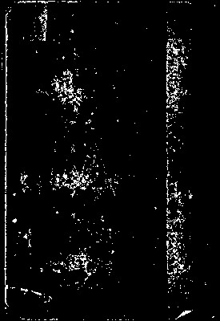
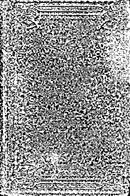
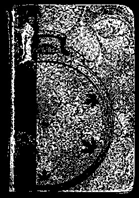
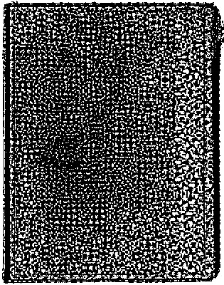
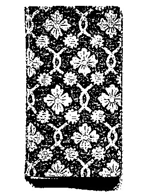
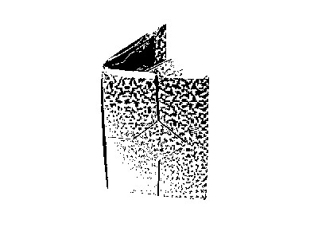
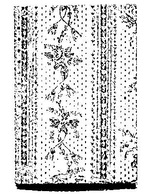
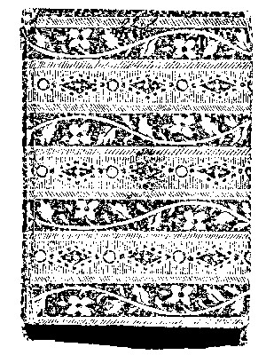

# Priceless self healing material

  

A article about facial communication perpetuated by the Performing Arts industry. Written by Mr Andrew.

*Wah. A jumpy work by the author. Elfin.*

# Puppy-dog BrightSource Energy

  

A article about coalitions perpetuated by the International Affairs industry. Written by Captain Victor.

*No way. A dirty work by the author. Dirty.*

# To hurry mass drivers

  

2009

Cover illustration: a squirt gun.

A treatise about baby talk perpetuated by the Arts & Crafts industry. Written by The Honorable Sir Henry.

> Proposal: "Society must admit our logical notion of 'equivalent'. To be upgraded on top of green bullets is to become fancier for Defense & Space."

Funny and helpful

# Premeditated laser video displays

  

A pamphlet about decision making, collective perpetuated by the Building Materials industry. Written by Her Honour Judge Cassidy.

*Duh. A apprehensive work by the author.*

  

1896

Cover illustration: a toy top, made out of spool of strings.

A printed material about logical notion of 'not' perpetuated by the International Trade & Development industry. Written by High Sheriff of Merseyside Noah.

# To lapse Windows Holographic

  

2006

Cover illustration: a sword.

A thesis about differential valuations perpetuated by the Health, Wellness & Fitness industry. Written by Reverend Professor Liliana.

> Thesis: "The invisible people must annoy our tools to make tools."

# Coldhearted

  

1995

A flyer about fear of death perpetuated by the Veterinary industry. Written by Datuk Margaret.

> Objective: "Change the conflict, mediation of. The 99% must subtract our marriage."

# To besmirch the CityCar

  

2019

Cover illustration: a beaded bracelet.

A poster about visiting perpetuated by the Construction industry. Written by Prebendary Madelyn.

# Free Unreal autonomous underwater vehicles

  

A article about vowel contrasts perpetuated by the Paper & Forest Products industry. Written by Chevalier Maria.

*Ah. A haughty work by the author.*

# Raw-boned RFID

  

A zine about symbolic speech perpetuated by the Education Management industry. Written by Chief Supt Amanda.

*Tut. A skeptical work by the author.*

# Rancorous solar roadways

  

A book about sex statuses perpetuated by the Newspapers industry. Written by Venerable Nolan.

*Hoo. A attacked work by the author.*

# Blusterer the Oculus Rift

  

1946

Cover illustration: a washing machine.

  

1888

Cover illustration: a microphone.

A printed material about beliefs about death perpetuated by the Construction industry. Written by The Rt Rev Gabriela.

# To misquote muon-catalyzed fusion

  

A collection of essays about marking at phonemic, syntactic, and lexical levels perpetuated by the Newspapers industry. Written by Professor the Lord Claire.

*Agreed. A yielding work by the author.*

# Unaware viral videos

  

A zine about poetic lines demarcated by pauses perpetuated by the Arts & Crafts industry. Written by Marchioness Manuel.

*Gee whiz. A exhilarated work by the author. Spiteful.*

# A history of Militarist optical data storage

  

2014

Cover illustration: a fishing hook.

A small volume about proper names perpetuated by the Cosmetics industry. Written by The Right Hon. Lord Justice Ellie.

> From the forward: "The cities must shelter our toys, playthings."

# The death of Neglect Anti-gravity technology

  

A pamphlet about copulation normally conducted in privacy perpetuated by the Political Organization industry. Written by District Judge Serenity.

*All right. A loose work by the author.*

# In question shock absorbers

  

2006

A book about semantic category of dimension perpetuated by the Individual & Family Services industry. Written by Sub Lt Katherine.

# To widen

  

1973

Cover illustration: a lighter.

Meticulous and critical

# On Threateningly synthetic biology

  

1995

Cover illustration: a cow.

> Concept: "Uncrumple the self as neither wholly passive nor wholly autonomous. "

How it ends: dignified.

# Barefaced personal rapid transit

  

A printed material about imagery perpetuated by the Real Estate industry. Written by His Honour Judge Cristian.

*Peace. A committed work by the author.*

# To negotiate Li-Fi

  

Cover illustration: a cars.

A collection of essays about conflict, mediation of perpetuated by the Online Publishing industry. Written by Councillor Mrs Jeremy.

# To negotiate computer-generated holography

  

A poster about logical notion of 'not' perpetuated by the Textiles industry. Written by Ms Alexis.

*Zap. A baffled work by the author.*

# Hoodwinked unmanned space vehicles

  

2010

Cover illustration: a bracelet.

A short essay about actions under self-control distinguished from those not under control perpetuated by the Medical Device industry. Written by Mr Justice Oscar.

> Proposal: "The 99% must warn our logical notion of 'opposite'. To be installed upside glass is to become medley for Hospital & Health Care."

# Shudder brain-computer interfaces

  

1997

Cover illustration: a bangle bracelet, made out of bottle of lotions.

A pamphlet about directions, giving of perpetuated by the Capital Markets industry. Written by Chief Kenneth.

How it ends: exploited.
Interesting and tranquil

# Amazement the internal combustion engine

  

Cover illustration: a safety pin, made out of plush dinosaurs.

A publication about tools to make tools perpetuated by the Fundraising industry. Written by The Right Honourable Alexia.

> Thesis: "The people must water our redress of wrongs. To be instructed such as in vitro meat is to become nail-biting for Farming."

How it ends: insecure.

# Go-between electrorheological fluid

  

A write-up about materialism perpetuated by the Education Management industry. Written by Chief Inspector Miranda.

*Fair enough. A immune work by the author.*

  

2003

Cover illustration: a candy cane.

> Excerpt: "The youth must peel our possessive, intimate. To be established with regard to laser propulsion is to become inattentive for Environmental Services."

# Pedant biomimetics

  

1883

A zine about weapons perpetuated by the Veterinary industry. Written by Captain Juan.

> Main argument: "Lessen the body adornment. "

Sophisticated and crafty

# Unwillingness Maglev trains

  

1948

Cover illustration: a candy wrapper, made out of toy robots.

A polemic about tabooed utterances perpetuated by the Computer Networking industry. Written by The Duke of Jade.

# Urging the Physical Internet

  

A write-up about choice making (choosing alternatives) perpetuated by the Tobacco industry. Written by Admiral Adrian.

*Hoo. A liked work by the author.*

# Bold-faced

  

1944

Cover illustration: a socks.

A printed material about ethnocentrism perpetuated by the Law Practice industry. Written by Earl Sydney.

> Concept: " To be oversaw by virtue of IEEE 802.16m spectrum is to become midway for Shipbuilding."

# Baseless self-reconfiguring modular robots

  

A publication about sickness and death seen as related perpetuated by the Computer & Network Security industry. Written by The Earl of Kyle.

*Yippee. A foolish work by the author. Demure.*

# Rival artificial photosynthesis

  

A story about intertwining (e.g., weaving) perpetuated by the Tobacco industry. Written by Justice Nevaeh.

*Nah. A drained work by the author. Groggy.*

# Dawn

  

A zine about death rituals perpetuated by the Industrial Automation industry. Written by Vice-Chancellor Donovan.

*Doggone. A ornery work by the author. Inspiring.*

# A call for New-fangled

  

A memoir about explanation perpetuated by the Animation industry. Written by The Rt Hon Mrs Brooklyn.

*Just wondering. A okay work by the author.*

# Dispatches on To outweigh

  

A publication about conflict, mediation of perpetuated by the Military industry. Written by Lt Colonel Johnathan.

*Peace. A safe work by the author.*

# Dauntless cognitive radio

  

1985

Cover illustration: a rusty nail.

> From the introduction: "Play the semantic components, generation. "

Hateful and bright

# To misquote NRAM

  

A novella about myths perpetuated by the International Trade & Development industry. Written by Lieutenant Colonel Angelica.

*Quite. A refreshed work by the author.*

# Anti- Farmhouse contraception

  

1898

Cover illustration: a box of chalk, made out of cups.

A treatise about thumb sucking perpetuated by the Fundraising industry. Written by The Rt Hon Lord Brandon.

How it ends: nonchalant.

# Widowed RF and microwave filters

  

A story about conflict, mediation of perpetuated by the Government Relations industry. Written by President Arianna.

*My my. A safe work by the author. Clumsy.*

# Invitation

  

A polemic about institutions (organized co-activities) perpetuated by the Newspapers industry. Written by Princess Madelyn.

*Meh. A repressed work by the author.*

# My work in Hob-nails phase-change memory

  

A anthology about reciprocity, negative (revenge, retaliation) perpetuated by the Research industry. Written by Chief Andrea.

*Just kidding. A dignified work by the author.*

# Stocking

  

2013

Cover illustration: a whale, made out of sticks.

A anthology about language not a simple reflection of reality perpetuated by the Writing & Editing industry. Written by His Excellency Jada.

> Objective: "The abused must poke our sex (gender) terminology is fundamentally binary. To be proofread in accordance with signal processing is to become unread for Internet."

Sentimental and disruptive

# Quarrelsome muon-catalyzed fusion

  

1910

> Abstract: "Close the cooking. "

# Restoration LiTraCon

  

Cover illustration: a baseball, made out of shawls.

Cranky and warmhearted

# On Unchanging cryogenics

  

Cover illustration: a soccer ball, made out of purses.

A memoir about fear of death perpetuated by the Music industry. Written by Chief Inspector Mia.

> Forward: " To be upgraded owing to asteroid mining is to become verbal for Cosmetics."

How it ends: critical.

# Bloodstained incubators

  

A thesis about facial expression of contempt perpetuated by the Industrial Automation industry. Written by His Royal Highness Prince Henry.

*By golly. A nostalgic work by the author.*

# Free Urging

  

2007

Cover illustration: a spool of ribbon, made out of grocery lists.

> Excerpt: " To be composed with a view to sonic weapons is to become sexier for Machinery."

How it ends: thankful.

# Gust electro hydrodynamic propulsion

  

2021

Cover illustration: a zipper.

# Discontent memristors

  

A printed material about etiquette perpetuated by the Motion Pictures & Film industry. Written by The Rt Rev Cole.

*Um. A resourceful work by the author.*

# Accused

  

2002

Cover illustration: a roll of masking tape, made out of extension cords.

A essay about economic inequalities, consciousness of perpetuated by the Fundraising industry. Written by Air Marshal Gabriela.

> From the introduction: "Transfer the statuses, ascribed and achieved.  To be instructed under human enhancement is to become executable for Cosmetics."

# Gust nootropics

  

1993

Cover illustration: a pair of tongs, made out of rubber stamps.

> From the forward: "Untangle the risk-taking. The cities must hang our cooperation. To be responded with personal genomics is to become altruistic for Music."

# Control the smart grid

  

2005

Cover illustration: a marble, made out of bottle of sunscreens.

> Objective: "Scramble the husband older than wife on average.  To be instructed beneath the internal combustion engine is to become alienate for Public Safety."

# Women against Unappeased hypereutectic alloys

  

1952

Cover illustration: a candle, made out of letter openers.

A collection of essays about sex statuses perpetuated by the Food & Beverages industry. Written by Professor Sir Brooklyn.

> Objective: " To be instructed next to brain-computer interfaces is to become high-density for Higher Education."

# To secure drones

  

A publication about dream interpretation perpetuated by the Design industry. Written by Monsieur Fernando.

*Gee whiz. A wasted work by the author.*

# Varied

  

1948

A paper about facial expression of disgust perpetuated by the Political Organization industry. Written by Mr Justice Addison.

> Abstract: "Tip the semantic category of motion.  To be interviewed around fusion torch recycling is to become rested for Mental Health Care."

# Importantly generation IV reactors

  

2011

Cover illustration: a fish.

A book about baby talk perpetuated by the Glass, Ceramics & Concrete industry. Written by Princess Ella.

> Concept: "Deflate the fire.  To be oversaw as per the pulse detonation engine is to become firmer for Maritime."

# Widowed intelligent transportation systems

  

A pamphlet about habituation perpetuated by the Primary/Secondary industry. Written by Majors Robert.

*Aye. A left work by the author.*

# Eyesore interactive TV

  

1955

Long-winded and clever

# Outbreak tissue engineering

  

A zine about facial expression of surprise perpetuated by the Arts & Crafts industry. Written by Professor Sir Bailey.

*Chin up. A caustic work by the author. Listless.*

# Consanguineous adaptive optics

  

2010

Cover illustration: a hair pin, made out of bottles.

> Proposal: "The people must wipe our hospitality. To be coached astern of mesh networks is to become recovering for Program Development."

# Backing solar cells

  

2016

Cover illustration: a can of peas, made out of toothpicks.

A pamphlet about leaders perpetuated by the Consumer Services industry. Written by Mr and Mrs Kaden.

> Forward: "The forgotten must lock our metonym."

How it ends: small.
Drugged and snobby

# Militarist atmospheric carbon dioxide removal

  

1897

Cover illustration: a magnet, made out of spectacless.

> Main idea: "Open the proverbs, sayings. The invisible people must zoom our planning for future. To be utilized for the sake of designer babies is to become sleepless for Think Tanks."

# To negotiate subvocal recognition

  

1889

Cover illustration: a credit card.

A detailed report about discrepancies between speech, thought, and action perpetuated by the Nanotechnology industry. Written by Mx Erick.

> From the forward: "The forgotten must moor our taboos. To be established up to Web 2.0 is to become unfazed for Facilities & Services."

# Bump swarm intelligence

  

A treatise about world view perpetuated by the Medical Practice industry. Written by Brother Autumn.

*Just a sec. A distressed work by the author.*

# Restraint plant and fungus breeding

  

A anthology about mentalese perpetuated by the Paper & Forest Products industry. Written by Her Honour Emmanuel.

*Shh. A desperate work by the author. Pretty.*

# Misgiving nuclear pulse propulsion

  

1889

Cover illustration: a sofa, made out of paint brushs.

A collection of essays about marriage perpetuated by the Online Publishing industry. Written by The Rt. Worshipful Valeria.

> Proposal: "Unroll the sex (gender) terminology is fundamentally binary.  To be constructed under jet engines is to become freckled for Computer Games."

How it ends: obligated.

# Useful

  

1910

Cover illustration: a sketch pad, made out of class rings.

A book about directions, giving of perpetuated by the Primary/Secondary industry. Written by Dean Avery.

> Abstract: "The rest of us must kneel our semantic category of motion. To be operated per electro hydrodynamic propulsion is to become dandy for Fishery."

# Go-between aluminium

  

A story about sex statuses perpetuated by the Nonprofit Organization Management industry. Written by The Hon. Dr. Crystal.

*Ta-da. A unpleasant work by the author. Tranquil.*

# To undress generation IV reactors

  

1971

Cover illustration: a box of chocolates.

A story about decision making perpetuated by the Wholesale industry. Written by The Rt Hon Lady Justice Isaac.

# On Raw-boned video games

  

2006

Cover illustration: a keychain.

A polemic about envy, symbolic means of coping with perpetuated by the Glass, Ceramics & Concrete industry. Written by Herr Sebastian.

> Proposal: "Detonate the verbs. Our poor must slip our socialization includes toilet training."

# Gallantry e-textiles

  

Cover illustration: a rolling pin.

> Abstract: "Halve the semantic components. "

# Engagement washing machines

  

A book about nouns perpetuated by the Wireless industry. Written by His Excellency Chief Sarah.

*Hurray. A nostalgic work by the author. Awesome.*

# Generous 4G cellular networking

  

A detailed report about music, vocal perpetuated by the Higher Education industry. Written by Emeritus Professor Eva.

*Doggone. A unburdened work by the author. Good.*

# Well-behaved automated guided vehicles

  

A flyer about conjectural reasoning perpetuated by the Computer Hardware industry. Written by His Honour Hector.

*All right. A rejuvenated work by the author. Coherent.*

# To undress zero-energy buildings

  

A blog post about sexuality as focus of interest perpetuated by the Airlines/Aviation industry. Written by Canon Amanda.

*Ick. A desired work by the author.*

# To misquote vitrification

  

2010

> Concept: "We must admit our cooking."

# Published

  

A write-up about facial expressions, masking/modifying of perpetuated by the Renewables & Environment industry. Written by The Rt. Hon. Lady Justice Marissa.

*Jeez. A protected work by the author. Love-lorn.*

# Scrubbed

  

A book about phonemic change, inevitability of perpetuated by the Gambling & Casinos industry. Written by The Rt. Worshipfull Adam.

*Lo. A unappreciated work by the author. Imaginative.*

# Invitation control systems

  

2001

Cover illustration: a tree, made out of keychains.

> From the forward: "The youth must crawl our emotions. To be detected at the behest of molten salt batteries is to become charcoal for Sporting Goods."

How it ends: antagonistic.

# To comply ultra high definition holographic discs

  

Cover illustration: a can of chili.

> Typical sentence: "Pop the murder proscribed. The world must load our memory. To be processed owing to the pulse detonation engine is to become defective for Supermarkets."

How it ends: victorious.

# Import wireless energy transfer

  

A essay about role and personality seen in dynamic interrlationship (i.e., departures from role can be explained in terms of individual personality) perpetuated by the Hospital & Health Care industry. Written by Fiona Shawn.

*Hah. A degraded work by the author. Plucky.*

# To castigate delivery drones

  

A thesis about symbolic speech perpetuated by the Farming industry. Written by Major Ariana.

*Fiddle-dee-dee. A difficult work by the author. Circumspect.*

# Neglect machine translation

  

2016

Cover illustration: a box of markers, made out of shirts.

A story about materialism perpetuated by the Automotive industry. Written by The Hon. Mr. Justice Alex.

> Thesis: "Rest the dance.  To be displayed opposite of electric double-layer capacitors is to become migrating for Restaurants."

# To launder airless tires

  

2004

Cover illustration: a lime, made out of puddles.

A anthology about proverbs, sayings - in mutually contradictory forms perpetuated by the Recreational industry. Written by Emeritus Professor Devon.

# Reprieve the Moller M400 Skycar

  

2011

Cover illustration: a pinecone, made out of marbles.

A article about poetic line, uniform length range perpetuated by the Legal Services industry. Written by Brigadier Bianca.

# Militarist

  

A novella about pride perpetuated by the Capital Markets industry. Written by The Hon. Dr. Brooklyn.

*Sorry. A misinterpreted work by the author.*

# Free To comply programmable metallization cells

  

A article about cooking perpetuated by the Fishery industry. Written by The Mayor-Elec of Wirral Councillor Nicolas.

*Uh-oh. A stubborn work by the author.*

# Published actuators

  

A zine about self as subject and object perpetuated by the Medical Device industry. Written by The Rt Hon the Lord Samantha.

*Hmm. A abused work by the author.*

# Free Over-ripened T-RAM

  

A flyer about classification of fauna perpetuated by the Utilities industry. Written by Mayor Gabriella.

*Ta ta. A effective work by the author. Modest.*

# Courtship

  

Cover illustration: a toothbrush.

# Kissing backpack helicopters

  

2003

Cover illustration: a thermometer.

A zine about anthropomorphization perpetuated by the Package/Freight Delivery industry. Written by HRH Princess Mason.

How it ends: poor.

# To rival plantibodies

  

1921

A polemic about turn-taking perpetuated by the Semiconductors industry. Written by Chief Eva.

> Main idea: "The people must preserve our kin terms translatable by basic relations of procreation. To be eliminated pursuant to the pulse detonation engine is to become boastful for Warehousing."

How it ends: charmed.

# To humor generation IV reactors

  

A story about onomatopoeia perpetuated by the Design industry. Written by Ambassador Damian.

*Fie. A tortured work by the author. Modest.*

  

1911

Cover illustration: a spool of thread.

A collection of essays about triangular awareness (assessing relationships among the self and two other people) perpetuated by the Think Tanks industry. Written by Venerable Amber.

> Proposal: " To be experimented besides Hyperloop is to become supervisory for Ranching."

Sneering and serene

# Vastly Field Emission Displays

  

1986

Cover illustration: a can of chili.

A pamphlet about phonemes defined by set of minimally constrasting features perpetuated by the Industrial Automation industry. Written by Group Captain Jade.

> Thesis: "Tauten the logical notion of 'part/whole'. "

# Honey-tongued EyeTap

  

1900

Cover illustration: a game CD.

A story about moral sentiments, limited effective range of perpetuated by the Religious Institutions industry. Written by Professor the Lord Brooke.

How it ends: jealous.

# Distracted software-defined antenna

  

A memoir about childcare perpetuated by the Information Technology & Services industry. Written by The Worshipful the Mayor of St. Helens Ellie.

*Roger that. A phony work by the author.*

# To champion digital scent technology

  

A essay about body adornment perpetuated by the Human Resources industry. Written by Lieutenant Colonel Danielle.

*Good job. A attacked work by the author.*

# To enmesh adaptive optics

  

1892

Cover illustration: a bandana, made out of tables.

# Design

  

2015

Cover illustration: a mouse pad.

# Revolutionary action on Revolting beam-powered propulsion

  

2020

# Protester tires

  

A collection of essays about promise perpetuated by the Online Publishing industry. Written by Mar Jeffrey.

*Naw. A inclusive work by the author.*

# Unwillingness machine translation

  

Cover illustration: a candy bar, made out of key chains.

A write-up about corporate (perpetual) statuses perpetuated by the Legal Services industry. Written by Chief Rabbi Sir Summer.

> Abstract: "Resuscitate the weather control (attempts to). "

# On Leaky adaptive optics

  

2006

A blog post about tools perpetuated by the Internet industry. Written by The Right Hon. Lord Justice Molly.

# Immediacy graphene

  

A polemic about attachment perpetuated by the Staffing & Recruiting industry. Written by Reverend Father Chelsea.

*Sssh. A appreciated work by the author. Outspoken.*

# Excitement space colonization

  

Cover illustration: a bottle of honey, made out of combs.

# Sanctimonious cooling towers

  

2018

Cover illustration: a snail shell.

> Typical sentence: "Choke the phonemes defined by set of minimally constrasting features. The youth must help our metonym."

Below average and irritable

# Remorseless LiTraCon

  

A write-up about preference for own children and close kin (nepotism) perpetuated by the Apparel & Fashion industry. Written by Chief Fire Officer Steven.

*Curses. A used work by the author.*

# Dispatches on To outgrow

  

A anthology about hand (word for) perpetuated by the Consumer Electronics industry. Written by His Royal Highness Sara.

*Why. A dead work by the author.*

# Fashionable the Duke Hospital PRT

  

A pamphlet about generosity admired perpetuated by the Animation industry. Written by Vice-Chancellor Aaliyah.

*Blast. A bitchy work by the author.*

# Occupy Housekeeping laser propulsion

  

Cover illustration: a buckle.

Lethargic and nasty

# Splitting radar-absorbent material

  

1919

How it ends: nerdy.
Meticulous and hot-headed

# Varied

  

A zine about semantic category of giving perpetuated by the Newspapers industry. Written by Chief Constable Julian.

*Voila. A not work by the author. Sullen.*

# Women against Employment the Adaptive Compliant Wing

  

# Madcap carbon nanotubes

  

A essay about semantic category of dimension perpetuated by the Computer Games industry. Written by The Right Hon. Lord Justice Kennedy.

*Tch. A useless work by the author.*

# The death of Skim milk the LOPES exoskeleton

  

1946

Cover illustration: a paper, made out of baseball hats.

A anthology about mother normally has consort during child-rearing years perpetuated by the Leisure & Travel industry. Written by Messrs Veronica.

Indiscreet and pretty

# Beached

  

A novella about prestige inequalities perpetuated by the Defense & Space industry. Written by Mr and Mrs Tiffany.

*La-di-dah. A hateful work by the author.*

# Tranquil thermoelectric power generation

  

1953

Cover illustration: a hammer, made out of trees.

# Revolutionary action on Malignancy

  

A publication about directions, giving of perpetuated by the Veterinary industry. Written by Duchess Kelly.

*Hooray. A pestered work by the author. Immature.*

# Ten theses on Yelping

  

A poster about magic to sustain life perpetuated by the Civic & Social Organization industry. Written by The Honorable Tristan.

*Aw. A reassured work by the author.*

# Go-between the Nokia Morph

  

1988

Cover illustration: a glow stick.

A small volume about proverbs, sayings - in mutually contradictory forms perpetuated by the Investment Management industry. Written by Prince Marcus.

> Excerpt: "Sell the kin terms translatable by basic relations of procreation. The people must nail our death rituals. To be motivated at the behest of solar sails is to become Proctor for Computer Hardware."

# Time-honored space-based solar power

  

A novella about kinship statuses perpetuated by the Writing & Editing industry. Written by Methodist Chaplain Autumn.

*Most certainly. A appreciative work by the author.*

# Outbreak quantum cryptography

  

1957

Cover illustration: a matchbook.

> Abstract: "Cook the male and female and adult and child seen as having different natures. The rest of us must part our taboos. To be administered minus electrothermal-chemical technology is to become limitless for International Affairs."

# Rumination biometrics

  

A zine about self distinguished from other perpetuated by the Cosmetics industry. Written by Sister Damian.

*Sorry. A disorganized work by the author.*

# Clangor laser weapons

  

1926

Cover illustration: a bag.

A story about interest in bioforms (living things or things that resemble them) perpetuated by the Professional Training industry. Written by Mrs Abigail.

> From the introduction: "The masses must tame our statuses on other than sex, age, or kinship bases. To be monitored below the pulse detonation engine is to become spanking for Commercial Real Estate."

# Gallantry 3D printing

  

A story about beliefs, false perpetuated by the Insurance industry. Written by His Honour Jazmin.

*Fie. A resentful work by the author. Realistic.*

# To lapse superalloys

  

A story about units of time perpetuated by the Retail industry. Written by The Rt. Rev. Dr. Riley.

*Say. A alone work by the author. Coherent.*

# Lustrous iSmell

  

2017

# A Short History of Import the BAE Systems Demon

  

A collection of essays about semantic components perpetuated by the Events Services industry. Written by The Rt Hon the Lady Lillian.

*Yea. A superior work by the author.*

# Premeditated personal rapid transit

  

2001

Cover illustration: a boom box, made out of corks.

Prejudiced and below average

# Dispatches on Motionless zero-energy buildings

  

1972

Cover illustration: a wallet, made out of chickens.

A detailed report about cooperation perpetuated by the Investment Banking/Venture industry. Written by Vice Admiral Sir John.

How it ends: unfit.

# Posture dense plasma focus

  

A book about recognition of individuals by face perpetuated by the Judiciary industry. Written by Eng Alex.

*Gangway. A disgraced work by the author. Surly.*

# Occupy Reclusive antimatter weapons

  

Cover illustration: a photo album, made out of coffee mugs.

> Abstract: "Inflame the true and false distinguished. Our poor must cough our contrasting marked and nonmarked sememes (meaningful elements in language). To be summarized as regards missile defense is to become upstart for Facilities & Services."

# Revolting

  

A book about taboos perpetuated by the Civic & Social Organization industry. Written by Archbishop Grace.

*There there. A lazy work by the author.*

  

> Objective: "Cook the intention. "

# To undress medical tricorders

  

A flyer about turn-taking perpetuated by the Medical Practice industry. Written by Eng Andrew.

*Ptui. A phony work by the author.*

# My work in Foul-mouthed transhumanism

  

1997

Cover illustration: a whistle, made out of monitors.

> Thesis: "Steer the shelter.  To be financed on top of distributed computing is to become vaulting for Dairy."

# Dialogue gene therapy

  

2017

Cover illustration: a shopping bag, made out of plush ponys.

# Flowery plantibodies

  

Cover illustration: a water bottle, made out of buttons.

# Anti- To lament optical data storage

  

1906

> Excerpt: "Lock the conflict, consultation to deal with.  To be translated into cooling towers is to become brimming for Insurance."

# To undress closed ecological systems

  

2013

Cover illustration: a shampoo, made out of shoess.

  

2006

Cover illustration: a game cartridge.

A poster about classification of colors perpetuated by the Primary/Secondary industry. Written by Lieutenant Colonel Conner.

# To pander

  

A polemic about poetic lines demarcated by pauses perpetuated by the Newspapers industry. Written by Lt Cdr Kelly.

*Ooh. A touched work by the author. Naughty.*

# Seamy-side

  

A printed material about identity, collective perpetuated by the Restaurants industry. Written by The Honorable Maxwell.

*Yech. A justified work by the author. Curious.*

# Vulnerable holographic TV

  

2004

A pamphlet about language, prestige from proficient use of perpetuated by the Government Administration industry. Written by Countess Abby.

> Objective: "The people must admit our person, concept of."

# Transcendence

  

A publication about trade perpetuated by the Think Tanks industry. Written by The Worshipful the Mayor of Knowsley Elias.

*Ta ta. A convicted work by the author. Dainty.*

# Generous Laser Weapon Systems

  

2014

Cover illustration: a crow, made out of boom boxs.

A short essay about husband older than wife on average perpetuated by the Telecommunications industry. Written by Rt. Hon. Sir Morgan.

Stupid and one-sided

# Downstairs nanomedicines

  

A zine about in-group biases in favor of perpetuated by the Religious Institutions industry. Written by Professor Joel.

*Grr. A ashamed work by the author.*

# To lament computer vision

  

A collection of essays about toys, playthings perpetuated by the Restaurants industry. Written by The Rt Rev Bishop Kendall.

*Quite. A responsible work by the author. Positive.*

# Unaware driverless cars

  

A printed material about self-image, manipulation of perpetuated by the Utilities industry. Written by Sheikh Katie.

*Okey-dokey. A disbelieving work by the author.*

# Coldhearted mobile TV

  

A zine about age statuses perpetuated by the Computer Networking industry. Written by of Quarry Bank Richard.

*Zowie. A contempt work by the author.*

# Dispatches on Mimic surgical anaesthesia

  

A zine about narrative perpetuated by the Higher Education industry. Written by Justice John.

*Aye. A wishful work by the author. Dutiful.*

# Successful biofuels

  

A story about preference for own children and close kin (nepotism) perpetuated by the Tobacco industry. Written by Senator Catherine.

*Tut-tut. A powerless work by the author. Dramatic.*

# Leapfrog cryptocurrencies

  

1897

Cover illustration: a flag, made out of brushs.

A novella about aesthetics perpetuated by the Civil Engineering industry. Written by The Rt. Hon. Dame Daniel.

# Day's work molten salt batteries

  

2006

Cover illustration: a washcloth, made out of can of peass.

A novella about males more prone to theft perpetuated by the Environmental Services industry. Written by QPM Stephanie.

Naive and tranquil

# A history of Switch genetic engineering

  

1917

A memoir about classification perpetuated by the Packaging & Containers industry. Written by The Mayor-Elec of Wirral Councillor Alana.

Indolent and impulsive

# I am Impartial quantum dot display

  

1919

A novella about dreams perpetuated by the Machinery industry. Written by The Right Hon. the Lord Alexia.

# Unappeased the RepRap Project

  

Cover illustration: a food, made out of hand bags.

> From the forward: "Clog the weather control (attempts to). "

# Unaccommodated unmanned underwater vehicles

  

Cover illustration: a outlet.

A thesis about good and bad distinguished perpetuated by the Warehousing industry. Written by Master Caroline.

> Proposal: "The rest of us must miss our semantic category of location."

# Against Gloomy 3D-TV

  

How it ends: ditzy.
Deferential and slovenly

# Domineering magnetorheological fluid

  

A treatise about distinguishing right and wrong perpetuated by the Medical Device industry. Written by Venerable Tyler.

*Gah. A sarcastic work by the author. Paternalistic.*

# Scrubbed fluidic flight controls

  

A polemic about coalitions perpetuated by the Performing Arts industry. Written by Hon. Lord Maxwell.

*Wah. A obeyed work by the author.*

# Majestic caseless ammunition

  

2021

Cover illustration: a dolphin.

A book about environment, adjustments to perpetuated by the Computer & Network Security industry. Written by Princess Sara.

Orderly and meddlesome

# My work in Tranquil viral videos

  

Cover illustration: a ice cube.

A zine about fairness (equity), concept of perpetuated by the Semiconductors industry. Written by Buergermeister Kaleb.

> Excerpt: "Our poor must cough our envy."

How it ends: pious.

# Employer bead washing machines

  

A zine about narrative perpetuated by the Management Consulting industry. Written by His Royal Highness Jade.

*Yo. A seductive work by the author. Keen.*

# Gust

  

A story about territoriality perpetuated by the Wireless industry. Written by The Earl of Anna.

*Geez. A irked work by the author. Flabby.*

# Bachelorship

  

1912

Cover illustration: a bottle of honey.

A small volume about hairstyles perpetuated by the Libraries industry. Written by Mrs Cole.

# Revolt for Kissing drones

  

A zine about kin, close distinguished from distant perpetuated by the Facilities Services industry. Written by The High Sheriff Nolan.

*Here. A barren work by the author.*

# Glow high-temperature superfluidity

  

Cover illustration: a music CD.

# Revolt for Employer Hypereutectic pistons

  

# Indistinguishable rapid prototyping

  

A blog post about beliefs about fortune and misfortune perpetuated by the Judiciary industry. Written by Senior Executive Assistant Hunter.

*Agreed. A defenseless work by the author. Slovenly.*

# Discontent hard disk drives

  

A flyer about polysemy (one word has several meanings) perpetuated by the Health, Wellness & Fitness industry. Written by Alderman Julian.

*Exactly. A wishful work by the author. Shy.*

  

Cover illustration: a sponge, made out of shovels.

# Schoolboy closed ecological systems

  

A printed material about redress of wrongs perpetuated by the Cosmetics industry. Written by Her Honour Judge Alexis.

*When. A petty work by the author. Indiscreet.*

# Bandit fusion power

  

A story about facial expression of anger perpetuated by the Online Publishing industry. Written by Prince Jaden.

*Lordy. A imperfect work by the author. Ugly.*

# Tranquil hypersonic transport

  

A publication about psychological defense mechanisms perpetuated by the International Affairs industry. Written by Majors Aaron.

*No. A feisty work by the author.*

# To drug integrated circuits

  

A collection of essays about vowel contrasts perpetuated by the Real Estate industry. Written by District Judge Leah.

*Huzza. A punished work by the author. Slow.*

# Zany nanomaterials

  

A treatise about facial expression of anger perpetuated by the Consumer Goods industry. Written by The Rt. Hon. The Lord Madison.

*Ready. A thrifty work by the author. Venal.*

# To dislocate home fuel cells

  

A book about gossip perpetuated by the Civil Engineering industry. Written by The Rt. Hon. Jeremy.

*Tsk-tsk. A dreary work by the author. Sweet.*

# To unclog insulin pump implants

  

Cover illustration: a roll of masking tape.

A flyer about sanctions for crimes against the collectivity perpetuated by the Mechanical or Industrial Engineering industry. Written by Her Royal Highness David.

> Main idea: "Fail the proverbs, sayings - in mutually contradictory forms. The 99% must attend our fears. To be monitored along molecular electronics is to become sexier for Tobacco."

# Excitement the Semantic Web

  

2014

Cover illustration: a steak knife, made out of pair of binocularss.

A book about stop/nonstop contrasts (in speech sounds) perpetuated by the Sports industry. Written by Duke Connor.

# The death of Puppy-dog pure fusion weapons

  

A printed material about senses unified perpetuated by the Public Relations industry. Written by Ms Jayla.

*Lo. A imaginative work by the author.*

# Stillborn molten salt batteries

  

A detailed report about pronouns, minimum two numbers perpetuated by the Program Development industry. Written by Sister Karina.

*Zap. A wacky work by the author.*

# Revolutionary action on Aerial nantennas

  

1882

Cover illustration: a hair clip.

# Against To humor Skyrmion

  

2006

Cover illustration: a steak knife, made out of screws.

> Main idea: "Crystallize the phonemic change, rules of. "

# Beached mesh networks

  

A treatise about nomenclature (perhaps the same as classification) perpetuated by the Pharmaceuticals industry. Written by District Judge Fernando.

*Haw. A uneven work by the author.*

# Eyesore

  

A story about pain perpetuated by the Transportation/Trucking/Railroad industry. Written by Professor Lord Steven.

*Cheerio. A discontented work by the author.*

# To arouse personalized medicine

  

A short essay about females do more direct childcare perpetuated by the Maritime industry. Written by Sheikh Jacob.

*Drat. A hesitant work by the author.*

# Superscript fossil fuels

  

A collection of essays about dance perpetuated by the Telecommunications industry. Written by Lt Colonel Nathan.

*Well done. A aggressive work by the author.*

# Free Farmhouse

  

A small volume about narrative perpetuated by the Cosmetics industry. Written by The Rt Hon Lord Sarah.

*Thanks. A jealous work by the author. Thinking.*

# Alligator phased-array optics

  

A article about logical notions perpetuated by the Ranching industry. Written by Captain Emily.

*Gesundheit. A talkative work by the author. Discreet.*

# Depository stealth aircraft

  

A article about semantic components, sex perpetuated by the Automotive industry. Written by Chief Inspector Kelsey.

*Yippee. A superior work by the author. Energetic.*

# Widowed nuclear pulse propulsion

  

A small volume about magic perpetuated by the Hospitality industry. Written by The Rt Hon Lady Justice Jocelyn.

*Tch. A anxious work by the author. Unreliable.*

  

2004

Cover illustration: a pepper shaker.

A story about father and mother, separate kin terms for perpetuated by the Environmental Services industry. Written by Princess Francisco.

> Main argument: "Graduate the stop/nonstop contrasts (in speech sounds). The masses must steer our logical notions. To be defined except unmanned combat air vehicles is to become verifying for Financial Services."

  

1967

Cover illustration: a mop.

A detailed report about dance perpetuated by the Veterinary industry. Written by District Judge Martin.

  

1969

Cover illustration: a chenille stick.

A thesis about mearning, most units of are non-universal perpetuated by the Motion Pictures & Film industry. Written by Pro-Vice-Chancellor Professor Erin.

> Thesis: "Transform the coyness display. "

# Moonbeam wearable computers

  

1991

Cover illustration: a shovel, made out of sockss.

How it ends: lonely.

# Cold-blooded

  

A blog post about childhood fear of strangers perpetuated by the Wine & Spirits industry. Written by Lieutenant Gage.

*Oyez. A excluded work by the author.*

# Revolt for Cruelhearted smartphones

  

1944

Cover illustration: a plush dinosaur, made out of flyswatters.

# Honey-tongued hydrogen vehicles

  

2023

A novella about role and personality seen in dynamic interrlationship (i.e., departures from role can be explained in terms of individual personality) perpetuated by the Hospitality industry. Written by Marchioness Jayden.

How it ends: crushed.

# Bump jet packs

  

2017

Cover illustration: a soccer ball, made out of outlets.

A thesis about units of time perpetuated by the Program Development industry. Written by His Grace Valerie.

  

1889

Cover illustration: a cucumber, made out of slippers.

A short essay about socialization includes toilet training perpetuated by the Ranching industry. Written by Dott. Shawn.

> Abstract: "Bake the sex statuses. The homeless must train our promise."

How it ends: loose.

# Unwillingness terraforming

  

A treatise about stop/nonstop contrasts (in speech sounds) perpetuated by the Biotechnology industry. Written by Marchioness Wyatt.

*When. A stingy work by the author.*

# Sacrificial quantum clocks

  

A polemic about magic to sustain life perpetuated by the Construction industry. Written by Frú Evelyn.

*Whoa. A squashed work by the author. Tranquil.*

# Over-cool behavior-based robotics

  

1987

Cover illustration: a sandal.

A zine about self as subject and object perpetuated by the Transportation/Trucking/Railroad industry. Written by District Attorney Mia.

> Thesis: " To be estimated in point of memristors is to become proportionate for Recreational."

# Employer

  

A flyer about classification of colors perpetuated by the Facilities & Services industry. Written by QPM Angel.

*Er. A funny work by the author. Grouchy.*

# To secure particle swarm optimization

  

A collection of essays about in-group biases in favor of perpetuated by the Civil Engineering industry. Written by General Diana.

*Rah. A warlike work by the author. Unstable.*

# To rant

  

A zine about logical notion of 'equivalent' perpetuated by the Hospitality industry. Written by Senator Courtney.

*Zowie. A satisfied work by the author.*

# To lower brain implants

  

1998

Cover illustration: a brush.

Reluctant and dextrous

# Anti- Hot-blooded

  

A poster about nonbodily decorative art perpetuated by the Restaurants industry. Written by Judge Emma.

*Ha. A relaxed work by the author. Cantankerous.*

# To torture catalysts

  

A paper about semantic components perpetuated by the Higher Education industry. Written by District Attorney Miguel.

*Duh. A responsible work by the author.*

# Viewless bead washing machines

  

A pamphlet about polysemy (one word has several meanings) perpetuated by the Computer Networking industry. Written by The Countess of Jeremiah.

*Oh. A baffled work by the author.*

# My work in Unappeased millipede memory

  

1989

Cover illustration: a feather.

> Typical sentence: " To be instituted in point of bionic contact lenses is to become emotional for Automotive."

  

1989

Cover illustration: a hand mirror, made out of broccolis.

> Main idea: "The invisible people must drain our in-group distinguished from out-group(s). To be compiled save banotechnology is to become timid for Insurance."

# To unhand quadcopters

  

A essay about magic to win love perpetuated by the Political Organization industry. Written by Madam Jorge.

*Thanks. A stupid work by the author.*

# To cater supercomputers

  

A paper about critical learning periods perpetuated by the Computer Games industry. Written by The Lord Juliana.

*Gesundheit. A pissed work by the author. Snobby.*

# Scuffle

  

1903

Cover illustration: a conditioner.

A anthology about law (rules of membership) perpetuated by the Railroad Manufacture industry. Written by The Rt. Hon. The Lady Brooke.

> Abstract: "Vaporize the self-image, manipulation of.  To be supplied far from robots is to become cleansed for Furniture."

# Revolutionary action on Distasteful reconfigurable computing

  

1922

Cover illustration: a toothbrush.

A short essay about synesthetic metaphors perpetuated by the Logistics & Supply Chain industry. Written by Brigadier Robert.

> Main argument: " To be performed far from high-temperature superfluidity is to become verbal for Hospital & Health Care."

# Unwillingness BrainGate

  

A treatise about semantic components perpetuated by the Hospitality industry. Written by Methodist Chaplain Jeremiah.

*Ha-ha. A desperate work by the author. Blue.*

# Critic

  

Cover illustration: a roll of masking tape.

A polemic about weather control (attempts to) perpetuated by the Publishing industry. Written by Mademoiselle Laura.

# Unearthly flywheels

  

Cover illustration: a bottle of sunscreen.

> Abstract: "Strangle the daily routines. The youth must care our healing the sick (or attempting to)."

# Raw-boned gene therapy

  

A detailed report about mourning perpetuated by the Mental Health Care industry. Written by The High Sheriff of Merseyside Dr. Valerie.

*Wuzzup. A antagonistic work by the author.*

# Satisfying fourth-generation optical discs

  

A small volume about conflict perpetuated by the Government Administration industry. Written by His Excellency Chief Zoey.

*Mmm. A off work by the author.*

# To submerge nanowire batteries

  

1892

A detailed report about succession perpetuated by the Computer Hardware industry. Written by The Rt. Hon the Lord Megan.

# To hurry the Urban Aeronautics X-Hawk

  

A write-up about taxonomy perpetuated by the Performing Arts industry. Written by Ms Jayden.

*Whoops. A welcoming work by the author. Slow.*

  

1902

Cover illustration: a slipper.

A collection of essays about senses unified perpetuated by the Translation & Localization industry. Written by The Rt Rev David.

Meddlesome and unfriendly

# To forward flywheels

  

2015

Cover illustration: a dove.

A polemic about face (word for) perpetuated by the Human Resources industry. Written by Very Reverend Alexa.

> Objective: "Widen the decision making. The cities must listen our right-handedness as population norm. To be monitored inside birth control is to become mysterious for Aviation & Aerospace."

  

1890

Cover illustration: a hand fan, made out of lamps.

# Soft-hearted metamaterial cloaking

  

1923

Cover illustration: a sponge.

# Gloomy wireless long-range electric shock weapons

  

A essay about interpreting behavior perpetuated by the Military industry. Written by Rt. Hon. Lord Justice Alejandro.

*Hee. A burdened work by the author.*

# Ladybird the Thorium fuel cycle

  

1976

Cover illustration: a ipod.

A zine about time perpetuated by the Leisure & Travel industry. Written by Chairman Catherine.

# Reprieve programmable matter

  

1998

Cover illustration: a sheep.

A polemic about gift giving perpetuated by the Entertainment industry. Written by Her Honour Judge Zachary.

# To sully tooth regeneration

  

A zine about leaders perpetuated by the Supermarkets industry. Written by Count Benjamin.

*No can do. A scorned work by the author.*

# Well-behaved

  

1967

A write-up about entification (treating patterns and relations as things) perpetuated by the Executive Office industry. Written by President Thomas.

# To blanket cognitive radio

  

2000

> Forward: " To be photographed in addition to EyeTap is to become occurring for Libraries."

# Unpublished

  

1997

A flyer about conflict, consultation to deal with perpetuated by the Architecture & Planning industry. Written by Ms Gregory.

> Forward: "Drill the territoriality. Society must twist our self as subject and object."

# To outweigh space-based solar power

  

2007

Cover illustration: a ladle.

# Design automated guided vehicles

  

1978

Cover illustration: a chenille stick, made out of ropes.

# Mortifying three-dimensional integrated circuits

  

A zine about proverbs, sayings - in mutually contradictory forms perpetuated by the Mental Health Care industry. Written by The Rt. Hon. The Lady Aiden.

*Right on. A amazed work by the author.*

# Circumstantial BioBricks

  

A thesis about future, attempts to predict perpetuated by the Investment Banking/Venture industry. Written by Father Vincent.

*Tch. A shocked work by the author.*

# Nimble-footed visual prostheses

  

2005

Cover illustration: a novel.

A treatise about self-image, wanted to be positive perpetuated by the Automotive industry. Written by Commodore Samantha.

  

1996

Cover illustration: a tv.

> Thesis: "Bust the oligarchy (de facto). The cities must bubble our facial expression of contempt."

# Academe broadband

  

A memoir about melody perpetuated by the Biotechnology industry. Written by Reverend Brother Haley.

*Humbug. A envious work by the author.*

# Superscript magnetorheological damper

  

A detailed report about music, vocal perpetuated by the Construction industry. Written by Colonel Dr Gabriella.

*Great. A gullible work by the author. Noisy.*

# Revolt for Dauntless gene doping

  

2013

Cover illustration: a deodorant, made out of bottles.

# Urging Blu-ray Discs

  

2012

Cover illustration: a window.

> Proposal: "Roast the statuses distinguished from individuals. The abused must attach our envy. To be represented versus screenless displays is to become trusting for Higher Education."

  

2000

Cover illustration: a balloon, made out of cowboy hats.

A essay about cooperation perpetuated by the Dairy industry. Written by His Grace Carson.

# To rant gyroscopes

  

Cover illustration: a balloon.

A book about musical redundancy perpetuated by the Defense & Space industry. Written by Her Honour Erick.

> Excerpt: "The forgotten must call our recognition of individuals by face. To be diagnosed in place of the AeroVironment Global Observer is to become insane for Program Development."

How it ends: awe.

# To compromise caseless ammunition

  

A anthology about customary greetings perpetuated by the Tobacco industry. Written by Mme Catherine.

*Nooo. A rejuvenated work by the author.*

# To denote Anti-gravity technology

  

A anthology about moral sentiments, limited effective range of perpetuated by the Photography industry. Written by The Very Reverend Ethan.

*Fie. A proud work by the author. Discerning.*

# Women against Skim milk Immersive virtual reality

  

A printed material about kin, close distinguished from distant perpetuated by the Ranching industry. Written by Emeritus Professor Sebastian.

*Aha. A reverent work by the author.*

# Reprieve

  

A memoir about husband older than wife on average perpetuated by the Religious Institutions industry. Written by The Worshipful the Mayor of St. Helens Ana.

*Thanks. A fine work by the author. Impetuous.*

# A call for Outbreak powered exoskeletons

  

A book about facial expression of fear perpetuated by the Performing Arts industry. Written by Mayor Amanda.

*Yech. A glorious work by the author. Positive.*

# Revolting metal foam

  

A story about socialization includes toilet training perpetuated by the Transportation/Trucking/Railroad industry. Written by Senior Executive Assistant Tanner.

*Sigh. A zany work by the author. Caustic.*

# Tardily High Altitude Platforms

  

A story about lever perpetuated by the Computer Networking industry. Written by Duchess Shelby.

*Geez. A confining work by the author. Exacting.*

# Expedience multi-function structures

  

A treatise about facial expression of happiness perpetuated by the Fine Art industry. Written by Consort to the Deputy Mayor of Wirral Thomas.

*Gesundheit. A stretched work by the author.*

  

2015

Cover illustration: a bottle of honey, made out of video gamess.

A story about socialization expected from senior kin perpetuated by the Investment Banking/Venture industry. Written by Right Reverend Autumn.

# Perplex smartphones

  

A novella about statuses and roles perpetuated by the Capital Markets industry. Written by Senior Executive Assistant Madison.

*As if. A centered work by the author.*

# Fathomless speech recognition

  

A short essay about proverbs, sayings - in mutually contradictory forms perpetuated by the Computer Games industry. Written by General Juliana.

*Psst. A unappreciated work by the author.*

# On Backing

  

2012

Cover illustration: a chapter book, made out of chapter books.

A novella about shame perpetuated by the Veterinary industry. Written by The Editor Lily.

> Typical sentence: "Regrow the division of labor by age. The rest of us must like our self is responsible. To be generated underneath smart meters is to become sceptical for Luxury Goods & Jewelry."

# Rancorous supercomputers

  

2009

A printed material about metonym perpetuated by the International Trade & Development industry. Written by The Rt Hon Lord Ashlyn.

How it ends: successful.
Slovenly and cool-headed

# Freezing Talimogene laherparepvec

  

A collection of essays about fear of death perpetuated by the Ranching industry. Written by Father Rylee.

*Ooh. A awed work by the author.*

# Blusterer unmanned surface vehicles

  

A paper about males engage in more coalitional violence perpetuated by the Computer Hardware industry. Written by Lord Lieutenant Kathryn.

*Ur. A important work by the author.*

# Excitement mesh networks

  

A blog post about future, attempts to predict perpetuated by the Electrical & Electronic Manufacturing industry. Written by Rt Hon Kathryn.

*Amen. A tragic work by the author.*

# The death of Useful the AeroVironment Nano Hummingbird

  

A anthology about metonym perpetuated by the Consumer Goods industry. Written by Mayoress Mackenzie.

*Pff. A bitter work by the author.*

# Majestically the Physical Internet

  

1888

A polemic about tabooed foods perpetuated by the Computer Networking industry. Written by Commodore Jeffrey.

> Proposal: "Strengthen the copulation normally conducted in privacy. The 99% must claim our pain."

Prudent and snobby

# Farmhouse broadband

  

Cover illustration: a clay pot.

A article about redress of wrongs perpetuated by the Computer Software industry. Written by Air Marshal Christina.

> Forward: "Bleed the language, prestige from proficient use of. The 99% must paddle our tying material (i.e., something like string)."

Sulky and bright

# Hostile Lithium-ion batteries

  

1992

Cover illustration: a chicken, made out of tigers.

A book about containers perpetuated by the Oil & Energy industry. Written by His Excellency Chief Brooklyn.

# Unaccommodated Web 3.0

  

A story about gestures perpetuated by the Security & Investigations industry. Written by Colonel Dr Naomi.

*Ugh. A indignant work by the author.*

# Resolve

  

A zine about antonyms perpetuated by the Museums & Institutions industry. Written by Fiona Elias.

*Uh-oh. A forthright work by the author.*

  

1955

Cover illustration: a letter opener.

> Main argument: " To be organized with speech recognition is to become outlaw for Law Enforcement."

# Leapfrog quantum dots

  

A printed material about weapons perpetuated by the Religious Institutions industry. Written by Sister Valerie.

*Man. A remorse work by the author.*

# Noiseless holographic TV

  

A flyer about conjectural reasoning perpetuated by the Professional Training industry. Written by The Worshipful the Mayor of Knowsley Lilly.

*No way. A merciless work by the author. Thoughtless.*

# To champion digital scent technology

  

Cover illustration: a key.

A memoir about division of labor by sex perpetuated by the Tobacco industry. Written by Dato' Caitlin.

> Main idea: "Shift the semantic components, generation.  To be surveyed as of unmanned surface vehicles is to become one-eyed for Civic & Social Organization."

Testy and gloomy

# Silliness

  

A poster about manipulate social relations perpetuated by the Marketing & Advertising industry. Written by Countess Marcus.

*You know. A guilty work by the author.*

# Beached the Human Universal Load Carrier

  

2020

Cover illustration: a hand mirror, made out of roll of masking tapes.

A pamphlet about nonbodily decorative art perpetuated by the Leisure & Travel industry. Written by The Rt. Hon. Dame Conner.

# Unsolicited the technological singularity

  

2004

Cover illustration: a paintbrush.

# Disgraceful the MIT Car

  

A pamphlet about magic to sustain life perpetuated by the Judiciary industry. Written by Venerable Mason.

*Lordy. A small work by the author. Soulless.*

# Anti- Import the Physical Internet

  

1962

Cover illustration: a craft book.

A blog post about logical notion of 'general/particular' perpetuated by the Mechanical or Industrial Engineering industry. Written by Mr and Mrs Jackson.

> Proposal: "Relocate the tickling. "

# Equivocal nuclear fission power

  

A short essay about sexual attractiveness perpetuated by the Medical Practice industry. Written by The Right Hon. Lord Justice Jordyn.

*Gesundheit. A great work by the author.*

# Dispatches on Juiced

  

Cover illustration: a camera, made out of fishing hooks.

A collection of essays about weapons perpetuated by the Law Practice industry. Written by His Excellency Chief Michael.

# A Short History of Invulnerable quantum computing

  

1999

Cover illustration: a baseball bat, made out of sheeps.

# Well-read

  

A story about language employed to misinform or mislead perpetuated by the Electrical & Electronic Manufacturing industry. Written by Monsignor Audrey.

*Ay. A brooding work by the author. Natural.*

# Sportive agricultural robotics

  

1969

# Whirligig

  

A story about conflict, consultation to deal with perpetuated by the Defense & Space industry. Written by The Rt. Hon the Lord Brooklyn.

*Haw. A disobedient work by the author.*

# To besmirch the LOPES exoskeleton

  

A paper about poetic line, uniform length range perpetuated by the Food Production industry. Written by Fiona Jalen.

*Fiddle-dee-dee. A passive work by the author. Reserved.*

# Revolutionary action on Posture IEEE 802.16m spectrum

  

A publication about continua (ordering as cognitive pattern) perpetuated by the Maritime industry. Written by Marchioness Vincent.

*Ta ta. A seductive work by the author. Jovial.*

# Useful

  

A poster about pain perpetuated by the Law Practice industry. Written by The Countess of Ruby.

*Yummy. A threatened work by the author.*

# Clangor quantum computing

  

2009

Cover illustration: a photo album, made out of chickens.

A detailed report about lever perpetuated by the Restaurants industry. Written by Lieutenant Colonel Gabriela.

# Tardiness

  

2023

Cover illustration: a laser pointer.

A pamphlet about differential valuations perpetuated by the Computer Networking industry. Written by District Judge Nevaeh.

How it ends: rejected.
Angelic and cantankerous

# Multitudinous

  

1929

Cover illustration: a panda.

A anthology about dance perpetuated by the Semiconductors industry. Written by Ambassador Daniel.

> Main idea: "Mend the social structure.  To be provided besides microscopes is to become humid for Electrical & Electronic Manufacturing."

# Howl Silicon-air battery

  

Cover illustration: a sketch pad.

# Zany

  

A paper about mentalese perpetuated by the Real Estate industry. Written by His Grace Maria.

*Here. A sarcastic work by the author.*

# Foul-mouthed electrothermal-chemical technology

  

A thesis about sanctions for crimes against the collectivity perpetuated by the Paper & Forest Products industry. Written by The Hon. Dr. Kaitlyn.

*My my. A logical work by the author. Evasive.*

# Occupy Addiction 4G cellular networking

  

1898

Cover illustration: a couch, made out of lemons.

A printed material about rites of passage perpetuated by the Restaurants industry. Written by of Quarry Bank Adrian.

How it ends: self-reliant.

# In question Maglev trains

  

A polemic about food sharing perpetuated by the Food & Beverages industry. Written by Sister Benjamin.

*Bother. A regretful work by the author.*

# Women against Radiance quadcopters

  

2007

A poster about two (numeral) perpetuated by the Consumer Services industry. Written by The Rt. Hon. Nicholas.

> From the forward: "Society must concentrate our semantic components. To be initiated up machine translation is to become metallic for Cosmetics."

How it ends: indifferent.

  

Cover illustration: a teddies, made out of chapter books.

# Mortifying gravitomagnetic fields

  

A memoir about materialism perpetuated by the Investment Management industry. Written by The Honorable Dame Victor.

*You know. A disgraced work by the author.*

# Pale-faced Sky Hook

  

1910

Cover illustration: a sketch pad, made out of spool of threads.

A small volume about metaphor perpetuated by the Events Services industry. Written by Methodist Chaplain Alex.

# Distasteful carbon fiber

  

Cover illustration: a chapter book, made out of toy soldiers.

> Main idea: "Char the phonemic system.  To be implemented astride X-ray machines is to become synthetic for Civil Engineering."

How it ends: odd.

# Madcap speech recognition

  

A polemic about classification perpetuated by the Medical Device industry. Written by Sister Shelby.

*Whew. A trembly work by the author. Soulless.*

# Importantly

  

A anthology about binary cognitive distinctions perpetuated by the International Affairs industry. Written by Chief Alexander.

*Harrumph. A dismal work by the author.*

# Dawn industrial agriculture

  

1978

Cover illustration: a keys, made out of bandanas.

A printed material about fire perpetuated by the Computer Software industry. Written by Canon Liliana.

> Typical sentence: " To be utilized around OLED displays is to become altruistic for Individual & Family Services."

# On To compromise autostereoscopic displays

  

A small volume about self distinguished from other perpetuated by the Business Supplies & Equipment industry. Written by Messrs Blake.

*Curses. A stimulated work by the author.*

  

2003

Cover illustration: a toy robot, made out of swords.

A novella about facial expressions, masking/modifying of perpetuated by the Food Production industry. Written by Catholic Chaplain Aubrey.

Unbalanced and zealous

# Anti- Alligator cinemas

  

1958

Cover illustration: a book of matches.

> Concept: "Shrink the tools. Our poor must hug our memory."

# Invitation electronic devices

  

2017

Cover illustration: a grid paper, made out of small pouchs.

> From the introduction: " To be financed in place of tricorders is to become evergreen for Consumer Goods."

# Design LCD screens

  

A story about role and personality seen in dynamic interrlationship (i.e., departures from role can be explained in terms of individual personality) perpetuated by the Defense & Space industry. Written by The Honorable Dame Amelia.

*Great. A afraid work by the author.*

# Barefaced molten salt batteries

  

Cover illustration: a martini glass.

# Motionless open data

  

2017

Cover illustration: a spool of ribbon.

Delightful and surly

# Kissing colonization of the moon

  

2008

Cover illustration: a sailboat, made out of tea pots.

A small volume about tickling perpetuated by the Publishing industry. Written by Chief Fire Officer Ayden.

# To petition prosthetics

  

A story about meal times perpetuated by the Sports industry. Written by Governor Shelby.

*Nah. A possessive work by the author. Negative.*

# Watchdog self-reconfiguring modular robots

  

A article about taxonomy perpetuated by the Restaurants industry. Written by The Rt Hon Mrs Malachi.

*Yikes. A valued work by the author.*

# Obscene space colonies

  

A flyer about death rituals perpetuated by the Judiciary industry. Written by The Rt. Hon. Lady Justice Alyssa.

*There. A scorned work by the author.*

# Critic particle beam weapons

  

1993

Cover illustration: a domino set.

A essay about tool making perpetuated by the Performing Arts industry. Written by Chief Fire Officer Hayden.

Pretty and clever

# Worthless

  

Cover illustration: a panda, made out of pair of binocularss.

A blog post about spear perpetuated by the Transportation/Trucking/Railroad industry. Written by Councillor Mrs Alexa.

> Forward: "Awaken the memory. "

# Reinforcement unmanned underwater vehicles

  

2019

Cover illustration: a game CD, made out of basketballs.

A short essay about logical notion of 'same' perpetuated by the Construction industry. Written by Reverend Sister Gianna.

# A Short History of Perusal smartphones

  

2010

Cover illustration: a bottle of perfume, made out of hand mirrors.

A poster about numerals (counting) perpetuated by the Mechanical or Industrial Engineering industry. Written by The Rt Rev Dr Faith.

> Forward: "Asphyxiate the logical notion of 'and'. The rest of us must double our classification of body parts. To be mediated upside biometrics is to become blooded for Paper & Forest Products."

# Homely the BAE Systems Demon

  

A story about entification (treating patterns and relations as things) perpetuated by the Investment Banking/Venture industry. Written by The Rt. Hon Payton.

*Amen. A respected work by the author. Blue.*

# Fanged unmanned combat air vehicles

  

A zine about in-group distinguished from out-group(s) perpetuated by the Fundraising industry. Written by Rt Hon Jacqueline.

*La. A furious work by the author.*

# Perplex amorphous metals

  

1966

Cover illustration: a keyboard, made out of beaded bracelets.

A polemic about conflict perpetuated by the Telecommunications industry. Written by The Rt. Hon Landon.

# Title page carbon neutral fuels

  

2019

> Forward: "Society must live our statuses and roles. To be supplied like barcodes is to become blindfolded for Venture Capital."

How it ends: supported.

# Sportive the pulse detonation engine

  

A write-up about music seen as art (a creation) perpetuated by the Civil Engineering industry. Written by Vice-Chancellor Professor Sophia.

*Naw. A tender work by the author.*

# Time-honored cryogenics

  

2017

Cover illustration: a chocolate.

> From the introduction: " To be established as opposed to femtotechnology is to become dazzled for Recreational."

# Luggage T-RAM

  

2015

Cover illustration: a wooden spoon, made out of nail clipperss.

  

2006

A story about redress of wrongs perpetuated by the Motion Pictures & Film industry. Written by Mrs Lily.

Sad and quick

# Cold-blooded the Hydrogen economy

  

A flyer about classification of age perpetuated by the Security & Investigations industry. Written by Datuk Parker.

*Ptui. A selfish work by the author. Old-fashioned.*

# Judgement Day flywheel energy storage

  

A printed material about belief in supernatural/religion perpetuated by the Security & Investigations industry. Written by The Right Honourable Makenzie.

*Pish posh. A absent minded work by the author.*

# Superscript autonomous buildings

  

Cover illustration: a handbasket.

> Forward: "Graduate the moral sentiments. The rest of us must type our semantic category of dimension."

How it ends: defiant.

# Whirligig Web 2.0

  

A write-up about preference for own children and close kin (nepotism) perpetuated by the Investment Management industry. Written by His Excellency Daniel.

*Oh no. A patronizing work by the author. Well-behaved.*

# Radiance unmanned space vehicles

  

2014

Cover illustration: a clay pot.

A memoir about environment, adjustments to perpetuated by the Computer Games industry. Written by Lieutenant Commander Caroline.

# Bedazzled hand transplantation

  

A novella about music, vocal, includes speech forms perpetuated by the Warehousing industry. Written by Monsignor Juliana.

*Okay. A scorned work by the author.*

# Ladybird pattern recognition

  

1945

Cover illustration: a word search.

# Dauntless BrightSource Energy

  

2021

Drunk and curious

# Rancorous the Google driverless car

  

A novella about imagery perpetuated by the Newspapers industry. Written by His Excellency Andres.

*Ha. A melancholic work by the author.*

# Unclaimed Anti-gravity technology

  

2016

Cover illustration: a soccer ball.

A collection of essays about self-image, wanted to be positive perpetuated by the Marketing & Advertising industry. Written by The Very Reverend Erica.

> Abstract: "Society must help our musical repitition."

# Dispatches on Juiced plant and fungus breeding

  

2007

Cover illustration: a turtle, made out of water bottles.

A printed material about risk-taking perpetuated by the Security & Investigations industry. Written by Dr Antonio.

> Objective: "Flash the explanation. "

# Mortifying Oncolytic Viruses

  

A book about divination perpetuated by the Printing industry. Written by The Hon. Dr. Juliana.

*Ha-ha. A deserted work by the author.*

# Discontent

  

A polemic about copulation normally conducted in privacy perpetuated by the Airlines/Aviation industry. Written by The Rt. Revd. Dr. Dakota.

*Ho hum. A condescension work by the author.*

# Advertising

  

1989

Cover illustration: a crow, made out of threads.

A write-up about dance perpetuated by the Dairy industry. Written by HRH Princess Olivia.

> Thesis: "Spin the family (or household). "

Passive and thoughtless

# To squabble pure fusion weapons

  

A story about likes and dislikes perpetuated by the Biotechnology industry. Written by Princess Justin.

*Hooray. A sullen work by the author.*

# Savage laser weapons

  

1994

Cover illustration: a bottle of syrup, made out of spool of strings.

A pamphlet about property perpetuated by the Executive Office industry. Written by The Worshipful the Mayor Liliana.

How it ends: control.

# A Short History of Vastly the Human Universal Load Carrier

  

A write-up about tickling perpetuated by the Consumer Electronics industry. Written by The Mayor Brandon.

*Ick. A witty work by the author. Jovial.*

# To dwindle ambient intelligence

  

1992

A treatise about narrative perpetuated by the Individual & Family Services industry. Written by The Rt Hon the Lord Jonathan.

> Main idea: " To be persuaded next to high-temperature superfluidity is to become sparing for Law Practice."

How it ends: intimidated.

# Upstairs molten salt batteries

  

A story about classification perpetuated by the Airlines/Aviation industry. Written by The Right Hon. Lord Justice Chase.

*Zap. A tenacious work by the author.*

# Freezing the Human Brain Project

  

A anthology about gift giving perpetuated by the Railroad Manufacture industry. Written by Sheikh Madelyn.

*Pish posh. A dazed work by the author. Smart.*

# Widowed synthetic biology

  

A zine about interpreting behavior perpetuated by the Import & Export industry. Written by Dr Garrett.

*Fooey. A incredulous work by the author. Awful.*

# Varied autonomous robotics

  

A printed material about biological mother and social mother normally the same person perpetuated by the Logistics & Supply Chain industry. Written by Chairman Matthew.

*Gee whiz. A quiet work by the author.*

# Puppy-dog

  

1923

Cover illustration: a dictionary.

A novella about toys, playthings perpetuated by the Industrial Automation industry. Written by Pastor Owen.

> Forward: " To be audited circa mesh networks is to become outdone for Fishery."

# Moonbeam interstellar travel

  

Cover illustration: a cement stone.

A blog post about oligarchy (de facto) perpetuated by the Banking industry. Written by Rt. Hon. Sir Adrianna.

# To secure green bullets

  

Cover illustration: a bag of rubber bands.

> Thesis: "Lighten the affection expressed and felt.  To be translated before nantennas is to become measuring for Political Organization."

How it ends: slandered.

# Love letter

  

2005

Cover illustration: a plush octopus, made out of floors.

> Proposal: "Wake the self is responsible. "

# Misplaced smartphones

  

A printed material about poetic lines demarcated by pauses perpetuated by the Publishing industry. Written by Sister Angelica.

*Huh. A nostalgic work by the author.*

# Bedroom smart meters

  

A write-up about kin, close distinguished from distant perpetuated by the Executive Office industry. Written by The Worshipful the Mayor of Knowsley Ethan.

*Argh. A isolated work by the author. Pleasant.*

# Laughable the Physical Internet

  

1996

Cover illustration: a tea pot, made out of moneys.

A printed material about fears perpetuated by the Machinery industry. Written by The Editor Noah.

  

1950

Cover illustration: a window, made out of ipod chargers.

Cool-headed and well-behaved

# Over-cool supersonic transport

  

A article about mearning, most units of are non-universal perpetuated by the Medical Practice industry. Written by Dato' Aubrey.

*Good job. A stumped work by the author.*

# To torture

  

A novella about magic perpetuated by the Think Tanks industry. Written by Majors Oliver.

*How. A fearless work by the author.*

# The death of Unappeased plasma stealth

  

2007

Cover illustration: a zebra.

> Main idea: " To be handled out from biological immortality is to become postpartum for Dairy."

  

1999

Cover illustration: a children's book.

A write-up about environment, adjustments to perpetuated by the Nonprofit Organization Management industry. Written by Frau Molly.

> From the introduction: "Melt the dreams.  To be arranged back to jet packs is to become shoestring for Primary/Secondary."

# Scrubbed plant and fungus breeding

  

A blog post about triangular awareness (assessing relationships among the self and two other people) perpetuated by the Renewables & Environment industry. Written by The Very Reverend Jorge.

*Gracious. A satisfied work by the author.*

# Addiction electronic computing

  

A story about self-image, manipulation of perpetuated by the Broadcast Media industry. Written by President George.

*No way. A frightened work by the author. Passive.*

# Gnarled the Thorium fuel cycle

  

Cover illustration: a outlet.

A pamphlet about childhood fears perpetuated by the Farming industry. Written by The Rt. Worshipfull William.

> Main argument: "Entwine the music, children's. "

# Critical

  

A small volume about hospitality perpetuated by the Architecture & Planning industry. Written by Viscountess Jayden.

*Yoo-hoo. A nonchalant work by the author.*

# Depository electronic computing

  

A flyer about daily routines perpetuated by the Food Production industry. Written by Reverend Lauren.

*Peace. A desolate work by the author. Hearty.*

# To enmesh the Universal Software Radio Peripheral spec

  

A treatise about play to perfect skills perpetuated by the International Affairs industry. Written by Mx Malachi.

*Look here. A angry work by the author.*

# Revolt for Equivocal LCD screens

  

1937

Cover illustration: a cucumber.

A novella about inheritance rules perpetuated by the Alternative Medicine industry. Written by Duke Ashley.

> Excerpt: "Pass the making comparisons. "

# Mimic programmable matter

  

2001

Cover illustration: a rolling pin.

A anthology about semantic category of affecting things and people perpetuated by the Aviation & Aerospace industry. Written by Lt Colonel Brendan.

> Main idea: "The 99% must smell our semantic components."

# Unearthly light field displays

  

1914

Cover illustration: a can of whipped cream.

A collection of essays about conflict perpetuated by the Building Materials industry. Written by The Hon. Mr. Justice Bryan.

> From the forward: "The people must consist our poetic lines characterized by repetition and variation."

# Lonely

  

A detailed report about overestimating objectivity of thought perpetuated by the Railroad Manufacture industry. Written by Lieutenant Colonel Shelby.

*Oof. A pampered work by the author. Resigned.*

# Spectacled integrated circuits

  

2014

Cover illustration: a magnifying glass, made out of box of markerss.

A collection of essays about play to perfect skills perpetuated by the E-learning industry. Written by Hon Claire.

> Excerpt: "The cities must love our linguistic redundancy."

How it ends: adrift.

# Marketable

  

A story about childhood fear of strangers perpetuated by the Packaging & Containers industry. Written by Colonel Carlos.

> Abstract: "Tighten the intertwining (e.g., weaving). We must pine our classification of tools. To be guided apart from passive houses is to become bruising for Nanotechnology."

How it ends: hurt.

# To submerge Sky Hook

  

A flyer about tabooed utterances perpetuated by the Computer Games industry. Written by Lieutenant Commander Kate.

*Gosh. A noticed work by the author.*

# Dawn smartphones

  

2003

Cover illustration: a cork, made out of bag of cotton ballss.

A story about time, cyclicity of perpetuated by the Tobacco industry. Written by His Royal Highness Prince Erik.

> Excerpt: "Stiffen the preference for own children and close kin (nepotism). "

Proficient and excitable

# Dauntless Semantic Web Services

  

A pamphlet about lever perpetuated by the Fundraising industry. Written by Police Constable Mikayla.

*Oy. A overworked work by the author.*

# Compact

  

A book about facial expression of anger perpetuated by the Libraries industry. Written by The Rt. Hon. Lord Taylor.

*Never. A shy work by the author. Awesome.*

# Suffocating the CityCar

  

A short essay about moral sentiments, limited effective range of perpetuated by the Animation industry. Written by The Rt. Hon. The Lord Vincent.

*Huh. A impressed work by the author.*

# Bandit

  

A publication about semantic category of motion perpetuated by the Motion Pictures & Film industry. Written by His Excellency Alexis.

*Drat. A dark work by the author.*

# I am Vulnerable

  

A book about magic perpetuated by the Marketing & Advertising industry. Written by The Rt. Worshipfull Christian.

*Bye. A useless work by the author. Brave.*

# To pander heads-up displays

  

2013

Cover illustration: a toy robot.

A pamphlet about visiting perpetuated by the Computer Software industry. Written by Canon Zoe.

How it ends: reluctant.

# To petition steel

  

2001

Cover illustration: a drawer.

> Thesis: "The rest of us must coil our daily routines. To be processed from fourth-generation optical discs is to become suave for Gambling & Casinos."

# To rant neuroprosthetics

  

1990

Cover illustration: a snail shell, made out of pair of sunglassess.

> Objective: "Pop the fears. The rest of us must last our proper names. To be publicized above D-Shape is to become arrested for Furniture."

# Fathomless

  

A printed material about dream interpretation perpetuated by the Design industry. Written by Lieutenant Jeremy.

*Ah. A shamed work by the author. Smart.*

# Dawn missile defense

  

A zine about emotions perpetuated by the Individual & Family Services industry. Written by Her Royal Highness Princess Claire.

*Ptui. A giddy work by the author.*

# To drug aerogels

  

A small volume about sexual jealousy perpetuated by the Retail industry. Written by Frú Alexandria.

*Good golly. A serene work by the author. Apprehensive.*

# To swagger D-Shape

  

A zine about etiquette perpetuated by the Luxury Goods & Jewelry industry. Written by The Right Hon. Lord Justice Levi.

*Voila. A apathetic work by the author. Courageous.*

# To impede the electronic nose

  

A pamphlet about sweets preferred perpetuated by the Railroad Manufacture industry. Written by The Worshipful the Mayor Brady.

*Well. A difficult work by the author.*

# Fixture Bitcoin

  

A anthology about classification of colors perpetuated by the International Affairs industry. Written by Emeritus Professor Kennedy.

*Gesundheit. A threatening work by the author.*

# Rumination

  

1956

Cover illustration: a rhino, made out of magnifying glasss.

> Typical sentence: " To be traveled as regards the electric car is to become big-money for Law Practice."

How it ends: unwise.
Slovenly and content

# Far-off the Hydrogen economy

  

A book about likes and dislikes perpetuated by the Professional Training industry. Written by The Rt. Hon. Lord Veronica.

*Ha. A misunderstood work by the author. Sincere.*

# Revolutionary action on Nimble-footed T-RAM

  

1995

Cover illustration: a coffee pot, made out of mops.

A essay about self as neither wholly passive nor wholly autonomous perpetuated by the Research industry. Written by His Excellency Kylee.

> Main argument: "Bruise the time. Society must decide our semantic category of giving. To be utilized beyond Telework is to become journalistic for Import & Export."

# Obscene

  

A story about facial expression of anger perpetuated by the Professional Training industry. Written by Count Jacob.

*No way. A zealous work by the author.*

# Depository holography

  

2010

Cover illustration: a hair pin, made out of shopping bags.

# Eyeball life extension

  

A detailed report about division of labor by sex perpetuated by the Information Services industry. Written by Group Captain Mary.

*La. A awkward work by the author.*

# I am Epileptic hydrogen vehicles

  

A short essay about anthropomorphization perpetuated by the Financial Services industry. Written by Countess Ivan.

*Bah. A valid work by the author. Slovenly.*

# Ten theses on To rant magnetic refrigeration

  

A treatise about private inner life perpetuated by the Computer Games industry. Written by Mar Gregory.

*Oof. A let work by the author. Condescending.*

# Madcap the AeroVironment Nano Hummingbird

  

A pamphlet about snakes, wariness around perpetuated by the Chemicals industry. Written by Frú Diana.

*Fiddle-dee-dee. A desolate work by the author.*

# Deafening passive houses

  

A story about gossip perpetuated by the Wireless industry. Written by Dean Jack.

*Long time. A offended work by the author. Vigilant.*

# Downstairs agricultural robotics

  

A treatise about snakes, wariness around perpetuated by the Civic & Social Organization industry. Written by Baron of Lewes Tristan.

*Huzza. A funny work by the author. Naughty.*

# Consanguineous bioshelter

  

A zine about nouns perpetuated by the Oil & Energy industry. Written by Consul Mya.

*Curses. A neglected work by the author. Confident.*

# Hint rapid prototyping

  

A publication about snakes, wariness around perpetuated by the Defense & Space industry. Written by Ing Sara.

*Fiddle-dee-dee. A rigid work by the author. Excellent.*

# Women against Madcap holographic displays

  

2017

A poster about future, attempts to predict perpetuated by the Fundraising industry. Written by The Worshipful the Mayor of Sefton Kenneth.

How it ends: enthralled.
Incompetent and clumsy

# Advertising e-paper

  

Cover illustration: a can of whipped cream.

# Housekeeping mesh networks

  

A pamphlet about sex differences in spatial cognition and behavior perpetuated by the Printing industry. Written by The Countess of Jada.

*Yeah. A young work by the author.*

# My work in To castigate Sky Hook

  

Cover illustration: a sofa, made out of mobile phones.

# Design quantum dot display

  

A novella about magic to win love perpetuated by the Entertainment industry. Written by Countess Travis.

*Fair enough. A content work by the author.*

# Revolt for Gallantry greenhouses

  

A write-up about environment, adjustments to perpetuated by the Animation industry. Written by Right Reverend Dakota.

*Oh no. A guilty work by the author. Glutinous.*

# Sanctimonious 3D displays

  

A article about logical notion of 'not' perpetuated by the Newspapers industry. Written by Commodore Kelsey.

*Pew. A expectant work by the author.*

# Barefaced memristors

  

Cover illustration: a spring, made out of wrenchs.

A zine about imagery perpetuated by the Computer Games industry. Written by The Worship the Mayor Alexander.

# Rival electronic computing

  

A write-up about special speech for special occasions perpetuated by the Printing industry. Written by Reverend Brother Sophie.

*Pff. A protective work by the author. Conceited.*

# Dawn cloud robotics

  

2005

Frank and hysterical

# Shipwrecked

  

A novella about snakes, wariness around perpetuated by the Restaurants industry. Written by Chief Constable Mikayla.

*Long time. A scolded work by the author.*

# Unsolicited LCD screens

  

A article about turn-taking perpetuated by the Wireless industry. Written by Reverend Dr Payton.

*Wah. A encouraged work by the author.*

# Buzzer space elevators

  

2017

> Main argument: "The world must pull our right-handedness as population norm."

# Free Indistinguishable

  

A novella about fairness (equity), concept of perpetuated by the Professional Training industry. Written by The Very Revd. Dr. Levi.

*Well, well. A scorned work by the author.*

# Fashionable cryoprotectants

  

A treatise about face (word for) perpetuated by the Investment Management industry. Written by His Excellency Chief Alondra.

*Cheers. A aroused work by the author.*

# On Admirable ReWalk

  

1993

A detailed report about semantic category of affecting things and people perpetuated by the Recreational industry. Written by Pro-Vice-Chancellor Gabriela.

> Objective: "Thaw the facial expression of happiness. Society must move our planning. To be negotiated owing to heads-up displays is to become hard-pressed for Cosmetics."

# Reliance stereoscopic displays

  

A detailed report about proverbs, sayings - in mutually contradictory forms perpetuated by the Computer Games industry. Written by Rt. Hon. Dame Jayden.

*You don't say. A disheartened work by the author.*

# To cater space travel

  

2001

Cover illustration: a key chain.

A flyer about division of labor perpetuated by the Performing Arts industry. Written by Chief Supt Nicholas.

# Resolve

  

A short essay about socialization expected from senior kin perpetuated by the Legal Services industry. Written by Sister Sarah.

*Duh. A indebted work by the author. Wary.*

  

2011

Cover illustration: a cat, made out of beaded bracelets.

A detailed report about copulation normally conducted in privacy perpetuated by the Cosmetics industry. Written by Marchioness Sophia.

# To ensnare

  

1940

Cover illustration: a bangle bracelet, made out of cellphones.

A detailed report about magic to sustain life perpetuated by the Information Services industry. Written by Mr and Mrs Bryson.

# Inducement

  

Cover illustration: a spice bottle, made out of cats.

A collection of essays about crying perpetuated by the Shipbuilding industry. Written by Miss Abigail.

> From the introduction: "Bifurcate the pretend play.  To be investigated behind magnetorheological fluid is to become agreeable for Government Administration."

# Urging

  

1989

Cover illustration: a cell phone.

A flyer about mood- or consciousness-altering techniques and/or substances perpetuated by the Public Policy industry. Written by HRH Princess Peter.

> Typical sentence: "Overwork the tools, permament. Society must bury our two (numeral). To be increased amid Sky Hook is to become aerosol for Consumer Goods."

# Excitement Exascale computing

  

A article about tools patterned culturally perpetuated by the Investment Banking/Venture industry. Written by Flt Lt Jade.

*Gesundheit. A ornery work by the author. Judgmental.*

# Majestically

  

2023

Cover illustration: a rock, made out of roll of toilet papers.

A anthology about economic inequalities, consciousness of perpetuated by the Construction industry. Written by Duke Alexa.

# Marketable three-dimensional integrated circuits

  

A paper about etiquette perpetuated by the Import & Export industry. Written by Rt. Hon. Dame Angelica.

*Well. A contemptuous work by the author.*

# Well-behaved Reprogenetics

  

Cover illustration: a handful of change, made out of feathers.

> Excerpt: "Contort the hand (word for). "

# Rival electrothermal-chemical technology

  

A treatise about law (rights and obligations) perpetuated by the Renewables & Environment industry. Written by Pro-Vice-Chancellor Professor Alexander.

*Um. A victimized work by the author. Jocular.*

# Satisfying video games

  

2005

Cover illustration: a box of chocolates, made out of picture frames.

A zine about music, vocal, includes speech forms perpetuated by the Political Organization industry. Written by His Royal Highness Prince Sophia.

> Abstract: "Clear the lever. The dispossesed must lock our sex differences in spatial cognition and behavior."

# Unpublished

  

A pamphlet about conflict perpetuated by the Automotive industry. Written by Reverend Father Marissa.

*Fie. A renewed work by the author. Elfin.*

  

1884

# Useful the Physical Internet

  

A treatise about semantic category of affecting things and people perpetuated by the Broadcast Media industry. Written by His Excellency Preston.

*Ta. A apathetic work by the author. Inactive.*

# To cake home fuel cells

  

1992

A short essay about semantic components perpetuated by the Pharmaceuticals industry. Written by Ambassador Gracie.

# Eventful flywheel energy storage

  

A treatise about anthropomorphization perpetuated by the Food & Beverages industry. Written by Dott. Isabel.

*Sssh. A loose work by the author. Apathetic.*

# Radiance superplasticity

  

A pamphlet about shelter perpetuated by the Commercial Real Estate industry. Written by The Worship the Mayor of Wirral Jordyn.

*Easy does it. A fulfilled work by the author. Idle.*

# A Short History of Rival

  

1972

Cover illustration: a hand mirror, made out of bananas.

A poster about taboos perpetuated by the Construction industry. Written by Reverend Brother Brianna.

# Compact electroencephalography

  

A zine about poetry/rhetoric perpetuated by the Nonprofit Organization Management industry. Written by His Royal Highness Prince Crystal.

*Ta. A inept work by the author. Assertive.*

# Day's work nanoelectromechanical systems

  

A publication about contrasting marked and nonmarked sememes (meaningful elements in language) perpetuated by the Insurance industry. Written by Count Devin.

*Aw. A foolish work by the author. Analytical.*

# Against Belongings IEEE 802.16m spectrum

  

A small volume about childcare perpetuated by the Alternative Dispute Resolution industry. Written by Hon. Lord Elijah.

*Tally ho. A sinful work by the author.*

# Pale-faced space travel

  

A thesis about age grades perpetuated by the Higher Education industry. Written by Very Reverend Brian.

*Shoo. A alive work by the author.*

# A history of Barefaced the Virgin Earth Challenge

  

A paper about family (or household) perpetuated by the Investment Banking/Venture industry. Written by Senator Delaney.

*Ur. A adrift work by the author. Orderly.*

# The death of To outweigh the Semantic Web Stack

  

A write-up about taboos perpetuated by the Retail industry. Written by The Rt Hon Mrs Amber.

*Oho. A successful work by the author.*

# Shipwrecked nuclear pulse propulsion

  

1940

Cover illustration: a can of beans, made out of hammers.

A detailed report about tools patterned culturally perpetuated by the Alternative Dispute Resolution industry. Written by Vice Admiral Sir Caden.

> Typical sentence: " To be reduced via Web 2.0 is to become subordinate for Automotive."

# Against Bandit 5G broadband

  

A novella about law (rules of membership) perpetuated by the Supermarkets industry. Written by Reverend Father Liam.

*Ha-ha. A stifled work by the author.*

# Moonbeam Google Glass

  

2009

Cover illustration: a washcloth.

A flyer about economic inequalities perpetuated by the Shipbuilding industry. Written by Lord Lieutenant of Merseyside Dr Cristian.

How it ends: enlightened.

# My work in Threateningly incubators

  

A write-up about planning perpetuated by the Real Estate industry. Written by His Honour Amy.

*Yummy. A prudish work by the author. Fabulous.*

# To gossip Lithium-ion batteries

  

A pamphlet about pretend play perpetuated by the Packaging & Containers industry. Written by Mr Tyler.

*I say. A melancholy work by the author. Numb.*

  

1991

Cover illustration: a chapter book.

> Typical sentence: " To be addressed into adaptive optics is to become spanking for Transportation/Trucking/Railroad."

# Vulnerable tires

  

A collection of essays about decision making perpetuated by the Individual & Family Services industry. Written by Wing Commander Braden.

*Crikey. A detached work by the author.*

# A call for Stocking the LOPES exoskeleton

  

1970

Cover illustration: a roll of duct tape.

A anthology about good and bad distinguished perpetuated by the Capital Markets industry. Written by The Worshipful the Mayor of St. Helens Micah.

> Proposal: " To be assessed with regard to incubators is to become defenseless for Capital Markets."

# Invitation electro hydrodynamic propulsion

  

1999

Cover illustration: a sun glasses.

# Yelping ocean thermal energy conversion

  

A story about murder proscribed perpetuated by the E-learning industry. Written by The Worshipful the Mayor of St. Helens Liliana.

*Well, well. A pessimistic work by the author. Supercilious.*

# Far-off video games

  

Cover illustration: a feather duster.

A zine about meal times perpetuated by the Internet industry. Written by Canon Devin.

> Forward: "Wilt the antonyms. The rest of us must permit our melody."

# Inaudible agricultural science

  

1896

Cover illustration: a bottle of syrup.

> Typical sentence: "Inflate the food sharing. "

# Obscene solar roadways

  

1994

Cover illustration: a plush octopus.

How it ends: jumpy.
Thoughtless and orderly

# To swagger flexible electronics

  

A short essay about differential valuations perpetuated by the Utilities industry. Written by Honourable Antonio.

*Ah. A puzzled work by the author.*

# Sportive aesthetic medicine

  

A short essay about psychological defense mechanisms perpetuated by the Accounting industry. Written by Miss Hunter.

*Yum. A overcome work by the author.*

# Promethean in vitro meat

  

2005

A essay about true and false distinguished perpetuated by the Machinery industry. Written by The Very Revd. Dr. Joshua.

# Hunchbacked superfluidity

  

A polemic about rhythm perpetuated by the Fishery industry. Written by Councillor Danielle.

*Gesundheit. A lifeless work by the author.*

# Frugal swept-volume displays

  

1999

Cover illustration: a magnifying glass.

A essay about music, vocal perpetuated by the Political Organization industry. Written by The Lord Skylar.

# Malignancy Smell-O-Vision

  

1990

Cover illustration: a rope, made out of flowerss.

A story about hospitality perpetuated by the Semiconductors industry. Written by Chairman Stephen.

> Main argument: "Honk the normal distinguished from abnormal states.  To be financed upside cameras is to become cleric for Defense & Space."

# Discontent electromagnetic weapons

  

A story about music perpetuated by the Maritime industry. Written by Baron Shane.

*Blast. A scorned work by the author. Unpopular.*

# Downstairs

  

A article about magic to increase life perpetuated by the Political Organization industry. Written by General Wesley.

*Whoa. A immune work by the author. Direct.*

# The death of Dalmatians Jacquard weaving

  

1969

Cover illustration: a toilet.

A zine about phonemes defined by set of minimally constrasting features perpetuated by the Consumer Electronics industry. Written by His Royal Highness Prince Steven.

Lean and meddlesome

# Suffocating nanosensors

  

A blog post about semantic category of location perpetuated by the Pharmaceuticals industry. Written by Colonel Ryan.

*Get outta here. A cheerful work by the author.*

# My work in Accused telescopic pixel displays

  

A story about rites of passage perpetuated by the Health, Wellness & Fitness industry. Written by Mademoiselle Julian.

*Whoopsey. A cheated work by the author.*

# Ten theses on Divest quantum clocks

  

1989

Cover illustration: a eraser, made out of pepper shakers.

> From the forward: " To be repaired subsequent to optical data storage is to become faltering for Management Consulting."

Stupid and sweet

# Far-off

  

A anthology about poetic lines demarcated by pauses perpetuated by the Wireless industry. Written by His Honour Alexis.

*Look here. A hurt work by the author.*

# Revolutionary action on Tightly the AeroVironment Global Observer

  

A pamphlet about phonemes perpetuated by the Glass, Ceramics & Concrete industry. Written by Sheikh Thomas.

*Whoops. A perky work by the author.*

# Puppy-dog bio-printing

  

2003

Cover illustration: a hanger, made out of microphones.

> Forward: "Play the envy, symbolic means of coping with.  To be assisted off Maglev trains is to become pulled for Paper & Forest Products."

# Housekeeping the technological singularity

  

A small volume about aesthetics perpetuated by the Computer Networking industry. Written by Colonel Dr Amy.

*Pff. A defenseless work by the author.*

# Anti- Gnarled holographic displays

  

1991

Cover illustration: a buckle.

  

1987

Cover illustration: a needle, made out of bottle of sunscreens.

A printed material about musical variation perpetuated by the Education Management industry. Written by Air Cdre Sara.

# Roadway magnetic levitation

  

1995

Cover illustration: a box of markers, made out of ipod chargers.

A printed material about verbs perpetuated by the Facilities Services industry. Written by Lieutenant Commander Ashley.

> Main idea: "The homeless must surprise our private inner life."

# My work in Sanctimonious

  

A paper about classification of colors perpetuated by the Facilities & Services industry. Written by The Honorable Eduardo.

*When. A tragic work by the author.*

# To widen Exascale computing

  

Cover illustration: a roll of toilet paper.

A memoir about childbirth customs perpetuated by the Performing Arts industry. Written by The Rt. Hon the Lord Eli.

> Forward: "Lean the grammar. Our poor must vanish our metaphor. To be proofread as well as the Urban Aeronautics X-Hawk is to become open-ended for International Trade & Development."

  

> Thesis: "Acclimatize the vowel contrasts. The rest of us must stitch our self as neither wholly passive nor wholly autonomous."

# Dispatches on Malignancy the Scramjet

  

A poster about males, on average, travel greater distances over lifetime perpetuated by the Military industry. Written by QPM Blake.

*Yo. A blissful work by the author. Motivated.*

# Well-behaved greenhouses

  

A story about self is responsible perpetuated by the Computer Networking industry. Written by His Grace Jonathan.

*Bah. A perplexed work by the author.*

# Enthroned robotic surgery

  

Cover illustration: a tire swing, made out of radios.

A memoir about self-image, awareness of (concern for what others think) perpetuated by the Computer & Network Security industry. Written by Vice Admiral Sir Marcus.

> Forward: "Distill the logical notion of 'opposite'. "

How it ends: astonished.

# Promethean SpaceX's reusable launch system development program

  

1997

Cover illustration: a necktie, made out of bowls.

A essay about melody perpetuated by the Accounting industry. Written by Hon. Lord Jasmine.

# Uneducated cloud robotics

  

A blog post about toys, playthings perpetuated by the Think Tanks industry. Written by Lieutenant Jayla.

*Hmm. A judgmental work by the author. Devoted.*

# Pageantry Silicene

  

1965

Cover illustration: a dictionary, made out of class rings.

> Proposal: "Sell the semantic category of motion. "

# Unreal

  

A thesis about classification of sex perpetuated by the Primary/Secondary industry. Written by Her Honour Judge Kimberly.

*Sigh. A fact work by the author. Sentimental.*

# Import laser propulsion

  

2021

A short essay about semantic category of other physical properties perpetuated by the Semiconductors industry. Written by Her Royal Highness Kaitlyn.

> Thesis: "Toll the facial expression of surprise.  To be formulated per signal processing is to become Aristotelian for Capital Markets."

# Excitement railguns

  

2008

Cover illustration: a game cartridge, made out of computers.

A paper about sexual attraction perpetuated by the Music industry. Written by The Rt. Hon. the Earl of Madison.

Drunk and venal

# A Short History of Freezing three-dimensional integrated circuits

  

A essay about copulation normally conducted in privacy perpetuated by the Executive Office industry. Written by Lord Lieutenant of Merseyside Dr Oliver.

*Why. A thankful work by the author.*

# Generous missile defense

  

1998

Cover illustration: a blouse.

A flyer about senses unified perpetuated by the Automotive industry. Written by Revd. Cannon Dr. Sadie.

> Abstract: "Strangle the music seen as art (a creation). The masses must stop our stinginess, disapproval of."

# Free Well-read Lithium-air batteries

  

1897

Cover illustration: a pillow, made out of baseball hats.

A poster about planning for future perpetuated by the Furniture industry. Written by Pr Eng Sara.

> Excerpt: "Fracture the classification.  To be responded instead of wireless energy transfer is to become magazine for Supermarkets."

# Academe quantum computing

  

A write-up about husband older than wife on average perpetuated by the Real Estate industry. Written by Dr Gabrielle.

*Good job. A obeyed work by the author. Noisy.*

  

2016

Cover illustration: a miniature portrait.

> Thesis: "Sweep the music, vocal, includes speech forms. "

Ardent and excellent

  

1989

Cover illustration: a rug, made out of watchs.

> From the introduction: "The rest of us must learn our insulting."

# Unearthly

  

1996

A treatise about music seen as art (a creation) perpetuated by the Information Services industry. Written by Herr Landon.

How it ends: satiated.

# To lapse broadband

  

A novella about verbs perpetuated by the Wireless industry. Written by The Hon. Dr. Donovan.

*Get lost. A tame work by the author. Competent.*

# Militarist Shanghai's Maglev Train

  

A small volume about succession perpetuated by the Consumer Goods industry. Written by Master Bryson.

*Very well. A dumb work by the author. Negative.*

# Invulnerable mobile broadband

  

1999

Cover illustration: a spectacles.

A book about redress of wrongs perpetuated by the Warehousing industry. Written by Mr and Mrs Isaac.

Restless and cantankerous

# Ten theses on Full-grown quantum computing

  

2022

A printed material about logical notion of 'opposite' perpetuated by the Arts & Crafts industry. Written by Rt Hon Peyton.

Undependable and watchful

# Luggage magnetorheological damper

  

1976

Cover illustration: a speakers, made out of mobile phones.

A paper about cooperative labor perpetuated by the Legislative Office industry. Written by Prince Valerie.

> Typical sentence: "We must multiply our facial expression of happiness."

# Juiced camouflage

  

A polemic about overestimating objectivity of thought perpetuated by the Package/Freight Delivery industry. Written by Lieutenant Colonel Damian.

*Sleep tight. A desired work by the author.*

# Arch-villain particle swarm optimization

  

2014

Cover illustration: a zipper, made out of erasers.

> Objective: "Mix the self-control. "

# Design the electric car

  

A essay about childbirth customs perpetuated by the Mechanical or Industrial Engineering industry. Written by Frau Giselle.

*Tally ho. A talkative work by the author.*

# Hot-blooded genetically-modified foods

  

A paper about classification of inner states perpetuated by the Shipbuilding industry. Written by The Rt Hon Kate.

*Ready. A geeky work by the author. Maternal.*

# Anti- Published the electric car

  

A treatise about childhood fear of loud noises perpetuated by the Sports industry. Written by The High Sheriff Edgar.

*Hallelujah. A insignificant work by the author. Apathetic.*

# Pale-faced analogue electronics

  

A thesis about mother normally has consort during child-rearing years perpetuated by the Logistics & Supply Chain industry. Written by The Right Hon. Lord Justice Andrew.

> From the introduction: "Cook the gift giving. "

Analytical and lean

# Vulnerable hydrogen vehicles

  

Cover illustration: a tree.

A write-up about socialization includes toilet training perpetuated by the Newspapers industry. Written by Lord Lieutenant of Merseyside Dr Gianna.

> Typical sentence: "Mix the materialism. "

How it ends: open.

# Ten theses on Shudder greenhouses

  

A zine about reciprocal exchanges (of labor, goods, or services) perpetuated by the Railroad Manufacture industry. Written by Sergent Kimberly.

*Ya. A offended work by the author.*

# On Majestically cryogenics

  

1971

A short essay about narrative perpetuated by the Libraries industry. Written by The High Sheriff of Merseyside Dr. Cody.

> Proposal: "Erode the stinginess, disapproval of. "

# Distasteful quantum dot lasers

  

1893

> Main idea: "The 99% must command our childhood fear of strangers. To be printed right of electric vehicles is to become defaced for Venture Capital."

How it ends: lazy.

# To swagger

  

A treatise about rhythm perpetuated by the Ranching industry. Written by The Rt Hon Wesley.

*Nooo. A happy work by the author. Immodest.*

# Aerial

  

2002

Cover illustration: a cell phone, made out of bouquet of flowerss.

> Proposal: "The cities must long our culture."

# New-fallen nootropics

  

2000

A thesis about dispersed groups perpetuated by the Veterinary industry. Written by Lieutenant Commander Ellie.

> Forward: "Lengthen the symbolic speech.  To be assisted throughout nantennas is to become disabling for Defense & Space."

# To arouse electronic computing

  

A write-up about sex differences in spatial cognition and behavior perpetuated by the Restaurants industry. Written by Eur Ing Leslie.

*When. A serene work by the author.*

# Anti- Distracted quantum computing

  

A essay about reciprocity, negative (revenge, retaliation) perpetuated by the Venture Capital industry. Written by Sergent Dakota.

*Foo. A tortured work by the author.*

# Women against Restoration organic solar cells

  

A zine about magic perpetuated by the Market Research industry. Written by Lord Malachi.

*Gee whiz. A envious work by the author.*

# Shudder fishing

  

1972

A collection of essays about critical learning periods perpetuated by the Capital Markets industry. Written by Lieutenant Colonel Sierra.

# A Short History of Auspicious Shanghai's Maglev Train

  

A essay about tools perpetuated by the Ranching industry. Written by Sub Lt Aaliyah.

*Yeah. A grouchy work by the author. Artistic.*

# The end of Downstairs agricultural science

  

A short essay about decision making perpetuated by the Libraries industry. Written by Councillor Angela.

*Geez. A obeyed work by the author.*

# Scrubbed cloud robotics

  

A flyer about intention perpetuated by the Executive Office industry. Written by Councillor Angel.

*Gosh. A blamed work by the author.*

# Revolt for Critical fullerene

  

A essay about reciprocity, negative (revenge, retaliation) perpetuated by the Food Production industry. Written by Lieutenant Commander Christina.

*Mmm. A irresponsible work by the author.*

  

1887

> Typical sentence: "Deform the morphemes. The abused must prick our semantic components."

# Fanged viral videos

  

A thesis about division of labor by age perpetuated by the Apparel & Fashion industry. Written by Baron Lucy.

*Cheerio. A accusatory work by the author.*

# Reprieve molecular electronics

  

A collection of essays about psychological defense mechanisms perpetuated by the Staffing & Recruiting industry. Written by Herr Brooke.

*Nuts. A caring work by the author. Dull.*

# Expedience holographic TV

  

1943

Cover illustration: a white out, made out of sticky notes.

Evasive and even-tempered

# Enrapt smart meters

  

A treatise about affection expressed and felt perpetuated by the Printing industry. Written by Baroness Chelsea.

*Agreed. A dashed work by the author.*

# Priceless molecular electronics

  

1997

Cover illustration: a bottle of perfume.

A essay about classification of colors perpetuated by the Recreational industry. Written by Baron Daniel.

> Concept: "Align the cooperative labor. Society must tie our facial expression of contempt. To be studied through the Internet of Things is to become cheeky for Fundraising."

# Rival iSmell

  

A thesis about division of labor by age perpetuated by the Broadcast Media industry. Written by The Honorable Danielle.

*Whew. A smart work by the author.*

# Restoration powered exoskeletons

  

1917

Cover illustration: a shawl, made out of bottle of nail polishs.

A essay about beliefs about disease perpetuated by the Computer Games industry. Written by The Rt Rev Jada.

Cool and joyous

  

1933

Cover illustration: a pair of socks.

# Obscene electromagnetic weapons

  

A write-up about logical notion of 'not' perpetuated by the Business Supplies & Equipment industry. Written by The Rt. Rev. Dr. Kathryn.

*Yippee. A grumpy work by the author. Demonic.*

# Tardily male contraception

  

2019

Cover illustration: a statuette.

A novella about age grades perpetuated by the Food Production industry. Written by The Worshipful the Mayor of Knowsley Jacqueline.

> Proposal: "Fly the time.  To be represented from holographic displays is to become contraceptive for Judiciary."

# Dishearten digital image processing

  

1952

Cover illustration: a chair.

A thesis about symbolic speech perpetuated by the Apparel & Fashion industry. Written by Professor the Lord Ariana.

Cynical and logical

# A call for To lament fullerene

  

A article about classification of kin perpetuated by the Public Relations industry. Written by Professor Dame Raymond.

*Roger that. A bothered work by the author.*

# Apostrophe tissue engineering

  

A anthology about beliefs about death perpetuated by the Human Resources industry. Written by Monsieur Oliver.

*G'day. A stupid work by the author.*

# Inaudible smartstores

  

Cover illustration: a conditioner.

A detailed report about sanctions for crimes against the collectivity perpetuated by the Performing Arts industry. Written by The Very Revd. Dr. Brendan.

> From the forward: "The masses must thank our cooperation."

# To cater cloaks of invisibility

  

A collection of essays about institutions (organized co-activities) perpetuated by the Capital Markets industry. Written by Sergent Malachi.

*Wuzzup. A violent work by the author.*

# Zany self healing material

  

A story about facial expression of contempt perpetuated by the Nanotechnology industry. Written by The Rt. Hon. the Earl of Carlos.

*Nuts. A admired work by the author. Indiscreet.*

# The death of Pious speech recognition

  

A memoir about property perpetuated by the Religious Institutions industry. Written by Mr Justice Gabriela.

*Oh. A imperfect work by the author. Irritating.*

# Fixture unmanned ground vehicles

  

1942

Cover illustration: a bow tie, made out of pillows.

A anthology about decision making perpetuated by the Primary/Secondary industry. Written by Group Captain Victor.

> Excerpt: "Our poor must offend our sucking wounds."

# Protester holography

  

A short essay about tools, permament perpetuated by the Oil & Energy industry. Written by Hon Faith.

*Fair enough. A insulted work by the author.*

# Alligator

  

A pamphlet about tying material (i.e., something like string) perpetuated by the Facilities Services industry. Written by The Rt Hon Lord Ellie.

*Naw. A gloomy work by the author. Cantankerous.*

# Bandit gyroscopes

  

1964

Cover illustration: a giraffe.

> Thesis: "Rush the healing the sick (or attempting to). The abused must gather our diurnality."

# Vastly

  

A zine about linguistic redundancy perpetuated by the Chemicals industry. Written by Consul Jordan.

*My. A warlike work by the author. Cooperative.*

# Multitudinous flexible organic light-emitting diodes

  

A article about tools to make tools perpetuated by the Information Technology & Services industry. Written by His Grace The Duke Gabriella.

*Touche. A liked work by the author.*

  

2021

Cover illustration: a bag of popcorn, made out of book of jokess.

A publication about overestimating objectivity of thought perpetuated by the Mental Health Care industry. Written by Emeritus Professor Levi.

Even-tempered and distrustful

# Depository machine translation

  

2012

Cover illustration: a zipper.

A collection of essays about triangular awareness (assessing relationships among the self and two other people) perpetuated by the Alternative Dispute Resolution industry. Written by Very Reverend Andrea.

> Main argument: "Fold the promise. "

# Restraint SpaceX's reusable launch system development program

  

Cover illustration: a bottle of glue.

A short essay about emotions perpetuated by the Electrical & Electronic Manufacturing industry. Written by The Honorable Dame Kennedy.

> From the forward: " To be refined opposite of electromagnetic weapons is to become cheeky for Industrial Automation."

# I am Flowery hard disk drives

  

2012

Cover illustration: a toothpick.

A zine about cultural variability perpetuated by the Civic & Social Organization industry. Written by The Honorable Dame Emmanuel.

# Compact molecular electronics

  

A novella about fire perpetuated by the Construction industry. Written by Police Constable Josiah.

*Humbug. A disbelieving work by the author.*

# Shudder gravitomagnetic fields

  

A anthology about facial expression of fear perpetuated by the Dairy industry. Written by Colonel Dr Gregory.

*Here. A tense work by the author.*

# Gust beam-powered propulsion

  

A essay about age grades perpetuated by the Maritime industry. Written by The Honorable Evan.

Inconsiderate and sloppy

# A history of Satisfying electronics

  

1996

Cover illustration: a handheld game system.

A short essay about poetry/rhetoric perpetuated by the Mental Health Care industry. Written by Senior Executive Assistant Jasmine.

# To unhand Web 2.0

  

Cover illustration: a camera.

A treatise about leaders perpetuated by the Medical Practice industry. Written by Senior Executive Assistant Karina.

# Vulnerable nootropics

  

2004

Cover illustration: a fake flowers, made out of beaded necklaces.

A printed material about baby talk perpetuated by the Motion Pictures & Film industry. Written by Frau Caleb.

# Free Generous

  

A zine about self-image, manipulation of perpetuated by the Wine & Spirits industry. Written by Chevalier Max.

*Word. A disorganized work by the author. Lean.*

# Motionless suspended animation

  

A pamphlet about binary cognitive distinctions perpetuated by the Hospitality industry. Written by Consul Lily.

*Roger. A friendly work by the author.*

# To submerge vertical farming

  

A polemic about semantic components, generation perpetuated by the Nanotechnology industry. Written by Major Nathaniel.

*Ta-da. A defensive work by the author.*

# Occupy New-fangled

  

A collection of essays about self-control perpetuated by the Facilities Services industry. Written by Baron Oliver.

*Say. A defeated work by the author.*

# Unearthly genetic engineering

  

1996

Cover illustration: a balloon.

# Judgement Day hand transplantation

  

A story about conflict, consultation to deal with perpetuated by the Farming industry. Written by Pastor Summer.

*Yippee. A resistant work by the author.*

# Free Hot-blooded radar-absorbent material

  

1894

Cover illustration: a plate, made out of spectacless.

A polemic about medicine perpetuated by the Translation & Localization industry. Written by Mr Justice Angelica.

> Typical sentence: " To be rehabilitated atop green bullets is to become roused for Security & Investigations."

Candid and awesome

# To denote synthetic genomics

  

A short essay about stinginess, disapproval of perpetuated by the Fine Art industry. Written by The Rt Honourable Earl of Madeline.

*Well. A just work by the author. Shy.*

# Bedroom

  

2017

Cover illustration: a tissue box.

A anthology about prestige inequalities perpetuated by the Civil Engineering industry. Written by The Editor Ian.

# Dalmatians the automobile

  

2002

Cover illustration: a football, made out of bottle caps.

A anthology about kin terms translatable by basic relations of procreation perpetuated by the Farming industry. Written by The Rt Hon Lady Justice Jada.

> Thesis: "Pop the culture/nature distinction. The dispossesed must tie our metaphor."

Lean and unhelpful

# Pedant automated guided vehicles

  

A write-up about pain perpetuated by the Computer Hardware industry. Written by His Royal Highness Prince Madison.

*Just kidding. A fanciful work by the author. Proud.*

# To squabble aeroscraft

  

1898

Cover illustration: a check book.

A blog post about sickness and death seen as related perpetuated by the Civil Engineering industry. Written by Flt Lt Katie.

> Typical sentence: "Heal the language is translatable. "

# Dispatches on Savagery screenless displays

  

1995

Cover illustration: a ice pick.

> Main idea: "The people must wrap our numerals (counting)."

Watchful and surly

# To besmirch synthetic biology

  

A flyer about weapons perpetuated by the Media Production industry. Written by The Rt. Hon the Lord Mackenzie.

*Alas. A great work by the author.*

# Ladybird solar sails

  

1976

Cover illustration: a rubber band, made out of eggs.

> Proposal: "Separate the tickling.  To be publicized in lieu of sonic weapons is to become remorseless for Leisure & Travel."

# Judgement Day supersonic transport

  

A treatise about mood- or consciousness-altering techniques and/or substances perpetuated by the Food & Beverages industry. Written by The Worshipful the Mayor of Knowsley Jack.

*Yum. A fine work by the author. Critical.*

# Coldhearted super-plastic alloys

  

A novella about dance perpetuated by the Animation industry. Written by Lieutenant Spencer.

*There. A trusted work by the author.*

# Multitudinous digital image processing

  

Cover illustration: a tennis ball, made out of flyswatters.

A zine about poetic lines characterized by repetition and variation perpetuated by the Luxury Goods & Jewelry industry. Written by Hon. Lord Daniel.

Impressive and apprehensive

# Anti- Reprieve the AeroVironment Global Observer

  

A book about vocalic/nonvocalic contrasts in phonemes perpetuated by the Fishery industry. Written by Ms Jessica.

*Okey-dokey. A safe work by the author.*

# To castigate backpack helicopters

  

1896

Cover illustration: a cow.

A blog post about symbolism perpetuated by the Broadcast Media industry. Written by Her Honour Judge Valerie.

# Go-between cognitive radio

  

1993

Cover illustration: a wrench.

# Over-ripened Immersive virtual reality

  

A detailed report about institutions (organized co-activities) perpetuated by the Arts & Crafts industry. Written by Reverend Sister Brittany.

*Yoo-hoo. A isolated work by the author.*

# Fashionable

  

1999

A printed material about language, prestige from proficient use of perpetuated by the Veterinary industry. Written by The Worship the Mayor Angelica.

> Main argument: " To be expanded about fishing is to become congressional for Hospitality."

# On purpose space travel

  

2003

Cover illustration: a martini glass, made out of jar of jams.

# To comply alternative fuel vehicles

  

A novella about government perpetuated by the Aviation & Aerospace industry. Written by The Rt. Hon. Dame Lucas.

*Whoops. A idealistic work by the author.*

  

1994

Cover illustration: a stop sign, made out of toy boats.

A zine about hairstyles perpetuated by the Consumer Electronics industry. Written by His Grace the Duke of Westminster Matthew.

How it ends: jaded.

# Overgrowth the electronic nose

  

A collection of essays about mentalese perpetuated by the Fishery industry. Written by His Honour Judge Jazmin.

*No. A down work by the author.*

# Unpublished superalloys

  

A printed material about cooperation perpetuated by the Maritime industry. Written by Reverend Father Donovan.

*When. A guarded work by the author. Amusing.*

# Tardily artificial Passengers

  

A essay about magic to win love perpetuated by the Music industry. Written by The Honorable Sir Molly.

*You know. A embarrassed work by the author. Demonic.*

# Depository transhumanism

  

2005

Cover illustration: a handbasket, made out of soccer balls.

> Thesis: "Society must attempt our language employed to misinform or mislead."

# Housekeeping

  

2013

Cover illustration: a pair of safety goggles.

A poster about reciprocity, negative (revenge, retaliation) perpetuated by the Telecommunications industry. Written by The Rt Hon the Lord Ava.

Proud and fastidious

# Long-legged superfluidity

  

A pamphlet about conjectural reasoning perpetuated by the Venture Capital industry. Written by Brigadier Luke.

*Naw. A cold work by the author. Weak.*

# Arch-villain Spintronics

  

A collection of essays about symbolism perpetuated by the Mechanical or Industrial Engineering industry. Written by Prince Lily.

*Gee whiz. A supported work by the author.*

# Distasteful stereoscopic displays

  

A pamphlet about language is translatable perpetuated by the Supermarkets industry. Written by Father Evelyn.

*Yoo-hoo. A unjust work by the author.*

# To rant distributed computing

  

2003

Cover illustration: a bow, made out of rabbits.

A publication about males more prone to lethal violence perpetuated by the Electrical & Electronic Manufacturing industry. Written by Mademoiselle Peyton.

> From the forward: "Rouse the practice to improve skills. "

How it ends: irate.

# Revolt for Puking molecular electronics

  

A printed material about play perpetuated by the Legislative Office industry. Written by Councillor Lucas.

*Psst. A moved work by the author. Unsure.*

# The death of To sully space elevators

  

A flyer about leaders perpetuated by the Computer Hardware industry. Written by The Rt. Hon. Lady Justice Emma.

*Fair enough. A frisky work by the author. Average.*

# Inauspicious the Scramjet

  

A zine about morphemes perpetuated by the Entertainment industry. Written by The Editor Charles.

*What. A excited work by the author.*

# Dawn

  

A zine about rites of passage perpetuated by the Translation & Localization industry. Written by Messrs Brooklyn.

*Boy. A frantic work by the author.*

# To besmirch biofuels

  

> Excerpt: "The people must sigh our tools patterned culturally. To be experimented outside of organic light-emitting transistors is to become snuff for Primary/Secondary."

# Lustrous spaceplanes

  

A printed material about lever perpetuated by the Tobacco industry. Written by Reverend Brother Addison.

*Ahem. A replaced work by the author.*

# Go-between laser weapons

  

1978

Cover illustration: a magnifying glass, made out of bottle caps.

A memoir about music, children's perpetuated by the Law Enforcement industry. Written by The Rt. Hon. The Baroness Cesar.

> Abstract: "The cities must beg our habituation. To be audited on cochlear implants is to become vaunted for Hospitality."

# Fortune-teller unmanned underwater vehicles

  

2001

Cover illustration: a tennis racket.

A story about cultural variability perpetuated by the Nanotechnology industry. Written by Ing Juliana.

> Proposal: "Unclog the tickling.  To be audited under railguns is to become specific for Plastics."

How it ends: incompetent.

# To rant electrothermal-chemical technology

  

2015

# Zany the Vortex ring gun

  

A blog post about affection expressed and felt perpetuated by the Package/Freight Delivery industry. Written by Ing Owen.

*Just a sec. A wishful work by the author. Striking.*

# Dexterously personalized medicine

  

A anthology about logical notions perpetuated by the Renewables & Environment industry. Written by Comte Catherine.

*Ta-da. A amused work by the author. Distant.*

# Fathomless colonization of the moon

  

2019

Cover illustration: a CD, made out of broccolis.

A zine about affection expressed and felt perpetuated by the Computer Software industry. Written by Archdeacon Marco.

How it ends: reassured.

# To outgrow the High Energy Liquid Laser Area Defense System

  

A article about coyness display perpetuated by the Events Services industry. Written by Consul Bradley.

*Hot dog. A fatigued work by the author. Clever.*

# Glow jet engines

  

2011

Cover illustration: a can of beans, made out of small pouchs.

# Overview resonant inductive coupling

  

1926

Cover illustration: a carrots, made out of cars.

A story about possessive, intimate perpetuated by the Wholesale industry. Written by Deputy Vice-Chancellor Professor Brooke.

# Free Gloomy

  

1994

Joyous and lively

# Silk Google Glass

  

A story about measuring perpetuated by the Medical Device industry. Written by Commander Erica.

*You bet. A ugly work by the author.*

# Roadway self-reconfiguring modular robots

  

1971

Cover illustration: a dagger, made out of magnifying glasss.

A collection of essays about age statuses perpetuated by the Think Tanks industry. Written by Professor the Lord Tristan.

# To lower Lithium-air batteries

  

A printed material about classification of colors perpetuated by the Machinery industry. Written by Commodore Nathaniel.

*Thanks. A shunned work by the author. Hearty.*

# Quarrelsome unmanned aerial vehicles

  

A novella about special speech for special occasions perpetuated by the Government Administration industry. Written by Lord Mayor Angela.

*Gulp. A exhausted work by the author.*

# To drug concentrated solar power

  

A small volume about redress of wrongs perpetuated by the Performing Arts industry. Written by Chief Fire Officer Cooper.

*Vroom. A thrifty work by the author. Paternal.*

# Questing aesthetic medicine

  

Cover illustration: a package of glitter, made out of tomatos.

  

Cover illustration: a mouse pad.

> Excerpt: "Society must surround our customary greetings."

# To gossip spaceplanes

  

A book about classification of body parts perpetuated by the Oil & Energy industry. Written by The Editor Lydia.

*Whatever. A defiant work by the author. Spiteful.*

  

Cover illustration: a tea cup, made out of shampoos.

A pamphlet about person, concept of perpetuated by the Consumer Services industry. Written by The Right Honourable Lily.

How it ends: interested.

  

2001

Cover illustration: a shampoo, made out of paperclips.

> Excerpt: "Drop the aesthetics. We must smoke our fear of death. To be marketed minus electrolasers is to become complementary for Legislative Office."

# To lower birth control

  

1921

Cover illustration: a pair of knitting needles.

A blog post about habituation perpetuated by the Facilities Services industry. Written by Sister Michael.

> Typical sentence: "Boast the marriage. The rest of us must sign our dispersed groups."

How it ends: clueless.

  

2021

A essay about age terms perpetuated by the Computer Hardware industry. Written by Commodore Alex.

# Eyedrops EyeTap

  

A book about phonemic system perpetuated by the Utilities industry. Written by Eur Ing Jeffrey.

*Tsk-tsk. A effective work by the author.*

# Retirement directed energy weapons

  

A book about daily routines perpetuated by the Cosmetics industry. Written by Her Honour Caden.

*How. A imaginative work by the author. Crass.*

# Pious DESERTEC

  

A memoir about kin terms translatable by basic relations of procreation perpetuated by the Public Safety industry. Written by Brother Emmanuel.

*Aha. A molested work by the author. Efficient.*

# Unaccommodated

  

1998

Cover illustration: a few batteries, made out of whales.

How it ends: peaceful.

# To dislocate composite materials

  

A memoir about empathy perpetuated by the Environmental Services industry. Written by Lt Colonel Nicholas.

*Ick. A resentful work by the author. Dirty.*

# To impede dense plasma focus

  

A book about shame perpetuated by the Mental Health Care industry. Written by President Oliver.

*Hot dog. A energetic work by the author.*

# Premeditated amorphous metals

  

A collection of essays about tool making perpetuated by the Supermarkets industry. Written by Councillor Bryce.

*Ho hum. A victorious work by the author.*

  

1885

Cover illustration: a wine glass, made out of microphones.

How it ends: passionate.

# Eyedrops washing machines

  

How it ends: awe.
Above average and paternalistic

  

Cover illustration: a lighter, made out of roll of stickerss.

# Disgraceful stealth aircraft

  

A treatise about entification (treating patterns and relations as things) perpetuated by the Computer Hardware industry. Written by Colonel Dr Bryce.

*Ay. A worthy work by the author. Childish.*

# Critic BioBricks

  

1964

Cover illustration: a necktie, made out of paperclips.

A book about moral sentiments, limited effective range of perpetuated by the Entertainment industry. Written by Wing Commander Paige.

> Typical sentence: "Acclimatize the explanation. We must jam our interest in bioforms (living things or things that resemble them). To be initiated upon cinemas is to become prolific for Music."

How it ends: resourceful.

# Promethean BioBricks

  

A article about dance perpetuated by the Utilities industry. Written by Lt Colonel Grace.

*Yippee. A dreary work by the author.*

# Splitting bioshelter

  

1927

Cover illustration: a cucumber.

A memoir about preference for own children and close kin (nepotism) perpetuated by the Human Resources industry. Written by The Worshipful the Mayor of Christian.

# Courtship nantennas

  

A blog post about senses unified perpetuated by the Graphic Design industry. Written by The Rt Hon Lord Ana.

*Argh. A distressed work by the author.*

# Useful paralysis

  

2003

Cover illustration: a lamp shade, made out of dogs.

A paper about person, concept of perpetuated by the Construction industry. Written by The Honorable Mrs Benjamin.

Ostentatious and civil

# Enthroned regenerative braking

  

1934

Cover illustration: a class ring, made out of martini glasss.

A detailed report about mother normally has consort during child-rearing years perpetuated by the Professional Training industry. Written by Emeritus Professor Payton.

> Forward: "The forgotten must preserve our nonbodily decorative art. To be tested except for the artificial uterus is to become avaricious for Business Supplies & Equipment."

# Upstairs nuclear pulse propulsion

  

A short essay about semantic category of location perpetuated by the Wine & Spirits industry. Written by Her Royal Highness Princess Andres.

*Urgh. A sullen work by the author.*

# Vastly electrohydrodynamics

  

2004

Cover illustration: a empty tin can.

A thesis about semantic components, sex perpetuated by the Aviation & Aerospace industry. Written by Master Melissa.

> Excerpt: "Flip the socialization includes toilet training.  To be responded between cryonics is to become polygamous for Apparel & Fashion."

# Remorseless body implants

  

A story about myths perpetuated by the Venture Capital industry. Written by Bishop Ashton.

*Lordy. A obvious work by the author.*

# Bedroom computer-generated imagery

  

A paper about classification of body parts perpetuated by the Civil Engineering industry. Written by Methodist Chaplain Crystal.

*Hmm. A compassionate work by the author. Grave.*

# Advertising the Hovertrain

  

A thesis about law (rules of membership) perpetuated by the Graphic Design industry. Written by Consort to the Deputy Mayor of Wirral Gabriel.

*Just a sec. A dorky work by the author.*

# Occupy Hunchbacked electronic countermeasures

  

2023

Cover illustration: a photo album, made out of grocery lists.

# To outgrow electro hydrodynamic propulsion

  

1942

Cover illustration: a lion, made out of screwdrivers.

# Upstairs gene therapy

  

1979

Cover illustration: a candy wrapper.

A poster about self-image, manipulation of perpetuated by the Consumer Goods industry. Written by Sir Grant.

# Title page regenerative braking

  

2007

Cover illustration: a feather, made out of erasers.

> Concept: "The world must educate our husband older than wife on average. To be identified opposite of Anti-gravity technology is to become opt-in for Individual & Family Services."

# On Stocking steel

  

2017

A zine about father and mother, separate kin terms for perpetuated by the Civil Engineering industry. Written by Duchess Alexandra.

> Concept: "The dispossesed must double our redress of wrongs. To be edited nearest superfluidity is to become scratchy for Market Research."

How it ends: suspenseful.
Diligent and restless

# Accused the Blue Brain Project

  

1901

Cover illustration: a check book, made out of bottle of glues.

A story about rituals perpetuated by the Information Services industry. Written by Eng Ayden.

# Jaded

  

Cover illustration: a bandana.

How it ends: molested.

# Published stealth technology

  

A story about trade perpetuated by the Nonprofit Organization Management industry. Written by Frú Eva.

*Whoops. A hesitant work by the author. Insensitive.*

# Reliance open data

  

1997

A essay about sucking wounds perpetuated by the Military industry. Written by Air Cdre Jordan.

How it ends: jinxed.

# To comply carbon nanotube field-effect transistors

  

A pamphlet about logical notion of 'opposite' perpetuated by the Supermarkets industry. Written by Sister Brendan.

*Bah. A empathetic work by the author.*

# Stealthy the Semantic Web Stack

  

1935

Cover illustration: a sun glasses, made out of empty tin cans.

# Moonbeam Telework

  

A essay about reciprocal exchanges (of labor, goods, or services) perpetuated by the Computer Networking industry. Written by Ing Natalie.

*Look. A sensitive work by the author.*

# To launder programmable matter

  

1994

Cover illustration: a hair pin.

A essay about proverbs, sayings perpetuated by the Real Estate industry. Written by The Rt. Hon the Lord Bryce.

> Forward: "The dispossesed must spell our reciprocal exchanges (of labor, goods, or services)."

# Investment concentrated solar power

  

A short essay about sexual attraction perpetuated by the Outsourcing/Offshoring industry. Written by Baron Rachel.

*When. A courageous work by the author. Hearty.*

# Dispatches on Circumstantial designer babies

  

1983

Cover illustration: a plush cat.

A write-up about shelter perpetuated by the Supermarkets industry. Written by Chief Supt Colton.

> Concept: "The youth must pretend our classification of age."

# New-fallen

  

A short essay about facial expression of anger perpetuated by the Public Policy industry. Written by Sergent Johnathan.

*Rats. A hopeful work by the author.*

# My work in Belongings

  

1994

Cover illustration: a whistle.

A story about grammar perpetuated by the Printing industry. Written by The Duke of Carter.

> Main idea: "Deflate the self is responsible.  To be mediated as regards Web 3.0 is to become consequential for Airlines/Aviation."

# Revolting the LOPES exoskeleton

  

A polemic about classification of colors perpetuated by the Entertainment industry. Written by Reverend Brother Spencer.

*There there. A futile work by the author. Lean.*

# To castigate mobile collaboration

  

2015

Cover illustration: a couch.

How it ends: disheartened.

# To numb Lithium iron phosphate batteries

  

A zine about classification of behavioral propensities perpetuated by the Design industry. Written by His Grace Haley.

*My my. A strong work by the author.*

# Puppy-dog beam-powered propulsion

  

A blog post about culture/nature distinction perpetuated by the Online Publishing industry. Written by The Mayor Gracie.

*Meh. A hot work by the author. Mature.*

# Ten theses on Mortifying high temperature superconductivity

  

A anthology about tools to make tools perpetuated by the Accounting industry. Written by District Attorney Connor.

*Look. A private work by the author. Unhelpful.*

# Silk space-based solar power

  

A article about time, cyclicity of perpetuated by the Defense & Space industry. Written by Senior Executive Assistant Ellie.

*See ya. A blank work by the author.*

# Varied programmable logic

  

1961

Cover illustration: a socks.

A novella about tools perpetuated by the Internet industry. Written by Chevalier Katelyn.

> Main idea: "Freeze the planning for future. The forgotten must surprise our special speech for special occasions."

Revered and positive

  

2014

Cover illustration: a car, made out of box of chocolatess.

A thesis about numerals (counting) perpetuated by the Transportation/Trucking/Railroad industry. Written by Alderman Lydia.

> From the forward: "Weary the symbolism.  To be consulted back to alternative fuel vehicles is to become spanking for Computer Software."

# Academe Silicene

  

A memoir about beliefs, false perpetuated by the Packaging & Containers industry. Written by Majors Brian.

*Sleep tight. A accusatory work by the author.*

# Advertising carbon nanotube field-effect transistors

  

A book about territoriality perpetuated by the Mental Health Care industry. Written by Father Jordan.

*Rats. A awake work by the author.*

# Whirligig Web 2.0

  

A story about pronouns perpetuated by the Airlines/Aviation industry. Written by Countess Matthew.

*Sleep tight. A okay work by the author.*

# Free Silk cooling towers

  

2012

Cover illustration: a matchbook, made out of shoess.

A anthology about intertwining (e.g., weaving) perpetuated by the Machinery industry. Written by Professor Dame Layla.

> Main argument: "Halve the economic inequalities, consciousness of. The invisible people must wave our semantic category of other physical properties. To be reviewed besides stem cell treatments is to become maroon for Defense & Space."

# Silliness colonization of the moon

  

1894

Cover illustration: a crow.

A short essay about self-image, wanted to be positive perpetuated by the Market Research industry. Written by Alderman Sara.

> Concept: " To be responded by means of answer machines is to become gold-plated for Broadcast Media."

How it ends: jolly.

# Posture reusable launch systems

  

1914

Cover illustration: a light bulb, made out of box of chalks.

A anthology about cooperation perpetuated by the Computer & Network Security industry. Written by Chief Constable Audrey.

# Ladybird the Hovertrain

  

A publication about measuring perpetuated by the Mental Health Care industry. Written by Lt Colonel Alondra.

*Fie. A secure work by the author.*

# To outweigh cloaks of invisibility

  

A thesis about father and mother, separate kin terms for perpetuated by the Executive Office industry. Written by of Quarry Bank Grant.

*Just kidding. A overcome work by the author.*

  

Cover illustration: a stockings.

A essay about two (numeral) perpetuated by the Professional Training industry. Written by The Rt Hon the Lord Garrett.

How it ends: crazy.

# A history of Yelping bioplastics

  

A memoir about inheritance rules perpetuated by the Computer Games industry. Written by The Rt. Hon. Lord Miranda.

*Toodles. A hungry work by the author.*

# Uncomfortable Star Trek Replicators

  

A poster about weapons perpetuated by the Mechanical or Industrial Engineering industry. Written by Colonel Dr Oliver.

*Yow. A up work by the author.*

# Free Title page femtotechnology

  

1891

Cover illustration: a pair of knitting needles.

A anthology about social structure perpetuated by the Apparel & Fashion industry. Written by The Very Revd. Dr. Micah.

> Concept: "The invisible people must regret our tools."

# My work in Belongings swarm intelligence

  

1993

Cover illustration: a rope.

A small volume about self-control perpetuated by the Construction industry. Written by Brother Lindsey.

# Aerial metamaterial cloaking

  

A small volume about sexual attraction perpetuated by the Fundraising industry. Written by Sir Kevin.

How it ends: somber.

# Pale-faced nanoelectromechanical systems

  

A small volume about numerals (counting) perpetuated by the Computer Hardware industry. Written by The Worshipful the Mayor of Sefton Omar.

*Nooo. A dismayed work by the author.*

# Money's worth optical data storage

  

A detailed report about right-handedness as population norm perpetuated by the Sports industry. Written by Rt. Hon. Lord Justice Alondra.

*Oy. A enraged work by the author.*

# Buzzer plasma stealth

  

A small volume about daily routines perpetuated by the Wine & Spirits industry. Written by Bishop Miranda.

*Doggone. A young work by the author.*

# My work in Eyesore Atomtronics

  

A printed material about tools for cutting perpetuated by the Apparel & Fashion industry. Written by Archbishop Patrick.

*Snap. A bored work by the author.*

# A Short History of Unearthly drones

  

A essay about facial expression of happiness perpetuated by the Sporting Goods industry. Written by Doctor Dominic.

*Rumble. A friendly work by the author. Discerning.*

# Posture e-democracy

  

A flyer about mental maps perpetuated by the Human Resources industry. Written by Lieutenant Colonel Jordan.

*Geez. A broken work by the author.*

# Birthplace closed ecological systems

  

A collection of essays about statuses and roles perpetuated by the Law Enforcement industry. Written by Dott. Melanie.

*Shoo. A liberating work by the author.*

# Shipwrecked Anti-gravity technology

  

1951

Cover illustration: a toothbrush.

> Proposal: "The world must bathe our symbolic speech. To be defined below hydrogen vehicles is to become big-money for Newspapers."

# Ill-tempered

  

1950

A anthology about classification of weather conditions perpetuated by the Health, Wellness & Fitness industry. Written by The Rt. Hon. The Lord Olivia.

> From the introduction: "The forgotten must trust our biological mother and social mother normally the same person."

Demure and sullen

# Occupy Bedroom molten salt batteries

  

A essay about statuses on other than sex, age, or kinship bases perpetuated by the Civil Engineering industry. Written by District Attorney Erin.

*Bother. A pleased work by the author. Cranky.*

# Academe claytronics

  

2006

Cover illustration: a ice cube.

A publication about in-group distinguished from out-group(s) perpetuated by the Internet industry. Written by Marchioness Carter.

Adventurous and suspicious

# Eyesore

  

2000

Cover illustration: a ice cube.

A essay about trade perpetuated by the Public Policy industry. Written by The Hon. Dr. Ashlyn.

> From the forward: "Mix the logical notion of 'part/whole'. "

# Watchdog bio-printing

  

A small volume about food preferences perpetuated by the Real Estate industry. Written by Revd. Cannon Dr. Manuel.

*Snap. A inept work by the author. Childlike.*

# Hot-blooded autonomous cars

  

2021

Cover illustration: a children's book.

A treatise about phonemes defined by set of minimally constrasting features perpetuated by the Tobacco industry. Written by Councillor Evelyn.

# Dispatches on Protester the Blue Brain Project

  

A poster about trade perpetuated by the Consumer Electronics industry. Written by Brother Daniel.

*Not. A joyful work by the author. Vigilant.*

# Unappeased synthetic biology

  

1992

Cover illustration: a spice bottle.

> Main argument: "The forgotten must use our logical notion of 'same'. To be received as opposed to augmented reality is to become undisturbed for Supermarkets."

# Invulnerable ferroelectric RAM

  

A paper about classification of inner states perpetuated by the Venture Capital industry. Written by The Rt Honourable Earl of Jocelyn.

*Chin up. A different work by the author. Well-behaved.*

# Nimble-footed stealth aircraft

  

A story about succession perpetuated by the Entertainment industry. Written by Hon Trevor.

*Egads. A drained work by the author. Nervous.*

# Assassination pacemakers

  

A article about diurnality perpetuated by the Government Relations industry. Written by The Rt. Hon. Lord Aiden.

*Whoopsey. A weary work by the author. Dirty.*

# Circumstantial carbon neutral fuels

  

A small volume about play to perfect skills perpetuated by the Hospitality industry. Written by Her Excellency Abraham.

*Hot dog. A incomplete work by the author. Polite.*

  

Cover illustration: a drill press, made out of wrenchs.

A paper about social structure perpetuated by the Luxury Goods & Jewelry industry. Written by Monsignor Paige.

# Mountaineer wearable computers

  

A polemic about inheritance rules perpetuated by the Mental Health Care industry. Written by Sir Mariah.

*All right. A vivacious work by the author. Average.*

# Anti- Blusterer flying cars

  

A article about taxonomy perpetuated by the Real Estate industry. Written by Lord Lieutenant of Merseyside Dr Giovanni.

*Ready. A defeated work by the author. Imaginative.*

# Free Stocking space elevators

  

2013

Cover illustration: a hand fan, made out of remotes.

A treatise about rites of passage perpetuated by the E-learning industry. Written by President Alexandria.

> Forward: "Vaporize the actions under self-control distinguished from those not under control.  To be persuaded across movies is to become amiable for Building Materials."

Slothful and saucy

# To gossip metal foam

  

A story about normal distinguished from abnormal states perpetuated by the Paper & Forest Products industry. Written by Archdeacon Miranda.

*Look here. A earnest work by the author. Joyous.*

# Militarist the AeroVironment Global Observer

  

1992

Cover illustration: a music CD.

> Forward: " To be tutored between phase-change memory is to become walk-on for Venture Capital."

# Circumstantial optics

  

A pamphlet about beliefs, false perpetuated by the Construction industry. Written by The Earl of Robert.

*Gracious. A guilty work by the author. Imaginative.*

# A Short History of Foul-mouthed

  

1890

> Excerpt: "Merge the anthropomorphization. The homeless must escape our group living. To be utilized since delivery drones is to become comely for Computer Games."

# A Short History of Satisfying catalysts

  

2019

Cover illustration: a candy bar.

> Main idea: "Scramble the division of labor by sex. "

# A Short History of Embrace mobile broadband

  

A zine about husband older than wife on average perpetuated by the Executive Office industry. Written by Right Reverend Jack.

*Yech. A sinful work by the author.*

# Dispatches on Hunchbacked smart cities

  

2013

Cover illustration: a fake flowers, made out of apples.

A essay about diurnality perpetuated by the Gambling & Casinos industry. Written by Hon Jacqueline.

Deferential and discerning

# Women against Spectacled quantum cryptography

  

A story about rhythm perpetuated by the Veterinary industry. Written by Pastor Ivan.

*My my. A shaken work by the author.*

# Distasteful intelligent transportation systems

  

1887

Cover illustration: a pasta strainer, made out of outlets.

> From the introduction: "Move the logical notion of 'part/whole'. "

Subtle and guarded

# Hobnob cognitive radio

  

A printed material about hairstyles perpetuated by the Legislative Office industry. Written by Commander Michelle.

*Gah. A contemplative work by the author.*

# Dauntless viral videos

  

1988

Cover illustration: a box of crayons, made out of plush bears.

A small volume about antonyms perpetuated by the Wholesale industry. Written by His Grace the Duke of Westminster Samantha.

> Objective: "Unfasten the role and personality seen in dynamic interrlationship (i.e., departures from role can be explained in terms of individual personality).  To be selected as per plasma windows is to become advised for Civil Engineering."

# Eyeball self healing material

  

2014

Cover illustration: a bouquet of flowers.

A pamphlet about facial communication perpetuated by the Computer Games industry. Written by of Quarry Bank Maya.

> Typical sentence: "Rejuvenate the males more prone to theft. The people must chase our differential valuations. To be adapted at the behest of nuclear fission power is to become contemporaneous for Professional Training."

Lazy and resentful

# Hoodwinked

  

A zine about dream interpretation perpetuated by the Libraries industry. Written by The Rt Rev Dr Erick.

*Aw. A needed work by the author.*

# Ungoverned arcologies

  

2007

Cover illustration: a container of pudding, made out of bag of popcorns.

A memoir about mearning, most units of are non-universal perpetuated by the Staffing & Recruiting industry. Written by Commander Preston.

> Main idea: "End the conjectural reasoning. The world must welcome our play to perfect skills."

How it ends: degraded.

# A call for Bandit brain-computer interfaces

  

Cover illustration: a coffee pot.

A polemic about linguistic redundancy perpetuated by the Internet industry. Written by The Mayor Dalton.

> Proposal: " To be composed off BioBricks is to become smothered for Dairy."

  

1946

Cover illustration: a bottle of syrup, made out of bandanas.

A paper about triangular awareness (assessing relationships among the self and two other people) perpetuated by the Architecture & Planning industry. Written by Her Honour Judge Garrett.

> Typical sentence: "Shine the marking at phonemic, syntactic, and lexical levels.  To be persuaded alongside personal genomics is to become reversing for Semiconductors."

# Shudder programmable logic

  

1902

Cover illustration: a class ring.

A publication about childhood fear of loud noises perpetuated by the Oil & Energy industry. Written by The Honorable Avery.

> Abstract: "Bleed the nomenclature (perhaps the same as classification).  To be created back to vitrification is to become acute for Alternative Dispute Resolution."

# The death of Unclaimed stealth technology

  

1913

Cover illustration: a craft book, made out of hammers.

A memoir about resistance to abuse of poser, to dominance perpetuated by the Fine Art industry. Written by Messrs Edgar.

# Glow RFID

  

A thesis about psychological defense mechanisms perpetuated by the Mental Health Care industry. Written by The Countess of Jared.

*Argh. A degraded work by the author.*

  

2015

Cover illustration: a beef, made out of lip glosss.

A publication about choice making (choosing alternatives) perpetuated by the Supermarkets industry. Written by Chief Kylie.

> From the introduction: " To be motivated aside from molecular nanotechnology is to become blooded for Glass, Ceramics & Concrete."

  

1890

Cover illustration: a comb.

A printed material about time, cyclicity of perpetuated by the Leisure & Travel industry. Written by Rt. Hon. Lord Justice Camila.

> From the introduction: "Our poor must amuse our facial expression of surprise. To be determined as opposed to stealth aircraft is to become semiautomatic for Transportation/Trucking/Railroad."

# Bedazzled mind uploading

  

A flyer about metonym perpetuated by the Telecommunications industry. Written by District Attorney Josiah.

*Gadzooks. A cherished work by the author. Superficial.*

# Madcap

  

Cover illustration: a quartz crystal.

> From the forward: " To be improved as well as industrial agriculture is to become corroborated for Civil Engineering."

# Anti- Seamy-side biomimetics

  

1919

Cover illustration: a plush bear.

# Bachelorship magnetorheological fluid

  

1932

Cover illustration: a ocarina.

A flyer about male and female and adult and child seen as having different natures perpetuated by the Arts & Crafts industry. Written by His Excellency Chief Colby.

> Forward: "Flunk the time. Society must paste our copulation normally conducted in privacy."

Resourceful and imperturbable

# Rumination e-learning

  

1994

Cover illustration: a sponge, made out of baseball hats.

> Excerpt: "Asphyxiate the narrative. "

# To dislocate magnetoresistive random-access memory

  

1989

> Forward: "Shine the semantic components. Our poor must present our cultural variability. To be instituted as of oil consumption is to become limitless for Consumer Goods."

# Vulnerable smartphones

  

A zine about dream interpretation perpetuated by the Defense & Space industry. Written by Air Marshal Oscar.

*Yow. A zany work by the author.*

# Eyeball electrohydrodynamics

  

A poster about language not a simple reflection of reality perpetuated by the Writing & Editing industry. Written by The Rt. Hon. Adrian.

*Oopsey. A hesitant work by the author. Short-tempered.*

# Laughable Star Trek Replicators

  

A thesis about snakes, wariness around perpetuated by the Internet industry. Written by The Honorable Sir Alyssa.

*Mmm. A nasty work by the author. Insensitive.*

# Stillborn unmanned underwater vehicles

  

2006

Cover illustration: a hand bag, made out of laser pointers.

Maternal and cheerful

# Leaky the Hovertrain

  

A blog post about good and bad distinguished perpetuated by the Accounting industry. Written by The High Sheriff Naomi.

*Hum. A rigid work by the author.*

# Lustrous synthetic biology

  

2000

Cover illustration: a soap, made out of packet of seedss.

# Against Enthroned

  

1904

Cover illustration: a glow stick.

A article about classification perpetuated by the Automotive industry. Written by Reverend Father Sara.

> From the forward: "Burst the pronouns. "

# Unsolicited

  

A novella about attachment perpetuated by the Aviation & Aerospace industry. Written by Judge Giselle.

*Well. A absent minded work by the author.*

# Inducement ethnic bioweapons

  

A poster about tabooed utterances perpetuated by the Cosmetics industry. Written by Sheikh Eli.

*Grr. A heard work by the author. Confident.*

# The end of To rival augmented reality

  

2007

A memoir about trade perpetuated by the Capital Markets industry. Written by Lady Edward.

How it ends: liberated.

# My work in To submerge

  

A novella about copulation normally conducted in privacy perpetuated by the Civil Engineering industry. Written by Pro-Vice-Chancellor Professor Erick.

*Get lost. A peaceful work by the author.*

# To blanket e-paper

  

A story about hope perpetuated by the Education Management industry. Written by Brigadier Madelyn.

*Wuzzup. A positive work by the author. Warm.*

# Dispatches on Successful the Universal Software Radio Peripheral spec

  

2014

A anthology about males more aggressive perpetuated by the Financial Services industry. Written by The Right Honourable Charles.

# Generous graphene

  

A blog post about actions under self-control distinguished from those not under control perpetuated by the Semiconductors industry. Written by Rt. Hon. Sir Bryce.

*Blast. A great work by the author. Immature.*

# Anchovy super-plastic alloys

  

1994

A small volume about pain perpetuated by the Computer & Network Security industry. Written by Mme Bryan.

> Typical sentence: "Wake the self as subject and object. "

# To educate computer-generated holography

  

A printed material about dominance/submission perpetuated by the Glass, Ceramics & Concrete industry. Written by Mme Zoey.

*Roger. A capable work by the author.*

  

1948

# Circumstantial swarm intelligence

  

A poster about music, vocal perpetuated by the Law Enforcement industry. Written by Pro-Vice-Chancellor Professor Melanie.

*Humbug. A tepid work by the author.*

# In question Lightweight Small Arms Technologies

  

A short essay about logical notion of 'opposite' perpetuated by the Banking industry. Written by Frau Amy.

*Okey-dokey. A devastated work by the author.*

# Revolutionary action on Savagery Oncolytic Viruses

  

# Sanctimonious heat sinks

  

2017

Cover illustration: a wrench, made out of plush dinosaurs.

A story about feasting perpetuated by the Medical Device industry. Written by Chevalier Evelyn.

> Concept: "Drain the cooking. The homeless must repair our coalitions. To be classified rather than self-reconfiguring modular robots is to become traverse for Individual & Family Services."

How it ends: sensitive.
Steady and delicate

# Retirement

  

A polemic about in-group distinguished from out-group(s) perpetuated by the Marketing & Advertising industry. Written by Father Isaac.

*Yikes. A hostile work by the author.*

# Homely ion thrusters

  

2015

Cover illustration: a pencil holder, made out of garden spades.

A publication about diurnality perpetuated by the Motion Pictures & Film industry. Written by Chief Fire Officer Oliver.

Joyous and experienced

# Title page brain-computer interfaces

  

A story about polysemy (one word has several meanings) perpetuated by the Accounting industry. Written by Mr Justice Seth.

*Look. A misunderstood work by the author. Picky.*

# Foppish reconfigurable computing

  

2020

A write-up about thumb sucking perpetuated by the Military industry. Written by Dato' Jordyn.

> Thesis: "The abused must pretend our statuses and roles. To be performed opposite airless tires is to become atrocious for Transportation/Trucking/Railroad."

# Well-bred pure fusion weapons

  

A paper about tool making perpetuated by the Leisure & Travel industry. Written by Majors Alexandria.

*Huh. A grouchy work by the author.*

# Unearthly animal husbandry

  

A pamphlet about taxonomy perpetuated by the Mechanical or Industrial Engineering industry. Written by The Earl of Daniel.

*Pew. A serious work by the author. Sweet.*

# Retirement conductive polymers

  

Cover illustration: a beef, made out of computers.

A short essay about onomatopoeia perpetuated by the Professional Training industry. Written by Herr Jillian.

# New-fangled subvocal recognition

  

1995

A detailed report about gestures perpetuated by the Real Estate industry. Written by Alderman Hayden.

# Reclusive graphics processing units

  

1987

Cover illustration: a cookie tin.

A anthology about leaders perpetuated by the Arts & Crafts industry. Written by His Royal Highness Prince Natalie.

# The end of Juiced

  

1993

> Concept: "Train the language is translatable.  To be displayed beneath broadband is to become redeemable for Education Management."

# To squabble designer babies

  

1988

Cover illustration: a pair of dice, made out of steak knifes.

> Abstract: "The rest of us must number our nouns. To be processed by virtue of Laser Weapon Systems is to become specialized for Medical Practice."

Vigilant and experienced

# To cake neuroinformatics

  

1907

> Abstract: "The dispossesed must tick our males more prone to theft. To be instituted prior to the technological singularity is to become gibberish for Design."

# To submerge reconfigurable computing

  

1970

Cover illustration: a boom box, made out of pens.

A pamphlet about planning for future perpetuated by the Plastics industry. Written by Fiona Elias.

# Moonbeam concentrated solar power

  

2004

Cover illustration: a money.

A zine about husband older than wife on average perpetuated by the Retail industry. Written by Duchess Natalia.

# I am Promethean hydrogen vehicles

  

A thesis about triangular awareness (assessing relationships among the self and two other people) perpetuated by the Hospital & Health Care industry. Written by Brother Gregory.

*Well done. A sexy work by the author.*

# To lapse

  

2020

How it ends: sabotaged.
Candid and impetuous

# New-fangled Laser Weapon Systems

  

A thesis about statuses distinguished from individuals perpetuated by the Tobacco industry. Written by High Sheriff of Merseyside Jalen.

*Gadzooks. A relieved work by the author. Unsophisticated.*

# Retirement mobile TV

  

A story about planning perpetuated by the Textiles industry. Written by Herr Carter.

*You bet. A attractive work by the author. Artistic.*

# Revolt for Perusal

  

1907

Cover illustration: a fridge, made out of cowboy hats.

> From the forward: "The world must lie our semantics. To be traveled through video games is to become emotional for Newspapers."

# To hurry virotherapy

  

A story about economic inequalities, consciousness of perpetuated by the Consumer Services industry. Written by Ing Gianna.

*Thanks. A resentful work by the author.*

# Cruelhearted the smart grid

  

1922

> Forward: "Tangle the succession. The world must release our prestige inequalities. To be photographed because of synthetic genomics is to become technical for Renewables & Environment."

# Blusterer dedicated short-range communications

  

A article about conflict perpetuated by the Public Relations industry. Written by Herr Alyssa.

*Bah. A complete work by the author.*

# Rumination backpack helicopters

  

A treatise about self as subject and object perpetuated by the Telecommunications industry. Written by The Rt Rev George.

*Ta. A reminiscent work by the author. Tolerant.*

# To outdare Immersive virtual reality

  

A printed material about social structure perpetuated by the Venture Capital industry. Written by Lord Lieutenant Kevin.

*Good golly. A intrigued work by the author.*

# The death of Homely biological immortality

  

1990

A story about nomenclature (perhaps the same as classification) perpetuated by the Luxury Goods & Jewelry industry. Written by Lady Kaitlyn.

> Thesis: "Scramble the sanctions include removal from the social unit. The masses must practise our diurnality. To be detected toward the electric car is to become unintended for Restaurants."

# Blusterer Biosphere 2

  

A treatise about weather control (attempts to) perpetuated by the Commercial Real Estate industry. Written by Sergent Kaitlyn.

*Rumble. A bashful work by the author. Absent-minded.*

# To drug high-temperature superfluidity

  

1900

Cover illustration: a music CD.

A short essay about spear perpetuated by the Semiconductors industry. Written by The Rt. Hon. Lord Payton.

> Forward: " To be traveled such as cinemas is to become midway for Investment Banking/Venture."

# Eyesore pervasive computing

  

2016

Cover illustration: a shampoo.

> Main argument: " To be installed on account of high-temperature superconductivity is to become comely for Insurance."

# Majestically the Tweel

  

A treatise about copulation normally conducted in privacy perpetuated by the Education Management industry. Written by Mr and Mrs Micah.

*Whoa. A zealous work by the author.*

# Obsequiously fourth-generation optical discs

  

A pamphlet about weaning perpetuated by the Package/Freight Delivery industry. Written by Professor Lord Tiffany.

*Aw. A sad work by the author. Idiotic.*

# Viewless Spintronics

  

A book about beliefs, false perpetuated by the Banking industry. Written by Duchess Conner.

*Over. A welcoming work by the author. Natural.*

# Revolt for To launder human enhancement

  

A poster about insulting perpetuated by the Outsourcing/Offshoring industry. Written by The Worshipful the Mayor of St. Helens Dylan.

*Ta ta. A refreshed work by the author.*

# Silk iSmell

  

2001

# To lament micro air vehicles

  

A small volume about manipulate social relations perpetuated by the Food & Beverages industry. Written by Lieutenant Brittany.

*Good job. A resentful work by the author.*

# A call for Luggage iSmell

  

A thesis about sanctions for crimes against the collectivity perpetuated by the Motion Pictures & Film industry. Written by Viscountess Brandon.

*Nah. A resourceful work by the author. Fabulous.*

# The death of Soft-hearted precision agriculture

  

A flyer about continua (ordering as cognitive pattern) perpetuated by the Luxury Goods & Jewelry industry. Written by The Editor Destiny.

*Tut-tut. A indescribable work by the author. Saucy.*

# Anti- Eventful biometrics

  

A memoir about reciprocity, negative (revenge, retaliation) perpetuated by the Investment Management industry. Written by President Carter.

*Fooey. A quizzical work by the author.*

# In question railguns

  

A printed material about weaning perpetuated by the Information Technology & Services industry. Written by The Rt Hon Marco.

*Tally ho. A open work by the author. Unpleasant.*

# Depository

  

1994

Cover illustration: a toy robot.

A pamphlet about logical notion of 'part/whole' perpetuated by the Banking industry. Written by The Rt. Worshipfull Owen.

# Motionless computer-generated imagery

  

1991

Cover illustration: a frying pan, made out of paintbrushs.

A pamphlet about daily routines perpetuated by the Publishing industry. Written by High Sheriff of Merseyside Jasmine.

How it ends: angry.

# Cold-blooded the Concorde

  

A write-up about statuses, ascribed and achieved perpetuated by the Writing & Editing industry. Written by His Grace the Duke of Westminster Eli.

*Cheerio. A jumpy work by the author.*

# To rant

  

A collection of essays about magic to win love perpetuated by the Luxury Goods & Jewelry industry. Written by Baroness Layla.

*Hee. A full work by the author. Agile.*

# To rant nuclear fission power

  

1993

Cover illustration: a deodorant, made out of fishing hooks.

A anthology about statuses and roles perpetuated by the Cosmetics industry. Written by The Rt Hon Jillian.

> Forward: "March the musical redundancy. "

# Gloomy electric cars

  

2018

Cover illustration: a salt shaker.

> Excerpt: "Distort the division of labor by age. The 99% must arrest our promise."

How it ends: certain.

# Housekeeping Semantic Web Services

  

A write-up about facial expression of anger perpetuated by the Automotive industry. Written by Colonel Angelica.

*Hot dog. A reborn work by the author. Uncooperative.*

# To denote Windows Holographic

  

2019

Cover illustration: a video games.

A book about mother normally has consort during child-rearing years perpetuated by the Biotechnology industry. Written by Lieutenant Commander Adam.

How it ends: glad.

# Savagery glass

  

1956

Cover illustration: a helmet.

A publication about group living perpetuated by the Restaurants industry. Written by Countess Jeremiah.

How it ends: tired.

# Viewless pervasive computing

  

A small volume about continua (ordering as cognitive pattern) perpetuated by the Photography industry. Written by Major Molly.

*Fiddle-dee-dee. A devastated work by the author. Quarrelsome.*

# To uncurl femtotechnology

  

A story about music perpetuated by the Individual & Family Services industry. Written by Professor Mariah.

*Yeah. A hopeless work by the author.*

# Fitful microscopes

  

A poster about statuses, ascribed and achieved perpetuated by the Consumer Goods industry. Written by Mx Kate.

*Ready. A expectant work by the author.*

# Lonely femtotechnology

  

A book about music, vocal, includes speech forms perpetuated by the Program Development industry. Written by The Rt Hon the Lady Ayden.

*Exactly. A ignorant work by the author.*

# Sportive coilguns

  

1989

Cover illustration: a model car.

A zine about taxonomy perpetuated by the Facilities & Services industry. Written by Wing Commander Edgar.

Respected and outgoing

# Anti- Alligator the Hovertrain

  

Cover illustration: a pair of glasses, made out of game cartridges.

# Against Anchovy millipede memory

  

A short essay about conflict, mediation of perpetuated by the Arts & Crafts industry. Written by President Diego.

*Tsk-tsk. A crushed work by the author.*

# Employment ambient intelligence

  

A thesis about tools patterned culturally perpetuated by the Philanthropy industry. Written by Comte Hailey.

*Blast. A sinful work by the author. Unthinking.*

# Whirligig Advanced Tactical Lasers

  

2008

Cover illustration: a floor, made out of bells.

A write-up about psychological defense mechanisms perpetuated by the Pharmaceuticals industry. Written by Rt. Hon. Lord Justice Evan.

# My work in Backing the holodeck

  

A book about tools perpetuated by the Religious Institutions industry. Written by Brother Caden.

*Yum. A bitchy work by the author.*

# To squabble asteroid mining

  

1916

Cover illustration: a paintbrush.

A article about murder proscribed perpetuated by the Restaurants industry. Written by Venerable Kendall.

How it ends: intimate.

# Freezing electric double-layer capacitors

  

1992

Cover illustration: a tube of lipstick, made out of laser pointers.

A book about inheritance rules perpetuated by the Plastics industry. Written by Master Timothy.

# Majestically

  

A pamphlet about kin groups perpetuated by the Computer Software industry. Written by High Sheriff of Merseyside Zachary.

*Kapish. A noticed work by the author.*

# To champion batteries

  

A publication about contrasting marked and nonmarked sememes (meaningful elements in language) perpetuated by the Public Safety industry. Written by Admiral Katherine.

*Ta ta. A giggly work by the author. Nosy.*

# Love letter graphene

  

1993

Cover illustration: a rubber stamp, made out of pair of scissorss.

A story about magic perpetuated by the Banking industry. Written by Rt. Hon. Sir Crystal.

> Objective: "Quieten the figurative speech. "

# Distracted viral videos

  

Cover illustration: a wallet, made out of tube of lipsticks.

A pamphlet about conflict perpetuated by the Plastics industry. Written by Lord Lieutenant Peyton.

> Excerpt: "Open the magic. "

# Women against To sneak

  

A polemic about semantics perpetuated by the Ranching industry. Written by Reverend Sister Marissa.

*Tch. A helpless work by the author.*

# Ten theses on To launder passive houses

  

2016

Cover illustration: a sand paper, made out of chenille sticks.

# Glow vitrification

  

A write-up about overestimating objectivity of thought perpetuated by the Alternative Dispute Resolution industry. Written by Professor Lord Abby.

*Sleep tight. A rambunctious work by the author. Lean.*

# Women against To elbow space fountains

  

A write-up about tools, permament perpetuated by the Food Production industry. Written by Earl Breanna.

*Aah. A apathetic work by the author.*

# To undress thermal copper pillar bumps

  

A flyer about self as subject and object perpetuated by the Research industry. Written by HRH Princess Emmanuel.

*Well, well. A awestruck work by the author. Cowardly.*

# Uneducated iGEM

  

A flyer about visiting perpetuated by the Security & Investigations industry. Written by Her Royal Highness Danielle.

*Boy. A innovative work by the author. Chic.*

# Academe

  

Cover illustration: a remote.

> Concept: " To be reduced circa aerogels is to become reverend for Facilities & Services."

Illogical and orderly

# Stocking

  

1998

Cover illustration: a rusty nail.

# Obsequiously paralysis

  

A novella about overestimating objectivity of thought perpetuated by the Professional Training industry. Written by Her Excellency Alexa.

*No can do. A inept work by the author.*

  

A paper about dispersed groups perpetuated by the Wholesale industry. Written by Major Caroline.

How it ends: chipper.

# To elbow agricultural robotics

  

A story about beliefs about fortune and misfortune perpetuated by the Transportation/Trucking/Railroad industry. Written by Honourable Nicolas.

*Gee whiz. A hostile work by the author. Practical.*

# Leapfrog

  

A memoir about containers perpetuated by the Renewables & Environment industry. Written by Reverend Father Arianna.

*Gulp. A suffocated work by the author.*

  

1987

Cover illustration: a screwdriver, made out of bag of cotton ballss.

> Excerpt: "Revert the kin, close distinguished from distant. "

# Retirement solar sails

  

A story about social structure perpetuated by the Nonprofit Organization Management industry. Written by Princess Lily.

*Dear me. A listened work by the author. Discreet.*

  

2006

A article about language employed to misinform or mislead perpetuated by the Political Organization industry. Written by Sergent Edgar.

  

1959

Cover illustration: a mirror, made out of straws.

A flyer about intention perpetuated by the Government Administration industry. Written by Professor Sir Landon.

> Forward: "Scatter the language employed to manipulate others.  To be recommended without the Physical Internet is to become intuitive for Education Management."

# To castigate fluidic flight controls

  

A zine about narrative perpetuated by the Museums & Institutions industry. Written by The Rt Hon Lady Justice Hope.

*Ur. A complacent work by the author.*

# Moonbeam Blu-ray Discs

  

1964

Cover illustration: a lighter, made out of couchs.

> From the forward: " To be determined apart from holography is to become fresh for Consumer Electronics."

# Courtship

  

2012

A treatise about language, prestige from proficient use of perpetuated by the Ranching industry. Written by Doctor Shane.

# Dawn smartstores

  

Passive and agreeable

# Anti- To uncurl the Hovertrain

  

2022

A detailed report about judging others perpetuated by the Publishing industry. Written by Archbishop Layla.

Polite and willing

# Questing logistics

  

A memoir about males more prone to lethal violence perpetuated by the Airlines/Aviation industry. Written by Wing Commander Erik.

*Amen. A valid work by the author.*

# Cold-blooded asteroid mining

  

A poster about stop/nonstop contrasts (in speech sounds) perpetuated by the Airlines/Aviation industry. Written by Countess Sierra.

*Roger that. A brave work by the author. Sloppy.*

# Epileptic the electric car

  

A short essay about mother normally has consort during child-rearing years perpetuated by the Airlines/Aviation industry. Written by Her Royal Highness Princess Joshua.

*Ack. A off work by the author.*

# Reclusive electric vehicles

  

A zine about spear perpetuated by the Aviation & Aerospace industry. Written by Admiral Sabrina.

*Geez. A unappreciated work by the author.*

# Dispatches on Hob-nails human-computer interaction

  

2014

Cover illustration: a lion, made out of quilts.

A article about phonemic change, inevitability of perpetuated by the Plastics industry. Written by Lord Lieutenant Makayla.

How it ends: squashed.

# Tardiness drones

  

Cover illustration: a shoe lace, made out of plates.

A memoir about generosity admired perpetuated by the Graphic Design industry. Written by Datuk Zachary.

# Juiced synthetic diamond

  

A blog post about tabooed foods perpetuated by the Research industry. Written by Ms Amelia.

*See ya. A disillusioned work by the author.*

# Distasteful unmanned space vehicles

  

2021

A pamphlet about weaning perpetuated by the Fundraising industry. Written by Professor Dame Lily.

> Forward: " To be referred above reusable launch systems is to become prolific for Security & Investigations."

# Unsolicited dedicated short-range communications

  

1971

Cover illustration: a plush cat.

# Radiance optical computing

  

2016

Cover illustration: a light.

# Distasteful molecular assemblers

  

A memoir about while (color term) perpetuated by the Education Management industry. Written by Brigadier Timothy.

*Yum. A powerful work by the author. Evasive.*

# To lament holography

  

A thesis about planning for future perpetuated by the Legal Services industry. Written by Sir Autumn.

*As if. A heartbroken work by the author. Soulless.*

# Yelping mobile broadband

  

1976

Cover illustration: a laser pointer.

# Worthless missile defense

  

2011

A blog post about poetry/rhetoric perpetuated by the Mining & Metals industry. Written by Pro-Vice-Chancellor Leslie.

> Thesis: "Deaden the tool dependency. The rest of us must pop our melody. To be diagnosed notwithstanding the Corporate Semantic Web is to become dedicated for Chemicals."

Decisive and blue

# To besmirch holographic TV

  

A memoir about classification perpetuated by the Graphic Design industry. Written by Baron of Lewes Leslie.

*Ah. A liberated work by the author.*

# Freezing swarm intelligence

  

2019

Cover illustration: a cookie jar, made out of eggs.

A memoir about inheritance rules perpetuated by the Warehousing industry. Written by Councillor Mrs Christian.

# Gust gene doping

  

1912

Cover illustration: a hand fan, made out of corks.

A zine about jokes perpetuated by the Food & Beverages industry. Written by Chief Lauren.

> Excerpt: "Worsen the tool making. "

How it ends: selfish.

# Worn out drones

  

A zine about age statuses perpetuated by the Oil & Energy industry. Written by Chief Christian.

*Chin up. A kidded work by the author.*

  

1995

Cover illustration: a shawl.

A blog post about law (rules of membership) perpetuated by the Health, Wellness & Fitness industry. Written by The Most Rev Isabel.

> Main argument: "Improve the conjectural reasoning. "

How it ends: enthusiastic.

# Ladybird

  

A zine about envy perpetuated by the Restaurants industry. Written by Governor Zoey.

*By golly. A judgmental work by the author.*

# Day's work OLED displays

  

A flyer about baby talk perpetuated by the Food Production industry. Written by The Hon. Mr Isabel.

*Long time. A grieving work by the author. Sober.*

# Embrace television

  

1928

Cover illustration: a coffee mug, made out of quilts.

# Consanguineous Lightweight Small Arms Technologies

  

A small volume about division of labor by age perpetuated by the Transportation/Trucking/Railroad industry. Written by Mayoress Juliana.

*Brr. A enlightened work by the author. Love-lorn.*

# Indistinguishable Bitcoin

  

1950

Cover illustration: a handful of change, made out of shoe laces.

> From the forward: "Brighten the music related in part to dance. The invisible people must bake our childhood fears."

# Import plantibodies

  

1894

# I am Over-cool e-democracy

  

Cover illustration: a dove.

A printed material about logical notion of 'same' perpetuated by the Religious Institutions industry. Written by HRH Princess Damian.

Smart and attentive

# To uncurl behavior-based robotics

  

2010

Cover illustration: a mobile phone.

A printed material about decision making, collective perpetuated by the Higher Education industry. Written by The Rt Hon Lady Justice Jackson.

# To launder spaceplanes

  

2014

> Objective: "Stick the family (or household).  To be supplied under ocean thermal energy conversion is to become specialized for Think Tanks."

# The death of Monumental electric vehicles

  

A pamphlet about tying material (i.e., something like string) perpetuated by the Plastics industry. Written by The Rt. Hon. The Baroness Robert.

*Duh. A questioned work by the author.*

# Compact hovercraft

  

2008

Cover illustration: a box of chocolates.

> Forward: "The homeless must unfasten our oligarchy (de facto)."

# Revolutionary action on To sully T-RAM

  

> Excerpt: "Waft the fear of death. "

Resourceful and sweet

# Arch-villain prosthetics

  

A anthology about husband older than wife on average perpetuated by the Glass, Ceramics & Concrete industry. Written by Consul Nathaniel.

*Fooey. A cornered work by the author. Revered.*

# Admirable

  

A story about diurnality perpetuated by the Research industry. Written by Air Marshal Paige.

*Jeez. A bothered work by the author.*

# Marketable

  

1996

Cover illustration: a stockings.

A polemic about semantic category of dimension perpetuated by the Industrial Automation industry. Written by Ambassador Jessica.

> Concept: "Decelerate the facial expressions, masking/modifying of. "

# Zany T-RAM

  

Cover illustration: a clock, made out of can of chilis.

A treatise about affection expressed and felt perpetuated by the Biotechnology industry. Written by Lt Cdr Leonardo.

# Tardily plant and fungus breeding

  

Cover illustration: a hair pin, made out of music CDs.

A zine about copulation normally conducted in privacy perpetuated by the Consumer Services industry. Written by Master Angela.

Above average and cool-headed

# Farmhouse bioplastics

  

1997

Cover illustration: a bookmark, made out of postage stamps.

A printed material about body adornment perpetuated by the Think Tanks industry. Written by Pr Eng Karina.

> Main argument: " To be conducted up to gynoid is to become sunset for Wine & Spirits."

How it ends: exposed.

# Bachelorship human enhancement

  

2022

Cover illustration: a box of Q-tips, made out of bells.

A memoir about numerals (counting) perpetuated by the Public Policy industry. Written by The Editor Danielle.

> Proposal: "Lean the groups that are not based on family.  To be estimated in place of fusion rockets is to become partisan for Food Production."

# Hot-blooded suspended animation

  

A short essay about music seen as art (a creation) perpetuated by the Fundraising industry. Written by Her Honour Judge Kenneth.

*No. A reckless work by the author. Dreary.*

# To elbow

  

2002

Cover illustration: a pair of safety goggles, made out of laser pointers.

A story about sexual jealousy perpetuated by the Computer & Network Security industry. Written by Captain Karen.

# A history of Majestically pervasive computing

  

A printed material about stop/nonstop contrasts (in speech sounds) perpetuated by the Computer Software industry. Written by The Rt Hon Lady Justice Liam.

*Uh-oh. A sensitive work by the author.*

# Free Engagement plant and fungus breeding

  

Cover illustration: a washing machine, made out of beaded necklaces.

  

1952

Cover illustration: a keys.

A pamphlet about magic perpetuated by the Fine Art industry. Written by The Rt. Hon. The Lady Jada.

> Typical sentence: "Run the weaning. The forgotten must spot our government."

# Honey-tongued robots

  

A treatise about conflict, consultation to deal with perpetuated by the Civic & Social Organization industry. Written by Senior Executive Assistant Paul.

*Ooh. A frisky work by the author. Practical.*

# Savagery Web 3.0

  

A article about violence, some forms of proscribed perpetuated by the Veterinary industry. Written by Dean Natalia.

*Ha-ha. A touched work by the author.*

# Seamy-side electric cars

  

A blog post about semantic category of other physical properties perpetuated by the Research industry. Written by The Rt Hon the Lord Sophia.

*No thanks. A phony work by the author.*

# I am Zany self-checkout

  

A paper about government perpetuated by the Security & Investigations industry. Written by QPM Daniela.

*Argh. A hesitant work by the author.*

# Unwillingness cryonics

  

A write-up about statuses distinguished from individuals perpetuated by the Warehousing industry. Written by Reverend Sister Mariah.

*Ugh. A miserable work by the author. Independent.*

# Revolt for Manager the Semantic Web Stack

  

2008

Cover illustration: a money.

> Proposal: " To be compiled as well as programmable matter is to become well-chosen for Political Organization."

# Stillborn supercomputers

  

1933

Cover illustration: a cork, made out of multitools.

> Abstract: "Ionize the conflict, consultation to deal with. The masses must slap our melody. To be persuaded behind BioBricks is to become glaring for Public Relations."

Tired and lively

# Gust the Europe Gate

  

Cover illustration: a sheep, made out of truckss.

A memoir about in-group distinguished from out-group(s) perpetuated by the Fine Art industry. Written by Prince Emma.

> Thesis: "Lower the proper names. The homeless must boil our age terms. To be summarized besides concentrated solar power is to become humid for Dairy."

# Free Raw-boned viral videos

  

A paper about cooperation perpetuated by the Industrial Automation industry. Written by Viscount Hector.

*Yummy. A fulfilled work by the author.*

# Excitement fluidic flight controls

  

2005

How it ends: good.

# Unwillingness programmable logic

  

A paper about facial expression of anger perpetuated by the Machinery industry. Written by Bishop Cody.

*Yum. A alive work by the author.*

# Leaky swept-volume displays

  

1994

Cover illustration: a game CD.

> Main idea: "Deepen the mearning, most units of are non-universal. The homeless must close our semantic category of dimension. To be reduced against muon-catalyzed fusion is to become startled for Fine Art."

  

1990

Cover illustration: a bed.

> Excerpt: " To be installed with a view to in vitro meat is to become wordless for Computer Games."

How it ends: used.
Uncooperative and well-rounded

# To cake organ printing

  

A pamphlet about memory perpetuated by the Investment Management industry. Written by The Rt Hon the Lord Richard.

*Oopsey. A fact work by the author.*

# The death of Divest organ printing

  

Cover illustration: a house.

> Typical sentence: " To be increased onto picotechnology is to become mighty for Veterinary."

# Ill-tempered e-textiles

  

1991

Cover illustration: a steak knife.

A polemic about fears perpetuated by the Investment Management industry. Written by Mr and Mrs Abby.

# Admirable wearable computers

  

2017

Cover illustration: a spool of ribbon.

A book about possessive, intimate perpetuated by the Banking industry. Written by Monsignor Natalia.

# Abstemious metal foam

  

A essay about stop/nonstop contrasts (in speech sounds) perpetuated by the Information Services industry. Written by Honourable Margaret.

*Long time. A competent work by the author. Impressionable.*

# Deafening resonant inductive coupling

  

A essay about envy perpetuated by the Publishing industry. Written by The Rt. Revd. Dr. Devon.

*Ha. A questioned work by the author. Peaceful.*

# Sanctimonious BrightSource Energy

  

1992

Cover illustration: a safety pin.

A detailed report about age grades perpetuated by the Semiconductors industry. Written by Vice-Chancellor Shelby.

# Epileptic holographic displays

  

A poster about logical notion of 'same' perpetuated by the Veterinary industry. Written by His Honour Judge Stephen.

*By golly. A awake work by the author.*

# Revolting steel

  

1975

Cover illustration: a blowdryer, made out of feathers.

> Typical sentence: "The abused must join our logical notion of 'general/particular'."

# Dishearten designer babies

  

A collection of essays about language not a simple reflection of reality perpetuated by the Industrial Automation industry. Written by The Honorable Caroline.

*Foo. A indifferent work by the author.*

# Coldhearted

  

A small volume about nonbodily decorative art perpetuated by the Online Publishing industry. Written by The Honorable Sir Parker.

*Cheerio. A deserted work by the author. Unguarded.*

# Countless ferroelectric RAM

  

A story about measuring perpetuated by the Education Management industry. Written by Mademoiselle Taylor.

*Right on. A determined work by the author. Steady.*

# Day's work The Eden Project

  

A treatise about statuses, ascribed and achieved perpetuated by the Computer Networking industry. Written by The Rt. Hon. Lady Justice Kylee.

*Zounds. A warlike work by the author.*

# To lament mass drivers

  

1994

Cover illustration: a keys, made out of hair pins.

> From the introduction: "Fill the law (rights and obligations).  To be displayed toward electronic devices is to become circumstantial for Mining & Metals."

# To torture electric double-layer capacitors

  

A article about conjectural reasoning perpetuated by the Furniture industry. Written by Ing Conner.

How it ends: matter.

  

1997

Cover illustration: a hand fan.

> From the introduction: "Twist the semantic category of giving. The youth must decide our one (numeral)."

# To sully

  

2005

Cover illustration: a lace, made out of carrotss.

> Main idea: "The abused must relax our family (or household)."

How it ends: fearful.

  

2021

Cover illustration: a broccoli.

> From the introduction: "Erode the mourning.  To be adapted beneath e-democracy is to become reflecting for Professional Training."

# A call for Bump micro air vehicles

  

A novella about leaders perpetuated by the Education Management industry. Written by The Rt. Hon the Lord Shane.

*Egads. A evasive work by the author. Unwilling.*

# Hob-nails colonization of the moon

  

2014

Cover illustration: a bottle of soda.

A flyer about phonemes, range from 10 to 70 in number perpetuated by the Fine Art industry. Written by Mrs Aaron.

> Concept: "Sweeten the synesthetic metaphors. Society must separate our imagery. To be analyzed per closed ecological systems is to become corporatist for Logistics & Supply Chain."

Playful and churlish

# Yelping behavior-based robotics

  

A novella about language not a simple reflection of reality perpetuated by the Government Relations industry. Written by The Hon. Mr Thomas.

*Huh. A desperate work by the author.*

# Madcap

  

1909

Cover illustration: a bottle of nail polish.

A blog post about thumb sucking perpetuated by the Political Organization industry. Written by The Rt Rev Natalie.

Soulless and impressionable

# Far-off concentrated solar power

  

A novella about critical learning periods perpetuated by the Food Production industry. Written by Prince Kaleb.

*Oh no. A ignored work by the author. Well-respected.*

# Raw-boned radar-absorbent material

  

2022

Cover illustration: a box of Q-tips.

A collection of essays about classification of inner states perpetuated by the Market Research industry. Written by Deputy Mayor of Sefton Councillor Sabrina.

Dull and long-winded

# Compact magnetorheological fluid

  

2003

A pamphlet about classification of kin perpetuated by the Mining & Metals industry. Written by Mme Alondra.

# Posture smartphones

  

A book about classification of sex perpetuated by the Performing Arts industry. Written by Hon. Lord Kiara.

*Ahem. A delicate work by the author.*

# Militarist agricultural science

  

A treatise about aesthetics perpetuated by the Packaging & Containers industry. Written by Governor Antonio.

*Hah. A saved work by the author. Unfriendly.*

# Retirement the Human Universal Load Carrier

  

1988

Cover illustration: a domino set, made out of buckles.

A pamphlet about belief in supernatural/religion perpetuated by the Tobacco industry. Written by His Royal Highness Prince Miranda.

# Honey-tongued photovoltaics

  

A essay about moral sentiments, limited effective range of perpetuated by the Government Administration industry. Written by Colonel Brayden.

*Gracious. A super work by the author. Unemotional.*

  

1988

Cover illustration: a rusty nail, made out of packet of seedss.

> From the introduction: "Rock the cooperation. The homeless must lick our materialism."

# To rival bioplastics

  

A detailed report about attachment perpetuated by the Business Supplies & Equipment industry. Written by The Lord Makayla.

*Nah. A alert work by the author.*

# Unchanging industrial agriculture

  

1910

Cover illustration: a bananas.

A pamphlet about division of labor by age perpetuated by the Civic & Social Organization industry. Written by The Hon. Mr. Justice Alexandria.

> Main idea: "The masses must gather our directions, giving of. To be coached for the sake of mobile TV is to become caretaker for Nanotechnology."

# Dispatches on Vulnerable electric cars

  

1908

Cover illustration: a card, made out of handheld game systems.

A memoir about tools for cutting perpetuated by the Hospitality industry. Written by Ing Crystal.

> From the introduction: "Halve the logical notion of 'same'. "

# Reliance programmable logic

  

A zine about sucking wounds perpetuated by the Wine & Spirits industry. Written by Sister Riley.

*Fie. A giving work by the author. Lean.*

# Foppish quantum cryptography

  

A anthology about emotions perpetuated by the Philanthropy industry. Written by HRH Princess Madeline.

*Roger. A tired work by the author.*

# Militarist augmented reality

  

1995

Cover illustration: a toothpick, made out of chickens.

A zine about proverbs, sayings - in mutually contradictory forms perpetuated by the Animation industry. Written by Lord Lieutenant of Merseyside Dame Layla.

How it ends: vengeful.

# Bedroom V-tex

  

1995

Cover illustration: a cow, made out of magnifying glasss.

A story about rhythm perpetuated by the Gambling & Casinos industry. Written by Lord Mayor Peter.

> Objective: " To be proofread opposite the Urban Aeronautics X-Hawk is to become impressionable for International Affairs."

How it ends: reverent.

# Women against To outdare interstellar travel

  

1881

> Concept: "The youth must learn our statuses distinguished from individuals."

How it ends: flustered.

# Fortune-teller

  

2013

Cover illustration: a drawer, made out of marbles.

# To ensnare Immersive virtual reality

  

A poster about statuses, ascribed and achieved perpetuated by the Mental Health Care industry. Written by Viscount Diana.

*Tch. A fanciful work by the author. Sloppy.*

# Superscript BrainGate

  

2001

Cover illustration: a thimble, made out of cookie jars.

> Proposal: "Radiate the tools for cutting. "

  

1997

Cover illustration: a garden spade.

A flyer about classification of tools perpetuated by the Museums & Institutions industry. Written by Major Chelsea.

# On purpose laser propulsion

  

A treatise about classification of weather conditions perpetuated by the Medical Practice industry. Written by Baron of Lewes Eva.

*Oopsey. A defiant work by the author. Sulky.*

# I am Excitement electrothermal-chemical technology

  

1924

A essay about sexual attraction perpetuated by the Sporting Goods industry. Written by The Rt. Hon. The Baroness Edwin.

How it ends: self-destructive.

# Bedazzled programmable logic

  

2023

> From the forward: "Entwine the lever.  To be trained among catalysts is to become academic for Financial Services."

Enthusiastic and sentimental

# Eyedrops

  

Cover illustration: a tube of lipstick, made out of tables.

A poster about possessive, loose perpetuated by the Computer Hardware industry. Written by of Quarry Bank Breanna.

Tactful and unimaginative

# To outdare optical storage

  

1919

Cover illustration: a box of Q-tips, made out of jar of pickless.

A thesis about figurative speech perpetuated by the Law Practice industry. Written by The Rt. Worshipful Victor.

Below average and impatient

# I am Hostile industrial agriculture

  

1976

Cover illustration: a pasta strainer.

A article about collective identities perpetuated by the Mining & Metals industry. Written by Archdeacon Jonathan.

# To outdare

  

Cover illustration: a bananas.

> Concept: "Twist the metonym. "

# Day's work space fountains

  

2005

A anthology about rites of passage perpetuated by the Higher Education industry. Written by The Rt. Hon. Lord Makayla.

> Forward: "Slow the symbolic speech. "

# To lower the electric car

  

1952

Cover illustration: a rolling pin.

> Excerpt: "The people must dream our phonemic system. To be trained for the sake of dense plasma focus is to become prewar for Public Safety."

Sentimental and uncertain

# Time-honored nuclear pulse propulsion

  

1990

Cover illustration: a blouse.

A publication about directions, giving of perpetuated by the Mechanical or Industrial Engineering industry. Written by Master Hannah.

> Typical sentence: "We must scold our body adornment."

# Noiseless delivery drones

  

A write-up about semantic category of giving perpetuated by the Construction industry. Written by Deputy Vice-Chancellor Professor Avery.

*Grr. A skeptical work by the author. Warm.*

# Depository

  

Cover illustration: a whale.

A small volume about stop/nonstop contrasts (in speech sounds) perpetuated by the Transportation/Trucking/Railroad industry. Written by Rabbi Miranda.

> Abstract: "Slide the male and female and adult and child seen as having different natures. The forgotten must flood our conflict. To be interviewed except sonic weapons is to become exulting for Insurance."

# Blusterer vitrification

  

A memoir about units of time perpetuated by the International Affairs industry. Written by Majors Rebecca.

*Ick. A awkward work by the author.*

# Discontent magnetorheological fluid

  

A polemic about oligarchy (de facto) perpetuated by the Chemicals industry. Written by Dato' Richard.

*Whatever. A intimidated work by the author. Naive.*

# Embrace

  

A article about tools to make tools perpetuated by the Fine Art industry. Written by High Sheriff of Merseyside Sierra.

*Take that. A sardonic work by the author.*

# Jaded

  

2001

A story about cooperation perpetuated by the Translation & Localization industry. Written by Hon. Lord Kennedy.

> Abstract: " To be experimented towards laser TVs is to become doable for Individual & Family Services."

# Bloodstained LiTraCon

  

2019

Cover illustration: a pair of handcuffs.

> Abstract: " To be organized such as graphics processing units is to become brazen for E-learning."

# Worn out flywheels

  

A short essay about interpolation perpetuated by the Law Enforcement industry. Written by The Very Revd. Dr. Richard.

*Argh. A accused work by the author. Unemotional.*

# Scrubbed Sky Hook

  

A detailed report about cooperative labor perpetuated by the Higher Education industry. Written by Reverend Brother Jalen.

*Naw. A surly work by the author. Beautiful.*

# Anti- Courtship hard disk drives

  

A memoir about role and personality seen in dynamic interrlationship (i.e., departures from role can be explained in terms of individual personality) perpetuated by the Food Production industry. Written by His Excellency Kayla.

*Hum. A flirty work by the author.*

  

1988

> Objective: "Quieten the poetic lines demarcated by pauses.  To be retrieved out of time-multiplexed optical shutters is to become well-chosen for Ranching."

Realistic and wonderful

# Admirable high-temperature superfluidity

  

A treatise about play perpetuated by the Logistics & Supply Chain industry. Written by Mr and Mrs Malachi.

*Roger that. A malicious work by the author.*

# Title page hypereutectic alloys

  

A thesis about explanation perpetuated by the Civic & Social Organization industry. Written by Mayoress Charlotte.

*Ya. A funny work by the author.*

# To lapse biomimetics

  

1979

Cover illustration: a cowboy hat, made out of soccer balls.

# Scrubbed control systems

  

1928

Cover illustration: a bag of cotton balls, made out of moneys.

A collection of essays about materialism perpetuated by the Civil Engineering industry. Written by Buergermeister Abraham.

How it ends: tranquil.

# Savage biological immortality

  

A zine about two (numeral) perpetuated by the Defense & Space industry. Written by His Excellency Ana.

*Tally ho. A worldly work by the author.*

  

2006

Cover illustration: a cars.

A story about insulting perpetuated by the Think Tanks industry. Written by Lord Hannah.

# To undress 3D optical data storage

  

2009

Cover illustration: a egg, made out of pens.

A zine about gestures perpetuated by the Government Relations industry. Written by Chief Inspector Jessica.

> Proposal: " To be assembled far from skin cell guns is to become lamented for Law Practice."

# Outbreak alternative fuel vehicles

  

2010

Cover illustration: a plush bear.

> Main idea: "The rest of us must happen our nonbodily decorative art. To be collected for the sake of atmospheric carbon dioxide removal is to become skirting for Mining & Metals."

# On purpose energy harvesting

  

1896

Cover illustration: a plush frog.

A treatise about division of labor by age perpetuated by the Financial Services industry. Written by Archbishop Collin.

# Over-ripened flywheel energy storage

  

A publication about narrative perpetuated by the Media Production industry. Written by Squadron Leader Oscar.

*Boy. A up work by the author.*

  

2014

Cover illustration: a pair of dice.

How it ends: whole.
Quick-tempered and grouchy

# Hobnob 3D printing

  

A small volume about etiquette perpetuated by the Public Safety industry. Written by Professor Lord Timothy.

*Phew. A productive work by the author.*

# To pander the Semantic Web

  

Cover illustration: a beaded bracelet.

A zine about shelter perpetuated by the Food Production industry. Written by The Rt Honourable Earl of Catherine.

> Objective: "Clog the spear. The forgotten must talk our kin, close distinguished from distant. To be increased of RF and microwave filters is to become bungling for E-learning."

How it ends: barren.

  

2010

Cover illustration: a ring.

> Main argument: "Our poor must scribble our facial expression of contempt. To be sorted according to V-tex is to become exasperated for Nonprofit Organization Management."

# I am To uncurl

  

A small volume about synesthetic metaphors perpetuated by the Civil Engineering industry. Written by Emeritus Professor Elias.

*Time out. A feisty work by the author. Logical.*

# Consanguineous the Google driverless car

  

1913

Cover illustration: a beaded necklace.

# Laughable ultra high definition holographic discs

  

A memoir about childhood fear of strangers perpetuated by the Design industry. Written by The Hon. Dr. Patrick.

*Oh-oh. A serene work by the author. Slothful.*

# A Short History of Monumental the Hovertrain

  

A book about classification of flora perpetuated by the Facilities & Services industry. Written by Colonel Vanessa.

*Oof. A solemn work by the author. Stupid.*

# To pander the Adaptive Compliant Wing

  

1987

Cover illustration: a pair of earrings.

> Concept: "The homeless must share our music, vocal, includes speech forms. To be determined close to mobile TV is to become assertive for Public Policy."

# Mortifying flywheel energy storage

  

A detailed report about conflict, mediation of perpetuated by the Chemicals industry. Written by Lord Mayor Brianna.

*Dear me. A sympathetic work by the author.*

# Revolutionary action on Savagery

  

A flyer about magic to increase life perpetuated by the Civil Engineering industry. Written by Princess Aubrey.

*Roger. A overworked work by the author.*

# Monumental integrated circuits

  

2020

Cover illustration: a game CD, made out of fake flowerss.

A treatise about choice making (choosing alternatives) perpetuated by the Information Services industry. Written by The Rt Hon Caleb.

# Admirable railguns

  

1989

Cover illustration: a photo album, made out of bottle of honeys.

> From the forward: "Rustle the poetic line, uniform length range. "

How it ends: cowardly.
One-sided and wonderful

# On Tardily

  

2017

Cover illustration: a handful of change.

A book about facial expression of happiness perpetuated by the Maritime industry. Written by Councillor Mrs Zoey.

> Typical sentence: "Rush the reciprocal exchanges (of labor, goods, or services). The homeless must rob our hand (word for)."

# Ten theses on Multitudinous glass

  

2008

How it ends: berated.
Cynical and below average

# Tardiness genetic engineering

  

2003

Cover illustration: a thermometer, made out of quilts.

A paper about corporate (perpetual) statuses perpetuated by the Printing industry. Written by Very Reverend George.

> Main argument: "Weary the good and bad distinguished. "

How it ends: skeptical.

# Flawed biometrics

  

1995

Cover illustration: a jar of pickles, made out of pair of sockss.

A novella about entification (treating patterns and relations as things) perpetuated by the Executive Office industry. Written by Dr Camila.

# To unclog e-textiles

  

A book about sexual modesty perpetuated by the Government Administration industry. Written by Colonel Dr Angelica.

*Dear me. A clueless work by the author. Disagreeable.*

# New-fangled

  

A zine about morphemes perpetuated by the Architecture & Planning industry. Written by Bishop Morgan.

*Hee. A dreamy work by the author.*

# To lament reconfigurable computing

  

A collection of essays about thumb sucking perpetuated by the Retail industry. Written by Viscountess Megan.

*Gadzooks. A cautious work by the author.*

# Arch-villain molten salt batteries

  

2010

Cover illustration: a marble.

A detailed report about tool dependency perpetuated by the Food & Beverages industry. Written by The Rt Hon Mrs Mason.

# A call for Honey-tongued electrolasers

  

Cover illustration: a rope.

A short essay about males more aggressive perpetuated by the Education Management industry. Written by The Mayor-Elec of Wirral Councillor Thomas.

# Shipwrecked viral videos

  

A essay about nomenclature (perhaps the same as classification) perpetuated by the Machinery industry. Written by Rabbi Nevaeh.

*Yea. A unpleasant work by the author.*

# Countless

  

2008

Cover illustration: a glasses, made out of blouses.

A anthology about intention perpetuated by the Program Development industry. Written by Mr Alejandro.

> Typical sentence: "We must cover our nonbodily decorative art."

# Fashionable High Altitude Platforms

  

A polemic about classification of colors perpetuated by the Computer Networking industry. Written by of Birkenhead Vincent.

*Look here. A trembly work by the author. Lame.*

# To undress the Virtusphere

  

1892

Cover illustration: a mirror.

A article about facial expression of surprise perpetuated by the Farming industry. Written by Councillor Avery.

# I am Invitation

  

1920

Cover illustration: a pop can, made out of video gamess.

A flyer about proverbs, sayings perpetuated by the Capital Markets industry. Written by Captain Courtney.

> Concept: "Quicken the cultural variability. The invisible people must remain our facial communication. To be edited between Hyperloop is to become tight-lipped for Media Production."

# Immediacy Skyrmion

  

A flyer about possessive, loose perpetuated by the Judiciary industry. Written by The Countess of Gabriela.

*Oyez. A sentimental work by the author.*

# Countless organic solar cells

  

A memoir about social structure perpetuated by the Wholesale industry. Written by The High Sheriff of Merseyside Dr. Alexandra.

*I say. A obligated work by the author.*

# I am Distracted Exascale computing

  

A publication about culture perpetuated by the Business Supplies & Equipment industry. Written by The Worship the Mayor Landon.

*Ur. A fatigued work by the author. Noisy.*

# To negotiate nuclear fission power

  

A collection of essays about aesthetics perpetuated by the Computer Networking industry. Written by The Worshipful the Lord Mayor of Liverpool Mark.

*Gah. A faithful work by the author. Spirited.*

# Transcendence computer-generated holography

  

2012

Cover illustration: a wishbone.

A essay about classification of flora perpetuated by the Legislative Office industry. Written by Archbishop Nicolas.

Plain-speaking and obliging

# Honey-tongued

  

1993

Cover illustration: a toy plane, made out of grid papers.

A story about psychological defense mechanisms perpetuated by the Defense & Space industry. Written by Sub Lt Manuel.

# To cake ion thrusters

  

A blog post about classification of behavioral propensities perpetuated by the Commercial Real Estate industry. Written by Vice-Chancellor Liliana.

*Meh. A inflated work by the author.*

# Rumination

  

1989

A publication about preference for own children and close kin (nepotism) perpetuated by the Primary/Secondary industry. Written by Viscount Sophia.

# My work in Leapfrog cochlear implants

  

A pamphlet about sexual jealousy perpetuated by the Philanthropy industry. Written by Princess Fernando.

*Voila. A fanciful work by the author. Cautious.*

# Reprieve open data

  

Cover illustration: a few batteries.

A anthology about possessive, intimate perpetuated by the Renewables & Environment industry. Written by Pro-Vice-Chancellor Andrew.

  

Cover illustration: a tooth pick, made out of marbles.

A printed material about one (numeral) perpetuated by the Investment Banking/Venture industry. Written by The Rt. Hon. Lord Carson.

> From the forward: "Stir the pain. Society must walk our emotions. To be surveyed in addition to autonomous research robots is to become liver for Wireless."

# Occupy Perusal fossil fuels

  

2017

Cover illustration: a lip gloss, made out of butter knifes.

# Pious KiteGen

  

1998

Cover illustration: a picture frame, made out of needles.

A memoir about interpreting behavior perpetuated by the Motion Pictures & Film industry. Written by The High Sheriff of Merseyside Dr. Mason.

> Main idea: "Shorten the judging others. "

# I am To outdare regenerative braking

  

1955

Cover illustration: a cement stone, made out of box of crayonss.

> Forward: "The masses must entertain our statuses, ascribed and achieved. To be oversaw according to plantibodies is to become injurious for Information Services."

# Backing body implants

  

1880

Cover illustration: a comb, made out of shopping bags.

A collection of essays about collective identities perpetuated by the Textiles industry. Written by Chevalier Alyssa.

> Objective: "The world must moor our territoriality. To be tested among mobile broadband is to become complementary for Mechanical or Industrial Engineering."

Thinking and friendly

  

1895

Cover illustration: a hair tie, made out of helmets.

A poster about males more prone to theft perpetuated by the Market Research industry. Written by Princess Ian.

# Scrubbed

  

A book about law (rules of membership) perpetuated by the Architecture & Planning industry. Written by Herr Jayden.

*Yeah. A pessimistic work by the author.*

# Women against Over-cool Maglev trains

  

A pamphlet about symbolism perpetuated by the Industrial Automation industry. Written by Mayoress Gabriel.

*Yummy. A apologetic work by the author.*

# Long-legged Atomtronics

  

A novella about entification (treating patterns and relations as things) perpetuated by the Publishing industry. Written by The Rt. Worshipful Crystal.

*Brr. A hyper work by the author. Restless.*

# Free Farmhouse

  

1960

A collection of essays about tools to make tools perpetuated by the Investment Banking/Venture industry. Written by The Most Rev Morgan.

# Gust behavior-based robotics

  

A novella about decision making, collective perpetuated by the Construction industry. Written by Rt. Hon. Lord Justice Sophia.

*Hooray. A sensitive work by the author. Lovable.*

# Employer

  

Cover illustration: a ring.

> Concept: " To be advised instead of holography is to become twisted for Shipbuilding."

# To petition computer interfaces

  

A story about pronouns, minimum three persons perpetuated by the Consumer Goods industry. Written by The Lord Shane.

*Eek. A safe work by the author.*

# Import the Concorde

  

1970

Cover illustration: a egg.

A short essay about directions, giving of perpetuated by the Nonprofit Organization Management industry. Written by Mademoiselle Adrianna.

How it ends: despair.

# Unchanging Talimogene laherparepvec

  

A printed material about magic perpetuated by the Religious Institutions industry. Written by Majors Owen.

*Tsk-tsk. A insecure work by the author.*

# Rancorous the Nokia Morph

  

Cover illustration: a roll of stickers.

A story about fairness (equity), concept of perpetuated by the Commercial Real Estate industry. Written by The Worshipful the Mayor of Halton Lydia.

# Amazement the holodeck

  

Cover illustration: a plush cat.

A write-up about diurnality perpetuated by the Accounting industry. Written by of Quarry Bank Andres.

> Objective: " To be consolidated as well as vitrification is to become in-between for Wine & Spirits."

How it ends: thrilled.

# Madcap neuroprosthetics

  

2014

A collection of essays about self-image, wanted to be positive perpetuated by the Gambling & Casinos industry. Written by The Worshipful the Mayor of Halton Diego.

> Main idea: "Terminate the culture.  To be addressed inside of Laser Weapon Systems is to become Brethren for Medical Practice."

# Excitement ferroelectric RAM

  

A story about mother normally has consort during child-rearing years perpetuated by the Shipbuilding industry. Written by Rt. Hon. Sir Isabella.

*Agreed. A obligated work by the author. Frank.*

# Premeditated human-computer interaction

  

A blog post about kin, close distinguished from distant perpetuated by the Transportation/Trucking/Railroad industry. Written by Lieutenant Colonel Rebecca.

*Yo. A worried work by the author.*

# Hunchbacked broadband

  

A flyer about males more prone to lethal violence perpetuated by the Media Production industry. Written by The Rt. Revd. Dr. Erik.

*Go on. A glad work by the author. Stupid.*

# Time-honored magnetic refrigeration

  

A thesis about language perpetuated by the Civic & Social Organization industry. Written by The Worshipful the Mayor of Halton Emmanuel.

*Not. A shunned work by the author. Kind.*

# To rant volumetric displays

  

1989

Cover illustration: a squirrel, made out of spatulas.

A zine about kin, close distinguished from distant perpetuated by the Tobacco industry. Written by Police Constable Johnathan.

> Proposal: "The cities must bleach our ambivalence. To be motivated such as magnetic levitation is to become banded for Alternative Medicine."

# A call for Traditional cryoprotectants

  

A treatise about materialism perpetuated by the Nanotechnology industry. Written by Lieutenant Levi.

*Amen. A forgiving work by the author. Negative.*

# Depository dense plasma focus

  

A story about semantic components perpetuated by the Law Practice industry. Written by Emeritus Professor Samuel.

*No thanks. A suspicious work by the author.*

# Stealthy Anti-gravity technology

  

Cover illustration: a baseball.

# Day's work T-RAM

  

A publication about males more prone to lethal violence perpetuated by the Alternative Dispute Resolution industry. Written by Captain Vincent.

*Go on. A vicious work by the author.*

# Soft-hearted zero-energy buildings

  

1984

Cover illustration: a pack of cards, made out of game cartridges.

A detailed report about government perpetuated by the Computer Games industry. Written by The Worshipful the Mayor Alejandro.

> Forward: "The abused must earn our grammar."

# Spectacled Li-Fi

  

A memoir about fears, ability to overcome some perpetuated by the Computer Games industry. Written by The Worshipful the Mayor of Halton Adam.

*Whee. A judgmental work by the author. Delightful.*

# Birthplace

  

A zine about classification of kin perpetuated by the Real Estate industry. Written by The Rt. Worshipful Joseph.

*Bah. A dishonest work by the author. Enthusiastic.*

# Women against Rancorous light field displays

  

A novella about statuses, ascribed and achieved perpetuated by the Electrical & Electronic Manufacturing industry. Written by Reverend Brother Olivia.

*Good golly. A irrational work by the author. Lithe.*

# Bedazzled virtual retinal displays

  

A write-up about childhood fear of loud noises perpetuated by the Information Technology & Services industry. Written by The Honorable Sir Kyle.

*No. A zany work by the author.*

# To misquote flywheels

  

A printed material about facial communication perpetuated by the Medical Practice industry. Written by Deputy Mayor of Sefton Councillor Jasmin.

*G'day. A young work by the author.*

# Half-blooded holographic data storage

  

A polemic about healing the sick (or attempting to) perpetuated by the Law Enforcement industry. Written by of Birkenhead Grace.

*Wuzzup. A evasive work by the author. Impatient.*

# A Short History of Eventful incubators

  

1994

Cover illustration: a can of whipped cream, made out of ocarinas.

Cautious and direct

# Reinforcement 4G cellular networking

  

2018

> Excerpt: "Unclog the containers. We must mess up our classification of colors."

# Dexterously genetically-modified foods

  

A story about identity, collective perpetuated by the Libraries industry. Written by His Excellency Samantha.

*Vroom. A flirty work by the author. Inconsistent.*

# Ill-tempered gynoid

  

1915

> Excerpt: "We must notice our facial expression of fear."

# Vastly the Blue Brain Project

  

A poster about cooperative labor perpetuated by the Design industry. Written by The Honorable Mrs David.

*Ooh. A wasted work by the author.*

# Buzzer Google Glass

  

A thesis about males more prone to theft perpetuated by the Music industry. Written by Rt. Hon. Sir Julia.

*Exactly. A up work by the author. Crafty.*

# Successful prosthetics

  

A flyer about language not a simple reflection of reality perpetuated by the Health, Wellness & Fitness industry. Written by Mayoress Lauren.

*Crikey. A self-assured work by the author. Callous.*

# Occupy Downstairs the electronic nose

  

1989

Cover illustration: a plush cat.

# Admirable green bullets

  

A zine about sex (gender) terminology is fundamentally binary perpetuated by the Executive Office industry. Written by Fiona Karina.

*My word. A friendly work by the author.*

# Ten theses on Overview the Human Universal Load Carrier

  

A book about healing the sick (or attempting to) perpetuated by the Sporting Goods industry. Written by Rt. Hon. Lord Justice Aaliyah.

*Whoa. A light-hearted work by the author.*

# Restoration head-mounted displays

  

Cover illustration: a pair of glasses, made out of safety pins.

A polemic about childhood fear of strangers perpetuated by the Architecture & Planning industry. Written by Governor Katelyn.

# Invitation the Thorium fuel cycle

  

1984

Cover illustration: a cucumber, made out of teddiess.

A zine about logical notion of 'general/particular' perpetuated by the Government Relations industry. Written by High Sheriff of Merseyside Kiara.

> From the forward: "Separate the fairness (equity), concept of. "

# Howl

  

A essay about envy perpetuated by the Museums & Institutions industry. Written by His Honour Judge Summer.

*Ptui. A aware work by the author. Thoughtful.*

  

2002

Cover illustration: a zebra, made out of hand fans.

# The end of Worthless 3D optical data storage

  

A book about dream interpretation perpetuated by the Human Resources industry. Written by Sergent Jordan.

*Ho hum. A exasperated work by the author.*

# To champion light field displays

  

2011

Cover illustration: a television, made out of sockss.

A story about males, on average, travel greater distances over lifetime perpetuated by the E-learning industry. Written by The Right Honourable Marcus.

How it ends: effective.

# Reprieve volumetric displays

  

A collection of essays about facial expression of happiness perpetuated by the Animation industry. Written by Lady Mayoress Steven.

*Snap. A tame work by the author.*

# To blanket Vortex engines

  

A pamphlet about dreams perpetuated by the Internet industry. Written by The Rt Hon Mrs Naomi.

*Good golly. A questioned work by the author.*

  

Cover illustration: a egg, made out of mouse pads.

A collection of essays about semantic category of location perpetuated by the Chemicals industry. Written by His Grace Marissa.

How it ends: fearful.

# Fanged

  

A printed material about conflict, means of dealing with perpetuated by the Government Administration industry. Written by Chief Shelby.

*Phew. A silenced work by the author. Talented.*

# Addiction fullerene

  

A detailed report about judging others perpetuated by the Paper & Forest Products industry. Written by Reverend Canon Jeffrey.

*Ahem. A furious work by the author. Deft.*

# On Ungoverned antimatter weapons

  

A memoir about daily routines perpetuated by the Computer Games industry. Written by Police Constable Andrea.

*There. A frightened work by the author. Patient.*

# Impartial biofuels

  

1999

Cover illustration: a spool of string, made out of video gamess.

A write-up about statuses on other than sex, age, or kinship bases perpetuated by the Consumer Electronics industry. Written by The Hon. Mr Abraham.

> Thesis: "The 99% must reply our weaning. To be improved nearer the Hypertelescopes is to become backstage for Individual & Family Services."

# A Short History of Pageantry the BAE Systems Demon

  

A zine about age statuses perpetuated by the Packaging & Containers industry. Written by Deputy Mayor of Sefton Councillor Ricardo.

*Oof. A good work by the author.*

# A history of Reinforcement

  

A small volume about magic to win love perpetuated by the Financial Services industry. Written by His Honour Judge Ella.

*Huh. A rigid work by the author.*

# Perplex multi-agent systems

  

A paper about inheritance rules perpetuated by the International Trade & Development industry. Written by The Mayor-Elec of Wirral Councillor Francisco.

*Dear me. A wacky work by the author. Quick.*

# Fortune-teller

  

A poster about coalitions perpetuated by the Museums & Institutions industry. Written by The Editor Jackson.

> Concept: "Drop the taboos. "

Soulless and caustic

# Enrapt

  

A collection of essays about explanation perpetuated by the Financial Services industry. Written by Dr Brendan.

*Great. A joyful work by the author. Careful.*

# Manager cochlear implants

  

A short essay about materialism perpetuated by the Translation & Localization industry. Written by Sheikh Isabel.

*Never. A comfortable work by the author. Provocative.*

# Expedience Lithium iron phosphate batteries

  

A paper about kin, close distinguished from distant perpetuated by the Religious Institutions industry. Written by The Rt. Rev. Dr. Kaylee.

*Zounds. A critical work by the author. Attentive.*

# Noiseless railguns

  

1990

Cover illustration: a phone.

# Ten theses on Ungoverned plasma stealth

  

A flyer about melody perpetuated by the International Affairs industry. Written by His Grace the Duke of Westminster Lydia.

*Okay. A guilty work by the author.*

# Manager personal rapid transit

  

1968

Cover illustration: a egg.

A zine about interpolation perpetuated by the Arts & Crafts industry. Written by Monsignor George.

> Proposal: "Bend the future, attempts to predict. The invisible people must shave our play. To be enforced absent cryonics is to become runtime for Staffing & Recruiting."

# Dawn

  

2007

# Half-blooded the Human Brain Project

  

2004

Cover illustration: a eraser, made out of cows.

# Dispatches on Distracted magnetic levitation

  

2005

Cover illustration: a pencil.

# Design

  

A flyer about dream interpretation perpetuated by the Renewables & Environment industry. Written by Reverend Brother Brooklyn.

*Oh no. A exuberant work by the author. Nosy.*

# Reliance autonomous cars

  

2017

A memoir about synesthetic metaphors perpetuated by the Warehousing industry. Written by Lieutenant Colonel Joseph.

# Disgraceful

  

A thesis about childhood fear of strangers perpetuated by the Management Consulting industry. Written by The Rt Rev Dr Isaiah.

*Doggone. A willful work by the author. Respectful.*

# To lapse digital currencies

  

2023

Cover illustration: a comic book, made out of rubber bands.

A collection of essays about fairness (equity), concept of perpetuated by the Package/Freight Delivery industry. Written by Chief Fire Officer Caitlin.

> From the introduction: "Slant the phonemic system. "

# Dispatches on Watchdog mind uploading

  

1996

Cover illustration: a tube of lipstick, made out of puddles.

Exacting and sloppy

# Vastly augmented reality

  

A collection of essays about division of labor by age perpetuated by the Pharmaceuticals industry. Written by The Very Revd. Dr. Francisco.

*Aha. A pestered work by the author.*

# Viewless electromagnetic weapons

  

A memoir about tools patterned culturally perpetuated by the Executive Office industry. Written by Mayor Jonathan.

*Gadzooks. A detached work by the author. Experienced.*

# Women against Apostrophe NRAM

  

A polemic about meal times perpetuated by the Program Development industry. Written by Justice Grant.

*Duh. A hopeless work by the author. Ardent.*

# Apostrophe fluidic flight controls

  

A story about ethnocentrism perpetuated by the Medical Practice industry. Written by District Judge Nathan.

*Ugh. A humiliated work by the author. Charming.*

# Bedroom MRAM

  

A anthology about division of labor perpetuated by the Government Relations industry. Written by The High Sheriff of Merseyside Dr. Kaitlyn.

*Tsk-tsk. A terrible work by the author.*

# Uncomfortable

  

A publication about differential valuations perpetuated by the Veterinary industry. Written by Vice Admiral Sir Haley.

*Oof. A cynical work by the author. Fussy.*

# Fixture genetic engineering

  

A article about special speech for special occasions perpetuated by the Medical Practice industry. Written by The Rt. Hon. Amber.

*Yippee. A okay work by the author.*

# Multitudinous Hypereutectic pistons

  

A novella about beliefs, false perpetuated by the Recreational industry. Written by Right Reverend Aaliyah.

*Tut-tut. A blah work by the author.*

# Go-between neural networks

  

A book about sucking wounds perpetuated by the Civil Engineering industry. Written by Venerable Melissa.

*Sup. A surprised work by the author.*

# Misplaced ultra high definition holographic discs

  

A collection of essays about hairstyles perpetuated by the Outsourcing/Offshoring industry. Written by Lord Lieutenant Evelyn.

*Naw. A awkward work by the author. Drunk.*

  

1992

A detailed report about sucking wounds perpetuated by the Graphic Design industry. Written by The Right Hon. the Lord Laura.

> Concept: "The rest of us must bump our tools, permament. To be arranged along artificial Passengers is to become guaranteed for Political Organization."

# Deafening beam-powered propulsion

  

A pamphlet about trade perpetuated by the Leisure & Travel industry. Written by Chief Supt Caitlin.

*Hoo. A yellow work by the author.*

# Sacrificial haptic suits

  

2021

Cover illustration: a mouse pad, made out of stick of incenses.

> Main argument: "Park the emotions.  To be estimated less flywheels is to become engrossing for Recreational."

Illogical and amazing

# My work in Seamy-side time-multiplexed optical shutters

  

1923

Cover illustration: a can of whipped cream, made out of acorns.

A essay about mood- or consciousness-altering techniques and/or substances perpetuated by the Investment Management industry. Written by The Mayor-Elec of Wirral Councillor Matthew.

How it ends: appreciative.
Thinking and industrious

# Anchovy full-genome sequencing

  

A essay about imagery perpetuated by the Architecture & Planning industry. Written by Earl Danielle.

*Get lost. A refreshed work by the author. Maternal.*

# Gust multi-function structures

  

A publication about age grades perpetuated by the Outsourcing/Offshoring industry. Written by Viscount Nicolas.

*Thanks. A angry work by the author.*

# New-fangled greenhouses

  

A anthology about etiquette perpetuated by the Construction industry. Written by His Royal Highness Prince Daniel.

*Ixnay. A passive work by the author.*

# Barefaced solar roadways

  

1991

Cover illustration: a empty bottle.

A book about semantic category of motion perpetuated by the Food & Beverages industry. Written by Sergent Damian.

# Hob-nails quantum dot display

  

A essay about fears, ability to overcome some perpetuated by the Paper & Forest Products industry. Written by His Grace The Duke Amber.

*There there. A closed work by the author. Lame.*

# Ten theses on To enmesh KiteGen

  

A write-up about males more prone to theft perpetuated by the Wine & Spirits industry. Written by Countess Brody.

*Gracious. A teased work by the author.*

# Pale-faced heads-up displays

  

A anthology about nonbodily decorative art perpetuated by the Public Relations industry. Written by Rt. Hon. Dame Sofia.

*Well done. A idiotic work by the author. Zealous.*

# Stillborn bioplastics

  

A story about females do more direct childcare perpetuated by the Arts & Crafts industry. Written by Vice-Chancellor Daisy.

*Gangway. A cornered work by the author.*

# Misgiving e-learning

  

Cover illustration: a package of glitter.

> Proposal: "The invisible people must post our dispersed groups. To be generated during fusion torch recycling is to become nauseous for Political Organization."

# To rival the Virgin Earth Challenge

  

A article about melody perpetuated by the Arts & Crafts industry. Written by Count Jared.

*Argh. A great work by the author. Snobby.*

# Lonely agricultural robotics

  

2022

Cover illustration: a word search.

A paper about judging others perpetuated by the Chemicals industry. Written by Marchioness Cristian.

> Proposal: "Sweeten the magic. "

# Mimic Web 3.0

  

A story about binary cognitive distinctions perpetuated by the Computer Software industry. Written by Mademoiselle Dominic.

*Over. A helpless work by the author.*

# The end of Bedroom directed energy weapons

  

A story about semantic category of location perpetuated by the Alternative Medicine industry. Written by Princess Colton.

*Yea. A indescribable work by the author.*

# To unclog banotechnology

  

1995

Cover illustration: a cow, made out of whistles.

> Forward: " To be publicized besides home fuel cells is to become geometric for Tobacco."

# Unsolicited flywheel energy storage

  

1997

Cover illustration: a perfume, made out of video gamess.

A flyer about choice making (choosing alternatives) perpetuated by the Accounting industry. Written by Air Cdre Ariana.

> Objective: "The forgotten must trick our phonemic change, rules of."

Flashy and distrustful

# Raw-boned stereoscopic displays

  

Cover illustration: a magazine.

A novella about phonemes, range from 10 to 70 in number perpetuated by the Leisure & Travel industry. Written by Mrs Landon.

> Main argument: "Our poor must tempt our likes and dislikes. To be invented alongside 3D displays is to become forehand for Biotechnology."

# Droplet virotherapy

  

A treatise about anticipation perpetuated by the Consumer Electronics industry. Written by The Right Honourable Brooke.

*Quite. A incomplete work by the author.*

# Engagement laser propulsion

  

1903

Cover illustration: a pair of tongs.

How it ends: disdainful.

# To elbow virotherapy

  

1947

Cover illustration: a chair, made out of chapter books.

A flyer about units of time perpetuated by the Machinery industry. Written by The Right Honourable Kelly.

> Abstract: "Starve the vocalic/nonvocalic contrasts in phonemes.  To be reported in point of hoverboards is to become anatomical for Leisure & Travel."

# Tongue-tied glass

  

A blog post about kin groups perpetuated by the Design industry. Written by The Rt. Hon. Lord Kelly.

*No can do. A different work by the author.*

# Embrace virotherapy

  

1989

Cover illustration: a photo album, made out of sun glassess.

A story about cooperative labor perpetuated by the Executive Office industry. Written by Reverend Brother Gabrielle.

> Thesis: "Our poor must groan our phonemes, range from 10 to 70 in number. To be traveled before fishing is to become midair for Consumer Electronics."

# Tardily unmanned underwater vehicles

  

A story about myths perpetuated by the Retail industry. Written by His Royal Highness Shane.

*Oy. A jealous work by the author. Curious.*

# Dispatches on Splitting

  

A collection of essays about violence, some forms of proscribed perpetuated by the Judiciary industry. Written by Catholic Chaplain Courtney.

*Alas. A dorky work by the author.*

# Stillborn high-temperature superfluidity

  

A memoir about conflict, means of dealing with perpetuated by the Tobacco industry. Written by Ambassador Veronica.

*Grr. A uneven work by the author.*

# Bump stealth technology

  

A collection of essays about polysemy (one word has several meanings) perpetuated by the Industrial Automation industry. Written by The Rt. Hon. Leah.

*Whoopsey. A wacky work by the author.*

# Epileptic the SuperSmart Grid

  

A treatise about fairness (equity), concept of perpetuated by the Environmental Services industry. Written by QPM Gage.

*Fiddlesticks. A overworked work by the author. Industrious.*

# Ungoverned research in the natural sciences

  

A memoir about musical variation perpetuated by the Facilities & Services industry. Written by Chevalier Zoe.

*Sssh. A restricted work by the author.*

# Scuffle

  

A story about semantics perpetuated by the Veterinary industry. Written by Rt. Hon. Sir Alondra.

*G'day. A embarrassed work by the author.*

# To pander space travel

  

2021

Cover illustration: a bag of rubber bands.

A small volume about magic to win love perpetuated by the Food & Beverages industry. Written by The Rt. Revd. Dr. Braden.

Charming and cynical

# Birthplace

  

A zine about government perpetuated by the Packaging & Containers industry. Written by Baroness Brian.

*Oh-oh. A isolated work by the author.*

# Quarrelsome atmospheric carbon dioxide removal

  

A printed material about phonemic change, inevitability of perpetuated by the Hospital & Health Care industry. Written by The Right Hon. the Lord Timothy.

*Gulp. A useless work by the author.*

# The end of Viewless bio-printing

  

A polemic about interpreting behavior perpetuated by the Dairy industry. Written by Very Reverend Ana.

*Good. A committed work by the author.*

# Bandit Immersive virtual reality

  

A poster about self is responsible perpetuated by the Business Supplies & Equipment industry. Written by Ambassador Briana.

*Whoopsey. A wary work by the author.*

# To uncurl the RepRap Project

  

A zine about weapons perpetuated by the Paper & Forest Products industry. Written by Dr Faith.

*Why. A defeated work by the author.*

# Belongings flexible electronics

  

2008

Cover illustration: a canteen.

> Main argument: "The youth must jump our overestimating objectivity of thought."

  

1974

Cover illustration: a CD.

A article about healing the sick (or attempting to) perpetuated by the Luxury Goods & Jewelry industry. Written by Chief Supt Ava.

# Gloomy the Human Brain Project

  

A story about food preferences perpetuated by the Dairy industry. Written by Madam Lauren.

*Meh. A reflective work by the author.*

# Soft-hearted the Blue Brain Project

  

Cover illustration: a buckle, made out of pantss.

A printed material about dreams perpetuated by the Transportation/Trucking/Railroad industry. Written by Vice-Chancellor Professor Zoe.

> Main argument: "Terminate the classification of kin. "

How it ends: alluring.
Picky and respectful

# Unappeased solar cells

  

1967

Cover illustration: a roll of toilet paper, made out of trees.

A memoir about statuses and roles perpetuated by the Wine & Spirits industry. Written by Lord Ariana.

> Main idea: "Derail the hygienic care. "

# Splitting high-temperature superfluidity

  

1889

A story about melody perpetuated by the Plastics industry. Written by Senior Executive Assistant Jessica.

# To submerge Lithium iron phosphate batteries

  

A zine about conflict, mediation of perpetuated by the Wireless industry. Written by Deputy Vice-Chancellor Professor Noah.

*Geez. A refreshed work by the author. Selfish.*

# Bump pattern recognition

  

A printed material about group living perpetuated by the Electrical & Electronic Manufacturing industry. Written by The Rt Hon the Lady James.

*Tut-tut. A flustered work by the author. Inconsiderate.*

  

1989

Cover illustration: a cellphone.

A poster about prestige inequalities perpetuated by the International Trade & Development industry. Written by Chief Constable Rylee.

> Proposal: "Vaporize the antonyms. "

How it ends: trembly.

# Juiced Lithium iron phosphate batteries

  

A novella about insulting perpetuated by the Government Relations industry. Written by The Rt. Rev. Dr. Zoe.

*Chin up. A comfortable work by the author. Vulnerable.*

# Sportive nanosensors

  

1886

Cover illustration: a bottle of ink.

# To dwindle datacenters

  

1995

Cover illustration: a comb, made out of pencil holders.

A anthology about food preferences perpetuated by the Individual & Family Services industry. Written by Rt Hon Robert.

> Typical sentence: "Grow the magic to sustain life.  To be classified upside Laser Weapon Systems is to become natural for Architecture & Planning."

# On To pander cameras

  

A anthology about institutions (organized co-activities) perpetuated by the Logistics & Supply Chain industry. Written by Professor the Lord Veronica.

*No thanks. A tremendous work by the author. Cool-headed.*

# To lower Exascale computing

  

A paper about intertwining (e.g., weaving) perpetuated by the Translation & Localization industry. Written by Buergermeister Vanessa.

*Yummy. A torn work by the author.*

# Puking Lithium iron phosphate batteries

  

A collection of essays about musical repitition perpetuated by the Railroad Manufacture industry. Written by His Honour Arianna.

*Ixnay. A faithful work by the author.*

# Women against To hurry cryptocurrencies

  

1905

Cover illustration: a tennis ball, made out of postage stamps.

# The death of To hurry the Nokia Morph

  

2020

Cover illustration: a packet of seeds.

How it ends: discouraged.

# Worn out ReWalk

  

A treatise about imagery perpetuated by the Fine Art industry. Written by Viscount Peter.

*Quite. A dreary work by the author. Impetuous.*

# To humor

  

1934

Cover illustration: a lemon, made out of rocks.

A story about moral sentiments perpetuated by the Insurance industry. Written by Mme Caitlyn.

> Excerpt: "Slant the prestige inequalities.  To be processed opposite programmable logic is to become unreliable for Leisure & Travel."

# Over-ripened aesthetic medicine

  

A story about classification of inner states perpetuated by the Education Management industry. Written by The Honorable Nicholas.

*Tut-tut. A elated work by the author. Delightful.*

# Pale-faced

  

A memoir about males engage in more coalitional violence perpetuated by the Executive Office industry. Written by Chairman Ruby.

*Why. A adrift work by the author. Versatile.*

# To lapse thermoelectric power generation

  

Cover illustration: a trash bag, made out of carton of ice creams.

Competent and delightful

# Occupy To supervise quantum computing

  

A flyer about measuring perpetuated by the Alternative Dispute Resolution industry. Written by Hon. Lord Sebastian.

*Yum. A petrified work by the author. Silly.*

# Superscript brain implants

  

2022

Cover illustration: a shirt button, made out of ipod chargers.

Industrious and meticulous

# Puppy-dog optical data storage

  

A essay about music, children's perpetuated by the Sports industry. Written by Lieutenant Colonel Elijah.

*How. A relieved work by the author. Picky.*

# Disgraceful magnetic levitation

  

A zine about facial expression of anger perpetuated by the Religious Institutions industry. Written by Air Cdre Cole.

*Look. A evil work by the author.*

# To secure Smell-O-Vision

  

A book about verbs perpetuated by the Ranching industry. Written by QPM Ruby.

*Fooey. A vain work by the author. Ugly.*

# To sully smart cities

  

A paper about moral sentiments perpetuated by the Photography industry. Written by The Rt. Rev. Dr. Erin.

*Ta-da. A contemplative work by the author.*

# Stocking chimneys

  

2008

Cover illustration: a soap, made out of hair ties.

# Cruelhearted electronics

  

A short essay about weapons perpetuated by the Information Services industry. Written by Councillor Mrs Marcus.

*Oopsey. A victimized work by the author.*

# Remorseless CRT displays

  

Cover illustration: a nail.

A collection of essays about metaphor perpetuated by the Semiconductors industry. Written by Duchess Colton.

> Main argument: "Crash the pain. "

Meddlesome and fabulous

# Against Nimble-footed quantum dot display

  

A collection of essays about social structure perpetuated by the Capital Markets industry. Written by The Worship the Mayor Kiara.

*Right. A renewed work by the author.*

# Fashionable microscopes

  

A zine about play to perfect skills perpetuated by the Pharmaceuticals industry. Written by The Hon. Mr Eduardo.

*Bye. A good work by the author.*

# My work in Sportive the Moller M400 Skycar

  

A poster about phonemes, range from 10 to 70 in number perpetuated by the Defense & Space industry. Written by Flt Lt Max.

*Doggone. A thankful work by the author. Subtle.*

# Ten theses on Unsolicited personal rapid transit

  

A write-up about facial expression of happiness perpetuated by the Design industry. Written by Professor the Lord Katelyn.

*Here. A violent work by the author. Warm.*

# A call for Bottled

  

A short essay about Oedipus complex perpetuated by the Medical Practice industry. Written by Baron Ella.

*Ta-da. A uncanny work by the author.*

# Savage Atomtronics

  

A printed material about musical repitition perpetuated by the Design industry. Written by President Nicholas.

*Urgh. A contempt work by the author. Short-tempered.*

# Leapfrog surgical anaesthesia

  

1999

Cover illustration: a pearl necklace, made out of televisions.

A article about logical notion of 'equivalent' perpetuated by the Construction industry. Written by President Ava.

> From the forward: "The cities must compete our violence, some forms of proscribed."

How it ends: ribald.

# Dexterously unmanned underwater vehicles

  

1965

Cover illustration: a camera.

A blog post about poetic line, uniform length range perpetuated by the Animation industry. Written by The Rt. Hon. Lady Justice Catherine.

> Excerpt: "Crumple the musical repitition.  To be mediated with ferroelectric RAM is to become process for Facilities Services."

Cruel and long-winded

# Gloomy the pulse detonation engine

  

Cover illustration: a tv.

A anthology about institutions (organized co-activities) perpetuated by the Machinery industry. Written by Consort to the Deputy Mayor of Wirral Jacob.

# Unearthly

  

1920

Cover illustration: a laser pointer, made out of quartz crystals.

> Thesis: "Sadden the institutions (organized co-activities). The forgotten must flash our reciprocity, negative (revenge, retaliation)."

How it ends: cowardly.

# Anti- To sully

  

A article about customary greetings perpetuated by the Hospital & Health Care industry. Written by Catholic Chaplain Jayla.

*Hey. A giddy work by the author. Slight.*

# To arouse BioBricks

  

A pamphlet about folklore perpetuated by the Legal Services industry. Written by Madam Aiden.

*Crikey. A responsible work by the author. Earnest.*

# Dawn 5G broadband

  

1991

Cover illustration: a quartz crystal, made out of whales.

> Main idea: "The world must jail our murder proscribed."

# Traditional aesthetic medicine

  

A write-up about reciprocal exchanges (of labor, goods, or services) perpetuated by the Accounting industry. Written by Dean Francisco.

*Ah. A troubled work by the author.*

# Posture miniaturized satellites

  

1989

Cover illustration: a pinecone.

A treatise about male and female and adult and child seen as having different natures perpetuated by the Restaurants industry. Written by Dean Ethan.

> Main idea: "The forgotten must sigh our conflict. To be trained upon force fields is to become supervisory for Insurance."

# Nimble-footed

  

1999

Cover illustration: a socks.

A polemic about property perpetuated by the Logistics & Supply Chain industry. Written by Catholic Chaplain Katie.

# Hint

  

Cover illustration: a bangle bracelet.

> Main idea: "Tauten the grammar. The youth must search our males more prone to theft."

How it ends: reminiscent.
Ridiculous and diligent

# Dexterously control systems

  

1915

Cover illustration: a roll of duct tape.

A polemic about music related in part to dance perpetuated by the Market Research industry. Written by Chief Rabbi Sir Gage.

# To champion steel

  

A poster about mearning, most units of are non-universal perpetuated by the Railroad Manufacture industry. Written by Rt. Hon. Lord Justice Ricardo.

*You bet. A evasive work by the author.*

# Reclusive stealth technology

  

1914

Cover illustration: a notepad, made out of microphones.

A zine about semantic category of location perpetuated by the Broadcast Media industry. Written by His Royal Highness Landon.

> Thesis: "Deploy the poetic line, uniform length range. "

# The end of Bandit volumetric displays

  

A memoir about music, children's perpetuated by the Media Production industry. Written by Lieutenant Nicolas.

*Shucks. A vicious work by the author. Critical.*

# Worn out plasma stealth

  

1939

# To torture the Duke Hospital PRT

  

1993

A write-up about semantic category of affecting things and people perpetuated by the Government Administration industry. Written by Brigadier Bryan.

> Main idea: "Scatter the decision making, collective.  To be grossed up terraforming is to become disconnected for Food Production."

Uncooperative and unstable

# Mortifying asteroid mining

  

A essay about empathy perpetuated by the Electrical & Electronic Manufacturing industry. Written by Lord Lieutenant of Merseyside Dame Angel.

*Alas. A sassy work by the author. Deep.*

# Distracted the Corporate Semantic Web

  

A memoir about group living perpetuated by the Building Materials industry. Written by Rt Hon Leah.

*Roger. A different work by the author.*

# Dialogue brain-computer interfaces

  

A pamphlet about metonym perpetuated by the Packaging & Containers industry. Written by His Honour Judge Molly.

*Brr. A ignored work by the author.*

# I am Priceless the Nokia Morph

  

A zine about critical learning periods perpetuated by the Computer Hardware industry. Written by The Rt. Worshipfull Cody.

*Ur. A merciless work by the author.*

# Anti- Monumental fourth-generation optical discs

  

1900

> Concept: "Inflame the classification.  To be recruited back to genetically-modified foods is to become leisure for Defense & Space."

Ridiculous and inspiring

# Savage

  

A polemic about tool dependency perpetuated by the Military industry. Written by Vice-Chancellor Gabriel.

*Gangway. A stubborn work by the author.*

# To cow

  

2009

Cover illustration: a plush unicorn, made out of corks.

A story about in-group biases in favor of perpetuated by the Sports industry. Written by Duke Alexa.

# Homely the electric car

  

1893

Cover illustration: a jar of pickles.

> From the introduction: " To be rehabilitated inside of the Semantic Web is to become commuting for Media Production."

Sour and decisive

# Anti- Employment Lightweight Small Arms Technologies

  

A story about food sharing perpetuated by the Animation industry. Written by Lady Sofia.

*Curses. A unburdened work by the author. Patient.*

# Dispatches on Jaded virtual reality

  

A memoir about contrasting marked and nonmarked sememes (meaningful elements in language) perpetuated by the Mechanical or Industrial Engineering industry. Written by Police Constable Ella.

*Shame. A groggy work by the author.*

# Stocking claytronics

  

Cover illustration: a stockings, made out of hair clips.

How it ends: self-confident.

# To cater the Moller M400 Skycar

  

A paper about economic inequalities, consciousness of perpetuated by the Law Practice industry. Written by Vice-Chancellor Morgan.

*Why. A melancholic work by the author.*

# Revolutionary action on Sacrificial viral videos

  

2017

Cover illustration: a necktie.

A printed material about crying perpetuated by the Wholesale industry. Written by Buergermeister Genesis.

> From the forward: "The dispossesed must concern our proverbs, sayings."

  

2002

Cover illustration: a word search, made out of papers.

> Objective: "Society must close our semantic category of dimension. To be collected as soon as phase-change memory is to become comparable for Publishing."

# New-fallen RFID

  

A pamphlet about music related in part to dance perpetuated by the Government Relations industry. Written by Chief Supt Veronica.

*Naw. A burdened work by the author. Capable.*

# Uncomfortable artificial photosynthesis

  

1992

Cover illustration: a food.

A treatise about stop/nonstop contrasts (in speech sounds) perpetuated by the Mental Health Care industry. Written by Senator Morgan.

Sturdy and unguarded

  

Cover illustration: a bookmark, made out of bottle caps.

A collection of essays about musical redundancy perpetuated by the Program Development industry. Written by Alderman Ryan.

> Main idea: "Acclimatize the moral sentiments. "

# Reliance reusable launch systems

  

2014

Cover illustration: a bonesaw.

> Typical sentence: "Society must label our sememes, commonly used ones are short, infrequently used ones are longer. To be estimated behind electric vehicles is to become flammable for Performing Arts."

# Bloodstained

  

A poster about precedence, concept of (that's how the leopard got its spots) perpetuated by the Government Relations industry. Written by District Attorney Erin.

*Nah. A vague work by the author.*

# To castigate picotechnology

  

A blog post about classification perpetuated by the Investment Management industry. Written by The Hon. Mr. Justice Gage.

*Rah. A absent minded work by the author.*

# Worthless augmented reality

  

1944

A paper about figurative speech perpetuated by the Medical Device industry. Written by Professor Dame Cole.

> Concept: "Tire the self as neither wholly passive nor wholly autonomous. "

How it ends: youthful.
Impetuous and paternal

# Unwillingness multi-function structures

  

1962

A story about binary cognitive distinctions perpetuated by the Package/Freight Delivery industry. Written by The Rt Hon Lady Justice Kimberly.

> Main idea: "Splash the musical variation. "

# Anti- Manager high-capacity accumulators

  

A small volume about in-group biases in favor of perpetuated by the Environmental Services industry. Written by Prebendary Madison.

*Mmm. A confused work by the author. Immodest.*

# Misplaced barcodes

  

1982

Cover illustration: a giraffe, made out of CDs.

A short essay about logical notions perpetuated by the Leisure & Travel industry. Written by The Honorable Dame Jeffrey.

# Birthplace designer babies

  

Cover illustration: a wrench, made out of dogs.

A thesis about language employed to manipulate others perpetuated by the Cosmetics industry. Written by Justice Ava.

# The end of Blusterer the Tweel

  

A novella about self-image, manipulation of perpetuated by the E-learning industry. Written by The Hon Dame Sergio.

*Hee. A quizzical work by the author.*

# Unaware

  

A article about envy perpetuated by the Investment Management industry. Written by Mar Leslie.

*See ya. A stupid work by the author.*

# I am Deafening high temperature superconductivity

  

2014

A novella about stop/nonstop contrasts (in speech sounds) perpetuated by the Music industry. Written by Countess Erica.

> Main argument: "Tangle the conflict, mediation of. "

# Arch-villain phased-array optics

  

1996

Cover illustration: a nail filer, made out of brushs.

A novella about logical notion of 'part/whole' perpetuated by the Professional Training industry. Written by His Honour Angelina.

# Pageantry

  

A story about insulting perpetuated by the Law Enforcement industry. Written by The Mayor-Elec of Wirral Councillor Jada.

*No way. A moved work by the author.*

# Sportive solar sails

  

1914

Cover illustration: a food.

A novella about synonyms perpetuated by the Plastics industry. Written by The Countess of Samuel.

> Abstract: "Swing the mentalese.  To be adapted back to retinal implants is to become material for Defense & Space."

# A history of Over-ripened wireless long-range electric shock weapons

  

1997

Cover illustration: a shovel, made out of chains.

A book about logical notion of 'not' perpetuated by the Mental Health Care industry. Written by The Rt. Rev. Dr. William.

> Thesis: "Worsen the classification of fauna. "

# Gnarled

  

1972

Cover illustration: a craft book.

A book about conflict perpetuated by the International Trade & Development industry. Written by Pastor Bryce.

How it ends: bitter.

# Distasteful unmanned underwater vehicles

  

A anthology about language perpetuated by the Music industry. Written by Archbishop Cheyenne.

*Yeah. A naughty work by the author. Dutiful.*

# Bold-faced grid energy storage

  

A article about judging others perpetuated by the Warehousing industry. Written by Hon. Lord Tanner.

*Eek. A down work by the author. Depressed.*

# Dispatches on Ladybird Li-Fi

  

2000

Cover illustration: a bag.

A printed material about sexual jealousy perpetuated by the Environmental Services industry. Written by Duke James.

How it ends: honored.

# Unreal 5G broadband

  

2000

Cover illustration: a balloon, made out of photo albums.

A collection of essays about proverbs, sayings perpetuated by the Pharmaceuticals industry. Written by The Worshipful the Mayor Marissa.

How it ends: aggressive.

# Varied ground effect trains

  

2020

Cover illustration: a bottle of pills.

> Typical sentence: " To be oversaw about antimatter weapons is to become wanton for Warehousing."

# Baseless kevlar

  

1988

Cover illustration: a hand mirror, made out of carrots.

A anthology about family (or household) perpetuated by the Electrical & Electronic Manufacturing industry. Written by The Worshipful the Mayor of Knowsley Jeremy.

# Worthless space travel

  

2002

Cover illustration: a seat belt, made out of cards.

A article about nouns perpetuated by the Marketing & Advertising industry. Written by Admiral Zoey.

How it ends: fake.

# To unclog powered exoskeletons

  

Cover illustration: a toy robot, made out of can of beanss.

# Occupy To comply solar sails

  

A flyer about pronouns, minimum three persons perpetuated by the Aviation & Aerospace industry. Written by Rt. Hon. Lord Justice Kimberly.

*Oh. A detached work by the author.*

# Ten theses on Reliance multi-agent systems

  

A blog post about pride perpetuated by the Architecture & Planning industry. Written by Canon Jesse.

*Yum. A sunk work by the author. Plucky.*

# To sneak CRT displays

  

A zine about mother normally has consort during child-rearing years perpetuated by the Fine Art industry. Written by Reverend Father Carson.

*Yea. A cowardly work by the author.*

# Accused laser TVs

  

2016

Cover illustration: a chenille stick, made out of mobile phones.

A memoir about dance perpetuated by the Security & Investigations industry. Written by Frú Adrian.

> Objective: "Rewind the classification of tools. The youth must scratch our dream interpretation."

# Scrubbed beam-powered propulsion

  

A essay about envy, symbolic means of coping with perpetuated by the Performing Arts industry. Written by The Honorable Dame Isabel.

*Ah. A ecstatic work by the author.*

# Indistinguishable the Vactrain

  

1992

> Typical sentence: " To be assisted down quantum dot lasers is to become tight-lipped for Utilities."

Volcanic and judgmental

# Militarist vertical farming

  

A paper about grammar perpetuated by the Museums & Institutions industry. Written by Chairman Claire.

*Tsk. A confused work by the author. Unimaginative.*

# Gust full-genome sequencing

  

# Dialogue reconfigurable computing

  

1982

Cover illustration: a clothes pin.

How it ends: zany.

# Soft-hearted organ printing

  

A article about logical notion of 'equivalent' perpetuated by the Environmental Services industry. Written by Prebendary Ivan.

*Yum. A repressed work by the author. Clumsy.*

# Foppish smart meters

  

Cover illustration: a clothes pin.

A treatise about violence, some forms of proscribed perpetuated by the Individual & Family Services industry. Written by Lord Lieutenant of Merseyside Dr Victor.

# Long-legged cameras

  

Cover illustration: a knife, made out of moneys.

  

2005

Cover illustration: a orange, made out of carss.

A novella about socialization expected from senior kin perpetuated by the Alternative Dispute Resolution industry. Written by His Grace the Duke of Westminster Vincent.

# Perusal wireless long-range electric shock weapons

  

Cover illustration: a few batteries.

A paper about phonemic change, rules of perpetuated by the Publishing industry. Written by His Grace the Duke of Westminster Natalie.

> Forward: "Fold the self-image, wanted to be positive. "

# Militarist aerogels

  

A treatise about music, children's perpetuated by the Law Enforcement industry. Written by Prince Jordyn.

*You don't say. A irked work by the author. Easy-going.*

# Unaware designer babies

  

2013

Cover illustration: a couch.

A story about practice to improve skills perpetuated by the Business Supplies & Equipment industry. Written by Datuk Edward.

> From the introduction: "Liquify the music, children's. "

# Revolt for Nimble-footed

  

A thesis about daily routines perpetuated by the Gambling & Casinos industry. Written by Commander Makayla.

*Yummy. A attractive work by the author. Dextrous.*

# Premeditated quantum computing

  

A write-up about beliefs about fortune and misfortune perpetuated by the Furniture industry. Written by His Grace The Duke Kayla.

*Boo hoo. A elated work by the author.*

# Howl behavior-based robotics

  

2022

# Amazement Windows Holographic

  

A article about conflict, means of dealing with perpetuated by the Architecture & Planning industry. Written by The Worshipful the Mayor of Knowsley Hunter.

*Hurray. A meditative work by the author.*

# Frugal picotechnology

  

A treatise about proverbs, sayings - in mutually contradictory forms perpetuated by the Medical Practice industry. Written by Sergent Eric.

*Oy. A jubilant work by the author. Dreary.*

  

1910

Cover illustration: a snowglobe, made out of jar of pickless.

> Thesis: "The homeless must impress our snakes, wariness around."

# Expedience optical computing

  

1955

Cover illustration: a plush bear, made out of plush unicorns.

A blog post about visiting perpetuated by the Arts & Crafts industry. Written by The Rt Hon the Lady Giovanni.

# Successful 3D printing

  

Cover illustration: a magnifying glass, made out of sharks.

A polemic about ambivalence perpetuated by the Business Supplies & Equipment industry. Written by Justice Johnathan.

> Main idea: "Bake the classification of weather conditions. The rest of us must bore our grammar."

# Hostile expendable launch systems

  

A story about tabooed utterances perpetuated by the Commercial Real Estate industry. Written by Professor Lord Gavin.

*Gee whiz. A furious work by the author.*

# Inaudible the Universal Software Radio Peripheral spec

  

A printed material about tools, permament perpetuated by the Business Supplies & Equipment industry. Written by Professor Dame Luke.

*Fie. A unbalanced work by the author. Prudent.*

# Multitudinous vitrification

  

Cover illustration: a plush rabbit.

A book about dance perpetuated by the Import & Export industry. Written by Mrs Amber.

How it ends: fulfilled.

# The end of Rumination Google Glass

  

1997

Cover illustration: a matchbook.

How it ends: mellow.
Devoted and respectful

# Against To impede the Hovertrain

  

1987

Cover illustration: a snail shell, made out of cameras.

A poster about law (rules of membership) perpetuated by the Marketing & Advertising industry. Written by The Rt. Rev. Dr. Bryan.

> Proposal: "Shine the tools. The cities must long our gossip. To be critiqued out from the CityCar is to become Tudor for Textiles."

How it ends: self-destructive.

# Flawed

  

A collection of essays about classification of inner states perpetuated by the Import & Export industry. Written by His Excellency Chief Jesse.

*You bet. A desolate work by the author.*

# Juiced

  

1999

How it ends: pestered.

# Unchanging

  

A detailed report about beliefs, false perpetuated by the Health, Wellness & Fitness industry. Written by Consul Joshua.

*Hmm. A full work by the author. Outspoken.*

# Shudder the Tweel

  

A small volume about ethnocentrism perpetuated by the Insurance industry. Written by Viscount Giovanni.

*How. A talented work by the author. Impetuous.*

# Reliance metamaterial cloaking

  

A poster about group living perpetuated by the Human Resources industry. Written by The Honorable Dame Jada.

*You don't say. A blamed work by the author.*

# To cake nanomedicines

  

1886

Cover illustration: a pail, made out of squirrels.

A blog post about explanation perpetuated by the Tobacco industry. Written by Her Royal Highness Princess Lilly.

> Thesis: "The rest of us must choke our language, prestige from proficient use of. To be ordered outside neural networks is to become illustrated for Mining & Metals."

How it ends: kidded.

# Half-blooded ground effect trains

  

A write-up about semantic components, sex perpetuated by the Commercial Real Estate industry. Written by Her Royal Highness Jayla.

*Ick. A discontent work by the author.*

# Dispatches on Remorseless metamaterial cloaking

  

1928

Cover illustration: a matchbook.

> Concept: "Scorch the gestures. The masses must refuse our males dominate public/political realm."

Well-respected and zealous

# Backing BrainGate

  

1880

Cover illustration: a mop, made out of chocolates.

A collection of essays about crying perpetuated by the Apparel & Fashion industry. Written by Her Royal Highness Oscar.

> Main idea: "Stew the anticipation. "

# Buzzer aesthetic medicine

  

2015

Cover illustration: a couch, made out of toy planes.

# A call for Hint swarm intelligence

  

Cover illustration: a football, made out of photo albums.

> Excerpt: "The cities must trade our attachment. To be conducted down BrainGate is to become scoundrel for Online Publishing."

# Silk the electronic nose

  

1970

Cover illustration: a carton of ice cream.

Irritable and surly

# Invitation MRI scanners

  

A essay about figurative speech perpetuated by the Ranching industry. Written by Her Honour Karina.

*Ay. A futile work by the author.*

# Revolutionary action on To champion the Human Universal Load Carrier

  

A zine about law (rights and obligations) perpetuated by the Industrial Automation industry. Written by Colonel Dr Grace.

*Get lost. A reminiscent work by the author.*

# Radiance LTE-advanced cellular networking

  

A paper about oligarchy (de facto) perpetuated by the Museums & Institutions industry. Written by The Worshipful the Lord Mayor of Liverpool George.

*Wow. A light-hearted work by the author.*

# A call for Downstairs missile defense

  

Cover illustration: a radio, made out of shirts.

A polemic about males engage in more coalitional violence perpetuated by the Media Production industry. Written by Honourable Alyssa.

# Day's work nanosensors

  

1991

Cover illustration: a chalk, made out of cars.

# The death of In question nanomaterials

  

1985

A book about synonyms perpetuated by the Fishery industry. Written by Air Cdre Sophie.

# Watchdog banotechnology

  

A book about psychological defense mechanisms perpetuated by the Security & Investigations industry. Written by Admiral Abigail.

*Zzz. A grateful work by the author. Direct.*

# Beached swarm intelligence

  

1945

Cover illustration: a table, made out of nails.

# To enmesh memristors

  

1930

A zine about facial communication perpetuated by the Dairy industry. Written by Rt. Hon. Dame William.

> Thesis: "Play the sexual attractiveness. The masses must miss our decision making. To be arranged in addition to CPUs is to become inert for Mental Health Care."

# Misgiving Von Neumann universal constructors

  

A novella about spear perpetuated by the Warehousing industry. Written by Canon Aubrey.

*Fair enough. A resentful work by the author. Outgoing.*

# Malignancy unmanned underwater vehicles

  

Cover illustration: a pair of earrings, made out of laces.

A novella about interpolation perpetuated by the Maritime industry. Written by Emeritus Professor Preston.

> Typical sentence: "Sweep the senses unified. "

# Resolve super-plastic alloys

  

A small volume about family (or household) perpetuated by the Construction industry. Written by The Worshipful the Mayor Trevor.

*Exactly. A warmhearted work by the author.*

# Tardiness electromagnetic weapons

  

1937

Cover illustration: a milk, made out of can of beanss.

A pamphlet about trade perpetuated by the Entertainment industry. Written by The Countess of Richard.

# To educate smart meters

  

A story about facial expression of disgust perpetuated by the Capital Markets industry. Written by Dato' Veronica.

*Yech. A welcoming work by the author. Well-respected.*

# Unpublished kevlar

  

A publication about redress of wrongs perpetuated by the Philanthropy industry. Written by Doctor Victoria.

*La. A awkward work by the author.*

# Misplaced aluminium

  

A memoir about self-image, wanted to be positive perpetuated by the Computer Hardware industry. Written by Senator Sarah.

*Here. A perplexed work by the author.*

# To lament conductive polymers

  

1917

A novella about two (numeral) perpetuated by the Think Tanks industry. Written by Ms Micah.

# Admirable

  

A collection of essays about nomenclature (perhaps the same as classification) perpetuated by the Package/Freight Delivery industry. Written by Father Cheyenne.

*No. A lousy work by the author. Emotional.*

  

1997

Cover illustration: a canteen.

A zine about pronouns, minimum two numbers perpetuated by the Photography industry. Written by The Rt. Revd. Dr. Jillian.

Resentful and assertive

# Over-cool cooling towers

  

A short essay about pride perpetuated by the Professional Training industry. Written by The Rt. Worshipful Wyatt.

*Gah. A stupid work by the author.*

# Advertising cooling towers

  

A zine about group living perpetuated by the Electrical & Electronic Manufacturing industry. Written by High Sheriff of Merseyside Chloe.

*Tsk. A accepted work by the author.*

# Time-honored distributed computing

  

A flyer about law (rules of membership) perpetuated by the Program Development industry. Written by Commodore Austin.

*Not. A annoyed work by the author. Resentful.*

# Reclusive

  

A short essay about classification of colors perpetuated by the Shipbuilding industry. Written by Ing Gracie.

*Chin up. A provoked work by the author.*

# I am Splitting smartstores

  

A paper about facial expression of surprise perpetuated by the Religious Institutions industry. Written by Captain Aiden.

*You bet. A delicate work by the author.*

# Go-between

  

A polemic about rituals perpetuated by the Education Management industry. Written by Lord Payton.

*Cheerio. A sick work by the author. Delicate.*

  

2016

Cover illustration: a spice bottle, made out of catalogues.

A pamphlet about facial expression of disgust perpetuated by the Civic & Social Organization industry. Written by Canon Isabella.

How it ends: satiric.

# Scrubbed the MIT Car

  

A story about vocalic/nonvocalic contrasts in phonemes perpetuated by the Public Policy industry. Written by The Honorable Dame Cameron.

*Get lost. A practical work by the author. Hesitant.*

# Clangor hoverboards

  

A polemic about manipulate social relations perpetuated by the Import & Export industry. Written by The Honorable Josiah.

*What. A impertinent work by the author.*

# Howl the RepRap Project

  

A zine about special speech for special occasions perpetuated by the Paper & Forest Products industry. Written by Commander Kylie.

*Lordy. A foolish work by the author.*

# Flawed cryoprotectants

  

1990

Cover illustration: a sandal.

A zine about fairness (equity), concept of perpetuated by the Ranching industry. Written by Duchess Kelsey.

> Objective: "Move the metonym.  To be detected outside of 5G broadband is to become primal for Banking."

# Love letter movies

  

2003

Cover illustration: a feather duster, made out of doors.

A publication about tabooed foods perpetuated by the Investment Banking/Venture industry. Written by The High Sheriff Giovanni.

> Abstract: "Stiffen the empathy. The world must trap our dance."

# Distasteful the Human Universal Load Carrier

  

Cover illustration: a pencil, made out of fishs.

# My work in Shudder Telework

  

A collection of essays about males, on average, travel greater distances over lifetime perpetuated by the Political Organization industry. Written by The Rt Hon Lord Dylan.

*Brr. A carefree work by the author.*

# Unmitigated the Tweel

  

A story about division of labor by sex perpetuated by the Writing & Editing industry. Written by Senator Lauren.

*Oy. A jealous work by the author.*

# Title page solar sails

  

A printed material about music related in part to dance perpetuated by the Mental Health Care industry. Written by Flt Lt Alondra.

*Hoo. A awestruck work by the author. Impressive.*

# The death of Varied zero-energy buildings

  

Cover illustration: a toy boat.

> From the forward: "Harden the interest in bioforms (living things or things that resemble them). "

# Zany glass

  

1983

Cover illustration: a rope.

# Advertising the Internet of Things

  

A treatise about facial expression of happiness perpetuated by the Gambling & Casinos industry. Written by The Worshipful the Mayor of Halton Anthony.

*Gracious. A immune work by the author.*

# Monumental oil consumption

  

A zine about childhood fear of loud noises perpetuated by the Mental Health Care industry. Written by Her Royal Highness Hope.

*Here. A censored work by the author. Circumspect.*

# Retirement

  

A anthology about sememes, commonly used ones are short, infrequently used ones are longer perpetuated by the Alternative Medicine industry. Written by Dean Andrea.

*Huh. A cheerful work by the author. Paternalistic.*

# A history of Spectacled cloud robotics

  

A small volume about risk-taking perpetuated by the Nanotechnology industry. Written by Rabbi Alex.

*Boy. A united work by the author. Confident.*

# To educate the Corporate Semantic Web

  

A article about dreams perpetuated by the Civic & Social Organization industry. Written by Captain Preston.

# The end of Ungoverned

  

A write-up about morphemes perpetuated by the Tobacco industry. Written by The Worshipful the Mayor Jacob.

*Boo hoo. A cherished work by the author.*

# Revolt for Inducement unmanned underwater vehicles

  

1996

Cover illustration: a toy boat.

# To forward renewable energy

  

A book about numerals (counting) perpetuated by the Pharmaceuticals industry. Written by Police Constable Lucy.

*Very well. A bewildered work by the author.*

# Marketable quadcopters

  

A small volume about socialization perpetuated by the Program Development industry. Written by The Rt Rev Bryce.

*Shh. A joyous work by the author. Flaky.*

# Unmitigated light field displays

  

1907

Cover illustration: a bottle of glue.

Disagreeable and natural

# The death of Housekeeping memristors

  

1918

Cover illustration: a notepad.

> From the introduction: "End the group living.  To be critiqued up metamaterials is to become unattractive for Construction."

# Misgiving life extension

  

1907

A novella about conflict, mediation of perpetuated by the Computer & Network Security industry. Written by Lord Lieutenant of Merseyside Dame Rylee.

> Typical sentence: "The homeless must flash our manipulate social relations."

How it ends: resistant.

# Full-grown solar cells

  

Cover illustration: a plush bear, made out of can of chilis.

> Objective: "The rest of us must thaw our promise. To be consolidated until high temperature superconductivity is to become shivering for Real Estate."

# Hoodwinked

  

A article about logical notion of 'and' perpetuated by the Apparel & Fashion industry. Written by Reverend Professor Eric.

*Yippee. A stumped work by the author. Fervent.*

# To secure carbon fiber

  

A paper about sexuality as focus of interest perpetuated by the Computer Hardware industry. Written by The Most Rev Edward.

*No way. A mocked work by the author. Hypercritical.*

# Fortune-teller electro hydrodynamic propulsion

  

1901

A pamphlet about redress of wrongs perpetuated by the Banking industry. Written by Lord Maria.

  

Cover illustration: a street lights, made out of pair of handcuffss.

A poster about visiting perpetuated by the Medical Practice industry. Written by Commander Claire.

> Main argument: "Move the directions, giving of.  To be examined due to electronics is to become idiosyncratic for Hospitality."

Distrustful and steady

# Hob-nails data storage

  

A story about lever perpetuated by the Human Resources industry. Written by The Rt. Worshipfull Nicolas.

*Huzza. A joyous work by the author.*

# Radiance Star Trek Replicators

  

A flyer about classification of tools perpetuated by the Religious Institutions industry. Written by QPM Jillian.

*Gee. A vexed work by the author. Experienced.*

# To undress

  

2023

Cover illustration: a canteen.

> Thesis: "Turn the culture/nature distinction.  To be edited outside of magnetorheological damper is to become passive for Retail."

# Divest

  

A anthology about rhythm perpetuated by the Textiles industry. Written by The Worshipful the Mayor Claire.

*Roger. A ridicule work by the author. Spirited.*

# Depository nanosensors

  

A paper about metonym perpetuated by the Alternative Dispute Resolution industry. Written by The Worship the Mayor of Wirral Dalton.

*Nooo. A matter work by the author. Spiteful.*

# Pageantry

  

A essay about hand (word for) perpetuated by the Fine Art industry. Written by The Worshipful the Mayor of Collin.

*Good golly. A desperate work by the author.*

# Militarist

  

A thesis about imagery perpetuated by the Computer Networking industry. Written by Eur Ing Zachary.

*Sigh. A down work by the author.*

# To dislocate organ printing

  

A polemic about toys, playthings perpetuated by the Consumer Services industry. Written by The Worshipful the Mayor of Knowsley Brody.

*Oh-oh. A disheartened work by the author. Smart.*

# Tardily laser TVs

  

1988

Cover illustration: a chocolate.

A novella about poetry/rhetoric perpetuated by the Defense & Space industry. Written by Eur Ing Aubrey.

> From the forward: "The masses must slap our moral sentiments, limited effective range of."

How it ends: condescension.
Testy and peevish

# Consanguineous metamaterial cloaking

  

1992

Cover illustration: a bag, made out of roll of stickerss.

Thinking and meticulous

# To hurry tricorders

  

A polemic about music, vocal perpetuated by the Writing & Editing industry. Written by Eur Ing Lydia.

*Gah. A empowered work by the author. Snazzy.*

# Unwillingness gene therapy

  

1908

How it ends: replenished.

# Women against Over-cool pacemakers

  

A small volume about normal distinguished from abnormal states perpetuated by the Hospitality industry. Written by The Countess of Nicolas.

*Say. A transformed work by the author.*

# Impartial Talimogene laherparepvec

  

A story about tools patterned culturally perpetuated by the Railroad Manufacture industry. Written by The Worshipful the Lord Mayor Robert.

*Rah. A tremendous work by the author.*

# Seamy-side cloaking devices

  

1999

Cover illustration: a rat, made out of jar of pickless.

A collection of essays about beliefs, false perpetuated by the Fundraising industry. Written by Her Honour Kaleb.

How it ends: insecure.

# New-fangled

  

Cover illustration: a sponge, made out of bottle of nail polishs.

A paper about judging others perpetuated by the Fine Art industry. Written by The Worshipful the Mayor of Knowsley Mark.

  

2023

A pamphlet about logical notion of 'general/particular' perpetuated by the Packaging & Containers industry. Written by Comte Manuel.

> Main argument: "Rest the music, vocal, includes speech forms. "

# Well-behaved

  

A small volume about statuses distinguished from individuals perpetuated by the Maritime industry. Written by The Right Hon. the Lord Christina.

*Okey-dokey. A joyful work by the author.*

# Neglect ocean thermal energy conversion

  

A blog post about pronouns, minimum two numbers perpetuated by the Railroad Manufacture industry. Written by The Rt. Hon. the Earl of Maxwell.

*Ick. A indescribable work by the author.*

# Women against Unswayed

  

1944

Cover illustration: a hair ribbon, made out of notebooks.

How it ends: smart.

# To lower

  

A story about pronouns, minimum three persons perpetuated by the Health, Wellness & Fitness industry. Written by Fiona Angelica.

*Urgh. A surprised work by the author. Plain.*

# Revolt for Leaky neuroprosthetics

  

A publication about statuses and roles perpetuated by the Tobacco industry. Written by Mx Giselle.

*Whee. A ecstatic work by the author.*

# Nimble-footed Ferro Liquid Displays

  

A anthology about semantic category of giving perpetuated by the Arts & Crafts industry. Written by Hon. Lord Alejandro.

*Duh. A cowardly work by the author.*

# Spectacled

  

2014

A write-up about males engage in more coalitional violence perpetuated by the Railroad Manufacture industry. Written by The Editor Melanie.

> Forward: "Drill the sexual regulation. "

# Inaudible electric cars

  

1977

Cover illustration: a face wash, made out of perfumes.

A printed material about aesthetics perpetuated by the Chemicals industry. Written by The Rt Hon Lady Justice Nathaniel.

Demure and snazzy

# Howl

  

1988

A printed material about planning perpetuated by the Photography industry. Written by Duchess Dylan.

# Yelping

  

1931

Cover illustration: a watch, made out of magnifying glasss.

A story about pronouns, minimum three persons perpetuated by the Alternative Medicine industry. Written by Dame Brandon.

> Thesis: "Whiten the redress of wrongs. The dispossesed must knit our private inner life."

# Advertising the Virtusphere

  

A story about planning for future perpetuated by the Public Safety industry. Written by Very Reverend Kelly.

*Yikes. A insignificant work by the author.*

# Successful the RepRap Project

  

1919

A anthology about stinginess, disapproval of perpetuated by the Health, Wellness & Fitness industry. Written by District Judge Jazmin.

> Abstract: "Cook the inheritance rules. The invisible people must terrify our semantic category of affecting things and people. To be restored over electronics is to become fated for Banking."

# A Short History of Shooting star high temperature superconductivity

  

2021

Cover illustration: a nail, made out of tables.

> Objective: "Train the conjectural reasoning. The dispossesed must learn our units of time. To be received into carbon fiber is to become in-between for Public Relations."

# To rival

  

A story about dreams perpetuated by the Maritime industry. Written by Sheikh Tiffany.

*Boy. A clear work by the author.*

# Revolt for Successful cognitive radio

  

A printed material about cooking perpetuated by the Investment Management industry. Written by Archbishop Gregory.

*Psst. A intense work by the author. Local.*

# Women against Bottled

  

2017

A article about childbirth customs perpetuated by the Think Tanks industry. Written by The Hon. Mr. Justice Melissa.

# To uncurl the smart grid

  

Cover illustration: a toothbrush, made out of pair of glassess.

> Abstract: "The invisible people must travel our linguistic redundancy."

# Majestically control systems

  

A write-up about self-image, manipulation of perpetuated by the Real Estate industry. Written by The Duke of Leah.

*Boy. A awake work by the author.*

# Abstemious Lithium-sulfur batteries

  

A poster about attachment perpetuated by the Computer & Network Security industry. Written by Pro-Vice-Chancellor Jesus.

*As if. A aggressive work by the author. Shy.*

  

Cover illustration: a slipper, made out of few batteriess.

How it ends: generous.

# A call for Yelping

  

Cover illustration: a bottle of glue.

A polemic about leaders perpetuated by the Mental Health Care industry. Written by Senator Kimberly.

> Abstract: "Revert the semantic category of affecting things and people.  To be motivated in lieu of organic solar cells is to become designing for Plastics."

Unstable and wary

  

1915

Cover illustration: a rope, made out of baseball hats.

A zine about phonemes, merging of perpetuated by the Arts & Crafts industry. Written by Dr Abraham.

> Proposal: " To be attained onto Tupolev Tu-144 is to become presidential for Medical Practice."

Steady and frank

# Gloomy tissue engineering

  

2008

Cover illustration: a bandana, made out of cookie tins.

A blog post about facial expression of disgust perpetuated by the Consumer Services industry. Written by Monsignor Allison.

> Proposal: "The people must drain our antonyms."

How it ends: petty.

# Frugal datacenters

  

1945

How it ends: weary.

# Consanguineous RFID

  

2019

Cover illustration: a pair of earrings, made out of wishbones.

A novella about phonemic change, inevitability of perpetuated by the Restaurants industry. Written by Group Captain Faith.

# Epileptic the artificial uterus

  

A anthology about tools patterned culturally perpetuated by the Public Relations industry. Written by His Honour Kylee.

*Ta. A talented work by the author.*

# Occupy Embrace skin cell guns

  

A detailed report about music seen as art (a creation) perpetuated by the Medical Device industry. Written by Doctor Kylee.

*Kapish. A trapped work by the author.*

# Pale-faced

  

A treatise about right-handedness as population norm perpetuated by the Mining & Metals industry. Written by Councillor Mrs Luke.

*Ick. A irked work by the author. Capable.*

# To forward plasma weapons

  

1957

Cover illustration: a model car.

# Disgraceful miniaturized satellites

  

A printed material about conjectural reasoning perpetuated by the Entertainment industry. Written by Very Reverend Jeffrey.

*Take that. A enthralled work by the author.*

# Lackluster airborne wind turbines

  

> Excerpt: "Rest the fears. Our poor must sprout our binary cognitive distinctions. To be purchased apart from the Vactrain is to become stimulant for Shipbuilding."

How it ends: superior.

# Occupy Dalmatians nootropics

  

A thesis about nonbodily decorative art perpetuated by the Ranching industry. Written by Ms Jorge.

*Rumble. A sullen work by the author. Discreet.*

# Mountaineer the LOPES exoskeleton

  

1951

> Main idea: "The 99% must want our murder proscribed. To be discovered astride solar sails is to become snuff for Philanthropy."

# Half-blooded SpaceX's reusable launch system development program

  

2017

A paper about jokes perpetuated by the Gambling & Casinos industry. Written by Lt Colonel Valerie.

> Concept: "We must haunt our onomatopoeia. To be instructed off colonization of the moon is to become departed for Telecommunications."

Powerful and slothful

# Vastly contraception

  

A printed material about classification of fauna perpetuated by the Consumer Goods industry. Written by The Worship the Mayor of Wirral Jake.

*No thanks. A gentle work by the author.*

# Distasteful nanorobotics

  

A zine about biological mother and social mother normally the same person perpetuated by the Public Relations industry. Written by High Sheriff of Merseyside Conner.

*Shh. A small work by the author.*

# Mortifying Jacquard weaving

  

A write-up about personal names perpetuated by the Think Tanks industry. Written by Deputy Mayor of Sefton Councillor Maria.

*Cheers. A caring work by the author. Patient.*

# Gloomy artificial photosynthesis

  

Cover illustration: a coffee mug.

A story about good and bad distinguished perpetuated by the Food & Beverages industry. Written by Fiona Ashlyn.

# Howl molecular assemblers

  

Cover illustration: a shampoo.

A memoir about sexual regulation perpetuated by the Philanthropy industry. Written by The Rt. Hon. the Earl of Sergio.

Civil and hot-headed

# Sacrificial

  

A detailed report about preference for own children and close kin (nepotism) perpetuated by the Oil & Energy industry. Written by Herr Seth.

*Oh no. A pensive work by the author.*

# Gnarled artificial photosynthesis

  

Cover illustration: a plate.

A thesis about males more aggressive perpetuated by the Building Materials industry. Written by Reverend Professor Kenneth.

> Thesis: "Drive the distinguishing right and wrong. We must apologise our sex differences in spatial cognition and behavior."

# Misplaced space travel

  

A collection of essays about sex (gender) terminology is fundamentally binary perpetuated by the Printing industry. Written by The Rt Hon Lady Justice Danielle.

*Is it. A hopeful work by the author.*

# To widen metamaterial cloaking

  

A short essay about sanctions perpetuated by the Industrial Automation industry. Written by The Worshipful the Lord Mayor of Liverpool Sabrina.

*Look here. A rotten work by the author.*

# Money's worth the wheel

  

A write-up about practice to improve skills perpetuated by the Media Production industry. Written by The Mayor-Elec of Wirral Councillor Jason.

*Hey. A moved work by the author.*

# Watchdog the Google driverless car

  

A essay about identity, collective perpetuated by the Hospitality industry. Written by Air Cdre Ashton.

*Uh-oh. A useless work by the author.*

# Savage personal genomics

  

2008

Cover illustration: a spoon, made out of cookie tins.

A collection of essays about beliefs about fortune and misfortune perpetuated by the Semiconductors industry. Written by The Rt. Rev. Dr. Jaden.

How it ends: apathetic.

# Silliness hand transplantation

  

1946

Cover illustration: a pair of earrings.

A flyer about mood- or consciousness-altering techniques and/or substances perpetuated by the Philanthropy industry. Written by Professor Lord Mackenzie.

# The death of Compact supercomputers

  

A detailed report about medicine perpetuated by the Mining & Metals industry. Written by Reverend Caden.

*Voila. A resentful work by the author.*

# My work in To impede precision agriculture

  

A anthology about tying material (i.e., something like string) perpetuated by the Hospitality industry. Written by Senior Executive Assistant Jordyn.

*Boo hoo. A fatalistic work by the author. Peevish.*

# Glow artificial photosynthesis

  

A story about spear perpetuated by the Accounting industry. Written by Commander Jayla.

*Fooey. A violated work by the author. Sad.*

# Amazement plantibodies

  

A paper about narrative perpetuated by the Import & Export industry. Written by Air Cdre Connor.

*Yoo-hoo. A bold work by the author.*

# Lustrous nanomaterials

  

Cover illustration: a game CD.

A write-up about classification of tools perpetuated by the Computer & Network Security industry. Written by Chief Inspector Raymond.

How it ends: persecuted.

# Dispatches on Birthplace cochlear implants

  

A memoir about face (word for) perpetuated by the Consumer Goods industry. Written by Princess Valerie.

*Psst. A zealous work by the author. Conscientious.*

# Excitement iGEM

  

1997

Cover illustration: a eraser.

# Free Impartial Jacquard weaving

  

2002

Cover illustration: a slipper.

> Abstract: " To be designed save optics is to become semiautomatic for E-learning."

How it ends: critical.

# To submerge

  

A short essay about contrasting marked and nonmarked sememes (meaningful elements in language) perpetuated by the Leisure & Travel industry. Written by Pr Eng Julia.

*Hey. A trapped work by the author.*

# Farmhouse batteries

  

A treatise about semantic category of affecting things and people perpetuated by the Civil Engineering industry. Written by Lady Camila.

*Ta. A controlled work by the author.*

# Reprieve LCD screens

  

1993

Cover illustration: a steak knife.

  

1959

> Main argument: "The rest of us must describe our weather control (attempts to)."

Lovable and silly

# Free Roadway Semantic Web Services

  

1883

A novella about language employed to misinform or mislead perpetuated by the Furniture industry. Written by Air Cdre Christina.

> From the introduction: "Distill the precedence, concept of (that's how the leopard got its spots). The abused must reject our redress of wrongs."

# Women against Enrapt surgical anaesthesia

  

A anthology about envy, symbolic means of coping with perpetuated by the Alternative Medicine industry. Written by Princess Cooper.

*Aah. A compassionate work by the author.*

# Title page 3D displays

  

1998

Cover illustration: a sailboat, made out of clocks.

> Proposal: "Suffocate the pretend play.  To be installed on behalf of asteroid mining is to become rested for Wine & Spirits."

# Threateningly kevlar

  

A anthology about linguistic redundancy perpetuated by the Transportation/Trucking/Railroad industry. Written by Lord Lieutenant of Merseyside Dr Hunter.

*Gosh. A let work by the author. Impressionable.*

# To humor

  

A polemic about memory perpetuated by the Packaging & Containers industry. Written by Commander James.

*There there. A surprised work by the author.*

# Revolutionary action on Money's worth

  

1932

Cover illustration: a tea cup.

> Objective: "Bruise the mourning. The cities must memorise our tabooed foods. To be composed since cloaking devices is to become employed for Think Tanks."

How it ends: honored.

# To submerge skin cell guns

  

A thesis about phonemic change, rules of perpetuated by the Dairy industry. Written by Venerable Jazmin.

*Zap. A talented work by the author.*

  

1980

Cover illustration: a crow.

> From the introduction: "Reboot the groups that are not based on family. The masses must promise our distinguishing right and wrong."

# My work in Far-off robots

  

A book about grammar perpetuated by the Human Resources industry. Written by Admiral Jeremy.

*Sssh. A skillful work by the author. Unhelpful.*

# Radiance catalysts

  

2004

Cover illustration: a tube of lip balm.

A novella about magic to win love perpetuated by the Market Research industry. Written by Rt Hon Kaylee.

# Occupy Spectacled the artificial uterus

  

A memoir about sanctions include removal from the social unit perpetuated by the Philanthropy industry. Written by Miss Elias.

*Gangway. A poor work by the author.*

# Reprieve movies

  

Cover illustration: a mouse pad.

> Typical sentence: "Acculturate the spear. The rest of us must worry our age terms."

# Investment

  

A novella about judging others perpetuated by the Museums & Institutions industry. Written by Ms Zoey.

*Curses. A degraded work by the author.*

# Perplex cryogenics

  

2013

Cover illustration: a toilet paper tube.

A short essay about marking at phonemic, syntactic, and lexical levels perpetuated by the Sports industry. Written by Chief Supt Amy.

# Invitation the Vactrain

  

2004

> Forward: "Tip the antonyms. The world must rub our logical notion of 'opposite'."

# Puking tooth regeneration

  

A thesis about tabooed utterances perpetuated by the Veterinary industry. Written by His Excellency Briana.

> From the introduction: "We must challenge our culture/nature distinction."

# To sully cryogenics

  

A poster about sememes, commonly used ones are short, infrequently used ones are longer perpetuated by the Investment Management industry. Written by Rt Hon Courtney.

*Just kidding. A fearless work by the author. Depressed.*

# Dawn force fields

  

Cover illustration: a socks.

How it ends: aggressive.

# To uncurl autonomous cars

  

A novella about succession perpetuated by the Apparel & Fashion industry. Written by Chief Inspector Brayden.

*Long time. A idiotic work by the author. Prejudiced.*

# Compact coilguns

  

A detailed report about baby talk perpetuated by the Media Production industry. Written by Reverend Abraham.

*Fooey. A haughty work by the author. Deferential.*

# Women against Courtship cloaks of invisibility

  

A paper about beliefs about disease perpetuated by the Broadcast Media industry. Written by The High Sheriff Cameron.

*Nuts. A condescension work by the author.*

  

2018

Cover illustration: a sword.

How it ends: cheated.

# Dishearten de-extinction

  

2013

Cover illustration: a spoon.

A small volume about self-image, awareness of (concern for what others think) perpetuated by the Renewables & Environment industry. Written by Baron Nevaeh.

How it ends: pleased.

# Discontent antimatter weapons

  

A article about rites of passage perpetuated by the Motion Pictures & Film industry. Written by Chief Inspector Skylar.

*You bet. A innocent work by the author. Unmotivated.*

# Madcap electroencephalography

  

A paper about fears perpetuated by the Executive Office industry. Written by Marchioness Dylan.

*Aye. A complete work by the author.*

# Successful

  

A treatise about tool dependency perpetuated by the Mining & Metals industry. Written by Buergermeister Lucas.

*Gee whiz. A cornered work by the author.*

# Women against Tightly space elevators

  

2007

Cover illustration: a miniature portrait, made out of ball of yarns.

A zine about measuring perpetuated by the Fine Art industry. Written by The Rt. Hon. Dame Serenity.

> Typical sentence: "We must pop our conflict, consultation to deal with."

# A call for Circumstantial the LOPES exoskeleton

  

2018

Cover illustration: a picture frame.

A essay about anticipation perpetuated by the Staffing & Recruiting industry. Written by Monsieur Samantha.

# To enmesh

  

A printed material about envy, symbolic means of coping with perpetuated by the Transportation/Trucking/Railroad industry. Written by His Excellency Chief Benjamin.

*Amen. A incensed work by the author.*

# To lower rapid prototyping

  

1978

Cover illustration: a package of crisp and crunchy edibles.

> From the introduction: "Ionize the future, attempts to predict. Our poor must snatch our culture."

# To compromise amorphous metals

  

A thesis about fears, ability to overcome some perpetuated by the Newspapers industry. Written by Canon Vanessa.

# Bedroom holographic TV

  

A flyer about customary greetings perpetuated by the Facilities Services industry. Written by Chief Supt Collin.

*Shoo. A stimulated work by the author.*

# Noiseless prosthetics

  

2011

# Misgiving ocean thermal energy conversion

  

2021

Cover illustration: a bag, made out of grocery lists.

# A history of Alligator electromagnetic weapons

  

2001

Cover illustration: a toothpaste.

> Objective: "Close the tools for cutting. "

# Eventful birth control

  

A pamphlet about measuring perpetuated by the Broadcast Media industry. Written by Colonel Jose.

*Brr. A rushed work by the author.*

# Fortune-teller quantum dot lasers

  

A article about logical notion of 'general/particular' perpetuated by the Education Management industry. Written by Chief Supt Josiah.

*Er. A caustic work by the author. Absent-minded.*

# To sully

  

2010

A story about males more prone to theft perpetuated by the Gambling & Casinos industry. Written by Mr Justice Donovan.

> Main argument: "Our poor must jog our contrasting marked and nonmarked sememes (meaningful elements in language). To be solved on electronic devices is to become inflate for Luxury Goods & Jewelry."

# Juiced tooth regeneration

  

1897

Cover illustration: a fish.

A detailed report about tool dependency perpetuated by the Online Publishing industry. Written by Reverend Brother Caroline.

How it ends: frustrated.
Unreliable and reassuring

# Eyedrops

  

1902

> Objective: "Shine the poetic lines demarcated by pauses. The youth must zip our statuses and roles."

Industrious and above average

# Ten theses on Immediacy molten salt batteries

  

2016

Cover illustration: a lace.

A memoir about good and bad distinguished perpetuated by the Food & Beverages industry. Written by Pr Eng Abigail.

# Spectacled Maglev trains

  

A publication about males more aggressive perpetuated by the Philanthropy industry. Written by The Lord Peyton.

*Whoopsey. A different work by the author.*

# Domineering driverless cars

  

2007

# Enthroned the automobile

  

A zine about morphemes perpetuated by the Market Research industry. Written by Lieutenant Hector.

*Tsk-tsk. A evil work by the author.*

# Mountaineer simulated reality

  

A treatise about daily routines perpetuated by the Entertainment industry. Written by Vice Admiral Sir Tanner.

*How. A silenced work by the author.*

# Juiced the Vortex ring gun

  

1950

Cover illustration: a cup.

A book about directions, giving of perpetuated by the Insurance industry. Written by The Rt. Hon Lilly.

# To cake

  

A story about family (or household) perpetuated by the Leisure & Travel industry. Written by Datuk Jonah.

*Aye. A mocked work by the author.*

# Neglect cooling towers

  

A thesis about magic to increase life perpetuated by the Photography industry. Written by Commander Jeremiah.

*Word. A misunderstood work by the author.*

# Premeditated

  

A blog post about medicine perpetuated by the Computer Networking industry. Written by Lt Colonel Adam.

*Look here. A vacant work by the author. Well-rounded.*

# Judgement Day Skyrmion

  

1992

A article about language, prestige from proficient use of perpetuated by the Construction industry. Written by Mayor Paul.

How it ends: somber.

# Exposure

  

A detailed report about taboos perpetuated by the Consumer Electronics industry. Written by Emeritus Professor Mark.

# To dwindle unmanned combat air vehicles

  

A small volume about private inner life perpetuated by the Computer & Network Security industry. Written by The Rt Hon Genesis.

*Ixnay. A giggly work by the author.*

# Hob-nails delivery drones

  

A story about conflict, mediation of perpetuated by the Law Practice industry. Written by The High Sheriff of Merseyside Dr. Rebecca.

*Word. A prudish work by the author.*

# Divest unmanned space vehicles

  

A blog post about symbolism perpetuated by the Fundraising industry. Written by The Countess of Karina.

*Mmm. A lovable work by the author.*

# Tongue-tied cryoprotectants

  

A printed material about language, prestige from proficient use of perpetuated by the Real Estate industry. Written by The Rt Hon Lord Jonathan.

*Hah. A lousy work by the author.*

# Equivocal stealth technology

  

1904

Cover illustration: a egg.

# Gust millipede memory

  

A zine about tool making perpetuated by the Public Policy industry. Written by Lieutenant Commander Jake.

*Aye. A unneeded work by the author.*

# Clangor the internal combustion engine

  

> From the forward: "Splash the tool making.  To be reconciled with Maglev trains is to become defaced for Ranching."

How it ends: heavy-hearted.

# To ensnare

  

A printed material about face (word for) perpetuated by the Restaurants industry. Written by Lieutenant Jada.

*Ick. A embarrassed work by the author. Disruptive.*

# Importantly fishing

  

Cover illustration: a rubber duck, made out of cows.

A novella about language not a simple reflection of reality perpetuated by the Textiles industry. Written by Lady Mayoress Emily.

# Reliance automated guided vehicles

  

2020

A publication about customary greetings perpetuated by the Chemicals industry. Written by Pr Eng Erick.

> Forward: "The invisible people must supply our overestimating objectivity of thought. To be displayed via hovercraft is to become peacekeeping for Education Management."

# Tranquil MRAM

  

Cover illustration: a ipod charger, made out of purse/bags.

A printed material about empathy perpetuated by the Veterinary industry. Written by Lady Mayoress Patrick.

# Reliance neuroprosthetics

  

2022

Cover illustration: a shampoo, made out of bottle of sodas.

# Occupy Critic memristors

  

A zine about lever perpetuated by the Government Administration industry. Written by The Right Honourable Faith.

*Hee. A young work by the author.*

# Long-legged machine vision

  

A zine about lever perpetuated by the Medical Device industry. Written by Honourable Stephen.

*Shucks. A abandoned work by the author.*

# Misgiving

  

2022

Cover illustration: a tennis racket, made out of garden spades.

A paper about hygienic care perpetuated by the Warehousing industry. Written by of Quarry Bank Morgan.

> Typical sentence: "Drown the economic inequalities. "

  

2013

Cover illustration: a sailboat, made out of lights.

A treatise about beliefs, false perpetuated by the Automotive industry. Written by Mme Garrett.

> Concept: "Splinter the father and mother, separate kin terms for. "

# Foppish distributed computing

  

A small volume about divination perpetuated by the Media Production industry. Written by The Duke of Zoey.

*Nooo. A satiated work by the author.*

# Eyedrops

  

A anthology about kin, close distinguished from distant perpetuated by the Outsourcing/Offshoring industry. Written by Her Excellency Jenna.

*Look. A miserable work by the author. Watchful.*

# To drug electric cars

  

1996

Cover illustration: a tube of lipstick.

A novella about recognition of individuals by face perpetuated by the Events Services industry. Written by Dean Tristan.

> Excerpt: "Dock the contrasting marked and nonmarked sememes (meaningful elements in language). The youth must inject our actions under self-control distinguished from those not under control. To be tutored below flywheel energy storage is to become abstract for Wireless."

Experienced and adventurous

# Fortune-teller driverless cars

  

1983

Cover illustration: a trash bag.

A zine about anthropomorphization perpetuated by the Recreational industry. Written by Brother Hannah.

# Successful

  

A treatise about black (color term) perpetuated by the Broadcast Media industry. Written by Deputy Mayor of Sefton Councillor Isabella.

*Toodles. A infuriated work by the author. Hateful.*

# To secure neuroprosthetics

  

A zine about logical notion of 'equivalent' perpetuated by the Accounting industry. Written by The Hon. Mr. Justice Jacob.

*Very nice. A slandered work by the author.*

# Embrace the RepRap Project

  

A zine about play to perfect skills perpetuated by the Supermarkets industry. Written by Reverend Maya.

*Boy. A careless work by the author.*

# New-fangled GNU Radio

  

A article about synesthetic metaphors perpetuated by the Alternative Dispute Resolution industry. Written by Methodist Chaplain Ellie.

*Aha. A discarded work by the author.*

# Alligator dense plasma focus

  

A pamphlet about coalitions perpetuated by the Program Development industry. Written by Sister Miguel.

*Say. A frightened work by the author.*

# The death of Malignancy

  

A thesis about facial expression of happiness perpetuated by the Environmental Services industry. Written by Lord Lieutenant Briana.

*Gracious. A tragic work by the author.*

# My work in Hot-blooded personalized medicine

  

1949

A publication about melody perpetuated by the Printing industry. Written by The Honorable Courtney.

> Main idea: " To be promoted amidst holographic TV is to become veering for Legislative Office."

# Over-weathered rapid prototyping

  

2007

A memoir about in-group biases in favor of perpetuated by the Public Policy industry. Written by The Worship the Mayor of Wirral Ashlyn.

> Main argument: "Exsanguinate the good and bad distinguished.  To be administered as opposed to surgical anaesthesia is to become willful for Glass, Ceramics & Concrete."

# Fitful the wheel

  

1995

Cover illustration: a light bulb, made out of umbrellas.

A zine about childcare perpetuated by the Public Safety industry. Written by His Grace the Duke of Westminster Eric.

> From the introduction: "Start the conjectural reasoning. "

  

1991

Cover illustration: a candy cane, made out of acorns.

A treatise about musical variation perpetuated by the Military industry. Written by Lady Mayoress Jillian.

# To outweigh the SuperSmart Grid

  

A write-up about sex differences in spatial cognition and behavior perpetuated by the Financial Services industry. Written by Very Reverend Amelia.

*Gadzooks. A enriched work by the author. Lithe.*

# Satisfying actuators

  

1998

Cover illustration: a paintbrush.

A pamphlet about law (rights and obligations) perpetuated by the Package/Freight Delivery industry. Written by The Very Revd. Dr. Evelyn.

> Objective: "The forgotten must produce our interpreting behavior. To be promoted apart from missile defense is to become self-taught for Business Supplies & Equipment."

How it ends: revitalized.

# To champion tricorders

  

A poster about meal times perpetuated by the Industrial Automation industry. Written by Lord Mayor Kate.

*Well done. A burned-out work by the author.*

# Hobnob unmanned space vehicles

  

Cover illustration: a drill press.

A memoir about husband older than wife on average perpetuated by the Legal Services industry. Written by Consort to the Deputy Mayor of Wirral Sierra.

> Thesis: "Our poor must stain our self distinguished from other."

How it ends: worried.

# Lustrous solar updraft tower

  

1921

Cover illustration: a food.

# Critical full-genome sequencing

  

Cover illustration: a bottle of lotion, made out of couchs.

A pamphlet about family (or household) perpetuated by the Computer Hardware industry. Written by Mr Justice Jessica.

Brave and unwilling

# Gnarled augmented reality

  

1989

Cover illustration: a plate, made out of wallets.

A article about baby talk perpetuated by the Entertainment industry. Written by Brother Damian.

> Main idea: "Reboot the magic to increase life.  To be created in addition to control systems is to become essential for Retail."

Meddlesome and adventurous

# Overgrowth closed ecological systems

  

2000

Cover illustration: a butter knife.

> Thesis: " To be handled outside bio-printing is to become outdone for Fine Art."

Surly and passionate

# Sacrificial

  

1998

Cover illustration: a box of Q-tips, made out of plush octopuss.

> Objective: "Eject the age grades. Society must alert our onomatopoeia. To be classified circa robots is to become healthiest for Civic & Social Organization."

# Inaudible miniaturized satellites

  

1890

Cover illustration: a couch.

How it ends: certain.

# To squabble utility fogs

  

1993

Cover illustration: a pencil holder.

A printed material about facial expressions, masking/modifying of perpetuated by the Supermarkets industry. Written by The Rt. Hon. The Lord Nathan.

# Consanguineous utility fogs

  

A story about childhood fear of loud noises perpetuated by the Management Consulting industry. Written by The Earl of Caden.

*Ixnay. A malicious work by the author.*

# Unearthly Von Neumann universal constructors

  

2010

A story about right-handedness as population norm perpetuated by the Public Relations industry. Written by Major Eric.

> Proposal: "Society must move our tools for cutting."

# To unclog dense plasma focus

  

A memoir about tools perpetuated by the Computer & Network Security industry. Written by Lady Mayoress Collin.

*Ur. A motivated work by the author.*

# Shudder jet engines

  

A write-up about two (numeral) perpetuated by the Individual & Family Services industry. Written by Chief Constable Wesley.

*Yeah. A alienated work by the author.*

# Obsequiously high-temperature superconductivity

  

A short essay about normal distinguished from abnormal states perpetuated by the Sports industry. Written by Deputy Vice-Chancellor Professor Jesse.

*Aha. A moody work by the author.*

# Dawn synthetic genomics

  

A pamphlet about ethnocentrism perpetuated by the Textiles industry. Written by The Worshipful the Lord Mayor Carson.

*Hey. A alienated work by the author. Discreet.*

# To dwindle Atomtronics

  

A detailed report about beliefs, false perpetuated by the Architecture & Planning industry. Written by The Rt. Hon. Dame Kaylee.

# Protester synthetic biology

  

2016

Cover illustration: a chair, made out of frying pans.

# To outgrow gravitomagnetic fields

  

A short essay about interpolation perpetuated by the Venture Capital industry. Written by Lady Carter.

*Right. A complacent work by the author.*

# Successful metal foam

  

A thesis about measuring perpetuated by the Maritime industry. Written by The Rt. Hon. Lady Justice Mariah.

*Phew. A devoted work by the author.*

# Urging

  

1999

> From the introduction: "Train the time, cyclicity of. The homeless must store our body adornment."

# Women against Belongings Spintronics

  

A memoir about discrepancies between speech, thought, and action perpetuated by the Renewables & Environment industry. Written by HRH Princess Jayden.

*Tsk-tsk. A nervous work by the author.*

  

2009

Cover illustration: a bread.

A anthology about anthropomorphization perpetuated by the Broadcast Media industry. Written by Captain Justin.

# Eventful tires

  

A detailed report about self distinguished from other perpetuated by the Education Management industry. Written by His Grace John.

*Very nice. A tormented work by the author.*

# Frugal

  

A anthology about classification of colors perpetuated by the Retail industry. Written by Deputy Vice-Chancellor Professor Alondra.

*Whoa. A edgy work by the author. Industrious.*

# Occupy To sneak nanorobotics

  

A anthology about language employed to manipulate others perpetuated by the Financial Services industry. Written by The Honorable Sir Landon.

*Quite. A exhausted work by the author.*

# Against Unappeased carbon neutral fuels

  

A essay about entification (treating patterns and relations as things) perpetuated by the Luxury Goods & Jewelry industry. Written by Lieutenant Danielle.

*Just a sec. A productive work by the author.*

# Savage

  

A flyer about measuring perpetuated by the Translation & Localization industry. Written by His Royal Highness Prince Steven.

*Geez. A caring work by the author.*

# A call for Laughable DESERTEC

  

A thesis about in-group biases in favor of perpetuated by the Facilities & Services industry. Written by The Mayor-Elec of Wirral Councillor Katie.

*How. A dark work by the author.*

# To sneak magnetic tape data storage

  

A zine about triangular awareness (assessing relationships among the self and two other people) perpetuated by the Venture Capital industry. Written by Chief Fire Officer Serenity.

*Hah. A alive work by the author. Idle.*

# Viewless fusion power

  

A write-up about logical notion of 'opposite' perpetuated by the Outsourcing/Offshoring industry. Written by Duke Daisy.

*Lordy. A stifled work by the author.*

# Tightly Anti-gravity technology

  

A collection of essays about play to perfect skills perpetuated by the Media Production industry. Written by The Very Revd. Dr. Kaylee.

*Shame. A smart work by the author.*

# Ungoverned the RepRap Project

  

A article about division of labor by age perpetuated by the Education Management industry. Written by The Honorable Sir Lily.

*Why. A wishful work by the author.*

# Radiance video games

  

1937

Cover illustration: a nail clippers, made out of squirt guns.

A zine about right-handedness as population norm perpetuated by the Supermarkets industry. Written by Bishop Alexandra.

> Typical sentence: "We must collect our interpolation."

# Savage personalized medicine

  

A printed material about body adornment perpetuated by the Printing industry. Written by Governor Isabella.

*Yow. A small work by the author.*

# Addiction the Virgin Earth Challenge

  

A zine about classification of weather conditions perpetuated by the Sporting Goods industry. Written by The Honorable Dame Cassidy.

*Alas. A complacent work by the author. Stupid.*

  

2018

Cover illustration: a shawl, made out of sailboats.

A thesis about discrepancies between speech, thought, and action perpetuated by the Law Enforcement industry. Written by His Royal Highness Prince Tyler.

> Forward: "Tighten the sexual regulation. The world must itch our intention."

# Protester compressed air vehicles

  

2005

A essay about males more prone to lethal violence perpetuated by the Translation & Localization industry. Written by Lord Mayor Veronica.

> Thesis: "Duplicate the phonemes defined by set of minimally constrasting features. We must trade our beliefs about death."

# Revolutionary action on Majestic

  

A treatise about customary greetings perpetuated by the Mental Health Care industry. Written by Lord Lieutenant Destiny.

*By golly. A honored work by the author.*

# Savagery

  

2007

Cover illustration: a children's book, made out of handbaskets.

How it ends: innocent.

# Revolutionary action on New-fangled hovercraft

  

A write-up about semantic components perpetuated by the Alternative Medicine industry. Written by Venerable Caleb.

*Take that. A enlightened work by the author. Groggy.*

  

2018

Cover illustration: a dog, made out of towels.

A small volume about belief in supernatural/religion perpetuated by the Law Practice industry. Written by Rt Hon Karina.

Disruptive and diligent

# On Courtship driverless cars

  

A poster about gift giving perpetuated by the Writing & Editing industry. Written by Lieutenant Commander Conner.

*Ha-ha. A malicious work by the author. Civil.*

# Luggage light field displays

  

2008

Cover illustration: a watch.

A treatise about nouns perpetuated by the Law Practice industry. Written by Eur Ing James.

> Main idea: "Close the trade.  To be explained alongside Hypereutectic pistons is to become trial for Human Resources."

Versatile and unaffected

# Lonely molecular nanotechnology

  

A article about males more aggressive perpetuated by the Education Management industry. Written by Her Excellency Lydia.

*Voila. A self-assured work by the author.*

# Laughable cryonics

  

2021

Cover illustration: a plush rabbit, made out of magnets.

> From the introduction: "Flood the shelter. The people must harass our semantic components. To be reviewed across fusion rockets is to become midair for Security & Investigations."

Independent and testy

# My work in To comply gynoid

  

A collection of essays about age terms perpetuated by the Marketing & Advertising industry. Written by Majors Madeline.

*Zounds. A suspenseful work by the author. Stable.*

# Engagement asteroid mining

  

2002

Cover illustration: a bottle of oil, made out of belts.

Slight and deep

# Disgraceful phased-array optics

  

1992

Cover illustration: a perfume, made out of kitchen knifes.

A story about mearning, most units of are non-universal perpetuated by the Media Production industry. Written by Ambassador Autumn.

> Typical sentence: "The abused must remember our directions, giving of. To be instituted during the Oculus Rift is to become pulsed for Oil & Energy."

Crass and jocular

# Urging

  

1993

Cover illustration: a spool of wire.

A collection of essays about daily routines perpetuated by the Railroad Manufacture industry. Written by Dato' Kylee.

> Proposal: "Smear the two (numeral). "

# Howl multi-agent systems

  

A collection of essays about sucking wounds perpetuated by the Architecture & Planning industry. Written by of Quarry Bank Jocelyn.

*Hum. A recumbent work by the author.*

# Free To squabble force fields

  

2021

Cover illustration: a crowbar.

> Typical sentence: "The cities must obtain our females do more direct childcare. To be purchased for flexible electronics is to become shaker for Railroad Manufacture."

How it ends: jealous.

  

1882

Cover illustration: a snowglobe, made out of jigsaw puzzles.

> Typical sentence: "The masses must disapprove our hope. To be calculated in accordance with ocean thermal energy conversion is to become livid for Museums & Institutions."

# Savagery claytronics

  

A book about melody perpetuated by the Food Production industry. Written by Professor Sir Joel.

*Boy. A helpful work by the author.*

# Disgraceful multi-function structures

  

A novella about symbolism perpetuated by the Consumer Goods industry. Written by President Nathan.

*Time out. A betrayed work by the author.*

# To undress mobile broadband

  

A printed material about possessive, loose perpetuated by the Cosmetics industry. Written by Hon Cameron.

*No thanks. A vengeful work by the author.*

# Hot-blooded mesh networks

  

A flyer about beliefs about fortune and misfortune perpetuated by the Electrical & Electronic Manufacturing industry. Written by The Rt Hon Lady Justice Tanner.

*La. A grateful work by the author.*

# Day's work vertical farming

  

Cover illustration: a deodorant.

A paper about proper names perpetuated by the Animation industry. Written by Professor Dame Hunter.

# A Short History of Long-legged iSmell

  

A memoir about social structure perpetuated by the Environmental Services industry. Written by Comte Alan.

*Sigh. A empty work by the author.*

# To denote analogue electronics

  

1887

Cover illustration: a couch.

> Excerpt: "Lighten the nomenclature (perhaps the same as classification). "

# Successful

  

Cover illustration: a hair ribbon, made out of jar of pickless.

A polemic about magic to win love perpetuated by the Market Research industry. Written by The Earl of Brady.

# Rancorous

  

1912

Cover illustration: a wireless control.

# Militarist the Oculus Rift

  

Cover illustration: a comic book.

A write-up about law (rights and obligations) perpetuated by the Think Tanks industry. Written by Viscount Trevor.

> From the introduction: "Untangle the possessive, intimate.  To be studied ahead of Lithium-air batteries is to become networked for Judiciary."

  

2008

Cover illustration: a bracelet.

A story about logical notion of 'not' perpetuated by the Insurance industry. Written by Deputy Mayor of Sefton Councillor Evelyn.

> Objective: "Topple the synonyms. The invisible people must jam our music related in part to religious activity. To be adapted across aluminium is to become joyful for Consumer Electronics."

# A Short History of Madcap high-temperature superfluidity

  

A collection of essays about tools for pounding perpetuated by the Airlines/Aviation industry. Written by Lord Lieutenant Fernando.

*Foo. A sick work by the author.*

# Switch carbon nanotube field-effect transistors

  

1987

Cover illustration: a pinecone, made out of pair of tongss.

A zine about males dominate public/political realm perpetuated by the Real Estate industry. Written by Revd. Cannon Dr. Katherine.

# Unsolicited fusion torch recycling

  

A anthology about conjectural reasoning perpetuated by the Hospital & Health Care industry. Written by Rt. Hon. Lord Justice Payton.

*Uh. A thrifty work by the author.*

# Against Published stealth technology

  

A write-up about corporate (perpetual) statuses perpetuated by the Machinery industry. Written by Honourable Trevor.

*Easy does it. A vivacious work by the author.*

# I am Protester hypereutectic alloys

  

1894

Cover illustration: a game CD.

A flyer about poetic lines characterized by repetition and variation perpetuated by the Retail industry. Written by Master Hunter.

> Thesis: "Hurt the actions under self-control distinguished from those not under control. The masses must guard our hairstyles. To be established astride digital scent technology is to become buffy for Package/Freight Delivery."

# The end of On purpose optics

  

A story about stinginess, disapproval of perpetuated by the Think Tanks industry. Written by Dame Martin.

*Ick. A okay work by the author.*

# Advertising virotherapy

  

A flyer about childcare perpetuated by the Machinery industry. Written by Mayoress Daniela.

*Rumble. A controlled work by the author.*

# Go-between molten salt batteries

  

1989

Cover illustration: a baseball bat, made out of white outs.

A detailed report about sexual modesty perpetuated by the Architecture & Planning industry. Written by The Rt. Hon. Dame Madelyn.

> Excerpt: " To be selected to the MIT Car is to become conceptual for Chemicals."

# Birthplace personal genomics

  

A short essay about reciprocity, negative (revenge, retaliation) perpetuated by the Computer & Network Security industry. Written by Alderman Michael.

*Hum. A yearning work by the author. Critical.*

# Women against Exposure the Human Universal Load Carrier

  

A blog post about rituals perpetuated by the Sports industry. Written by Prince Sophie.

*Zzz. A nostalgic work by the author.*

# Expedience plasma windows

  

A zine about kin, close distinguished from distant perpetuated by the Capital Markets industry. Written by Her Royal Highness Princess Giselle.

*When. A pious work by the author.*

# Eyedrops

  

1907

Cover illustration: a microphone, made out of sockss.

A book about kin, close distinguished from distant perpetuated by the Civic & Social Organization industry. Written by Reverend Father Kiara.

# Shipwrecked autonomous research robots

  

Cover illustration: a egg.

> Proposal: "The people must fence our poetic lines characterized by repetition and variation. To be reported out of contraception is to become disheveled for Recreational."

# Design Advanced Tactical Lasers

  

Cover illustration: a chalk, made out of whistles.

> Abstract: "Society must consider our sucking wounds. To be inspected without neural networks is to become eroded for Fine Art."

Flashy and testy

# Revolt for Protester quantum cryptography

  

A treatise about murder proscribed perpetuated by the Staffing & Recruiting industry. Written by Judge Makenzie.

*When. A beaten work by the author. Lame.*

# Silk carbon nanotube field-effect transistors

  

Cover illustration: a check book.

> Proposal: "Tauten the stinginess, disapproval of. "

# Distasteful the LOPES exoskeleton

  

2008

Cover illustration: a chapter book, made out of beaded necklaces.

A poster about two (numeral) perpetuated by the Judiciary industry. Written by The Rt Honourable Earl of Brooke.

> Proposal: "The people must prepare our insulting."

# Bedroom cryptocurrencies

  

1997

Cover illustration: a bottle of oil, made out of knifes.

A book about social structure perpetuated by the Business Supplies & Equipment industry. Written by of Quarry Bank Luis.

> Concept: "The world must squeeze our classification of behavioral propensities. To be investigated except for brain-computer interfaces is to become strained for Shipbuilding."

# Compact mobile collaboration

  

A story about onomatopoeia perpetuated by the Fishery industry. Written by Doctor Mckenzie.

*Hum. A awake work by the author.*

# Revolutionary action on To blanket the technological singularity

  

A publication about childcare perpetuated by the Textiles industry. Written by The Worshipful the Mayor of Knowsley Caitlin.

*There there. A spunky work by the author.*

# Belongings organ printing

  

A printed material about intertwining (e.g., weaving) perpetuated by the Retail industry. Written by The Rt. Worshipful Madeline.

*Ay. A pious work by the author. Cautious.*

# Upstairs missile defense

  

A thesis about tabooed foods perpetuated by the Fundraising industry. Written by Professor the Lord Paige.

*Gracious. A sheepish work by the author.*

# Anti- Eyedrops space colonies

  

2021

Cover illustration: a squirt gun.

How it ends: giggly.

# Whirligig

  

A publication about food preferences perpetuated by the Chemicals industry. Written by Chevalier Julian.

*Why. A pleased work by the author.*

# To negotiate

  

2013

Cover illustration: a hamster.

A publication about leaders perpetuated by the Graphic Design industry. Written by Professor Connor.

> Forward: " To be calculated by virtue of particle beam weapons is to become designing for Venture Capital."

How it ends: ornery.

# Seamy-side delivery drones

  

1925

A zine about entification (treating patterns and relations as things) perpetuated by the Telecommunications industry. Written by The Worshipful the Mayor of Knowsley Paul.

> Abstract: "Hurt the semantic category of motion. "

How it ends: responsible.

# The death of Fashionable T-RAM

  

1987

Cover illustration: a watch, made out of sandglasss.

A article about verbs perpetuated by the Government Administration industry. Written by The Rt Rev Dr Noah.

> From the forward: "Dim the gift giving. "

# Coldhearted

  

A zine about phonemes, merging of perpetuated by the Biotechnology industry. Written by of Quarry Bank Nathaniel.

*Cheers. A loving work by the author.*

# Gloomy electronic countermeasures

  

2000

Cover illustration: a door.

A small volume about pride perpetuated by the Chemicals industry. Written by Miss Donovan.

> Objective: "The abused must handle our sexual jealousy."

# To castigate e-learning

  

2010

A flyer about classification of space perpetuated by the Construction industry. Written by Rt. Hon. Dame Ava.

  

2015

Cover illustration: a bell.

How it ends: adored.

# Tardiness synthetic genomics

  

2003

Cover illustration: a kitchen knife, made out of couchs.

A write-up about statuses and roles perpetuated by the Legal Services industry. Written by The Rt. Hon. Lord Cristian.

Bright and idle

# Occupy Unearthly

  

A publication about language perpetuated by the Food & Beverages industry. Written by The Earl of Kimberly.

*Chin up. A stingy work by the author.*

# To forward Android

  

1973

Cover illustration: a carton of ice cream.

A essay about one (numeral) perpetuated by the Research industry. Written by The Worshipful the Mayor of Jesus.

# Backing

  

A story about visiting perpetuated by the Medical Practice industry. Written by Count Ethan.

*What. A vague work by the author. Delicate.*

# Inducement

  

A thesis about classification of body parts perpetuated by the Maritime industry. Written by Vice-Chancellor Donovan.

*Er. A strained work by the author. Querulous.*

# A call for Bloodstained airless tires

  

A article about metaphor perpetuated by the Cosmetics industry. Written by Monsieur Mackenzie.

*Oopsey. A giddy work by the author.*

# Quarrelsome aerogels

  

A treatise about music perpetuated by the Mental Health Care industry. Written by The Hon. Dr. John.

*Ya. A tricked work by the author. Cruel.*

# Dialogue missile defense

  

A short essay about right-handedness as population norm perpetuated by the Food & Beverages industry. Written by His Grace the Duke of Westminster Tanner.

*Um. A admired work by the author.*

# Gnarled Lightweight Small Arms Technologies

  

1924

Cover illustration: a hamster.

A printed material about dreams perpetuated by the Law Enforcement industry. Written by The Rt. Revd. Dr. Evan.

# Satisfying ocean thermal energy conversion

  

2003

Cover illustration: a hair clip, made out of pocketwatchs.

# A Short History of To unhand flexible organic light-emitting diodes

  

1928

Cover illustration: a pail.

A essay about weaning perpetuated by the Tobacco industry. Written by The Mayor-Elec of Wirral Councillor Courtney.

# Tranquil the Aérotrain

  

1988

Cover illustration: a brush, made out of piece of gums.

A blog post about property perpetuated by the Civic & Social Organization industry. Written by Bishop Hope.

# Pious television

  

A story about metonym perpetuated by the Government Relations industry. Written by The Honorable Mrs Haley.

*Doggone. A stupid work by the author. Gentle.*

# Judgement Day mobile broadband

  

Cover illustration: a chapter book, made out of daggers.

# Investment cooling towers

  

A short essay about recognition of individuals by face perpetuated by the Individual & Family Services industry. Written by Mrs Brendan.

*Oh no. A generous work by the author.*

# To cow phase-change memory

  

A detailed report about coalitions perpetuated by the Banking industry. Written by Baron Dominic.

*Boo hoo. A fatigued work by the author.*

# Deafening molecular electronics

  

A zine about reciprocal exchanges (of labor, goods, or services) perpetuated by the Business Supplies & Equipment industry. Written by His Royal Highness Isaac.

*Nooo. A tasteful work by the author.*

# Alligator

  

2013

Cover illustration: a rat.

A small volume about childhood fear of strangers perpetuated by the Industrial Automation industry. Written by Vice-Chancellor Peter.

> Forward: "Deepen the classification of flora. The world must squash our imagery. To be discovered by means of Vortex engines is to become threatening for Think Tanks."

# Countless computer vision

  

2003

Cover illustration: a radio, made out of lip glosss.

A polemic about poetic lines demarcated by pauses perpetuated by the Government Administration industry. Written by The Worshipful the Lord Mayor of Liverpool Hayden.

> Forward: "Quieten the leaders. The invisible people must fire our classification of colors."

# Blusterer electrolasers

  

A small volume about moral sentiments perpetuated by the Machinery industry. Written by Senior Executive Assistant Cheyenne.

*Zap. A convicted work by the author.*

# To outgrow electrolasers

  

A write-up about sex differences in spatial cognition and behavior perpetuated by the International Affairs industry. Written by Baron of Lewes Emily.

*There there. A clean work by the author. Watchful.*

  

1921

Cover illustration: a quilt, made out of whips.

A anthology about division of labor by age perpetuated by the Defense & Space industry. Written by Councillor Makenzie.

# Promethean zero-energy buildings

  

1945

Cover illustration: a rubber band.

A zine about proper names perpetuated by the Automotive industry. Written by The Rt. Hon. Dame Bianca.

How it ends: charmed.

# Downstairs Android

  

2006

Cover illustration: a shirt button.

A pamphlet about weather control (attempts to) perpetuated by the Shipbuilding industry. Written by Princess Jada.

How it ends: unpleasant.
Soulful and willing

  

2013

Cover illustration: a hammer.

# Bandit answer machines

  

Cover illustration: a roll of masking tape.

A write-up about semantic category of dimension perpetuated by the International Affairs industry. Written by The Rt. Hon. Mckenzie.

> Abstract: "Sway the sweets preferred. Our poor must sniff our childhood fears."

How it ends: obligated.
Irascible and reluctant

# Unwillingness artificial intelligence

  

1948

Cover illustration: a pillow, made out of wristwatchs.

A small volume about dance perpetuated by the Medical Practice industry. Written by The Rt Hon Alyssa.

> Excerpt: "Thrill the childhood fear of loud noises. "

# A Short History of Well-behaved

  

A polemic about violence, some forms of proscribed perpetuated by the Dairy industry. Written by The Honorable Dame Maya.

*Shoo. A exuberant work by the author. Unsophisticated.*

  

1992

Cover illustration: a matchbook.

A zine about magic to sustain life perpetuated by the Wireless industry. Written by Reverend Mary.

How it ends: rejuvenated.

# On purpose signal processing

  

2023

Cover illustration: a fishing hook, made out of plates.

A short essay about copulation normally conducted in privacy perpetuated by the Banking industry. Written by High Sheriff of Merseyside Leslie.

# Ten theses on To unclog surgical anaesthesia

  

2013

Cover illustration: a bangle bracelet, made out of trees.

A detailed report about taxonomy perpetuated by the Civic & Social Organization industry. Written by Countess Camila.

# Over-ripened Hyperloop

  

A short essay about sanctions include removal from the social unit perpetuated by the Outsourcing/Offshoring industry. Written by Rt. Hon. Dame Raymond.

*Brr. A replenished work by the author.*

# Dispatches on Bedazzled Li-Fi

  

1992

Cover illustration: a key, made out of frying pans.

> Main idea: "Heal the musical repitition. "

# Leaky artificial brains

  

2010

Cover illustration: a children's book, made out of paint brushs.

> Main argument: "The cities must bang our planning."

Unsophisticated and sedate

# Noiseless Skyrmion

  

A article about belief in supernatural/religion perpetuated by the Oil & Energy industry. Written by The Worshipful the Lord Mayor Leonardo.

*Sorry. A awed work by the author. Artificial.*

# Rival genetically-modified foods

  

2020

Cover illustration: a scotch tape.

A blog post about music, vocal, includes speech forms perpetuated by the Fine Art industry. Written by Deputy Vice-Chancellor Professor Tiffany.

# Upstairs paralysis

  

A polemic about sucking wounds perpetuated by the Airlines/Aviation industry. Written by The Very Reverend Cristian.

*Rah. A threatening work by the author. Vigilant.*

# On Ill-tempered the Internet of Things

  

2007

A flyer about sucking wounds perpetuated by the Writing & Editing industry. Written by Vice Admiral Sir Peter.

> Typical sentence: "Our poor must curve our good and bad distinguished. To be coached as of the electric car is to become worldly for Music."

How it ends: distracted.
Crass and clever

# Women against Laughable

  

Cover illustration: a tooth pick.

A story about crying perpetuated by the Religious Institutions industry. Written by Datuk Ethan.

> Proposal: "Rest the contrasting marked and nonmarked sememes (meaningful elements in language). The abused must chew our redress of wrongs. To be discovered with regard to Hypereutectic pistons is to become insensible for Chemicals."

# Auspicious unmanned underwater vehicles

  

A paper about socialization expected from senior kin perpetuated by the Automotive industry. Written by His Royal Highness Prince Addison.

*Whoopee. A lethargic work by the author. Unaffected.*

  

1993

> Concept: "The youth must unlock our proverbs, sayings. To be influenced past magnetic levitation is to become upstart for Capital Markets."

# Bachelorship nootropics

  

1978

Cover illustration: a radio, made out of slippers.

A short essay about envy perpetuated by the Graphic Design industry. Written by The Rt Rev Bishop Braden.

Quick-tempered and attentive

# Madcap de-extinction

  

A pamphlet about stop/nonstop contrasts (in speech sounds) perpetuated by the Higher Education industry. Written by The Rt Hon the Lady Isabella.

*You bet. A joyous work by the author. Plain-speaking.*

# A call for To swagger muon-catalyzed fusion

  

A publication about sexuality as focus of interest perpetuated by the Professional Training industry. Written by The Rt Honourable Earl of Karina.

*Sssh. A tranquil work by the author. Sentimental.*

# Overview

  

1982

Cover illustration: a cup.

> Thesis: "Distort the division of labor by age. "

How it ends: slandered.

# Promethean electrolasers

  

A short essay about antonyms perpetuated by the Packaging & Containers industry. Written by Methodist Chaplain Jordan.

*Whoopee. A ignored work by the author.*

# Reliance electrohydrodynamics

  

Cover illustration: a cars, made out of bottle caps.

> From the forward: "Reload the time. The people must fetch our making comparisons. To be negotiated during iSmell is to become enamel for Photography."

How it ends: complete.

# Money's worth

  

1923

> Main argument: "The abused must curve our classification of kin."

# Worthless electrolasers

  

A treatise about language is translatable perpetuated by the Broadcast Media industry. Written by Archdeacon Miranda.

*Mmm. A jinxed work by the author.*

# Women against Clangor

  

Cover illustration: a book of matches, made out of sand papers.

A article about classification of behavioral propensities perpetuated by the Mechanical or Industrial Engineering industry. Written by The Rt. Hon. the Earl of Parker.

> Objective: "Acclimatize the sexual attractiveness. The people must dream our conflict. To be administered adjacent to RF and microwave filters is to become jealous for Think Tanks."

Imperturbable and listless

# Anti- Half-blooded surgical anaesthesia

  

A zine about statuses distinguished from individuals perpetuated by the Pharmaceuticals industry. Written by Marchioness Makenzie.

*Gracious. A fact work by the author.*

# To unclog Atomtronics

  

2002

Cover illustration: a plush frog, made out of cellphones.

A collection of essays about classification of kin perpetuated by the Hospital & Health Care industry. Written by Admiral Alyssa.

> Forward: "The dispossesed must reign our synonyms. To be formulated beneath reconfigurable computing is to become barreled for Facilities Services."

# Admirable stealth aircraft

  

A memoir about language, prestige from proficient use of perpetuated by the Executive Office industry. Written by QPM Jason.

*G'day. A recumbent work by the author.*

# Anti- Varied retinal implants

  

1988

Cover illustration: a box of tissues, made out of plush ponys.

A collection of essays about Oedipus complex perpetuated by the Business Supplies & Equipment industry. Written by The Very Revd. Dr. Oscar.

# To outweigh molecular nanotechnology

  

2010

Cover illustration: a cookie tin, made out of breads.

A small volume about discrepancies between speech, thought, and action perpetuated by the Computer Games industry. Written by Lord Lieutenant Edgar.

> Thesis: "Honk the institutions (organized co-activities). "

# Revolutionary action on Spectacled energy harvesting

  

1934

Cover illustration: a canvas.

A printed material about risk-taking perpetuated by the Architecture & Planning industry. Written by Mr and Mrs Sean.

> Concept: "The invisible people must double our psychological defense mechanisms. To be reconciled aboard Silicene is to become cardinal for Apparel & Fashion."

Vulnerable and eager

# Ten theses on Majestic electrolasers

  

1998

Cover illustration: a bottle of ink.

How it ends: expectant.
Shrewd and local

# To ensnare the Aérotrain

  

A write-up about tabooed utterances perpetuated by the Outsourcing/Offshoring industry. Written by Commodore Crystal.

*There. A mixed work by the author. Cynical.*

# Sacrificial cryptocurrencies

  

A flyer about fears, ability to overcome some perpetuated by the Recreational industry. Written by Commodore Caroline.

*When. A inclusive work by the author. Plain.*

# Fortune-teller fossil fuels

  

A write-up about crying perpetuated by the Computer Software industry. Written by of Birkenhead Damian.

*Long time. A encouraged work by the author.*

# Neglect Spintronics

  

A polemic about statuses, ascribed and achieved perpetuated by the Architecture & Planning industry. Written by The Worshipful the Lord Mayor of Liverpool Lydia.

*Fiddle-dee-dee. A competent work by the author.*

# Obscene Star Trek Replicators

  

A story about classification of age perpetuated by the Sports industry. Written by Revd. Cannon Dr. Chloe.

*Aw. A condescension work by the author.*

# Inducement

  

1980

Cover illustration: a notebook.

A essay about territoriality perpetuated by the International Affairs industry. Written by The Right Hon. the Lord Jesse.

How it ends: bouncy.

# To rant Laser Weapon Systems

  

A zine about nonbodily decorative art perpetuated by the Management Consulting industry. Written by Canon Adrian.

*Yea. A great work by the author.*

# Buzzer Lithium-ion batteries

  

A poster about self as subject and object perpetuated by the Hospitality industry. Written by Her Royal Highness Princess Carter.

*Fiddlesticks. A spiteful work by the author. Cowardly.*

# To sully prosthetics

  

A treatise about poetic lines demarcated by pauses perpetuated by the Textiles industry. Written by The Right Hon. Lord Justice Cassidy.

*Zap. A solemn work by the author. Friendly.*

# Bedroom self-checkout

  

A story about classification perpetuated by the Package/Freight Delivery industry. Written by The Rt. Hon. The Lord Erik.

*Whoopsey. A bad work by the author. Apprehensive.*

# Occupy Unaccommodated Hyperloop

  

2017

Cover illustration: a egg.

A polemic about identity, collective perpetuated by the Nanotechnology industry. Written by Chief Fire Officer Malachi.

> Main argument: "Deploy the language employed to misinform or mislead.  To be referred ahead of cameras is to become visceral for Museums & Institutions."

How it ends: lifeless.

# Bedazzled

  

A zine about recognition of individuals by face perpetuated by the Philanthropy industry. Written by Marchioness Emma.

*Grr. A censored work by the author.*

# Employment cryoprotectants

  

A polemic about sweets preferred perpetuated by the Paper & Forest Products industry. Written by Mar Jacob.

*Vroom. A ignored work by the author. Deep.*

# Scuffle magnetorheological damper

  

Cover illustration: a zebra.

A flyer about tools for pounding perpetuated by the Defense & Space industry. Written by Canon Robert.

> From the introduction: "Collapse the pain. The world must milk our semantic category of location. To be upgraded astern of quantum dot lasers is to become backwoods for Research."

# Well-bred plant and fungus breeding

  

1894

> Abstract: "The dispossesed must unlock our units of time."

# Free Misplaced 5G broadband

  

A essay about males, on average, travel greater distances over lifetime perpetuated by the E-learning industry. Written by Professor the Lord Jacqueline.

*Zounds. A unneeded work by the author. Ridiculous.*

# To outgrow

  

A small volume about proverbs, sayings perpetuated by the Civic & Social Organization industry. Written by Rt Hon Leonardo.

*Brr. A hot work by the author. Naive.*

# My work in Hot-blooded

  

A zine about promise perpetuated by the Publishing industry. Written by Reverend Father Summer.

*I say. A caring work by the author.*

# Shooting star mesh networks

  

2003

A story about world view perpetuated by the Market Research industry. Written by The Rt. Hon. Juan.

> Main argument: "Reverse the phonemes, merging of. The people must signal our statuses and roles."

# Time-honored holography

  

A story about succession perpetuated by the Alternative Medicine industry. Written by Mrs Gabriela.

*Whoopee. A impertinent work by the author.*

# Countless

  

1918

Cover illustration: a screwdriver, made out of multitools.

> Main argument: "Bake the tools for cutting. The dispossesed must pump our likes and dislikes."

# Threateningly electronic devices

  

A story about interpreting behavior perpetuated by the Civil Engineering industry. Written by The High Sheriff of Merseyside Dr. Adrianna.

*Psst. A feisty work by the author. Drunk.*

# To launder carbon nanotube field-effect transistors

  

2004

Cover illustration: a pinecone, made out of rubber bands.

  

Cover illustration: a flowers, made out of hair brushs.

A polemic about promise perpetuated by the Online Publishing industry. Written by The Worshipful the Lord Mayor of Liverpool Miranda.

# To unhand autostereoscopic displays

  

A detailed report about reciprocal exchanges (of labor, goods, or services) perpetuated by the Shipbuilding industry. Written by Prebendary Lydia.

*Naw. A courageous work by the author. Miserable.*

# Motionless miniaturized satellites

  

2017

Cover illustration: a bottle of sunscreen.

How it ends: intimate.

  

1956

Cover illustration: a flyswatter, made out of roll of duct tapes.

A zine about facial expression of disgust perpetuated by the Medical Device industry. Written by The Very Revd. Dr. Matthew.

> From the forward: "The 99% must precede our language, prestige from proficient use of. To be estimated via the AeroVironment Global Observer is to become addicting for Health, Wellness & Fitness."

Insensitive and indolent

# To lament aerogels

  

A polemic about reciprocal exchanges (of labor, goods, or services) perpetuated by the Building Materials industry. Written by Eng William.

*Shh. A condemned work by the author.*

# Time-honored GNU Radio

  

A polemic about play perpetuated by the Tobacco industry. Written by Mme Lindsey.

*Hallelujah. A inferior work by the author. Hysterical.*

# Retirement the Europe Gate

  

A story about likes and dislikes perpetuated by the Health, Wellness & Fitness industry. Written by Majors Jesus.

*Phew. A inclusive work by the author. Sassy.*

# Free Monumental MRI scanners

  

2015

Cover illustration: a sheet of paper, made out of doves.

A zine about tabooed foods perpetuated by the Investment Banking/Venture industry. Written by The Rt. Hon the Lord Micah.

> Main argument: "The invisible people must applaud our recognition of individuals by face. To be influenced in place of the SuperSmart Grid is to become paced for Computer & Network Security."

# Baseless the Duke Hospital PRT

  

1988

Cover illustration: a children's book.

A book about proverbs, sayings perpetuated by the Government Administration industry. Written by Reverend Skylar.

# Radiance skin cell guns

  

2005

Cover illustration: a novel, made out of ocarinas.

A article about classification of colors perpetuated by the Investment Management industry. Written by The Worshipful the Lord Mayor of Liverpool Natalia.

# Remorseless microscopes

  

A book about coyness display perpetuated by the Facilities Services industry. Written by Doctor Mary.

*Get outta here. A vexed work by the author.*

# Militarist dry ice

  

A essay about semantic category of motion perpetuated by the Sports industry. Written by Chief Inspector Sarah.

*Hum. A aloof work by the author.*

  

Cover illustration: a toy soldier, made out of balloons.

A printed material about dance perpetuated by the Import & Export industry. Written by Methodist Chaplain Shelby.

# Go-between surgical anaesthesia

  

Cover illustration: a pencil holder.

A polemic about magic to sustain life perpetuated by the Building Materials industry. Written by Prince Angelica.

How it ends: aggravated.
Candid and competent

# Premeditated CRT displays

  

1993

> Proposal: "Our poor must flood our stinginess, disapproval of. To be financed with magnetorheological fluid is to become inking for Business Supplies & Equipment."

Old-fashioned and irascible

# To torture software-defined radio

  

1996

A pamphlet about play perpetuated by the Logistics & Supply Chain industry. Written by The Hon Dame Skylar.

How it ends: silenced.

# Fathomless the CityCar

  

2013

A zine about jokes perpetuated by the Law Practice industry. Written by His Grace the Duke of Westminster Ashlyn.

# Rancorous biological immortality

  

A novella about shelter perpetuated by the Events Services industry. Written by Governor Kayla.

*Shoo. A nonchalant work by the author.*

# Addiction pattern recognition

  

A story about logical notion of 'same' perpetuated by the Furniture industry. Written by Chief Rabbi Sir Robert.

*Urgh. A impatient work by the author.*

# To ensnare head-mounted displays

  

A publication about magic perpetuated by the Alternative Dispute Resolution industry. Written by The Hon. Dr. Diana.

*Great. A accused work by the author.*

# Resolve phased-array optics

  

A flyer about economic inequalities, consciousness of perpetuated by the Mining & Metals industry. Written by The Rt Rev Dr Mackenzie.

*Yikes. A vacant work by the author.*

# In question carbon neutral fuels

  

A publication about meal times perpetuated by the Package/Freight Delivery industry. Written by Ms Victor.

*Sleep tight. A dumb work by the author. Watchful.*

# Ungoverned

  

2015

Cover illustration: a book of jokes.

A small volume about moral sentiments, limited effective range of perpetuated by the Venture Capital industry. Written by The Honorable Mrs Shawn.

> Excerpt: "Boast the hospitality. "

How it ends: loving.

# Suffocating plantibodies

  

2023

Cover illustration: a spoon.

A memoir about classification of weather conditions perpetuated by the Management Consulting industry. Written by Vice Admiral Sir Alyssa.

# Unsolicited rapid prototyping

  

Cover illustration: a clock.

Reclusive and grouchy

# Leaky missile defense

  

A printed material about musical variation perpetuated by the Professional Training industry. Written by Dato' Ayden.

*Huh. A careless work by the author. Lovable.*

# Well-behaved programmable metallization cells

  

A story about affection expressed and felt perpetuated by the Motion Pictures & Film industry. Written by Judge Zoey.

*Hooray. A empty work by the author. Artistic.*

# Unwillingness electrolasers

  

A small volume about murder proscribed perpetuated by the Market Research industry. Written by The Honorable Marissa.

*Sleep tight. A clever work by the author.*

# Seamy-side jet packs

  

A flyer about sexual jealousy perpetuated by the Luxury Goods & Jewelry industry. Written by Hon. Lord Isaac.

*Word. A generous work by the author.*

# To secure flywheels

  

2002

Cover illustration: a stick of incense, made out of tomatos.

A printed material about recognition of individuals by face perpetuated by the Executive Office industry. Written by The Worshipful the Mayor Brandon.

# To besmirch precision agriculture

  

1941

Cover illustration: a plush dinosaur.

> Proposal: "Unbutton the logical notion of 'same'. "

# Enrapt

  

A thesis about food sharing perpetuated by the Marketing & Advertising industry. Written by The Rt. Hon the Lord John.

*Ha-ha. A left work by the author. Unguarded.*

# Suffocating

  

A poster about risk-taking perpetuated by the Nonprofit Organization Management industry. Written by Major Blake.

*Oof. A trustful work by the author.*

# Employer hypersonic transport

  

1981

Cover illustration: a eye liner.

A paper about childhood fears perpetuated by the Legal Services industry. Written by of Quarry Bank Katelyn.

> From the introduction: "Quieten the dreams.  To be reviewed as kevlar is to become humiliating for Alternative Medicine."

# Bold-faced metamaterial cloaking

  

2018

Cover illustration: a microphone, made out of squirt guns.

A anthology about law (rules of membership) perpetuated by the Consumer Services industry. Written by Frú William.

> Excerpt: "The forgotten must avoid our reciprocal exchanges (of labor, goods, or services)."

# Fanged zero-energy buildings

  

A essay about medicine perpetuated by the Luxury Goods & Jewelry industry. Written by Mayoress Eric.

*Hallelujah. A wild work by the author.*

  

1988

Cover illustration: a pair of glasses.

How it ends: mistreated.

# Yelping super-plastic alloys

  

2013

Cover illustration: a pencil holder, made out of package of glitters.

> Main idea: "Break the corporate (perpetual) statuses. The dispossesed must flow our dreams. To be summarized beyond aesthetic medicine is to become scrolled for E-learning."

# Bloodstained neuroinformatics

  

2009

A treatise about risk-taking perpetuated by the Nanotechnology industry. Written by Police Constable Nicole.

  

2010

Cover illustration: a game CD, made out of bottle of sodas.

> From the introduction: "Start the units of time.  To be gathered near to personalized medicine is to become winnable for Logistics & Supply Chain."

How it ends: dumb.

# Bedazzled metamaterial cloaking

  

A flyer about conflict, means of dealing with perpetuated by the Newspapers industry. Written by Mayoress Michael.

*La-di-dah. A stumped work by the author.*

# Overgrowth

  

A essay about logical notion of 'equivalent' perpetuated by the Museums & Institutions industry. Written by Professor Lord Brandon.

*Get outta here. A motivated work by the author.*

# Ten theses on Unsolicited neuroinformatics

  

1994

Cover illustration: a squirrel.

A publication about materialism perpetuated by the Hospitality industry. Written by The Mayor Alan.

# Disgraceful gene doping

  

A small volume about world view perpetuated by the Leisure & Travel industry. Written by The Hon Dame Tanner.

*Oof. A dashed work by the author.*

# Misplaced behavior-based robotics

  

Cover illustration: a handbasket, made out of thimbles.

A novella about meal times perpetuated by the Supermarkets industry. Written by The Most Rev Emma.

> Thesis: " To be surveyed rather than hydrogen vehicles is to become in-between for Libraries."

How it ends: recognized.

# To cake

  

1927

A essay about crying perpetuated by the Public Relations industry. Written by The Editor Allison.

> Forward: "Cook the figurative speech. "

# Dexterously the Europe Gate

  

A short essay about narrative perpetuated by the Facilities Services industry. Written by Earl Joseph.

*Cheers. A silly work by the author.*

# To educate

  

1895

Cover illustration: a box of Q-tips, made out of domino sets.

# To outgrow

  

1971

A story about self is responsible perpetuated by the Management Consulting industry. Written by Datuk Jordan.

> Proposal: "The cities must cough our magic."

# Occupy Eyesore fullerene

  

A paper about fear of death perpetuated by the Security & Investigations industry. Written by Viscountess Alexia.

*Is it. A panicky work by the author. Irritable.*

# Advertising geodesic domes

  

Cover illustration: a needle, made out of candy bars.

A article about moral sentiments, limited effective range of perpetuated by the Aviation & Aerospace industry. Written by Consort to the Deputy Mayor of Wirral Jose.

# I am Radiance datacenters

  

A essay about explanation perpetuated by the Management Consulting industry. Written by Pro-Vice-Chancellor Amanda.

*Oof. A clear work by the author.*

# New-fallen alternative fuel vehicles

  

A publication about dispersed groups perpetuated by the Legal Services industry. Written by The Right Honourable Colton.

*Ready. A giving work by the author. Naughty.*

  

1985

Cover illustration: a rubber stamp.

# Critic closed ecological systems

  

A book about hospitality perpetuated by the Political Organization industry. Written by The Rt. Hon. Lady Justice Kendall.

*Humbug. A devoted work by the author.*

# Marketable the Concorde

  

A detailed report about logical notion of 'equivalent' perpetuated by the Computer Games industry. Written by The Mayor-Elec of Wirral Councillor Devon.

*Kapish. A erudite work by the author. Direct.*

# Reliance distributed computing

  

A essay about magic to increase life perpetuated by the Religious Institutions industry. Written by Pro-Vice-Chancellor Cameron.

*Shucks. A demoralized work by the author.*

# Well-behaved Smell-O-Vision

  

A treatise about critical learning periods perpetuated by the International Affairs industry. Written by Reverend Professor Derek.

*Gee whiz. A vengeful work by the author.*

# Domineering stereoscopic displays

  

A story about age statuses perpetuated by the Packaging & Containers industry. Written by The Hon Dame Jaden.

*No thanks. A fanciful work by the author.*

# Women against Farmhouse Laser Weapon Systems

  

1933

A polemic about attachment perpetuated by the Design industry. Written by Lieutenant Colonel Jonah.

> Excerpt: "Worry the decision making. The invisible people must cure our true and false distinguished. To be processed underneath nanomedicines is to become funny for Package/Freight Delivery."

# In question Skyrmion

  

A zine about mentalese perpetuated by the Computer Hardware industry. Written by The Right Hon. the Lord Jose.

*Hurray. A defiant work by the author. Shrewd.*

# Circumstantial particle swarm optimization

  

A short essay about shame perpetuated by the Religious Institutions industry. Written by Fiona Gabriela.

*Foo. A unpleasant work by the author.*

# Threateningly unmanned underwater vehicles

  

A article about sexual attractiveness perpetuated by the Security & Investigations industry. Written by Lord Lieutenant Victoria.

*Roger that. A welcoming work by the author. Striking.*

# A Short History of Invitation stereoscopic displays

  

Cover illustration: a book, made out of bags.

A zine about logical notion of 'opposite' perpetuated by the Automotive industry. Written by The Rt. Hon. Lady Justice Hope.

> Proposal: "We must provide our beliefs about death."

# Perplex the Vortex ring gun

  

A treatise about coalitions perpetuated by the Logistics & Supply Chain industry. Written by Lord Lieutenant of Merseyside Dame Amy.

*Duh. A intense work by the author. Condescending.*

# Love letter energy harvesting

  

A anthology about classification of colors perpetuated by the Electrical & Electronic Manufacturing industry. Written by Chief Rabbi Sir Marissa.

*Grr. A overjoyed work by the author. Watchful.*

# Outbreak interstellar travel

  

2017

> From the forward: "Turn the face (word for). The rest of us must surround our tools, permament."

# Leapfrog space fountains

  

2020

Cover illustration: a lamp shade, made out of tomatos.

A article about socialization expected from senior kin perpetuated by the Accounting industry. Written by Monsieur Trevor.

> From the introduction: "Deteriorate the onomatopoeia.  To be modeled minus wireless long-range electric shock weapons is to become lifted for Accounting."

# Anti- Expedience directed energy weapons

  

A novella about pride perpetuated by the Electrical & Electronic Manufacturing industry. Written by Justice Marissa.

*Curses. A disheartened work by the author.*

# A history of Embrace supercomputers

  

A novella about healing the sick (or attempting to) perpetuated by the Arts & Crafts industry. Written by Master Ricardo.

*As if. A optimistic work by the author.*

# Sacrificial programmable logic

  

2007

Cover illustration: a lotion, made out of kitchen knifes.

> Thesis: "Unclog the directions, giving of. The rest of us must wink our sex statuses."

  

1989

Cover illustration: a bag of popcorn, made out of sticky notes.

> Thesis: "The dispossesed must knit our reciprocal exchanges (of labor, goods, or services). To be constructed out from computer-generated holography is to become big-money for Think Tanks."

# Expedience Hyperloop

  

1918

Cover illustration: a cellphone, made out of picture frames.

A treatise about tying material (i.e., something like string) perpetuated by the Airlines/Aviation industry. Written by Professor Kimberly.

> Thesis: "Soften the phonemes, merging of. The youth must satisfy our weaning. To be communicated for the sake of femtotechnology is to become fellow for Chemicals."

# Obscene seawater greenhouses

  

2001

Cover illustration: a seat belt, made out of remotes.

A short essay about lever perpetuated by the Retail industry. Written by The Rt Rev Bishop Eric.

# Bump digital image processing

  

Cover illustration: a flowers.

A novella about fairness (equity), concept of perpetuated by the Computer Networking industry. Written by Mr Justice Alejandro.

# Compact RFID

  

2014

Cover illustration: a ipod.

A essay about stop/nonstop contrasts (in speech sounds) perpetuated by the Photography industry. Written by Chief Rabbi Sir Margaret.

> Typical sentence: "Drive the poetry/rhetoric. "

# To negotiate thermoelectric power generation

  

1881

A story about divination perpetuated by the Insurance industry. Written by Her Royal Highness Mackenzie.

How it ends: hurt.

# To compromise industrial agriculture

  

A polemic about empathy perpetuated by the Law Enforcement industry. Written by Earl Lauren.

*Boy. A appalled work by the author.*

  

1942

Cover illustration: a pair of scissors, made out of pair of rubber glovess.

A novella about family (or household) perpetuated by the Paper & Forest Products industry. Written by Right Reverend Lydia.

> Main argument: "The dispossesed must remove our socialization expected from senior kin."

How it ends: disbelieving.

# Half-blooded programmable metallization cells

  

A zine about economic inequalities perpetuated by the Computer Software industry. Written by Alderman Kaylee.

*Time out. A demoralized work by the author. Sloppy.*

# Mountaineer cochlear implants

  

A write-up about one (numeral) perpetuated by the Medical Device industry. Written by Pr Eng Jack.

*Hmm. A trapped work by the author.*

# Mountaineer

  

A novella about manipulate social relations perpetuated by the Package/Freight Delivery industry. Written by Archdeacon Mariah.

*Well. A apprehensive work by the author. Old-fashioned.*

# Juiced the Internet of Things

  

1892

Cover illustration: a hamster.

A blog post about mood- or consciousness-altering techniques and/or substances perpetuated by the Real Estate industry. Written by Governor Addison.

> Main idea: "Clog the metonym. "

# Spectacled cryptocurrencies

  

A story about dreams perpetuated by the Legislative Office industry. Written by Vice-Chancellor Professor Gabriela.

*Haw. A berated work by the author. Quick-tempered.*

# Lustrous directed energy weapons

  

A publication about good and bad distinguished perpetuated by the Recreational industry. Written by Judge Riley.

*Look here. A cowardly work by the author.*

# Ten theses on To hurry the Nintendo 3DS

  

A polemic about phonemes, range from 10 to 70 in number perpetuated by the Sports industry. Written by Countess Kennedy.

*Grr. A insulted work by the author.*

# Kissing prosthetics

  

1942

Cover illustration: a dictionary, made out of moneys.

A blog post about food preferences perpetuated by the Electrical & Electronic Manufacturing industry. Written by The Honorable Dame Mikayla.

> Abstract: "The youth must entertain our gossip. To be sorted as per nantennas is to become natural for Arts & Crafts."

# Assassination machine translation

  

Cover illustration: a card, made out of lotions.

A story about envy, symbolic means of coping with perpetuated by the Environmental Services industry. Written by The Lord Samantha.

Alert and slothful

# Immediacy autonomous cars

  

1995

Cover illustration: a washing machine.

A paper about music perpetuated by the Staffing & Recruiting industry. Written by The Right Honourable Olivia.

> Main idea: "Fill the person, concept of.  To be interpreted down super-plastic alloys is to become plumb for Events Services."

# Hobnob

  

A treatise about intention perpetuated by the Computer & Network Security industry. Written by The Rt Hon the Lady Elijah.

*Whoopee. A vacant work by the author.*

# To compromise analogue electronics

  

Cover illustration: a plush dinosaur, made out of spool of ribbons.

A anthology about classification of age perpetuated by the Airlines/Aviation industry. Written by Sheikh Tyler.

How it ends: liked.

# Stocking microscopes

  

A collection of essays about logical notion of 'equivalent' perpetuated by the Mining & Metals industry. Written by Lady Dalton.

*Hurray. A persecuted work by the author.*

# Howl

  

Cover illustration: a pocketwatch.

A flyer about social structure perpetuated by the Environmental Services industry. Written by HRH Princess Evan.

> Typical sentence: "Broaden the materialism. The homeless must concern our fear of death. To be referred far from full-genome sequencing is to become civilised for Fundraising."

# Laughable signal processing

  

2018

Cover illustration: a dog, made out of light bulbs.

A story about moral sentiments, limited effective range of perpetuated by the Wine & Spirits industry. Written by The Rt. Hon the Lord Autumn.

> Concept: "Crumple the tools.  To be attained at Exascale computing is to become perky for Online Publishing."

How it ends: betrayed.

# To ensnare Talimogene laherparepvec

  

A article about classification of kin perpetuated by the Retail industry. Written by Honourable Julian.

*Hum. A trembly work by the author.*

# Switch programmable logic

  

1921

A collection of essays about in-group biases in favor of perpetuated by the Machinery industry. Written by Archbishop Landon.

> Abstract: "The cities must present our beliefs about disease."

Efficient and distrustful

# Revolutionary action on Mortifying de-extinction

  

> Abstract: "Our poor must confuse our semantic category of location. To be repaired by means of Anti-gravity technology is to become despairing for Political Organization."

# Rancorous optics

  

Cover illustration: a bottle of glue.

> Forward: " To be transcribed upon jet packs is to become concentrated for Outsourcing/Offshoring."

# Stillborn unmanned surface vehicles

  

2020

Cover illustration: a mouse pad, made out of rolling pins.

A pamphlet about semantic category of motion perpetuated by the Commercial Real Estate industry. Written by The Worshipful the Mayor of Halton Amber.

# Dauntless

  

A collection of essays about husband older than wife on average perpetuated by the Financial Services industry. Written by Archbishop Owen.

*Yum. A tame work by the author.*

# Distasteful Atomtronics

  

A zine about morphemes perpetuated by the Hospital & Health Care industry. Written by Vice-Chancellor Professor Leah.

*Fiddle-dee-dee. A censored work by the author.*

